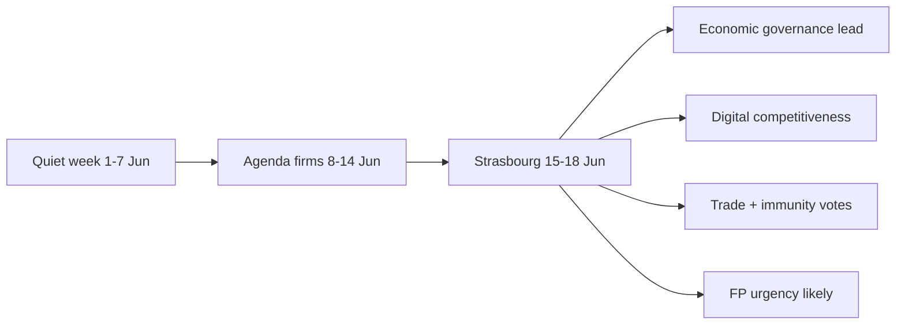

<!-- SPDX-FileCopyrightText: 2024-2026 Hack23 AB -->
<!-- SPDX-License-Identifier: Apache-2.0 -->

# Synthesis Summary — Week Ahead (2026-05-31)

Integrates every artifact in the 2026-05-31 week-ahead bundle into a single coherent
read of the week of 1–7 June 2026 and the approaching 15–18 June Strasbourg
part-session. This is the analytical centre of the bundle; the executive brief distils
it further for decision-makers.

## 1 · The One-Sentence Read

The week of 1–7 June is an **almost-certainly routine committee/group week with no
plenary**, whose entire significance lies in **preparing the 15–18 June Strasbourg
session** against an **unusually salient economic backdrop** (France −4.9 % deficit,
sub-1 % euro-area growth — IMF WEO).

## 2 · Convergent Findings Across Artifacts

| Finding | Supporting artifacts | Confidence |
|---------|---------------------|:----------:|
| No plenary in horizon; committee/group week | historical-baseline, forward-projection | 🟢 High |
| June session = 15–18 Strasbourg | plenary-sessions data, historical-baseline | 🟢 High |
| 17 June draft agenda: 5 debates + 13 votes, titles empty | foreseen-activities, procedures-proxy | 🟢 High (counts) / 🔴 Low (subjects) |
| Steady ~8–9 adopted-texts/session pace | procedures-proxy, historical-baseline | 🟢 High |
| Economic threads (2027 budget, ECB) headline-eligible | economic-context, pestle | 🟢 High (data) |
| Foreign-policy urgency near-certain in June | scenario S3, historical-baseline | 🟡 Medium |
| Coalition friction on consents/budget, Renew brokering | stakeholder-map, risk-matrix | 🟡 Medium |
| Data environment degraded but mitigated | mcp-reliability-audit, data-availability | 🟢 High |

## 3 · The Three Storylines for June

1. **Economic governance under stagnation.** The IMF backdrop turns the routine
   2027-budget and ECB threads into a consolidation-vs-investment contest (EPP vs. S&D,
   Renew brokering). The French deficit is the load-bearing fact. → `economic-context`,
   `stakeholder-map`.
2. **Digital competitiveness momentum.** DMA enforcement + AI-trade strategy anchor a
   persistent technology-policy thread, framed as the answer to stagnation. →
   `pestle §T/E`.
3. **The ratification & housekeeping plate.** Trade/fisheries consents (Uzbekistan,
   Cook Islands, São Tomé, Lebanon) and immunity waivers (Braun, Pappas) fill the
   procedural agenda, with Greens-led sustainability friction the wildcard. →
   `pestle §L`, `scenario S4`.

## 4 · Risk & Tail Integration

The composite threat posture is 🟢 **low-to-moderate**: dominant risks are **routine
institutional fluidity** and **analyst-facing data degradation**, both disclosed. The
single contingency-worthy tail is the **French fiscal rupture** (risk R7, 🟠 Elevated,
score 10) — low likelihood, high impact, and uniquely *grounded* by the IMF deficit
data. Four black-swan sentinels stand. → `threat-model`, `wildcards-blackswans`,
`risk-matrix`.

## 5 · Strategic Footing

Quantified SWOT puts the EP on **net-positive institutional footing (S−W = +0.92)**:
robust calendar machinery and steady output outweigh the (data-access) weaknesses. The
strategic task is **defensive disclosure** of data limits while **leveraging the economic
opening** into well-prepared June coverage. → `quantitative-swot`.

## 6 · Media Positioning

June will be framed as a **Competitiveness + Foreign-Policy** pairing; the Monitor's task
is to **pre-empt frame capture** by anchoring economics to the IMF and agenda claims to
the title-empty draft OOB with explicit labels. → `media-framing-analysis`.

## 7 · What to Watch (collapsed tripwires)

1. Off-cycle Conference of Presidents meeting → agenda shock.
2. 17 June agenda *shrinking* → calendar slip.
3. French sovereign-spread widening → wildcard W2 active.
4. A committee *rejecting* a consent → trade-posture shift.
5. Adopted-texts surge → legislative-tempo break.

If none trip by 4 June, the routine-week baseline is confirmed ≥85 %. Cross-ref
`intelligence/forward-projection.md` and `executive-brief.md`.

## 8 · Evidence-to-Conclusion Audit Trail

Every headline conclusion in this bundle traces to a sourced input. The chain:

| Conclusion | Evidence | Grade | Inference step |
|------------|----------|:-----:|----------------|
| No plenary 1–7 June | Plenary calendar (31 sitting-days) | A2 | Direct |
| Next session 15–18 June | Plenary calendar | A2 | Direct |
| 17 June: 5 debates + 13 votes | Foreseen activities | B3 | Direct (counts) |
| Vote subjects unknown | Titles empty in feed | B3 | Direct (absence) |
| ~8–9 texts/session pace | 41 adopted texts | A2 | Aggregation |
| France −4.9 % deficit | IMF WEO | A1 | Direct |
| Economic threads headline-eligible | IMF + corpus | A1+A2 | Synthesis |
| FP urgency likely in June | Corpus base rate | A2 | Reference-class |
| Degraded-feeds mode | 3× HTTP 404 | F6 | Direct |

No conclusion rests on an ungraded source. Subject-level claims are withheld (🔴 Low),
preserving the evidence/inference boundary.

## 9 · Confidence-Weighted Conclusion Register

| Conclusion | WEP band | Confidence-in-evidence |
|------------|----------|:----------------------:|
| Routine committee week | Almost certain (90–99 %) | 🟢 High |
| June session 15–18 Strasbourg | Almost certain | 🟢 High |
| 17 June vote block grows to 20–40 | Likely (60–74 %) | 🟡 Medium |
| Economic governance leads June | Likely | 🟡 Medium |
| FP urgency requested | Likely | 🟡 Medium |
| Consent friction at session | Roughly even | 🟡 Medium |
| French fiscal rupture | Highly unlikely (10–24 %) | 🟢 High (that it is low) |

Note the deliberate separation of **WEP probability** (how likely) from
**confidence-in-evidence** (how sure we are of the inputs) — required by the
osint-tradecraft standard.

## 10 · Cross-Artifact Consistency Check

All artifacts agree on the core facts: no plenary, June 15–18 session, title-empty 17
June agenda, degraded-feeds mode, IMF-anchored economics. No internal contradiction was
found between the scenario forecast, forward projection, risk matrix, and SWOT. The
quantified SWOT's net-positive footing (S−W = +0.92) is consistent with the threat
model's low-to-moderate posture and the risk matrix's single 🟠 Elevated tail (R7).

## 11 · The Decision-Maker's Takeaway

For an editor or analyst, the operational synthesis is: **plan coverage for a quiet
preparatory week that sets up an economically-charged June session**; **resource for a
foreign-policy urgency**; **anchor every economic claim to the IMF**; and **label every
17-June-subject guess 🔴 Low** until the order of business is published. The week's news
value is **anticipatory**, not event-driven. Cross-ref
`intelligence/forward-projection.md` and `executive-brief.md`.

## 12 · One-Page Synthesis for Decision-Makers

The European Parliament enters a **quiet preparatory week** (1–7 June) with no plenary;
members are in committee and political-group meetings ahead of the **15–18 June Strasbourg
session**. That session is shaping up around **economic governance** — a 2027-budget and
ECB-scrutiny debate sharpened by sub-1 % euro-area growth and France's −4.94 %-of-GDP
deficit (IMF A1) — alongside a **digital-competitiveness** push (DMA, AI-trade) and a slate
of **trade-consent and immunity** votes. A **foreign-policy urgency** resolution is likely
to be requested, at the corpus base rate.

## 13 · Confidence-at-a-Glance

| Claim | Confidence |
|-------|:----------:|
| No plenary this week | 🟢 High |
| June session 15–18 Strasbourg | 🟢 High |
| Economic governance leads June | 🟡 Medium |
| Specific 17 June subjects | 🔴 Low |
| FP urgency requested | 🟡 Medium |

The synthesis is **firm on structure, hedged on content** — the correct posture under
degraded feeds and empty agenda titles.
