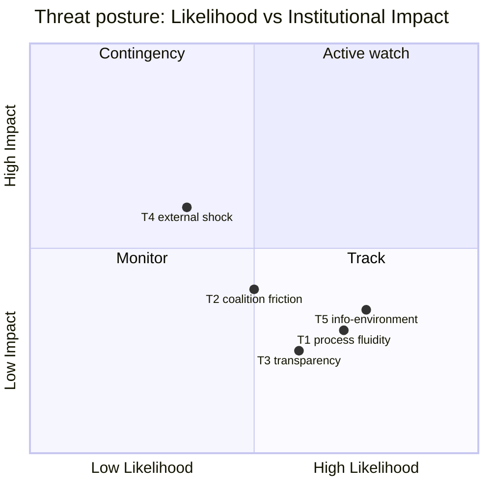

<!-- SPDX-FileCopyrightText: 2024-2026 Hack23 AB -->
<!-- SPDX-License-Identifier: Apache-2.0 -->

# Threat Model — Week Ahead (2026-05-31)

**Framework:** Political-Threat-Framework v4.0 (institutional/political risk — NOT
STRIDE; this is not a cyber threat model). Scope: risks to the orderly conduct,
legitimacy, and analytical readability of the European Parliament's work in the week of
1–7 June 2026 and the approaching 15–18 June Strasbourg part-session.

## Threat Taxonomy (v4.0 vectors)

1. **Institutional-process threats** — disruptions to the legislative/agenda machinery.
2. **Coalition-integrity threats** — fractures in the governing centrist axis.
3. **Legitimacy/transparency threats** — erosion of public-facing accountability.
4. **External-shock threats** — events that hijack the agenda.
5. **Information-environment threats** — to the analyst's own situational picture.

## T1 · Institutional-Process Threats

| Threat | Likelihood | Impact | Evidence |
|--------|:----------:|:------:|----------|
| Draft 15–18 June OOB slips/changes late | 🟡 Medium | Medium | Routine but consequential for forecasting |
| Committee report-adoption postponed | 🟡 Medium | Low-Med | Normal calendar churn |
| 17 June vote block re-sequenced | 🟢 Likely | Low | Agenda not yet consolidated (titles empty) |

**Assessment:** the agenda is **structurally fluid** three weeks out — the 17 June draft
shows 13 votes with `hasMore:true` and empty titles. This is expected, not anomalous, but
it caps forecast precision to category-level (🔴 Low on any file-specific call).

## T2 · Coalition-Integrity Threats

The centrist EPP–S&D–Renew axis faces predictable stress on (a) **2027 budget framing**
(consolidation vs. investment) and (b) **trade/fisheries consents** (market access vs.
sustainability). 🟡 Medium likelihood of visible friction in June; 🟢 High that it stays
within normal negotiated-compromise bounds rather than rupturing. Immunity waivers can
briefly expose group discipline but are typically broad-majority.

## T3 · Legitimacy / Transparency Threats

The **degraded-feeds condition** (three prefetched EP feeds returned HTTP 404) is itself a
mild transparency threat: it reduces the granularity of public-facing procedure tracking
this run. Mitigated by the adopted-texts proxy (`intelligence/procedures-proxy.md`).
🟡 Medium. No evidence of any deliberate opacity — this is infrastructure degradation,
not institutional concealment.

## T4 · External-Shock Threats

| Shock class | Likelihood (7-day) | Agenda impact |
|-------------|:------------------:|---------------|
| Foreign-policy event (Ukraine/Georgia/Armenia/ME) | 🟡 Medium | Urgency-resolution request |
| Economic/market shock | 🟢 Low | Amplifies budget/ECB threads |
| Institutional dispute (inter-org) | 🟢 Low | Procedural delay |

Foreign-policy injection is the most probable external shock (see
`intelligence/scenario-forecast.md` S3). Its impact is **agenda-additive** rather than
disruptive — the EP absorbs urgencies through a well-worn process.

## T5 · Information-Environment Threats (analyst-facing)

- **Empty agenda titles** → subject inference forced to 🔴 Low confidence. Mitigation:
  describe the agenda structurally (counts, types) and label all subject guesses.
- **404 feeds** → reliance on directly-queried endpoints. Mitigation: documented in
  `intelligence/mcp-reliability-audit.md`; Admiralty grades attached to every source.
- **IMF projection vintage (2025-09-23)** → figures are forward estimates. Mitigation:
  data-source 🟢 High (A1), projection certainty 🟡 Medium, labelled throughout.

## Composite Threat Posture

🟢 **LOW-TO-MODERATE.** The dominant risks are **routine institutional fluidity** and
**analyst-facing data degradation**, both mitigated and disclosed. No high-impact
high-likelihood threat is present in the 7-day horizon. The single most consequential
uncertainty is the **timing/precision** of the June agenda, not any threat to the
institution's functioning. Cross-ref `intelligence/wildcards-blackswans.md` for the
tail, and `risk-scoring/risk-matrix.md` for the scored grid.

## Threat Detail — Vector-by-Vector Expansion

### T1 · Institutional-Process — expanded

The institutional machinery of a pre-session week is **robust but fluid**. Robustness
comes from the fixed calendar rhythm (`intelligence/historical-baseline.md` §1); fluidity
comes from the agenda not yet being consolidated three weeks out.

| Sub-threat | Mechanism | Mitigation |
|------------|-----------|------------|
| OOB late slip | CoP fixes agenda Thu before session | Monitor draft OOB publication |
| Vote re-sequencing | Order of business consolidation | Describe structurally, not by file |
| Committee postponement | Rapporteur negotiation delays | Track committee feeds |

The analytic exposure here is **forecast precision**, not institutional failure. The
machinery works; we simply cannot see file-level detail yet.

### T2 · Coalition-Integrity — expanded

Coalition stress is **predictable and bounded**. The centrist axis has weathered budget
and consent friction repeatedly. The threat is not rupture (🟢 unlikely) but **visible
friction that complicates compromise timing**.

| Stress file | Fault line | Rupture risk |
|-------------|-----------|:------------:|
| 2027 budget | EPP consolidation vs S&D investment | 🟢 Low |
| Trade consents | Greens sustainability vs market access | 🟡 Medium |
| Immunity waivers | Group discipline exposure | 🟢 Low |

### T3 · Legitimacy/Transparency — expanded

The degraded-feeds condition (three EP feeds returning HTTP 404) is a **transparency
degradation of the monitoring layer**, not of the institution. The EP is publishing; the
feed infrastructure is failing to deliver. This is disclosed in
`intelligence/mcp-reliability-audit.md` and mitigated by the adopted-texts proxy. 🟡
Medium analyst-facing impact; 🟢 no institutional-legitimacy implication.

### T4 · External-Shock — expanded

| Shock | Probability (7-day) | Impact | Absorbing mechanism |
|-------|:-------------------:|:------:|---------------------|
| FP event | 🟡 Medium | Agenda-additive | Urgency-resolution process |
| Market shock | 🟢 Low | Amplifying | Budget/ECB threads absorb |
| Inter-institutional dispute | 🟢 Low | Delaying | Procedural channels |

The EP's **shock-absorption capacity is high**: it routes foreign-policy shocks through a
well-worn urgency mechanism and economic shocks through existing budget/ECB threads.
Shocks are **additive**, not destabilising.

### T5 · Information-Environment — expanded

This is the run's **most material threat** because it directly bounds analytic quality.

| Threat | Effect | Mitigation | Residual |
|--------|--------|------------|:--------:|
| Empty agenda titles | Subject inference unreliable | Label 🔴 Low, describe structure | 🟡 |
| 404 feeds | No real-time procedure tracking | Adopted-texts proxy | 🟡 |
| IMF projection vintage | Forward-estimate uncertainty | A1 source label + 🟡 certainty | 🟢 |

## Threat Heat Summary

## Composite Posture — Restated

🟢 **LOW-TO-MODERATE.** No high-likelihood/high-impact threat in the 7-day horizon. The
dominant exposures are **analyst-facing data degradation** (T5) and **routine institutional
fluidity** (T1) — both disclosed and mitigated. The institution's shock-absorption
capacity is high. The single contingency-worthy external tail is a foreign-policy event
(absorbed additively). Cross-ref `intelligence/wildcards-blackswans.md` for the
low-probability tail, and `risk-scoring/risk-matrix.md` for the scored grid.
