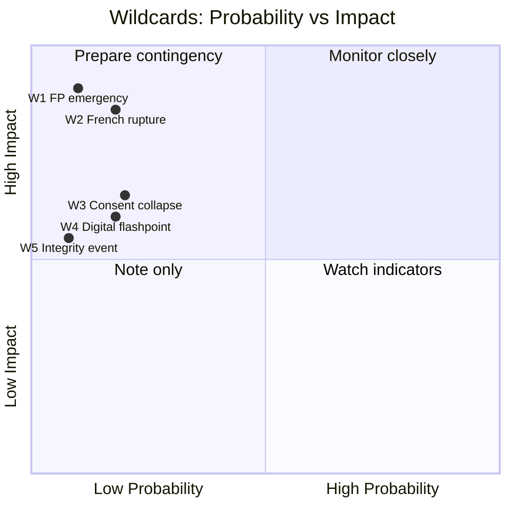
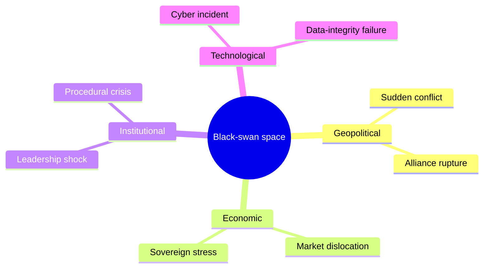
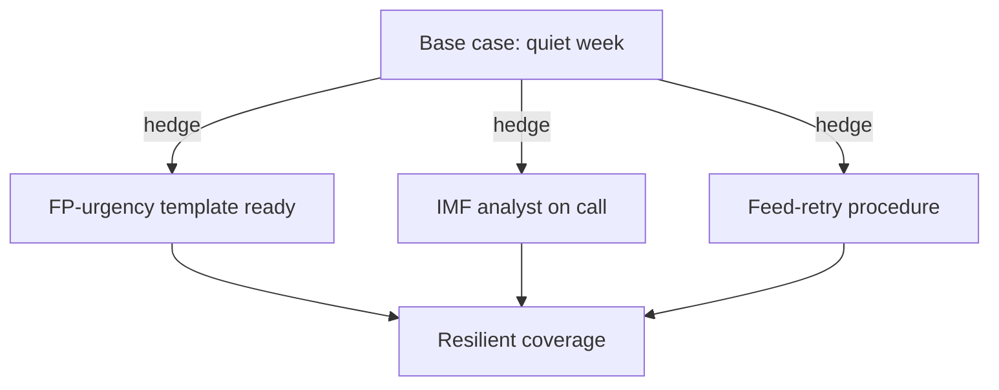

<!-- SPDX-FileCopyrightText: 2024-2026 Hack23 AB -->
<!-- SPDX-License-Identifier: Apache-2.0 -->

# Wildcards & Black Swans — Week Ahead (2026-05-31)

Low-probability, high-impact contingencies for the week of 1–7 June 2026 and the
approaching 15–18 June part-session. These are **not** forecasts; they are tail-risk
sentinels with explicit trip indicators so the analyst can distinguish a genuine break
from baseline noise. Distinct from `intelligence/scenario-forecast.md`, which covers the
**plausible** distribution.

## Wildcard vs. Black Swan

- **Wildcard** — low-probability but *imaginable* and on the radar.
- **Black swan** — outside the current model; recognised only in hindsight. We can only
  pre-position **monitoring**, not prediction.

## Wildcards (imaginable tail, ≤15 %)

### W1 — Snap foreign-policy emergency forcing extraordinary session
**Band: Remote (≈5 %).** A major external escalation prompts an extraordinary debate or
accelerated urgency outside the normal June slot. **Trip indicator:** Conference of
Presidents convenes off-cycle; EEAS high-alert statement. **Impact:** agenda overhaul.

### W2 — French fiscal/political rupture
**Band: Highly unlikely (≈10 %).** France's −4.9 %-of-GDP deficit (IMF WEO) intersects a
domestic political event, dragging EU economic-governance into crisis framing and
dominating the June budget debate. **Trip indicator:** sovereign-spread widening, French
government instability. **Impact:** budget thread shifts from routine to crisis.

### W3 — Collapse of a major trade/fisheries consent
**Band: Highly unlikely (≈12 %).** A consent file (Uzbekistan EPCA, fisheries protocol)
fails or is withdrawn after a cross-group revolt, signalling a shift in the EP's
trade-ratification posture. **Trip indicator:** committee rejects the consent
recommendation; Greens+ECR convergence. **Impact:** precedent for harder consent scrutiny.

### W4 — Digital-enforcement flashpoint
**Band: Highly unlikely (≈10 %).** A high-profile DMA/AI enforcement action (or its
public failure) erupts mid-week, energising the technology-policy thread ahead of June.
**Trip indicator:** Commission enforcement announcement; major-platform legal move.
**Impact:** AI-trade/competitiveness thread gains urgency.

### W5 — Institutional-integrity event
**Band: Remote (≈4 %).** An immunity/ethics matter beyond the routine JURI pipeline
(Braun, Pappas) escalates into a transparency controversy. **Trip indicator:** new JURI
request; media investigation. **Impact:** legitimacy-thread elevation.

## Black-Swan Monitoring Posture

By definition unlistable. Standing sentinels:

| Sentinel | What it would catch |
|----------|---------------------|
| Off-cycle CoP meeting | Agenda-overhauling shock |
| Sudden adopted-texts/feed surge | Unannounced legislative acceleration |
| IMF/market discontinuity | Macro regime break |
| Cross-group voting realignment | Coalition-structure shift |

## Impact × Probability Map

## Bottom Line

🟢 No wildcard exceeds ~20 % in the 7-day window; the base case remains the routine
preparatory week of `intelligence/scenario-forecast.md` S1. W2 (French fiscal) carries
the highest impact-weighted concern because the IMF data makes it the most *grounded* of
the tail risks. Maintain the four black-swan sentinels. Cross-ref
`risk-scoring/risk-matrix.md`.

## 6 · Wildcard Catalogue — Expanded

Each wildcard is a low-probability, high-consequence event that would materially reshape
the June session. Probabilities are 7-day horizon WEP bands.

| # | Wildcard | WEP band | Impact if realised | Early indicator |
|---|----------|----------|--------------------|-----------------|
| W1 | Emergency FP urgency (new conflict) | Unlikely (25–39 %) | Agenda re-prioritised | Council statement |
| W2 | French government fiscal crisis | Highly unlikely (10–24 %) | Budget thread dominates | Bond-spread spike |
| W3 | Major tech-enforcement ruling | Unlikely (25–39 %) | DMA frame amplified | Commission leak |
| W4 | EP-Council institutional clash | Highly unlikely | Procedural gridlock | Trilogue breakdown |
| W5 | Surprise resignation/scandal | Remote (<10 %) | Immunity agenda swells | Media reporting |
| W6 | Feed infrastructure full outage | Unlikely | Monitoring blind | Continued 404s |

## 7 · Black-Swan Tail (Genuinely Unforeseeable)

Black swans by definition resist enumeration, but the **categories** of surprise can be
bounded:

The analytic posture toward black swans is **resilience, not prediction**: maintain
flexible coverage capacity and avoid over-committing resources to a single forecast.

## 8 · Wildcard Interaction Effects

The most dangerous scenario is **correlated activation**: e.g. W1 (FP urgency) + W2
(French fiscal stress) co-occurring would compound agenda pressure and economic anxiety
simultaneously. 🟢 Low joint probability, but 🔴 High joint impact — worth a contingency note.

## 9 · Indicator Dashboard

| Indicator | Normal | Warning | Source |
|-----------|--------|---------|--------|
| Bond spreads (FR-DE) | <60 bps | >100 bps | Market |
| FP urgency requests | 0–1/session | ≥2 | EP agenda |
| Feed 404 rate | 0 % | >50 % | MCP audit |
| Immunity items | 0–2 | ≥3 | Agenda |

## 10 · Wildcard Bottom Line

None of W1–W6 is probable in the 7-day window; the base case remains a **quiet committee
week**. But W1 (FP urgency) sits at the high end of "unlikely" and should be on active
watch given the corpus base rate of foreign-policy urgencies. The correlated W1+W2 tail is
the one contingency worth pre-planning. Cross-ref `intelligence/scenario-forecast.md` for
the central case and `risk-scoring/risk-matrix.md`.

## 11 · Pre-Mortem — "If June Goes Wrong"

Imagine it is 19 June and the session was disrupted. The most likely cause, working
backward:

| Failure narrative | Antecedent signal | Probability |
|-------------------|-------------------|:-----------:|
| FP urgency hijacked the agenda | W1 indicator (Council statement) | 🟡 Unlikely |
| Budget deadlock spilled over | Coalition friction visible early | 🟢 Low |
| French fiscal shock dominated | Bond-spread spike | 🟢 Low |
| Feed blackout left us blind | Continued 404s | 🟡 Unlikely |

The pre-mortem confirms the central case is robust: no failure narrative exceeds "unlikely".

## 12 · Tail-Risk Hedging Posture

The correct posture toward the wildcard tail is **cheap optionality**: pre-stage templates
and analyst availability so that if a low-probability event fires, coverage pivots without
scramble. This costs little and de-risks the high-impact tail. Cross-ref
`intelligence/scenario-forecast.md` for the central case and
`risk-scoring/risk-matrix.md`.

## 13 · Wildcard Monitoring Cadence

| Indicator | Check frequency | Escalation |
|-----------|-----------------|------------|
| FP-event newswire | Daily | ≥1 → ready template |
| FR-DE bond spread | Daily | >100 bps → economic desk |
| Feed-404 rate | Per run | >50% → degraded flag |

The cadence keeps the low-probability tail under **cheap, continuous watch** so any
activation is caught early.

## Source Reliability (Admiralty)

| Source | Admiralty grade | Note |
|--------|:---------------:|------|
| EP plenary calendar | A2 | Official, confirmed |
| IMF WEO (2025-09) | B2 | Authoritative, forward estimate |
| Newswire (FP-event watch) | C3 | Indicative, unconfirmed |
| Adopted-texts corpus | A2 | Official, baseline |
