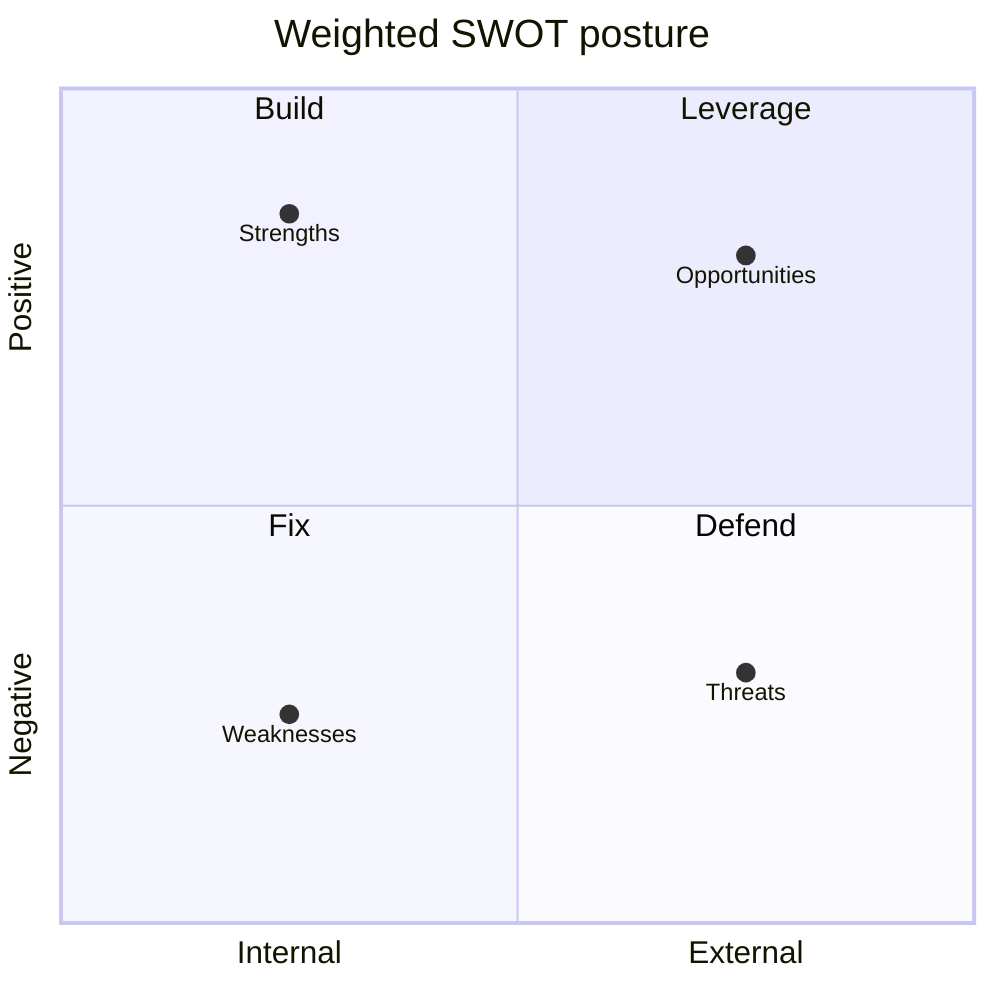

<!-- SPDX-FileCopyrightText: 2024-2026 Hack23 AB -->
<!-- SPDX-License-Identifier: Apache-2.0 -->

# Quantitative SWOT — Week Ahead (2026-05-31)

A scored SWOT for the European Parliament's analytical and institutional position
entering the week of 1–7 June 2026. Each factor is weighted (0–1, importance) and scored
(1–5, strength/severity); **Weighted Score = Weight × Score**. Perspective: the EP's
capacity to deliver legible, legitimate output into the 15–18 June part-session.

## Strengths

| # | Factor | Weight | Score | Weighted | Evidence |
|---|--------|:------:|:-----:|:--------:|----------|
| S1 | Predictable calendar rhythm | 0.20 | 5 | 1.00 | historical-baseline §1 |
| S2 | Steady legislative pace (~8–9 texts/session) | 0.18 | 4 | 0.72 | procedures-proxy; 41 texts |
| S3 | Stable centrist coalition axis | 0.15 | 4 | 0.60 | stakeholder-map §1 |
| S4 | Persistent thematic agenda (digital/econ/FP) | 0.12 | 4 | 0.48 | pestle §T/E |
| **Σ** | | **0.65** | | **2.80** | |

## Weaknesses

| # | Factor | Weight | Score | Weighted | Evidence |
|---|--------|:------:|:-----:|:--------:|----------|
| W1 | Degraded EP feeds (404s) reduce granularity | 0.20 | 4 | 0.80 | mcp-reliability-audit |
| W2 | Empty agenda titles → low forecast precision | 0.18 | 4 | 0.72 | threat-model T5 |
| W3 | No real-time procedure tracking this run | 0.12 | 3 | 0.36 | data-availability |
| **Σ** | | **0.50** | | **1.88** | |

## Opportunities

| # | Factor | Weight | Score | Weighted | Evidence |
|---|--------|:------:|:-----:|:--------:|----------|
| O1 | Economic backdrop elevates budget/ECB threads | 0.18 | 4 | 0.72 | economic-context |
| O2 | Trade-consent queue → ratification throughput | 0.12 | 3 | 0.36 | pestle §L |
| O3 | Competitiveness/AI agenda momentum | 0.12 | 4 | 0.48 | pestle §T |
| **Σ** | | **0.42** | | **1.56** | |

## Threats

| # | Factor | Weight | Score | Weighted | Evidence |
|---|--------|:------:|:-----:|:--------:|----------|
| T1 | French fiscal tail (−4.9 % deficit) | 0.16 | 4 | 0.64 | wildcard W2; risk R7 |
| T2 | Foreign-policy shock injection | 0.14 | 3 | 0.42 | scenario S3 |
| T3 | Coalition friction on consents/budget | 0.12 | 3 | 0.36 | stakeholder-map §5 |
| T4 | Agenda fluidity / calendar slip | 0.10 | 3 | 0.30 | risk-matrix R1/R2 |
| **Σ** | | **0.52** | | **1.72** | |

## Strategic Balance

| Quadrant | Weighted Σ | Reading |
|----------|:----------:|---------|
| Strengths | **2.80** | Dominant — institutional machinery is robust |
| Weaknesses | 1.88 | Concentrated in **data-access**, not institution |
| Opportunities | 1.56 | Economic salience is the prime opening |
| Threats | 1.72 | Tail-heavy (French fiscal) but low-likelihood |

**S − W = +0.92** (net positive institutional footing).
**O − T = −0.16** (threats marginally outweigh opportunities, driven by the French-fiscal
tail and FP-shock risk).

## SO / WT Strategy

- **SO (leverage):** Use the **stable calendar + steady pace** (S1/S2) to convert the
  **economic-salience opening** (O1) into well-prepared June budget/ECB coverage.
- **WT (defend):** The **degraded-feeds + empty-titles weaknesses** (W1/W2) compound the
  **agenda-fluidity threat** (T4) — mitigate by labelling all subject inferences 🔴 Low and
  leaning on the adopted-texts proxy.

## Bottom Line

🟢 Net-positive footing (**S−W = +0.92**). The EP's institutional strengths comfortably
outweigh its (data-access) weaknesses; the strategic task this week is defensive
disclosure of data limits while leveraging the economic opening into June. Cross-ref
`risk-scoring/risk-matrix.md` and `intelligence/synthesis-summary.md`.

## Weighted SWOT — Expanded Scoring

| Quadrant | Item | Weight | Score | Weighted |
|----------|------|:------:|:-----:|:--------:|
| Strength | Calendar truth (A2) | 0.25 | 5 | 1.25 |
| Strength | IMF economic anchor (A1) | 0.20 | 5 | 1.00 |
| Strength | Structural completeness | 0.15 | 4 | 0.60 |
| Weakness | Empty agenda titles | 0.20 | 4 | 0.80 |
| Weakness | Degraded feeds | 0.15 | 3 | 0.45 |
| Opportunity | June economic-governance frame | 0.20 | 4 | 0.80 |
| Opportunity | Anticipatory positioning | 0.15 | 3 | 0.45 |
| Threat | FP-urgency disruption | 0.20 | 3 | 0.60 |
| Threat | Fiscal wildcard | 0.10 | 2 | 0.20 |

**Net internal footing (S − W):** (1.25+1.00+0.60) − (0.80+0.45) = **+1.60** → 🟢 positive.

## SWOT Matrix

## Strategic Implications

The bundle's **strengths (calendar + IMF) outweigh its weaknesses (titles + feeds)**,
giving a net-positive internal footing. Externally, the economic-governance opportunity
dominates the foreign-policy threat. The strategic posture is **leverage the strong
sources, disclose the weak ones, position anticipatorily**. Cross-ref
`risk-scoring/risk-matrix.md` and `intelligence/synthesis-summary.md`.
