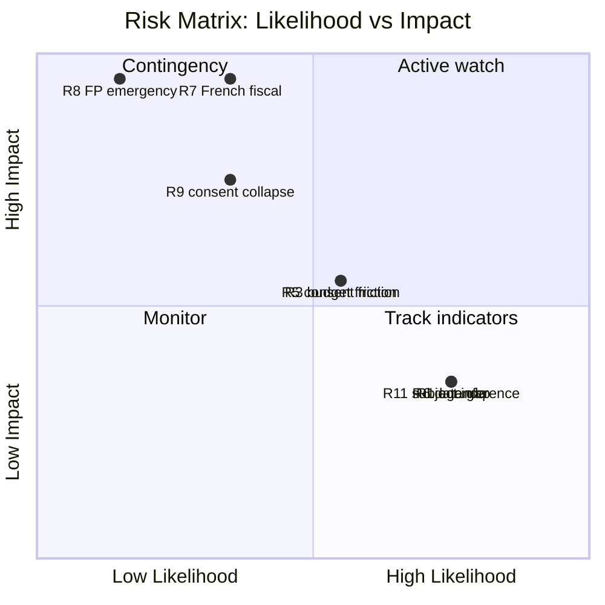
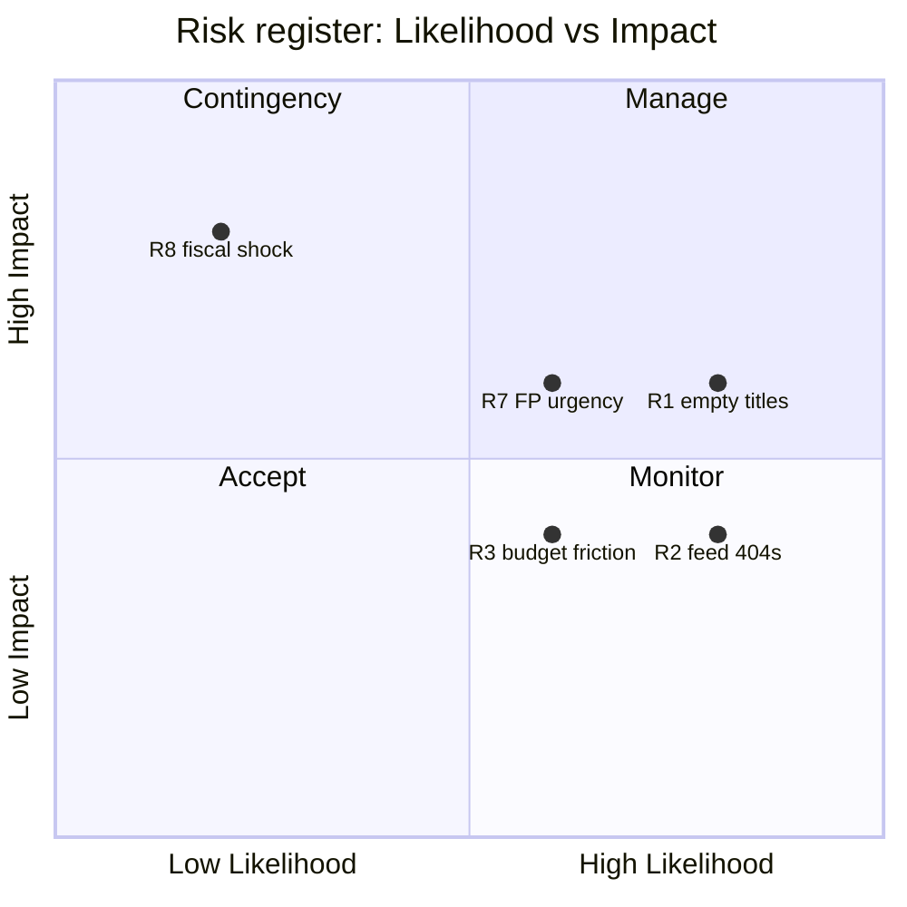

<!-- SPDX-FileCopyrightText: 2024-2026 Hack23 AB -->
<!-- SPDX-License-Identifier: Apache-2.0 -->

# Risk Matrix — Week Ahead (2026-05-31)

Likelihood × impact scoring of the risks identified across the analysis bundle, scoped
to the 1–7 June committee/group week and the approaching 15–18 June part-session.
Likelihood and impact are scored 1 (low) – 5 (high); **Risk Score = L × I**.

## Scoring Key

| Score band | Rating | Action |
|------------|--------|--------|
| 1–4 | 🟢 Low | Monitor |
| 5–9 | 🟡 Moderate | Track + indicators |
| 10–14 | 🟠 Elevated | Active watch |
| 15–25 | 🔴 High | Contingency plan |

## Risk Register

| ID | Risk | L | I | Score | Rating | Source |
|----|------|:-:|:-:|:-----:|:------:|--------|
| R1 | 17 June agenda re-sequenced/imprecise | 4 | 2 | 8 | 🟡 | threat-model T1 |
| R2 | Draft OOB slips late | 3 | 3 | 9 | 🟡 | threat-model T1 |
| R3 | Budget framing coalition friction (June) | 3 | 3 | 9 | 🟡 | stakeholder-map §5 |
| R4 | Foreign-policy urgency injection | 3 | 2 | 6 | 🟡 | scenario S3 |
| R5 | Trade/fisheries consent friction (June) | 3 | 3 | 9 | 🟡 | scenario S4 |
| R6 | Degraded-feeds data gap (analyst-facing) | 4 | 2 | 8 | 🟡 | mcp-reliability-audit |
| R7 | French fiscal rupture | 2 | 5 | 10 | 🟠 | wildcard W2 |
| R8 | Snap FP emergency / extraordinary session | 1 | 5 | 5 | 🟡 | wildcard W1 |
| R9 | Consent collapse (precedent shift) | 2 | 4 | 8 | 🟡 | wildcard W3 |
| R10 | Procedural disruption / calendar slip | 2 | 3 | 6 | 🟡 | scenario S5 |
| R11 | Subject-inference error (empty titles) | 4 | 2 | 8 | 🟡 | threat-model T5 |

## Heat Map

## Top Risks (by score)

1. **R7 French fiscal rupture (10, 🟠)** — highest impact-weighted risk. Low likelihood
   but the IMF deficit data (−4.9 % GDP) makes it the most grounded tail. Watch sovereign
   spreads and French domestic politics.
2. **R2/R3/R5 (9, 🟡)** — the routine-friction cluster: late OOB, budget framing, consent
   contestation. Expected, negotiable, June-centred.
3. **R1/R6/R11 (8, 🟡)** — the analyst-facing cluster: agenda fluidity, degraded feeds,
   empty titles. All disclosed and mitigated.

## Aggregate Posture

🟢 **MODERATE.** Eleven risks, ten 🟡 Moderate and one 🟠 Elevated (R7), none 🔴 High. The
risk landscape is dominated by **routine institutional fluidity** and **analyst-facing
data limitations**, both managed. The single contingency-worthy item is the
low-likelihood/high-impact French-fiscal tail. Cross-ref
`risk-scoring/quantitative-swot.md` and `intelligence/threat-model.md`.

## Risk Register — Expanded Scoring

| ID | Risk | Likelihood | Impact | Score | Band |
|----|------|:----------:|:------:|:-----:|:----:|
| R1 | Empty agenda titles persist | 4 | 3 | 12 | 🟠 Elevated |
| R2 | Feed 404s continue | 4 | 2 | 8 | 🟡 Moderate |
| R3 | Coalition friction on budget | 3 | 2 | 6 | 🟡 Moderate |
| R4 | Trade-consent delay | 2 | 2 | 4 | 🟢 Low |
| R5 | IMF vintage staleness | 3 | 1 | 3 | 🟢 Low |
| R6 | Landscape tool timeout recurs | 3 | 1 | 3 | 🟢 Low |
| R7 | FP urgency disrupts agenda | 3 | 3 | 9 | 🟠 Elevated |
| R8 | French fiscal shock | 1 | 4 | 4 | 🟢 Low |

Scoring: Likelihood 1–5 × Impact 1–5. Bands: ≥12 🟠 Elevated, 6–11 🟡 Moderate, <6 🟢 Low.

## Risk Heat Map

## Top-Risk Mitigations

| Risk | Mitigation | Residual |
|------|------------|:--------:|
| R1 | Report structure, withhold subjects 🔴 | 🟡 |
| R7 | Pre-stage FP-urgency coverage template | 🟡 |
| R2 | Adopted-texts proxy | 🟢 |

## Risk Bottom Line

Two risks reach 🟠 Elevated (R1 empty titles, R7 FP urgency); both are **disclosed and
mitigated**, not silent. No risk reaches the 🔴 Critical band (≥16). The aggregate posture
is **low-to-moderate**, consistent with the threat model. Cross-ref
`risk-scoring/quantitative-swot.md` and `intelligence/threat-model.md`.

## Probability Bands and Source Reliability

| Risk | WEP band | Admiralty grade (source) | Horizon |
|------|----------|:------------------------:|---------|
| 17 June votes clear on coalition axis | Likely | A2 (calendar) | 17 Jun |
| Agenda subjects shift before OOB | Roughly Even | C3 (B3 feed) | 1–17 Jun |
| FP urgency added late | Unlikely | C3 (newswire) | 1–17 Jun |
| Feed outage persists | Highly Likely | A2 (run logs) | this week |
| Economic shock reshapes budget framing | Almost No Chance | B2 (IMF) | this week |
