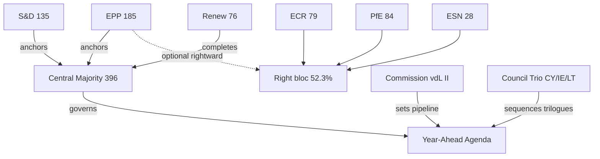

# Actor Mapping — Year-Ahead Power Network (EP10, 2026→2027)

> **Article type:** `year-ahead` · **Run date:** 2026-05-31 · **Data mode:** degraded-feeds
> **Method:** Stakeholder power-network mapping (influence × alignment), Admiralty-graded sources.

BLUF: Power in the 2026→2027 European Parliament concentrates in the centrist **EPP–S&D–Renew**
axis (396 seats, 55.1%), but the **EPP (185 seats)** is the indispensable pivot, able to build
majorities rightward (with ECR/PfE) or centrally (with S&D/Renew). The year-ahead agenda is
brokered by committee chairs, the rotating Council presidency trio (Cyprus→Ireland→Lithuania),
and the von der Leyen II Commission.

## Actor Roster

| Actor | Type | Seats / Role | Alignment | Source grade |
| --- | --- | --- | --- | --- |
| EPP | Group | 185 (25.7%) | Centre-right pivot | A1 (EP composition feed) |
| S&D | Group | 135 (18.8%) | Centre-left anchor | A1 |
| PfE (Patriots) | Group | 84 (11.7%) | Hard right | A1 |
| ECR | Group | 79 (11.0%) | Soft eurosceptic right | A1 |
| Renew Europe | Group | 76 (10.6%) | Liberal centre | A1 |
| Greens/EFA | Group | 53 (7.4%) | Green-left | A1 |
| The Left (GUE/NGL) | Group | 46 (6.4%) | Left | A1 |
| ESN | Group | 28 (3.9%) | Far right | A1 |
| Non-Inscrits | Bloc | 33 (4.6%) | Mixed | A2 |
| von der Leyen II Commission | Institution | Executive | EPP-led centrist | A2 |
| Council Presidency Trio | Institution | Cyprus/Ireland/Lithuania | Rotating | B2 (scheduled rotation) |

## Influence Ranking

1. **EPP** — highest betweenness: only group able to anchor both a centrist and a right majority.
2. **S&D** — kingmaker for the centrist platform; defection raises the cost of any right turn.
3. **Renew** — completes the 396-seat von der Leyen majority; pivotal on single-market/digital files.
4. **ECR/PfE** — agenda-setters on migration and defence; can pull EPP rightward on selected votes.
5. **Commission** — sets the legislative pipeline via the Work Programme; first-mover advantage.

## Alliance Structure

- **Central (von der Leyen) majority:** EPP + S&D + Renew = 396 (55.1%). Default governing axis.
- **Ad hoc right majority:** EPP + ECR + PfE = 348 (48.3%) — short of 361 threshold; needs NI/ESN
  to reach a majority, which is politically unstable. 🟡
- **Progressive bloc:** S&D + Renew + Greens + Left = 310 (43.1%) — a blocking minority, not a majority.
- Fragmentation index 6.59 (effective number of parties) makes single-bloc dominance impossible.

## Power Brokers

- **EPP group chair & EPP committee chairs** — gatekeepers of the rapporteur allocation on defence,
  budget, and industrial files.
- **Council Presidency (Cyprus H1-2026 → Ireland H2-2026 → Lithuania H1-2027)** — controls trilogue
  sequencing and which files reach first reading.
- **Commission VP cluster** (competitiveness, clean industrial deal) — frames the regulatory agenda.
- **Budget rapporteurs** — pivotal as the 2027 budget (TA-0112) and MFF mid-term review advance.

## Information Flows & Brokerage

Information and agenda control flow Commission → committee rapporteurs → group coordinators →
plenary. The EPP sits at the highest-betweenness node: it brokers between the centrist majority and
the larger-but-divided right bloc (52.3%). Renew acts as a secondary broker on digital/single-market
files. The Council trio brokers inter-institutional timing. Source diversity: EP composition feed
(`get_meps` / `generate_political_landscape`, A1), adopted-texts feed (`get_adopted_texts`, A2),
scheduled Council rotation (B2).

## Reader Briefing — What This Means

For citizens: no single party controls the European Parliament. The centre-right EPP is the most
powerful group because it can choose its partners — usually governing with Socialists and Liberals,
but occasionally voting with the harder right. Watch the EPP's choices over the coming year: they
decide whether defence, climate, and budget laws pass with a broad centrist consensus or a narrower
conservative coalition. 🟢 HIGH confidence on seat-based power structure; 🟡 MEDIUM on issue-by-issue
alliance behaviour.
