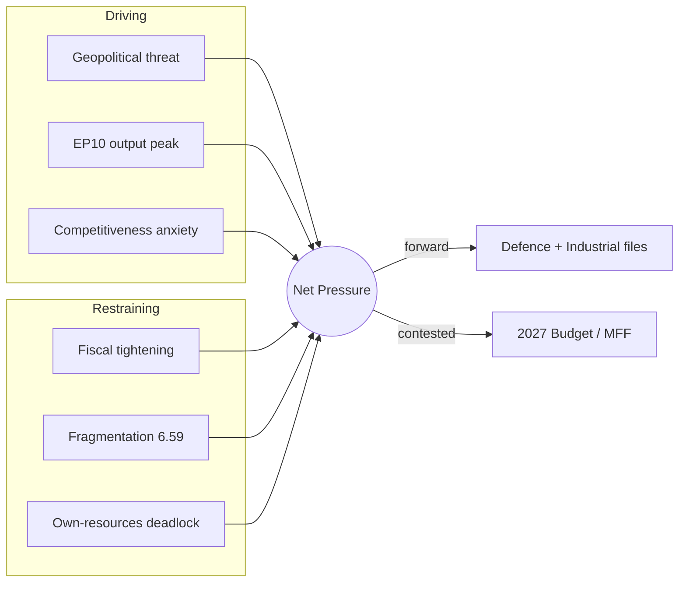

# Forces Analysis — Year-Ahead Drivers & Constraints (EP10, 2026→2027)

> **Article type:** `year-ahead` · **Run date:** 2026-05-31 · **Data mode:** degraded-feeds
> **Method:** Force-field analysis (Lewin) applied to the EP legislative agenda for the coming year.

BLUF: The dominant net pressure in 2026→2027 pushes **toward strategic-autonomy legislating**
(defence, clean industry, digital sovereignty), driven by geopolitical threat and the EP10 output
peak, but restrained by **fiscal tightening** (France −4.94%/GDP, Germany −3.78%/GDP per IMF WEO)
and a fragmented chamber. Net vector: 🟢 strong forward momentum on defence/industrial files,
🟡 contested momentum on budget and own-resources.

## Issue Frame

The coming parliamentary year is framed by three converging questions: (1) how fast and how far the
EU funds common defence; (2) whether the Clean Industrial Deal can deliver competitiveness without
new common borrowing; and (3) how the 2027 budget and MFF mid-term review reconcile rising defence
and green ambitions with deteriorating national fiscal positions. This frame sits inside the EP10
mid-term peak (2027: 120 projected legislative acts, factor 1.15).

## Driving Forces (pushing the agenda forward)

| Force | Strength | Evidence |
| --- | --- | --- |
| Geopolitical threat / Ukraine | ●●●●● | Ukraine loan (TA-0010); defence industrial strategy momentum |
| EP10 productivity peak | ●●●●○ | Derived intelligence: 2027 peak (120 acts), 2028 highest (125) |
| Competitiveness anxiety | ●●●●○ | Clean Industrial Deal; Draghi-report follow-through |
| Digital sovereignty | ●●●○○ | AI strategy (TA-0183), DMA enforcement (TA-0160) |
| Centrist majority cohesion | ●●●○○ | EPP+S&D+Renew 396 seats (55.1%) when aligned |

## Restraining Forces (slowing or blocking)

| Force | Strength | Evidence |
| --- | --- | --- |
| National fiscal tightening | ●●●●● | IMF: FRA −4.94%/GDP 2026, DEU −3.78%→−4.23% 2026-27 |
| Parliamentary fragmentation | ●●●●○ | Effective parties 6.59; no single-bloc majority |
| Right-bloc divergence | ●●●○○ | Right 52.3% but split EPP/ECR/PfE/ESN — cannot govern jointly |
| Own-resources deadlock | ●●●○○ | Member-state resistance to new common borrowing |
| Inflation re-acceleration risk | ●●○○○ | DEU inflation 2.65% (2026), ITA 2.64% — limits fiscal space |

## Net Pressure Assessment

- **Defence / strategic autonomy:** Driving forces clearly dominate → 🟢 HIGH forward momentum.
- **Clean Industrial Deal:** Forward momentum, but financing is the binding constraint → 🟡 MEDIUM.
- **2027 budget / own resources:** Roughly balanced; fiscal restraint nearly cancels ambition → 🟡
  CONTESTED. Expect incremental rather than transformative outcomes.
- **Digital enforcement (AI/DMA):** Steady administrative momentum, low fiscal cost → 🟢 MEDIUM-HIGH.

## Intervention Points

1. **Budget rapporteur negotiations (autumn 2026)** — the leverage point where fiscal restraint and
   defence ambition collide; trilogue framing decides the 2027 envelope.
2. **MFF mid-term review** — structural intervention point for own-resources and defence financing.
3. **Council presidency handovers** (Cyprus→Ireland→Lithuania) — each can re-sequence priority files.
4. **EPP coalition choice** — the single highest-leverage variable: a centrist vs. rightward majority
   changes outcomes on migration, climate, and defence.

## Reader Briefing — What This Means

For citizens: the EU wants to spend more on defence and green industry, but most member states are
cutting deficits, so the coming year is a tug-of-war between ambition and money. Defence and digital
rules will likely move forward; the big budget fights are closer calls. The result affects how much
the EU can fund jointly versus leaving it to national governments. 🟢 HIGH confidence on the
direction of force; 🟡 MEDIUM on which restraining force binds hardest.
