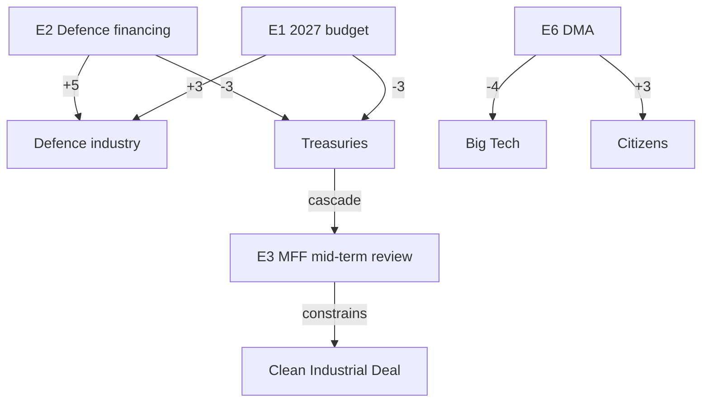

# Impact Matrix — Year-Ahead Event × Stakeholder Mapping (EP10, 2026→2027)

> **Article type:** `year-ahead` · **Run date:** 2026-05-31 · **Data mode:** degraded-feeds
> **Method:** Event–stakeholder impact heat-mapping with cascade tracing. Admiralty-graded sources.

BLUF: The highest-impact events of the coming parliamentary year — the **2027 budget cycle**,
**defence industrial financing**, and the **MFF mid-term review** — concentrate their effects on
member-state treasuries, defence industry, and EU citizens-as-taxpayers, with cascade effects into
energy, digital, and enlargement policy. Heat is highest where fiscal restraint meets strategic
ambition. Confidence: 🟢 HIGH on event set, 🟡 MEDIUM on timing under degraded feeds.

## Event List (year-ahead horizon, 2026-05-31 → 2027-05-31, +730d carry-forward)

| # | Event | Expected window | Source grade |
| --- | --- | --- | --- |
| E1 | 2027 EU budget guidelines → draft → reading | Q2 2026 (TA-0112) → autumn 2026 | A2 |
| E2 | European Defence Industrial Strategy / financing | rolling 2026-2027 | B2 |
| E3 | MFF mid-term review + post-2027 framework prep | 2026-2027 | B2 |
| E4 | Clean Industrial Deal legislative tranche | rolling 2026 | A2 |
| E5 | AI Act implementation + AI strategy (TA-0183) | 2026-2027 | A2 |
| E6 | DMA enforcement decisions (TA-0160) | rolling | A2 |
| E7 | Ukraine financial support / loan follow-through (TA-0010) | 2026 | A2 |
| E8 | EP10 productivity peak (2027: 120 acts) | 2027 | A2 (derived) |
| E9 | Electoral reform / European Electoral Act (TA-0006) | 2026-2027 | B2 |

## Stakeholder Set

Member-state treasuries · Defence industry · EU citizens (taxpayers/consumers) · Energy-intensive
industry · Big Tech platforms · Ukraine · Candidate (enlargement) states · EP political groups ·
European Commission.

## Impact Matrix (event × stakeholder, −5 harm … +5 benefit)

| Event \ Stakeholder | Treasuries | Defence ind. | Citizens | Energy ind. | Big Tech | Ukraine |
| --- | --- | --- | --- | --- | --- | --- |
| E1 2027 budget | −3 | +3 | ±2 | +1 | 0 | +2 |
| E2 Defence financing | −3 | +5 | ±1 | 0 | 0 | +4 |
| E3 MFF mid-term | −2 | +2 | ±2 | +1 | 0 | +2 |
| E4 Clean Industrial Deal | −2 | 0 | +2 | +4 | 0 | 0 |
| E5 AI Act/strategy | 0 | +1 | +2 | +1 | −3 | 0 |
| E6 DMA enforcement | +1 | 0 | +3 | 0 | −4 | 0 |
| E7 Ukraine support | −2 | +2 | ±1 | 0 | 0 | +5 |

## Heat Assessment

- **Hottest cell:** E2 × Treasuries (−3) vs E2 × Defence industry (+5) — the defence-financing event
  generates the steepest benefit/harm gradient → maximum political heat. 🟢
- **Sustained warm zone:** Budget/MFF events (E1, E3) impose distributed treasury costs with diffuse
  citizen benefit — chronic friction rather than acute. 🟡
- **Concentrated-loser zone:** Big Tech under E5/E6 (−3/−4) — concentrated opposition, well-resourced
  lobbying; expect contested trilogues. 🟢
- **Clear-winner zone:** Ukraine (E7 +5) and defence industry (E2 +5) — strong, organised beneficiaries.

## Cascade Analysis

1. **Fiscal cascade:** Treasury pressure from E1/E2 cascades into E3 (MFF review), tightening the
   envelope for E4 (Clean Industrial Deal) — defence ambition crowds green financing. 🟢
2. **Digital cascade:** E5 (AI) and E6 (DMA) reinforce each other into a coherent platform-regulation
   front, raising compliance costs that cascade to EU consumers via service changes. 🟡
3. **Geopolitical cascade:** E7 (Ukraine) sustains E2 (defence) salience; any escalation amplifies both.
4. **Electoral cascade:** E9 (electoral reform) interacts with the ~36-month runway to June 2029,
   shaping group positioning even though the electoral overlay is not yet armed. 🟡

## Reader Briefing — What This Means

For citizens: the biggest decisions this year are about money — how much the EU spends jointly on
defence and green industry, and who pays. Defence firms and Ukraine are the clear winners; national
treasuries and big technology platforms face the biggest costs. Most effects on ordinary people are
indirect: taxes, energy prices, and the rules governing the apps and services you use.
🟢 HIGH confidence on the impact direction; 🟡 MEDIUM on exact magnitudes and timing.
