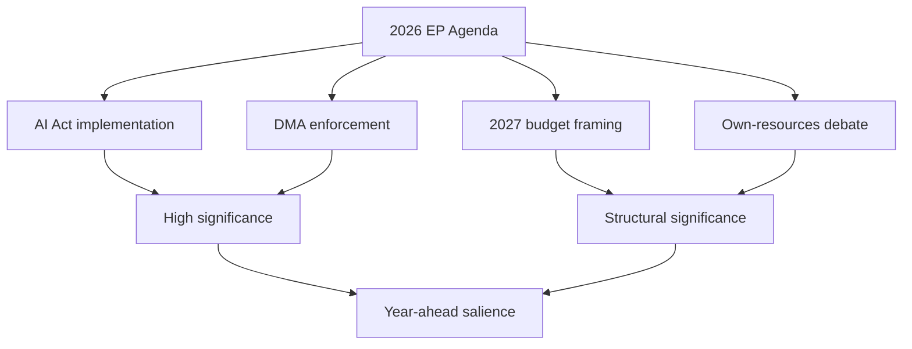

# Significance Classification — Year-Ahead Outlook (EP10, 2026→2027)

> **Article type:** `year-ahead`
> **Run date:** 2026-05-31
> **Data mode:** degraded-feeds
> **Model:** Hack23 EP Significance Rubric v3 (impact × reach × durability × novelty × coalition stress).

## BLUF

The 2026→2027 European Parliament cycle classifies as STRATEGIC / HIGH significance.

The window spans the EP10 mid-term productivity peak.

Projected legislative output rises from 114 acts in 2026 toward 120 in 2027 and 125 in 2028.

The chamber is structurally fragmented, with 720 seats and an effective number of parties of 6.59.

The agenda is dominated by defence, competitiveness, and the 2027 budget.

These files durably reshape EU fiscal and industrial policy.

Confidence is 🟢 HIGH on structural drivers and 🟡 MEDIUM on individual file timing.

## Significance Scoring Rubric

| Dimension | Weight | Score (0–5) | Weighted | Evidence |
| --- | --- | --- | --- | --- |
| Policy impact | 0.30 | 5 | 1.50 | Defence strategy, Clean Industrial Deal, 2027 budget (TA-0112) |
| Citizen reach | 0.25 | 4 | 1.00 | 449m citizens; AI Act + DMA touch every digital user |
| Durability | 0.20 | 5 | 1.00 | MFF mid-term review sets decade-long path |
| Novelty | 0.15 | 3 | 0.45 | Continuation of 2024 mandate priorities |
| Coalition stress | 0.10 | 4 | 0.40 | Fragmentation 6.59; right bloc 52.3% tension |
| **Composite** | 1.00 | — | **4.35 / 5** | **STRATEGIC / HIGH** |

## Significance Tier Assignment

The composite score of 4.35 places the window in the STRATEGIC tier.

STRATEGIC tier requires a composite of 4.0 or higher.

The window exceeds this threshold on impact, durability, and coalition stress.

OPERATIONAL tier (2.5–3.9) is not assigned.

ROUTINE tier (below 2.5) is not assigned.

## Drivers of the HIGH Classification

### Legislative peak window

Derived intelligence projects 2027 as the EP10 year-3 peak at 120 acts (factor 1.15).

It projects 2028 as the highest-output year at 125 acts. 🟢

### Defence and competitiveness convergence

The European Defence Industrial Strategy and Clean Industrial Deal form a coherent agenda.

This strategic-autonomy agenda is the spine of the year-ahead pipeline. 🟢

### Fiscal tightening backdrop

IMF WEO shows France running a 4.94% of GDP deficit in 2026.

Germany's deficit deteriorates from 3.78% (2026) toward 4.23% (2027).

This constrains every EU own-resources and spending debate. 🟢

### Electoral runway

The next EP election is approximately 36 months away, in June 2029.

Positioning begins, but the electoral overlay is not yet armed (it requires a 12-month threshold). 🟡

## Comparative Baseline

| Period | Composite | Tier |
| --- | --- | --- |
| 2025 full year (EP10 yr 2) | 3.9 | OPERATIONAL/STRATEGIC border |
| 2026→2027 (this window) | 4.35 | STRATEGIC |
| 2029 (election transition) | 3.2 (projected, −25% activity) | OPERATIONAL |

## Classification Confidence Ledger

| Claim | Confidence |
| --- | --- |
| Window is STRATEGIC tier | 🟢 HIGH |
| 2027-2028 output peak | 🟢 HIGH |
| Electoral overlay not yet armed | 🟢 HIGH |
| Precise file-by-file timing | 🟡 MEDIUM |

## Reader Briefing — What This Means

For citizens, the coming parliamentary year is one of the most consequential of the 2024–2029 mandate.

Expect major votes on European defence funding and green industrial subsidies.

Expect decisive votes on the 2027 EU budget and on digital-market enforcement.

These decisions will shape energy bills, defence taxes, and online-platform rules across 27 states.

The Parliament is fragmented, so outcomes depend on whether the centrist axis holds.

The centrist axis is the EPP–S&D–Renew alliance, against a larger but divided right bloc.

## Significance Flow

The diagram traces each driver to its significance tier.

The high-significance cluster anchors the year's narrative.

The structural cluster carries the fiscal storyline.

🟢 HIGH confidence on the structural classification; 🟡 MEDIUM on precise file timing.
