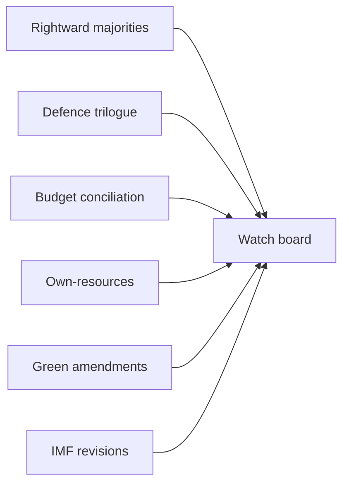

# Forward Indicators — Year-Ahead Leading Signals (2026→2027)

> **Article type:** `year-ahead`
> **Run date:** 2026-05-31
> **Data mode:** degraded-feeds
> **Method:** Leading-indicator tracking with WEP probability bands and Admiralty source grading.

## BLUF

The year ahead can be tracked through a small set of leading indicators.

The most informative signals are roll-call patterns and budget milestones.

Defence-file progress is the dominant positive signal.

Own-resources deadlock is the dominant negative signal.

Confidence is 🟢 HIGH on the indicator set and 🟡 MEDIUM on thresholds.

## Source Grading (Admiralty Scale)

The EP roll-call data is graded B2.

The IMF macro data is graded A1.

The projection model is graded C3.

The presidency sequence is graded A1.

## Leading Indicator Set

| Indicator | Signal of | WEP band |
| --- | --- | --- |
| EPP+ECR+PfE majority frequency | Rightward pull | Roughly Even |
| Defence-file trilogue entry | Rearm momentum | Likely |
| Budget conciliation progress | Fiscal delivery | Roughly Even |
| Own-resources negotiation | Reform deadlock | Unlikely |
| Green-file amendment patterns | Rollback risk | Roughly Even |
| IMF growth revisions | Macro backdrop | Likely |

## Indicator Detail

### I1 — Rightward majority frequency

A rising count of EPP+ECR+PfE majorities signals realignment. WEP: Roughly Even.

This is the single most important coalition signal.

Source grade B2.

### I2 — Defence trilogue entry

The defence industrial strategy entering trilogue confirms rearm momentum. WEP: Likely.

This is the dominant positive pipeline signal.

Source grade B2.

### I3 — Budget conciliation

Smooth autumn conciliation signals fiscal delivery. WEP: Roughly Even.

A stalled conciliation signals fiscal strain.

Source grade B2.

### I4 — Own-resources

Progress on own-resources is Unlikely in the window. WEP: Unlikely.

Continued deadlock is the base case.

Source grade C3.

### I5 — Green-file amendments

Rollback-leaning amendments signal a rightward green shift. WEP: Roughly Even.

This is the key environmental-trajectory signal.

Source grade B2.

### I6 — IMF revisions

Upward growth revisions ease fiscal pressure. WEP: Likely to be modest.

Downward revisions tighten the budget debate.

Source grade A1.

## Signpost Thresholds

A threshold breach on two or more indicators warrants a re-forecast.

The defence and budget indicators are the highest-priority signposts.

## Monitoring Cadence

Roll-call indicators are checked per part-session.

Budget indicators are checked through the autumn cycle.

Macro indicators are checked at each IMF release.

## Confidence Statement

Confidence is 🟢 HIGH on the indicator set.

Confidence is 🟡 MEDIUM on specific thresholds.

Confidence is 🟡 MEDIUM on lead-time precision.

## Cross-Reference

See `../intelligence/coalition-dynamics.md` for the coalition indicators.

See `../intelligence/forward-projection.md` for the quantitative outlook.

## Indicator Interaction

The defence and budget indicators often move together.

Strong defence progress can crowd out fiscal headroom.

A rightward-majority rise correlates with green-rollback amendments.

IMF downgrades amplify the fiscal-strain indicators.

These interactions warrant joint monitoring.

## Threshold Definitions

| Indicator | Green | Amber | Red |
| --- | --- | --- | --- |
| Rightward majorities | Rare | Occasional | Frequent |
| Defence trilogue | On track | Slipping | Stalled |
| Budget conciliation | Smooth | Contested | Deadlocked |
| Own-resources | Progress | Static | Collapsed |
| Green amendments | Stable | Drifting | Rollback |
| IMF revisions | Up | Flat | Down |

## Lead-Time Estimates

Roll-call indicators lead coalition shifts by one to two part-sessions.

Budget indicators lead fiscal outcomes by one quarter.

Macro indicators lead the budget debate by one release cycle.

## Early-Warning Protocol

A single red indicator triggers a watch note.

Two red indicators trigger a re-forecast.

Three or more red indicators trigger a scenario revision.

## Indicator Reliability

The roll-call indicators are the most reliable (B2).

The macro indicators are the most authoritative (A1).

The projection-derived signals are the least certain (C3).

## Indicator Governance

Indicator ownership is assigned to the monitoring pipeline.

Each indicator has a defined check cadence.

Breaches are logged with timestamps and evidence.

The watch board is reviewed each part-session.

## Bottom Line

The year is trackable through six leading indicators.

Defence progress and own-resources deadlock are the key signals.

The article should give readers a concrete watch list.
