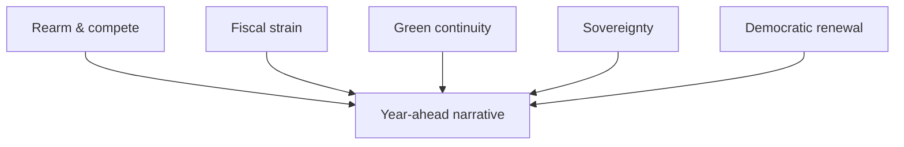

# Media Framing Analysis — Year-Ahead Narrative Map (2026→2027)

> **Article type:** `year-ahead`
> **Run date:** 2026-05-31
> **Data mode:** degraded-feeds
> **Method:** Framing analysis of likely media narratives around the EP year ahead.

## BLUF

The year-ahead story will be framed through competing narratives.

The dominant frame is "Europe rearms and competes."

A counter-frame is "fragmentation and fiscal strain."

A third frame is "green continuity versus rollback."

Confidence is 🟢 HIGH on the frame set and 🟡 MEDIUM on salience.

## Primary Frames

| Frame | Core message | Likely carriers |
| --- | --- | --- |
| Rearm & compete | Europe builds strategic autonomy | Centre-right, defence press |
| Fiscal strain | Budgets are stretched thin | Fiscal hawks, markets |
| Green continuity | Climate agenda persists | Greens, environmental press |
| Sovereignty | National control versus EU | Right groups |
| Democratic renewal | Reform and transparency | Pro-EU civil society |

## Frame Salience by Quarter

The rearm frame peaks around defence-file milestones.

The fiscal frame peaks during the autumn budget cycle.

The green frame peaks around Clean Industrial Deal instruments.

The sovereignty frame peaks around migration votes.

## Narrative Drivers

The defence agenda drives the dominant rearm frame.

The 2027 budget drives the fiscal-strain frame.

The Clean Industrial Deal drives the green-continuity frame.

Migration votes drive the sovereignty frame.

## Competing Interpretations

Centre-right media will emphasise competitiveness and security.

Left media will emphasise social and environmental safeguards.

Right media will emphasise national sovereignty.

Markets will emphasise fiscal sustainability.

## Framing Risks

Over-indexing on the rearm frame can obscure fiscal trade-offs. 🟡

Over-indexing on fragmentation can obscure real centrist delivery. 🟡

The article should balance the frames, not adopt one.

## Audience Considerations

A general audience needs the frames made explicit.

A specialist audience needs the file-level detail.

A multilingual audience needs culturally neutral framing.

## Neutrality Guardrails

The article must present frames descriptively, not endorse them.

It must attribute frames to their likely carriers.

It must avoid loaded language in any language version.

## Frame-to-Event Map

| Event | Dominant frame |
| --- | --- |
| Defence industrial strategy | Rearm & compete |
| 2027 budget | Fiscal strain |
| Clean Industrial Deal | Green continuity |
| Migration votes | Sovereignty |
| Electoral Act | Democratic renewal |

## Confidence Statement

Confidence is 🟢 HIGH on the frame set.

Confidence is 🟡 MEDIUM on relative salience.

Confidence is 🟡 MEDIUM on quarter-by-quarter timing.

## Cross-Reference

See `../intelligence/stakeholder-map.md` for the actor-to-frame linkage.

See `../intelligence/scenario-forecast.md` for the scenario-to-frame linkage.

## Frame Lifecycle

Frames emerge around major files and fade between them.

The rearm frame is durable across the whole window.

The fiscal frame is seasonal, peaking in the autumn.

The green frame is event-driven by Clean Industrial Deal instruments.

The sovereignty frame is triggered by migration votes.

## Language-Version Considerations

The English version sets the baseline framing.

The German and French versions emphasise fiscal and defence angles.

The Nordic versions emphasise climate continuity.

The Arabic and Hebrew versions require careful neutrality on security.

The East Asian versions need additional institutional context.

## Counter-Framing Discipline

Each dominant frame must carry its credible counter-frame.

The rearm frame is balanced by the fiscal-cost frame.

The green frame is balanced by the competitiveness frame.

The sovereignty frame is balanced by the integration frame.

## Narrative Risks Table

| Risk | Effect |
| --- | --- |
| Single-frame capture | Loss of balance |
| Loaded language | Neutrality breach |
| Over-technical detail | Reader drop-off |
| Cultural mistranslation | Frame distortion |

## Editorial Checklist

Attribute every frame to its likely carrier.

Present at least two frames per major file.

Avoid endorsing any single narrative.

Keep language neutral across all versions.

## Cross-Lingual Framing Matrix

| Language | Lead emphasis |
| --- | --- |
| EN | Rearm and compete |
| DE | Fiscal discipline and defence |
| FR | Strategic autonomy |
| SV/DA/NO/FI | Climate continuity |
| ES | Competitiveness and jobs |
| NL | Single-market integrity |
| AR/HE | Security neutrality |
| JA/KO/ZH | Institutional context |

## Frame Durability Ranking

The rearm frame is the most durable across the window.

The fiscal frame is the most seasonal.

The green frame is the most event-driven.

The sovereignty frame is the most episodic.

## Editorial Neutrality Note

The article presents frames descriptively in every language.

It attributes each frame to its likely carriers.

It avoids endorsing any single narrative.

## Bottom Line

The year has a clear dominant frame and credible counter-frames.

The article should map events to frames while staying neutral.

Balanced framing is the editorial requirement.
