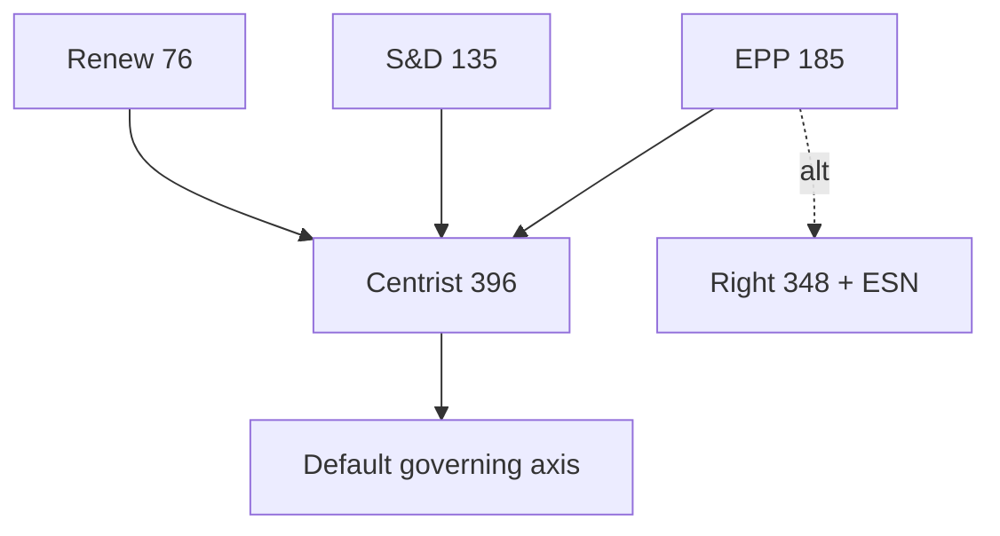

# Coalition Dynamics — Year-Ahead Group Behaviour (EP10, 2026→2027)

> **Article type:** `year-ahead`
> **Run date:** 2026-05-31
> **Data mode:** degraded-feeds
> **Method:** Coalition analysis with ACH and indicator tracking.
> **SATs applied:** Analysis of Competing Hypotheses, Indicators.

## BLUF

The 2026→2027 chamber is governed by a default centrist majority that is real but conditional.

The EPP is the indispensable pivot at 185 seats.

The centrist axis (EPP + S&D + Renew) holds 396 seats (55.1%).

The alternative right-leaning combinations fall short without EPP leadership.

Confidence is 🟢 HIGH on the arithmetic and 🟡 MEDIUM on behaviour.

## Group Seat Reference

| Group | Seats | Share |
| --- | --- | --- |
| EPP | 185 | 25.7% |
| S&D | 135 | 18.8% |
| PfE | 84 | 11.7% |
| ECR | 79 | 11.0% |
| Renew | 76 | 10.6% |
| Greens/EFA | 53 | 7.4% |
| The Left | 46 | 6.4% |
| ESN | 28 | 3.9% |
| NI | 33 | 4.6% |

The majority threshold is 361 of 720 seats.

The fragmentation index is 6.59 effective parties.

## Viable Coalitions

| Coalition | Seats | Majority? |
| --- | --- | --- |
| EPP + S&D + Renew | 396 | Yes |
| EPP + S&D + Renew + Greens | 449 | Yes |
| EPP + ECR + PfE | 348 | No |
| EPP + ECR + PfE + ESN | 376 | Yes (narrow) |
| S&D + Renew + Greens + Left | 310 | No |

The centrist platform clears the threshold comfortably.

The right bloc needs ESN to reach a narrow majority.

## Analysis of Competing Hypotheses — Governing Pattern

H1: a stable centrist majority governs across files.

H2: the EPP builds variable majorities issue-by-issue.

H3: a durable rightward majority emerges.

Evidence for H1: institutional stability and the von der Leyen platform.

Evidence for H2: observed EP10 file-by-file behaviour.

Evidence for H3: the right bloc's electoral momentum.

ACH ranks H2 and H1 ahead of H3.

H3 remains a watch item for the 2029 runway.

## Cohesion and Discipline

The EPP and S&D maintain high internal cohesion.

Renew is cohesive on single-market files.

The right groups are less coordinated than their combined size suggests.

Cohesion is the hidden variable behind coalition reliability.

## Issue-by-Issue Coalition Map

| Issue | Likely majority |
| --- | --- |
| Defence industrial strategy | EPP + ECR + Renew + S&D |
| 2027 budget | EPP + S&D + Renew |
| Climate/green files | EPP + S&D + Renew + Greens |
| Migration | EPP + ECR + PfE (contested) |
| Digital enforcement | Broad centre |

Migration is the file most likely to see a rightward majority.

Defence enjoys an unusually broad cross-bloc consensus.

## Indicators to Monitor

Indicator 1: EPP roll-call alignment on the first migration vote. 🟢

Indicator 2: frequency of EPP+ECR+PfE majorities. 🟢

Indicator 3: S&D and Renew cohesion on budget files. 🟡

Indicator 4: green-file amendment patterns. 🟡

Indicator 5: ESN participation in right-bloc votes. 🟡

## Coalition Stress Points

The budget is the principal centrist stress point.

Migration is the principal rightward-pull stress point.

Green-file rollback is the principal Greens-alienation risk.

## Confidence Statement

Confidence is 🟢 HIGH that the centrist axis remains the default.

Confidence is 🟡 MEDIUM on issue-specific majorities.

Confidence is 🔴 LOW on a durable rightward realignment in the window.

## Bloc-Level Arithmetic

The right bloc (PfE + ECR + ESN + parts of NI) approaches 52% of votes cast.

The left bloc (S&D + Greens + Left) holds around 32.6%.

Renew sits as the swing centre between the blocs.

The EPP straddles the centre and centre-right.

## Defection Risk

EPP defections toward the right are the key swing risk.

S&D cohesion holds on social and budget files.

Renew cohesion holds on single-market files.

The right groups are less coordinated than their size implies.

## Scenario Linkage

The centrist-continuity scenario assumes EPP stays centre.

The variable-majority scenario assumes issue-by-issue EPP choices.

The rightward-drift scenario assumes sustained EPP+ECR+PfE majorities.

ACH currently favours the variable-majority scenario.

## Bottom Line

The centrist majority governs but must be actively maintained.

The EPP's choices are the decisive variable.

The article should frame coalition behaviour as conditional, not fixed.
