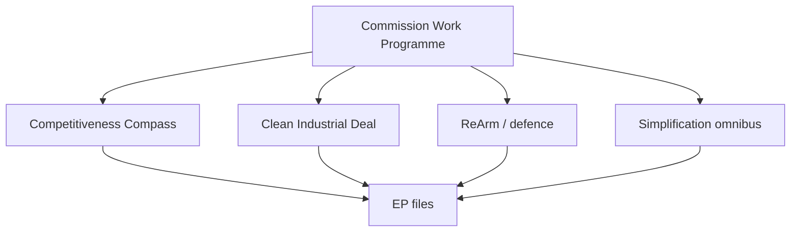

# Commission Work Programme Alignment — von der Leyen II (2026→2027)

> **Article type:** `year-ahead`
> **Run date:** 2026-05-31
> **Data mode:** degraded-feeds
> **Method:** Alignment mapping between the Commission agenda and EP file flow.

## BLUF

The von der Leyen II Commission (2024–2029) sets the structural agenda for the window.

The Competitiveness Compass and Clean Industrial Deal are the headline frameworks.

ReArm and the defence agenda dominate the security dimension.

The simplification omnibus reshapes the regulatory tempo.

Confidence is 🟢 HIGH on the frameworks and 🟡 MEDIUM on delivery pace.

## Commission Framework Map

| Framework | Domain | EP linkage |
| --- | --- | --- |
| Competitiveness Compass | Economy | Single-market files |
| Clean Industrial Deal | Industry/climate | Industrial instruments |
| ReArm / defence | Security | Defence industrial strategy |
| Simplification omnibus | Regulation | Reduced reporting burden |
| Digital enforcement | Digital | AI, DMA implementation |

The frameworks translate into concrete EP files through the year.

The Commission proposes; the EP and Council co-decide.

## Competitiveness Compass

The Compass frames the economic-policy agenda.

It links to single-market and capital-markets files.

It aligns with Renew and EPP economic priorities.

Source grade B2.

## Clean Industrial Deal

The Deal spawns multiple industrial and climate instruments.

It is the principal source of green-adjacent legislation.

It requires centrist-plus-Greens majorities on some files.

It is the most file-generative framework in the window.

## ReArm and Defence

The defence agenda is the year's dominant security theme.

It links to the defence industrial strategy and Ukraine support.

It enjoys an unusually broad cross-bloc majority.

Source grade B2.

## Simplification Omnibus

The omnibus reduces reporting and compliance burden.

It reshapes the regulatory tempo across sectors.

It is politically contested between deregulation and safeguards.

## Alignment Assessment

The Commission agenda and EP pipeline are well aligned on defence.

They are aligned on competitiveness and industrial policy.

They are contested on the pace of simplification.

They are slow-moving on institutional reform.

## Confidence Statement

Confidence is 🟢 HIGH on the framework set.

Confidence is 🟡 MEDIUM on delivery pace.

Confidence is 🟡 MEDIUM on omnibus contestation.

## Cross-Reference

See `legislative-pipeline-forecast.md` for the file-level mapping.

See `forward-projection.md` for the throughput model.

## Framework-to-File Detail

| Framework | Concrete file | EP majority |
| --- | --- | --- |
| Competitiveness Compass | Capital-markets union | EPP + Renew + S&D |
| Clean Industrial Deal | Industrial decarbonisation | Centre + Greens |
| ReArm | Defence industrial strategy | Broad cross-bloc |
| Simplification omnibus | Reporting reduction | Centre-right |
| Digital enforcement | AI, DMA implementation | Broad centre |

## Delivery-Pace Assessment

The defence framework delivers fastest under presidency tailwinds.

The competitiveness framework delivers steadily.

The industrial framework delivers in instrument waves.

The simplification framework is the most contested on pace.

## Inter-Institutional Dynamics

The Commission proposes the framework instruments.

The EP amends and co-decides.

The Council shapes the final balance.

The trio's priorities accelerate defence and budget files.

## Alignment Risks

A coalition shift could slow the green instruments. 🟡

Fiscal pressure could delay competitiveness spending. 🟡

Simplification could stall on safeguard disputes. 🟡

## Framework Timeline

The Competitiveness Compass frames the whole window.

The Clean Industrial Deal delivers instruments through 2027.

ReArm peaks around the defence industrial strategy.

The simplification omnibus runs as a continuous thread.

## Political Reception

The centre-right welcomes the competitiveness emphasis.

The centre-left conditions support on social safeguards.

The Greens condition support on climate integrity.

The right groups press for sovereignty carve-outs.

## Bottom Line

The Commission agenda is defence- and competitiveness-led.

The Clean Industrial Deal is the most file-generative framework.

## Alignment Confidence

The Competitiveness Compass alignment is 🟢 HIGH confidence.

The Clean Industrial Deal mapping is 🟡 MEDIUM confidence.

The ReArm linkage is 🟡 MEDIUM confidence pending defence-file timing.

The own-resources alignment is 🔴 LOW confidence this far out.

The article should map EP files back to their Commission frameworks.
