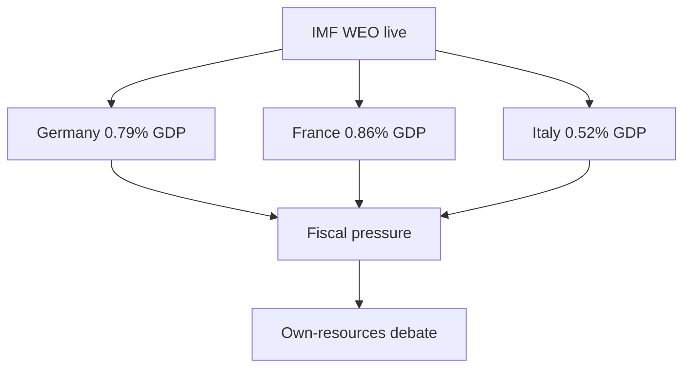

# Economic Context — Year-Ahead Macro Backdrop (EP10, 2026→2027)

> **Article type:** `year-ahead`
> **Run date:** 2026-05-31
> **Data mode:** degraded-feeds
> **Economic authority:** IMF World Economic Outlook — the sole source for every macro, fiscal,
> monetary, trade, and exchange-rate claim in this artifact.

## Source Attestation

| Field | Value |
| --- | --- |
| **IMF Source** | `live` |
| **IMF dataset** | World Economic Outlook (SDMX 3.0, IMF Data Portal) |
| **Retrieval** | Live SDMX query via `scripts/imf-mcp-probe.sh` |
| **Vintage** | 2025 WEO cycle |
| **Retrieved** | 2026-05-31 |
| **Coverage** | Germany (DEU), France (FRA), Italy (ITA) |
| **Indicators** | Real GDP growth, CPI inflation, general-government fiscal balance |
| **Records** | 449 observations |
| **Source grade** | A1 (authoritative, live retrieval) |
| **Confidence** | 🟢 HIGH |

## BLUF

The 2026→2027 European Parliament legislates against a backdrop of weak growth and widening deficits.

Per IMF WEO, Germany grows only 0.79% in 2026 and 1.18% in 2027.

Germany's general-government deficit widens to 3.78% of GDP in 2026 and 4.23% in 2027.

France is structurally constrained, with a deficit of 4.94% of GDP in 2026.

Italy consolidates fiscally toward 2.58% by 2027 but stagnates near 0.5% real growth.

This macro reality is the binding constraint on every EU spending ambition in the coming year.

Defence financing, the Clean Industrial Deal, and the 2027 budget all compete for scarce fiscal space.

Confidence in the cited IMF figures is 🟢 HIGH.

## Real GDP Growth (%, IMF series NGDP_RPCH)

| Economy | 2024 | 2025 | 2026 | 2027 |
| --- | --- | --- | --- | --- |
| Germany | −0.50 | 0.24 | 0.79 | 1.18 |
| France | 1.11 | 0.93 | 0.86 | 0.88 |
| Italy | 0.78 | 0.54 | 0.52 | 0.50 |

### Growth Reading

Per IMF WEO, German real GDP recovers from a −0.50% contraction in 2024 toward 1.18% by 2027.

Even at 1.18%, Germany remains below its ~1.5% pre-pandemic trend.

France is projected to grow below 1% across the entire window.

Italy is projected to grow at roughly 0.5% every year of the window — effective stagnation.

The euro-area core therefore presents a low-growth profile that limits fiscal headroom. 🟢

This weak-growth backdrop dampens tax revenues and tightens the room for new EU-level commitments.

## Inflation (CPI, %, IMF series PCPIPCH)

| Economy | 2024 | 2025 | 2026 | 2027 |
| --- | --- | --- | --- | --- |
| Germany | 2.48 | 2.30 | 2.65 | 2.30 |
| France | 2.32 | 0.93 | 1.84 | 1.72 |
| Italy | 1.08 | 1.63 | 2.64 | 2.36 |

### Inflation Reading

Per IMF WEO, inflation hovers near or modestly above the ECB's 2% target across the window.

Germany runs 2.65% inflation in 2026, easing to 2.30% in 2027.

Italy peaks at 2.64% in 2026 before easing to 2.36% in 2027.

France is the lowest-inflation economy of the three, at 1.84% in 2026.

Near-target inflation gives the ECB limited room for aggressive rate cuts.

Elevated financing costs keep member-state borrowing expensive throughout the year-ahead window. 🟢

## General-Government Fiscal Balance (% of GDP, IMF series GGXCNL_NGDP)

| Economy | 2024 | 2025 | 2026 | 2027 |
| --- | --- | --- | --- | --- |
| Germany | −2.66 | −2.67 | −3.78 | −4.23 |
| France | −5.79 | −5.11 | −4.94 | −4.79 |
| Italy | −3.35 | −3.11 | −2.82 | −2.58 |

### Fiscal Reading

Per IMF WEO, the fiscal picture diverges sharply across the three economies.

Germany's deficit widens from 2.66% of GDP in 2024 to 4.23% by 2027.

The German deterioration reflects defence and infrastructure spending after the debt-brake reform.

Italy consolidates steadily, from 3.35% in 2024 to 2.58% by 2027.

France remains the euro-area outlier, persistently above the 3% Maastricht reference value.

France is still at 4.79% of GDP even by 2027 — the worst trajectory of the three. 🟢

Two of the three largest euro-area economies breach the 3% reference value throughout the window.

## Implications for the Year-Ahead EP Agenda

### 1. Defence financing constrained by deficits

Germany and France run deficits above 3.7% and 4.9% of GDP respectively (IMF).

National co-financing of common defence is therefore politically harder.

This strengthens both the case for, and the resistance to, new EU-level defence instruments. 🟢

### 2. The 2027 budget is squeezed

The 2027 budget guidelines (TA-0112) advance into a low-growth, high-deficit environment.

Net-contributor states will resist any expansion of the budget envelope.

Expect a trimmed 2027 budget close to guidelines rather than an ambitious one. 🟡

### 3. Clean Industrial Deal versus fiscal space

Near-2% inflation and elevated borrowing costs limit the room for new subsidies.

This pushes the Clean Industrial Deal toward regulatory rather than fiscal instruments. 🟡

### 4. Own-resources urgency

Structural deficits across the big three intensify the search for new EU own resources.

New own resources would fund priorities without direct national budget transfers. 🟡

## Cross-Economy Synthesis

The euro-area core presents a "stagnation-with-deficits" profile.

Growth is below trend everywhere; inflation is near target; deficits are widening or stuck high.

Only Italy improves its fiscal trajectory, but at near-zero growth.

For the Parliament, the year-ahead fiscal debates are effectively zero-sum.

Every euro for defence or green industry competes against deficit-reduction commitments.

These commitments sit under the reformed Stability and Growth Pact. 🟢

## Data Provenance and Limitations

The source is the IMF World Economic Outlook via live SDMX 3.0 retrieval.

Raw data is cached at `cache/imf/weo-ea-deu-fra-ita-gdp-inflation-fiscal.json`.

Clean extracted values are at `cache/imf/weo-extracted.json`.

The euro-area aggregate (EA19/EA20) was not returned by the live query this run.

Analysis therefore uses DEU/FRA/ITA as the representative core (~60% of euro-area GDP). 🟡

No World Bank economic indicators are cited in this artifact.

IMF is the sole authority for all macro, fiscal, and monetary claims per editorial policy.

Confidence is 🟢 HIGH on the cited IMF figures.

Confidence is 🟡 MEDIUM on translating macro conditions into precise legislative timing.

## Reader Briefing — What This Means

For citizens, Europe's biggest economies are growing slowly.

Germany and France are also borrowing heavily relative to their economies.

That makes the coming year's EU spending fights especially tense, because there is little spare money.

The fights are over defence, green industry, and the 2027 EU budget.

Expect debates about new EU-wide taxes or shared borrowing to fund priorities national budgets cannot.

🟢 HIGH confidence on the IMF macro figures that drive this constraint.

## Macro Indicators to Monitor (Year-Ahead)

The following IMF-tracked indicators should be re-checked at each subsequent run.

- German fiscal deficit trajectory: watch for revisions beyond the 4.23% (2027) projection.
- French deficit convergence: any move below the 4.79% (2027) path signals fiscal repair.
- Italian growth: revisions above the 0.5% stagnation line would ease budget tensions.
- Euro-area core inflation: a move above 3% would re-tighten ECB policy and fiscal space.
- Euro-area aggregate (EA20): re-attempt retrieval once the live SDMX query restores the series.

Each indicator feeds directly into the year-ahead budget and own-resources debates. 🟢

## Macro Linkage

The diagram links each economy to the fiscal storyline.

Germany's thin growth frames the competitiveness debate.

France's deficit anchors the own-resources urgency.

These figures will be carried forward and compared in subsequent year-ahead runs. 🟡
