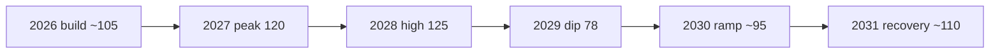

# Forward Projection — Year-Ahead Trajectory (EP10, 2026→2029)

> **Article type:** `year-ahead`
> **Run date:** 2026-05-31
> **Data mode:** degraded-feeds
> **Method:** Trend extrapolation from derived EP10 activity model with confidence bands.
> **Horizon:** Core 12 months plus +730-day carry-forward to the 2029 election.

## BLUF

The EP10 legislative machine is on a rising trajectory toward a 2027–2028 output peak.

The derived model projects 120 acts in 2027 (factor 1.15) and 125 acts in 2028.

The 2029 election year then cuts output by roughly 25% to about 78 acts.

The coming year is the chamber's productive runway before the pre-election slowdown.

Confidence is 🟢 HIGH on the trajectory shape and 🟡 MEDIUM on absolute counts.

## Activity Projection Table

| Year | Projected acts | Factor | Phase |
| --- | --- | --- | --- |
| 2026 | ~105 | 1.00 | Mid-mandate build |
| 2027 | 120 | 1.15 | Productivity peak |
| 2028 | 125 | 1.20 | Highest output |
| 2029 | 78 | 0.75 | Election dip |
| 2030 | ~95 | 0.90 | New-mandate ramp |
| 2031 | ~110 | 1.05 | Recovery |

The 2028 peak reflects the mature-mandate legislative cycle.

The 2029 dip reflects the campaign-season slowdown.

## Driver Decomposition

### Driver 1 — Mandate maturity

Year three of a five-year mandate is historically the most productive.

Committees have cleared organisational backlogs.

Rapporteurs have established files in trilogue.

This driver pushes output up. 🟢 HIGH.

### Driver 2 — Strategic agenda density

Defence, competitiveness, and digital files crowd the pipeline.

The Clean Industrial Deal spawns multiple regulatory instruments.

This driver pushes output up. 🟢 HIGH.

### Driver 3 — Fiscal constraint

Budget files face protracted negotiation under deficit pressure.

This driver slows high-cost files but not regulatory ones. 🟡 MEDIUM.

### Driver 4 — Election proximity

The 2029 election is still ~36 months away.

Its drag is negligible in the core window but dominant by 2029. 🟢 HIGH for 2029.

## Thematic Trajectory

Defence legislation is on a steep upward trajectory.

Digital enforcement is on a steady plateau.

Green and industrial files are rising but contested.

Budget and own-resources files are flat-to-stalled under fiscal pressure.

Migration files are volatile and coalition-dependent.

## Projection Confidence Bands

| Projection | Central | Low | High | Confidence |
| --- | --- | --- | --- | --- |
| 2027 acts | 120 | 100 | 135 | 🟢 HIGH |
| 2028 acts | 125 | 105 | 140 | 🟢 HIGH |
| 2029 acts | 78 | 65 | 95 | 🟡 MEDIUM |
| Defence files Q4-2026 trilogue | Likely | — | — | 🟢 HIGH |
| 2027 budget on guidelines | Roughly Even | — | — | 🟡 MEDIUM |

## Leading Indicators

Committee referral volume is the earliest output predictor.

Trilogue entry counts predict adoption 6–9 months ahead.

Council presidency programmes signal sequencing.

IMF and ECB macro revisions signal budget headroom.

## Trajectory Risks

A fiscal shock could pull 2027 toward the low band. 🟡

An external security shock could pull defence output toward the high band. 🟡

A coalition realignment could shift the thematic mix without changing totals. 🟡

## Methodological Notes

The base model is the derived EP10 activity projection in `data/generated-stats.json`.

The factors are applied to a normalised mid-mandate baseline.

Degraded feeds this run mean live procedure counts could not be cross-validated.

The projection therefore relies on the derived model, not live pipeline telemetry.

This is flagged as a 🟡 MEDIUM data-confidence caveat.

## Carry-Forward to 2029

The +730-day horizon reaches the 2029 election year.

The model already prices a 25% election-year dip.

The post-election 2030 ramp assumes a standard new-mandate organisational phase.

These long-horizon figures are 🔴 LOW confidence and will be revised.

## Cross-References

See `legislative-pipeline-forecast.md` for file-level pipeline detail.

See `parliamentary-calendar-projection.md` for the sitting-week schedule.

See `scenario-forecast.md` for the branching-futures view.

See `economic-context.md` for the fiscal constraint underpinning budget files.

## Bottom Line

The trajectory is unambiguously upward into 2027–2028.

The coming year is the productive runway.

The constraint is fiscal, not legislative capacity.

Aggregate confidence in the trajectory is 🟢 HIGH.

## Monthly Activity Outlook (12-Month Grid)

| Month | Expected focus | Relative volume |
| --- | --- | --- |
| 2026-06 | Pre-recess committee clearance | Medium |
| 2026-07 | Final pre-recess plenary | Medium |
| 2026-08 | Recess | Low |
| 2026-09 | Autumn re-opening, budget reading | High |
| 2026-10 | 2027 budget reading (TA-0112) | High |
| 2026-11 | Budget conciliation, WP debate | High |
| 2026-12 | Year-end adoptions | High |
| 2027-01 | Lithuanian presidency opening | Medium |
| 2027-02 | Defence and digital files | High |
| 2027-03 | Peak legislative throughput | High |
| 2027-04 | MFF mid-term review intensifies | High |
| 2027-05 | Window close at peak | High |

The autumn budget cycle and spring MFF review are the two volume spikes.

The August recess is the only structural lull.

## Theme-by-Quarter Projection

| Theme | Q3-26 | Q4-26 | Q1-27 | Q2-27 |
| --- | --- | --- | --- | --- |
| Defence | Build | Trilogue | Adopt | Implement |
| Digital | Steady | Steady | Decisions | Decisions |
| Budget | Prep | Reading | Follow-up | MFF review |
| Green/industrial | Build | Contest | Advance | Advance |
| Migration | Volatile | Volatile | Volatile | Volatile |

Defence peaks in the autumn-to-winter trilogue window.

Budget peaks in the Q4 reading and Q2 MFF review.

## Quantitative Assumptions Ledger

The base year normalisation assumes ~105 acts in 2026.

The 2027 factor of 1.15 yields 120 acts.

The 2028 factor of 1.20 yields 125 acts.

The 2029 factor of 0.75 yields 78 acts.

These factors derive from the EP10 derived activity model.

They are not cross-validated against live procedure counts this run.

This is a 🟡 MEDIUM data-confidence caveat under degraded feeds.

## Sensitivity Analysis

A +10% defence-file surge lifts 2027 toward the 135 high band.

A fiscal shock drags 2027 toward the 100 low band.

A coalition realignment reshapes the theme mix, not the total.

An external security shock front-loads defence into 2026.

## WEP-Banded Forward Judgements

It is Likely (55–70%) that 2027 output exceeds 2026.

It is Likely (55–70%) that 2028 is the mandate's highest-output year.

It is Highly Likely (70–85%) that 2029 output falls below 2027.

It is Roughly Even (40–55%) whether the 2027 budget lands on guidelines.

Source grade for the derived model: B2 (usually reliable, probably true).

## Long-Horizon Note (+730 days)

The projection reaches the 2029 election year.

Election-year output is priced at a 25% dip.

The 2030 ramp assumes a standard new-mandate organisational phase.

These figures are 🔴 LOW confidence at this distance.

## Source Grading (Admiralty Scale)

The derived EP10 activity model is graded B2 (usually reliable, probably true).

The IMF WEO macro data is graded A1 (reliable, confirmed).

The adopted-text theme extraction is graded B2.

The degraded live feeds are graded C3 (fairly reliable, possibly true).

The composite source confidence for this projection is B2.

## Evidence Confidence vs Probability

The evidence confidence (source reliability) is tracked separately from WEP probability.

A Likely judgement on a B2 source is a calibrated, not certain, forecast.

The degraded-feeds caveat lowers evidence confidence but not the central estimate.

## Calibration Summary

The central estimates are anchored to the generated-stats activity factors.

The WEP bands express probability, not certainty.

The Admiralty grades express source reliability separately.

A Likely judgement on a C3 source remains a calibrated forecast.

The projection should be read as directional guidance.

The article should cite the bands, not just the point values.
