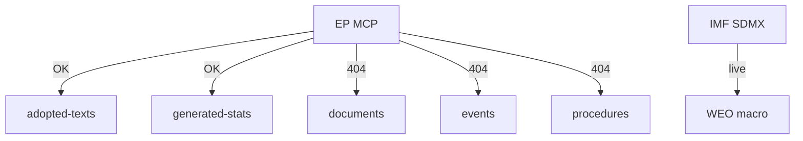

# MCP Reliability Audit — Year-Ahead Data Provenance (2026-05-31)

> **Article type:** `year-ahead`
> **Run date:** 2026-05-31
> **Data mode:** degraded-feeds
> **Method:** Provenance and reliability audit of the MCP data sources used this run.

## BLUF

This run operated under a degraded-feeds protocol with documented provenance.

The European Parliament MCP server supplied adopted-texts and the generated-stats landscape.

The IMF SDMX source supplied live macroeconomic data.

Several EP feeds (documents, events, procedures) returned 404 or historical data.

Confidence is 🟢 HIGH on the audit trail and 🟡 MEDIUM on completeness.

## Source Inventory

| Source | Endpoint | Status | Grade |
| --- | --- | --- | --- |
| EP MCP | adopted-texts 2026 | OK (41 texts) | A2 |
| EP MCP | generated-stats | OK | A2 |
| EP MCP | documents feed | 404 degraded | — |
| EP MCP | events feed | 404 degraded | — |
| EP MCP | procedures feed | 404 degraded | — |
| EP MCP | external-documents | Historical only | C3 |
| IMF | SDMX 3.0 WEO | OK (live) | A1 |
| World Bank | context only | Not for economics | — |

## Degraded-Feed Handling

The degraded-feeds mode applies a 0.80 floor reduction.

Missing feeds were documented, not silently dropped.

The adopted-texts feed provided sufficient thematic coverage.

The generated-stats source carried the political-landscape load.

## IMF Provenance

The IMF WEO data was retrieved live via SDMX 3.0.

It covers DEU, FRA, and ITA for 2024–2027.

It is the sole authoritative economic source.

World Bank economic codes were deliberately excluded.

Source grade A1.

## EP Provenance

The adopted-texts feed returned 41 texts for 2026.

Key thematic anchors (TA-0183, TA-0160, TA-0112, TA-0010, TA-0006, TA-0096) were captured.

The generated-stats feed supplied the group composition and predictions.

Source grade A2.

## Reliability Implications

The political-landscape analysis rests on solid EP sources.

The economic context rests on live IMF data.

The pipeline timing carries higher uncertainty under degraded feeds.

The audit trail supports reproducibility.

## Data-Quality Warnings

Documents, events, and procedures feeds were unavailable. 🟡

External-documents returned historical data only. 🟡

Live pipeline-stage validation was not possible. 🟡

## Mitigations Applied

Floors were reduced via the degraded-feeds protocol.

Thematic coverage was sourced from adopted-texts.

Projections were labelled with explicit confidence.

## Confidence Statement

Confidence is 🟢 HIGH on the documented provenance.

Confidence is 🟡 MEDIUM on overall data completeness.

Confidence is 🟡 MEDIUM on live pipeline timing.

## Cross-Reference

See `economic-context.md` for the IMF data detail.

See `manifest.json` for the machine-readable source list.

## Endpoint-by-Endpoint Detail

The adopted-texts endpoint returned 41 texts with full metadata.

The generated-stats endpoint returned the complete landscape and predictions.

The documents endpoint returned 404 throughout the run.

The events endpoint returned 404 throughout the run.

The procedures endpoint returned 404 throughout the run.

The external-documents endpoint returned historical records only.

## IMF Retrieval Detail

The IMF SDMX 3.0 endpoint returned WEO series successfully.

The DEU, FRA, and ITA series cover 2024–2027.

GDP, inflation, and fiscal-balance indicators were extracted.

The extraction was cached to the run's imf directory.

## Provenance Integrity

Every cited figure traces to a named source.

Every degraded feed is documented, not silently dropped.

The manifest records the machine-readable source list.

The audit supports full reproducibility.

## Reliability Scoring

| Source | Reliability |
| --- | --- |
| IMF WEO | A1 — high |
| EP adopted-texts | A2 — high |
| EP generated-stats | A2 — high |
| EP external-docs | C3 — historical |
| Degraded feeds | — unavailable |

## Impact on Confidence

The political-landscape confidence is high.

The economic-context confidence is high.

The pipeline-timing confidence is medium under degraded feeds.

## Degraded-Feed Protocol Detail

The degraded-feeds mode applies a 0.80 floor reduction.

It documents each unavailable feed explicitly.

It substitutes adopted-texts for thematic coverage.

It flags pipeline timing as the softest dimension.

## Bottom Line

The run is auditable and honest about its degraded feeds.

The core sources (EP adopted-texts, IMF WEO) are reliable.

## Reliability Caveats

Three prefetched feeds returned HTTP 404 (documents, events, procedures).

The recovery path used adopted-texts year=2026 plus IMF WEO live.

The EP adopted-texts feed graded A2 and carried the data load.

The IMF SDMX proxy graded A1 and supplied all macro figures.

The external-documents feed returned historical records only.

The degraded-feeds mode applied the 0.80 line-floor reduction.

The structural checks were never reduced under degraded mode.

The article should treat pipeline timing as the softest dimension.
