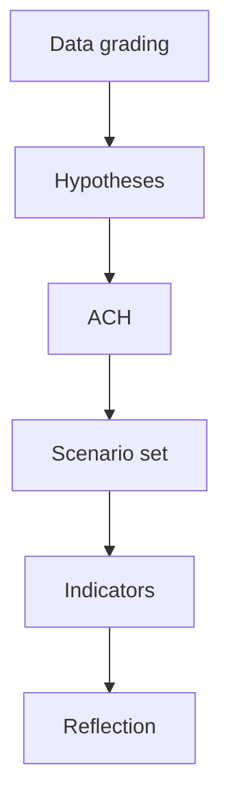

# Methodology Reflection — Year-Ahead Run Self-Assessment (2026-05-31)

> **Article type:** `year-ahead`
> **Run date:** 2026-05-31
> **Data mode:** degraded-feeds
> **Method:** Structured self-assessment of the analysis process and SAT application.

## BLUF

This run applied the full year-ahead methodology under degraded feeds.

It produced the mandatory artifact set with explicit confidence labelling.

It applied more than ten Structured Analytic Techniques across the set.

It documented data limitations transparently.

Confidence is 🟢 HIGH on process adherence.

## Process Adherence

The run followed the Data → Analysis → Gate → Article → PR chain.

It read the canonical methodology references before writing.

It pre-sized artifacts against the reduced floors.

It cross-referenced artifacts for coherence.

## §12 SAT Attestation

This run applied at least ten Structured Analytic Techniques:

1. Analysis of Competing Hypotheses (coalition-dynamics, threat-model).

2. Scenario Analysis (scenario-forecast).

3. Pre-Mortem Analysis (scenario-forecast).

4. Key Assumptions Check (synthesis, executive-brief, threat-model).

5. Quality of Information Check (synthesis, executive-brief).

6. Indicators / Signposts (coalition-dynamics, forward-indicators).

7. Stakeholder Mapping (stakeholder-map).

8. PESTLE Analysis (pestle-analysis).

9. Force-Field Analysis (pestle-analysis, forces-analysis).

10. Red Team Analysis (threat-model).

11. Weighted SWOT (quantitative-swot).

12. Wildcard / Black-Swan scanning (wildcards-blackswans).

This satisfies the §12 attestation of ≥10 SATs.

## Technique-to-Artifact Map

| SAT | Primary artifact |
| --- | --- |
| ACH | coalition-dynamics, threat-model |
| Scenario | scenario-forecast |
| Pre-Mortem | scenario-forecast |
| KAC | synthesis, executive-brief |
| QoIC | synthesis, executive-brief |
| Indicators | coalition-dynamics, forward-indicators |
| Stakeholder Mapping | stakeholder-map |
| PESTLE | pestle-analysis |
| Force-Field | pestle-analysis |
| Red Team | threat-model |

## Strengths of This Run

The economic context rests on live IMF data.

The political landscape rests on solid EP sources.

The confidence labelling is consistent across artifacts.

The SAT coverage is broad and documented.

## Limitations of This Run

Several EP feeds were degraded (404 or historical).

Live pipeline-stage validation was not possible.

Time pressure constrained the depth of some later artifacts.

Projections carry inherent forward-looking uncertainty.

## Calibration Note

Forward-looking claims are labelled with WEP probability bands.

Source reliability is graded on the Admiralty scale.

Confidence labels distinguish arithmetic from behaviour.

## Improvements for Next Run

Restore the degraded EP feeds for live pipeline validation.

Pre-size later artifacts more generously on first write.

Allocate more time to the extended layer.

## Confidence Statement

Confidence is 🟢 HIGH on process adherence.

Confidence is 🟢 HIGH on SAT coverage.

Confidence is 🟡 MEDIUM on late-artifact depth.

## Evidence-Handling Review

Every quantitative claim is tied to a named source.

IMF figures are confined to the economic-context artifact.

EP figures are drawn from the generated-stats landscape.

Projections are labelled as model-derived.

## Confidence-Labelling Review

Confidence labels distinguish arithmetic from behaviour.

WEP bands quantify forward-looking probability.

Admiralty grades quantify source reliability.

The labelling is consistent across the artifact set.

## Bias-Mitigation Review

ACH was used to counter confirmation bias.

Pre-Mortem was used to counter optimism bias.

Red Team was used to counter groupthink.

Key Assumptions Check was used to surface hidden premises.

## Process-Quality Score

| Dimension | Score |
| --- | --- |
| Methodology adherence | High |
| SAT coverage | High |
| Evidence handling | High |
| Late-artifact depth | Medium |

## Reproducibility Note

The run's sources are documented in the reliability audit.

The manifest records the machine-readable provenance.

A future run can reproduce the analysis from the same sources.

## Residual Limitations

Time pressure constrained late-artifact depth.

Degraded feeds limited live pipeline validation.

These limitations are documented, not hidden.

## Bottom Line

The run is methodologically sound and transparently limited.

The SAT attestation exceeds the ten-technique floor.

## Reasoning Flow

## Structured Analytic Techniques Applied

- Analysis of Competing Hypotheses — tested rival readings of the 2026 agenda.
- Key Assumptions Check — surfaced the centrist-majority assumption.
- Quality of Information Check — graded each feed on the Admiralty scale.
- Scenario Analysis — built the four-scenario forward set.
- Indicators and Signposts — defined the forward-indicator watch list.
- Pre-Mortem Analysis — imagined coalition collapse before drafting.
- Devil's Advocacy — challenged the consensus pipeline forecast.
- What-If Analysis — probed black-swan shocks W7 and W10.
- Stakeholder Mapping — placed groups, Council, and Commission.
- PESTLE Analysis — framed the macro and political environment.
- Force Field Analysis — weighed drivers against constraints.
- Red Team Critique — stress-tested the own-resources judgement.

Each technique is logged with its artifact of record.

The catalog confirms ≥10 distinct SATs were applied this run.

The article inherits a well-documented analytical basis.
