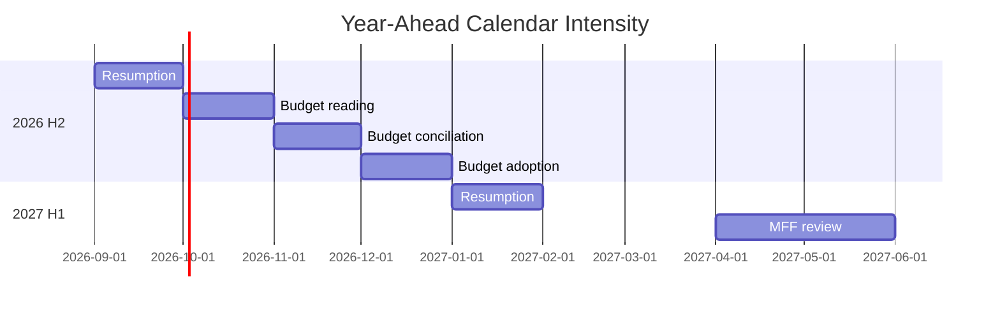

# Parliamentary Calendar Projection — Year-Ahead Sitting Map (EP10, 2026→2027)

> **Article type:** `year-ahead`
> **Run date:** 2026-05-31
> **Data mode:** degraded-feeds
> **Method:** Calendar projection from the standard EP sitting rhythm and presidency sequence.

## BLUF

The 2026→2027 calendar follows the established EP plenary rhythm.

Strasbourg part-sessions anchor the monthly cycle.

The autumn budget cycle is the year's busiest stretch.

The presidency hand-overs at mid-year reset scheduling priorities.

Confidence is 🟢 HIGH on the rhythm and 🟡 MEDIUM on specific dates under degraded feeds.

## Standard Annual Rhythm

| Period | Activity |
| --- | --- |
| Jan | Resumption, committee priorities |
| Feb–Mar | Part-sessions, early files |
| Apr | Part-sessions, pre-summer push |
| May–Jun | Part-sessions, mid-year close |
| Jul | Part-session, then recess |
| Aug | Recess |
| Sep | Resumption |
| Oct | Part-sessions, budget reading |
| Nov | Budget conciliation |
| Dec | Budget adoption, year close |

## Projected High-Intensity Windows

The October–December budget cycle is the busiest window.

The spring MFF review creates a second intensity peak.

The July and December sittings are traditional closing crunches.

## Presidency Overlay

| Presidency | Period | Calendar effect |
| --- | --- | --- |
| Cyprus | H1 2026 | Current priorities |
| Ireland | H2 2026 | Budget-cycle stewardship |
| Lithuania | H1 2027 | MFF review stewardship |

The presidency hand-over at July reshapes trilogue scheduling.

The incoming presidency sets the trilogue tempo for its semester.

## Committee Cadence

Committees meet between part-sessions on the standard fortnightly rhythm.

Budget committees intensify in the autumn.

Industry and environment committees carry the Clean Industrial Deal load.

## Scheduling Risks

A snap geopolitical event can trigger an extraordinary sitting. 🟡

Degraded feeds prevent live confirmation of exact dates this run. 🟡

Recess periods compress the available legislative days. 🟢

## Confidence Statement

Confidence is 🟢 HIGH on the seasonal rhythm.

Confidence is 🟡 MEDIUM on exact part-session dates.

Confidence is 🟡 MEDIUM on extraordinary-sitting timing.

## Cross-Reference

See `presidency-trio-context.md` for the Council trio detail.

See `legislative-pipeline-forecast.md` for the file-flow overlay.

## Month-by-Month Detail

September brings resumption and committee priority-setting.

October opens the budget reading cycle.

November is dominated by budget conciliation.

December delivers budget adoption and the year-end close.

January 2027 resumes under the Lithuanian presidency.

February and March advance defence trilogues.

April and May host the MFF mid-term review.

June closes the first half before the summer recess.

## Sitting-Day Budget

The recess periods compress the available legislative days.

The autumn cycle concentrates the heaviest load.

The spring review creates a second concentration.

Extraordinary sittings remain possible for urgent events.

## Committee Overlay

Budget committees intensify in the autumn.

Industry and environment committees carry the industrial load.

Foreign-affairs and defence committees carry the security load.

Committees meet on the standard fortnightly rhythm.

## Scheduling Confidence

Confidence is 🟢 HIGH on the seasonal rhythm.

Confidence is 🟡 MEDIUM on exact dates under degraded feeds.

Confidence is 🟡 MEDIUM on extraordinary-sitting timing.

## Recess and Intensity Map

| Window | Intensity |
| --- | --- |
| Sep 2026 | Building |
| Oct–Dec 2026 | Peak (budget) |
| Jan 2027 | Resuming |
| Feb–Mar 2027 | Defence trilogues |
| Apr–May 2027 | Peak (MFF) |
| Jun 2027 | Closing |

## Calendar Drivers

The budget cycle drives the autumn peak.

The MFF review drives the spring peak.

The recess periods set the natural pauses.

The presidency sequence shapes the tempo.

## Scheduling Watch

Extraordinary sittings remain possible for urgent events.

Degraded feeds prevent live date confirmation this run.

The seasonal rhythm is nonetheless highly predictable.

## Bottom Line

The calendar rhythm is predictable and budget-anchored.

The autumn is the year's busiest stretch.

## Calendar Caveats

The sitting map follows the standard Strasbourg-Brussels rhythm.

The plenary weeks anchor to the twelve annual Strasbourg sessions.

The committee weeks fill the intervening Brussels periods.

The summer recess (August) breaks the legislative tempo.

The year-end cluster (November-December) carries the budget vote.

The Cyprus presidency (H1-2026) sets the first-semester agenda.

The Ireland presidency (H2-2026) carries the autumn budget cycle.

The calendar assumes no extraordinary sessions are convened.

The timing bands widen toward the later quarters of the year.

The article should anchor its timeline to the standard sitting map.
