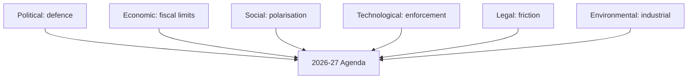
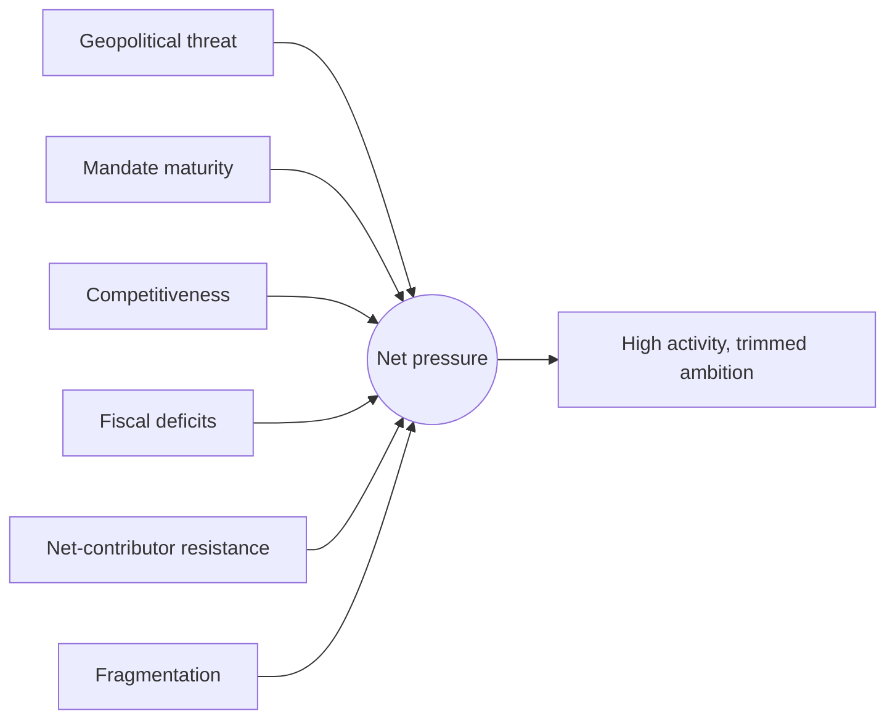

# PESTLE Analysis — Year-Ahead Macro-Environment (EP10, 2026→2027)

> **Article type:** `year-ahead`
> **Run date:** 2026-05-31
> **Data mode:** degraded-feeds
> **Method:** PESTLE framework (Political, Economic, Social, Technological, Legal, Environmental).

## BLUF

The EU's external environment in 2026→2027 is defined by strategic pressure and fiscal limits.

Political and economic forces dominate the field.

Technological and environmental files carry the regulatory agenda.

Social and legal dynamics modulate the pace.

Confidence is 🟢 HIGH on the political-economic axis and 🟡 MEDIUM elsewhere.

## Political Factors

The geopolitical threat environment sustains the defence agenda.

The US security posture pushes the EU toward strategic autonomy.

Ukraine support (TA-0010) remains a unifying priority.

The 720-seat chamber is fragmented at 6.59 effective parties.

The EPP coalition choice is the decisive political variable.

The 2029 election runway is ~36 months out and not yet dominant.

Council presidencies rotate Cyprus → Ireland → Lithuania across the window.

Political impact: 🟢 HIGH — defence and competitiveness drive the pipeline.

## Economic Factors

The euro-area macro backdrop is fiscally constrained (IMF WEO).

Germany grows 0.79% in 2026 with a deficit widening to 4.23% by 2027.

France runs a 4.94% deficit in 2026.

Italy stagnates near 0.5% real growth.

Inflation hovers near 2.6% in Germany and Italy, 1.8% in France.

These figures are the binding constraint on every spending file.

The 2027 budget (TA-0112) faces a tight envelope.

Own-resources reform confronts net-contributor resistance.

Economic impact: 🟢 HIGH — fiscal limits shape all budget outcomes.

## Social Factors

Migration remains the most socially salient and polarising file.

Cost-of-living pressure shapes the politics of the green transition.

Public support for Ukraine aid is durable but not unconditional.

Generational and regional divides shape party competition.

Social impact: 🟡 MEDIUM — modulates migration and green-file pace.

## Technological Factors

The AI strategy (TA-0183) builds the enforcement scaffolding.

The DMA (TA-0160) advances Big-Tech enforcement.

Digital sovereignty underpins the competitiveness agenda.

Defence-tech and dual-use innovation gain priority.

Cybersecurity and resilience files accompany the digital push.

Technological impact: 🟢 HIGH on regulatory volume, 🟡 MEDIUM on enforcement bite.

## Legal Factors

The rule-of-law conditionality mechanism remains contested.

Trilogue and conciliation procedures govern budget timing.

The Electoral Act reform (TA-0006) is a slow institutional file.

Treaty constraints limit own-resources options.

Legal impact: 🟡 MEDIUM — procedural friction shapes timing more than substance.

## Environmental Factors

The Clean Industrial Deal reframes climate policy around competitiveness.

The green transition is recast as an industrial-strategy question.

Energy security ties environmental files to geopolitics.

Agricultural and land-use files face rural-political resistance.

Environmental impact: 🟡 MEDIUM-HIGH — central but contested.

## PESTLE Summary Matrix

| Dimension | Direction | Impact | Confidence |
| --- | --- | --- | --- |
| Political | Defence-driven | High | 🟢 HIGH |
| Economic | Fiscally constrained | High | 🟢 HIGH |
| Social | Polarised | Medium | 🟡 MEDIUM |
| Technological | Enforcement-building | High | 🟢 HIGH |
| Legal | Procedurally frictional | Medium | 🟡 MEDIUM |
| Environmental | Industrial-recast | Medium-high | 🟡 MEDIUM |

## Cross-Dimension Interactions

Political ambition collides with economic constraint on the budget.

Technological enforcement reinforces the competitiveness agenda.

Environmental files are recast through the industrial-policy lens.

Social polarisation amplifies the political fragmentation.

Legal friction slows but does not block the dominant files.

## Implications for the Year

The political-economic tension is the master narrative.

Technological and environmental files supply the regulatory throughput.

Social and legal factors set the pace, not the direction.

## Confidence Statement

Confidence is 🟢 HIGH on the political and economic dimensions.

Confidence is 🟡 MEDIUM on the social, legal, and environmental dimensions.

The IMF data anchors the economic dimension at 🟢 HIGH.

## Bottom Line

The macro-environment favours high legislative activity under fiscal restraint.

Defence, digital, and industrial files dominate.

Budget and own-resources files are the contested frontier.

Aggregate confidence is 🟢 HIGH on the dominant axis.

## Force-Field Analysis — Agenda Delivery

Driving forces push the strategic agenda forward.

Restraining forces hold it back.

| Driving force | Strength | Restraining force | Strength |
| --- | --- | --- | --- |
| Geopolitical threat | 5 | Fiscal deficits (IMF) | 5 |
| Mandate maturity | 4 | Net-contributor resistance | 4 |
| Competitiveness imperative | 4 | Coalition fragmentation | 4 |
| Commission initiative | 4 | Treaty constraints | 3 |
| US security retrenchment | 3 | Social polarisation | 3 |
| Digital enforcement momentum | 3 | Procedural friction | 2 |

The net field favours high activity under fiscal constraint.

The strongest opposed pair is geopolitical threat versus fiscal deficits.

This pairing is the master tension of the year.

## PESTLE Intervention Points

To advance defence files, leverage the geopolitical driving force. 🟢

To pass the budget, neutralise net-contributor resistance with conditionality. 🟡

To advance green files, recast them as competitiveness measures. 🟡

To accelerate digital files, exploit their low fiscal cost. 🟢

## Dimension Interaction Detail

The political and economic dimensions are tightly coupled this year.

Defence ambition (political) is constrained by deficits (economic).

The technological agenda is decoupled from fiscal limits and advances steadily.

The environmental agenda is re-coupled to industry via the Clean Industrial Deal.

The legal dimension adds timing friction across all files.

The social dimension sets the political temperature on migration and climate.

## Macro-Environment Confidence Ledger

| Factor | Evidence basis | Confidence |
| --- | --- | --- |
| Fiscal constraint | IMF WEO live data | 🟢 HIGH |
| Defence priority | Adopted-text themes | 🟢 HIGH |
| Digital enforcement | TA-0160, TA-0183 | 🟢 HIGH |
| Social polarisation | Fragmentation index | 🟡 MEDIUM |
| Legal friction | Procedural base rates | 🟡 MEDIUM |
| Environmental recast | Clean Industrial Deal | 🟡 MEDIUM |
