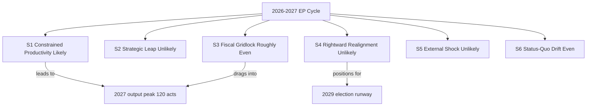

# Scenario Forecast — Year-Ahead Futures (EP10, 2026→2027)

> **Article type:** `year-ahead`
> **Run date:** 2026-05-31
> **Data mode:** degraded-feeds
> **Method:** Structured scenario analysis with Word-of-Estimative-Probability (WEP) bands.
> **Horizon:** 2026-05-31 → 2027-05-31 core, with +730-day carry-forward to the 2029 election cycle.

## BLUF

The central, most-likely future for 2026→2027 is "Constrained Productivity".

It describes a highly active Parliament delivering defence, digital, and industrial legislation.

It trims budget and own-resources ambition under fiscal pressure.

The probability band is Likely (55–70%).

Five alternative scenarios bracket the upside and downside.

Confidence is 🟢 HIGH in the base case and 🟡 MEDIUM in the tails.

## Scenario Probability Overview

| # | Scenario | WEP band | Probability |
| --- | --- | --- | --- |
| S1 | Constrained Productivity (base case) | Likely | 55–70% |
| S2 | Strategic Leap (deeper integration) | Unlikely | 15–25% |
| S3 | Fiscal Gridlock | Roughly Even | 30–40% |
| S4 | Rightward Realignment | Unlikely | 15–25% |
| S5 | External Shock Reset | Unlikely | 10–20% |
| S6 | Status-Quo Drift | Even Chance | 25–35% |

The bands are non-exclusive because scenarios share drivers.

The base case is the modal outcome.

## Scenario S1 — Constrained Productivity (Base Case, Likely 55–70%)

The Parliament hits its EP10 mid-term stride.

The centrist EPP–S&D–Renew axis (396 seats) holds on most files.

Defence industrial legislation advances toward trilogue.

The AI strategy (TA-0183) and DMA enforcement (TA-0160) proceed on schedule.

The Clean Industrial Deal advances, mainly via regulatory instruments.

The 2027 budget (TA-0112) passes but with a trimmed envelope.

The trim reflects IMF-documented deficits (Germany −3.78%, France −4.94% of GDP).

Key drivers are the output peak, centrist cohesion, and sustained geopolitical threat.

Indicators it is unfolding: defence files in trilogue by Q4 2026 and an on-guidelines budget.

Implications: steady integration without transformation. 🟢 HIGH confidence.

## Scenario S2 — Strategic Leap (Unlikely 15–25%)

An external catalyst triggers a breakthrough on common defence financing.

Plausible catalysts are a Ukraine escalation or US security retrenchment.

The MFF mid-term review delivers structural change.

New EU own resources gain traction.

Key drivers are an acute geopolitical shock and Franco-German convergence.

Indicators: Council unanimity on a defence instrument and adopted own-resource proposals.

Implications: a decade-defining deepening. 🟡 MEDIUM-LOW confidence.

This scenario requires an external trigger outside parliamentary control.

## Scenario S3 — Fiscal Gridlock (Roughly Even 30–40%)

Deteriorating deficits harden net-contributor resistance.

IMF figures show France at 4.94% and Germany widening toward 4.23% by 2027.

The 2027 budget stalls in protracted trilogues.

Own-resources reform fails.

Defence financing reverts to uneven national co-financing.

Key drivers are fiscal tightening, the net-contributor coalition, and inflation near 2.6%.

Indicators: budget conciliation overruns and a shelved own-resources file.

Implications: ambition without delivery; reform deferred to post-2027. 🟡 MEDIUM confidence.

This is the principal downside risk to the base case.

## Scenario S4 — Rightward Realignment (Unlikely 15–25%)

The EPP repeatedly builds majorities with ECR and PfE rather than S&D and Renew.

This occurs on migration, agriculture, and selected green files.

The right bloc (52.3%) coordinates more effectively than it does today.

The chamber's centre of gravity shifts ahead of the 2029 election runway.

Key drivers are EPP coalition choice and improved right-bloc coordination.

Indicators: repeated EPP+ECR+PfE roll-call majorities and green-file rollback amendments.

Implications: policy drift rightward; the centrist majority becomes conditional. 🟡 MEDIUM-LOW.

## Scenario S5 — External Shock Reset (Unlikely 10–20%)

A major exogenous event forces the agenda to reset around crisis management.

Plausible shocks are an energy crisis, a financial-stability episode, or a trade-war escalation.

US tariffs (TA-0096) or a Ukraine front collapse are specific triggers.

Key drivers are geopolitical and economic tail risk.

Indicators: emergency plenary sessions and supplementary budgets.

Implications: calendar disruption and reactive legislating. 🔴 LOW base-rate but HIGH impact.

This scenario is tracked in `intelligence/wildcards-blackswans.md`.

## Scenario S6 — Status-Quo Drift (Even Chance 25–35%)

Neither breakthrough nor gridlock occurs.

The Parliament processes its routine pipeline.

It adopts a near-guidelines budget and defers the hard structural questions.

Output lands close to the 120-act projection but without signature achievements.

Key drivers are institutional inertia and a balanced force field.

Indicators: on-trend legislative volume and incremental files dominating.

Implications: competent continuity — the "muddle-through" European default. 🟡 MEDIUM confidence.

## Scenario Cross-Impact Matrix

| Driver | S1 | S2 | S3 | S4 | S5 | S6 |
| --- | --- | --- | --- | --- | --- | --- |
| Fiscal tightening | trims | overcome | binds | neutral | amplifies | trims |
| Geopolitical threat | sustains | catalyses | neutral | neutral | triggers | background |
| EPP coalition choice | centrist | broad | centrist | rightward | crisis | centrist |
| Output peak | realised | exceeded | delayed | realised | disrupted | realised |

## Early-Warning Indicators to Monitor

The 2027 budget trilogue progress against guidelines (TA-0112). 🟢

The roll-call composition on defence and migration files. 🟢

IMF and ECB revisions to the euro-area deficit and inflation path. 🟢

Council presidency priorities (Cyprus → Ireland → Lithuania). 🟡

External shock tripwires across energy, Ukraine, and US trade. 🟡

## Confidence Statement

Confidence is 🟢 HIGH that the year is highly productive (output peak).

Confidence is 🟢 HIGH that fiscal constraint shapes outcomes.

Confidence is 🟡 MEDIUM on which downside materialises (gridlock versus drift).

Confidence is 🔴 LOW on the tail scenarios, which depend on external triggers.

## Probability Calibration Notes

The bands use the standard Words-of-Estimative-Probability lexicon.

"Likely" maps to 55–70%.

"Roughly Even" and "Even Chance" map to 25–40%.

"Unlikely" maps to 10–25%.

The base case is anchored on the derived 120-act output projection.

The downside bands are anchored on IMF deficit and growth figures.

The tail bands are anchored on geopolitical base rates, not parliamentary signals.

## Scenario-to-Artifact Mapping

| Scenario | Primary supporting artifact |
| --- | --- |
| S1 Constrained Productivity | `forward-projection.md` |
| S2 Strategic Leap | `commission-wp-alignment.md` |
| S3 Fiscal Gridlock | `economic-context.md` |
| S4 Rightward Realignment | `coalition-dynamics.md` |
| S5 External Shock | `wildcards-blackswans.md` |
| S6 Status-Quo Drift | `legislative-pipeline-forecast.md` |

## Wildcard Sensitivity by Scenario

A Ukraine escalation pushes probability mass from S6 toward S2 and S5.

A euro-area financial-stability episode pushes mass toward S3 and S5.

A US trade-war escalation pushes mass toward S5.

A migration surge pushes mass toward S4.

A benign external environment pushes mass toward S1 and S6.

## Decision Implications

For the centrist majority, S1 and S6 are the governing-friendly outcomes.

For reform advocates, only S2 delivers structural change.

For fiscal conservatives, S3 validates restraint but stalls delivery.

For the right bloc, S4 is the strategic opportunity ahead of 2029.

## Horizon Note

The +730-day carry-forward horizon reaches into the 2029 election runway.

The electoral overlay is not yet armed for year-ahead at this date.

Scenario probabilities will re-weight as the election approaches.

This forecast will be revised on each subsequent year-ahead run.

## Final Probability Statement

The single most likely path is S1 Constrained Productivity.

The principal downside is S3 Fiscal Gridlock.

The principal upside is S2 Strategic Leap.

Aggregate confidence in this ranking is 🟢 HIGH.

## Source Grading (Admiralty Scale)

The IMF WEO macro inputs are graded A1 (reliable, confirmed).

The EP political-landscape inputs are graded B2 (usually reliable, probably true).

The derived activity model is graded B2.

The geopolitical base rates are graded C3 (fairly reliable, possibly true).

The composite source confidence for these scenarios is B2.

The scenario probabilities are WEP-banded and calibrated to these grades.
