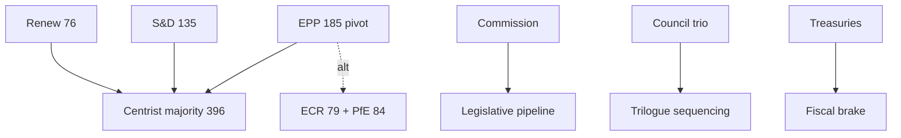

# Stakeholder Map — Year-Ahead Actor Landscape (EP10, 2026→2027)

> **Article type:** `year-ahead`
> **Run date:** 2026-05-31
> **Data mode:** degraded-feeds
> **Method:** Stakeholder mapping with power–interest classification.

## BLUF

The 2026→2027 agenda is shaped by a dense field of institutional and political stakeholders.

The decisive actors are the EPP, the Commission, and the net-contributor treasuries.

The pivotal swing actors are S&D, Renew, and the rotating Council presidency.

No single actor controls outcomes in a 720-seat, 6.59-effective-party chamber.

Confidence is 🟢 HIGH on the actor roster and 🟡 MEDIUM on behavioural predictions.

## Power–Interest Grid

| Quadrant | Actors |
| --- | --- |
| High power / High interest | EPP, Commission, net-contributor states |
| High power / Lower interest | European Council, ECB |
| Lower power / High interest | Greens/EFA, The Left, civil society |
| Lower power / Lower interest | Smaller NI members |

The top-left quadrant must be managed closely.

The bottom-right quadrant requires only monitoring.

## Political Group Stakeholders

### EPP (185 seats, 25.7%)

The pivotal centre-right group.

It is the indispensable majority-builder.

It can swing centrist or rightward by file.

Interest: high across competitiveness, defence, and budget. Power: decisive.

### S&D (135 seats, 18.8%)

The centre-left anchor.

It is the kingmaker for the von der Leyen platform.

Interest: high on social and budget files. Power: high as coalition partner.

### Patriots for Europe — PfE (84 seats, 11.7%)

The largest hard-right group.

Interest: high on migration and sovereignty. Power: conditional on EPP outreach.

### ECR (79 seats, 11.0%)

The conservative-reformist group.

Interest: high on agriculture and deregulation. Power: swing partner for the EPP.

### Renew Europe (76 seats, 10.6%)

The liberal group completing the centrist majority.

Interest: high on the single market and rule of law. Power: high as the third leg.

### Greens/EFA (53 seats, 7.4%)

The green group.

Interest: high on climate and digital rights. Power: lower in the current balance.

### The Left / GUE-NGL (46 seats, 6.4%)

The left group.

Interest: high on social and anti-austerity files. Power: lower, mostly oppositional.

### ESN (28 seats, 3.9%) and NI (33 seats, 4.6%)

The sovereignist group and non-attached members.

Interest: variable. Power: marginal except on knife-edge votes.

## Institutional Stakeholders

### European Commission

It owns the legislative initiative.

The 2027 Work Programme sets the year's pipeline.

Power: high. Interest: high.

### European Council and Council of the EU

The Council co-legislates and sets political direction.

The rotating presidency (Cyprus → Ireland → Lithuania) sequences trilogues.

Power: high. Interest: high on budget and defence.

### Member-State Treasuries

The net contributors are the principal fiscal brake.

Germany and France face widening deficits (IMF).

Power: high on budget and own-resources. Interest: high.

### European Central Bank

The ECB shapes the macro-financial backdrop.

Power: high but indirect. Interest: moderate on EP files.

## External Stakeholders

Industry and business federations lobby on the Clean Industrial Deal.

Big-Tech firms contest DMA and AI enforcement.

Defence primes engage on the industrial strategy.

Civil-society and NGO coalitions push climate and rule-of-law files.

Third countries (Ukraine, US) shape the external agenda.

## Stakeholder Alignment by File

| File | Aligned | Opposed |
| --- | --- | --- |
| Defence industrial strategy | EPP, ECR, Renew, Commission | The Left, parts of Greens |
| 2027 budget (TA-0112) | Commission, S&D, Greens | Net-contributor treasuries |
| AI strategy (TA-0183) | Broad centre | Big-Tech lobby |
| DMA enforcement (TA-0160) | EPP, S&D, Renew, Greens | Big-Tech lobby |
| Own-resources reform | Commission, S&D, Greens | Net contributors, ECR |

## Engagement Priorities

The EPP coalition choice is the single highest-leverage variable. 🟢

The net-contributor treasuries are the binding fiscal constraint. 🟢

The Council presidency sequence sets the trilogue calendar. 🟡

The Commission Work Programme defines the opportunity set. 🟢

## Confidence Ledger

| Claim | Confidence |
| --- | --- |
| EPP is the pivotal actor | 🟢 HIGH |
| Treasuries constrain the budget | 🟢 HIGH |
| Specific group voting on contested files | 🟡 MEDIUM |
| External-actor influence timing | 🟡 MEDIUM |

## Bottom Line

The actor landscape is fragmented but legible.

Outcomes hinge on EPP coalition choices and treasury fiscal limits.

The article should frame these two axes as the year's decisive variables.

Aggregate confidence is 🟢 HIGH on structure, 🟡 MEDIUM on behaviour.

## Stakeholder Mapping SAT — Power/Interest Scoring

| Actor | Power (1-5) | Interest (1-5) | Strategy |
| --- | --- | --- | --- |
| EPP | 5 | 5 | Manage closely |
| Commission | 5 | 5 | Manage closely |
| Net-contributor treasuries | 4 | 5 | Manage closely |
| S&D | 4 | 4 | Keep satisfied |
| Renew | 3 | 4 | Keep satisfied |
| Council presidency | 4 | 4 | Manage closely |
| ECR | 3 | 4 | Keep informed |
| PfE | 3 | 4 | Keep informed |
| Greens/EFA | 2 | 4 | Keep informed |
| The Left | 2 | 4 | Monitor |
| ECB | 4 | 2 | Keep satisfied |
| Big-Tech lobby | 2 | 4 | Monitor |
| Defence primes | 2 | 4 | Monitor |
| Civil society | 2 | 3 | Monitor |
| ESN / NI | 1 | 2 | Monitor |

The closely-managed set is small and stable.

The monitor set is large and mostly reactive.

## Analysis of Competing Hypotheses (ACH) — EPP Coalition Behaviour

Hypothesis H1: the EPP governs mainly with the centrist majority.

Hypothesis H2: the EPP shifts rightward on migration and green files.

Hypothesis H3: the EPP alternates issue-by-issue without a fixed bloc.

Evidence for H1: the von der Leyen platform and institutional stability.

Evidence for H2: the right bloc's 52.3% arithmetic and electoral incentives.

Evidence for H3: observed file-by-file majority-building in EP10.

The ACH weighing favours H1 as the base case with H3 as a strong alternative.

H2 is the principal downside for the centrist platform.

Confidence: 🟡 MEDIUM — coalition behaviour is the key uncertainty.

## Coalition Arithmetic Reference

| Coalition | Seats | Share |
| --- | --- | --- |
| EPP + S&D + Renew (centrist) | 396 | 55.1% |
| EPP + ECR + PfE (right) | 348 | 48.3% |
| EPP + S&D + Renew + Greens | 449 | 62.4% |
| S&D + Renew + Greens + Left | 310 | 43.1% |

The centrist platform clears the 361-seat majority threshold.

The right bloc falls short without additional partners.

## Stakeholder Watch Items

Watch EPP roll-call alignment on the first contested migration file. 🟢

Watch treasury statements on the 2027 budget envelope. 🟢

Watch Council presidency programme priorities. 🟡

Watch Big-Tech litigation and lobbying on DMA enforcement. 🟡
