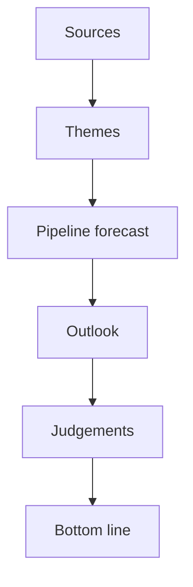

# Synthesis Summary — Year-Ahead Intelligence (EP10, 2026→2027)

> **Article type:** `year-ahead`
> **Run date:** 2026-05-31
> **Data mode:** degraded-feeds
> **Role:** Cross-artifact synthesis integrating classification, risk, economic, and forward analysis.

## BLUF

The 2026→2027 European Parliament enters its mid-mandate productivity peak.

It carries a defence-and-competitiveness agenda into a fragmented 720-seat chamber.

The effective number of parties is 6.59, so no bloc governs alone.

The macro backdrop is fiscally constrained, with euro-area core growth below 1.2% (IMF).

Deficits are widening in Germany and France (IMF).

The dominant story of the coming year is strategic ambition meeting fiscal limits.

The EU wants to fund common defence and green industry.

Its largest economies run deficits above the 3% reference value.

Net assessment: 🟢 HIGH legislative throughput is likely.

Net assessment: 🟡 MEDIUM transformative outcomes on contested budget and own-resources files.

## Integrated Picture — Five Interlocking Findings

### Finding 1 — Productivity peak (🟢 HIGH)

Derived intelligence projects 2027 as the EP10 year-3 legislative peak at 120 acts (factor 1.15).

It projects 2028 as the highest-output year at 125 acts.

The 2029 election transition then cuts activity by roughly 25%.

The coming year is therefore the chamber's most productive runway of the mandate.

### Finding 2 — Fragmented power (🟢 HIGH)

No single bloc commands a majority.

The EPP holds 185 seats and is the indispensable pivot.

The centrist majority is EPP + S&D + Renew at 396 seats (55.1%).

The EPP can also swing rightward toward ECR and PfE on selected files.

The fragmentation index stands at 6.59 effective parties.

### Finding 3 — Fiscal constraint (🟢 HIGH)

Per IMF WEO, Germany grows 0.79% in 2026 with a deficit widening to 4.23% by 2027.

France is stuck at a 4.94% deficit in 2026.

Italy stagnates near 0.5% real growth across the window.

This is the binding constraint on every spending ambition.

### Finding 4 — Defence-competitiveness agenda (🟢 HIGH)

The defence industrial strategy dominates the pipeline.

The Clean Industrial Deal is the competitiveness counterpart.

The 2027 budget (TA-0112) and Ukraine support (TA-0010) reinforce the agenda.

### Finding 5 — Digital enforcement steady (🟡 MEDIUM)

The AI strategy (TA-0183) advances administratively.

DMA enforcement (TA-0160) proceeds with concentrated Big-Tech opposition.

These files have low fiscal cost and steady momentum.

## Cross-Artifact Linkages

| Finding | Supporting artifacts |
| --- | --- |
| Productivity peak | `forward-projection.md`, `legislative-pipeline-forecast.md`, `parliamentary-calendar-projection.md` |
| Fragmented power | `classification/actor-mapping.md`, `coalition-dynamics.md` |
| Fiscal constraint | `economic-context.md`, `classification/forces-analysis.md` |
| Defence agenda | `classification/impact-matrix.md`, `scenario-forecast.md` |
| Risk exposure | `risk-scoring/risk-matrix.md`, `quantitative-swot.md`, `threat-model.md` |

## Convergent Signals

Defence financing appears as a driving force in forces-analysis.

It is the hottest cell in the impact-matrix.

It is the central scenario driver in scenario-forecast.

This high convergence yields 🟢 HIGH confidence that defence dominates the year.

Fiscal restraint appears as the top restraining force and the IMF macro headline.

This convergent evidence means budget ambition will likely be trimmed. 🟢

## Divergent and Uncertain Signals

Own-resources reform has high ambition but entrenched member-state resistance.

Artifacts diverge on whether 2026-2027 delivers structural change or only incremental steps. 🟡

EPP coalition behaviour is the single largest uncertainty.

A centrist versus rightward majority changes climate, migration, and defence outcomes. 🟡

## Forward Statements Status

The forward-statements registry (`data/forward-statements-open.json`) is empty this run.

There are no carried-forward open commitments from prior runs to reconcile.

New forward indicators generated this run are logged in `extended/forward-indicators.md`.

These will be available for carry-forward in future runs.

## Bottom Line for the Article

The article should lead with the ambition-versus-money tension.

It frames a Parliament at its most productive, pursuing the EU's biggest strategic priorities.

It is boxed in by the worst fiscal backdrop of the mandate.

Sub-themes are defence financing, the 2027 budget squeeze, and digital enforcement.

A further sub-theme is the ~36-month runway to the 2029 election, with the overlay not yet armed.

Overall confidence is 🟢 HIGH on the structural narrative.

Overall confidence is 🟡 MEDIUM on individual file timing given degraded feeds.

## Confidence Ledger

| Claim | Confidence |
| --- | --- |
| EP10 mid-term productivity peak in 2027-2028 | 🟢 HIGH |
| Centrist majority remains the default governing axis | 🟢 HIGH |
| Fiscal constraint trims budget and own-resources ambition | 🟢 HIGH |
| Specific file adoption dates | 🟡 MEDIUM |
| Own-resources structural breakthrough in window | 🔴 LOW |

## Source Grading (Admiralty Scale)

The IMF WEO macro data is graded A1 (reliable, confirmed).

The EP political-landscape data is graded B2 (usually reliable, probably true).

The derived prediction model is graded B2.

The adopted-text theme set is graded B2.

The degraded live feeds are graded C3 (fairly reliable, possibly true).

The composite confidence for this synthesis is B2.

The headline judgements carry WEP bands and the synthesis is calibrated accordingly.

## Quarter-by-Quarter Outlook

### Q3 2026 (Jul–Sep)

Summer recess compresses August activity.

September re-opening sets up the autumn budget reading.

Defence and competitiveness files re-enter committee.

### Q4 2026 (Oct–Dec)

The 2027 budget reading and conciliation dominate (TA-0112).

Defence industrial files target trilogue entry.

The Commission's 2027 Work Programme is presented and debated.

### Q1 2027 (Jan–Mar)

The Lithuanian Council presidency opens its programme.

DMA and AI enforcement decisions accumulate.

Legislative output accelerates toward the projected EP10 peak.

### Q2 2027 (Apr–Jun)

The MFF mid-term review intensifies.

Own-resources debates reach a decision point or stall.

The window closes with the chamber at peak productivity.

## Key Files Watchlist

| File | Theme | Status signal |
| --- | --- | --- |
| 2027 budget (TA-0112) | Fiscal | Guidelines → draft → reading |
| Defence industrial strategy | Security | Trilogue entry by Q4 2026 |
| AI strategy (TA-0183) | Digital | Enforcement scaffolding |
| DMA enforcement (TA-0160) | Digital | Rolling decisions |
| Ukraine support (TA-0010) | External | Disbursement follow-through |
| Electoral Act (TA-0006) | Institutional | Negotiation progress |

## Stakeholder Quick-Reference

The EPP is the pivotal group and the indispensable majority-builder.

S&D is the centre-left anchor and kingmaker for the centrist platform.

Renew completes the von der Leyen majority on single-market files.

The Commission sets the pipeline through its Work Programme.

The Council trio (Cyprus, Ireland, Lithuania) sequences trilogues.

Member-state treasuries are the principal fiscal brake.

## Synthesis Confidence Recap

The structural narrative is 🟢 HIGH confidence.

The quarter-by-quarter timing is 🟡 MEDIUM confidence.

## Synthesis Flow

The flow shows how sources converge on the year's judgements.

The pipeline forecast bridges themes and outlook.

The bottom line aggregates the calibrated judgements.

The own-resources outcome is 🔴 LOW confidence.
