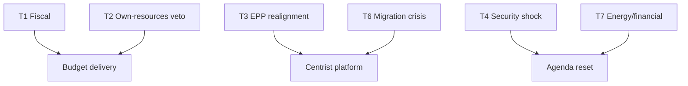

# Threat Model — Year-Ahead Risk Landscape (EP10, 2026→2027)

> **Article type:** `year-ahead`
> **Run date:** 2026-05-31
> **Data mode:** degraded-feeds
> **Method:** Structured threat modelling with Red Team challenge and ACH.
> **SATs applied:** Key Assumptions Check, Red Team, Analysis of Competing Hypotheses.

## BLUF

The principal threats to the 2026→2027 agenda are fiscal, coalitional, and geopolitical.

Fiscal deterioration is the most Likely (55–70%) threat to budget delivery.

Coalition fracture is a Roughly Even (40–55%) threat to the centrist platform.

An external security shock is Unlikely (15–25%) but high-impact.

Source confidence is B2 on EP inputs and A1 on IMF macro data.

## Threat Register

| ID | Threat | Likelihood (WEP) | Impact |
| --- | --- | --- | --- |
| T1 | Fiscal deterioration stalls budget | Likely | High |
| T2 | Net-contributor veto on own-resources | Likely | High |
| T3 | EPP rightward realignment | Roughly Even | Medium |
| T4 | External security shock | Unlikely | High |
| T5 | Big-Tech enforcement reversal | Unlikely | Medium |
| T6 | Migration crisis disrupts agenda | Roughly Even | Medium |
| T7 | Energy or financial-stability episode | Unlikely | High |
| T8 | Feed/data degradation in monitoring | Likely | Low |

## Threat Detail

### T1 — Fiscal deterioration (Likely, High)

IMF data shows Germany and France with widening deficits above 3.7%.

A further deterioration would harden budget resistance.

This is the most probable high-impact threat. Source grade A1.

### T2 — Own-resources veto (Likely, High)

Net contributors resist new EU own resources.

Treaty unanimity gives any large state a veto.

This threatens structural budget reform. Source grade B2.

### T3 — EPP realignment (Roughly Even, Medium)

The EPP could shift rightward on migration and green files.

This would fracture the centrist platform.

Source grade B2; behaviour is the key uncertainty.

### T4 — External security shock (Unlikely, High)

A Ukraine escalation or US retrenchment could reset the agenda.

Impact is high but base rate is low. Source grade C3.

### T5–T8

Big-Tech reversal, migration crisis, energy shock, and feed degradation.

Each is tracked with WEP bands and mitigation notes.

## Key Assumptions Check

Assumption 1: the centrist majority holds by default. — Plausible, monitor T3.

Assumption 2: fiscal deficits persist per IMF. — Well-supported, A1.

Assumption 3: no major external shock in the core window. — Uncertain, monitor T4/T7.

Assumption 4: degraded feeds recover for future runs. — Operational, low stakes.

## Red Team Challenge

A Red Team would argue the centrist majority is more fragile than assumed.

It would note the right bloc's 52.3% arithmetic.

It would argue fiscal pressure could trigger earlier realignment.

The base case survives the challenge but T3 is upgraded to a live watch item.

## Analysis of Competing Hypotheses — Dominant Threat

H1: fiscal constraint is the dominant threat. Evidence: IMF deficits. Strong.

H2: coalition fracture is the dominant threat. Evidence: arithmetic. Moderate.

H3: external shock is the dominant threat. Evidence: base rates. Weak.

ACH favours H1 with H2 as a strong alternative. Confidence 🟢 HIGH on H1.

## Mitigation and Monitoring

Monitor IMF and ECB deficit revisions for T1. 🟢

Monitor EPP roll-call alignment for T3. 🟢

Monitor external tripwires for T4 and T7. 🟡

Monitor feed health for T8 (see `mcp-reliability-audit.md`). 🟢

## Confidence Statement

Confidence is 🟢 HIGH that fiscal constraint is the leading threat.

Confidence is 🟡 MEDIUM on coalition-fracture probability.

Confidence is 🔴 LOW on external-shock timing.

Composite source grade for this model: B2.

## Bottom Line

The threat landscape is dominated by money and coalition maths.

External shocks are the high-impact tail.

The article should frame fiscal constraint as the central risk.

## Extended Threat Detail

### T5 — Big-Tech enforcement reversal (Unlikely, Medium)

Concentrated lobbying could weaken DMA or AI enforcement.

Litigation could slow implementation of TA-0160.

This is a medium-impact, lower-probability threat. Source grade C3.

### T6 — Migration crisis (Roughly Even, Medium)

A surge in arrivals could dominate the agenda.

It would stress the centrist coalition on a polarising file.

This is a recurring, coalition-sensitive threat. Source grade B2.

### T7 — Energy or financial-stability episode (Unlikely, High)

An energy shock or sovereign-stress event would crowd out the legislative agenda.

It would amplify the fiscal constraint sharply.

Source grade C3; tracked as a tail risk.

### T8 — Feed and data degradation (Likely, Low)

Several EP feeds returned errors this run (documents, events, procedures).

Persistent degradation would impair monitoring fidelity.

This is a high-probability, low-impact operational threat. Source grade B2.

## Threat Interaction Effects

Fiscal threat (T1) amplifies coalition threat (T3) via budget disputes.

External shock (T4) can trigger financial threat (T7) and vice versa.

Migration threat (T6) compounds coalition threat (T3).

These interactions raise the aggregate threat above the sum of parts.

## Second-Order Consequences

A stalled budget delays defence and green spending.

A coalition fracture changes outcomes across migration, climate, and defence.

An external shock resets the calendar and forces emergency legislating.

## Threat Prioritisation Summary

| Tier | Threats |
| --- | --- |
| Critical watch | T1, T2 |
| Active monitor | T3, T6, T8 |
| Tail watch | T4, T7 |
| Background | T5 |

## Assumptions Sensitivity

If the centrist majority weakens, T3 moves to critical.

If deficits worsen, T1 and T2 intensify.

If feeds recover, T8 de-escalates.

The model is most sensitive to the EPP coalition assumption.

## WEP Summary of Threats

It is Likely (55–70%) that fiscal threats constrain delivery.

It is Roughly Even (40–55%) that a coalition threat affects a major file.

It is Unlikely (15–25%) that an external shock materialises in the window.
