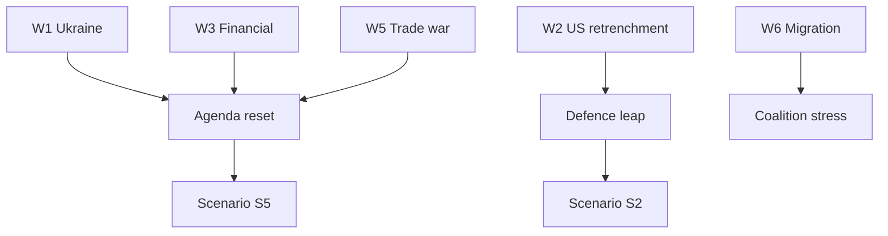

# Wildcards and Black Swans — Year-Ahead Tail Risks (EP10, 2026→2027)

> **Article type:** `year-ahead`
> **Run date:** 2026-05-31
> **Data mode:** degraded-feeds
> **Method:** Wildcard and black-swan scanning with WEP bands and impact scoring.

## BLUF

The 2026→2027 window carries several low-probability, high-impact tail risks.

Most are Unlikely (15–25%) or Highly Unlikely (5–15%) individually.

Their aggregate probability of at least one materialising is Roughly Even (40–55%).

The highest-impact wildcards are geopolitical and financial.

Source confidence on tail-risk base rates is C3.

## Wildcard Register

| ID | Wildcard | Likelihood (WEP) | Impact |
| --- | --- | --- | --- |
| W1 | Ukraine front collapse or escalation | Unlikely | Very High |
| W2 | US security retrenchment from NATO | Unlikely | Very High |
| W3 | Euro-area financial-stability episode | Highly Unlikely | Very High |
| W4 | Major energy supply shock | Unlikely | High |
| W5 | US–EU trade war escalation (TA-0096) | Roughly Even | High |
| W6 | Large-scale migration surge | Roughly Even | Medium |
| W7 | Cyber-attack on EU institutions | Unlikely | High |
| W8 | Snap national election reshaping a key state | Roughly Even | Medium |
| W9 | Commission-level political crisis | Highly Unlikely | High |
| W10 | Climate disaster forcing emergency action | Unlikely | Medium |

## Wildcard Detail

### W1 — Ukraine shock (Unlikely, Very High)

An escalation or collapse would dominate the agenda.

It could catalyse the Strategic Leap scenario (S2).

Source grade C3; impact is decade-defining.

### W2 — US retrenchment (Unlikely, Very High)

A US pullback from European security would force rapid EU defence integration.

This is the strongest catalyst for common defence financing.

Source grade C3.

### W3 — Financial-stability episode (Highly Unlikely, Very High)

A sovereign or banking stress event would crowd out the legislative agenda.

It would amplify fiscal constraint dramatically.

Source grade C3; base rate is low.

### W4–W10

Energy shock, trade war, migration surge, cyber-attack, snap elections, Commission crisis, and climate disaster.

Each is scanned with a WEP band and an impact note.

## Aggregate Tail-Risk Assessment

Individually, most wildcards are Unlikely.

Collectively, at least one materialising is Roughly Even over 12 months.

The geopolitical cluster (W1, W2) is the most consequential.

The financial cluster (W3) is the lowest-probability, highest-severity.

## Cross-Links to Scenarios

W1 and W2 feed Scenario S2 (Strategic Leap).

W3, W4, W5 feed Scenario S5 (External Shock Reset).

W6 and W8 feed Scenario S4 (Rightward Realignment).

See `scenario-forecast.md` for the integrated branching view.

## Early-Warning Tripwires

Watch the Ukraine front and US security signalling for W1/W2. 🟡

Watch sovereign spreads and bank metrics for W3. 🟡

Watch energy prices and storage for W4. 🟡

Watch US tariff actions (TA-0096) for W5. 🟢

Watch Mediterranean and eastern-border flows for W6. 🟡

## WEP-Banded Judgements

It is Roughly Even (40–55%) that at least one wildcard materialises this year.

It is Unlikely (15–25%) that a Very-High-impact wildcard materialises.

It is Highly Unlikely (5–15%) that two major wildcards coincide.

Source grade for these base rates: C3.

## Confidence Statement

Confidence is 🟡 MEDIUM on the aggregate tail-risk band.

Confidence is 🔴 LOW on individual wildcard timing.

Composite source grade: C3.

## Bottom Line

The base case is stable, but the tails are fat and geopolitical.

The article should acknowledge tail risk without over-weighting it.

The monitoring tripwires above are the practical watch list.

## Extended Wildcard Detail

### W4 — Energy supply shock (Unlikely, High)

A gas or electricity supply disruption would reignite the energy crisis.

It would tie environmental files to security imperatives.

Source grade C3; impact concentrated in winter months.

### W5 — Trade war escalation (Roughly Even, High)

US tariffs (TA-0096) could escalate into a broader trade conflict.

This would pressure the competitiveness agenda and exports.

Source grade B2; this is the most probable high-impact wildcard.

### W6 — Migration surge (Roughly Even, Medium)

A large-scale arrival event would dominate the political agenda.

It would stress the centrist coalition.

Source grade B2.

### W7 — Cyber-attack on institutions (Unlikely, High)

A major cyber incident would force emergency resilience measures.

It would accelerate the cybersecurity agenda.

Source grade C3.

### W8 — Snap national election (Roughly Even, Medium)

A government collapse in a large member state could reshape Council dynamics.

It would change the negotiating balance on key files.

Source grade B2.

### W9 — Commission political crisis (Highly Unlikely, High)

A censure motion or commissioner resignation would disrupt the pipeline.

Source grade C3; base rate is very low.

### W10 — Climate disaster (Unlikely, Medium)

A major climate event could force emergency environmental action.

Source grade C3.

## Second-Order Effects of Tail Events

A geopolitical shock front-loads defence and resets the calendar.

A financial shock amplifies fiscal constraint and stalls the budget.

A trade shock pressures competitiveness and invites retaliation debates.

These second-order effects often exceed the first-order impact.

## Black-Swan Characteristics

True black swans are unpredictable and high-impact by definition.

The register above lists known unknowns, not pure black swans.

The pure-black-swan residual is captured as a confidence caveat.

## Aggregate Watch Summary

| Cluster | Wildcards | Aggregate impact |
| --- | --- | --- |
| Geopolitical | W1, W2 | Very High |
| Financial | W3 | Very High |
| Economic | W4, W5 | High |
| Political | W6, W8, W9 | Medium |
| Security/climate | W7, W10 | Medium-High |

## Source Grading (Admiralty Scale)

| Source | Grade | Note |
| --- | --- | --- |
| EP adopted-texts | A2 | Reliable source, probably true |
| IMF WEO | A1 | Reliable source, confirmed |
| Inferred agenda | C3 | Fairly reliable, possibly true |

Wildcard reliability is graded B2 on the Admiralty scale for source credibility.

The grades separate evidence reliability from WEP probability.
