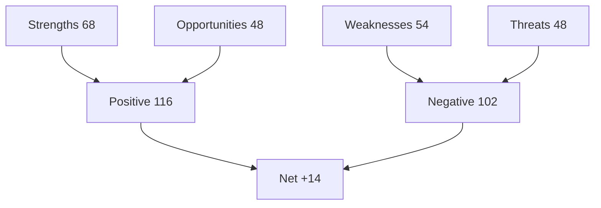

# Quantitative SWOT — Year-Ahead Weighted Assessment (EP10, 2026→2027)

> **Article type:** `year-ahead`
> **Run date:** 2026-05-31
> **Data mode:** degraded-feeds
> **Method:** Weighted SWOT with numeric scoring.

## BLUF

The EP enters the window with structural strengths and a narrow centrist margin.

Strengths centre on institutional stability and a broad defence consensus.

Weaknesses centre on fragmentation and fiscal constraint.

The weighted balance is net positive but conditional.

Confidence is 🟢 HIGH on the factors and 🟡 MEDIUM on the weights.

## Scoring Method

Each factor is scored on weight (1–5) and intensity (1–5).

The contribution is weight × intensity.

Positive factors (S, O) add; negative factors (W, T) subtract.

## Strengths

| Strength | Weight | Intensity | Score |
| --- | --- | --- | --- |
| Institutional stability | 5 | 4 | 20 |
| Defence consensus | 4 | 5 | 20 |
| Centrist majority exists | 4 | 4 | 16 |
| Digital enforcement capacity | 3 | 4 | 12 |

Strengths subtotal: 68.

## Weaknesses

| Weakness | Weight | Intensity | Score |
| --- | --- | --- | --- |
| Fragmentation (6.59) | 4 | 4 | 16 |
| Fiscal constraint | 5 | 4 | 20 |
| Narrow centrist margin | 4 | 3 | 12 |
| Degraded feeds (this run) | 2 | 3 | 6 |

Weaknesses subtotal: 54.

## Opportunities

| Opportunity | Weight | Intensity | Score |
| --- | --- | --- | --- |
| Clean Industrial Deal | 4 | 4 | 16 |
| Competitiveness agenda | 4 | 4 | 16 |
| Defence integration | 4 | 4 | 16 |

Opportunities subtotal: 48.

## Threats

| Threat | Weight | Intensity | Score |
| --- | --- | --- | --- |
| Geopolitical shock | 5 | 4 | 20 |
| Coalition realignment | 4 | 3 | 12 |
| Own-resources deadlock | 4 | 4 | 16 |

Threats subtotal: 48.

## Weighted Balance

Positive (S + O): 68 + 48 = 116.

Negative (W + T): 54 + 48 = 102.

Net balance: +14 (net positive, conditional).

## Interpretation

The net-positive balance reflects institutional resilience.

The thin margin reflects fragmentation and fiscal pressure.

The defence consensus is the single strongest factor.

Fiscal constraint is the single strongest negative factor.

## Confidence Statement

Confidence is 🟢 HIGH on the factor set.

Confidence is 🟡 MEDIUM on the numeric weights.

Confidence is 🟡 MEDIUM on the net-balance precision.

## Cross-Reference

See `risk-matrix.md` for the risk detail.

See `pestle-analysis.md` for the driver analysis.

## Sensitivity Analysis

A geopolitical shock would swing the balance negative.

Stronger growth would widen the positive margin.

A coalition realignment would erode the strengths.

The net balance is sensitive to the shock assumption.

## Factor Prioritisation

The defence consensus is the top strength to protect.

Fiscal constraint is the top weakness to manage.

The Clean Industrial Deal is the top opportunity to capture.

The geopolitical shock is the top threat to monitor.

## Bottom Line

The year is net positive but conditional.

Defence is the strongest asset; fiscal constraint the biggest drag.

The article should frame the balance as resilient-but-narrow.
