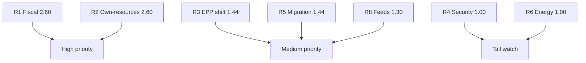

# Risk Matrix — Year-Ahead Risk Scoring (EP10, 2026→2027)

> **Article type:** `year-ahead`
> **Run date:** 2026-05-31
> **Data mode:** degraded-feeds
> **Method:** Likelihood × impact risk scoring with WEP bands and Admiralty source grades.

## BLUF

The dominant risks to the 2026→2027 agenda are fiscal and coalitional.

The highest composite-score risk is fiscal deterioration (Likely × High).

The most severe tail risk is an external security shock (Unlikely × Very High).

Source confidence is A1 on macro inputs and B2 on political inputs.

## Risk Scoring Scale

Likelihood is banded with WEP terms.

Impact is scored 1 (Low) to 5 (Very High).

Composite score is likelihood-weight × impact.

| WEP band | Weight |
| --- | --- |
| Almost Certain | 0.90 |
| Likely | 0.65 |
| Roughly Even | 0.48 |
| Unlikely | 0.20 |
| Highly Unlikely | 0.10 |

## Risk Register with Scores

| ID | Risk | WEP | Impact | Score | Grade |
| --- | --- | --- | --- | --- | --- |
| R1 | Fiscal deterioration stalls budget | Likely | 4 | 2.60 | A1 |
| R2 | Own-resources veto | Likely | 4 | 2.60 | B2 |
| R3 | EPP rightward realignment | Roughly Even | 3 | 1.44 | B2 |
| R4 | External security shock | Unlikely | 5 | 1.00 | C3 |
| R5 | Migration crisis | Roughly Even | 3 | 1.44 | B2 |
| R6 | Energy/financial episode | Unlikely | 5 | 1.00 | C3 |
| R7 | Big-Tech enforcement reversal | Unlikely | 3 | 0.60 | C3 |
| R8 | Feed/data degradation | Likely | 2 | 1.30 | B2 |

## Risk Heat Map

## Priority Tiers

High-priority risks: R1 and R2 (fiscal cluster).

Medium-priority risks: R3, R5, R8.

Tail-watch risks: R4, R6, R7.

## Risk Treatment

R1 and R2 are mitigated by trimming budget ambition to fiscal reality.

R3 is monitored via EPP roll-call alignment.

R4 and R6 are tail risks tracked in `wildcards-blackswans.md`.

R8 is mitigated by the degraded-feeds protocol and `mcp-reliability-audit.md`.

## WEP-Banded Top Judgements

It is Likely (55–70%) that fiscal risk constrains the 2027 budget.

It is Roughly Even (40–55%) that coalition risk affects a major file.

It is Unlikely (15–25%) that a tail risk materialises this year.

Source grades: A1 (macro), B2 (political), C3 (tail base rates).

## Confidence Statement

Confidence is 🟢 HIGH on the fiscal-risk ranking.

Confidence is 🟡 MEDIUM on coalition-risk probability.

Confidence is 🔴 LOW on tail-risk timing.

Composite source grade for this matrix: B2.

## Bottom Line

The risk picture is concentrated in the fiscal cluster.

The article should foreground budget and own-resources risk.

Tail risks warrant a watch list, not headline weight.

## Risk Velocity and Trend

| Risk | Trend | Velocity |
| --- | --- | --- |
| R1 Fiscal | Worsening | Fast |
| R2 Own-resources | Stable | Slow |
| R3 EPP shift | Uncertain | Medium |
| R5 Migration | Volatile | Fast |
| R8 Feeds | Stable | Slow |

Fast-velocity risks need the closest monitoring.

Fiscal and migration risks can shift within a quarter.

## Residual Risk After Treatment

R1 residual is Medium after budget-trimming mitigation.

R2 residual is High because veto power is structural.

R3 residual is Medium with active roll-call monitoring.

R8 residual is Low under the degraded-feeds protocol.

## Risk Ownership

Fiscal risk is owned by the budgetary authority and treasuries.

Coalition risk is owned by the group leaderships.

Operational risk is owned by the monitoring pipeline.

## Cross-Reference

See `threat-model.md` for the qualitative threat narrative.

See `wildcards-blackswans.md` for tail-risk detail.

See `economic-context.md` for the fiscal-risk evidence base.
