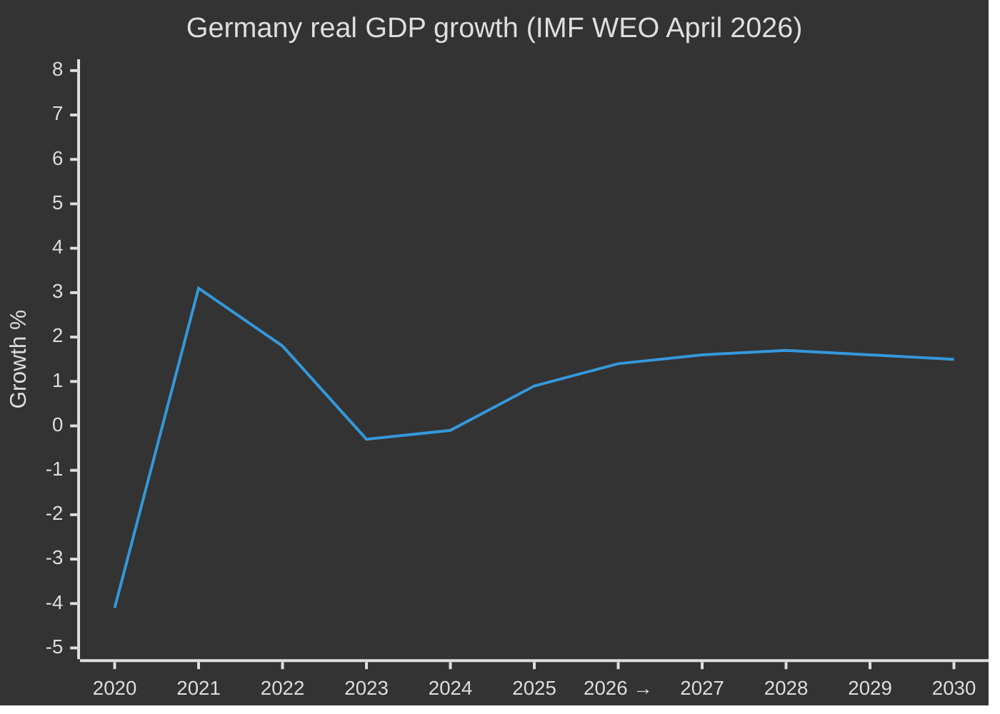
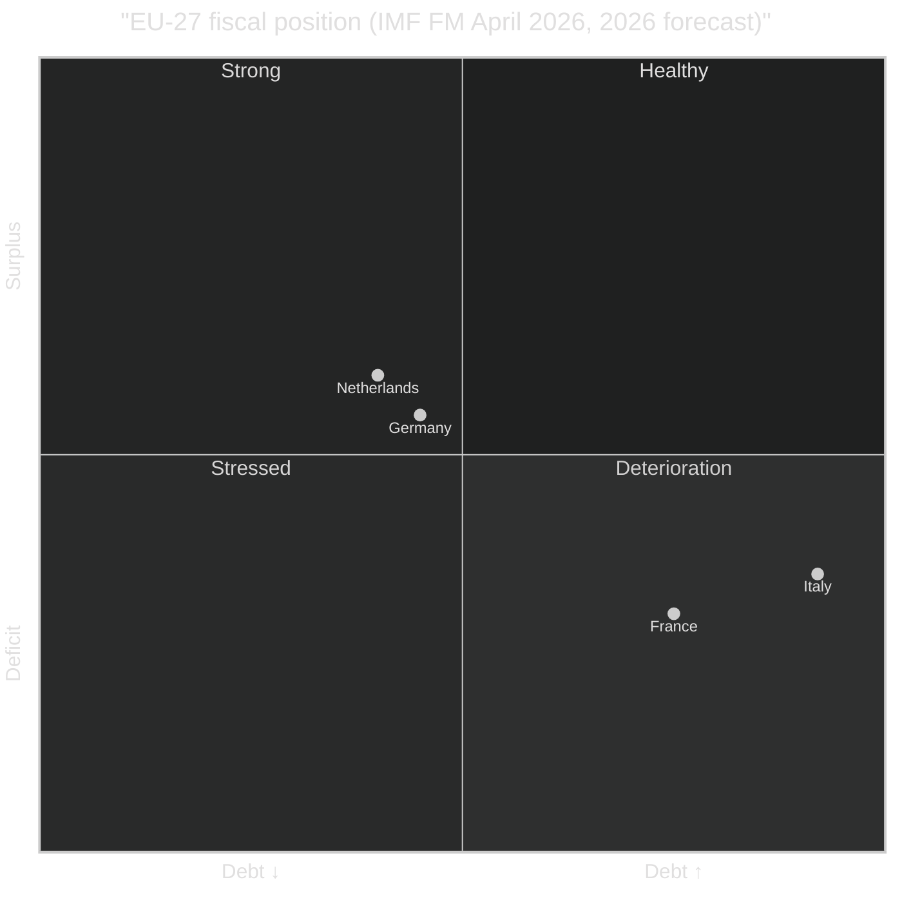

# 📊 IMF Chart Integration Guide — EU Parliament Monitor

> How to render IMF data in articles and analysis with Chart.js and
> Mermaid, including the **forecast-shaded overlay** pattern that
> distinguishes IMF actuals from projections.

**📅 Last Updated:** 2026-04-20 | **🏷️ Classification:** Public

---

## 1. Design Principles

1. **Forecast visibility**: Every IMF chart that extends into
   projection years MUST visually separate actuals from forecasts —
   the recommended technique is a dashed line segment for forecasts
   plus a subtle shaded background rectangle from
   `forecastStartYear - 0.5` onward.
2. **Vintage attribution**: Every IMF chart caption MUST cite the
   vintage (e.g. "Source: IMF World Economic Outlook, April 2026").
3. **Colour parity with WB**: Re-use the EU Parliament Monitor palette
   defined in `analysis/worldbank/chart-integration-guide.md` so charts
   from both sources are visually consistent. IMF forecast segments
   use the same colour as the actual but at 60 % opacity.
4. **Accessibility**: Chart `aria-label` values describe the trend AND
   mark the forecast period (e.g. "Germany real GDP growth 2015–2030,
   actuals 2015–2025, IMF April 2026 forecast 2026–2030").

---

## 2. Chart.js — Real GDP Growth with Forecast Overlay

```js
/**
 * Render an IMF annual series with actuals → forecast transition.
 *
 * @param {HTMLCanvasElement} canvas
 * @param {{labels:string[], actual:number[], forecast:number[], forecastStartIndex:number, vintage:string}} data
 */
function renderIMFSeriesWithForecast(canvas, data) {
  const ctx = canvas.getContext('2d');
  // Two datasets so the legend can distinguish actuals from projections.
  const actualDataset = {
    label: 'Actual',
    data: data.actual,
    borderColor: '#003399',
    backgroundColor: 'rgba(0, 51, 153, 0.1)',
    tension: 0.25,
    pointRadius: 3,
  };
  const forecastDataset = {
    label: 'IMF forecast',
    data: data.forecast,
    borderColor: 'rgba(0, 51, 153, 0.6)',
    borderDash: [6, 4],
    backgroundColor: 'rgba(0, 51, 153, 0.05)',
    tension: 0.25,
    pointRadius: 3,
  };
  return new Chart(ctx, {
    type: 'line',
    data: { labels: data.labels, datasets: [actualDataset, forecastDataset] },
    options: {
      responsive: true,
      plugins: {
        title: {
          display: true,
          text: `Real GDP growth — IMF ${data.vintage}`,
        },
        subtitle: {
          display: true,
          text: 'Dashed segment = IMF projection',
        },
        annotation: {
          annotations: {
            forecastZone: {
              type: 'box',
              xMin: data.labels[data.forecastStartIndex],
              xMax: data.labels[data.labels.length - 1],
              backgroundColor: 'rgba(0, 51, 153, 0.04)',
              borderColor: 'rgba(0, 0, 0, 0)',
            },
          },
        },
      },
      scales: {
        y: { ticks: { callback: (v) => `${v}%` } },
      },
    },
  });
}
```

Keep the `data.actual` array padded with `null` for years inside the
forecast window and `data.forecast` padded with `null` for years inside
the actual window — Chart.js will draw them as a continuous combined
series with the visual distinction encoded in the dataset style.

---

## 3. Chart.js — Fiscal Monitor Debt Trajectory

Fiscal Monitor series are annual, with 5-year forecasts. Use the same
pattern as §2 with a y-axis scaled in "% of GDP":

```js
scales: {
  y: {
    title: { display: true, text: 'General government gross debt (% of GDP)' },
    beginAtZero: false,
    ticks: { callback: (v) => `${v.toFixed(0)} %` },
  },
}
```

Add a horizontal reference line at the Maastricht 60 % threshold using
the `annotation` plugin:

```js
annotations: {
  maastricht: {
    type: 'line',
    yMin: 60,
    yMax: 60,
    borderColor: '#D32F2F',
    borderDash: [4, 4],
    label: { content: 'Maastricht 60 %', enabled: true, position: 'end' },
  },
}
```

---

## 4. Mermaid `xychart-beta` with Forecast Marker

Mermaid's `xychart-beta` does not yet support true dashed-segment
styling. Mark the forecast transition with an inline label instead:



Cite the vintage in the caption in the surrounding prose:
`*Source: IMF World Economic Outlook, April 2026. Values from 2026 are IMF projections.*`

---

## 5. Quadrant Chart — Fiscal Position Snapshot

Use the canonical EU Parliament Monitor quadrant initialiser (from
`analysis/methodologies/political-style-guide.md`). IMF debt vs primary
balance is a particularly useful 2D framing:



---

## 6. Accessibility Checklist

- [ ] `aria-label` on every `<canvas>` element includes vintage + date range
- [ ] Chart legend clearly distinguishes "Actual" vs "Forecast"
- [ ] Colour-blind safe palette (tested with Stark/Axe)
- [ ] Minimum 4.5:1 contrast on all line + axis colours
- [ ] Caption prose labels forecast window explicitly
- [ ] axe-core reports zero violations in `e2e/*.spec.js`

---

## 7. HTML Template Hook

Under the aggregator pipeline the agent writes Markdown into
`intelligence/economic-context.md` and the aggregator (`src/aggregator/**`)
renders it as a `<section class="economic-context imf-economic-context">`
block in the final article, preserving the `data-vintage="…"` attribute
declared in the markdown front-matter. Flag forecast rows in the source
table by adding the markdown attribute `{data-forecast="true"}` to the
`<tr>` (via `markdown-it-attrs`, already wired in the aggregator). Style
hook:

```css
.imf-economic-context tr[data-forecast="true"] td {
  font-style: italic;
  color: var(--forecast-fg, #334);
}
.imf-economic-context tr[data-forecast="true"] .forecast-flag {
  background: var(--forecast-bg, #f3f6ff);
  padding: 0 .25em;
  border-radius: 3px;
  font-size: .85em;
}
```
