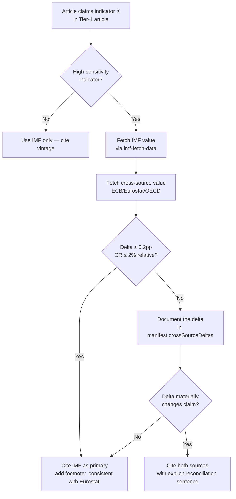

<!-- SPDX-FileCopyrightText: 2024-2026 Hack23 AB -->
<!-- SPDX-License-Identifier: Apache-2.0 -->

# 🔗 IMF Cross-Source Triangulation — EU Parliament Monitor

> **Purpose**: When an IMF-sourced number should be cross-checked
> against another authoritative publisher (ECB, Eurostat, OECD,
> national statistical offices, BIS) before publication. Defines the
> triangulation-required matrix keyed to the article's significance
> tier and indicator class.

**📅 Last Updated:** 2026-04-25 | **🏷️ Classification:** Public | **🌀 Wave:** 4

> **Principle**: IMF is the *primary* economic-context source for EU
> Parliament Monitor. Triangulation is additional rigour, not
> a replacement. The goal is to catch (a) rare IMF data-entry errors,
> (b) vintage-drift between sources, and (c) methodological
> differences that matter for the editorial claim.

---

## 1. Triangulation Sources

| Source | Surface | Scope | Editorial trust |
|--------|---------|-------|----------------|
| **ECB SDW** (Statistical Data Warehouse) | `https://data.ecb.europa.eu/` | Monetary, FX, inflation (HICP), banking | ★★★★★ for EA monetary + HICP |
| **Eurostat** | `https://ec.europa.eu/eurostat/data/database` | All official EU statistics — GDP (ESA 2010), labour, trade, prices | ★★★★★ for EU-27 harmonised stats |
| **OECD.Stat** | `https://stats.oecd.org/` | Cross-country macro + structural | ★★★★ for advanced-economy comparison |
| **BIS** | `https://www.bis.org/statistics/` | Cross-border banking, debt securities | ★★★★ for financial-stability |
| **National stats offices (NSOs)** | e.g. DESTATIS, INSEE, ISTAT | National definitive series | ★★★★★ for single-country primary sourcing |
| **IMF (primary)** | SDMX REST | Global + EU — all economic context | ★★★★★ — the EP default |

---

## 2. Triangulation-Required Matrix

Trigger triangulation when **all three** conditions hold:

1. The claim sits in a **Tier-1 significance** article (breaking of
   high impact, committee-reports with direct legislative leverage,
   flagship weekly/monthly review).
2. The indicator is in the **high-sensitivity** class (below).
3. The deadline allows it (synchronous: always; async workflows:
   best-effort with a 5-minute cap).

**High-sensitivity indicator class (triangulation mandatory):**

| Indicator | IMF source | Triangulate against |
|-----------|:----------:|---------------------|
| Real GDP growth, EU / EA | `WEO` `NGDP_RPCH` | Eurostat `namq_10_gdp` or `nama_10_gdp` |
| HICP inflation, EU / EA | `CPI` or `WEO` `PCPIPCH` | Eurostat `prc_hicp_manr` OR ECB SDW |
| Unemployment, EU / EA | `WEO` `LUR` | Eurostat `une_rt_m` |
| Gov debt, EU / EA | `FM` `GGXWDG_NGDP` | Eurostat `gov_10dd_edpt1` |
| Primary / structural balance | `FM` `GGXONLB_NGDP`, `GGSB_NPGDP` | Eurostat EDP tables |
| ECB policy rate | `IFS` `FPOLM_PA` | ECB press release (authoritative) |
| Current account | `WEO` `BCA_NGDPD` | Eurostat `bop_c6_a` |

**Medium-sensitivity (triangulation recommended, not mandatory):**

| Indicator | IMF source | Cross-ref |
|-----------|:----------:|-----------|
| REER / NEER | `ER` `EREER_IX` | BIS REER series |
| FDI flows | `BOP_AGG` `BFD_BP6_USD` | Eurostat `bop_fdi6_flow` |
| Bank capital / NPLs | `FSI` | ECB SSM supervisory statistics |

**Low-sensitivity (IMF alone is sufficient):**

- WEO regional aggregates (G7/G20)
- Historical series (HSG, HPDD, HISTINF)
- Commodity prices (PCPS)

---

## 3. Triangulation Workflow



---

## 4. Reconciliation Sentence Patterns

When a material delta (≥0.2 pp or ≥2% relative) is documented:

- **Methodology difference**: "The IMF figure (x.x%) and the
  Eurostat figure (y.y%) differ by z.z pp, reflecting [ESA 2010 vs
  IMF WEO scope / quarterly vs annual base / preliminary vs
  finalised]."
- **Vintage difference**: "IMF's April 2026 WEO uses 2025 estimates;
  Eurostat has since released finalised 2025 data showing…"
- **Scope difference**: "IMF reports EU current membership; Eurostat
  EA19 vs EA20 [where applicable]."

---

## 5. Recording Triangulation in the Manifest

Add a `crossSourceTriangulation` block to `manifest.json` when
triangulation was performed:

```json
{
  "crossSourceTriangulation": {
    "indicator": "NGDP_RPCH",
    "refArea": "EA",
    "imfVintage": "WEO-April-2026",
    "imfValue": 1.4,
    "crossSource": "Eurostat",
    "crossSourceSeries": "namq_10_gdp",
    "crossSourceValue": 1.5,
    "deltaPP": 0.1,
    "decision": "consistent",
    "reconciliationNote": null
  }
}
```

---

## 6. When Triangulation Is Infeasible

If the cross-source is unavailable (API down, embargo, network
policy):

1. Cite IMF alone with a footnote: *"Eurostat data not yet released
   for this reference period; figure to be reconciled in the next
   monthly review."*
2. Log the infeasibility in `manifest.triangulationSkipped[]`.
3. Flag the article for follow-up in the next workflow run.

---

## 7. Anti-patterns (DO NOT)

- ❌ Cite Eurostat as primary and relegate IMF to a footnote — the
  is IMF-primary for economic context.
- ❌ Hide a material delta — always surface in prose or footnote.
- ❌ Pick the "prettier" number — document the actual delta and
  explain the methodology difference.
- ❌ Triangulate against non-authoritative sources (think tanks,
  brokerage research, commercial data vendors) for the primary claim.

---

## 8. See also

- [`release-calendar.md`](release-calendar.md) — vintage timing
- [`forecast-accuracy-baseline.md`](forecast-accuracy-baseline.md) — confidence bands
- [`../methodologies/imf-indicator-mapping.md`](../methodologies/imf-indicator-mapping.md) — validator wiring
- [`../methodologies/osint-tradecraft-standards.md`](../methodologies/osint-tradecraft-standards.md) — Admiralty source grading + confidence levels
