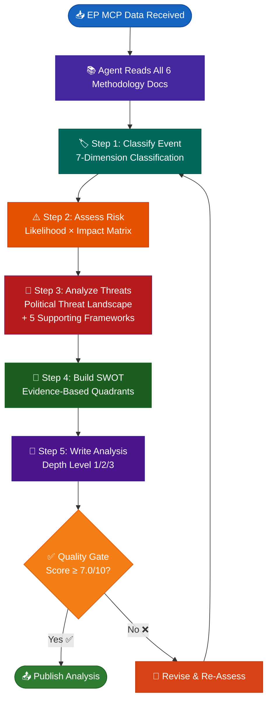
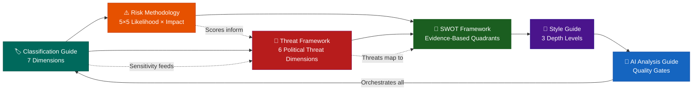
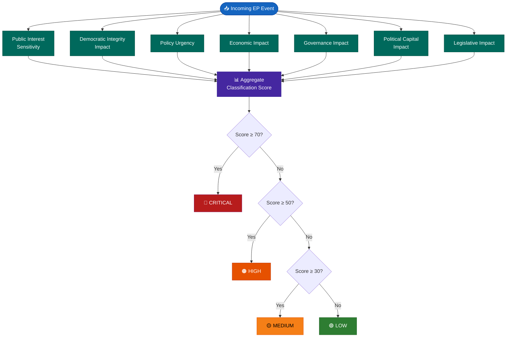
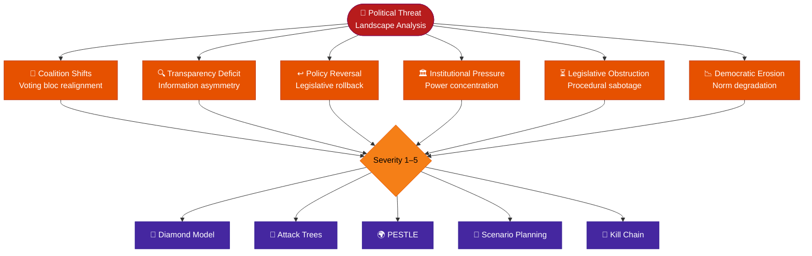
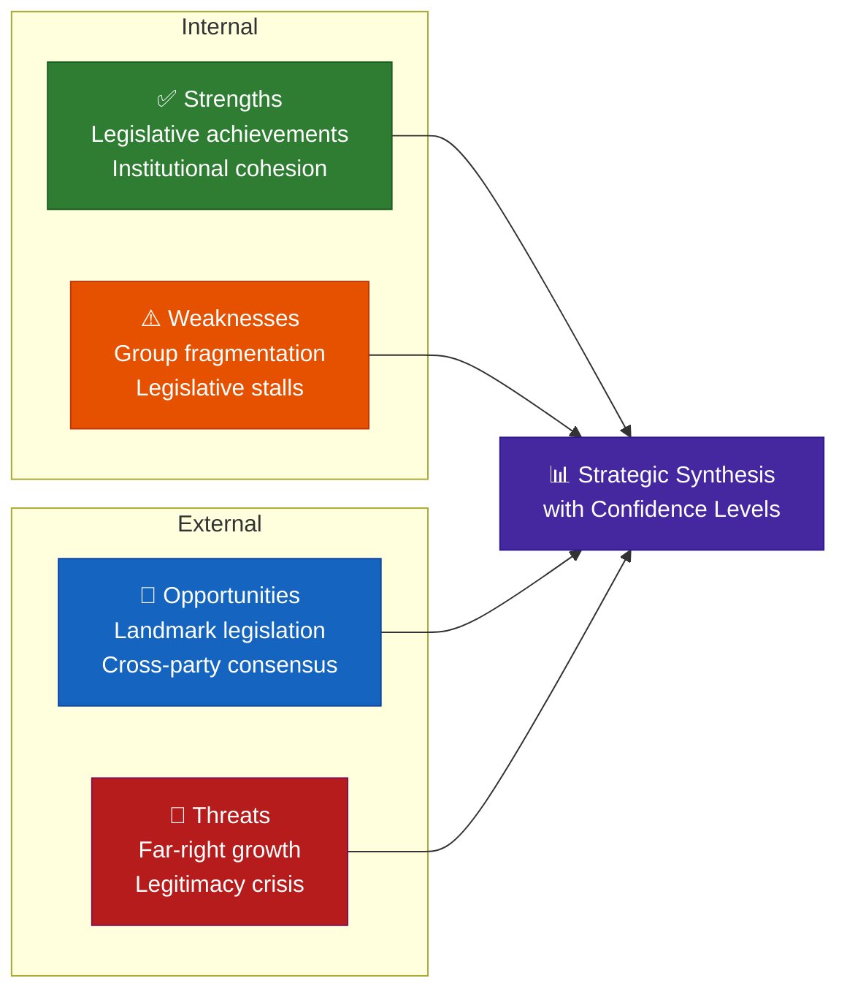
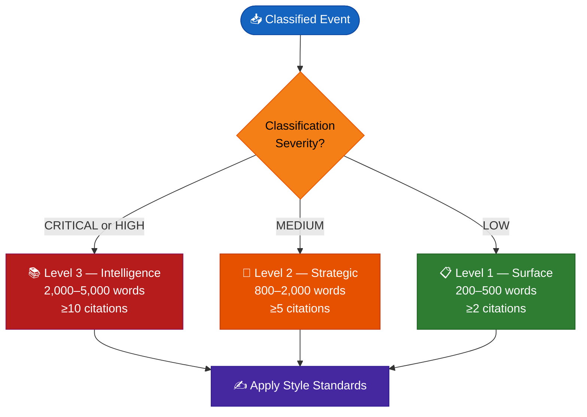
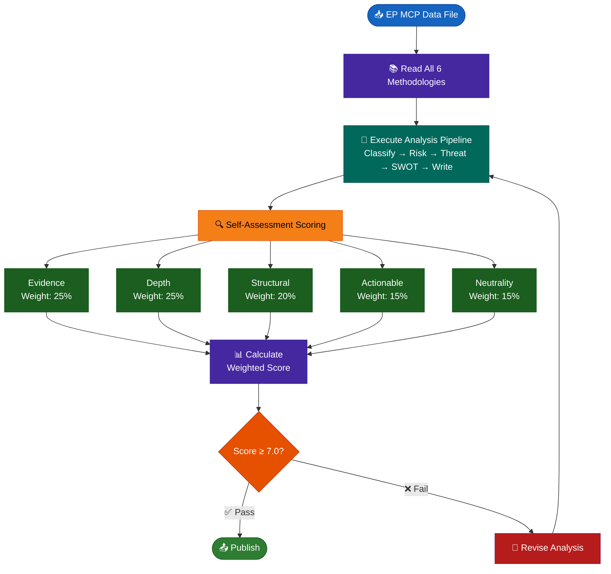
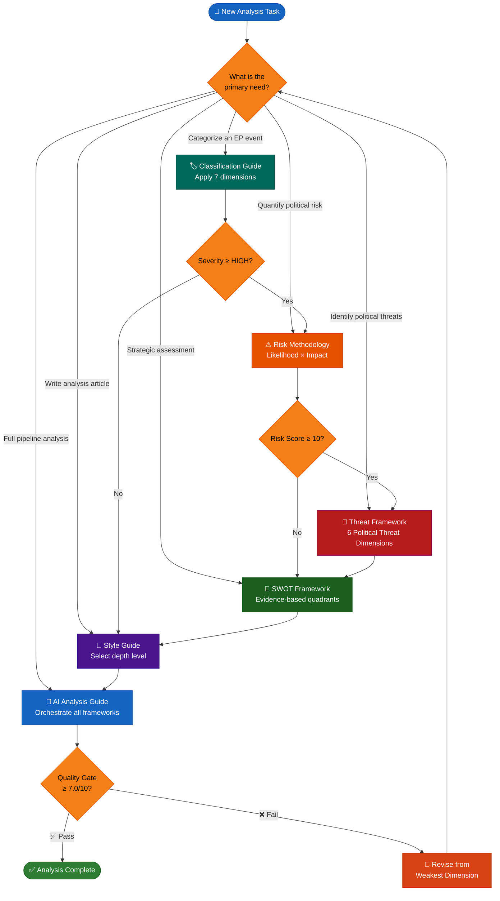

<p align="center">
  
</p>

<h1 align="center">📐 EU Parliament Monitor — Analysis Methodologies</h1>

<p align="center">
  <strong>📊 Six Comprehensive Political Intelligence Frameworks for European Parliament Analysis</strong><br>
  <em>🎯 Classification · Risk · Threat Landscape · SWOT · Style · AI Quality</em>
</p>

<p align="center">
  <a href="#"></a>
  <a href="#"></a>
  <a href="#"></a>
  <a href="#"></a>
  <a href="#"></a>
</p>

**📋 Document Owner:** CEO | **📄 Version:** 1.0 | **📅 Last Updated:** 2026-03-30 (UTC)
**🔄 Review Cycle:** Quarterly | **⏰ Next Review:** 2026-06-30
**🏢 Owner:** Hack23 AB (Org.nr 5595347807) | **🏷️ Classification:** Public

---

## 📚 Architecture Documentation Map

<div class="documentation-map">

| Document                                                            | Focus              | Description                                    | Documentation Link                                                                                     |
| ------------------------------------------------------------------- | ------------------ | ---------------------------------------------- | ------------------------------------------------------------------------------------------------------ |
| **[Architecture](../../ARCHITECTURE.md)**                           | 🏛️ Architecture    | C4 model showing current system structure      | [View Source](https://github.com/Hack23/euparliamentmonitor/blob/main/ARCHITECTURE.md)                 |
| **[Future Architecture](../../FUTURE_ARCHITECTURE.md)**             | 🏛️ Architecture    | C4 model showing future system structure       | [View Source](https://github.com/Hack23/euparliamentmonitor/blob/main/FUTURE_ARCHITECTURE.md)          |
| **[Security Architecture](../../SECURITY_ARCHITECTURE.md)**         | 🛡️ Security        | Current security implementation                | [View Source](https://github.com/Hack23/euparliamentmonitor/blob/main/SECURITY_ARCHITECTURE.md)        |
| **[Threat Model](../../THREAT_MODEL.md)**                           | 🎯 Security        | Threat analysis                                | [View Source](https://github.com/Hack23/euparliamentmonitor/blob/main/THREAT_MODEL.md)                 |
| **[Data Model](../../DATA_MODEL.md)**                               | 📊 Data            | Current data structures and relationships      | [View Source](https://github.com/Hack23/euparliamentmonitor/blob/main/DATA_MODEL.md)                   |
| **[Flowcharts](../../FLOWCHART.md)**                                | 🔄 Process         | Current data processing workflows              | [View Source](https://github.com/Hack23/euparliamentmonitor/blob/main/FLOWCHART.md)                    |
| **[SWOT Analysis](../../SWOT.md)**                                  | 💼 Business        | Current strategic assessment                   | [View Source](https://github.com/Hack23/euparliamentmonitor/blob/main/SWOT.md)                         |
| **[Workflows](../../WORKFLOWS.md)**                                 | ⚙️ DevOps          | CI/CD documentation                            | [View Source](https://github.com/Hack23/euparliamentmonitor/blob/main/WORKFLOWS.md)                    |
| **[Classification](../../CLASSIFICATION.md)**                       | 🏷️ Governance      | CIA classification & BCP                       | [View Source](https://github.com/Hack23/euparliamentmonitor/blob/main/CLASSIFICATION.md)               |
| **[CRA Assessment](../../CRA-ASSESSMENT.md)**                       | 🛡️ Compliance      | Cyber Resilience Act                           | [View Source](https://github.com/Hack23/euparliamentmonitor/blob/main/CRA-ASSESSMENT.md)               |
| **[Business Continuity Plan](../../BCPPlan.md)**                    | 🔄 Resilience      | Recovery planning                              | [View Source](https://github.com/Hack23/euparliamentmonitor/blob/main/BCPPlan.md)                      |
| **[Security Policy](../../SECURITY.md)**                            | 🔒 Security        | Vulnerability reporting & security policy      | [View Source](https://github.com/Hack23/euparliamentmonitor/blob/main/SECURITY.md)                     |
| **[Analysis Methodologies](README.md)**                             | 📐 Methodology     | Political intelligence analysis frameworks     | [View Source](https://github.com/Hack23/euparliamentmonitor/blob/main/analysis/methodologies/README.md)|

</div>

---

## 🛡️ ISMS Policy Alignment

| Policy | Description | Relevance to Analysis Methodologies |
|--------|-------------|-------------------------------------|
| **[Information Security Policy](https://github.com/Hack23/ISMS-PUBLIC/blob/main/Information_Security_Policy.md)** | Organization-wide security governance and risk management | Defines risk assessment methodology adapted for political risk scoring |
| **[AI Policy](https://github.com/Hack23/ISMS-PUBLIC/blob/main/AI_Policy.md)** | Responsible AI usage, transparency, and human oversight | Governs LLM-driven analysis: quality gates, bias mitigation, evidence requirements |
| **[Classification Policy](https://github.com/Hack23/ISMS-PUBLIC/blob/main/Classification_Policy.md)** | Data classification scheme and handling requirements | Classification guide aligns sensitivity levels with ISMS classification tiers |
| **[Secure Development Policy](https://github.com/Hack23/ISMS-PUBLIC/blob/main/Secure_Development_Policy.md)** | Secure coding standards and SDLC security gates | Style guide and quality gates enforce structured, reviewable analytical output |
| **[Open Source Policy](https://github.com/Hack23/ISMS-PUBLIC/blob/main/Open_Source_Policy.md)** | Open source contribution and licensing governance | All methodology documents published under project license for transparency |

---

## 🎯 Purpose

This directory contains six interconnected political intelligence analysis methodologies that govern how EU Parliament Monitor's agentic workflows produce, classify, assess, and publish European Parliament analysis. These frameworks transform raw European Parliament MCP data into structured, evidence-based political intelligence.

**Core Principle:** Every analytical claim requires verifiable evidence sourced from European Parliament open data. Opinion-based analysis, boilerplate summaries, and software-centric threat models (such as STRIDE, DREAD, or PASTA) are explicitly rejected.

**Design Philosophy:** The six methodologies form a layered analytical pipeline — classification provides the foundation, risk and threat assessments build the analytical core, SWOT synthesizes strategic implications, style standards enforce writing quality, and the AI guide orchestrates the entire pipeline with quality gates.

---

## 🔄 Methodology Pipeline — How AI Agents Apply Frameworks

The following diagram illustrates the sequential pipeline that an AI agent follows when processing an incoming European Parliament data file:



---

## 📊 Methodology Relationship Map

This diagram shows how the six methodology documents relate to each other and feed into the final analysis output:



---

## 📋 Methodology Summary Table

| Priority | Document | Key Content | Dimensions / Frameworks | When to Apply |
|----------|----------|-------------|-------------------------|---------------|
| **1** | **[Political Classification Guide](political-classification-guide.md)** | 7-dimension event classification, sensitivity levels, policy domain taxonomy, urgency matrix | Sensitivity (4 levels), Democratic Integrity, Policy Urgency, Economic Impact, Governance Impact, Political Capital, Legislative Impact | **First** — every incoming EP event/document must be classified before any analysis begins |
| **2** | **[Political Risk Methodology](political-risk-methodology.md)** | Likelihood × Impact scoring, 6 EP risk categories, 5×5 matrix, Grand Coalition stability risk | Coalition Stability, Policy Implementation, Institutional Integrity, Economic Governance, Social Cohesion, Geopolitical Standing | **Second** — after classification, assess political risk using calibrated scoring |
| **3** | **[Political Threat Framework](political-threat-framework.md)** | Multi-framework threat analysis: Political Threat Landscape + 5 supporting frameworks | Coalition Shifts, Transparency Deficit, Policy Reversal, Institutional Pressure, Legislative Obstruction, Democratic Erosion | **Third** — apply threat analysis using political frameworks (never STRIDE/DREAD/PASTA) |
| **4** | **[Political SWOT Framework](political-swot-framework.md)** | Evidence-based SWOT, confidence levels, 180-day decay, group-to-landscape aggregation | Strengths, Weaknesses, Opportunities, Threats — each with confidence (HIGH/MEDIUM/LOW) | **Fourth** — synthesize classification + risk + threat into strategic SWOT assessment |
| **5** | **[Political Style Guide](political-style-guide.md)** | Writing standards, 3 depth levels, evidence density requirements, anti-patterns | Level 1 Surface (200–500 words), Level 2 Strategic (800–2,000 words), Level 3 Intelligence (2,000–5,000 words) | **Fifth** — apply writing standards when drafting the analysis document |
| **6** | **[AI-Driven Analysis Guide](ai-driven-analysis-guide.md)** | Per-file AI protocol, quality gates, weighted scoring (7.0/10 minimum), conflict resolution | Evidence (25%), Depth (25%), Structural (20%), Actionable (15%), Neutrality (15%) | **Always** — orchestrates the entire pipeline; AI agents must read this first |

---

## 🏷️ 1. Political Classification Guide

### Purpose & Scope

The classification guide establishes the authoritative methodology for categorizing every European Parliament event and document entering the analysis pipeline. It serves as the **mandatory first step** before any other analytical framework is applied.

### Key Concepts

| Concept | Description | Scale |
|---------|-------------|-------|
| **Sensitivity Levels** | Determines publication handling requirements | 🟢 PUBLIC → 🟡 SENSITIVE → 🔴 RESTRICTED |
| **Policy Domain Taxonomy** | Categorizes events by EU policy area | Environment, Economy, Foreign Affairs, Justice, etc. |
| **Urgency Matrix** | Assesses time-sensitivity for editorial response | Immediate → Short-term → Medium-term → Long-term |
| **7 Classification Dimensions** | Multi-axis scoring across political impact areas | 4-level ordinal scale per dimension |
| **Score Thresholds** | Aggregate classification severity tiers | ≥70 CRITICAL · ≥50 HIGH · ≥30 MEDIUM · <30 LOW |

### Classification Dimension Diagram



### Connection to Other Methodologies

- **Feeds into Risk Methodology:** Classification severity determines initial risk likelihood calibration
- **Feeds into Threat Framework:** Sensitivity level determines which threat dimensions to prioritize
- **Feeds into SWOT:** High-classification events trigger SWOT re-assessment

---

## ⚠️ 2. Political Risk Methodology

### Purpose & Scope

Provides a systematic **Likelihood × Impact** scoring framework for European Parliament political risks, adapted from the Hack23 ISMS Risk Assessment Methodology. Produces quantified risk scores across six EP-specific risk categories.

### Key Concepts

| Concept | Description | Scale |
|---------|-------------|-------|
| **Likelihood Scale** | Probability of risk materializing | Rare (1) → Unlikely (2) → Possible (3) → Likely (4) → Almost Certain (5) |
| **Impact Scale** | Severity of consequences if realized | Negligible (1) → Minor (2) → Moderate (3) → Major (4) → Severe (5) |
| **Risk Score** | Quantified assessment: Likelihood × Impact | 1–25 (Low: 1–4, Medium: 5–9, High: 10–14, Critical: 15–25) |
| **Six Risk Categories** | EP-specific political risk domains | Coalition, Policy, Institutional, Economic, Social, Geopolitical |
| **Grand Coalition Risk** | Dedicated assessment of EP governing coalition stability | Composite metric from multiple indicators |

### Risk Scoring Matrix

```mermaid
quadrantChart
    title Likelihood × Impact Risk Matrix
    x-axis Low Impact --> High Impact
    y-axis Low Likelihood --> High Likelihood
    quadrant-1 Critical Risk (15–25)
    quadrant-2 High Risk (10–14)
    quadrant-3 Low Risk (1–4)
    quadrant-4 Medium Risk (5–9)
```

### Connection to Other Methodologies

- **Receives from Classification:** Classification severity calibrates initial likelihood estimates
- **Feeds into Threat Framework:** High-risk scores trigger deeper multi-framework threat analysis
- **Feeds into SWOT:** Risk scores populate the Threats and Weaknesses quadrants

---

## 🎯 3. Political Threat Framework

### Purpose & Scope

Provides comprehensive, multi-framework political threat analysis using **purpose-built political intelligence frameworks**. This framework explicitly rejects software-centric threat models (STRIDE, DREAD, PASTA) in favor of six frameworks designed for democratic process analysis.

### Key Concepts

| Concept | Description | Frameworks |
|---------|-------------|------------|
| **Political Threat Landscape** | Core 6-dimension political threat model | Coalition Shifts, Transparency Deficit, Policy Reversal, Institutional Pressure, Legislative Obstruction, Democratic Erosion |
| **Diamond Model** | Adversary analysis identifying actors, capabilities, and motivations | Adversary → Infrastructure → Capability → Victim |
| **Attack Trees** | Goal-oriented threat decomposition for political objectives | Root goal → Sub-goals → Leaf actions |
| **PESTLE** | Macro-environmental threat scanning | Political, Economic, Social, Technological, Legal, Environmental |
| **Scenario Planning** | Forward-looking threat assessment with probability-weighted scenarios | Best Case → Base Case → Worst Case |
| **Political Kill Chain** | Sequential threat progression in political processes | Reconnaissance → Mobilization → Positioning → Execution → Exploitation |

### Political Threat Dimension Diagram



### Connection to Other Methodologies

- **Receives from Classification:** Sensitivity levels determine which threat dimensions require analysis
- **Receives from Risk:** High-risk scores trigger multi-framework deep analysis
- **Feeds into SWOT:** Identified threats populate the Threats quadrant with evidence chains

---

## 💼 4. Political SWOT Framework

### Purpose & Scope

Establishes an **evidence-based** SWOT methodology where every entry in every quadrant must cite verifiable European Parliament data. This framework rejects opinion-based SWOT analysis and enforces confidence levels with a 180-day expiration rule.

### Key Concepts

| Concept | Description | Details |
|---------|-------------|---------|
| **Evidence Requirement** | Every SWOT entry must cite EP data sources | MCP tool calls, document references, voting records |
| **Confidence Levels** | Reliability grading for each entry | HIGH (multiple current sources) · MEDIUM (single primary) · LOW (credible but unverified) |
| **180-Day Decay** | Entries expire if not re-verified | Prevents stale assessments from persisting |
| **Group-to-Landscape Aggregation** | Individual political group SWOTs aggregate into landscape-level SWOT | Weighted by seat share and coalition significance |
| **Minimum Density** | Each quadrant must contain at least 2 entries | Prevents superficial analysis |

### SWOT Quadrant Flow



### Connection to Other Methodologies

- **Receives from Classification, Risk, and Threat:** All three upstream frameworks feed evidence into SWOT quadrants
- **Feeds into Style Guide:** SWOT depth determines the appropriate writing depth level
- **Feeds into AI Guide:** SWOT completeness is a quality gate criterion (≥2 entries per quadrant)

---

## 📝 5. Political Style Guide

### Purpose & Scope

Establishes mandatory writing standards for all political intelligence analysis produced by EU Parliament Monitor's agentic workflows. Defines three depth levels calibrated to the classification severity and audience needs.

### Key Concepts

| Concept | Description | Specification |
|---------|-------------|---------------|
| **Level 1 — Surface** | News summary for breaking events | 200–500 words, min. 2 citations, daily scores |
| **Level 2 — Strategic** | Analysis article for weekly/committee briefs | 800–2,000 words, min. 5 citations, policy recommendations |
| **Level 3 — Intelligence** | Deep analysis for monthly reports and MEP scorecards | 2,000–5,000 words, min. 10 citations, scenario projections |
| **Evidence Density** | Minimum citations per artifact type | Varies by depth level: EP document refs + MCP data points |
| **Anti-Patterns** | Prohibited writing behaviors | No tables-only, no uncited claims, no opinions without evidence, no STRIDE |
| **Multi-Language** | Standards for 14-language output | Consistent analytical structure across all supported languages |

### Writing Depth Selection



### Connection to Other Methodologies

- **Receives from Classification:** Severity determines depth level (Level 1, 2, or 3)
- **Receives from SWOT:** Strategic synthesis informs the narrative structure
- **Feeds into AI Guide:** Style compliance is a quality gate criterion

---

## 🤖 6. AI-Driven Analysis Guide

### Purpose & Scope

Defines the comprehensive per-file AI analysis protocol. This is the **orchestrator** document that AI agents must read before processing any European Parliament data file. It specifies the analysis pipeline, document-type focus templates, quality gates, and conflict resolution for parallel workflows.

### Key Concepts

| Concept | Description | Specification |
|---------|-------------|---------------|
| **Per-File Protocol** | Each EP MCP data file receives its own analysis | Dedicated markdown output per source file |
| **Document-Type Templates** | Tailored analysis focus per EP document type | Adopted texts, procedures, votes, speeches, questions, events, etc. |
| **Quality Score Formula** | Weighted multi-criteria self-assessment | Evidence (25%) + Depth (25%) + Structural (20%) + Actionable (15%) + Neutrality (15%) |
| **Minimum Score** | Hard quality gate for publication | **7.0/10 weighted score** — below threshold requires revision |
| **Conflict Resolution** | Rules for parallel workflow outputs | Deduplication, merge strategy, timestamp-based precedence |
| **Methodology Reading Order** | Agents must internalize all 6 methodology docs | This guide → Classification → Risk → Threat → SWOT → Style |

### AI Quality Gate Process



### Connection to Other Methodologies

- **Orchestrates all frameworks:** AI Guide is the entry point that invokes Classification → Risk → Threat → SWOT → Style in sequence
- **Enforces quality gates:** Validates outputs from every upstream methodology meet minimum standards
- **Handles conflicts:** Resolves parallel workflow collisions via timestamp-based precedence rules

---

## 🌳 Methodology Selection Decision Tree

Use this flowchart to determine which methodology to apply for a given analytical task:



---

## ✅ Quality Gate Requirements

All analysis produced under these methodologies must meet the following minimum quality requirements before publication:

### Weighted Quality Score (Minimum 7.0/10)

| Dimension | Weight | Criteria | Fail Indicators |
|-----------|--------|----------|-----------------|
| **Evidence** | 25% | Every claim cites EP MCP data; confidence levels stated; no opinion-only entries | Uncited claims, missing confidence, assertions without data |
| **Depth** | 25% | Appropriate depth level (L1/L2/L3) applied; word count within range; citation count met | Wrong depth level, under minimum citations, superficial coverage |
| **Structural** | 20% | Hack23 header present; metadata complete; Mermaid diagram included; structured tables used | Missing header, no diagram, placeholder content, broken formatting |
| **Actionable** | 15% | Analysis includes concrete implications; stakeholder impact identified; forward-looking recommendations | Purely descriptive without implications, no stakeholder analysis |
| **Neutrality** | 15% | Balanced perspective; no partisan framing; multiple viewpoints acknowledged; factual tone | One-sided framing, loaded language, missing counter-perspectives |

### Structural Checklist

- [ ] Hack23 header with metadata (Owner, Version, Date, Classification)
- [ ] At least one color-coded Mermaid diagram
- [ ] Classification completed across all 7 dimensions
- [ ] SWOT with ≥2 evidence-based entries per quadrant
- [ ] Risk score calculated using 5×5 Likelihood × Impact matrix
- [ ] Threat analysis using Political Threat Landscape (not STRIDE/DREAD/PASTA)
- [ ] Appropriate depth level selected and word/citation counts met
- [ ] Significance score (1–10) with justification

---

## 🚫 Anti-Patterns — What NOT To Do

The following practices are **explicitly prohibited** across all methodologies:

| Anti-Pattern | Why It Fails | Correct Approach |
|-------------|-------------|------------------|
| **Using STRIDE, DREAD, or PASTA** | These are software security threat models, not political intelligence frameworks | Use Political Threat Landscape (6 dimensions), Diamond Model, Attack Trees, PESTLE, Scenario Planning, Kill Chain |
| **Boilerplate summaries** | Generic text adds no analytical value; wastes reader attention | Every paragraph must contain at least one EP data citation or concrete analytical insight |
| **Claims without confidence levels** | Ungraded assertions cannot be evaluated for reliability | Assign HIGH / MEDIUM / LOW confidence with source justification |
| **Tables-only analysis** | Data without narrative interpretation is not analysis | Tables must be accompanied by explanatory prose interpreting the data |
| **Opinion without evidence** | Subjective assertions undermine analytical credibility | All opinions must cite verifiable EP MCP data sources |
| **Hardcoded Mermaid values** | Static diagrams become stale and misleading | Use data-driven values sourced from EP MCP tool results |
| **Shallow classification** | Single-dimension classification misses complexity | Apply all 7 classification dimensions; score each independently |
| **Stale SWOT entries** | Entries older than 180 days without re-verification are unreliable | Enforce 180-day decay rule; re-verify or remove expired entries |
| **Missing stakeholder analysis** | Analysis without impact assessment has no actionable value | Identify affected political groups, MEPs, committees, and citizens |
| **Ignoring multi-language requirements** | Analysis must serve 14-language platform | Structure content for translation; avoid idioms and culture-specific references |

---

## 🔒 ISMS Compliance Framework Mapping

### ISO 27001:2022 Controls

| Control | Title | Methodology Relevance |
|---------|-------|----------------------|
| **A.5.1** | Policies for information security | All methodologies align with Hack23 ISMS policy framework |
| **A.5.10** | Acceptable use of information | Classification guide defines sensitivity-based data handling |
| **A.5.33** | Protection of records | Style guide enforces evidence citation and audit trail |
| **A.8.3** | Information access restriction | Sensitivity levels (PUBLIC/SENSITIVE/RESTRICTED) gate access |
| **A.8.10** | Information deletion | 180-day SWOT decay rule ensures stale data is removed |
| **A.8.28** | Secure coding | AI analysis guide enforces structured, reviewable output with quality gates |

### NIST CSF 2.0 Functions

| Function | Relevance to Methodologies |
|----------|---------------------------|
| **Identify (ID)** | Classification guide identifies and categorizes EP events by sensitivity and impact |
| **Protect (PR)** | Style guide protects analytical quality through evidence requirements and anti-patterns |
| **Detect (DE)** | Threat framework detects political threats across 6 dimensions using multiple analytical models |
| **Respond (RS)** | Risk methodology provides quantified risk scores enabling proportionate response |
| **Recover (RC)** | SWOT framework supports strategic recovery planning through forward-looking opportunity analysis |

### CIS Controls v8.1

| Control | Title | Methodology Relevance |
|---------|-------|----------------------|
| **Control 1** | Inventory and Control of Enterprise Assets | Classification guide inventories and categorizes all EP data assets |
| **Control 3** | Data Protection | Sensitivity levels enforce appropriate handling for each data classification |
| **Control 8** | Audit Log Management | AI analysis guide requires documented quality gate assessments (audit trail) |
| **Control 14** | Security Awareness and Skills Training | Methodology documents serve as training material for AI agents and analysts |
| **Control 16** | Application Software Security | Quality gates enforce structured, validated analytical output |

---

## 🔗 Related Documentation

- **[Architecture](../../ARCHITECTURE.md)** — C4 system architecture and deployment model
- **[Security Architecture](../../SECURITY_ARCHITECTURE.md)** — Security controls and compliance mapping
- **[Data Model](../../DATA_MODEL.md)** — European Parliament data structures and relationships
- **[Flowcharts](../../FLOWCHART.md)** — Data processing workflows and analysis pipelines
- **[SWOT Analysis](../../SWOT.md)** — Platform-level strategic assessment
- **[Threat Model](../../THREAT_MODEL.md)** — System-level threat analysis
- **[Workflows](../../WORKFLOWS.md)** — CI/CD pipelines including analysis generation
- **[Analysis README](../README.md)** — Parent analysis directory documentation
- **[Classification Policy](https://github.com/Hack23/ISMS-PUBLIC/blob/main/Classification_Policy.md)** — Hack23 ISMS data classification policy
- **[AI Policy](https://github.com/Hack23/ISMS-PUBLIC/blob/main/AI_Policy.md)** — Hack23 ISMS AI governance policy

---

<div class="architecture-footer">

**Document Status:** Living Document
**Last Updated:** 2026-03-30
**Next Review:** 2026-06-30
**Owner:** CEO

This methodology documentation complies with
[Hack23 ISMS AI Policy](https://github.com/Hack23/ISMS-PUBLIC/blob/main/AI_Policy.md) and
[Hack23 ISMS Classification Policy](https://github.com/Hack23/ISMS-PUBLIC/blob/main/Classification_Policy.md).

</div>
