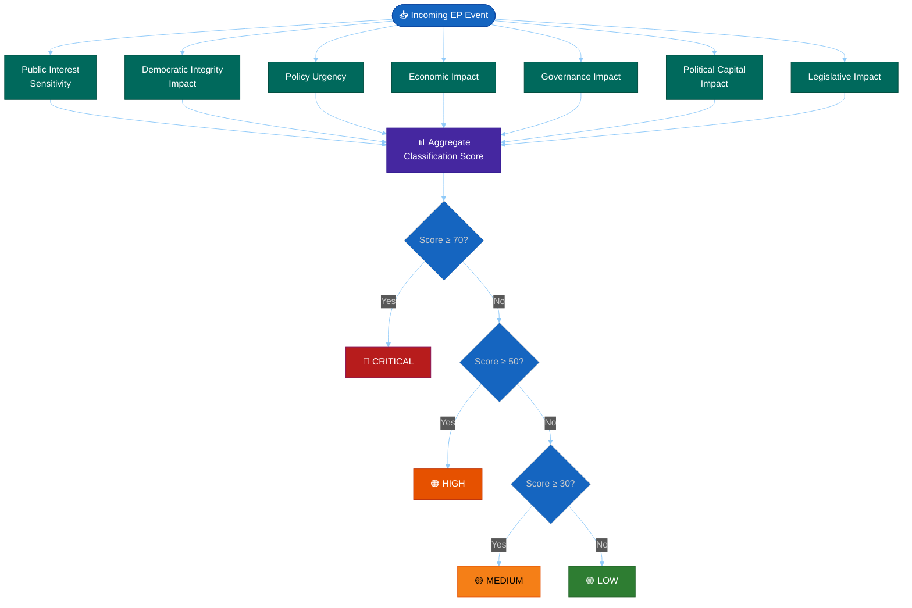
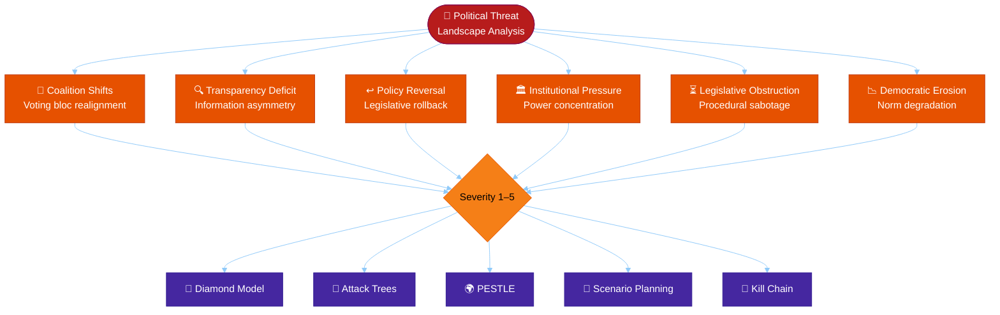
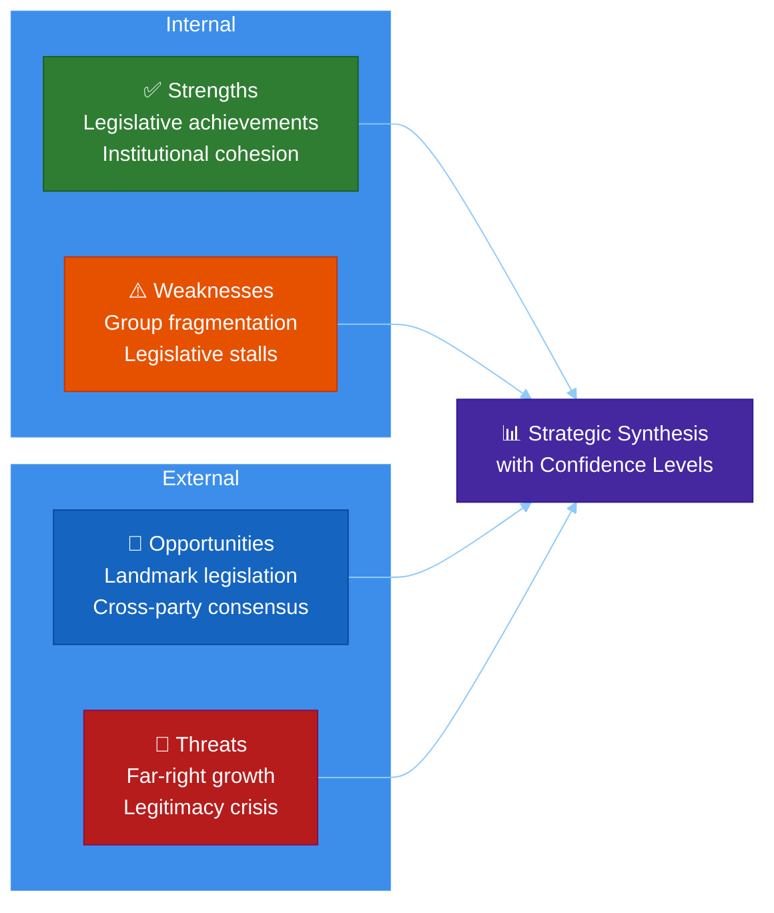
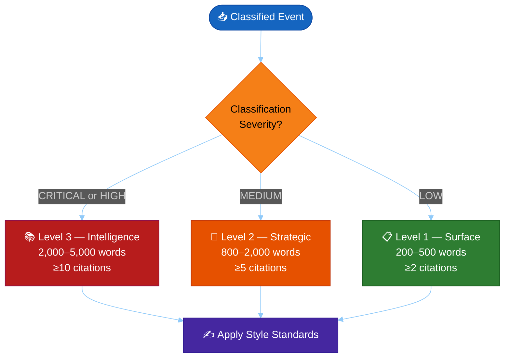
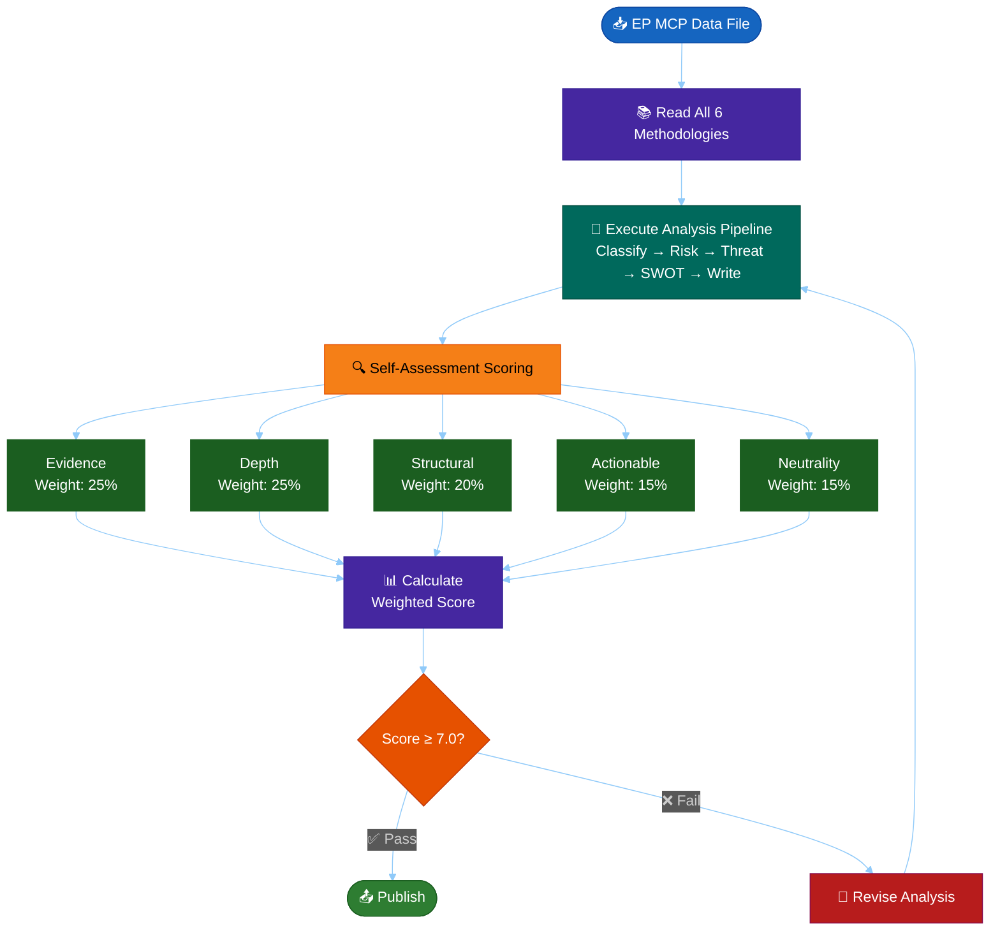
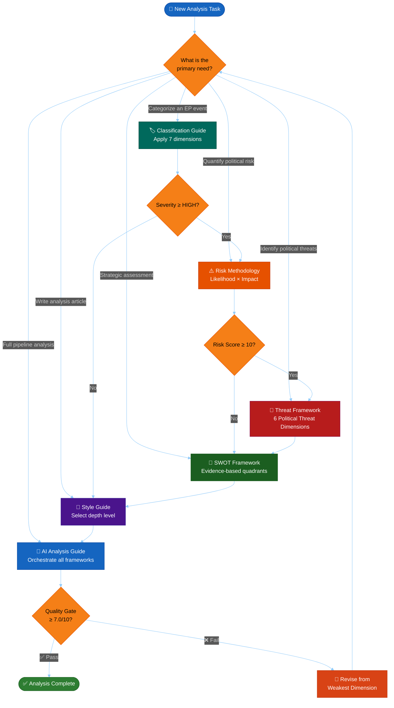
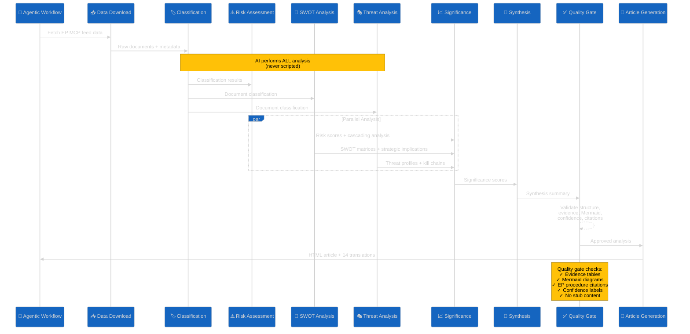

  

<h1 align="center">📐 EU Parliament Monitor — Analysis Methodologies</h1>

  <strong>📊 Fourteen Interlocking Political Intelligence Methodologies for European Parliament Analysis</strong> 
  <em>🎯 Seven core frameworks (Classification · Risk · Threat · SWOT · Style · AI Quality · OSINT) + seven supporting methodologies (Synthesis · Strategic Extensions · Per-Document · Structural Metadata · Electoral Domain · IMF + World Bank Indicator Mappings) governing all 51 analysis templates</em>

  
  
  
  
  

**📋 Document Owner:** CEO | **📄 Version:** 3.2 | **📅 Last Updated:** 2026-04-25 (UTC)
**🔄 Review Cycle:** Quarterly | **⏰ Next Review:** 2026-07-31
**🏢 Owner:** Hack23 AB (Org.nr 5595347807) | **🏷️ Classification:** Public

---

## 📚 Architecture Documentation Map

| Document                                                            | Focus              | Description                                    | Documentation Link                                                                                     |
| ------------------------------------------------------------------- | ------------------ | ---------------------------------------------- | ------------------------------------------------------------------------------------------------------ |
| **[Architecture](../../ARCHITECTURE.md)**                           | 🏛️ Architecture    | C4 model showing current system structure      | [View Source](https://github.com/Hack23/euparliamentmonitor/blob/main/ARCHITECTURE.md)                 |
| **[Future Architecture](../../FUTURE_ARCHITECTURE.md)**             | 🏛️ Architecture    | C4 model showing future system structure       | [View Source](https://github.com/Hack23/euparliamentmonitor/blob/main/FUTURE_ARCHITECTURE.md)          |
| **[Security Architecture](../../SECURITY_ARCHITECTURE.md)**         | 🛡️ Security        | Current security implementation                | [View Source](https://github.com/Hack23/euparliamentmonitor/blob/main/SECURITY_ARCHITECTURE.md)        |
| **[Threat Model](../../THREAT_MODEL.md)**                           | 🎯 Security        | Threat analysis                                | [View Source](https://github.com/Hack23/euparliamentmonitor/blob/main/THREAT_MODEL.md)                 |
| **[Data Model](../../DATA_MODEL.md)**                               | 📊 Data            | Current data structures and relationships      | [View Source](https://github.com/Hack23/euparliamentmonitor/blob/main/DATA_MODEL.md)                   |
| **[Flowcharts](../../FLOWCHART.md)**                                | 🔄 Process         | Current data processing workflows              | [View Source](https://github.com/Hack23/euparliamentmonitor/blob/main/FLOWCHART.md)                    |
| **[SWOT Analysis](../../SWOT.md)**                                  | 💼 Business        | Current strategic assessment                   | [View Source](https://github.com/Hack23/euparliamentmonitor/blob/main/SWOT.md)                         |
| **[Workflows](../../WORKFLOWS.md)**                                 | ⚙️ DevOps          | CI/CD documentation                            | [View Source](https://github.com/Hack23/euparliamentmonitor/blob/main/WORKFLOWS.md)                    |
| **[Classification](../../CLASSIFICATION.md)**                       | 🏷️ Governance      | CIA classification & BCP                       | [View Source](https://github.com/Hack23/euparliamentmonitor/blob/main/CLASSIFICATION.md)               |
| **[CRA Assessment](../../CRA-ASSESSMENT.md)**                       | 🛡️ Compliance      | Cyber Resilience Act                           | [View Source](https://github.com/Hack23/euparliamentmonitor/blob/main/CRA-ASSESSMENT.md)               |
| **[Business Continuity Plan](../../BCPPlan.md)**                    | 🔄 Resilience      | Recovery planning                              | [View Source](https://github.com/Hack23/euparliamentmonitor/blob/main/BCPPlan.md)                      |
| **[Security Policy](../../SECURITY.md)**                            | 🔒 Security        | Vulnerability reporting & security policy      | [View Source](https://github.com/Hack23/euparliamentmonitor/blob/main/SECURITY.md)                     |
| **[Analysis Methodologies](README.md)**                             | 📐 Methodology     | Political intelligence analysis frameworks     | [View Source](https://github.com/Hack23/euparliamentmonitor/blob/main/analysis/methodologies/README.md)|

---

## 🛡️ ISMS Policy Alignment

| Policy | Description | Relevance to Analysis Methodologies |
|--------|-------------|-------------------------------------|
| **[Information Security Policy](https://github.com/Hack23/ISMS-PUBLIC/blob/main/Information_Security_Policy.md)** | Organization-wide security governance and risk management | Defines risk assessment methodology adapted for political risk scoring |
| **[AI Policy](https://github.com/Hack23/ISMS-PUBLIC/blob/main/AI_Policy.md)** | Responsible AI usage, transparency, and human oversight | Governs LLM-driven analysis: quality gates, bias mitigation, evidence requirements |
| **[Classification Policy](https://github.com/Hack23/ISMS-PUBLIC/blob/main/Classification_Policy.md)** | Data classification scheme and handling requirements | Classification guide aligns sensitivity levels with ISMS classification tiers |
| **[Secure Development Policy](https://github.com/Hack23/ISMS-PUBLIC/blob/main/Secure_Development_Policy.md)** | Secure coding standards and SDLC security gates | Style guide and quality gates enforce structured, reviewable analytical output |
| **[Open Source Policy](https://github.com/Hack23/ISMS-PUBLIC/blob/main/Open_Source_Policy.md)** | Open source contribution and licensing governance | All methodology documents published under project license for transparency |

---

## 🎯 Purpose

This directory contains **fourteen interlocking political-intelligence methodologies** that govern how EU Parliament Monitor's agentic workflows produce, classify, assess, and publish European Parliament analysis. They split into two layers: **six core analytical frameworks** (Classification, Risk, Threat, SWOT, Style, AI-Driven Guide) and **eight supporting / cross-cutting methodologies** (OSINT Tradecraft, Synthesis, Strategic Extensions, Per-Document, Structural Metadata, Electoral Domain, IMF Indicator Mapping, World Bank Indicator Mapping). Together they transform raw European Parliament MCP data into structured, evidence-based political intelligence.

**Core Principle:** Every analytical claim requires verifiable evidence sourced from European Parliament open data. Opinion-based analysis, boilerplate summaries, and the unmodified use of software-centric threat models (such as STRIDE, DREAD, or PASTA) are explicitly rejected. Political threat analysis uses purpose-built frameworks (Political Threat Landscape, Attack Trees, Kill Chain, Diamond Model, ICO Profiling) designed specifically for democratic process analysis.

**Design Philosophy:** The six core frameworks form a layered analytical pipeline — classification provides the foundation, risk and threat assessments build the analytical core, SWOT synthesizes strategic implications, style standards enforce writing quality, and the AI guide orchestrates the entire pipeline with quality gates. The eight supporting methodologies extend that pipeline horizontally: [`osint-tradecraft-standards.md`](osint-tradecraft-standards.md) is the cross-cutting professional-tradecraft layer (ICD 203 · Admiralty Code · Words of Estimative Probability · SAT catalog · OSINT ethics) every artifact applies; [`synthesis-methodology.md`](synthesis-methodology.md) governs the Stage-B.7 synthesis layer; [`strategic-extensions-methodology.md`](strategic-extensions-methodology.md) and [`electoral-domain-methodology.md`](electoral-domain-methodology.md) cover deep-analysis and electoral-specific runs; [`per-document-methodology.md`](per-document-methodology.md) and [`structural-metadata-methodology.md`](structural-metadata-methodology.md) cover atomic per-EP-document analysis and run-level provenance; and [`imf-indicator-mapping.md`](imf-indicator-mapping.md) (primary, Wave-4) + [`worldbank-indicator-mapping.md`](worldbank-indicator-mapping.md) (non-economic only) govern the economic-context evidence ladder.

---

## 🔄 Methodology Pipeline — How AI Agents Apply Frameworks

The following diagram illustrates the sequential pipeline that an AI agent follows when processing an incoming European Parliament data file:

```mermaid
%%{init: {"theme":"dark","themeVariables":{"primaryColor":"#1565C0","primaryTextColor":"#ffffff","primaryBorderColor":"#0A3F7F","lineColor":"#90CAF9","secondaryColor":"#2E7D32","secondaryTextColor":"#ffffff","secondaryBorderColor":"#0F3F00","tertiaryColor":"#FF9800","tertiaryTextColor":"#000000","tertiaryBorderColor":"#7F4F00","mainBkg":"#1565C0","secondBkg":"#2E7D32","tertiaryBkg":"#FF9800","noteBkgColor":"#FFC107","noteTextColor":"#000000","noteBorderColor":"#7F6000","errorBkgColor":"#D32F2F","errorTextColor":"#ffffff","fontFamily":"Inter, Helvetica, Arial, sans-serif","pie1":"#1565C0","pie2":"#2E7D32","pie3":"#FF9800","pie4":"#D32F2F","pie5":"#FFC107","pie6":"#7B1FA2","pie7":"#9E9E9E","pie8":"#0288D1","pie9":"#388E3C","pie10":"#F57C00","pie11":"#C62828","pie12":"#FBC02D","pieTitleTextSize":"18px","pieSectionTextSize":"14px","pieLegendTextSize":"13px","pieStrokeColor":"#1e1e1e","pieOuterStrokeColor":"#1e1e1e","git0":"#1565C0","git1":"#2E7D32","git2":"#FF9800","git3":"#D32F2F","gitBranchLabel0":"#ffffff","gitBranchLabel1":"#ffffff","gitBranchLabel2":"#000000","gitBranchLabel3":"#ffffff","cScale0":"#1565C0","cScale1":"#2E7D32","cScale2":"#FF9800","cScale3":"#D32F2F","cScale4":"#FFC107","cScale5":"#7B1FA2","cScale6":"#9E9E9E","cScale7":"#0288D1","xyChart":{"backgroundColor":"#1e1e1e","plotColorPalette":"#1565C0,#2E7D32,#FF9800,#D32F2F,#FFC107,#7B1FA2,#9E9E9E"}}}}%%
flowchart TD
    Start([📥 EP MCP Data Received]) --> Read[📚 Agent Reads the<br/>Methodology Library<br/>(14 docs)]
    Read --> Classify[🏷️ Step 1: Classify Event<br/>7-Dimension Classification]
    Classify --> Risk[⚠️ Step 2: Assess Risk<br/>Likelihood × Impact Matrix]
    Risk --> Threat[🎯 Step 3: Analyze Threats<br/>Political Threat Landscape<br/>+ 5 Supporting Frameworks]
    Threat --> SWOT[💼 Step 4: Build SWOT<br/>Evidence-Based Quadrants]
    SWOT --> Write[📝 Step 5: Write Analysis<br/>Depth Level 1/2/3]
    Write --> QualityGate{✅ Quality Gate<br/>Score ≥ 7.0/10?}
    QualityGate -->|Yes ✅| Publish([📤 Publish Analysis])
    QualityGate -->|No ❌| Revise[🔄 Revise & Re-Assess]
    Revise --> Classify

    style Start fill:#1565C0,stroke:#0D47A1,color:#FFFFFF
    style Read fill:#4527A0,stroke:#311B92,color:#FFFFFF
    style Classify fill:#00695C,stroke:#004D40,color:#FFFFFF
    style Risk fill:#E65100,stroke:#BF360C,color:#FFFFFF
    style Threat fill:#B71C1C,stroke:#880E4F,color:#FFFFFF
    style SWOT fill:#1B5E20,stroke:#1B5E20,color:#FFFFFF
    style Write fill:#4A148C,stroke:#311B92,color:#FFFFFF
    style QualityGate fill:#F57F17,stroke:#E65100,color:#FFFFFF
    style Publish fill:#2E7D32,stroke:#1B5E20,color:#FFFFFF
    style Revise fill:#D84315,stroke:#BF360C,color:#FFFFFF
```

---

## 📐 Methodology Architecture

```mermaid
%%{init: {"theme":"dark","themeVariables":{"primaryColor":"#1565C0","primaryTextColor":"#ffffff","primaryBorderColor":"#0A3F7F","lineColor":"#90CAF9","secondaryColor":"#2E7D32","secondaryTextColor":"#ffffff","secondaryBorderColor":"#0F3F00","tertiaryColor":"#FF9800","tertiaryTextColor":"#000000","tertiaryBorderColor":"#7F4F00","mainBkg":"#1565C0","secondBkg":"#2E7D32","tertiaryBkg":"#FF9800","noteBkgColor":"#FFC107","noteTextColor":"#000000","noteBorderColor":"#7F6000","errorBkgColor":"#D32F2F","errorTextColor":"#ffffff","fontFamily":"Inter, Helvetica, Arial, sans-serif","pie1":"#1565C0","pie2":"#2E7D32","pie3":"#FF9800","pie4":"#D32F2F","pie5":"#FFC107","pie6":"#7B1FA2","pie7":"#9E9E9E","pie8":"#0288D1","pie9":"#388E3C","pie10":"#F57C00","pie11":"#C62828","pie12":"#FBC02D","pieTitleTextSize":"18px","pieSectionTextSize":"14px","pieLegendTextSize":"13px","pieStrokeColor":"#1e1e1e","pieOuterStrokeColor":"#1e1e1e","git0":"#1565C0","git1":"#2E7D32","git2":"#FF9800","git3":"#D32F2F","gitBranchLabel0":"#ffffff","gitBranchLabel1":"#ffffff","gitBranchLabel2":"#000000","gitBranchLabel3":"#ffffff","cScale0":"#1565C0","cScale1":"#2E7D32","cScale2":"#FF9800","cScale3":"#D32F2F","cScale4":"#FFC107","cScale5":"#7B1FA2","cScale6":"#9E9E9E","cScale7":"#0288D1","xyChart":{"backgroundColor":"#1e1e1e","plotColorPalette":"#1565C0,#2E7D32,#FF9800,#D32F2F,#FFC107,#7B1FA2,#9E9E9E"}}}}%%
graph TB
    subgraph "🏛️ Core Analysis Engine"
        GUIDE["🤖 AI-Driven Analysis Guide<br/><i>Master Protocol</i>"]
        STYLE["✍️ Political Style Guide<br/><i>Writing Standards</i>"]
    end

    subgraph "🔬 Analytical Frameworks"
        CLASS["🏷️ Classification Guide<br/><i>7-Dimension Taxonomy</i>"]
        RISK["⚠️ Risk Methodology<br/><i>Cascading Risk Model</i>"]
        SWOT["💼 SWOT Framework<br/><i>TOWS + Cross-SWOT</i>"]
        THREAT["🎭 Threat Framework<br/><i>6-Dimension + 5 Frameworks</i>"]
    end

    subgraph "📋 ISMS Reference Layer"
        ISMS1["📖 ISMS Classification"]
        ISMS2["📖 ISMS Risk Assessment"]
        ISMS3["📖 ISMS Style Guide"]
        ISMS4["📖 ISMS Threat Modeling"]
    end

    GUIDE -->|"governs"| CLASS
    GUIDE -->|"governs"| RISK
    GUIDE -->|"governs"| SWOT
    GUIDE -->|"governs"| THREAT
    STYLE -->|"standards"| CLASS
    STYLE -->|"standards"| RISK
    STYLE -->|"standards"| SWOT
    STYLE -->|"standards"| THREAT
    ISMS1 -.->|"adapted from"| CLASS
    ISMS2 -.->|"adapted from"| RISK
    ISMS3 -.->|"adapted from"| STYLE
    ISMS4 -.->|"adapted from"| THREAT

    style GUIDE fill:#0d6efd,color:#fff,stroke:#0a58ca,stroke-width:2px
    style STYLE fill:#6610f2,color:#fff,stroke:#520dc2,stroke-width:2px
    style CLASS fill:#198754,color:#fff,stroke:#146c43,stroke-width:2px
    style RISK fill:#dc3545,color:#fff,stroke:#b02a37,stroke-width:2px
    style SWOT fill:#fd7e14,color:#fff,stroke:#ca6510,stroke-width:2px
    style THREAT fill:#d63384,color:#fff,stroke:#ab296a,stroke-width:2px
    style ISMS1 fill:#e9ecef,color:#212529,stroke:#adb5bd
    style ISMS2 fill:#e9ecef,color:#212529,stroke:#adb5bd
    style ISMS3 fill:#e9ecef,color:#212529,stroke:#adb5bd
    style ISMS4 fill:#e9ecef,color:#212529,stroke:#adb5bd
```

---

## 📊 Methodology Relationship Map

This diagram shows how the fourteen methodology/framework documents relate to each other and feed into the final analysis output. The visualisation focuses on the six core analytical frameworks because they are the load-bearing nodes; the eight supporting methodologies (OSINT tradecraft, synthesis, strategic extensions, per-document, structural metadata, electoral domain, IMF + WB indicator mappings) are cross-cutting layers that every framework applies and are catalogued in the **Methodology Summary Table** below:

```mermaid
%%{init: {"theme":"dark","themeVariables":{"primaryColor":"#1565C0","primaryTextColor":"#ffffff","primaryBorderColor":"#0A3F7F","lineColor":"#90CAF9","secondaryColor":"#2E7D32","secondaryTextColor":"#ffffff","secondaryBorderColor":"#0F3F00","tertiaryColor":"#FF9800","tertiaryTextColor":"#000000","tertiaryBorderColor":"#7F4F00","mainBkg":"#1565C0","secondBkg":"#2E7D32","tertiaryBkg":"#FF9800","noteBkgColor":"#FFC107","noteTextColor":"#000000","noteBorderColor":"#7F6000","errorBkgColor":"#D32F2F","errorTextColor":"#ffffff","fontFamily":"Inter, Helvetica, Arial, sans-serif","pie1":"#1565C0","pie2":"#2E7D32","pie3":"#FF9800","pie4":"#D32F2F","pie5":"#FFC107","pie6":"#7B1FA2","pie7":"#9E9E9E","pie8":"#0288D1","pie9":"#388E3C","pie10":"#F57C00","pie11":"#C62828","pie12":"#FBC02D","pieTitleTextSize":"18px","pieSectionTextSize":"14px","pieLegendTextSize":"13px","pieStrokeColor":"#1e1e1e","pieOuterStrokeColor":"#1e1e1e","git0":"#1565C0","git1":"#2E7D32","git2":"#FF9800","git3":"#D32F2F","gitBranchLabel0":"#ffffff","gitBranchLabel1":"#ffffff","gitBranchLabel2":"#000000","gitBranchLabel3":"#ffffff","cScale0":"#1565C0","cScale1":"#2E7D32","cScale2":"#FF9800","cScale3":"#D32F2F","cScale4":"#FFC107","cScale5":"#7B1FA2","cScale6":"#9E9E9E","cScale7":"#0288D1","xyChart":{"backgroundColor":"#1e1e1e","plotColorPalette":"#1565C0,#2E7D32,#FF9800,#D32F2F,#FFC107,#7B1FA2,#9E9E9E"}}}}%%
graph LR
    CG[🏷️ Classification Guide<br/>7 Dimensions] --> RG[⚠️ Risk Methodology<br/>5×5 Likelihood × Impact]
    CG --> TF[🎯 Threat Framework<br/>6 Political Threat Dimensions]
    RG --> SW[💼 SWOT Framework<br/>Evidence-Based Quadrants]
    TF --> SW
    SW --> SG[📝 Style Guide<br/>3 Depth Levels]
    SG --> AI[🤖 AI Analysis Guide<br/>Quality Gates]
    AI -->|Orchestrates all| CG
    CG -.->|Sensitivity feeds| TF
    RG -.->|Scores inform| TF
    TF -.->|Threats map to| SW

    style CG fill:#00695C,stroke:#004D40,color:#FFFFFF
    style RG fill:#E65100,stroke:#BF360C,color:#FFFFFF
    style TF fill:#B71C1C,stroke:#880E4F,color:#FFFFFF
    style SW fill:#1B5E20,stroke:#1B5E20,color:#FFFFFF
    style SG fill:#4A148C,stroke:#311B92,color:#FFFFFF
    style AI fill:#1565C0,stroke:#0D47A1,color:#FFFFFF
```

---

## 📋 Methodology Summary Table

| Priority | Document | Key Content | Dimensions / Frameworks | When to Apply |
|----------|----------|-------------|-------------------------|---------------|
| **1** | **[Political Classification Guide](political-classification-guide.md)** | 7-dimension event classification, sensitivity levels, policy domain taxonomy, urgency matrix | Sensitivity (4 levels), Democratic Integrity, Policy Urgency, Economic Impact, Governance Impact, Political Capital, Legislative Impact | **First** — every incoming EP event/document must be classified before any analysis begins |
| **2** | **[Political Risk Methodology](political-risk-methodology.md)** | Likelihood × Impact scoring, 6 EP risk categories, 5×5 matrix, Grand Coalition stability risk | Coalition Stability, Policy Implementation, Institutional Integrity, Economic Governance, Social Cohesion, Geopolitical Standing | **Second** — after classification, assess political risk using calibrated scoring |
| **3** | **[Political Threat Framework](political-threat-framework.md)** | 5-framework integrated threat analysis: Political Threat Landscape (6D) + Attack Trees + Kill Chain + Diamond Model + ICO Profiling | Coalition Shifts, Transparency Deficit, Policy Reversal, Institutional Pressure, Legislative Obstruction, Democratic Erosion | **Third** — apply threat analysis using purpose-built political frameworks (STRIDE explicitly rejected) |
| **4** | **[Political SWOT Framework](political-swot-framework.md)** | Evidence-based SWOT, confidence levels, 180-day decay, group-to-landscape aggregation | Strengths, Weaknesses, Opportunities, Threats — each with confidence (HIGH/MEDIUM/LOW) | **Fourth** — synthesize classification + risk + threat into strategic SWOT assessment |
| **5** | **[Political Style Guide](political-style-guide.md)** | Writing standards, 3 depth levels, evidence density requirements, anti-patterns | Level 1 Surface (200–500 words), Level 2 Strategic (800–2,000 words), Level 3 Intelligence (2,000–5,000 words) | **Fifth** — apply writing standards when drafting the analysis document |
| **6** | **[AI-Driven Analysis Guide](ai-driven-analysis-guide.md)** | 10-step analysis protocol, mandatory 2-pass improvement, reference-quality depth floors | Evidence (25%), Depth (25%), Structural (20%), Actionable (15%), Neutrality (15%) | **Always** — orchestrates the entire pipeline; AI agents read this first |
| **7** | **[OSINT / INTOP Tradecraft Standards](osint-tradecraft-standards.md)** | ICD 203 analytic standards, Admiralty source × info grading, Kent / WEP estimative bands, canonical SAT catalog, OSINT sourcing ethics | 9 ICD standards · 6×6 Admiralty grid · 7 WEP bands · 10 SATs · 5 ethical limits | **Cross-cutting** — applied by every framework to every artifact; attested in `methodology-reflection.md` |
| **8** | **[Artifact Catalog](artifact-catalog.md)** | Master map of every analysis markdown file produced under `analysis/daily/*/` — grouped by folder with methodology + template + depth floor + Mermaid type per artifact | 7 folder groups (intelligence 18 · classification 4 · risk-scoring 4 · threat-assessment 5 · documents 1 · existing legacy 2+mirrors · extended 12 optional) | **Step 2** — after reading the AI guide, agents consult this catalog to know *what* to produce |
| **9** | **[Per-Artifact Methodologies](per-artifact-methodologies.md)** | One section per artifact type with purpose, EP MCP inputs, required sections, mandatory Mermaid, depth floor, quality signals | ~41 artifacts across 7 folder groups (29 mandatory + 12 optional extended) | **Step 2** — construction lookup; read the relevant section when writing each artifact |
| **10** | **[Synthesis Methodology](synthesis-methodology.md)** | Stage B.7 synthesis layer — significance-scoring → synthesis-summary → stakeholder-perspectives → coalition-dynamics → executive-brief | F3EAD Analyze→Disseminate; EP PIRs; WEP bands; ICD 203 Standards 5/6/8 | **Stage B.7** — applied after classification + risk + threat + SWOT to produce decision-ready intelligence |
| **11** | **[Strategic Extensions Methodology](strategic-extensions-methodology.md)** | Construction rules for strategic-depth artifacts: scenario-forecast, wildcards-blackswans, historical-baseline, stakeholder-map, pestle-analysis, economic-context, threat-model | 7 strategic artifacts; WEP bands; Admiralty ≥B2; cross-artifact anchoring | **Stage B.6** — deep analytical extensions beyond the core synthesis layer |
| **12** | **[Per-Document Methodology](per-document-methodology.md)** | Construction rules for `per-file-political-intelligence` — atomic evidence extraction per EP document (COM, A-*, B-*, RC, reports, opinions, motions) | 8 evidence layers; Admiralty per-claim; provenance URL required | **Stage A.3** — produced for every downloaded EP document before synthesis |
| **13** | **[Structural Metadata Methodology](structural-metadata-methodology.md)** | Construction rules for provenance layer — `analysis-index.md`, `document-analysis-index.md`, `manifest.json`, and the `extended/cross-reference-map.md` + `extended/data-download-manifest.md` artifacts | Manifest schema; MCP call inventory; citation graph | **Stage A.1 / E.1** — produced at run start (index scaffolding) and run end (full manifest) |
| **14** | **[Electoral Domain Methodology](electoral-domain-methodology.md)** | EP election analysis — 2024 retrospective + 2029 forecast; national-delegation seat projections; Spitzenkandidaten; cross-MS party family analysis | 27 MS; 720 seats; D'Hondt variants; Europhile/Euroskeptic segmentation | **Electoral runs** — produced for election-focused workflows and for `extended/voter-segmentation.md` |

---

## 📖 Methodology Catalog

### 🤖 AI-Driven Analysis Guide — `ai-driven-analysis-guide.md`

| Attribute | Value |
|-----------|-------|
| **Purpose** | Master protocol governing all AI-driven political intelligence analysis |
| **Scope** | All agentic workflows, all analysis types, all output artifacts |
| **Key Rules** | Folder isolation · AI-only content · Multi-framework depth · Quality gates · Cross-session intelligence |
| **Version** | 4.1 |

**Core Principles:**
- **Folder Isolation**: Every workflow writes ONLY to its own `analysis/YYYY-MM-DD/{articleType}/` subfolder
- **AI-Only Content**: Scripts must NEVER generate analysis prose, SWOT entries, risk scores, or template content
- **Quality Gates**: Automated checks validate every analysis artifact before commit (minimum 7.0/10)

### 🏷️ Political Classification Guide — `political-classification-guide.md`

| Attribute | Value |
|-----------|-------|
| **Purpose** | Multi-dimensional taxonomy for political document and event classification |
| **Dimensions** | 7: Public Interest · Democratic Integrity · Policy Urgency · Economic Impact · Governance · Political Capital · Legislative Impact |
| **Confidence Levels** | HIGH (≥80%) · MEDIUM (60–79%) · LOW (<60%) |
| **Version** | 2.1 |

### ⚠️ Political Risk Assessment Methodology — `political-risk-methodology.md`

| Attribute | Value |
|-----------|-------|
| **Purpose** | Systematic risk identification, scoring, and cascading impact analysis |
| **Risk Categories** | 6: Coalition Stability · Policy Implementation · Institutional Integrity · Economic Governance · Social Cohesion · Geopolitical Standing |
| **Scoring Model** | Likelihood (1–5) × Impact (1–5) = Risk Score (1–25) |
| **Advanced Features** | Cascading risk chains · Grand Coalition stability risk · Risk velocity tracking · Data availability risk |
| **Version** | 2.1 |

### 💼 Political SWOT Analysis Framework — `political-swot-framework.md`

| Attribute | Value |
|-----------|-------|
| **Purpose** | Multi-stakeholder strategic analysis for political events and policy decisions |
| **Stakeholder Lenses** | Grand Coalition · Opposition Bloc · Citizens/Civil Society · Economic Actors · International Observers |
| **Advanced Features** | TOWS Matrix · Cross-SWOT Interference · 180-day Decay · Scenario Generation · Temporal Dynamics |
| **Version** | 2.0 |

### 🎭 Political Threat Analysis Framework — `political-threat-framework.md`

| Attribute | Value |
|-----------|-------|
| **Purpose** | Multi-framework threat modeling for democratic process threats |
| **Frameworks** | 5 Integrated: Political Threat Landscape (6D) + Attack Trees + Political Kill Chain + Diamond Model + ICO Profiling |
| **Threat Taxonomy** | 6 Dimensions: Coalition Shifts · Transparency Deficit · Policy Reversal · Institutional Pressure · Legislative Obstruction · Democratic Erosion |
| **Version** | 4.0 (2026-04-23) — STRIDE removed, riksdagsmonitor multi-framework approach integrated |

> ⚠️ **STRIDE is NOT used.** This methodology uses 5 purpose-built political intelligence frameworks. STRIDE (Spoofing/Tampering/Repudiation/Information Disclosure/Denial of Service/Elevation of Privilege) was designed for software security threat modeling and does not meaningfully transfer to political analysis. See [political-threat-framework.md §Why NOT STRIDE](political-threat-framework.md#️-why-not-stride) for full rationale.

### ✍️ Political Intelligence Style Guide — `political-style-guide.md`

| Attribute | Value |
|-----------|-------|
| **Purpose** | Establishes writing standards for all political intelligence output |
| **Scope** | Article tone, evidence citation standards, Mermaid diagram requirements, confidence labelling |
| **Key Standards** | Evidence tables (not prose) · EP procedure citations · Colour-coded diagrams · Multi-language terminology · Recess-period guidance |
| **Version** | 2.1 |

### 🕵️ OSINT / INTOP Tradecraft Standards — `osint-tradecraft-standards.md`

| Attribute | Value |
|-----------|-------|
| **Purpose** | Cross-cutting professional analytic discipline applied by every framework to every artifact |
| **Pillars** | 5: ICD 203 (9 analytic standards) · Admiralty Code (source × info grading) · Words of Estimative Probability (7 bands) · SAT catalog (10 techniques) · OSINT sourcing ethics |
| **Key Standards** | Grade every source (A1–F6 → 🟢/🟡/🔴) · Calibrated estimative vocabulary · Banned ambiguous terms · ≥10 SATs attested per run · No personal-life data on MEPs |
| **Version** | 1.0 |

> ✅ **Cross-cutting layer.** Unlike the six domain frameworks above (which each own a specific analytic task), this framework defines the professional standards every framework applies — source grading, estimative language, structured analytic techniques, and OSINT ethics. It is attested in each run's `methodology-reflection.md`.

### 🗺️ Artifact Catalog — `artifact-catalog.md`

| Attribute | Value |
|-----------|-------|
| **Purpose** | Master map between the 51 templates in [`analysis/templates/`](../templates/README.md) and the methodologies above; names the canonical run-relative path for every artifact |
| **Used by** | [`02-analysis-protocol.md`](../../.github/prompts/02-analysis-protocol.md) (Stage B) and [`03-analysis-completeness-gate.md`](../../.github/prompts/03-analysis-completeness-gate.md) (Stage C) |
| **Enforcement** | Stage-C completeness gate — `npm run validate-analysis -- <runDir>` ([`scripts/validate-analysis-completeness.js`](../../scripts/validate-analysis-completeness.js)) reads this catalog plus `reference-quality-thresholds.json` and fails the agentic run with exit code 1 if any artifact is missing, below the line floor, lacks a mandatory Mermaid block, or shows placeholder leakage. The duplicate `src/utils/validate-analysis-completeness.ts` runtime layer was purged in the April-2026 aggregator-pipeline migration; the surviving CLI is the Stage-C source of truth. |

### 🧪 Per-Artifact Methodologies — `per-artifact-methodologies.md`

| Attribute | Value |
|-----------|-------|
| **Purpose** | Normative per-artifact rules — one `###` section per artifact, 34 in total, describing required sections, minimum depth, source-grading demand, and estimative-language expectations |
| **Paired with** | `artifact-catalog.md` (what → where) + `reference-quality-thresholds.json` (how much) |
| **Step 10.5** | `ai-driven-analysis-guide.md` § Step 10.5 requires each run's `methodology-reflection.md` to reflect on the per-artifact methodologies actually applied |

### 🔢 Quality Thresholds — `reference-quality-thresholds.json`

| Attribute | Value |
|-----------|-------|
| **Purpose** | Machine-readable per-artifact line-floor and depth-floor thresholds |
| **Consumed by** | Stage-C completeness gate — `npm run validate-analysis -- <runDir>` ([`scripts/validate-analysis-completeness.js`](../../scripts/validate-analysis-completeness.js)) reads this JSON in machine mode to confirm every artifact meets its line/depth floor before the agentic-workflow reviewer creates the PR. Hermetic tests pass `--thresholds` to inject fixture floors. The duplicate `src/utils/validate-analysis-completeness.ts` runtime layer was purged in the April-2026 aggregator-pipeline migration. |
| **Update cadence** | Bumped whenever `per-artifact-methodologies.md` tightens or loosens a floor; the two files must stay in lock-step |

### 💱 IMF Indicator Mapping — `imf-indicator-mapping.md` (primary economic source — Wave-4)

| Attribute | Value |
|-----------|-------|
| **Purpose** | Canonical mapping of IMF WEO / FM / IFS / BOP / ER / PCPS / GFSR / EREO / FSI / GFS / DOT indicator codes to EP analysis use cases — Wave-4 authoritative economic context for every policy-required article type |
| **Paired MCP** | IMF REST SDMX 3.0 client in `src/mcp/imf-mcp-client.ts` (virtual tools `imf-list-databases`, `imf-search-databases`, `imf-get-parameter-defs`, `imf-get-parameter-codes`, `imf-fetch-data`) |

### 🌍 World Bank Indicator Mapping — `worldbank-indicator-mapping.md` (non-economic only — Wave-4)

| Attribute | Value |
|-----------|-------|
| **Purpose** | Canonical mapping of World Bank WDI indicator codes — **non-economic domains only** under Wave-4: health, education, social, environment, demographics, defence, agriculture, innovation, governance. The legacy WB economic codes are retained for backward compatibility but MUST NOT be used in new articles; economic context → IMF |
| **Paired MCP** | World Bank MCP (`world-bank-*` tools) |

> ✅ Together, `artifact-catalog.md` (**what**), `per-artifact-methodologies.md` (**how**), and `reference-quality-thresholds.json` (**how much**) form the Stage B / Stage C contract enforced by the Stage-C validator (`npm run validate-analysis`) plus an editorial completeness review. The two indicator-mapping files provide the Stage A economic-context inputs that Wave-4 editorial policy requires — IMF primary for economic/fiscal/monetary/trade claims, WB additive for non-economic domains. The legacy article-side runtime gates (`articlePolicyHasEconomicContext`, `articlePolicyHasIMFEconomicEvidence`, `WAVE3_IMF_STRICT` flag) and the duplicate `src/utils/validate-analysis-completeness.ts` were purged in the April-2026 aggregator-pipeline migration; analysis-completeness enforcement now lives exclusively in the surviving CLI plus Stage-C editorial review.

---

## 🏷️ 1. Political Classification Guide

### Purpose & Scope

The classification guide establishes the authoritative methodology for categorizing every European Parliament event and document entering the analysis pipeline. It serves as the **mandatory first step** before any other analytical framework is applied.

### Key Concepts

| Concept | Description | Scale |
|---------|-------------|-------|
| **Sensitivity Levels** | Determines publication handling requirements | 🟢 PUBLIC → 🟡 SENSITIVE → 🔴 RESTRICTED |
| **Policy Domain Taxonomy** | Categorizes events by EU policy area | Environment, Economy, Foreign Affairs, Justice, etc. |
| **Urgency Matrix** | Assesses time-sensitivity for editorial response | Immediate → Short-term → Medium-term → Long-term |
| **7 Classification Dimensions** | Multi-axis scoring across political impact areas | 4-level ordinal scale per dimension |
| **Score Thresholds** | Aggregate classification severity tiers | ≥70 CRITICAL · ≥50 HIGH · ≥30 MEDIUM · <30 LOW |

### Classification Dimension Diagram

```mermaid
%%{init: {"theme":"dark","themeVariables":{"primaryColor":"#1565C0","primaryTextColor":"#ffffff","primaryBorderColor":"#0A3F7F","lineColor":"#90CAF9","secondaryColor":"#2E7D32","secondaryTextColor":"#ffffff","secondaryBorderColor":"#0F3F00","tertiaryColor":"#FF9800","tertiaryTextColor":"#000000","tertiaryBorderColor":"#7F4F00","mainBkg":"#1565C0","secondBkg":"#2E7D32","tertiaryBkg":"#FF9800","noteBkgColor":"#FFC107","noteTextColor":"#000000","noteBorderColor":"#7F6000","errorBkgColor":"#D32F2F","errorTextColor":"#ffffff","fontFamily":"Inter, Helvetica, Arial, sans-serif","pie1":"#1565C0","pie2":"#2E7D32","pie3":"#FF9800","pie4":"#D32F2F","pie5":"#FFC107","pie6":"#7B1FA2","pie7":"#9E9E9E","pie8":"#0288D1","pie9":"#388E3C","pie10":"#F57C00","pie11":"#C62828","pie12":"#FBC02D","pieTitleTextSize":"18px","pieSectionTextSize":"14px","pieLegendTextSize":"13px","pieStrokeColor":"#1e1e1e","pieOuterStrokeColor":"#1e1e1e","git0":"#1565C0","git1":"#2E7D32","git2":"#FF9800","git3":"#D32F2F","gitBranchLabel0":"#ffffff","gitBranchLabel1":"#ffffff","gitBranchLabel2":"#000000","gitBranchLabel3":"#ffffff","cScale0":"#1565C0","cScale1":"#2E7D32","cScale2":"#FF9800","cScale3":"#D32F2F","cScale4":"#FFC107","cScale5":"#7B1FA2","cScale6":"#9E9E9E","cScale7":"#0288D1","xyChart":{"backgroundColor":"#1e1e1e","plotColorPalette":"#1565C0,#2E7D32,#FF9800,#D32F2F,#FFC107,#7B1FA2,#9E9E9E"}}}}%%
graph TD
    Event([📥 Incoming EP Event]) --> S1[Public Interest<br/>Sensitivity]
    Event --> S2[Democratic Integrity<br/>Impact]
    Event --> S3[Policy Urgency]
    Event --> S4[Economic Impact]
    Event --> S5[Governance Impact]
    Event --> S6[Political Capital<br/>Impact]
    Event --> S7[Legislative Impact]

    S1 --> Score[📊 Aggregate<br/>Classification Score]
    S2 --> Score
    S3 --> Score
    S4 --> Score
    S5 --> Score
    S6 --> Score
    S7 --> Score

    Score --> T1{Score ≥ 70?}
    T1 -->|Yes| CRIT[🔴 CRITICAL]
    T1 -->|No| T2{Score ≥ 50?}
    T2 -->|Yes| HIGH[🟠 HIGH]
    T2 -->|No| T3{Score ≥ 30?}
    T3 -->|Yes| MED[🟡 MEDIUM]
    T3 -->|No| LOW[🟢 LOW]

    style Event fill:#1565C0,stroke:#0D47A1,color:#FFFFFF
    style Score fill:#4527A0,stroke:#311B92,color:#FFFFFF
    style CRIT fill:#B71C1C,stroke:#880E4F,color:#FFFFFF
    style HIGH fill:#E65100,stroke:#BF360C,color:#FFFFFF
    style MED fill:#F57F17,stroke:#E65100,color:#000000
    style LOW fill:#2E7D32,stroke:#1B5E20,color:#FFFFFF
    style S1 fill:#00695C,stroke:#004D40,color:#FFFFFF
    style S2 fill:#00695C,stroke:#004D40,color:#FFFFFF
    style S3 fill:#00695C,stroke:#004D40,color:#FFFFFF
    style S4 fill:#00695C,stroke:#004D40,color:#FFFFFF
    style S5 fill:#00695C,stroke:#004D40,color:#FFFFFF
    style S6 fill:#00695C,stroke:#004D40,color:#FFFFFF
    style S7 fill:#00695C,stroke:#004D40,color:#FFFFFF
```

### Connection to Other Methodologies

- **Feeds into Risk Methodology:** Classification severity determines initial risk likelihood calibration
- **Feeds into Threat Framework:** Sensitivity level determines which threat dimensions to prioritize
- **Feeds into SWOT:** High-classification events trigger SWOT re-assessment

---

## ⚠️ 2. Political Risk Methodology

### Purpose & Scope

Provides a systematic **Likelihood × Impact** scoring framework for European Parliament political risks, adapted from the Hack23 ISMS Risk Assessment Methodology. Produces quantified risk scores across six EP-specific risk categories.

### Key Concepts

| Concept | Description | Scale |
|---------|-------------|-------|
| **Likelihood Scale** | Probability of risk materializing | Rare (1) → Unlikely (2) → Possible (3) → Likely (4) → Almost Certain (5) |
| **Impact Scale** | Severity of consequences if realized | Negligible (1) → Minor (2) → Moderate (3) → Major (4) → Severe (5) |
| **Risk Score** | Quantified assessment: Likelihood × Impact | 1–25 (Low: 1–4, Medium: 5–9, High: 10–14, Critical: 15–25) |
| **Six Risk Categories** | EP-specific political risk domains | Coalition, Policy, Institutional, Economic, Social, Geopolitical |
| **Grand Coalition Risk** | Dedicated assessment of EP governing coalition stability | Composite metric from multiple indicators |

### Risk Scoring Matrix

```mermaid
%%{init: {
  "theme": "dark",
  "themeVariables": {
    "quadrant1Fill": "#D32F2F",
    "quadrant2Fill": "#FF9800",
    "quadrant3Fill": "#2E7D32",
    "quadrant4Fill": "#FFC107",
    "quadrantTitleFill": "#ffffff",
    "quadrantPointFill": "#ffffff",
    "quadrantPointTextFill": "#ffffff",
    "quadrantXAxisTextFill": "#ffffff",
    "quadrantYAxisTextFill": "#ffffff"
  },
  "quadrantChart": {
    "chartWidth": 700,
    "chartHeight": 700,
    "pointLabelFontSize": 14,
    "titleFontSize": 22,
    "quadrantLabelFontSize": 18,
    "xAxisLabelFontSize": 16,
    "yAxisLabelFontSize": 16
  }
}}%%
quadrantChart
    title ⚖️ Likelihood × Impact Risk Matrix
    x-axis Low Impact --> High Impact
    y-axis Low Likelihood --> High Likelihood
    quadrant-1 🔴 Critical Risk (15–25)
    quadrant-2 🟠 High Risk (10–14)
    quadrant-3 🟢 Low Risk (1–4)
    quadrant-4 🟡 Medium Risk (5–9)
```

### Connection to Other Methodologies

- **Receives from Classification:** Classification severity calibrates initial likelihood estimates
- **Feeds into Threat Framework:** High-risk scores trigger deeper multi-framework threat analysis
- **Feeds into SWOT:** Risk scores populate the Threats and Weaknesses quadrants

---

## 🎯 3. Political Threat Framework

### Purpose & Scope

Provides comprehensive, multi-framework political threat analysis using **purpose-built political intelligence frameworks**. This framework explicitly rejects software-centric threat models (STRIDE, DREAD, PASTA) in favor of six frameworks designed for democratic process analysis.

### Key Concepts

| Concept | Description | Frameworks |
|---------|-------------|------------|
| **Political Threat Landscape** | Core 6-dimension political threat model | Coalition Shifts, Transparency Deficit, Policy Reversal, Institutional Pressure, Legislative Obstruction, Democratic Erosion |
| **Diamond Model** | Adversary analysis identifying actors, capabilities, and motivations | Adversary → Infrastructure → Capability → Victim |
| **Attack Trees** | Goal-oriented threat decomposition for political objectives | Root goal → Sub-goals → Leaf actions |
| **PESTLE** | Macro-environmental threat scanning | Political, Economic, Social, Technological, Legal, Environmental |
| **Scenario Planning** | Forward-looking threat assessment with probability-weighted scenarios | Best Case → Base Case → Worst Case |
| **Political Kill Chain** | Sequential threat progression in political processes | Reconnaissance → Mobilization → Positioning → Execution → Exploitation |

### Political Threat Dimension Diagram

```mermaid
%%{init: {"theme":"dark","themeVariables":{"primaryColor":"#1565C0","primaryTextColor":"#ffffff","primaryBorderColor":"#0A3F7F","lineColor":"#90CAF9","secondaryColor":"#2E7D32","secondaryTextColor":"#ffffff","secondaryBorderColor":"#0F3F00","tertiaryColor":"#FF9800","tertiaryTextColor":"#000000","tertiaryBorderColor":"#7F4F00","mainBkg":"#1565C0","secondBkg":"#2E7D32","tertiaryBkg":"#FF9800","noteBkgColor":"#FFC107","noteTextColor":"#000000","noteBorderColor":"#7F6000","errorBkgColor":"#D32F2F","errorTextColor":"#ffffff","fontFamily":"Inter, Helvetica, Arial, sans-serif","pie1":"#1565C0","pie2":"#2E7D32","pie3":"#FF9800","pie4":"#D32F2F","pie5":"#FFC107","pie6":"#7B1FA2","pie7":"#9E9E9E","pie8":"#0288D1","pie9":"#388E3C","pie10":"#F57C00","pie11":"#C62828","pie12":"#FBC02D","pieTitleTextSize":"18px","pieSectionTextSize":"14px","pieLegendTextSize":"13px","pieStrokeColor":"#1e1e1e","pieOuterStrokeColor":"#1e1e1e","git0":"#1565C0","git1":"#2E7D32","git2":"#FF9800","git3":"#D32F2F","gitBranchLabel0":"#ffffff","gitBranchLabel1":"#ffffff","gitBranchLabel2":"#000000","gitBranchLabel3":"#ffffff","cScale0":"#1565C0","cScale1":"#2E7D32","cScale2":"#FF9800","cScale3":"#D32F2F","cScale4":"#FFC107","cScale5":"#7B1FA2","cScale6":"#9E9E9E","cScale7":"#0288D1","xyChart":{"backgroundColor":"#1e1e1e","plotColorPalette":"#1565C0,#2E7D32,#FF9800,#D32F2F,#FFC107,#7B1FA2,#9E9E9E"}}}}%%
graph TB
    PTL([🎯 Political Threat<br/>Landscape Analysis]) --> CS[🔄 Coalition Shifts<br/>Voting bloc realignment]
    PTL --> TD[🔍 Transparency Deficit<br/>Information asymmetry]
    PTL --> PR[↩️ Policy Reversal<br/>Legislative rollback]
    PTL --> IP[🏛️ Institutional Pressure<br/>Power concentration]
    PTL --> LO[⏳ Legislative Obstruction<br/>Procedural sabotage]
    PTL --> DE[📉 Democratic Erosion<br/>Norm degradation]

    CS --> SEV{Severity 1–5}
    TD --> SEV
    PR --> SEV
    IP --> SEV
    LO --> SEV
    DE --> SEV

    SEV --> DM[💎 Diamond Model]
    SEV --> AT[🌳 Attack Trees]
    SEV --> PE[🌍 PESTLE]
    SEV --> SP[🎲 Scenario Planning]
    SEV --> KC[🔗 Kill Chain]

    style PTL fill:#B71C1C,stroke:#880E4F,color:#FFFFFF
    style CS fill:#E65100,stroke:#BF360C,color:#FFFFFF
    style TD fill:#E65100,stroke:#BF360C,color:#FFFFFF
    style PR fill:#E65100,stroke:#BF360C,color:#FFFFFF
    style IP fill:#E65100,stroke:#BF360C,color:#FFFFFF
    style LO fill:#E65100,stroke:#BF360C,color:#FFFFFF
    style DE fill:#E65100,stroke:#BF360C,color:#FFFFFF
    style SEV fill:#F57F17,stroke:#E65100,color:#000000
    style DM fill:#4527A0,stroke:#311B92,color:#FFFFFF
    style AT fill:#4527A0,stroke:#311B92,color:#FFFFFF
    style PE fill:#4527A0,stroke:#311B92,color:#FFFFFF
    style SP fill:#4527A0,stroke:#311B92,color:#FFFFFF
    style KC fill:#4527A0,stroke:#311B92,color:#FFFFFF
```

### Connection to Other Methodologies

- **Receives from Classification:** Sensitivity levels determine which threat dimensions require analysis
- **Receives from Risk:** High-risk scores trigger multi-framework deep analysis
- **Feeds into SWOT:** Identified threats populate the Threats quadrant with evidence chains

---

## 💼 4. Political SWOT Framework

### Purpose & Scope

Establishes an **evidence-based** SWOT methodology where every entry in every quadrant must cite verifiable European Parliament data. This framework rejects opinion-based SWOT analysis and enforces confidence levels with a 180-day expiration rule.

### Key Concepts

| Concept | Description | Details |
|---------|-------------|---------|
| **Evidence Requirement** | Every SWOT entry must cite EP data sources | MCP tool calls, document references, voting records |
| **Confidence Levels** | Reliability grading for each entry | HIGH (multiple current sources) · MEDIUM (single primary) · LOW (credible but unverified) |
| **180-Day Decay** | Entries expire if not re-verified | Prevents stale assessments from persisting |
| **Group-to-Landscape Aggregation** | Individual political group SWOTs aggregate into landscape-level SWOT | Weighted by seat share and coalition significance |
| **Minimum Density** | Each quadrant must contain at least 2 entries | Prevents superficial analysis |

### SWOT Quadrant Flow

```mermaid
%%{init: {"theme":"dark","themeVariables":{"primaryColor":"#1565C0","primaryTextColor":"#ffffff","primaryBorderColor":"#0A3F7F","lineColor":"#90CAF9","secondaryColor":"#2E7D32","secondaryTextColor":"#ffffff","secondaryBorderColor":"#0F3F00","tertiaryColor":"#FF9800","tertiaryTextColor":"#000000","tertiaryBorderColor":"#7F4F00","mainBkg":"#1565C0","secondBkg":"#2E7D32","tertiaryBkg":"#FF9800","noteBkgColor":"#FFC107","noteTextColor":"#000000","noteBorderColor":"#7F6000","errorBkgColor":"#D32F2F","errorTextColor":"#ffffff","fontFamily":"Inter, Helvetica, Arial, sans-serif","pie1":"#1565C0","pie2":"#2E7D32","pie3":"#FF9800","pie4":"#D32F2F","pie5":"#FFC107","pie6":"#7B1FA2","pie7":"#9E9E9E","pie8":"#0288D1","pie9":"#388E3C","pie10":"#F57C00","pie11":"#C62828","pie12":"#FBC02D","pieTitleTextSize":"18px","pieSectionTextSize":"14px","pieLegendTextSize":"13px","pieStrokeColor":"#1e1e1e","pieOuterStrokeColor":"#1e1e1e","git0":"#1565C0","git1":"#2E7D32","git2":"#FF9800","git3":"#D32F2F","gitBranchLabel0":"#ffffff","gitBranchLabel1":"#ffffff","gitBranchLabel2":"#000000","gitBranchLabel3":"#ffffff","cScale0":"#1565C0","cScale1":"#2E7D32","cScale2":"#FF9800","cScale3":"#D32F2F","cScale4":"#FFC107","cScale5":"#7B1FA2","cScale6":"#9E9E9E","cScale7":"#0288D1","xyChart":{"backgroundColor":"#1e1e1e","plotColorPalette":"#1565C0,#2E7D32,#FF9800,#D32F2F,#FFC107,#7B1FA2,#9E9E9E"}}}}%%
graph LR
    subgraph Internal
        S[✅ Strengths<br/>Legislative achievements<br/>Institutional cohesion]
        W[⚠️ Weaknesses<br/>Group fragmentation<br/>Legislative stalls]
    end

    subgraph External
        O[🚀 Opportunities<br/>Landmark legislation<br/>Cross-party consensus]
        T[🔴 Threats<br/>Far-right growth<br/>Legitimacy crisis]
    end

    S --> Synth[📊 Strategic Synthesis<br/>with Confidence Levels]
    W --> Synth
    O --> Synth
    T --> Synth

    style S fill:#2E7D32,stroke:#1B5E20,color:#FFFFFF
    style W fill:#E65100,stroke:#BF360C,color:#FFFFFF
    style O fill:#1565C0,stroke:#0D47A1,color:#FFFFFF
    style T fill:#B71C1C,stroke:#880E4F,color:#FFFFFF
    style Synth fill:#4527A0,stroke:#311B92,color:#FFFFFF
```

### Connection to Other Methodologies

- **Receives from Classification, Risk, and Threat:** All three upstream frameworks feed evidence into SWOT quadrants
- **Feeds into Style Guide:** SWOT depth determines the appropriate writing depth level
- **Feeds into AI Guide:** SWOT completeness is a quality gate criterion (≥2 entries per quadrant)

---

## 📝 5. Political Style Guide

### Purpose & Scope

Establishes mandatory writing standards for all political intelligence analysis produced by EU Parliament Monitor's agentic workflows. Defines three depth levels calibrated to the classification severity and audience needs.

### Key Concepts

| Concept | Description | Specification |
|---------|-------------|---------------|
| **Level 1 — Surface** | News summary for breaking events | 200–500 words, min. 2 citations, daily scores |
| **Level 2 — Strategic** | Analysis article for weekly/committee briefs | 800–2,000 words, min. 5 citations, policy recommendations |
| **Level 3 — Intelligence** | Deep analysis for monthly reports and MEP scorecards | 2,000–5,000 words, min. 10 citations, scenario projections |
| **Evidence Density** | Minimum citations per artifact type | Varies by depth level: EP document refs + MCP data points |
| **Anti-Patterns** | Prohibited writing behaviors | No tables-only, no uncited claims, no opinions without evidence |
| **Multi-Language** | Standards for 14-language output | Consistent analytical structure across all supported languages |

### Writing Depth Selection

```mermaid
%%{init: {"theme":"dark","themeVariables":{"primaryColor":"#1565C0","primaryTextColor":"#ffffff","primaryBorderColor":"#0A3F7F","lineColor":"#90CAF9","secondaryColor":"#2E7D32","secondaryTextColor":"#ffffff","secondaryBorderColor":"#0F3F00","tertiaryColor":"#FF9800","tertiaryTextColor":"#000000","tertiaryBorderColor":"#7F4F00","mainBkg":"#1565C0","secondBkg":"#2E7D32","tertiaryBkg":"#FF9800","noteBkgColor":"#FFC107","noteTextColor":"#000000","noteBorderColor":"#7F6000","errorBkgColor":"#D32F2F","errorTextColor":"#ffffff","fontFamily":"Inter, Helvetica, Arial, sans-serif","pie1":"#1565C0","pie2":"#2E7D32","pie3":"#FF9800","pie4":"#D32F2F","pie5":"#FFC107","pie6":"#7B1FA2","pie7":"#9E9E9E","pie8":"#0288D1","pie9":"#388E3C","pie10":"#F57C00","pie11":"#C62828","pie12":"#FBC02D","pieTitleTextSize":"18px","pieSectionTextSize":"14px","pieLegendTextSize":"13px","pieStrokeColor":"#1e1e1e","pieOuterStrokeColor":"#1e1e1e","git0":"#1565C0","git1":"#2E7D32","git2":"#FF9800","git3":"#D32F2F","gitBranchLabel0":"#ffffff","gitBranchLabel1":"#ffffff","gitBranchLabel2":"#000000","gitBranchLabel3":"#ffffff","cScale0":"#1565C0","cScale1":"#2E7D32","cScale2":"#FF9800","cScale3":"#D32F2F","cScale4":"#FFC107","cScale5":"#7B1FA2","cScale6":"#9E9E9E","cScale7":"#0288D1","xyChart":{"backgroundColor":"#1e1e1e","plotColorPalette":"#1565C0,#2E7D32,#FF9800,#D32F2F,#FFC107,#7B1FA2,#9E9E9E"}}}}%%
flowchart TD
    Input([📥 Classified Event]) --> Sev{Classification<br/>Severity?}
    Sev -->|CRITICAL or HIGH| L3[📚 Level 3 — Intelligence<br/>2,000–5,000 words<br/>≥10 citations]
    Sev -->|MEDIUM| L2[📰 Level 2 — Strategic<br/>800–2,000 words<br/>≥5 citations]
    Sev -->|LOW| L1[📋 Level 1 — Surface<br/>200–500 words<br/>≥2 citations]

    L3 --> Review[✍️ Apply Style Standards]
    L2 --> Review
    L1 --> Review

    style Input fill:#1565C0,stroke:#0D47A1,color:#FFFFFF
    style Sev fill:#F57F17,stroke:#E65100,color:#000000
    style L3 fill:#B71C1C,stroke:#880E4F,color:#FFFFFF
    style L2 fill:#E65100,stroke:#BF360C,color:#FFFFFF
    style L1 fill:#2E7D32,stroke:#1B5E20,color:#FFFFFF
    style Review fill:#4527A0,stroke:#311B92,color:#FFFFFF
```

### Connection to Other Methodologies

- **Receives from Classification:** Severity determines depth level (Level 1, 2, or 3)
- **Receives from SWOT:** Strategic synthesis informs the narrative structure
- **Feeds into AI Guide:** Style compliance is a quality gate criterion

---

## 🤖 6. AI-Driven Analysis Guide

### Purpose & Scope

Defines the comprehensive per-file AI analysis protocol. This is the **orchestrator** document that AI agents must read before processing any European Parliament data file. It specifies the analysis pipeline, document-type focus templates, quality gates, and conflict resolution for parallel workflows.

### Key Concepts

| Concept | Description | Specification |
|---------|-------------|---------------|
| **Per-File Protocol** | Each EP MCP data file receives its own analysis | Dedicated markdown output per source file |
| **Document-Type Templates** | Tailored analysis focus per EP document type | Adopted texts, procedures, votes, speeches, questions, events, etc. |
| **Quality Score Formula** | Weighted multi-criteria self-assessment | Evidence (25%) + Depth (25%) + Structural (20%) + Actionable (15%) + Neutrality (15%) |
| **Minimum Score** | Hard quality gate for publication | **7.0/10 weighted score** — below threshold requires revision |
| **Conflict Resolution** | Rules for parallel workflow outputs | Deduplication, merge strategy, timestamp-based precedence |
| **Methodology Reading Order** | Agents must internalize all 7 methodology/framework docs | This guide → Classification → Risk → Threat → SWOT → Style → OSINT/INTOP Tradecraft |

### AI Quality Gate Process

```mermaid
%%{init: {"theme":"dark","themeVariables":{"primaryColor":"#1565C0","primaryTextColor":"#ffffff","primaryBorderColor":"#0A3F7F","lineColor":"#90CAF9","secondaryColor":"#2E7D32","secondaryTextColor":"#ffffff","secondaryBorderColor":"#0F3F00","tertiaryColor":"#FF9800","tertiaryTextColor":"#000000","tertiaryBorderColor":"#7F4F00","mainBkg":"#1565C0","secondBkg":"#2E7D32","tertiaryBkg":"#FF9800","noteBkgColor":"#FFC107","noteTextColor":"#000000","noteBorderColor":"#7F6000","errorBkgColor":"#D32F2F","errorTextColor":"#ffffff","fontFamily":"Inter, Helvetica, Arial, sans-serif","pie1":"#1565C0","pie2":"#2E7D32","pie3":"#FF9800","pie4":"#D32F2F","pie5":"#FFC107","pie6":"#7B1FA2","pie7":"#9E9E9E","pie8":"#0288D1","pie9":"#388E3C","pie10":"#F57C00","pie11":"#C62828","pie12":"#FBC02D","pieTitleTextSize":"18px","pieSectionTextSize":"14px","pieLegendTextSize":"13px","pieStrokeColor":"#1e1e1e","pieOuterStrokeColor":"#1e1e1e","git0":"#1565C0","git1":"#2E7D32","git2":"#FF9800","git3":"#D32F2F","gitBranchLabel0":"#ffffff","gitBranchLabel1":"#ffffff","gitBranchLabel2":"#000000","gitBranchLabel3":"#ffffff","cScale0":"#1565C0","cScale1":"#2E7D32","cScale2":"#FF9800","cScale3":"#D32F2F","cScale4":"#FFC107","cScale5":"#7B1FA2","cScale6":"#9E9E9E","cScale7":"#0288D1","xyChart":{"backgroundColor":"#1e1e1e","plotColorPalette":"#1565C0,#2E7D32,#FF9800,#D32F2F,#FFC107,#7B1FA2,#9E9E9E"}}}}%%
flowchart TD
    Data([📥 EP MCP Data File]) --> Read[📚 Read All 6 Methodologies]
    Read --> Analyze[🔬 Execute Analysis Pipeline<br/>Classify → Risk → Threat → SWOT → Write]
    Analyze --> Self[🔍 Self-Assessment Scoring]

    Self --> E[Evidence<br/>Weight: 25%]
    Self --> D[Depth<br/>Weight: 25%]
    Self --> St[Structural<br/>Weight: 20%]
    Self --> A[Actionable<br/>Weight: 15%]
    Self --> N[Neutrality<br/>Weight: 15%]

    E --> Calc[📊 Calculate<br/>Weighted Score]
    D --> Calc
    St --> Calc
    A --> Calc
    N --> Calc

    Calc --> Gate{Score ≥ 7.0?}
    Gate -->|✅ Pass| Publish([📤 Publish])
    Gate -->|❌ Fail| Revise[🔄 Revise Analysis]
    Revise --> Analyze

    style Data fill:#1565C0,stroke:#0D47A1,color:#FFFFFF
    style Read fill:#4527A0,stroke:#311B92,color:#FFFFFF
    style Analyze fill:#00695C,stroke:#004D40,color:#FFFFFF
    style Self fill:#F57F17,stroke:#E65100,color:#000000
    style E fill:#1B5E20,stroke:#1B5E20,color:#FFFFFF
    style D fill:#1B5E20,stroke:#1B5E20,color:#FFFFFF
    style St fill:#1B5E20,stroke:#1B5E20,color:#FFFFFF
    style A fill:#1B5E20,stroke:#1B5E20,color:#FFFFFF
    style N fill:#1B5E20,stroke:#1B5E20,color:#FFFFFF
    style Calc fill:#4527A0,stroke:#311B92,color:#FFFFFF
    style Gate fill:#E65100,stroke:#BF360C,color:#FFFFFF
    style Publish fill:#2E7D32,stroke:#1B5E20,color:#FFFFFF
    style Revise fill:#B71C1C,stroke:#880E4F,color:#FFFFFF
```

### Connection to Other Methodologies

- **Orchestrates all frameworks:** AI Guide is the entry point that invokes Classification → Risk → Threat → SWOT → Style in sequence
- **Enforces quality gates:** Validates outputs from every upstream methodology meet minimum standards
- **Handles conflicts:** Resolves parallel workflow collisions via timestamp-based precedence rules
- **Mandates AI-driven metadata:** All article titles, descriptions, and SEO keywords MUST be produced by the AI agent analysing the content — NEVER by script code or template strings. The AI agent passes `--title` and `--description` CLI flags to the generator.

---

## 🌳 Methodology Selection Decision Tree

Use this flowchart to determine which methodology to apply for a given analytical task:

```mermaid
%%{init: {"theme":"dark","themeVariables":{"primaryColor":"#1565C0","primaryTextColor":"#ffffff","primaryBorderColor":"#0A3F7F","lineColor":"#90CAF9","secondaryColor":"#2E7D32","secondaryTextColor":"#ffffff","secondaryBorderColor":"#0F3F00","tertiaryColor":"#FF9800","tertiaryTextColor":"#000000","tertiaryBorderColor":"#7F4F00","mainBkg":"#1565C0","secondBkg":"#2E7D32","tertiaryBkg":"#FF9800","noteBkgColor":"#FFC107","noteTextColor":"#000000","noteBorderColor":"#7F6000","errorBkgColor":"#D32F2F","errorTextColor":"#ffffff","fontFamily":"Inter, Helvetica, Arial, sans-serif","pie1":"#1565C0","pie2":"#2E7D32","pie3":"#FF9800","pie4":"#D32F2F","pie5":"#FFC107","pie6":"#7B1FA2","pie7":"#9E9E9E","pie8":"#0288D1","pie9":"#388E3C","pie10":"#F57C00","pie11":"#C62828","pie12":"#FBC02D","pieTitleTextSize":"18px","pieSectionTextSize":"14px","pieLegendTextSize":"13px","pieStrokeColor":"#1e1e1e","pieOuterStrokeColor":"#1e1e1e","git0":"#1565C0","git1":"#2E7D32","git2":"#FF9800","git3":"#D32F2F","gitBranchLabel0":"#ffffff","gitBranchLabel1":"#ffffff","gitBranchLabel2":"#000000","gitBranchLabel3":"#ffffff","cScale0":"#1565C0","cScale1":"#2E7D32","cScale2":"#FF9800","cScale3":"#D32F2F","cScale4":"#FFC107","cScale5":"#7B1FA2","cScale6":"#9E9E9E","cScale7":"#0288D1","xyChart":{"backgroundColor":"#1e1e1e","plotColorPalette":"#1565C0,#2E7D32,#FF9800,#D32F2F,#FFC107,#7B1FA2,#9E9E9E"}}}}%%
flowchart TD
    Start([🎯 New Analysis Task]) --> Q1{What is the<br/>primary need?}

    Q1 -->|Categorize an EP event| CG[🏷️ Classification Guide<br/>Apply 7 dimensions]
    Q1 -->|Quantify political risk| RM[⚠️ Risk Methodology<br/>Likelihood × Impact]
    Q1 -->|Identify political threats| TF[🎯 Threat Framework<br/>6 Political Threat Dimensions]
    Q1 -->|Strategic assessment| SW[💼 SWOT Framework<br/>Evidence-based quadrants]
    Q1 -->|Write analysis article| SG[📝 Style Guide<br/>Select depth level]
    Q1 -->|Full pipeline analysis| AI[🤖 AI Analysis Guide<br/>Orchestrate all frameworks]

    CG --> Q2{Severity ≥ HIGH?}
    Q2 -->|Yes| RM
    Q2 -->|No| SG

    RM --> Q3{Risk Score ≥ 10?}
    Q3 -->|Yes| TF
    Q3 -->|No| SW

    TF --> SW
    SW --> SG
    SG --> AI

    AI --> Gate{Quality Gate<br/>≥ 7.0/10?}
    Gate -->|✅ Pass| Done([✅ Analysis Complete])
    Gate -->|❌ Fail| Revise[🔄 Revise from<br/>Weakest Dimension]
    Revise --> Q1

    style Start fill:#1565C0,stroke:#0D47A1,color:#FFFFFF
    style Q1 fill:#F57F17,stroke:#E65100,color:#000000
    style CG fill:#00695C,stroke:#004D40,color:#FFFFFF
    style RM fill:#E65100,stroke:#BF360C,color:#FFFFFF
    style TF fill:#B71C1C,stroke:#880E4F,color:#FFFFFF
    style SW fill:#1B5E20,stroke:#1B5E20,color:#FFFFFF
    style SG fill:#4A148C,stroke:#311B92,color:#FFFFFF
    style AI fill:#1565C0,stroke:#0D47A1,color:#FFFFFF
    style Q2 fill:#F57F17,stroke:#E65100,color:#000000
    style Q3 fill:#F57F17,stroke:#E65100,color:#000000
    style Gate fill:#F57F17,stroke:#E65100,color:#000000
    style Done fill:#2E7D32,stroke:#1B5E20,color:#FFFFFF
    style Revise fill:#D84315,stroke:#BF360C,color:#FFFFFF
```

---

## 🔄 Methodology Integration Flow

```mermaid
%%{init: {"theme":"dark","themeVariables":{"primaryColor":"#1565C0","primaryTextColor":"#ffffff","primaryBorderColor":"#0A3F7F","lineColor":"#90CAF9","secondaryColor":"#2E7D32","secondaryTextColor":"#ffffff","secondaryBorderColor":"#0F3F00","tertiaryColor":"#FF9800","tertiaryTextColor":"#000000","tertiaryBorderColor":"#7F4F00","mainBkg":"#1565C0","secondBkg":"#2E7D32","tertiaryBkg":"#FF9800","noteBkgColor":"#FFC107","noteTextColor":"#000000","noteBorderColor":"#7F6000","errorBkgColor":"#D32F2F","errorTextColor":"#ffffff","fontFamily":"Inter, Helvetica, Arial, sans-serif","pie1":"#1565C0","pie2":"#2E7D32","pie3":"#FF9800","pie4":"#D32F2F","pie5":"#FFC107","pie6":"#7B1FA2","pie7":"#9E9E9E","pie8":"#0288D1","pie9":"#388E3C","pie10":"#F57C00","pie11":"#C62828","pie12":"#FBC02D","pieTitleTextSize":"18px","pieSectionTextSize":"14px","pieLegendTextSize":"13px","pieStrokeColor":"#1e1e1e","pieOuterStrokeColor":"#1e1e1e","git0":"#1565C0","git1":"#2E7D32","git2":"#FF9800","git3":"#D32F2F","gitBranchLabel0":"#ffffff","gitBranchLabel1":"#ffffff","gitBranchLabel2":"#000000","gitBranchLabel3":"#ffffff","cScale0":"#1565C0","cScale1":"#2E7D32","cScale2":"#FF9800","cScale3":"#D32F2F","cScale4":"#FFC107","cScale5":"#7B1FA2","cScale6":"#9E9E9E","cScale7":"#0288D1","xyChart":{"backgroundColor":"#1e1e1e","plotColorPalette":"#1565C0,#2E7D32,#FF9800,#D32F2F,#FFC107,#7B1FA2,#9E9E9E"}}}}%%
sequenceDiagram
    participant WF as 🔄 Agentic Workflow
    participant DL as 📥 Data Download
    participant CLASS as 🏷️ Classification
    participant RISK as ⚠️ Risk Assessment
    participant SWOT as 💼 SWOT Analysis
    participant THREAT as 🎭 Threat Analysis
    participant SIG as 📈 Significance
    participant SYNTH as 🧩 Synthesis
    participant QG as ✅ Quality Gate
    participant ART as 📰 Article Generation

    WF->>DL: Fetch EP MCP feed data
    DL->>CLASS: Raw documents + metadata

    Note over CLASS,THREAT: AI performs ALL analysis<br/>(never scripted)

    CLASS->>RISK: Classification results
    CLASS->>SWOT: Document classification
    CLASS->>THREAT: Document classification

    par Parallel Analysis
        RISK->>SIG: Risk scores + cascading analysis
        SWOT->>SIG: SWOT matrices + strategic implications
        THREAT->>SIG: Threat profiles + kill chains
    end

    SIG->>SYNTH: Significance scores
    SYNTH->>QG: Synthesis summary

    QG-->>QG: Validate structure,<br/>evidence, Mermaid,<br/>confidence, citations
    QG->>ART: Approved analysis
    ART->>WF: HTML article + 14 translations

    Note over QG: Quality gate checks:<br/>✓ Evidence tables<br/>✓ Mermaid diagrams<br/>✓ EP procedure citations<br/>✓ Confidence labels<br/>✓ No stub content
```

---

## 🎯 Article-Type-Specific Methodology Selection

Different EP document types require **different analytical emphasis**. This matrix maps which methodologies are PRIMARY vs SUPPORTING for each workflow type:

| Article Type | Classification | Risk | SWOT | Threat | Significance | Stakeholder | Unique Focus |
|---|:---:|:---:|:---:|:---:|:---:|:---:|---|
| **Breaking News** | 🔴 PRIMARY | 🔴 PRIMARY | ✅ | ✅ | 🔴 PRIMARY | ✅ | Real-time urgency scoring, political temperature spike detection |
| **Motions** | 🔴 PRIMARY | ✅ | ✅ | 🔴 PRIMARY | ✅ | ✅ | Per-resolution vote breakdown by group, defection pattern analysis |
| **Propositions** | ✅ | 🔴 PRIMARY | 🔴 PRIMARY | ✅ | ✅ | 🔴 PRIMARY | Legislative pipeline stage, rapporteur influence, amendment success rates |
| **Committee Reports** | 🔴 PRIMARY | 🔴 PRIMARY | ✅ | ✅ | ✅ | 🔴 PRIMARY | Committee productivity, document classification by committee domain |
| **Week Ahead** | ✅ | 🔴 PRIMARY | 🔴 PRIMARY | 🔴 PRIMARY | ✅ | ✅ | Prospective risk landscape, scheduled debate preview, expected vote outcomes |
| **Weekly Review** | 🔴 PRIMARY | ✅ | 🔴 PRIMARY | ✅ | 🔴 PRIMARY | ✅ | Cross-type trend detection, week-over-week pattern shifts |
| **Month Ahead** | ✅ | 🔴 PRIMARY | ✅ | 🔴 PRIMARY | ✅ | ✅ | Strategic political calendar, major policy decision forecast |
| **Monthly Review** | ✅ | ✅ | 🔴 PRIMARY | ✅ | ✅ | 🔴 PRIMARY | Legislative throughput, political group productivity, Grand Coalition scorecard |

> **Reading the matrix:** ✅ = always required for all types. 🔴 PRIMARY = the methodology that should receive the most analytical depth and word count for this article type. Each workflow must apply ALL methodologies but allocate **more time and depth** to PRIMARY ones.

### Unique Analytical Sections Per Article Type

Each article type should produce unique analytical sections in its synthesis that **no other workflow can produce**:

| Article Type | Template | Unique Section Name | What Makes It Unique |
|---|---|---|---|
| **Breaking News** | Significance | **Breaking Urgency Rating** | Real-time significance assessment with 6-hour refresh — only breaking workflow has this cadence |
| **Motions** | Threat | **Defection Pattern Dashboard** | Political group voting discipline per-resolution — only motion workflow analyses individual votes |
| **Propositions** | Risk | **Legislative Pipeline Risk** | Where the procedure sits (committee → plenary → trilogue → adoption) and risk of delay/amendment |
| **Propositions** | Stakeholder | **Rapporteur Influence Scorecard** | Rapporteur and shadow rapporteur influence mapping — unique to procedure-level analysis |
| **Committee Reports** | Stakeholder | **Committee Productivity Matrix** | Per-committee output volume, meeting frequency, document production rate |
| **Committee Reports** | Classification | **Cross-Committee Comparison** | Relative workload and output comparison across EP committees |
| **Week Ahead** | SWOT | **Pre-Plenary Intelligence Brief** | Forward-looking SWOT for upcoming plenary agenda — only week-ahead can provide this prospective view |
| **Weekly Review** | SWOT | **Week-over-Week Trend Delta** | How did this week's political temperature differ from last week? Only weekly scope enables this |
| **Month Ahead** | Risk | **Strategic Calendar Risk Map** | Forward-looking risk landscape tied to specific scheduled events (budget debates, EU summits) |
| **Monthly Review** | Synthesis | **Grand Coalition Scorecard** | Comprehensive monthly assessment of Grand Coalition legislative effectiveness and cohesion |

---

## ✅ Quality Gate Requirements

All analysis produced under these methodologies must meet the following minimum quality requirements before publication:

### Weighted Quality Score (Minimum 7.0/10)

| Dimension | Weight | Criteria | Fail Indicators |
|-----------|--------|----------|-----------------|
| **Evidence** | 25% | Every claim cites EP MCP data; confidence levels stated; no opinion-only entries | Uncited claims, missing confidence, assertions without data |
| **Depth** | 25% | Appropriate depth level (L1/L2/L3) applied; word count within range; citation count met | Wrong depth level, under minimum citations, superficial coverage |
| **Structural** | 20% | Hack23 header present; metadata complete; Mermaid diagram included; structured tables used | Missing header, no diagram, placeholder content, broken formatting |
| **Actionable** | 15% | Analysis includes concrete implications; stakeholder impact identified; forward-looking recommendations | Purely descriptive without implications, no stakeholder analysis |
| **Neutrality** | 15% | Balanced perspective; no partisan framing; multiple viewpoints acknowledged; factual tone | One-sided framing, loaded language, missing counter-perspectives |

### Structural Checklist

- [ ] Hack23 header with metadata (Owner, Version, Date, Classification)
- [ ] At least one color-coded Mermaid diagram
- [ ] Classification completed across all 7 dimensions
- [ ] SWOT with ≥2 evidence-based entries per quadrant
- [ ] Risk score calculated using 5×5 Likelihood × Impact matrix
- [ ] Threat analysis using Political Threat Landscape (5-framework integrated methodology)
- [ ] Appropriate depth level selected and word/citation counts met
- [ ] Significance score (1–10) with justification

---

## 🚫 Anti-Patterns — What NOT To Do

The following practices are **explicitly prohibited** across all methodologies:

| Anti-Pattern | Why It Fails | Correct Approach |
|-------------|-------------|------------------|
| **Using STRIDE, DREAD, or PASTA** | These are software security threat models, not political intelligence frameworks | Use Political Threat Landscape (6 dimensions), Diamond Model, Attack Trees, PESTLE, Scenario Planning, Kill Chain |
| **Boilerplate summaries** | Generic text adds no analytical value; wastes reader attention | Every paragraph must contain at least one EP data citation or concrete analytical insight |
| **Claims without confidence levels** | Ungraded assertions cannot be evaluated for reliability | Assign HIGH / MEDIUM / LOW confidence with source justification |
| **Tables-only analysis** | Data without narrative interpretation is not analysis | Tables must be accompanied by explanatory prose interpreting the data |
| **Opinion without evidence** | Subjective assertions undermine analytical credibility | All opinions must cite verifiable EP MCP data sources |
| **Hardcoded Mermaid values** | Static diagrams become stale and misleading | Use data-driven values sourced from EP MCP tool results |
| **Shallow classification** | Single-dimension classification misses complexity | Apply all 7 classification dimensions; score each independently |
| **Stale SWOT entries** | Entries older than 180 days without re-verification are unreliable | Enforce 180-day decay rule; re-verify or remove expired entries |
| **Missing stakeholder analysis** | Analysis without impact assessment has no actionable value | Identify affected political groups, MEPs, committees, and citizens |
| **Ignoring multi-language requirements** | Analysis must serve 14-language platform | Structure content for translation; avoid idioms and culture-specific references |

---

## 🔗 ISMS Reference Adaptations

The analysis methodologies are adapted from Hack23's ISO 27001/NIST CSF/CIS Controls ISMS framework. The `reference/` directory contains mapping documents showing how cybersecurity risk concepts translate to political intelligence:

| Reference Document | ISMS Source | Political Adaptation |
|---|---|---|
| [`isms-classification-adaptation.md`](../reference/isms-classification-adaptation.md) | ISO 27001 A.5.12–A.5.13 | Multi-dimensional political event classification |
| [`isms-risk-assessment-adaptation.md`](../reference/isms-risk-assessment-adaptation.md) | ISO 27001 A.8.8, NIST CSF ID.RA | Cascading political risk assessment |
| [`isms-style-guide-adaptation.md`](../reference/isms-style-guide-adaptation.md) | ISO 27001 A.5.37 | Evidence-based political writing standards |
| [`isms-threat-modeling-adaptation.md`](../reference/isms-threat-modeling-adaptation.md) | ISO 27001 A.5.7, NIST CSF ID.RA-3 | Multi-framework political threat modeling |

---

## 🔒 ISMS Compliance Framework Mapping

### ISO 27001:2022 Controls

| Control | Title | Methodology Relevance |
|---------|-------|----------------------|
| **A.5.1** | Policies for information security | All methodologies align with Hack23 ISMS policy framework |
| **A.5.10** | Acceptable use of information | Classification guide defines sensitivity-based data handling |
| **A.5.33** | Protection of records | Style guide enforces evidence citation and audit trail |
| **A.8.3** | Information access restriction | Sensitivity levels (PUBLIC/SENSITIVE/RESTRICTED) gate access |
| **A.8.10** | Information deletion | 180-day SWOT decay rule ensures stale data is removed |
| **A.8.28** | Secure coding | AI analysis guide enforces structured, reviewable output with quality gates |

### NIST CSF 2.0 Functions

| Function | Relevance to Methodologies |
|----------|---------------------------|
| **Identify (ID)** | Classification guide identifies and categorizes EP events by sensitivity and impact |
| **Protect (PR)** | Style guide protects analytical quality through evidence requirements and anti-patterns |
| **Detect (DE)** | Threat framework detects political threats across 6 dimensions using multiple analytical models |
| **Respond (RS)** | Risk methodology provides quantified risk scores enabling proportionate response |
| **Recover (RC)** | SWOT framework supports strategic recovery planning through forward-looking opportunity analysis |

### CIS Controls v8.1

| Control | Title | Methodology Relevance |
|---------|-------|----------------------|
| **Control 1** | Inventory and Control of Enterprise Assets | Classification guide inventories and categorizes all EP data assets |
| **Control 3** | Data Protection | Sensitivity levels enforce appropriate handling for each data classification |
| **Control 8** | Audit Log Management | AI analysis guide requires documented quality gate assessments (audit trail) |
| **Control 14** | Security Awareness and Skills Training | Methodology documents serve as training material for AI agents and analysts |
| **Control 16** | Application Software Security | Quality gates enforce structured, validated analytical output |

---

## 📰 Workflow-Specific Analytical Approach

Each agentic workflow applies the methodologies with **unique emphasis** tailored to its article type. The following shows which methodologies are primary vs. supporting for each workflow:

```mermaid
%%{init: {"theme":"dark","themeVariables":{"primaryColor":"#1565C0","primaryTextColor":"#ffffff","primaryBorderColor":"#0A3F7F","lineColor":"#90CAF9","secondaryColor":"#2E7D32","secondaryTextColor":"#ffffff","secondaryBorderColor":"#0F3F00","tertiaryColor":"#FF9800","tertiaryTextColor":"#000000","tertiaryBorderColor":"#7F4F00","mainBkg":"#1565C0","secondBkg":"#2E7D32","tertiaryBkg":"#FF9800","noteBkgColor":"#FFC107","noteTextColor":"#000000","noteBorderColor":"#7F6000","errorBkgColor":"#D32F2F","errorTextColor":"#ffffff","fontFamily":"Inter, Helvetica, Arial, sans-serif","pie1":"#1565C0","pie2":"#2E7D32","pie3":"#FF9800","pie4":"#D32F2F","pie5":"#FFC107","pie6":"#7B1FA2","pie7":"#9E9E9E","pie8":"#0288D1","pie9":"#388E3C","pie10":"#F57C00","pie11":"#C62828","pie12":"#FBC02D","pieTitleTextSize":"18px","pieSectionTextSize":"14px","pieLegendTextSize":"13px","pieStrokeColor":"#1e1e1e","pieOuterStrokeColor":"#1e1e1e","git0":"#1565C0","git1":"#2E7D32","git2":"#FF9800","git3":"#D32F2F","gitBranchLabel0":"#ffffff","gitBranchLabel1":"#ffffff","gitBranchLabel2":"#000000","gitBranchLabel3":"#ffffff","cScale0":"#1565C0","cScale1":"#2E7D32","cScale2":"#FF9800","cScale3":"#D32F2F","cScale4":"#FFC107","cScale5":"#7B1FA2","cScale6":"#9E9E9E","cScale7":"#0288D1","xyChart":{"backgroundColor":"#1e1e1e","plotColorPalette":"#1565C0,#2E7D32,#FF9800,#D32F2F,#FFC107,#7B1FA2,#9E9E9E"}}}}%%
flowchart TD
    subgraph "🏷️ Classification"
        CG["Political Classification Guide"]
    end
    subgraph "⚠️ Risk"
        RM["Risk Methodology"]
    end
    subgraph "🎯 Threat"
        TF["Political Threat Framework"]
    end
    subgraph "💼 SWOT"
        SW["SWOT Framework"]
    end

    subgraph "📰 Workflow Article Types"
        BK["🔴 Breaking\n= CG + RM primary"]
        MO["📋 Motions\n= CG + TF primary"]
        PR["📜 Propositions\n= RM + SW primary"]
        CR["🏛️ Committee\n= RM + CG primary"]
        WA["📅 Week Ahead\n= SW + RM primary"]
        WR["📊 Weekly Review\n= CG + SW primary"]
        MA["📆 Month Ahead\n= SW + TF primary"]
        MR["📈 Monthly Review\n= ALL primary"]
    end

    CG --> BK & MO & CR & WR
    RM --> BK & PR & CR & WA & MR
    TF --> MO & MA & MR
    SW --> PR & WA & WR & MA & MR

    style CG fill:#00695C,stroke:#004D40,color:#fff
    style RM fill:#E65100,stroke:#BF360C,color:#fff
    style TF fill:#B71C1C,stroke:#880E4F,color:#fff
    style SW fill:#1B5E20,stroke:#1B5E20,color:#fff
    style BK fill:#dc3545,stroke:#b02a37,color:#fff
    style MO fill:#fd7e14,stroke:#ca6510,color:#fff
    style PR fill:#ffc107,stroke:#cc9a06,color:#000
    style CR fill:#198754,stroke:#146c43,color:#fff
    style WA fill:#0d6efd,stroke:#0a58ca,color:#fff
    style WR fill:#6f42c1,stroke:#59359a,color:#fff
    style MA fill:#d63384,stroke:#ab296a,color:#fff
    style MR fill:#0dcaf0,stroke:#0aa2c0,color:#000
```

### Unique Analytics Per Article Type

| Workflow | Primary Methodology Focus | Unique Analytical Requirements |
|----------|--------------------------|-------------------------------|
| **Breaking News** | Classification (urgency rating) + Risk (impact severity) | ⚡ Real-time significance scoring; only TODAY's items qualify; 6-hour refresh cycle |
| **Motions** | Classification (resolution type) + Threat (coalition shifts) | 🗳️ Per-resolution vote breakdown by political group; defection pattern analysis |
| **Propositions** | Risk (legislative pipeline risk) + SWOT (strategic implications) | 📜 Procedure stage tracking; committee assignment impact; rapporteur influence mapping |
| **Committee Reports** | Risk (committee output risk) + Classification (document type) | 🏛️ Per-committee productivity analysis; cross-committee comparison; meeting agenda review |
| **Week Ahead** | SWOT (opportunity identification) + Risk (upcoming vote risks) | 📅 Forward-looking agenda analysis; scheduled vote significance; pre-plenary intelligence |
| **Weekly Review** | Classification (outcome categorization) + SWOT (accomplishment assessment) | 📊 Vote outcome impact; legislative progress measurement; political group performance |
| **Month Ahead** | SWOT (strategic outlook) + Threat (emerging democratic threats) | 📆 Legislative calendar analysis; cross-institutional dynamics; emerging policy trends |
| **Monthly Review** | ALL methodologies at equal weight | 📈 Comprehensive trend analysis; inter-temporal pattern detection; political landscape evolution |

> **Key principle:** Every article type must produce analysis that is **unique and specific** to its focus area. A breaking news analysis looks fundamentally different from a monthly review analysis — different data sources, different methodology emphasis, different analytical depth.

---

## 📝 Changelog

### v3.2 (2026-04-25)

| Document | Change | Rationale |
|----------|--------|-----------|
| `README.md` (v3.1→v3.2) | Headline corrected from “seven frameworks” to “fourteen interlocking methodologies”; the seven core frameworks are kept and the seven supporting methodologies (Synthesis · Strategic Extensions · Per-Document · Structural Metadata · Electoral Domain · IMF + WB Indicator Mappings) are now first-class in the index | Documentation drift — directory carries 18 docs; old headline understated the discipline |
| `README.md` (v3.1→v3.2) | Template count updated 39 → 51 across catalog and template-pairing prose | Reconciliation with disk-truth: `analysis/templates/` carries 51 numbered templates plus the README |
| `README.md` (v3.1→v3.2), `artifact-catalog.md`, `per-artifact-methodologies.md` | “Legacy validator was purged” language replaced with the correct two-layer fact: the duplicate `src/utils/validate-analysis-completeness.ts` was purged, but the surviving `scripts/validate-analysis-completeness.js` remains the Stage-C completeness gate (`npm run validate-analysis -- <runDir>`) | Drift fix — the surviving CLI is wired into `package.json` and is the truth-source per `test/unit/validate-analysis-completeness.test.js`; READMEs incorrectly described it as removed |
| `templates/README.md` (v3.1→v3.2) | Cover line updated 39 → 51; v3.2 changelog entry added; badge dates and Next-Review aligned with methodology release | Same reconciliation as above |
| `political-threat-framework.md` (v4.0→v4.1) | Date refresh + cross-link tightening to the five threat-assessment templates (`political-threat-landscape`, `actor-threat-profiles`, `consequence-trees`, `legislative-disruption`, `threat-analysis`); explicit “STRIDE rejected” statement preserved | Routine v3.2 release alignment |
| `synthesis-methodology.md` (v1.0→v1.1), `strategic-extensions-methodology.md`, `per-document-methodology.md`, `structural-metadata-methodology.md`, `electoral-domain-methodology.md`, `osint-tradecraft-standards.md`, `political-classification-guide.md`, `political-risk-methodology.md`, `political-swot-framework.md`, `political-style-guide.md`, `imf-indicator-mapping.md`, `worldbank-indicator-mapping.md` | Metadata refreshed to v3.2 / 2026-04-25 / Next Review 2026-07-31; cross-references between methodologies tightened so each `### artifact section` in `per-artifact-methodologies.md` resolves both ways | Single coherent v3.2 release — every methodology stamped with the same effective date and review window |
| `reference-quality-thresholds.json` | Floors held stable at v3.1 levels; no artifact line-floor was lowered; missing artifact rows added so the validator stops emitting `THRESHOLD_MISSING` warnings on rare extended artifacts | Avoids retroactively failing older runs while closing the catalog → thresholds gap |

### v3.1 (2026-04-06)

| Document | Change | Rationale |
|----------|--------|-----------|
| `ai-driven-analysis-guide.md` (v4.0→v4.1) | Added **Cross-Session Intelligence Methodology** section: Bayesian updating protocol, cross-session correlation, data stasis detection, confidence level changes | Formalises the cross-session correlation demonstrated in 2026-04-05/breaking-2 analysis run |
| `ai-driven-analysis-guide.md` (v4.0→v4.1) | Added **Quality Dimension Mapping** table: methodology ↔ TypeScript `article-quality-scorer.ts` alignment | Documents the mapping between 5 methodology dimensions and 5 TypeScript scorer constants |
| `political-style-guide.md` (v2.0→v2.1) | Added **Recess and Data-Sparse Period Guidance** section: depth level selection, EP API feed availability, evidence threshold adjustments, anti-patterns | Easter recess (27 March–13 April) exposed need for data-sparse period analytical guidance |
| `political-threat-framework.md` (v3.0→v3.1) | Added **Temporal Decay Model** for threat assessments: severity decay table, confidence decay, re-verification rules, Mermaid diagram | Mirrors SWOT framework's 180-day confidence decay; threat assessments lacked equivalent temporal relevance modelling |
| `political-risk-methodology.md` (v2.0→v2.1) | Added **EP API Data Availability as Risk Factor**: data availability risk matrix, core feed degradation impact, recess-period risk scoring guidance | EP API degradation during recess was not modelled as a risk dimension |
| `political-classification-guide.md` (v2.0→v2.1) | Added **Recess-Period Event Classification Rules**: urgency adjustment table, recess-active event types, anti-patterns | Classification urgency matrix did not account for recess periods |
| `README.md` (v3.0→v3.1) | Version bump, changelog added | Tracks methodology evolution |

### v3.0 (2026-03-31)

- Initial comprehensive methodology suite: 6 documents covering Classification, Risk, Threat, SWOT, Style, and AI-Driven Analysis
- Adapted from Hack23 ISMS framework and Riksdagsmonitor methodologies

---

## 🔗 Related Documentation

- **[Architecture](../../ARCHITECTURE.md)** — C4 system architecture and deployment model
- **[Security Architecture](../../SECURITY_ARCHITECTURE.md)** — Security controls and compliance mapping
- **[Data Model](../../DATA_MODEL.md)** — European Parliament data structures and relationships
- **[Flowcharts](../../FLOWCHART.md)** — Data processing workflows and analysis pipelines
- **[SWOT Analysis](../../SWOT.md)** — Platform-level strategic assessment
- **[Threat Model](../../THREAT_MODEL.md)** — System-level threat analysis
- **[Workflows](../../WORKFLOWS.md)** — CI/CD pipelines including analysis generation
- **[Analysis README](../README.md)** — Parent analysis directory documentation
- **[Classification Policy](https://github.com/Hack23/ISMS-PUBLIC/blob/main/Classification_Policy.md)** — Hack23 ISMS data classification policy
- **[AI Policy](https://github.com/Hack23/ISMS-PUBLIC/blob/main/AI_Policy.md)** — Hack23 ISMS AI governance policy

---

**Document Status:** Living Document
**Last Updated:** 2026-04-25
**Next Review:** 2026-07-31
**Owner:** CEO

This methodology documentation complies with
[Hack23 ISMS AI Policy](https://github.com/Hack23/ISMS-PUBLIC/blob/main/AI_Policy.md) and
[Hack23 ISMS Classification Policy](https://github.com/Hack23/ISMS-PUBLIC/blob/main/Classification_Policy.md).

