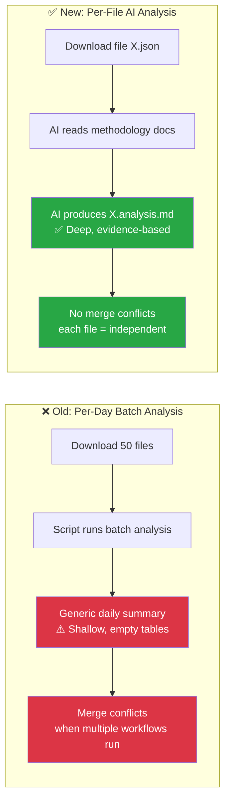
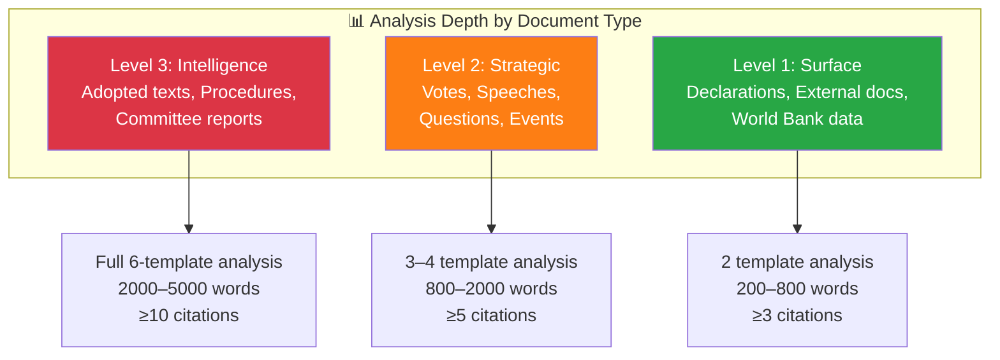

<p align="center">
  
</p>

<h1 align="center">🤖 AI-Driven Per-File Analysis Guide — European Parliament</h1>

<p align="center">
  <strong>📊 Comprehensive Methodology for Agentic Political Intelligence Analysis</strong><br>
  <em>🎯 Per-File Protocol · Quality Gates · Anti-Patterns · Document-Type Focus</em>
</p>

<p align="center">
  <a href="#"></a>
  <a href="#"></a>
  <a href="#"></a>
  <a href="#"></a>
</p>

**📋 Document Owner:** CEO | **📄 Version:** 3.0 | **📅 Last Updated:** 2026-04-02 (UTC)
**🔄 Review Cycle:** Quarterly | **⏰ Next Review:** 2026-07-02
**🏢 Owner:** Hack23 AB (Org.nr 5595347807) | **🏷️ Classification:** Public

---

## 🎯 Purpose

This guide defines the **per-file AI analysis protocol** — the primary analysis mode for EU Parliament Monitor. For every downloaded EP MCP data file, the AI agent produces a deep analysis markdown file stored alongside it. This replaces batch summaries with systematic, per-document intelligence production.

**Critical mandate:** AI agents must READ all methodology documents, ANALYSE the specific data file using those methodologies, and PRODUCE original intelligence — never scripted or templated boilerplate.

---

## 🔴 ABSOLUTE RULES (Violations = Rejected Output)

### Rule 1: Folder Isolation — NEVER Overwrite Another Workflow's Analysis

Each agentic workflow writes ONLY to its own isolated folder:

```
analysis/{YYYY-MM-DD}/{article-type-slug}/
```

**Automatic suffix deduplication (v3.0):** When a workflow runs and a prior completed analysis already exists at the target path (indicated by an existing `manifest.json`), the system automatically appends a numeric suffix to create a new directory:

```
analysis/2026-04-02/breaking/       ← first run
analysis/2026-04-02/breaking-2/     ← second run (same day)
analysis/2026-04-02/breaking-3/     ← third run (same day)
```

Similarly, news article files include the suffix as part of the slug:

```
news/2026-04-02-breaking-en.html       ← first run
news/2026-04-02-breaking-2-en.html     ← second run (suffix in slug, before lang code)
```

This ensures that repeated or scheduled workflow runs (e.g. breaking news every 6 hours) NEVER overwrite previously committed analysis or articles. Each run produces its own unique output.

**Enforcement checklist:**
- [ ] My workflow writes ONLY to `analysis/${ARTICLE_DATE}/${ARTICLE_TYPE_SLUG}/` (or its suffixed variant)
- [ ] My `git add` is scoped: `git add "analysis/${ARTICLE_DATE}/${ARTICLE_TYPE_SLUG}*/"` (includes suffixed dirs)
- [ ] I do NOT touch files in any other workflow's folder
- [ ] Breaking workflows use the `breaking/` slug (automatic suffixing handles repeats)
- [ ] I do NOT manually delete or overwrite any existing analysis or article files

### Rule 2: AI Performs ALL Analysis — Scripts ONLY Download Data

| ✅ Scripts MAY | 🚫 Scripts MUST NEVER |
|---------------|----------------------|
| Download EP MCP data files | Generate analysis prose, SWOT entries, risk scores |
| Catalog pending files | Fill template sections with content |
| Run quality gate validation | Create "placeholder" text that looks like real analysis |
| Create directory structure | Produce significance scores or classifications |

**Test:** If you can replace the "analysis" content with Lorem Ipsum and nobody notices, it's scripted crap — not genuine analysis.

### Rule 3: Read ALL Methodologies Before Analyzing

Before analyzing ANY document, the AI MUST read:
1. `analysis/methodologies/political-swot-framework.md` — Cross-SWOT interference, TOWS matrix, scenario generation
2. `analysis/methodologies/political-risk-methodology.md` — Cascading risk, Bayesian updating, risk interconnection
3. `analysis/methodologies/political-threat-framework.md` — Political Threat Landscape, Attack Trees, Diamond Model, Kill Chain, PESTLE
4. `analysis/methodologies/political-classification-guide.md` — Political Temperature, strategic significance, coalition impact vector
5. `analysis/methodologies/political-style-guide.md` — Evidence density, attribution, intelligence writing depth levels
6. ALL 8 templates in `analysis/templates/`

### Rule 4: Multi-Framework Depth Required

Every analysis file MUST demonstrate:
- **≥ 3 evidence-backed claims** per analytical section (with EP document citations)
- **≥ 1 colour-coded Mermaid diagram** with real data (not placeholders)
- **Multi-perspective analysis** (Grand Coalition, opposition, citizens, EU institutions, international)
- **Cross-document pattern identification** (how this relates to other recent EP activity)
- **Forward-looking indicators** (what to watch next, with specific triggers)
- **At least 2 analytical frameworks** applied (e.g., SWOT + Risk, or Attack Tree + Kill Chain)

### Rule 5: ALWAYS Commit Analysis — No Workflow Run Wasted

Every agentic workflow run MUST produce and commit analysis artifacts to the `analysis/` folder. **No workflow run should ever be wasted** — even when no article is generated, the analysis work must be persisted.

| Scenario | Required Action |
|----------|----------------|
| Article generated | Include analysis artifacts in the article PR alongside `news/` files |
| No article (quiet period) | Create an **analysis-only PR** with collected data analysis artifacts instead of discarding work |
| Existing analysis found | **Improve, extend, correct, or complete** the existing analysis — never skip or overwrite blindly |
| Translation workflow | Perform translation coverage and terminology quality analysis |
| MCP server unavailable | Document the connection failure and any partial data in analysis; commit what was gathered |

**Enforcement checklist:**
- [ ] Analysis artifacts are included in `git add` alongside article files — never deleted before PR creation
- [ ] Raw MCP data payload files (e.g. `data/**/*.json`, `*.ndjson`, `*.csv`, `*.xml`) may be cleaned to control PR size, but **never delete `*.analysis.md` or other markdown artifacts** under `data/`; analysis markdown is ALWAYS committed
- [ ] On noop scenarios, create an analysis-only PR (`safeoutputs___create_pull_request`) instead of discarding analysis with `safeoutputs___noop`
- [ ] Before producing new analysis, check for existing analysis in `analysis/${ARTICLE_DATE}/${ARTICLE_TYPE_SLUG}/` and **improve/extend** it rather than replacing from scratch
- [ ] Every workflow references this guide (`analysis/methodologies/ai-driven-analysis-guide.md`) as the authoritative analysis protocol

**Anti-patterns (REJECTED):**
- ❌ `rm -rf analysis/` before PR creation — this destroys valuable intelligence
- ❌ `safeoutputs___noop` when analysis artifacts have been produced — use `safeoutputs___create_pull_request` for analysis-only PRs instead
- ❌ Ignoring existing analysis files — always read, evaluate, and improve them
- ❌ Skipping analysis because "there's no news" — analysis of quiet periods reveals patterns too

### Rule 6: Article Type Identification — Analysis Must Include Article Type Context

Every analysis artifact and news article MUST clearly identify which article type (category) it belongs to. This prevents cross-contamination when multiple workflows produce analysis for the same date.

**Mandatory identification in analysis artifacts:**
- [ ] Every `manifest.json` includes `"articleType": "<slug>"` (e.g., `"articleType": "breaking"`)
- [ ] Every `.analysis.md` file includes YAML frontmatter with `articleType: <slug>`
- [ ] Analysis file paths always include the article type slug: `analysis/{date}/{article-type-slug}/`
- [ ] The article HTML includes the article type in its metadata: `<meta name="article-type" content="<slug>">`

**Valid article type slugs** (from `ArticleCategory` enum in `src/types/common.ts`):

| Article Type | Slug | Perspective |
|-------------|------|-------------|
| Breaking News | `breaking` | Real-time |
| Committee Reports | `committee-reports` | Domain-specific |
| Motions | `motions` | Domain-specific |
| Propositions | `propositions` | Domain-specific |
| Week Ahead | `week-ahead` | Prospective |
| Month Ahead | `month-ahead` | Prospective |
| Week in Review | `week-in-review` | Retrospective |
| Month in Review | `month-in-review` | Retrospective |
| Year Ahead | `year-ahead` | Prospective |
| Year in Review | `year-in-review` | Retrospective |
| Deep Analysis | `deep-analysis` | Analytical |

**Anti-patterns (REJECTED):**
- ❌ Analysis artifacts without article type identification — makes it impossible to trace analysis provenance
- ❌ One article type's workflow writing analysis to another type's directory
- ❌ Generic analysis that could belong to any article type — every analysis must be contextualised for its specific article perspective

### Rule 7: Minimum 15-Minute AI Analysis Time — Deep Political Intelligence Required

Every workflow MUST allocate a **minimum of 15 minutes** to AI-driven political intelligence analysis. This is the analysis time where the AI agent reads methodology documents, queries MCP tools, and produces original analytical content. This does NOT include data download time or HTML formatting time.

**Minimum analysis time budgets (updated):**

| Workflow | Minimum AI Analysis Time | What the AI Must Produce |
|----------|:------------------------:|--------------------------|
| Breaking news | 15 minutes | Per-event significance scoring, coalition impact, threat assessment |
| Committee reports | 15 minutes | Committee power analysis, rapporteur dynamics, amendment landscape |
| Propositions | 15 minutes | Legislative pipeline risk, passage probability, institutional tension |
| Motions | 15 minutes | Voting coalition analysis, group cohesion, cross-party patterns |
| Week ahead | 15 minutes | Strategic outlook, scenario planning, risk forecasting |
| Month ahead | 15 minutes | Political landscape analysis, coalition evolution, policy momentum |
| Week in review | 20 minutes | Comprehensive weekly intelligence synthesis, trend detection |
| Month in review | 25 minutes | Deep monthly analytical assessment, pattern identification |

**What counts as AI analysis time:**
- ✅ Reading and applying methodology documents
- ✅ Querying EP MCP tools for cross-referencing data
- ✅ Writing original analytical prose with evidence citations
- ✅ Producing Mermaid diagrams with real data
- ✅ Conducting multi-framework analysis (SWOT + Risk + Threat)
- ✅ Iterating through the 4-pass refinement cycle

**What does NOT count:**
- ❌ Running `npx tsx` scripts (data preparation, not analysis)
- ❌ Waiting for MCP feed responses
- ❌ HTML template formatting and rendering
- ❌ Git operations (commit, PR creation)

### Rule 8: Scripts Format, AI Analyses — Clear Separation of Concerns

The separation between script-generated structure and AI-generated analysis MUST be strictly maintained:

| Layer | Responsibility | Examples |
|-------|---------------|----------|
| **Scripts** (TypeScript) | Data fetching, HTML rendering, template structure, chart/mindmap/SWOT HTML scaffolding, metadata generation | `analysis-builders.ts`, `swot-content.ts`, `mindmap-content.ts`, `deep-analysis-content.ts` |
| **AI Agent** (Workflow LLM) | Political narrative, analytical conclusions, evidence-backed claims, confidence assessments, stakeholder reasoning, risk justifications, scenario planning | All `AI_MARKER` fields, analysis markdown prose, SWOT entry justifications |

**Scripts produce consistent formatting** — charts, mindmaps, SWOT grids, dashboards, Sankey diagrams, stakeholder matrices. These are HTML rendering components that ensure visual consistency across all articles.

**AI produces the intelligence content** — the actual political analysis that fills those visual containers. Every SWOT entry must have AI-written justification. Every stakeholder outcome must have AI-written reasoning. Every risk score must have AI-written explanation.

**Test:** Remove all AI-written content from an article. If the remaining shell still looks like a complete article, the AI did too little work. The article should be visually rich but intellectually empty without AI analysis.

**Anti-patterns (REJECTED):**
- ❌ Scripts generating `[AI_ANALYSIS_REQUIRED]` placeholders that survive to the final article — all placeholders must be filled by the AI agent
- ❌ SWOT quadrants with `—` (em-dash) entries instead of real analysis — every quadrant needs ≥2 substantive entries
- ❌ Stakeholder outcome matrices with "Winner/Loser/Neutral" labels but no supporting rationale
- ❌ Mindmap visualizations with template-only nodes and `data-connections="0"` — real policy connections required
- ❌ Scripts producing political narrative text — this is the AI agent's exclusive domain

### Rule 9: AI-Driven Headlines and Descriptions — Newsworthy, Not Technical

Every news article title and meta description MUST be AI-generated based on the **political significance** of the content, never from script-generated technical metrics.

| ❌ REJECTED Titles | ✅ REQUIRED Titles |
|---|---|
| `Legislative Procedures: European Parliament Monitor — Pipeline 0%` | `EU Legislative Tracker: Banking Resolution Reforms Clear Committee as Corruption Directive Advances` |
| `Plenary Votes & Resolutions: 2026-04-02 — 2 Votes, 1 Anomaly` | `Parliament Divided: ECR Dissent Signals Shifting Alliances on Trade Tariff Response` |
| `EU Parliament Committee Activity Report: ENVI, ECON, AFET, LIBE, AGRI — 19 Adopted Texts` | `Five Committees Reshape EU Policy: Anti-Corruption, Banking Reform, and Climate Regulation Advance` |

**Title requirements:**
- Lead with the political story, not data metrics (no "Pipeline 0%", "2 Votes", "19 Adopted Texts")
- Maximum 70 characters for SEO (Google typically displays 50-60 characters)
- Include the most newsworthy development from feed data
- Name specific legislation, committees, or political actors when possible
- Use active verbs: "advances", "divides", "reshapes", "signals"

**Meta description requirements:**
- 150-160 characters summarizing the political significance
- Reference specific EP actions with dates
- Include at least one stakeholder impact statement
- Never use generic descriptions like "European Parliament committee activity and legislative effectiveness analysis"

**AI prompt for title generation:**
> Given the following EP feed data and analysis results, generate a newsworthy headline that: (1) leads with the most politically significant development, (2) names specific legislation or actors, (3) uses active voice, (4) stays under 70 characters. Do NOT include raw metrics, dates-only, or data counts in the title.

### Rule 10: Comprehensive Analysis-to-Article Linkage

News articles MUST link to ALL individual analysis files, not just directory-level links. The Analysis & Transparency section MUST enumerate specific analysis artifacts that informed the article.

**Required links per article (in addition to existing directory links):**
- [ ] Link to `manifest.json` (analysis provenance)
- [ ] Links to each individual analysis `.md` file produced by the analysis stage
- [ ] Links to specific methodology documents that were applied
- [ ] Link to the raw EP data directory if available

**Article HTML template MUST include:**
```html
<!-- Individual analysis file links -->
<li><a href="{analysisDir}/classification/significance-assessment.md">Significance Assessment</a></li>
<li><a href="{analysisDir}/classification/actor-mapping.md">Actor Mapping</a></li>
<li><a href="{analysisDir}/classification/forces-analysis.md">Forces Analysis</a></li>
<li><a href="{analysisDir}/classification/impact-matrix.md">Impact Matrix</a></li>
<li><a href="{analysisDir}/threat-assessment/political-threat-landscape.md">Political Threat Landscape</a></li>
<li><a href="{analysisDir}/threat-assessment/actor-threat-profiles.md">Actor Threat Profiles</a></li>
<li><a href="{analysisDir}/threat-assessment/consequence-trees.md">Consequence Trees</a></li>
<li><a href="{analysisDir}/threat-assessment/legislative-disruption.md">Legislative Disruption</a></li>
<li><a href="{analysisDir}/risk-scoring/risk-matrix.md">Risk Matrix</a></li>
<li><a href="{analysisDir}/risk-scoring/quantitative-swot.md">Quantitative SWOT</a></li>
<li><a href="{analysisDir}/risk-scoring/political-capital-risk.md">Political Capital Risk</a></li>
<li><a href="{analysisDir}/risk-scoring/legislative-velocity-risk.md">Legislative Velocity Risk</a></li>
<li><a href="{analysisDir}/risk-scoring/agent-risk-workflow.md">Agent Risk Workflow</a></li>
<li><a href="{analysisDir}/existing/deep-analysis.md">Deep Analysis</a></li>
<li><a href="{analysisDir}/existing/stakeholder-analysis.md">Stakeholder Analysis</a></li>
<li><a href="{analysisDir}/existing/coalition-analysis.md">Coalition Analysis</a></li>
<li><a href="{analysisDir}/existing/voting-patterns.md">Voting Patterns</a></li>
<li><a href="{analysisDir}/existing/cross-session-intelligence.md">Cross-Session Intelligence</a></li>
```

### Rule 11: Script-Generated Analysis Must Be AI Prompt Placeholders, Not Content

The `existing/` analysis category methods (deep-analysis, stakeholder-analysis, coalition-analysis, voting-patterns, cross-session-intelligence) currently produce **script-generated data inventory tables** that are NOT analysis. These MUST be redesigned as AI prompt placeholders.

**Current problem (observed in 2026-04-02 analysis):**
```markdown
# Coalition Cohesion Analysis
## Coalition Metrics
- **Overall Stability**: 0.0%
- **Forecast**: volatile
- **Patterns Analysed**: 0
```
This is a script printing raw metrics — it is NOT intelligence analysis. The AI agent produces the actual analysis in the agentic workflow but the script-generated file is what gets committed to the repository.

**Required change — scripts MUST produce analysis prompt templates:**
```markdown
---
method: coalition-analysis
date: 2026-04-02
status: AI_ANALYSIS_PENDING
dataPointsAvailable:
  adoptedTexts: 30
  votingRecords: 0
  coalitionData: 0
---

# Coalition Cohesion Analysis — AI Analysis Required

## Data Inventory (Script-Generated)
[Raw data counts for AI context]

## AI Analysis Prompt
Analyze coalition dynamics using the political-risk-methodology.md framework:
1. Which political groups show the strongest/weakest internal cohesion based on available voting data?
2. What coalition patterns emerge from the adopted texts voting records?
3. Identify any cross-party voting alignments or defections
4. Rate overall coalition stability with confidence level (🟢/🟡/🔴)
5. Provide 2-3 forward-looking scenarios for coalition evolution

## AI-Produced Analysis
[TO BE FILLED BY AI AGENT IN AGENTIC WORKFLOW]
```

**Enforcement:** The agentic workflow AI agent MUST read these prompt-placeholder files, execute the analysis prompt, and replace the `[TO BE FILLED BY AI AGENT]` section with substantive intelligence. The quality gate rejects any file still containing `AI_ANALYSIS_PENDING` status after the workflow completes.

### Rule 12: AI Must Generate ALL Article Narrative Text — Zero Script-Generated Prose

No TypeScript code should generate political narrative text, analytical conclusions, or descriptive prose for news articles. Scripts produce HTML structure, data tables, and visual components. ALL textual content in articles that describes, analyses, or interprets EP data MUST come from AI prompts.

**Separation of concerns:**

| Component | Produced By | Examples |
|-----------|------------|---------|
| HTML structure, CSS, metadata | Scripts (TypeScript) | `<article>`, `<section>`, meta tags, JSON-LD |
| Data tables, charts, SWOT grids | Scripts (TypeScript) | Vote count tables, pipeline health bars, mindmap SVGs |
| Article title, lede, body narrative | AI Agent (Workflow LLM) | Headlines, analytical paragraphs, stakeholder impact text |
| Stakeholder reasoning, risk justification | AI Agent (Workflow LLM) | "The EPP group's support signals..." |
| Forward-looking scenarios, predictions | AI Agent (Workflow LLM) | "Three scenarios emerge: (1) likely..." |
| Confidence assessments on claims | AI Agent (Workflow LLM) | "🟢 High confidence based on EP vote TA-10-2026-0091" |

**AI prompt template for article narrative:**
> You are writing a news article for EU Parliament Monitor. Based on the analysis artifacts in `analysis/{date}/{slug}/` and the EP MCP feed data, write the following sections:
> 1. **Headline**: Newsworthy, 50-70 characters, names specific legislation/actors
> 2. **Meta description**: 150-160 characters, political significance summary
> 3. **Lede paragraph**: 50-75 words, hook + context + significance
> 4. **Body sections**: Inverted pyramid structure, active voice, evidence-cited
> 5. **Stakeholder analysis**: From ≥3 of 6 perspectives, with impact/severity ratings
> 6. **Forward-looking analysis**: 2-3 scenarios with probability indicators
> All claims must cite specific EP document IDs or MCP tool data.

---

## 🏗️ Architecture: Per-File vs. Per-Day Analysis

### Why Per-File?



| Dimension | Per-Day (Old) | Per-File (New) |
|-----------|:------------:|:--------------:|
| **Analysis depth** | Shallow (script-generated) | Deep (AI-driven, methodology-guided) |
| **Output quality** | Empty tables, generic text | SWOT.md-quality with Mermaid diagrams |
| **Merge conflicts** | Frequent (shared daily files) | None (each file independent) |
| **Coverage** | Session-based (misses files) | 100% (every downloaded file) |
| **Reusability** | Daily snapshot only | Persistent per-document intelligence |
| **Incremental** | Must re-run entire day | Only analyse new/changed files |

---

## 🔄 Analysis Pipeline


### Step-by-Step Protocol

| Step | Action | Reference | Output |
|:----:|--------|-----------|--------|
| 1 | **Read ALL methodology docs** before any analysis | `analysis/methodologies/*.md` (6 files) | Mental model of analytical framework |
| 2 | **Load data file** and extract key fields | Downloaded EP MCP JSON/response | Structured data extract |
| 3 | **Classify** — Sensitivity, domain, urgency | [political-classification-guide.md](political-classification-guide.md) | PUBLIC/SENSITIVE/RESTRICTED + domain code |
| 4 | **SWOT analysis** — Evidence-based quadrant assessment | [political-swot-framework.md](political-swot-framework.md) | 4-quadrant impact with citations |
| 5 | **Risk assessment** — 5×5 Likelihood × Impact | [political-risk-methodology.md](political-risk-methodology.md) | Risk scores per category |
| 6 | **Threat analysis** — Multi-framework (Threat Landscape + Attack Trees + Diamond Model) | [political-threat-framework.md](political-threat-framework.md) | Threat inventory |
| 7 | **Stakeholder impact** — 6-lens assessment | Template: [stakeholder-impact.md](../templates/stakeholder-impact.md) | Impact by stakeholder group |
| 8 | **Significance scoring** — 5-dimension composite | Template: [significance-scoring.md](../templates/significance-scoring.md) | Score 0–10 with publish decision |
| 9 | **Write per-file analysis** using template | [per-file-political-intelligence.md](../templates/per-file-political-intelligence.md) | `{id}.analysis.md` |
| 10 | **Quality gate** — Self-assess against checklist | Quality checklist below | Pass/Fail |

---

## 📋 Document-Type Analysis Focus

Different EP document types require different analytical emphasis. The AI agent must adapt its analysis based on the document type:

### EP Document Type → Primary Analysis Templates

| Document Type | MCP Data Category | Primary Templates | Key MCP Cross-Reference Tools |
|--------------|------------------|-------------------|-------------------------------|
| **Adopted texts** (legislative resolutions) | `adopted-texts/` | Political Classification + Risk Assessment | `get_voting_records`, `get_plenary_sessions` |
| **Committee documents** (reports, opinions) | `committee-documents/` | Stakeholder Impact + Risk Assessment | `get_committee_info`, `search_documents` |
| **Legislative procedures** | `procedures/` | Risk Assessment + SWOT Analysis | `track_legislation`, `get_procedure_events` |
| **Plenary votes** (roll-call) | `votes/` | Political Classification + SWOT + Threat Analysis | `get_voting_records`, `analyze_voting_patterns` |
| **Speeches** (plenary debates) | `speeches/` | Stakeholder Impact + Significance Scoring | `get_speeches`, `get_mep_details` |
| **Parliamentary questions** | `questions/` | Political Classification + Significance Scoring | `get_parliamentary_questions` |
| **Events** (hearings, conferences) | `events/` | Significance Scoring + Risk Assessment | `get_events`, `get_plenary_sessions` |
| **MEP profiles** | `meps/` | Stakeholder Impact + Political Classification | `get_mep_details`, `assess_mep_influence` |
| **MEP declarations** | `declarations/` | Threat Analysis (Disclosure) + Risk Assessment | `get_mep_declarations` |
| **Plenary documents** | `plenary-documents/` | All templates (comprehensive) | `get_plenary_documents`, `get_plenary_sessions` |
| **External documents** (Commission, Council) | `external-documents/` | SWOT + Risk Assessment | `get_external_documents` |
| **World Bank data** | `world-bank/` | Risk Assessment (economic) + SWOT | World Bank MCP tools |

### Document-Specific Analysis Depth



---

## ⏱️ Time Budget & Prioritisation Protocol

### Time Budget Per File

Not all EP documents need the same analysis depth. Prioritise by document type:

| Document Type | Analysis Time Budget | Analysis Depth | Sections Required |
|--------------|:--------------------:|:--------------:|------------------|
| **Adopted texts** | 3–5 minutes | Full (all sections) | Classification + SWOT + Risk + Threat + Stakeholder + Forward |
| **Plenary votes** | 2–4 minutes | Full (all sections) | Classification + SWOT + Risk + Stakeholder + Forward |
| **Committee documents** | 2–3 minutes | Standard | Classification + SWOT + Risk + Forward |
| **Legislative procedures** | 2–3 minutes | Standard | Classification + Risk + Stakeholder + Forward |
| **Speeches** | 1–2 minutes | Quick | Classification + Stakeholder + Forward |
| **Parliamentary questions** | 1–2 minutes | Quick | Classification + Significance + Forward |
| **Events** | 1–2 minutes | Quick | Classification + Significance + Forward |
| **MEP profiles/declarations** | 1–2 minutes | Context | Classification + Stakeholder + Significance |
| **External documents** | 1–2 minutes | Context | Classification + Risk + SWOT |
| **World Bank data** | 1–2 minutes | Context | Classification + Economic context note |

### Prioritisation When Time-Constrained

When the workflow time budget is limited:

1. **Sort pending files by expected significance** — Adopted texts and votes first, then committee reports, then everything else
2. **Analyse highest-priority files first** — Complete full analysis for top-priority documents
3. **Quick-classify remaining files** — At minimum, assign classification level and significance score
4. **Stop at time limit** — Whatever is analysed is committed; remaining files are flagged as "pending" for next run

### Maximum Files Per Workflow Run

| Workflow | Typical Download | Analysis Target | Minimum AI Analysis Time |
|----------|:----------------:|:---------------:|:------------------------:|
| Breaking news | 1–5 files | All files (full depth) | 15 minutes |
| Committee reports | 5–20 files | All files (single type) | 15 minutes |
| Propositions | 5–15 files | All files (full depth) | 15 minutes |
| Motions | 10–30 files | Top 10 full + rest quick-classified | 15 minutes |
| Week in review | 50–200 files | Top 20 full + rest aggregated | 20 minutes |
| Month in review | 200–500 files | Top 30 full + rest aggregated | 25 minutes |
| Week ahead | 10–30 files | All files (forward-looking) | 15 minutes |
| Month ahead | 20–50 files | All files (strategic) | 15 minutes |

> **⚠️ MINIMUM 15 MINUTES**: Per Rule 7, every workflow must spend at least 15 minutes on AI-driven political intelligence analysis. This is the time spent reading methodologies, querying MCP tools, and writing original analytical prose — not data download or HTML formatting time.

---

## 📄 Document-Type-Specific Analysis Focus Areas

### Adopted Texts (Legislative Resolutions, Positions)

Focus areas:
- **Coalition dynamics**: How did the political groups vote? Any surprising alliances?
- **Policy impact**: What changes for EU citizens, businesses, member states?
- **Trilogue outcome**: Did the EP position survive? What concessions were made?
- **Implementation timeline**: Transposition deadlines, phased implementation

### Committee Documents (Reports, Opinions)

Focus areas:
- **Committee vote splits**: Which political groups supported/opposed?
- **Rapporteur strategy**: How did the rapporteur build a majority?
- **Shadow rapporteur dynamics**: Cross-group negotiation patterns
- **Amendment adoption rate**: How many amendments survived?

### Legislative Procedures

Focus areas:
- **Pipeline stage**: Where is this in the EU legislative process?
- **Trilogue status**: Has trilogue started? How many rounds?
- **Timeline risk**: Is the procedure at risk of expiring before term ends?
- **Institutional tension**: EP vs. Council vs. Commission positions

### Plenary Votes (Roll-Call)

Focus areas:
- **Grand Coalition discipline**: Did EPP-S&D-Renew vote together?
- **ECR/PfE behavior**: Support, opposition, or abstention pattern?
- **Cross-party voting**: Unexpected alliances or defections?
- **Margin analysis**: Close vote = instability indicator

### Speeches (Plenary Debates)

Focus areas:
- **Rhetorical signals**: New policy positions announced? Tone shifts?
- **Accountability probes**: Commissioners challenged on record?
- **Consensus vs. confrontation**: Cross-group appeals or partisan rhetoric?
- **Media potential**: Quotable statements for news coverage?

### Parliamentary Questions

Focus areas:
- **Accountability pressure**: What are MEPs demanding answers on?
- **Commission responsiveness**: Timely and substantive responses?
- **Policy gaps**: Issues the Commission hasn't addressed?
- **Pattern detection**: Coordinated questioning campaigns across political groups?

---

## 🚫 Anti-Pattern Gallery

### ❌ Pattern 1: Scripted Boilerplate

```markdown
## Analysis
This document contains important legislative content. The European Parliament has
taken significant action. Further monitoring is recommended.
```

**Why rejected:** Zero analytical content. No evidence. No classification. No risk scoring. This is "scripted crap content" — the AI did not actually analyse the document.

### ✅ Correct Approach

```markdown
## 🎯 Executive Summary

The ENVI committee's adoption of the revised ETS extension report (PE-745.123/2026)
marks a critical inflection point in EU climate policy [HIGH confidence]. The 38–22
committee vote reveals a fracture in the EPP group (7 EPP members voted against their
group's official position per EP MCP voting data), creating a potential grand coalition
realignment on environmental legislation. Risk score: Coalition Stability L=3 × I=4 = 12
(🟠 HIGH) based on vote margin analysis and EPP internal dynamics.
```

### ❌ Pattern 2: Summary Without Structure

```markdown
Several things happened in the European Parliament this week. There were votes
on trade, environment, and defence matters. The political groups showed mixed
levels of unity.
```

**Why rejected:** No tables. No Mermaid diagrams. No evidence citations. No risk scores. No significance assessment.

### ✅ Correct Approach

Use the structured template with tables, Mermaid diagrams, evidence columns, and confidence labels for every section.

### ❌ Pattern 3: Overwriting Previous Analysis

A workflow running on Tuesday overwrites Monday's analysis file in the same location.

**Why rejected:** Destroys audit trail. Loses temporal context needed for trend detection. Violates isolation mandate.

### ✅ Correct Approach

Each workflow writes to its own directory: `analysis/{date}/{article-type-slug}/`. Monday's `news-breaking` writes to `analysis/2026-03-30/breaking/`, Tuesday's `news-committee-reports` writes to `analysis/2026-03-31/committee-reports/`. Never overwrite.

---

## 🔍 Known Article Quality Issues — Workflow Anti-Patterns to Prevent

The following quality issues have been observed in generated news articles and MUST be prevented by all agentic workflows. Each issue traces to insufficient AI analysis time or depth.

### Top 10 Quality Issues (Ranked by Severity)

| Rank | Issue | Severity | Root Cause | Prevention |
|:----:|-------|:--------:|-----------|-----------|
| 1 | **`[AI_ANALYSIS_REQUIRED]` placeholders remain in final HTML** | 🔴 CRITICAL | AI analysis stage incomplete; script templates not filled | Rule 8: AI must fill ALL placeholders before HTML generation. Quality gate MUST reject articles with any `[AI_ANALYSIS_REQUIRED]` text |
| 2 | **SWOT quadrants contain empty `—` entries** | 🔴 HIGH | AI did not produce SWOT analysis; script fallback used | Rule 7: Minimum 15 min analysis. Every SWOT quadrant needs ≥2 substantive entries with evidence |
| 3 | **Mindmap visualizations show `data-connections="0"`** | 🔴 HIGH | No real policy connections mapped; template-only structure | AI must identify ≥3 cross-domain policy connections per mindmap |
| 4 | **Missing statistical depth in political analysis** | 🔴 HIGH | No rapporteur/voting data integration; surface-level facts only | Rule 4: Multi-framework depth. Must include vote counts, margins, coalition breakdowns |
| 5 | **Stakeholder outcome matrices lack justification** | 🔴 HIGH | Winner/Loser labels assigned without reasoning | Rule 8: Every stakeholder outcome MUST have AI-written rationale |
| 6 | **No confidence levels stated on analytical claims** | 🟠 MEDIUM | AI agent did not apply methodology style guide | Rule 3: Read political-style-guide.md. Every non-factual claim needs confidence labels |
| 7 | **Formulaic writing without Economist-style narrative** | 🟠 MEDIUM | AI used list format instead of analytical prose | Rule 3: Read political-style-guide.md depth levels. Lead with lede + analysis, not bullet lists |
| 8 | **Missing multi-framework analysis** | 🟠 MEDIUM | Only one analytical framework applied (usually basic SWOT) | Rule 4: At least 2 frameworks required (SWOT + Risk, or Attack Tree + Kill Chain) |
| 9 | **Incomplete semantic HTML with missing section hierarchy** | 🟠 MEDIUM | Scripts generating structure without proper nesting | Article template must enforce `article > header > article-content > sections` hierarchy |
| 10 | **Minimal or missing sources section** | 🟡 LOW | No MCP API citations, generic "European Parliament" link only | Every article must cite ≥3 specific EP data sources (document IDs, MCP tool names, procedure references) |

### Workflow Enforcement Points

Each workflow MUST verify these quality gates **before** creating the PR:

```bash
# Quality gate: No AI_ANALYSIS_REQUIRED placeholders in final HTML
if grep -r "AI_ANALYSIS_REQUIRED" news/${TODAY}-${ARTICLE_TYPE}-*.html 2>/dev/null; then
  echo "❌ QUALITY GATE FAILED: Unfilled AI analysis placeholders found"
  echo "The AI agent must fill ALL analysis sections before article generation."
  exit 1
fi

# Quality gate: No empty SWOT entries (em-dash only)
if grep -c 'swot-empty' news/${TODAY}-${ARTICLE_TYPE}-en.html 2>/dev/null | grep -v '^0$'; then
  echo "⚠️ WARNING: Empty SWOT entries detected — AI must provide substantive analysis"
fi
```

---

## ✅ Quality Gate Checklist

Before finalising any analysis artifact, the AI agent must verify:

### Structural Quality
- [ ] Hack23 header with logo and badge row present
- [ ] Document metadata complete (date, classification, workflow, confidence)
- [ ] At least 1 colour-coded Mermaid diagram included
- [ ] All sections use structured tables with evidence columns
- [ ] No placeholder text remains (`[REQUIRED]`, `[?]`, `{N}` all replaced)

### Analytical Quality
- [ ] Classification complete (sensitivity + domain + urgency)
- [ ] SWOT analysis has ≥ 2 entries per quadrant with evidence
- [ ] Risk assessment uses 5×5 matrix with specific scores (not generic "medium")
- [ ] Threat analysis uses multiple frameworks — includes attack trees, Diamond Model, or scenario planning
- [ ] Stakeholder impact covers all 6 lenses with specific assessments
- [ ] Significance score calculated with 5-dimension breakdown

### Evidence Quality
- [ ] Every factual claim has a source citation (EP document ID, MCP tool, or named source)
- [ ] Confidence levels stated for all non-factual claims
- [ ] No opinion-only entries in SWOT or risk tables
- [ ] Cross-references to related EP documents included
- [ ] MCP Data Files Used section present with specific file paths

### Writing Quality
- [ ] Written at appropriate depth level (1/2/3) per document type
- [ ] Active voice throughout
- [ ] EP-specific terminology used correctly
- [ ] No generic filler ("significant", "important", "various" without specifics)
- [ ] Multi-language friendly (no idioms, abbreviations spelled out)

### Score the Analysis (1–10)

| Dimension | Weight | Score |
|-----------|:------:|:-----:|
| Evidence density (citations per 100 words) | 0.25 | `[1-10]` |
| Analytical depth (beyond surface observation) | 0.25 | `[1-10]` |
| Structural compliance (tables, Mermaid, template adherence) | 0.20 | `[1-10]` |
| Actionable intelligence (forward indicators, probability assessments) | 0.15 | `[1-10]` |
| Political neutrality (no partisan conclusions) | 0.15 | `[1-10]` |

**Weighted Score Formula:** `Final = (Evidence × 0.25) + (Depth × 0.25) + (Structural × 0.20) + (Actionable × 0.15) + (Neutrality × 0.15)`

**Minimum passing score: 7.0/10.** Analysis scoring below 7.0 must be revised before consumption by downstream workflows.

---

## 🔄 Conflict Resolution for Parallel Workflows

When multiple agentic workflows run simultaneously:

### Isolation Rules

| Artifact Type | Isolation Strategy | Location |
|--------------|-------------------|----------|
| Per-file analysis | Inherently conflict-free (one file per document) | `analysis/{date}/{article-type-slug}/data/{id}.analysis.md` |
| Workflow-specific analysis | Per-workflow directory | `analysis/{date}/{article-type-slug}/` |
| Daily synthesis | Last-write-wins (later workflows produce better synthesis) | `analysis/{date}/synthesis-summary.md` |
| AI-driven cross-article analysis | Date root (shared across workflows) | `analysis/{date}/ai-*.md` |
| Weekly aggregation | Composed from daily analyses, not workflow outputs | `analysis/weekly/YYYY-WNN/` |

### Critical Rule: Never Overwrite Another Workflow's Analysis

```
✅ news-breaking   → analysis/2026-03-30/breaking/
✅ news-weekly-review → analysis/2026-03-30/weekly-review/
✅ news-committee-reports → analysis/2026-03-30/committee-reports/
❌ news-breaking overwrites news-weekly-review output → PROHIBITED
```

---

## 📚 Methodology Documents (AI Must Read Before Analysing)

| Priority | Document | Key Content |
|:--------:|----------|-------------|
| 🔴 1 | [political-swot-framework.md](political-swot-framework.md) | Evidence hierarchy, confidence levels, temporal decay, aggregation |
| 🔴 2 | [political-risk-methodology.md](political-risk-methodology.md) | 5×5 Likelihood × Impact matrix, coalition risk index |
| 🔴 3 | [political-threat-framework.md](political-threat-framework.md) | Multi-framework threat analysis: Threat Landscape + Attack Trees + Diamond Model + PESTLE |
| 🟠 4 | [political-classification-guide.md](political-classification-guide.md) | Sensitivity levels, domain taxonomy, urgency matrix |
| 🟠 5 | [political-style-guide.md](political-style-guide.md) | Writing standards, evidence density, depth levels, attribution |
| 🟠 6 | This document | Per-file protocol, quality gates, anti-patterns |

---

## 🔗 Related Documents

- [templates/per-file-political-intelligence.md](../templates/per-file-political-intelligence.md) — Per-file output template
- [templates/synthesis-summary.md](../templates/synthesis-summary.md) — Daily synthesis template
- [SWOT.md](../../SWOT.md) — Platform SWOT (**formatting exemplar**)
- [THREAT_MODEL.md](../../THREAT_MODEL.md) — Platform threat model (**formatting exemplar**)

---

**Document Control:**
- **Path:** `/analysis/methodologies/ai-driven-analysis-guide.md`
- **Classification:** Public
- **Next Review:** 2026-06-30
