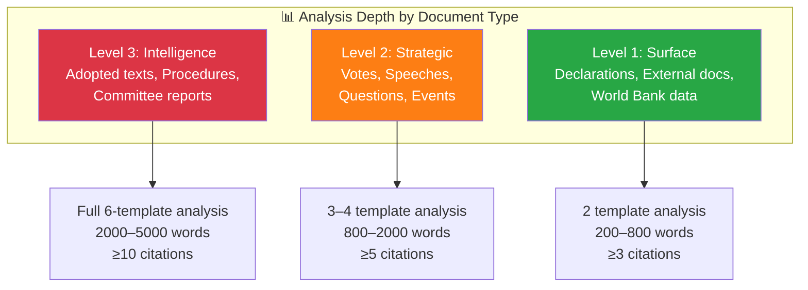

<p align="center">
  
</p>

<h1 align="center">🤖 AI-Driven Per-File Analysis Guide — European Parliament</h1>

<p align="center">
  <strong>📊 Comprehensive Methodology for Agentic Political Intelligence Analysis</strong><br>
  <em>🎯 Per-File Protocol · Quality Gates · Anti-Patterns · Document-Type Focus</em>
</p>

<p align="center">
  <a href="#"></a>
  <a href="#"></a>
  <a href="#"></a>
  <a href="#"></a>
</p>

**📋 Document Owner:** CEO | **📄 Version:** 1.0 | **📅 Last Updated:** 2026-03-30 (UTC)
**🔄 Review Cycle:** Quarterly | **⏰ Next Review:** 2026-06-30
**🏢 Owner:** Hack23 AB (Org.nr 5595347807) | **🏷️ Classification:** Public

---

## 🎯 Purpose

This guide defines the **per-file AI analysis protocol** — the primary analysis mode for EU Parliament Monitor. For every downloaded EP MCP data file, the AI agent produces a deep analysis markdown file stored alongside it. This replaces batch summaries with systematic, per-document intelligence production.

**Critical mandate:** AI agents must READ all methodology documents, ANALYSE the specific data file using those methodologies, and PRODUCE original intelligence — never scripted or templated boilerplate.

---

## 🔄 Analysis Pipeline


### Step-by-Step Protocol

| Step | Action | Reference | Output |
|:----:|--------|-----------|--------|
| 1 | **Read ALL methodology docs** before any analysis | `analysis/methodologies/*.md` (6 files) | Mental model of analytical framework |
| 2 | **Load data file** and extract key fields | Downloaded EP MCP JSON/response | Structured data extract |
| 3 | **Classify** — Sensitivity, domain, urgency | [political-classification-guide.md](political-classification-guide.md) | PUBLIC/SENSITIVE/RESTRICTED + domain code |
| 4 | **SWOT analysis** — Evidence-based quadrant assessment | [political-swot-framework.md](political-swot-framework.md) | 4-quadrant impact with citations |
| 5 | **Risk assessment** — 5×5 Likelihood × Impact | [political-risk-methodology.md](political-risk-methodology.md) | Risk scores per category |
| 6 | **Threat analysis** — Multi-framework (STRIDE + attack trees + LINDDUN) | [political-threat-framework.md](political-threat-framework.md) | Threat inventory |
| 7 | **Stakeholder impact** — 6-lens assessment | Template: [stakeholder-impact.md](../templates/stakeholder-impact.md) | Impact by stakeholder group |
| 8 | **Significance scoring** — 5-dimension composite | Template: [significance-scoring.md](../templates/significance-scoring.md) | Score 0–10 with publish decision |
| 9 | **Write per-file analysis** using template | [per-file-political-intelligence.md](../templates/per-file-political-intelligence.md) | `{id}.analysis.md` |
| 10 | **Quality gate** — Self-assess against checklist | Quality checklist below | Pass/Fail |

---

## 📋 Document-Type Analysis Focus

Different EP document types require different analytical emphasis. The AI agent must adapt its analysis based on the document type:

### EP Document Type → Primary Analysis Templates

| Document Type | MCP Data Category | Primary Templates | Key MCP Cross-Reference Tools |
|--------------|------------------|-------------------|-------------------------------|
| **Adopted texts** (legislative resolutions) | `adopted-texts/` | Political Classification + Risk Assessment | `get_voting_records`, `get_plenary_sessions` |
| **Committee documents** (reports, opinions) | `committee-documents/` | Stakeholder Impact + Risk Assessment | `get_committee_info`, `search_documents` |
| **Legislative procedures** | `procedures/` | Risk Assessment + SWOT Analysis | `track_legislation`, `get_procedure_events` |
| **Plenary votes** (roll-call) | `votes/` | Political Classification + SWOT + Threat Analysis | `get_voting_records`, `analyze_voting_patterns` |
| **Speeches** (plenary debates) | `speeches/` | Stakeholder Impact + Significance Scoring | `get_speeches`, `get_mep_details` |
| **Parliamentary questions** | `questions/` | Political Classification + Significance Scoring | `get_parliamentary_questions` |
| **Events** (hearings, conferences) | `events/` | Significance Scoring + Risk Assessment | `get_events`, `get_plenary_sessions` |
| **MEP profiles** | `meps/` | Stakeholder Impact + Political Classification | `get_mep_details`, `assess_mep_influence` |
| **MEP declarations** | `declarations/` | Threat Analysis (Disclosure) + Risk Assessment | `get_mep_declarations` |
| **Plenary documents** | `plenary-documents/` | All templates (comprehensive) | `get_plenary_documents`, `get_plenary_sessions` |
| **External documents** (Commission, Council) | `external-documents/` | SWOT + Risk Assessment | `get_external_documents` |
| **World Bank data** | `world-bank/` | Risk Assessment (economic) + SWOT | World Bank MCP tools |

### Document-Specific Analysis Depth



---

## 🚫 Anti-Pattern Gallery

### ❌ Pattern 1: Scripted Boilerplate

```markdown
## Analysis
This document contains important legislative content. The European Parliament has
taken significant action. Further monitoring is recommended.
```

**Why rejected:** Zero analytical content. No evidence. No classification. No risk scoring. This is "scripted crap content" — the AI did not actually analyse the document.

### ✅ Correct Approach

```markdown
## 🎯 Executive Summary

The ENVI committee's adoption of the revised ETS extension report (PE-745.123/2026)
marks a critical inflection point in EU climate policy [HIGH confidence]. The 38–22
committee vote reveals a fracture in the EPP group (7 EPP members voted against their
group's official position per EP MCP voting data), creating a potential grand coalition
realignment on environmental legislation. Risk score: Coalition Stability L=3 × I=4 = 12
(🟠 HIGH) based on vote margin analysis and EPP internal dynamics.
```

### ❌ Pattern 2: Summary Without Structure

```markdown
Several things happened in the European Parliament this week. There were votes
on trade, environment, and defence matters. The political groups showed mixed
levels of unity.
```

**Why rejected:** No tables. No Mermaid diagrams. No evidence citations. No risk scores. No significance assessment.

### ✅ Correct Approach

Use the structured template with tables, Mermaid diagrams, evidence columns, and confidence labels for every section.

### ❌ Pattern 3: Overwriting Previous Analysis

A workflow running on Tuesday overwrites Monday's analysis file in the same location.

**Why rejected:** Destroys audit trail. Loses temporal context needed for trend detection. Violates isolation mandate.

### ✅ Correct Approach

Each workflow writes to its own directory: `analysis/{date}/{article-type-slug}/`. Monday's `news-breaking` writes to `analysis/2026-03-30/breaking-news/`, Tuesday's `news-committee-reports` writes to `analysis/2026-03-31/committee-reports/`. Never overwrite.

---

## ✅ Quality Gate Checklist

Before finalising any analysis artifact, the AI agent must verify:

### Structural Quality
- [ ] Hack23 header with logo and badge row present
- [ ] Document metadata complete (date, classification, workflow, confidence)
- [ ] At least 1 colour-coded Mermaid diagram included
- [ ] All sections use structured tables with evidence columns
- [ ] No placeholder text remains (`[REQUIRED]`, `[?]`, `{N}` all replaced)

### Analytical Quality
- [ ] Classification complete (sensitivity + domain + urgency)
- [ ] SWOT analysis has ≥ 2 entries per quadrant with evidence
- [ ] Risk assessment uses 5×5 matrix with specific scores (not generic "medium")
- [ ] Threat analysis goes beyond STRIDE — includes attack trees or scenario planning
- [ ] Stakeholder impact covers all 6 lenses with specific assessments
- [ ] Significance score calculated with 5-dimension breakdown

### Evidence Quality
- [ ] Every factual claim has a source citation (EP document ID, MCP tool, or named source)
- [ ] Confidence levels stated for all non-factual claims
- [ ] No opinion-only entries in SWOT or risk tables
- [ ] Cross-references to related EP documents included
- [ ] MCP Data Files Used section present with specific file paths

### Writing Quality
- [ ] Written at appropriate depth level (1/2/3) per document type
- [ ] Active voice throughout
- [ ] EP-specific terminology used correctly
- [ ] No generic filler ("significant", "important", "various" without specifics)
- [ ] Multi-language friendly (no idioms, abbreviations spelled out)

### Score the Analysis (1–10)

| Dimension | Weight | Score |
|-----------|:------:|:-----:|
| Evidence density (citations per 100 words) | 0.25 | `[1-10]` |
| Analytical depth (beyond surface observation) | 0.25 | `[1-10]` |
| Structural compliance (tables, Mermaid, template adherence) | 0.20 | `[1-10]` |
| Actionable intelligence (forward indicators, probability assessments) | 0.15 | `[1-10]` |
| Political neutrality (no partisan conclusions) | 0.15 | `[1-10]` |

**Minimum passing score: 7.0/10.** Analysis scoring below 7.0 must be revised before consumption by downstream workflows.

---

## 🔄 Conflict Resolution for Parallel Workflows

When multiple agentic workflows run simultaneously:

### Isolation Rules

| Artifact Type | Isolation Strategy | Location |
|--------------|-------------------|----------|
| Per-file analysis | Inherently conflict-free (one file per document) | `analysis/{date}/{article-type-slug}/data/{id}.analysis.md` |
| Workflow-specific analysis | Per-workflow directory | `analysis/{date}/{article-type-slug}/` |
| Daily synthesis | Last-write-wins (later workflows produce better synthesis) | `analysis/{date}/synthesis-summary.md` |
| AI-driven cross-article analysis | Date root (shared across workflows) | `analysis/{date}/ai-*.md` |
| Weekly aggregation | Composed from daily analyses, not workflow outputs | `analysis/weekly/YYYY-WNN/` |

### Critical Rule: Never Overwrite Another Workflow's Analysis

```
✅ news-breaking   → analysis/2026-03-30/breaking-news/
✅ news-weekly-review → analysis/2026-03-30/weekly-review/
✅ news-committee-reports → analysis/2026-03-30/committee-reports/
❌ news-breaking overwrites news-weekly-review output → PROHIBITED
```

---

## 📚 Methodology Documents (AI Must Read Before Analysing)

| Priority | Document | Key Content |
|:--------:|----------|-------------|
| 🔴 1 | [political-swot-framework.md](political-swot-framework.md) | Evidence hierarchy, confidence levels, temporal decay, aggregation |
| 🔴 2 | [political-risk-methodology.md](political-risk-methodology.md) | 5×5 Likelihood × Impact matrix, coalition risk index |
| 🔴 3 | [political-threat-framework.md](political-threat-framework.md) | Multi-framework threat analysis: STRIDE + attack trees + LINDDUN + PESTLE |
| 🟠 4 | [political-classification-guide.md](political-classification-guide.md) | Sensitivity levels, domain taxonomy, urgency matrix |
| 🟠 5 | [political-style-guide.md](political-style-guide.md) | Writing standards, evidence density, depth levels, attribution |
| 🟠 6 | This document | Per-file protocol, quality gates, anti-patterns |

---

## 🔗 Related Documents

- [templates/per-file-political-intelligence.md](../templates/per-file-political-intelligence.md) — Per-file output template
- [templates/synthesis-summary.md](../templates/synthesis-summary.md) — Daily synthesis template
- [SWOT.md](../../SWOT.md) — Platform SWOT (**formatting exemplar**)
- [THREAT_MODEL.md](../../THREAT_MODEL.md) — Platform threat model (**formatting exemplar**)

---

**Document Control:**
- **Path:** `/analysis/methodologies/ai-driven-analysis-guide.md`
- **Classification:** Public
- **Next Review:** 2026-06-30
