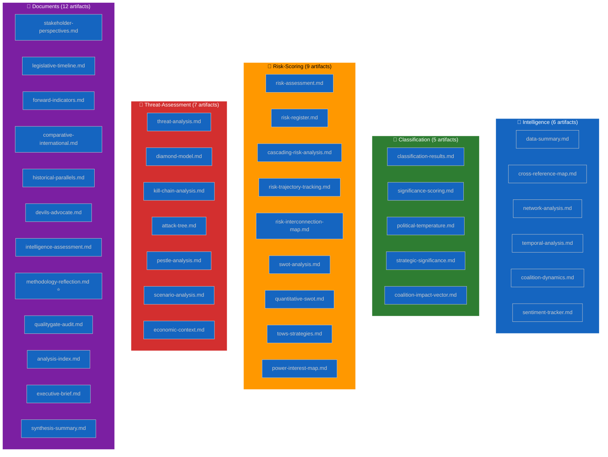

<!-- SPDX-FileCopyrightText: 2024-2026 Hack23 AB -->
<!-- SPDX-License-Identifier: Apache-2.0 -->

<p align="center">
  
</p>

<h1 align="center">🤖 AI-Driven Analysis Guide</h1>

<p align="center">
  <strong>📊 The 10-Step Protocol Every Agentic Workflow Follows to Produce Reference-Quality Political Intelligence</strong><br>
  <em>🎯 Clear · Step-by-Step · Positive · Color-Coded Mermaid · Deep Political Intelligence</em>
</p>

<p align="center">
  <a href="#"></a>
  <a href="#"></a>
  <a href="#"></a>
  <a href="#"></a>
</p>

**📋 Document Owner:** CEO | **📄 Version:** 6.3 | **📅 Last Updated:** 2026-05-15 (UTC)
**🔄 Review Cycle:** Quarterly | **⏰ Next Review:** 2026-07-31
**🏢 Owner:** Hack23 AB (Org.nr 5595347807) | **🏷️ Classification:** Public

---

## 🎯 Purpose

This guide is the **single authoritative protocol** every article-generating agentic workflow follows to turn European Parliament MCP data into reference-quality political intelligence.

The canonical `ARTICLE_TYPE_SLUG` values are defined in [`src/config/article-horizons.ts`](../../src/config/article-horizons.ts) and group naturally by horizon:

| Horizon | Slugs |
|---|---|
| **Reactive** | `breaking`, `committee-reports`, `motions`, `propositions` |
| **Retrospective** | `week-in-review`, `month-in-review`, `quarter-in-review`, `year-in-review` |
| **Prospective** | `week-ahead`, `month-ahead`, `quarter-ahead`, `year-ahead` |
| **Long-horizon** | `term-outlook`, `election-cycle`, `deep-analysis` |

Each slug maps to a `news-<slug>.md` workflow. The helper `news-translate.md` translates English source articles into 13 additional languages and is exempt from the single-PR rule.

The guide is **positive and step-by-step**: each step describes exactly what to produce. Detailed per-artifact construction rules live in [`per-artifact-methodologies.md`](per-artifact-methodologies.md); the master map of every artifact lives in [`artifact-catalog.md`](artifact-catalog.md).

---

## 🚀 Quick-Start Cheat-Sheet (read this first)

**One screen. One run. No re-reading.** Use this table as the operational
summary; jump into the deep sections only for the specific step you are about
to execute.

| Pillar | Where it lives | What you do in this run |
|---|---|---|
| 📦 **Scope** | `${ANALYSIS_DIR}` = `analysis/daily/${ARTICLE_DATE}/${ARTICLE_TYPE_SLUG}-run${RUN_ID}/` | Create sub-folders `intelligence/`, `classification/`, `risk-scoring/`, `threat-assessment/`, `documents/`, `extended/`, `data/`. Initialise `manifest.json`. |
| 📚 **Read** | §"2️⃣ Step 2" (15 docs) | P1 core × 7, P2 horizon-conditional × 5, P3 reference × 3. Emit `METHODOLOGIES_READ: ok`. |
| 📥 **Collect** | EP MCP, IMF, World Bank | ≤ 5 EP MCP calls in Stage A. Write every response under `data/`. |
| 🏷️ **Classify** | `classification/*.md` | 5-dim significance + ≥ 12 actors + Lewin force-field + impact matrix. |
| ⚠️ **Score** | `risk-scoring/*.md` | 5×5 risk matrix + 3+3+3+3 quantitative SWOT + TOWS. |
| 🎯 **Model** | `intelligence/*.md`, `threat-assessment/*.md` | Threat model (Diamond+Attack-Tree+Kill-Chain) + scenario forecast + PESTLE + IMF-primary economic-context + coalition-dynamics + wildcards + historical-baseline. |
| 🧠 **Synthesise** | `executive-brief.md`, `intelligence/synthesis-summary.md`, `intelligence/cross-run-diff.md`, `intelligence/significance-scoring.md` | Top-5 findings + ≥ 6 forward monitors + Bayesian delta vs prior run. |
| 🌐 **Headline pack** | `manifest.json.title` + `.description` | 14-language title + 150–160-char description + `searchIntentTerms`. AI-only, never code-generated. |
| 🔁 **Pass 2** | every file in `manifest.files.*` | Read end-to-end. Expand every shallow section. Resolve every `[AI_ANALYSIS_REQUIRED]` marker. |
| 🛡️ **Validate** | Stage-C editorial review | Per-artifact line floors from [`reference-quality-thresholds.json`](reference-quality-thresholds.json); IMF fingerprints; tradecraft self-check. |
| 🪪 **Audit** | `intelligence/workflow-audit.md` + `intelligence/methodology-reflection.md` | Final two artifacts. Methodology-reflection closes the loop with ≥ 10 SATs, ≥ 5 lessons, ≥ 6 biases. |
| 📤 **PR** | `safeoutputs___create_pull_request` | Exactly once, at end of run, target ≤ minute 42 (hard deadline ≤ 45). |

### Per-slug time budget (60-min total)

| Slug | Engine model | Pass 1 (min) | Pass 2 (min) | PR call by |
|---|---|---:|---:|---:|
| `breaking` | claude-sonnet-4.6 | 12 | 8 | ≤ 42 min |
| `committee-reports` | claude-sonnet-4.6 | 12 | 8 | ≤ 42 min |
| `motions` | claude-sonnet-4.6 | 12 | 8 | ≤ 42 min |
| `propositions` | claude-sonnet-4.6 | 12 | 8 | ≤ 42 min |
| `week-ahead` / `month-ahead` | claude-sonnet-4.6 | 12 | 8 | ≤ 42 min |
| `week-in-review` / `month-in-review` | claude-sonnet-4.6 | 15 | 10 | ≤ 45 min |
| `quarter-in-review` / `year-in-review` | claude-sonnet-4.6 | 18 | 12 | ≤ 45 min |
| `quarter-ahead` / `year-ahead` | claude-sonnet-4.6 | 18 | 12 | ≤ 45 min |
| `term-outlook` / `election-cycle` | claude-opus-4.8 | 22 | 15 | ≤ 47 min |
| `deep-analysis` | claude-sonnet-4.6 | 22 | 15 | ≤ 45 min |

Authoritative per-slug horizons (and the `mandatoryArtifact` lists) live in
[`src/config/article-horizons.ts`](../../src/config/article-horizons.ts) — the
table above is a reading aid, not a source of truth.

### Single-source-of-truth pointers

| Question | Answer lives in |
|---|---|
| Which artifacts do I produce for slug X? | [`artifact-catalog.md`](artifact-catalog.md) + `src/config/article-horizons.ts` |
| How do I build artifact Y? | [`per-artifact-methodologies.md`](per-artifact-methodologies.md) §Y |
| What confidence label do I use? | [`confidence-calibration.md`](confidence-calibration.md) — unified 🟢/🟡/🔴 + WEP + Admiralty |
| What if EP MCP fails? | [`source-triangulation.md`](source-triangulation.md) — 4-step fallback ladder |
| What line floor does artifact Y need? | [`reference-quality-thresholds.json`](reference-quality-thresholds.json) keyed by slug + artifact |
| What template do I render against? | [`../templates/README.md`](../templates/README.md) (61 templates total — `ls` is truth) |

---

## 🗺️ The 10-Step Protocol at a Glance


```mermaid
%%{init: {"theme":"dark","themeVariables":{"primaryColor":"#1565C0","primaryTextColor":"#ffffff","primaryBorderColor":"#0A3F7F","lineColor":"#90CAF9","secondaryColor":"#2E7D32","secondaryTextColor":"#ffffff","tertiaryColor":"#FF9800","tertiaryTextColor":"#000000","mainBkg":"#1565C0","secondBkg":"#2E7D32","tertiaryBkg":"#FF9800","noteBkgColor":"#FFC107","noteTextColor":"#000000","errorBkgColor":"#D32F2F","fontFamily":"Inter, Helvetica, Arial, sans-serif"}}}%%
flowchart LR
    S1["1️⃣ Prepare<br/>run scope"] --> S2["2️⃣ Read<br/>methodologies"]
    S2 --> S3["3️⃣ Collect<br/>EP MCP data"]
    S3 --> S4["4️⃣ Classify<br/>+ actor-map"]
    S4 --> S5["5️⃣ Score risk<br/>+ SWOT"]
    S5 --> S6["6️⃣ Model threats<br/>+ scenarios"]
    S6 --> S7["7️⃣ Synthesize<br/>+ cross-run"]
    S7 --> S8["8️⃣ Decide article<br/>title + desc"]
    S8 --> S9["9️⃣ Pass 2<br/>improve everything"]
    S9 --> S10["🔟 Validate<br/>+ commit + PR"]

    style S1 fill:#1565C0,color:#ffffff
    style S2 fill:#0288D1,color:#ffffff
    style S3 fill:#2E7D32,color:#ffffff
    style S4 fill:#2E7D32,color:#ffffff
    style S5 fill:#FF9800,color:#000000
    style S6 fill:#D32F2F,color:#ffffff
    style S7 fill:#7B1FA2,color:#ffffff
    style S8 fill:#7B1FA2,color:#ffffff
    style S9 fill:#FFC107,color:#000000
    style S10 fill:#2E7D32,color:#ffffff
```

Colour key (used in every diagram in the analysis library):

| Colour | Role |
|---|---|
| 🔵 Blue `#1565C0` | Input / scope / primary |
| 🔷 Light-blue `#0288D1` | Reference material / reading |
| 🟢 Green `#2E7D32` | Safe / approved / completed |
| 🟠 Orange `#FF9800` | Risk / caution |
| 🔴 Red `#D32F2F` | Threat / critical |
| 🟣 Purple `#7B1FA2` | Synthesis / higher-order intelligence |
| 🟡 Yellow `#FFC107` | Pending / pass-2 / note |

---

## 1️⃣ Step 1 — Prepare the Run Scope

Establish where this run writes and what it produces.

1. Resolve `ARTICLE_TYPE_SLUG` from the workflow (e.g. `breaking`, `week-ahead`). Valid slugs are the `ArticleCategory` values in `src/types/common.ts`.
2. Resolve `ANALYSIS_DIR = analysis/daily/${ARTICLE_DATE}/${ARTICLE_TYPE_SLUG}-run${RUN_ID}/`. The run-id suffix is set by the workflow so parallel and repeat runs each get their own folder.
3. Create the five sub-folders: `intelligence/`, `classification/`, `risk-scoring/`, `threat-assessment/`, `documents/`.
4. Initialize `manifest.json` with `{ articleType, articleDate, runId, files: { intelligence: [], classification: [], risk_scoring: [], threat_assessment: [], documents: [] }, startedAt }`.
5. Scope the run's `git add` to `${ANALYSIS_DIR}` (plus the `news/` file the article generator will later emit). This keeps every workflow in its own lane.

**Product of Step 1:** an empty, isolated run root with a valid manifest stub.

---

## 2️⃣ Step 2 — Read the Methodology Library

Before any analysis, read these documents in order. This is expected to take 4–6 minutes of active reading. The list below is the **operational reading set**; the [`README.md`](README.md) gives the full library overview.

| Priority | Document | What it gives you |
|:---:|---|---|
| **P1 core** | [`artifact-catalog.md`](artifact-catalog.md) | Master map of every artifact this run will produce |
| **P1 core** | [`per-artifact-methodologies.md`](per-artifact-methodologies.md) | Construction rules for each artifact — includes `**Mandatory SATs.**` per artifact |
| **P1 core** | [`confidence-calibration.md`](confidence-calibration.md) | Single-source-of-truth confidence table — 🟢/🟡/🔴 + WEP + Admiralty |
| **P1 core** | [`source-triangulation.md`](source-triangulation.md) | 4-step fallback ladder when EP MCP fails — which backup, which confidence label |
| **P1 core** | [`political-classification-guide.md`](political-classification-guide.md) | 7-dimension event classification, significance rubric |
| **P1 core** | [`political-risk-methodology.md`](political-risk-methodology.md) | 5×5 Likelihood × Impact, Bayesian update |
| **P1 core** | [`political-threat-framework.md`](political-threat-framework.md) | 5-framework integrated political threat methodology (STRIDE rejected for political analysis) |
| **P1 core** | [`political-swot-framework.md`](political-swot-framework.md) | Evidence-based SWOT, confidence levels, TOWS cross-quadrant strategies |
| **P1 core** | [`osint-tradecraft-standards.md`](osint-tradecraft-standards.md) | ICD 203, Admiralty grading, WEP bands, SAT catalog, OSINT ethics |
| **P1 core** | [`synthesis-methodology.md`](synthesis-methodology.md) | Stage B.7 synthesis layer — executive-brief, synthesis-summary, stakeholder-perspectives |
| **P1 core** | [`strategic-extensions-methodology.md`](strategic-extensions-methodology.md) | Stage B.6 strategic depth — scenario-forecast, wildcards, historical-baseline, PESTLE, threat-model |
| **P1 core** | [`per-document-methodology.md`](per-document-methodology.md) | Stage A.3 per-file intelligence — one analysis per downloaded EP document |
| **P1 core** | [`structural-metadata-methodology.md`](structural-metadata-methodology.md) | `manifest.json`, `analysis-index.md`, citation graph, provenance layer |
| **P1 core** | [`analytical-supplementary-methodology.md`](analytical-supplementary-methodology.md) | `media-framing-analysis.md` — **mandatory** for every article-generating run |
| **P2 horizon** | [`forward-projection-methodology.md`](forward-projection-methodology.md) | Required for `week-ahead`, `month-ahead`, `quarter-ahead`, `year-ahead` |
| **P2 horizon** | [`electoral-domain-methodology.md`](electoral-domain-methodology.md) | Required for `election-cycle`, `term-outlook`, voter-segmentation |
| **P2 horizon** | [`electoral-cycle-methodology.md`](electoral-cycle-methodology.md) | EP election-window analysis (Spitzenkandidaten, D'Hondt variants, MS delegations) |
| **P2 horizon** | [`voter-segmentation-methodology.md`](voter-segmentation-methodology.md) | Eurobarometer integration + structural fallback — required when `extended/voter-segmentation.md` is in scope |
| **P2 economic** | [`imf-indicator-mapping.md`](imf-indicator-mapping.md) (primary) + [`worldbank-indicator-mapping.md`](worldbank-indicator-mapping.md) (non-economic) | Economic-context indicator selection; IMF is the **sole authoritative** source for monetary / fiscal / trade / FDI claims |
| **P3 reference** | [`political-style-guide.md`](political-style-guide.md) | Writing standards, evidence density, depth levels |
| **P3 reference** | [`reference-quality-thresholds.json`](reference-quality-thresholds.json) | Per-artifact line floors enforced at Stage-C editorial review |
| **P3 reference** | [`../templates/README.md`](../templates/README.md) | Catalog of 61 templates — output shapes to fill |

**Product of Step 2:** the mental model of the analytical pipeline. Emit the line `METHODOLOGIES_READ: ok` in the workflow log before proceeding.

---

## 3️⃣ Step 3 — Collect Complete EP MCP Data

Download the complete data your article type needs — not metadata, not counts.

1. Source `scripts/mcp-setup.sh` to configure the gateway. Source `scripts/wb-mcp-probe.sh` and `scripts/imf-mcp-probe.sh` when economic context is required.
2. For each feed your article type uses (per the SHARED_PROMPT_PATTERNS workflow table), attempt the feed endpoint first (e.g. `get_adopted_texts_feed`), then fall back to the dated endpoint (`get_adopted_texts({year, limit})`) if the feed returns 4xx/5xx/timeout.
3. Persist every raw response under `${ANALYSIS_DIR}/data/` (JSON / NDJSON / CSV / XML). Store complete documents — title, procedure reference, adoption date, document ID, committees, related procedures, full body where available.
4. For any coalition claim, fetch the corresponding `get_voting_records` for the cited plenary session. Where EP roll-call data has not yet been published, mark the claim LOW confidence and note the publication delay.
5. Record every endpoint attempt (success, degraded, failed, data-age) — this feeds `intelligence/mcp-reliability-audit.md` in Step 7.

**Product of Step 3:** a populated `data/` directory and an endpoint ledger.

---

## 3️⃣.5 Step 3.5 — Scaffold All Artifacts + Set Data Mode

Before any analytical writing begins, create the full file structure and
declare the data-availability state. This prevents Pass 2 from wasting time
creating files that should have existed in Pass 1.

**Scaffold protocol (MANDATORY — execute before Step 4):**

1. **Determine `dataMode`** from Stage A results:
   - `cache/imf/imf-probe-summary.json` → `{"available": false}` → `"degraded-imf"`
   - `getVotingRecordsWithFallback` → `"unavailable"` → `"degraded-voting"`
   - Adopted texts fetched title-only (full-text 404) → `"title-only"`
   - ≥2 conditions above → `"minimal"`
   - Otherwise → `"full"`
2. **Write `dataMode` to `manifest.json`** at this point.
3. **Create empty stubs** for every mandatory artifact listed in
   [`artifact-catalog.md`](artifact-catalog.md) for the current `articleType`.
   Populate `manifest.files.*` as you create each stub. Each stub must contain:
   - SPDX header (2 lines)
   - H1 title matching the template's expected heading
   - `<!-- mermaid:pending -->` comment (for intelligence/, classification/,
     risk-scoring/, threat-assessment/ directories)
4. **Record** `"scaffoldedAt": "<ISO-timestamp>"` and
   `"scaffoldedArtifactCount": <N>` in `manifest.json`.
5. **Validate scaffold** — run `find ${ANALYSIS_DIR} -name '*.md' | wc -l` and
   confirm it matches the manifest count ± data/ files.

**Why this matters:** Methodology-reflection analysis of 2026-05-05 runs
shows that 5+ artifacts were created from scratch in Pass 2 (committee-reports,
quarter-in-review), consuming time that should have been spent deepening
existing analysis. Scaffolding ensures Pass 1 fills every file and Pass 2
improves every file.

**Product of Step 3.5:** all artifact files exist (stubs), manifest declares
`dataMode`, and the analytical writing phase can begin with full awareness of
available data constraints.

---

## 4️⃣ Step 4 — Classify Events and Map Actors

Turn raw data into a labelled fact layer.

1. For every candidate event / document: apply [`political-classification-guide.md`](political-classification-guide.md) and write a row in `classification/significance-classification.md` (5-dimension rubric + publish / hold decision).
2. Build `classification/actor-mapping.md` — ≥12 named actors with influence weights (see [`per-artifact-methodologies.md §actor-mapping`](per-artifact-methodologies.md#actor-mapping)).
3. Build `classification/forces-analysis.md` — Lewin force-field on the period's dominant issue.
4. Build `classification/impact-matrix.md` — event × stakeholder grid with 🟢/🟡/🔴/⚪ cells.
5. Build `documents/document-analysis-index.md` — one row per downloaded document with its per-file analysis path and status.
6. Register every artifact in `manifest.files.classification[]` and `manifest.files.documents[]`.

**Product of Step 4:** a complete fact layer — the reader can tell *what happened, who acted, and who is affected* from these four files alone.

---

## 5️⃣ Step 5 — Score Risk and SWOT

Turn facts into quantified political risk.

1. Write `risk-scoring/risk-matrix.md` — 5×5 Likelihood × Impact with ≥5 named political risks, trend vs. prior run, Accept/Prepare/Monitor decisions (per [`political-risk-methodology.md`](political-risk-methodology.md)).
2. Write `risk-scoring/quantitative-swot.md` — 3+3+3+3 SWOT with numeric weights + TOWS cross-quadrant strategies (per [`political-swot-framework.md`](political-swot-framework.md)). Every item gets ≥80 words of evidence and a severity badge.
3. Write `risk-scoring/political-capital-risk.md` when the run touches named rapporteur / chair / group-leader positions.
4. Write `risk-scoring/legislative-velocity-risk.md` when the run covers pipeline throughput (weekly / monthly reviews, week / month ahead).
5. Register artifacts in `manifest.files.risk_scoring[]`.

**Product of Step 5:** every qualitative claim from Step 4 is now anchored in numbers.

---

## 6️⃣ Step 6 — Model Threats, Scenarios, and Economic Context

Turn quantified risk into forward-looking intelligence.

1. Write `intelligence/threat-model.md` — Diamond Model + Attack Trees + Kill Chain on the period's top democratic threats (per [`political-threat-framework.md`](political-threat-framework.md)). Political threats only, never software-centric.
2. Write `intelligence/political-threat-landscape.md` (the 6-dimension Threat Landscape view using the 5-framework integrated methodology from `political-threat-framework.md`). For threat-heavy article types, also expand into `threat-assessment/actor-threat-profiles.md`, `threat-assessment/consequence-trees.md`, and `threat-assessment/legislative-disruption.md`.
3. Write `intelligence/scenario-forecast.md` — ≥3 probability-weighted scenarios (baseline → branching `flowchart TD` in green / orange / red) with early-warning indicators and date-bounded triggers.
4. Write `intelligence/pestle-analysis.md` — six-dimension (P·E·S·T·L·E) scan with pressure ratings.
5. Write `intelligence/economic-context.md` using **IMF** data as the primary source for every economic claim; World Bank is used for non-economic context. Per-article-type IMF indicator floor MUST be satisfied (see [`imf-indicator-mapping.md §8`](imf-indicator-mapping.md#8-per-article-type-indicator-minimums)). Include `data-vintage` HTML attribute + forecast markers within 30 words of every projected number. Bridge every indicator to a named EP policy topic from the run. **When IMF SDMX is unavailable**, apply the fallback ladder in [`source-triangulation.md §Step 2`](source-triangulation.md) — IMF training-data vintage is the Step-2 IMF fallback and must be labelled accordingly (🟡 MEDIUM confidence maximum).
6. Write `intelligence/coalition-dynamics.md` — group cohesion + alliance pairs using `get_voting_records` / `analyze_coalition_dynamics` / `compare_political_groups`.
7. Write `intelligence/wildcards-blackswans.md` — ≥5 low-probability, high-impact wildcards on a Probability × Impact `quadrantChart`.
8. Write `intelligence/historical-baseline.md` — anchor every current score / metric in 30-day and 90-day baselines; mark "first occurrence", "highest since", "return to baseline" findings.
9. **For every claim that required a fallback beyond Step 1 EP MCP data:** apply [`source-triangulation.md`](source-triangulation.md) — label the fallback step, the Admiralty grade, and the confidence marker inline. Every claim that reaches Step 4 (KB integration) is confined to caveat / monitoring sections only — never in headline judgements.
10. **Calibrate every confidence label** against [`confidence-calibration.md`](confidence-calibration.md) — 🟢 for direct EP MCP; 🟡 for Step-2/3 triangulation; 🔴 for Step-4 KB integration. WEP band + time horizon required on every forward-looking claim.
11. Register artifacts in `manifest.files.intelligence[]` and `manifest.files.threat_assessment[]`.

**Product of Step 6:** the forward-looking intelligence layer. The reader can now see *where the period is heading, what forces are shaping it, and what could flip the trajectory*.

---

## 7️⃣ Step 7 — Synthesize and Cross-Run Diff

Consolidate everything into the reader-facing files that drive the public article.

1. Write root-level `executive-brief.md` — BLUF, three editorial/monitoring decisions, 60-second read, top documents/procedures table, Mermaid risk snapshot, and top forward trigger. This is the first artifact rendered in `article.md`; `extended/executive-brief.md` is legacy fallback only.
2. Write `intelligence/synthesis-summary.md` — executive finding, Top-5 findings table, parliament-status dashboard, stakeholder snapshot, ≥6 forward monitors, confidence ledger. Anchor each Top-5 finding to the specific artifact it came from.
3. Write `intelligence/significance-scoring.md` — 5-dimension composite per candidate item with publish decision, top-item narrative, 30-day median comparison.
4. Write `intelligence/cross-run-diff.md` — Bayesian delta vs. the previous same-type run: what changed in data, what changed in assessment, confidence migration. Emit a "carry-forward vs. superseded" table.
5. Write `intelligence/voting-patterns.md` — group-by-group coalition arithmetic for the period (see [voting-patterns template](../templates/voting-patterns.md)). Required whenever ≥1 plenary session is in scope.
6. Write `intelligence/cross-session-intelligence.md` — session-over-session narrative across ≥2 plenary sessions (weekly / monthly / quarterly / motions runs only; see [cross-session-intelligence template](../templates/cross-session-intelligence.md)).
7. For long-form runs (`motions`, `month-in-review`, `propositions`), write `existing/session-baseline.md` and `existing/deep-analysis.md` (see [session-baseline template](../templates/session-baseline.md) and [deep-analysis template](../templates/deep-analysis.md)).
8. Write `intelligence/mcp-reliability-audit.md` from the Step 3 endpoint ledger — endpoint scoreboard, per-endpoint findings, upstream issues filed on `Hack23/European-Parliament-MCP-Server`, alternative-source bridge.
9. Write `intelligence/reference-analysis-quality.md` — self-score of this run against the reference benchmark ([Run 184](../daily/2026-04-18/breaking-run184/)) with a Pass-2 action list.
10. Write `intelligence/analysis-index.md` — read-me-first index of every artifact with reading priority (P1 / P2 / P3), line count, and status.
11. Finalize `manifest.json.files.intelligence[]` (and `manifest.json.files.existing[]` for long-form runs).

**Product of Step 7:** a run a reader can enter through `analysis-index.md`, spend 5 minutes in `synthesis-summary.md`, and still leave with a defensible political-intelligence picture.

---

## 8️⃣ Step 8 — Decide the 14-Language SEO Title + Description Pack (AI-Only)

Article title, meta description, and search-intent terms are decided **after**
Step 7 from the run's analysis — never by TypeScript code, template strings, or
count-based formatters. This step is deliberately small: generate **great titles
and descriptions only**, not full article translations.

1. Read `executive-brief.md`, `intelligence/synthesis-summary.md`, and
   `intelligence/significance-scoring.md`. Identify the single most politically
   significant item and the strongest stakeholder consequence.
2. Write a concise English source pair:
   - `title`: ≤70 characters, active voice, names the EP actor / committee /
     procedure / policy file, no raw date prefix.
   - `description`: 150–160 characters, explains political significance, names
     one stakeholder impact, no markdown, no citation brackets.
3. Localize that pair into the full 14-language metadata pack:
   `en`, `sv`, `da`, `no`, `fi`, `de`, `fr`, `es`, `nl`, `ar`, `he`, `ja`,
   `ko`, `zh`. Keep procedure IDs, committee acronyms, political-group
   acronyms and institutional names stable; translate the framing around them.
4. Write the pack directly into `manifest.json` as `title` and `description`
   objects before Stage D. Do **not** create 14 translated article bodies here;
   the deterministic renderer will use these fields for `<title>`,
   `<meta name="description">`, Open Graph, Twitter cards, JSON-LD, RSS, sitemap
   and news indexes.
5. Add `searchIntentTerms` (array of evidence-backed committee / procedure /
   policy / stakeholder terms) to `manifest.json` when available. The renderer
   may derive keywords from the title/description, but this record tells future
   agents what audience query the headline was written to satisfy.

```jsonc
{
  "articleType": "breaking",
  "title": {
    "en": "Banking Union Deal Tests EPP–S&D Discipline",
    "sv": "Bankunionsuppgörelse prövar EPP–S&D-disciplin",
    "da": "Bankunionsaftale tester EPP–S&D-disciplin",
    "no": "Bankunion-avtale tester EPP–S&D-disiplin",
    "fi": "Pankkiunionisopu testaa EPP–S&D-kuria",
    "de": "Bankenunion-Deal prüft EPP–S&D-Disziplin",
    "fr": "L’accord sur l’union bancaire teste EPP–S&D",
    "es": "El pacto de unión bancaria prueba al EPP–S&D",
    "nl": "Bankunieakkoord test EPP–S&D-discipline",
    "ar": "اتفاق الاتحاد المصرفي يختبر انضباط EPP وS&D",
    "he": "עסקת איחוד הבנקים בוחנת משמעת EPP–S&D",
    "ja": "銀行同盟合意がEPP・S&D規律を試す",
    "ko": "은행동맹 합의가 EPP–S&D 규율을 시험",
    "zh": "银行联盟协议考验EPP与S&D纪律"
  },
  "description": {
    "en": "Parliament’s banking-union compromise narrows supervision deadlines while exposing coalition pressure on EPP, S&D and Renew before the next plenary vote.",
    "sv": "Parlamentets bankunionskompromiss skärper tillsynsfrister och visar koalitionstryck på EPP, S&D och Renew inför nästa plenarröstning.",
    "da": "Parlamentets bankunionskompromis skærper tilsynsfrister og viser koalitionstryk på EPP, S&D og Renew før næste plenaraftemning.",
    "no": "Parlamentets bankunion-kompromiss skjerper tilsynsfrister og viser koalisjonspress på EPP, S&D og Renew før neste plenaravstemning.",
    "fi": "Parlamentin pankkiunionikompromissi kiristää valvontamääräaikoja ja paljastaa EPP:n, S&D:n ja Renew’n koalitiopaineen.",
    "de": "Der Bankenunion-Kompromiss verschärft Aufsichtsfristen und zeigt Koalitionsdruck auf EPP, S&D und Renew vor der nächsten Plenarabstimmung.",
    "fr": "Le compromis sur l’union bancaire resserre les délais de supervision et expose la pression sur EPP, S&D et Renew avant le prochain vote.",
    "es": "El compromiso sobre unión bancaria estrecha plazos de supervisión y expone presión sobre EPP, S&D y Renew antes del próximo voto plenario.",
    "nl": "Het bankuniecompromis verkort toezichtstermijnen en toont coalitiedruk op EPP, S&D en Renew vóór de volgende plenaire stemming.",
    "ar": "يضيق حلّ الاتحاد المصرفي مهل الرقابة ويكشف ضغط الائتلاف على EPP وS&D وRenew قبل التصويت العام المقبل.",
    "he": "פשרת איחוד הבנקים מצמצמת מועדי פיקוח וחושפת לחץ קואליציוני על EPP, S&D ו-Renew לפני ההצבעה הבאה.",
    "ja": "銀行同盟の妥協は監督期限を絞り、次回本会議投票前のEPP、S&D、Renewへの連立圧力を示す。",
    "ko": "은행동맹 절충안은 감독 기한을 좁히고 다음 본회의 표결 전 EPP, S&D, Renew의 연정 압박을 드러낸다.",
    "zh": "银行联盟折中方案压缩监管期限，并在下次全会投票前暴露EPP、S&D和Renew的联盟压力。"
  },
  "searchIntentTerms": ["banking union", "EPP", "S&D", "Renew", "plenary vote"]
}
```

If time is genuinely exhausted, a single English string is accepted as an
emergency fallback, but that is a degraded state. The standard is the complete
14-key object above.

The legacy `npx tsx src/generators/news-enhanced.ts --types=… --title=… --description=…` invocation was **purged in the April-2026 aggregator-pipeline migration**; the `news-enhanced.ts` generator and its CLI no longer exist.

**Product of Step 8:** `manifest.json` contains a complete 14-language
title/description metadata pack plus search-intent terms; Stage D then renders
the existing analysis into article HTML without asking the AI to translate the
whole article body.

---

## 9️⃣ Step 9 — Pass 2: Read Everything Back and Improve

One pass is never sufficient. Pass 2 is where reference quality is achieved.

1. Read every file listed in `manifest.files.*` from top to bottom — not a sample.
2. For each artifact, compare to the per-artifact quality signals in [`per-artifact-methodologies.md`](per-artifact-methodologies.md). Expand any section that is thin, missing citations, or lacks a confidence level.
3. Expand any `[AI_ANALYSIS_REQUIRED]` markers the agent emitted in any analysis artifact — every marker gets replaced with substantive, evidence-based political intelligence (see the `[AI_ANALYSIS_REQUIRED]` quality gate in [`.github/skills/ai-first-quality.md`](../../.github/skills/ai-first-quality.md)).
4. Read the generated article HTML end-to-end. Every section must have ≥3 analytical paragraphs (not bullet lists), SWOT items with ≥80 words + severity badge, stakeholder perspectives with ≥150 words + evidence chain, a ≥200-word forward-outlook, and at least one Chart.js visualization with real data.
5. Confirm the Analysis Sources footer was rendered by the aggregator. The post-purge pipeline emits the transparency footer from `manifest.files.*` via the [`src/aggregator/**` renderer](../../src/aggregator/article-html.ts); the legacy `renderAnalysisTransparencySection` helper in `src/templates/article-template.ts` was purged in the April-2026 aggregator-pipeline migration.
6. Re-check color-coded Mermaid diagrams — every intelligence / classification / risk-scoring / threat-assessment artifact carries ≥1 diagram using the Hack23 colour palette from Step 2.
7. Budget time: breaking / committee-reports / motions / propositions / week-ahead / month-ahead = ≥20 active minutes in Pass 1 + Pass 2 combined (≥12 Pass 1 + ≥8 Pass 2); week-in-review / month-in-review = ≥25 minutes (≥15 + ≥10); quarter-in-review / year-in-review / quarter-ahead / year-ahead / deep-analysis = ≥30 minutes (≥18 + ≥12); term-outlook / election-cycle (claude-opus-4.8) = ≥37 minutes (≥22 + ≥15). Finish the budget — there is always more depth to add.

**Product of Step 9:** every artifact meets its per-artifact depth floor and passes the quality signals in `per-artifact-methodologies.md`.

---

## 🔟 Step 10 — Validate, Commit, Create PR

The final gate is **editorial** at Stage-C completeness review; pass it before the PR.

1. Run the Stage-C editorial completeness review against [`reference-quality-thresholds.json`](reference-quality-thresholds.json):

    - Read every artifact listed in `manifest.files.*` and confirm it meets its per-artifact line-count floor.
    - Confirm every mandatory artifact for the run's article type (per [`artifact-catalog.md`](artifact-catalog.md)) is present in `manifest.files.*`.
    - Reject any residual `[AI_ANALYSIS_REQUIRED]` or other placeholder markers; if found, return to Step 9 Pass 2 and fill them in.

    The validator CLI is still live: `npm run validate-analysis -- <runDir>` (backed by [`scripts/validate-analysis-completeness.js`](../../scripts/validate-analysis-completeness.js)) reads `manifest.files.*` and [`reference-quality-thresholds.json`](reference-quality-thresholds.json) and fails with exit code 1 if any artifact is missing, below its line floor, lacks a mandatory Mermaid block, or shows placeholder leakage. The duplicate `src/utils/validate-analysis-completeness.ts` runtime layer was purged in the April-2026 aggregator-pipeline migration; the surviving JS CLI is the Stage-C source of truth and is also applied editorially by the agentic-workflow reviewer before PR creation.

2. Render the deterministic article HTML and visually scan it for fallback prose:

    ```bash
    npm run generate-article -- --run "$ANALYSIS_DIR"
    ```

    Open `news/${TODAY}-${ARTICLE_TYPE_SLUG}-run${RUN_ID}-en.html` and read it end-to-end; if any section still carries template fallback prose, expand it in the source artifact under `analysis/daily/<run>/**` and re-run `generate-article`. The legacy `node scripts/utils/validate-analysis-completeness.js --article-html=…` fallback-leak scan was purged in the same migration.

3. Run the Stage-C editorial review of `intelligence/economic-context.md` for the IMF-primary rules (see [`.github/prompts/04-article-generation.md §5`](../../.github/prompts/04-article-generation.md) and [`imf-indicator-mapping.md §4`](imf-indicator-mapping.md#4-stage-c-editorial-fingerprints)): IMF product-name fingerprint present; per-article-type indicator floor met; `data-vintage="…"` and forecast markers in place on every projected number. A failure blocks PR creation — fix the artifact and re-review. The legacy runtime CLI `npx tsx src/utils/validate-articles.ts --quality --strict` was purged in the April-2026 aggregator-pipeline migration; enforcement moved to Stage-C editorial review.

4. **Tradecraft self-check.** Before writing the reflection artifact, verify [`osint-tradecraft-standards.md`](osint-tradecraft-standards.md) §Quick-Reference Checklist end-to-end: every headline judgement uses a WEP band (§3.1) with a time horizon (§3.4); every source citation carries an Admiralty grade (§2.1–2.2); no artifact uses the banned ambiguous terms in §3.2 inside analytic conclusions; ≥1 alternative hypothesis (ACH or Red-Team) is surfaced for every headline judgement; no personal-life data on MEPs appears anywhere. Failures at this step are fixed before Step 5 (not deferred to the next run).

5. Write `intelligence/workflow-audit.md` (see [workflow-audit template](../templates/workflow-audit.md)) — 6-phase execution table, MCP call log, 11 Core Principles scorecard, time-budget breakdown, issues and deviations, recommendations for the next same-type run. This is the run's transparency record; downstream reviewers and the next run read it first.

6. Write `intelligence/methodology-reflection.md` as the **final** intelligence artifact (see [methodology-reflection template](../templates/methodology-reflection.md)) — closes the continuous-improvement loop with: pipeline diagram, data-source provenance, ≥10 SATs applied (drawn from [`osint-tradecraft-standards.md`](osint-tradecraft-standards.md) §4), AI-FIRST iteration log (Pass 1 / Pass 2 / optional Pass 3), ≥5 strengths, ≥5 limitations, ≥5 lessons-for-next-run, ≥6 biases with mitigations, peer-review status, ICD 203 compliance table (§12 of the template), and update plan. Distinct from `workflow-audit` (mechanical compliance) — this file reflects on the **analytic quality** and the SATs used.

7. Emit a pre-flight attestation line in the log:

    ```
    PREFLIGHT_ATTESTATION: read N/N artifacts from ${ANALYSIS_DIR} (L lines)
    ```

8. `git add "${ANALYSIS_DIR}"` plus the emitted `news/` HTML files. Commit with an analytical message naming the run's headline finding. The commit message never includes generic phrases — it names the specific political event.

9. Call `safeoutputs___create_pull_request` **exactly once, at the very end of the run, after every file is written**. The safe-output handler takes a synchronous git-patch snapshot at call time; any file written after the call is not in the PR.

10. If Step 7 concluded the period did not produce a publishable event, still call `safeoutputs___create_pull_request` — an analysis-only PR. No workflow run is wasted: quiet-period analysis reveals patterns too.

**Product of Step 10:** a PR with the full analysis directory + (optionally) the published article, attested complete and validated.

---

## 🧭 Core Principles (the 11 rules that replace Rules 1–22)

These principles are the positive restatement of the v4.5 rule list. Workflow files still reference Rules 5, 6–8, 19, 22 etc. by number; the mapping below is explicit so those references stay valid. Principle 11 is new in v5.1 and operationalises the OSINT / INTOP tradecraft discipline.

| # | Core principle (positive) | Legacy rule(s) |
|---|---|---|
| 1 | **Folder isolation** — each workflow writes only under its own `${ANALYSIS_DIR}`; the run-id suffix protects parallel and repeat runs. | Rule 1 |
| 2 | **AI does analysis, scripts do HTML** — scripts download data, render HTML containers, and emit `AI_MARKER` fields; the AI fills every marker with substantive political intelligence. | Rules 2, 8, 11, 12 |
| 3 | **Methodologies before analysis** — read the methodology library at Step 2 and the artifact catalog at Step 2 before writing anything. | Rule 3 |
| 4 | **Multi-framework depth** — every artifact applies ≥2 analytical frameworks, carries ≥1 colour-coded Mermaid diagram, and cites ≥3 EP MCP sources. | Rule 4 |
| 5 | **Always commit analysis** — every run produces `${ANALYSIS_DIR}` artifacts and a PR (analysis-only when no event warrants an article). Raw `data/*.json` may be pruned; `*.md` and `*.analysis.md` files are always committed. | Rule 5 |
| 6 | **Article type everywhere** — `manifest.json.articleType`, YAML frontmatter `articleType:`, and `<meta name="article-type">` carry the slug; analysis files always live under `${ARTICLE_TYPE_SLUG}-run${RUN_ID}/`. | Rule 6 |
| 7 | **Two passes, full time budget** — Pass 1 writes, Pass 2 reads everything back and expands; the full minimum time budget (20 min / 25 min / 15 × N) is used. | Rules 7, 22 (Pass 2) |
| 8 | **AI-authored headlines and descriptions** — title and description come from the analysis after significance scoring; never from code or count-based templates. | Rule 9 |
| 9 | **Complete data + historical baseline** — every metric is anchored to its 30-day / 90-day comparable baseline, every coalition claim attempts `get_voting_records`, every feed failure falls back to the direct endpoint. | Rules 14, 15, 17 |
| 10 | **Read-before-article + footer + ratio + floors** — the pre-flight validator reads every artifact (≥30 lines flat + per-artifact floors from [`reference-quality-thresholds.json`](reference-quality-thresholds.json)), the article carries the manifest-driven Analysis Sources footer, and the article's analysis-citation ratio (≥1 artifact per 150 words; ≥1 per 100 for long-form review / outlook articles) is met. | Rules 10, 16, 18, 19, 20, 21, 22 |
| 11 | **OSINT / INTOP tradecraft discipline** — every probabilistic judgement uses a Words-of-Estimative-Probability band, every source citation carries an Admiralty grade (A1–F6 → 🟢/🟡/🔴), every run attests ≥10 SATs in `methodology-reflection.md`, and the OSINT scope in [`osint-tradecraft-standards.md`](osint-tradecraft-standards.md) §5 is respected. | New in v5.1 — cross-cutting layer applied by every framework. |
| 12 | **IMF-primary economic evidence** — every economic / monetary / fiscal / trade / FDI / exchange-rate / banking claim in the article must cite **IMF** (SDMX code + vintage in prose + `data-vintage="..."` HTML attribute on the enclosing `<section>` + forecast marker within 30 words of any projected number); the per-article-type IMF indicator floor from [`imf-indicator-mapping.md §8`](imf-indicator-mapping.md#8-per-article-type-indicator-minimums) must be satisfied. World Bank is used for non-economic domains. Enforced editorially at Stage-C review — | New in v5.2. |

---

## ⭐ Reference-Quality Depth

**Section anchor for the Stage-C editorial completeness review (`§Reference-Quality Depth`). The line-floor and presence checks below are enforced by `scripts/validate-analysis-completeness.js` (`npm run validate-analysis -- <runDir>`); the duplicate `src/utils/validate-analysis-completeness.ts` runtime layer was purged in the April-2026 aggregator-pipeline migration.**

Reference quality is measured, not subjective:

1. **Per-artifact line floors** — set per article type in [`reference-quality-thresholds.json`](reference-quality-thresholds.json); enforced at build time by the validator (Rule 22 equivalent).
2. **Artifact presence** — every mandatory artifact for the run's article type appears in `manifest.files.*`; the validator rejects missing files.
3. **No placeholder markers** — `[AI_ANALYSIS_REQUIRED]`, `AI_ANALYSIS_PENDING`, `[TO BE FILLED BY AI AGENT]`, `[TBD]`, `TODO:` never appear in committed artifacts (outside meta-documentation tables like this one).
4. **Mermaid coverage** — every artifact in `intelligence/`, `classification/`, `risk-scoring/`, `threat-assessment/` carries ≥1 Hack23-themed colour-coded Mermaid diagram of the type specified in [`per-artifact-methodologies.md`](per-artifact-methodologies.md).
5. **Evidence density** — ≥3 EP MCP citations per analytical section, confidence level (🟢/🟡/🔴) on every non-factual claim.
6. **Reference benchmark** — [Run 184 (2026-04-18)](../daily/2026-04-18/breaking-run184/) is the depth exemplar: 17 artifacts, 3600+ lines, 13 analytical frameworks, zero placeholders. New runs thinner than this trigger Pass 2.

The canonical reference-quality self-check lives in `intelligence/reference-analysis-quality.md` of every run (see [`per-artifact-methodologies.md §reference-analysis-quality`](per-artifact-methodologies.md#reference-analysis-quality)).

---

## 📐 Analytical Dimension Matrix (per article type)

Which artifacts are mandatory (🟥 M), recommended (🟨 R), or optional (⬜ O) per article type. Mandatory means present — with an explicit `data_not_available` note when the required input is unreachable.

| Artifact | Breaking | Weekly | Monthly | Week-Ahead | Month-Ahead | Committee-Reports | Motions | Propositions | Article-Generator |
|---|:-:|:-:|:-:|:-:|:-:|:-:|:-:|:-:|:-:|
| Newsworthiness + significance-scoring | 🟥 | 🟥 | 🟥 | 🟥 | 🟥 | 🟥 | 🟥 | 🟥 | 🟥 |
| 5×5 risk-matrix (≥5 vectors) | 🟥 | 🟥 | 🟥 | 🟥 | 🟥 | 🟥 | 🟥 | 🟥 | 🟥 |
| 3+3+3+3 quantitative-swot | 🟥 | 🟥 | 🟥 | 🟥 | 🟥 | 🟥 | 🟥 | 🟥 | 🟥 |
| Coalition-dynamics pair analysis | 🟥 | 🟥 | 🟥 | 🟨 | 🟨 | 🟨 | 🟨 | 🟨 | 🟥 |
| Cross-run-diff (Bayesian) | 🟥 | 🟥 | 🟥 | 🟨 | 🟨 | 🟨 | 🟨 | 🟨 | 🟨 |
| Synthesis-summary + ≥6 forward monitors | 🟥 | 🟥 | 🟥 | 🟥 | 🟥 | 🟥 | 🟥 | 🟥 | 🟥 |
| PESTLE 6-dimension | 🟥 | 🟥 | 🟥 | 🟥 | 🟥 | 🟨 | 🟨 | 🟥 | 🟥 |
| Stakeholder-map (≥12) | 🟥 | 🟨 | 🟥 | 🟨 | 🟥 | 🟨 | 🟥 | 🟥 | 🟥 |
| Scenario-forecast (≥3) | 🟥 | 🟨 | 🟥 | 🟥 | 🟥 | 🟨 | 🟨 | 🟥 | 🟥 |
| Threat-model (Diamond / Attack / Kill-chain) | 🟥 | 🟨 | 🟥 | 🟨 | 🟨 | 🟨 | 🟨 | 🟨 | 🟥 |
| Historical-baseline | 🟨 | 🟥 | 🟥 | 🟨 | 🟨 | 🟨 | 🟨 | 🟨 | 🟥 |
| Economic-context (IMF primary) | 🟨 | 🟨 | 🟥 | 🟨 | 🟥 | 🟨 | 🟨 | 🟥 | 🟥 |
| Wildcards-blackswans | 🟨 | 🟨 | 🟥 | 🟨 | 🟥 | ⬜ | ⬜ | 🟨 | 🟥 |
| Document-analysis-index | 🟥 | 🟥 | 🟥 | ⬜ | ⬜ | 🟥 | 🟥 | 🟥 | 🟥 |
| MCP-reliability-audit | 🟨 when API degraded | 🟨 same | 🟨 same | 🟨 | 🟨 | 🟨 | 🟨 | 🟨 | 🟨 |

---

## 🔄 Cross-Session Intelligence (same-day repeat runs)

When a later same-day run exists (`breaking-run2`, `breaking-run3`, …), Step 6 of that run includes a Bayesian update against the prior run:

1. **Prior** — read the prior run's synthesis and risk-matrix scores.
2. **New evidence** — catalog what EP MCP files / voting records / documents are new or changed.
3. **Direction** — classify new evidence as supporting / contradicting / orthogonal.
4. **Posterior** — update likelihood / impact per [`political-risk-methodology.md §Bayesian Update`](political-risk-methodology.md); log the update chain explicitly.
5. **Confidence migration** — two consecutive independent runs agreeing upgrade confidence by one level; contradiction downgrades by one level.
6. **Stasis protocol** — if the new run sees zero delta, carry forward prior assessments with an explicit "no new EP MCP data since {timestamp}" note, and degrade confidence by one level every 24 hours of stasis.

This content lives in `intelligence/cross-run-diff.md` (see [`per-artifact-methodologies.md §cross-run-diff`](per-artifact-methodologies.md#cross-run-diff)).

---

## 🌍 Multi-Language Content Standards

The `news-translate` workflow translates English source articles into 13 additional languages (sv, da, no, fi, de, fr, es, nl, ar, he, ja, ko, zh). Every translated article scores on five weighted dimensions:

| Dimension | Weight | What to produce |
|---|:-:|---|
| **Accuracy** | 40% | Zero additions, zero omissions of substantive claims vs. the English source |
| **Fluency** | 20% | Reads naturally in the target language |
| **Terminology** | 20% | Uses official EP / EU institutional vocabulary from [IATE](https://iate.europa.eu/) |
| **Completeness** | 10% | Every section, SWOT entry, stakeholder perspective, confidence marker present |
| **Formatting** | 10% | RTL / CJK layout correct, locale-appropriate number formatting, emoji markers preserved |

Translation fidelity rules:

1. **Preserve verbatim**: EP document IDs, political-group abbreviations (EPP, S&D, Renew, Greens/EFA, ECR, PfE, ESN), committee codes (ENVI, AGRI, ECON), MEP names, procedure codes (COD, CNS, APP), session location names, emoji confidence markers (🟢/🟡/🔴).
2. **Translate**: narrative text, event descriptions, policy impact, stakeholder positions, editorial content, confidence label text (High → Hoch / Haute / Alto).
3. **Adapt culturally**: examples and analogies only where present in the English source — never introduce new facts or analysis.
4. **Pre-translate gate**: run the analysis-completeness validator on the English source before translation; contaminated sources are excluded from the translation set.

---

## 📂 The Mandatory + Optional Artifact Output Matrix

Every article-generating workflow produces **every mandatory artifact in every mandatory family** plus per-document analyses. The mandatory set is stable across runs; what varies is depth per item (based on DIW tier in `significance-scoring.md`), not which files exist. The authoritative path → template → methodology mapping is [`artifact-catalog.md`](artifact-catalog.md) (which today reconciles to **47 unique artifact rows + 2 legacy mirrors + 1 documents row**, paired with **51 templates** — 8 master-catalog + 25 per-artifact + 12 optional `extended/` + 6 reusable framework templates that compose inside the others).

> **Note on `extended/` artifacts.** The 12 artifacts under `extended/` (executive-brief, devils-advocate-analysis, historical-parallels, coalition-mathematics, forward-indicators, intelligence-assessment, implementation-feasibility, media-framing-analysis, comparative-international, cross-reference-map, data-download-manifest, voter-segmentation) split into **one mandatory + eleven optional**. `extended/media-framing-analysis.md` is **mandatory** for every article-generating workflow (registered as a `mandatoryArtifact` for every slug in `src/config/article-horizons.ts`, with per-article-type line floors in [`reference-quality-thresholds.json`](reference-quality-thresholds.json)) — built in Pass 2 (or late Pass 1) once synthesis / stakeholder / scenario / coalition-dynamics dependencies are stable, per [`analytical-supplementary-methodology.md §AS4`](analytical-supplementary-methodology.md#as4--media-framing-deep-dive). The other eleven are **optional**, produced only after every mandatory artifact has passed the completeness gate and recommended for long-form review / crisis / breaking deep runs — see [`../../.github/prompts/03-analysis-completeness-gate.md`](../../.github/prompts/03-analysis-completeness-gate.md) and [`artifact-catalog.md`](artifact-catalog.md#extended). They are **not gated by default** — but when registered in `manifest.files.extended[]` and present in [`reference-quality-thresholds.json`](reference-quality-thresholds.json), their line-floor thresholds and tradecraft signals are enforced.

> **⚠️ Heritage diagram — informational only.** The diagram below uses
> Riksdagsmonitor-lineage category names (`data-summary.md`,
> `network-analysis.md`, `temporal-analysis.md`, `sentiment-tracker.md`,
> `diamond-model.md`, `attack-tree.md`, `kill-chain-analysis.md`,
> `risk-register.md`, `political-temperature.md`, `stakeholder-perspectives.md`,
> `qualitygate-audit.md`, etc.) and **several of these node labels do not map
> 1:1 to files in [`../templates/`](../templates/)**. Treat the diagram as a
> *category / count overview* only. **Do not create files using these heritage
> names** — use the canonical filenames in [`artifact-catalog.md`](./artifact-catalog.md)
> and the [`per-artifact-methodologies.md`](per-artifact-methodologies.md)
> construction rules.


```mermaid
%%{init: {"theme":"dark","themeVariables":{"primaryColor":"#1565C0","primaryTextColor":"#ffffff","primaryBorderColor":"#0A3F7F","lineColor":"#90CAF9","secondaryColor":"#2E7D32","secondaryTextColor":"#ffffff","tertiaryColor":"#FF9800","tertiaryTextColor":"#000000","mainBkg":"#1565C0","secondBkg":"#2E7D32","tertiaryBkg":"#FF9800","noteBkgColor":"#FFC107","noteTextColor":"#000000","errorBkgColor":"#D32F2F","fontFamily":"Inter, Helvetica, Arial, sans-serif"}}}%%
graph TB
    subgraph Intelligence["📘 Intelligence (6 artifacts)"]
        I1[data-summary.md]
        I2[cross-reference-map.md]
        I3[network-analysis.md]
        I4[temporal-analysis.md]
        I5[coalition-dynamics.md]
        I6[sentiment-tracker.md]
    end
    
    subgraph Classification["📗 Classification (5 artifacts)"]
        C1[classification-results.md]
        C2[significance-scoring.md]
        C3[political-temperature.md]
        C4[strategic-significance.md]
        C5[coalition-impact-vector.md]
    end
    
    subgraph RiskScoring["📙 Risk-Scoring (9 artifacts)"]
        R1[risk-assessment.md]
        R2[risk-register.md]
        R3[cascading-risk-analysis.md]
        R4[risk-trajectory-tracking.md]
        R5[risk-interconnection-map.md]
        R6[swot-analysis.md]
        R7[quantitative-swot.md]
        R8[tows-strategies.md]
        R9[power-interest-map.md]
    end
    
    subgraph ThreatAssessment["📕 Threat-Assessment (7 artifacts)"]
        T1[threat-analysis.md]
        T2[diamond-model.md]
        T3[kill-chain-analysis.md]
        T4[attack-tree.md]
        T5[pestle-analysis.md]
        T6[scenario-analysis.md]
        T7[economic-context.md]
    end
    
    subgraph Documents["📒 Documents (12 artifacts)"]
        D1[stakeholder-perspectives.md]
        D2[legislative-timeline.md]
        D3[forward-indicators.md]
        D4[comparative-international.md]
        D5[historical-parallels.md]
        D6[devils-advocate.md]
        D7[intelligence-assessment.md]
        D8[methodology-reflection.md ⭐]
        D9[qualitygate-audit.md]
        D10[analysis-index.md]
        D11[executive-brief.md]
        D12[synthesis-summary.md]
    end
    
    style Intelligence fill:#1565C0,color:#FFFFFF
    style Classification fill:#2E7D32,color:#FFFFFF
    style RiskScoring fill:#FF9800,color:#000000
    style ThreatAssessment fill:#D32F2F,color:#FFFFFF
    style Documents fill:#7B1FA2,color:#FFFFFF
```

The **complete artifact catalog** — every path, its template, its methodology, its depth floor, and its required Mermaid type — lives in [`artifact-catalog.md`](artifact-catalog.md). Per-artifact construction rules live in [`per-artifact-methodologies.md`](per-artifact-methodologies.md). The diagram above is a category overview only; consult the catalog for the canonical filename list.

### ⭐ methodology-reflection.md — the vital run-audit file

Of the mandatory artifacts, `methodology-reflection.md` is the **critical run-audit gate**: it assesses evidence sufficiency, confidence distribution, source diversity, political-group neutrality, ICD 203 compliance, and names three concrete methodology improvements for the next cycle. A workflow that skips this artifact has no internal self-correction mechanism — treat its absence as a broken run.

---

## 🎨 Color-Coded Mermaid — Single Source of Truth

**Every** Mermaid diagram in analysis artifacts uses this Hack23 7-color palette. No greyscale, no ad-hoc colors. Diagrams without color-coding fail the quality gate.


```mermaid
%%{init: {"theme":"dark","themeVariables":{"primaryColor":"#1565C0","primaryTextColor":"#ffffff","primaryBorderColor":"#0A3F7F","lineColor":"#90CAF9","secondaryColor":"#2E7D32","secondaryTextColor":"#ffffff","tertiaryColor":"#FF9800","tertiaryTextColor":"#000000","mainBkg":"#1565C0","secondBkg":"#2E7D32","tertiaryBkg":"#FF9800","noteBkgColor":"#FFC107","noteTextColor":"#000000","errorBkgColor":"#D32F2F","fontFamily":"Inter, Helvetica, Arial, sans-serif"}}}%%
graph LR
    A["🔴 CRITICAL / RESTRICTED<br/>#D32F2F"] --> B["🟠 HIGH / URGENT<br/>#FF9800"]
    B --> C["🟡 MEDIUM / ELEVATED<br/>#FFC107"]
    C --> D["🟢 LOW / ROUTINE<br/>#2E7D32"]
    D --> E["🔵 INFORMATIONAL<br/>#1565C0"]
    E --> F["🟣 STRATEGIC / SPECIAL<br/>#7B1FA2"]
    F --> G["⚫ CARRY-FORWARD / STALE<br/>#9E9E9E"]

    style A fill:#D32F2F,color:#FFFFFF
    style B fill:#FF9800,color:#FFFFFF
    style C fill:#FFC107,color:#000000
    style D fill:#2E7D32,color:#FFFFFF
    style E fill:#1565C0,color:#FFFFFF
    style F fill:#7B1FA2,color:#FFFFFF
    style G fill:#9E9E9E,color:#FFFFFF
```

| Semantic Role | Hex | Text Color | Use For |
|--------------|-----|:----------:|---------|
| **Critical / Restricted** | `#D32F2F` | `#FFFFFF` | Top-risk nodes, grand-coalition fractures, Article 7 proceedings, Treaty crises |
| **High / Urgent** | `#FF9800` | `#FFFFFF` | High L×I risks, P1 documents, time-sensitive triggers, emergency debates |
| **Medium / Elevated** | `#FFC107` | `#000000` | P2 documents, elevated scrutiny, significant abstentions, trilogue breakdowns |
| **Low / Routine** | `#2E7D32` | `#FFFFFF` | P3 documents, coalition strengths, resolved risks, consensus votes |
| **Informational** | `#1565C0` | `#FFFFFF` | Inputs, data sources, neutral events, published reports |
| **Strategic / Special** | `#7B1FA2` | `#FFFFFF` | Synthesis nodes, cross-links, opportunity nodes, long-term strategic implications |
| **Carry-forward / Stale** | `#9E9E9E` | `#FFFFFF` | Carry-forward items, expired evidence (>180 days), empty-day placeholders |

**SWOT quadrant charts** additionally use: **Strengths** `#2E7D32` · **Weaknesses** `#D32F2F` · **Opportunities** `#1565C0` · **Threats** `#FF9800` (aligned with [ISMS SWOT.md](../../SWOT.md)).

**Accessibility note:** All Mermaid diagrams must pass WCAG 2.1 AA contrast requirements (4.5:1 for normal text, 3:1 for large text). The palette above meets this when text colors are correctly set.

---

## 🎯 Confidence Labelling — Operational Guide

Every analytical claim in every artifact carries a confidence label. The
**operational protocol uses the 3-marker 🟢/🟡/🔴 system** (Steps 6, 9, 10 above);
the 5-level scale below is retained for **cross-project compatibility** with
the Riksdagsmonitor lineage and for granular self-scoring inside
`methodology-reflection.md`. The **authoritative reconciliation table is
[`confidence-calibration.md`](confidence-calibration.md)** — read it before
writing any confidence label; the tables in this section are a summary of
that source of truth.

### Operational 3-marker scale (use this in every artifact)

| Marker | Operational meaning | Use when |
|:---:|---|---|
| 🟢 **HIGH** | Direct EP MCP source — voting record, adopted text, committee document, MEP profile | Primary EP data is fetched and complete |
| 🟡 **MEDIUM** | Step-2/3 triangulation — IMF training-data vintage, World Bank, Eurostat, Council documents | EP MCP missing or delayed; backup source applied per [`source-triangulation.md`](source-triangulation.md) |
| 🔴 **LOW** | Step-4 KB integration — analytical inference, expert pattern, historical analogue | No primary source; confined to caveat / monitoring sections only |

### 5-level granular scale (heritage, for `methodology-reflection.md` self-score)

| Level | Label | Evidence Required | Maps to 3-marker |
|:---:|---|---|:---:|
| ⬛ 1 | VERY LOW | 0–1 source, no corroboration | 🔴 |
| 🟥 2 | LOW | 2 sources, indirect evidence | 🔴 |
| 🟧 3 | MEDIUM | ≥ 3 sources with moderate agreement | 🟡 |
| 🟩 4 | HIGH | Official records (EP Open Data, voting records, committee reports, adopted texts) | 🟢 |
| 🟦 5 | VERY HIGH | Multiple official sources + cross-validation + expert consensus | 🟢 |

### Confidence Ceilings by Data Depth

The confidence ceiling is determined by the **data depth** field recorded
during Step 3 in `intelligence/mcp-reliability-audit.md` (per-source
availability) and propagated into `intelligence/significance-scoring.md`
(per-claim confidence ceiling). Heritage Riksdagsmonitor pipelines combined
both responsibilities into a single `data-summary.md` file; that filename is
**not canonical** in this repo. Use the depth-to-ceiling mapping below:

- **FULL-TEXT** document (complete text via EP MCP) → up to 🟢 HIGH / 🟦 5
- **SUMMARY-only** document (metadata + abstract) → cap at 🟡 MEDIUM / 🟧 3
- **METADATA-only** document (title + date + sponsor) → cap at 🔴 LOW / 🟥 2

### Admiralty Code Integration

Confidence labels pair with the **Admiralty Code** source grading `[A–F][1–6]`
per [`osint-tradecraft-standards.md`](osint-tradecraft-standards.md) §2. Example
notation: **HIGH [B2]** = high-confidence claim, source reliability B (usually
reliable), information credibility 2 (probably true). Every evidence row in
every artifact carries an Admiralty grade.

---

## ✅ Quality Gate Checklist (run before every commit)

Score your artifacts against this rubric before committing. Composite score **≥ 7.0 required** to pass. Any single dimension below its floor triggers revision regardless of composite score.

| # | Check | What Passes |
|:-:|-------|-------------|
| 1 | **Header block** present on every `.md` | Hack23 logo + title + owner/version/date/classification badges |
| 2 | **≥ 1 color-coded Mermaid** per artifact, ≥ 2 for synthesis files | Uses the 7-color palette above with `style` directives; passes WCAG 2.1 AA contrast |
| 3 | **≥ 1 evidence table** with `Evidence`, `Confidence`, `Impact` columns | Evidence column cites EP document ID, voting record, or primary URL |
| 4 | **Every claim labeled** with confidence from 5-level scale | No unlabeled assertions; confidence ceiling respected per data depth |
| 5 | **All templates followed** | Template section order preserved; metadata block + document-control footer present |
| 6 | **No placeholder tokens** | All `[REQUIRED]`, `[OPTIONAL]`, `TODO`, `TBD`, `[AI_ANALYSIS_REQUIRED]` replaced with real content |
| 7 | **Politicians named with group** on first mention | `Ursula von der Leyen (EPP)`, `Roberta Metsola (EPP)`, `Iratxe García (S&D)` |
| 8 | **Forward indicators dated** | Specific plenary dates, committee votes, trilogue rounds — not "1–2 weeks" |
| 9 | **Folder isolation** respected | `git status` shows only `analysis/daily/${DATE}/${ARTICLE_TYPE_SLUG}-run${RUN_ID}/` paths |
| 10 | **Pass-2 rewrite applied** | Every section measurably improved vs. first pass (Step 9 protocol) |

### Rubric Dimensions (for composite scoring)

| Dimension | Weight | Minimum Pass | What to Check |
|-----------|:------:|:------------:|---------------|
| 📎 **Evidence** | 25% | 7.0 | Every claim cites EP doc-ID, vote count, named MEP, or primary URL; Admiralty annotation on evidence rows |
| 📐 **Depth** | 25% | 7.0 | Depth tier met (per [`reference-quality-thresholds.json`](reference-quality-thresholds.json)); frameworks applied; forward indicators present |
| 📋 **Structural** | 20% | 7.0 | Templates followed; Mermaid color-coded; metadata + document-control blocks |
| 🎯 **Actionable** | 15% | 6.0 | Dated triggers, thresholds, explicit "what to watch next" |
| ⚖️ **Neutrality** | 15% | 6.0 | Balanced coverage across political groups; every assessment labeled by group |
| 📐 **ICD 203 Compliance** | — | Pass | All 9 ICD 203 standards met (audited in `methodology-reflection.md`) |

**ICD 203 compliance is a hard pass/fail gate.** The 9 standards are detailed in [`osint-tradecraft-standards.md`](osint-tradecraft-standards.md) § ICD 203.

---

## 📘 Template-to-Artifact Index

Artifacts produced by this guide are defined through the materials in [`../templates/`](../templates/). Where a dedicated per-artifact template file exists it is linked directly below; where no standalone file exists in this repository the artifact is **derived from shared / framework templates** (see [`../templates/README.md`](../templates/README.md) § Framework Templates) and the row is annotated accordingly rather than linked. The canonical path → template mapping for the EU pipeline is [`artifact-catalog.md`](./artifact-catalog.md).

| Artifact Filename | Template | Family |
|-------------------|----------|:------:|
| `data-summary.md` | `data-summary.md` *(derived from framework templates; see `../templates/` index)* | Intelligence |
| `cross-reference-map.md` | [`cross-reference-map.md`](../templates/cross-reference-map.md) | Intelligence |
| `network-analysis.md` | `network-analysis.md` *(derived from framework templates)* | Intelligence |
| `temporal-analysis.md` | `temporal-analysis.md` *(derived from framework templates)* | Intelligence |
| `coalition-dynamics.md` | [`coalition-dynamics.md`](../templates/coalition-dynamics.md) | Intelligence |
| `sentiment-tracker.md` | `sentiment-tracker.md` *(derived from framework templates)* | Intelligence |
| `classification-results.md` | [`political-classification.md`](../templates/political-classification.md) | Classification |
| `significance-scoring.md` | [`significance-scoring.md`](../templates/significance-scoring.md) | Classification |
| `political-temperature.md` | `political-temperature.md` *(derived from framework templates)* | Classification |
| `strategic-significance.md` | `strategic-significance.md` *(derived from framework templates)* | Classification |
| `coalition-impact-vector.md` | `coalition-impact-vector.md` *(derived from framework templates)* | Classification |
| `risk-assessment.md` | [`risk-assessment.md`](../templates/risk-assessment.md) | Risk-Scoring |
| `risk-register.md` | `risk-register.md` *(derived from framework templates)* | Risk-Scoring |
| `cascading-risk-analysis.md` | `cascading-risk-analysis.md` *(derived from framework templates)* | Risk-Scoring |
| `risk-trajectory-tracking.md` | `risk-trajectory-tracking.md` *(derived from framework templates)* | Risk-Scoring |
| `risk-interconnection-map.md` | `risk-interconnection-map.md` *(derived from framework templates)* | Risk-Scoring |
| `swot-analysis.md` | [`swot-analysis.md`](../templates/swot-analysis.md) | Risk-Scoring |
| `quantitative-swot.md` | [`quantitative-swot.md`](../templates/quantitative-swot.md) | Risk-Scoring |
| `tows-strategies.md` | `tows-strategies.md` *(derived from framework templates)* | Risk-Scoring |
| `power-interest-map.md` | `power-interest-map.md` *(derived from framework templates)* | Risk-Scoring |
| `threat-analysis.md` | [`threat-analysis.md`](../templates/threat-analysis.md) | Threat-Assessment |
| `diamond-model.md` | `diamond-model.md` *(derived from framework templates)* | Threat-Assessment |
| `kill-chain-analysis.md` | `kill-chain-analysis.md` *(derived from framework templates)* | Threat-Assessment |
| `attack-tree.md` | `attack-tree.md` *(derived from framework templates)* | Threat-Assessment |
| `pestle-analysis.md` | [`pestle-analysis.md`](../templates/pestle-analysis.md) | Threat-Assessment |
| `scenario-analysis.md` | [`scenario-forecast.md`](../templates/scenario-forecast.md) | Threat-Assessment |
| `economic-context.md` | [`economic-context.md`](../templates/economic-context.md) | Threat-Assessment |
| `stakeholder-perspectives.md` | [`stakeholder-impact.md`](../templates/stakeholder-impact.md) | Documents |
| `legislative-timeline.md` | `legislative-timeline.md` *(derived from framework templates)* | Documents |
| `forward-indicators.md` | [`forward-indicators.md`](../templates/forward-indicators.md) | Documents |
| `comparative-international.md` | [`comparative-international.md`](../templates/comparative-international.md) | Documents |
| `historical-parallels.md` | [`historical-parallels.md`](../templates/historical-parallels.md) | Documents |
| `devils-advocate.md` | [`devils-advocate-analysis.md`](../templates/devils-advocate-analysis.md) | Documents |
| `intelligence-assessment.md` | [`intelligence-assessment.md`](../templates/intelligence-assessment.md) | Documents |
| `methodology-reflection.md` | [`methodology-reflection.md`](../templates/methodology-reflection.md) | Documents |
| `qualitygate-audit.md` | [`reference-analysis-quality.md`](../templates/reference-analysis-quality.md) | Documents |
| `analysis-index.md` | [`analysis-index.md`](../templates/analysis-index.md) | Documents |
| `executive-brief.md` | [`executive-brief.md`](../templates/executive-brief.md) | Documents |
| `synthesis-summary.md` | [`synthesis-summary.md`](../templates/synthesis-summary.md) | Documents |

Full template catalog with usage notes: [`../templates/README.md`](../templates/README.md).

---

## 📎 EP Document-Type → Primary Analytical Frameworks

Use this mapping to determine which frameworks receive the most depth for each EP document type. All document types pass through every mandatory artifact (the catalog is invariant per article type — see [`artifact-catalog.md`](artifact-catalog.md)); this matrix indicates where to allocate Pass-2 enhancement time.

| EP Document Type | MCP Source Tool | Primary Frameworks | Key MCP Cross-Reference Tools |
|-----------------|-----------------|--------------------|-----------------------------|
| 🏛️ **Committee Reports** | `get_committee_documents` | Classification + Risk + SWOT + Threat | `get_committee_documents`, `get_voting_records`, `get_mep_details` |
| 📜 **Legislative Proposals** (Commission) | `search_documents` (type=PROPOSAL) | Risk + Stakeholder + Economic-Context | `search_documents`, `get_procedures`, `get_adopted_texts` |
| ✊ **MEP Questions** (oral/written) | `get_parliamentary_questions` | Classification + SWOT + Coalition-Dynamics | `get_parliamentary_questions`, `get_mep_details`, `get_speeches` |
| 🗳️ **Plenary Votes** (roll-call) | `get_voting_records` | Classification + SWOT + Coalition-Dynamics + Threat | `get_voting_records`, `analyze_voting_patterns`, `detect_voting_anomalies` |
| 🎤 **Plenary Speeches** | `get_speeches` | Stakeholder + Sentiment-Tracker + Significance | `get_speeches`, `get_mep_details`, `analyze_coalition_dynamics` |
| 📅 **Plenary Sessions** | `get_plenary_sessions` | Significance + Forward-Indicators | `get_plenary_sessions`, `get_meeting_activities`, `get_meeting_decisions` |
| 💰 **Budget / MFF** | `search_documents` (type=BUDGET) | Risk + Economic-Context + Scenario-Analysis + EP-2029-Lens | `search_documents`, IMF (primary — WEO+FM), Eurostat, World Bank (non-economic WGI governance only) |
| 🛡️ **CFSP / Security** | Mixed (AFET/SEDE documents) | Threat + Comparative-International + Scenario-Analysis | `search_documents`, `get_committee_info`, IMF (GGX/GGXONLB for defence-spending fiscal impact), World Bank (MS.MIL.* military expenditure) |
| 📋 **Adopted Texts** | `get_adopted_texts` | Classification + Significance + Legislative-Timeline | `get_adopted_texts`, `get_procedures`, `track_legislation` |
| 🔄 **Legislative Procedures** | `get_procedures` | Risk + Legislative-Timeline + Forward-Indicators | `get_procedures`, `get_procedure_events`, `track_legislation` |

---

## 🔐 ISMS Alignment

This 10-step protocol operates under [Hack23 ISMS-PUBLIC](https://github.com/Hack23/ISMS-PUBLIC):

| ISMS Policy | How This Guide Applies It |
|-------------|--------------------------|
| [Information_Security_Policy.md](https://github.com/Hack23/ISMS-PUBLIC/blob/main/Information_Security_Policy.md) | Scope, roles, accountability for all analysis outputs; classification per CLASSIFICATION.md |
| [AI_Policy.md](https://github.com/Hack23/ISMS-PUBLIC/blob/main/AI_Policy.md) | AI-driven content with human-in-the-loop editorial review; AI limitations documented in `methodology-reflection.md` |
| [CLASSIFICATION.md](https://github.com/Hack23/ISMS-PUBLIC/blob/main/CLASSIFICATION.md) | All outputs classified Public; sensitive-inference analyses routed per policy; political-group-neutrality enforced |
| [Threat_Modeling.md](https://github.com/Hack23/ISMS-PUBLIC/blob/main/Threat_Modeling.md) | `threat-analysis.md` applies the political adaptation with EP-specific threat taxonomy |
| [Secure_Development_Policy.md](https://github.com/Hack23/ISMS-PUBLIC/blob/main/Secure_Development_Policy.md) | Script/AI separation: scripts download & render, AI produces analysis; no secrets in analysis artifacts |
| [STYLE_GUIDE.md](https://github.com/Hack23/ISMS-PUBLIC/blob/main/STYLE_GUIDE.md) | SWOT quadrant palette, evidence-table conventions, Mermaid color standards, emoji usage |

Every security-relevant control maps to **ISO 27001:2022**, **NIST CSF 2.0**, **CIS Controls v8.1**, **GDPR Article 6(1)(f) + Article 9(2)(g)**, **NIS2 Directive**, and **EU Cyber Resilience Act (CRA)**.

---

## 🔗 Related Documents

- [`artifact-catalog.md`](artifact-catalog.md) — master map of every artifact this guide produces
- [`per-artifact-methodologies.md`](per-artifact-methodologies.md) — per-artifact construction rules
- [`political-swot-framework.md`](political-swot-framework.md) — evidence-based SWOT
- [`political-risk-methodology.md`](political-risk-methodology.md) — 5×5 matrix + Bayesian update
- [`political-threat-framework.md`](political-threat-framework.md) — Diamond / Attack Trees / Kill Chain / PESTLE
- [`political-classification-guide.md`](political-classification-guide.md) — 7-dimension classification
- [`political-style-guide.md`](political-style-guide.md) — writing standards
- [`imf-indicator-mapping.md`](imf-indicator-mapping.md) — economic context (sole authoritative) / [`worldbank-indicator-mapping.md`](worldbank-indicator-mapping.md) — non-economic
- [`reference-quality-thresholds.json`](reference-quality-thresholds.json) — machine-enforced depth floors
- [`../templates/README.md`](../templates/README.md) — template catalog
- [Run 184 reference benchmark](../daily/2026-04-18/breaking-run184/) — depth exemplar

---

**Document Control:**
- **Path:** `/analysis/methodologies/ai-driven-analysis-guide.md`
- **Classification:** Public
- **Version:** 6.3 — v6.3 (2026-05-15) adds the top-of-document `🚀 Quick-Start Cheat-Sheet`, completes the Step 2 reading list to 15+ documents (adds `synthesis-methodology.md`, `strategic-extensions-methodology.md`, `per-document-methodology.md`, `structural-metadata-methodology.md`, `analytical-supplementary-methodology.md`, `forward-projection-methodology.md`, `electoral-domain-methodology.md`, `electoral-cycle-methodology.md`), updates the workflow slug list to the canonical 15-slug set (`week-in-review`, `month-in-review`, `quarter-in-review`, `year-in-review`, `quarter-ahead`, `year-ahead`, `term-outlook`, `election-cycle`, `deep-analysis`), reconciles the 3-marker 🟢/🟡/🔴 operational scale with the 5-level heritage scale via [`confidence-calibration.md`](confidence-calibration.md), relabels the legacy artifact diagram as a heritage / informational view, and corrects the confidence-ceiling reference from the non-canonical `data-summary.md` to `intelligence/mcp-reliability-audit.md` + `intelligence/significance-scoring.md`. v6.2 (2026-04-25, late) reframed the “39-Artifact Output Matrix” heading and surrounding prose as the **Mandatory + Optional Artifact Output Matrix**, pointed readers at `artifact-catalog.md` as the authoritative file-list, aligned the version-badge with the `Document Owner` line (was v5.1 vs v6.1), and refreshed the document control footer. v6.1 enhanced from v5.0 with riksdagsmonitor methodology improvements: added 39-artifact Output Matrix, Color-Coded Mermaid palette (Hack23 7-color), 5-Level Confidence Scale with Admiralty integration, Quality Gate Checklist with ICD 203 compliance gate, Template-to-Artifact Index, EP Document-Type → Primary Frameworks mapping, and ISMS Alignment section. Ported and adapted from [riksdagsmonitor ai-driven-analysis-guide v6.4](https://github.com/Hack23/riksdagsmonitor/blob/main/analysis/methodologies/ai-driven-analysis-guide.md).
- **Next Review:** 2026-07-31
