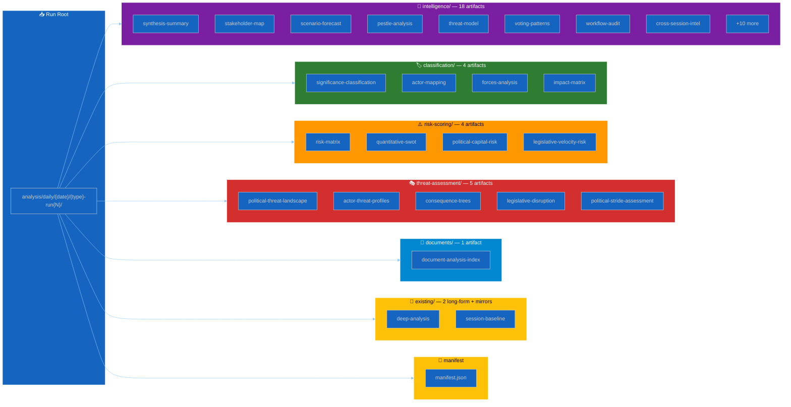

<!-- SPDX-FileCopyrightText: 2024-2026 Hack23 AB -->
<!-- SPDX-License-Identifier: Apache-2.0 -->

  

<h1 align="center">🗂️ Analysis Artifact Catalog</h1>

  <strong>📊 Master Map of Every Analysis Markdown File Produced by EU Parliament Monitor Workflows</strong> 
  <em>🎯 One Row per Artifact · Methodology + Template + Depth Floor + Mermaid Type</em>

  
  
  
  

**📋 Document Owner:** CEO | **📄 Version:** 1.0 | **📅 Last Updated:** 2026-04-21 (UTC)
**🔄 Review Cycle:** Quarterly | **⏰ Next Review:** 2026-06-30
**🏢 Owner:** Hack23 AB (Org.nr 5595347807) | **🏷️ Classification:** Public

---

## 🎯 Purpose

This catalog is the **single source of truth** for every markdown artifact an agentic workflow produces under `analysis/daily/{date}/{article-type}-run{N}/`. For every artifact it names:

- the **methodology** the AI agent applies when writing it,
- the **template** that defines its output shape,
- the **minimum line floor** enforced by `src/utils/validate-analysis-completeness.ts`,
- the **mandatory color-coded Mermaid diagram** type, and
- the **EP MCP data sources** feeding it.

Agents read this catalog once at the start of a run and treat it as the index into the rest of the methodology library.

---

## 🗺️ Artifact Groups

**Color legend (used consistently across all diagrams in the analysis library):**

| Color | Hex | Semantic Meaning |
|-------|-----|------------------|
| 🔵 Blue | `#1565C0` | Input / scope / primary pipeline |
| 🟣 Purple | `#7B1FA2` | Intelligence synthesis (highest cognitive layer) |
| 🟢 Green | `#2E7D32` | Classification / safe state / approved |
| 🟠 Orange | `#FF9800` | Risk / caution / elevated attention |
| 🔴 Red | `#D32F2F` | Threat / critical / rejected |
| 🟡 Yellow | `#FFC107` | Metadata / notes / pending |
| 🔷 Light-Blue | `#0288D1` | Documents / reference / read-only |

---

## 📐 Catalog Schema

Every row in the catalog below answers these six questions about one artifact:

| Column | Meaning |
|--------|---------|
| **Artifact** | Relative path under the run root (`{folder}/{file}.md`) |
| **Purpose (1 line)** | The single sentence of analytical value the file delivers |
| **Methodology** | The methodology document the AI reads to produce this artifact |
| **Template** | The template the file's shape is derived from |
| **Min lines (breaking)** | Depth floor for `breaking` article type (from [`reference-quality-thresholds.json`](reference-quality-thresholds.json)) |
| **Mermaid type** | Mandatory diagram shape (using the 7-color Hack23 palette above) |

---

## 🧠 `intelligence/` — 18 Artifacts

The analytical core. Every run produces these; longer-form article types require all 15, breaking news requires the full 15 too.

| Artifact | Purpose (1 line) | Methodology | Template | Min lines (breaking) | Mermaid type |
|---|---|---|---|:---:|---|
| `intelligence/analysis-index.md` | Read-me-first index naming every artifact in this run and the recommended reading order. | [per-artifact-methodologies.md §analysis-index](per-artifact-methodologies.md#analysis-index) | [synthesis-summary.md](../templates/synthesis-summary.md) | 160 | flowchart LR |
| `intelligence/synthesis-summary.md` | The run's intelligence executive summary — top findings, confidence, forward monitors. | [per-artifact-methodologies.md §synthesis-summary](per-artifact-methodologies.md#synthesis-summary) | [synthesis-summary.md](../templates/synthesis-summary.md) | 205 | mindmap + flowchart |
| `intelligence/stakeholder-map.md` | Power × Alignment map of ≥12 named stakeholders on the period's dominant issue. | [per-artifact-methodologies.md §stakeholder-map](per-artifact-methodologies.md#stakeholder-map) | [stakeholder-impact.md](../templates/stakeholder-impact.md) | 305 | quadrantChart |
| `intelligence/scenario-forecast.md` | ≥3 probability-weighted scenarios with early-warning indicators and trigger events. | [per-artifact-methodologies.md §scenario-forecast](per-artifact-methodologies.md#scenario-forecast) | [synthesis-summary.md §Forward Look](../templates/synthesis-summary.md) | 280 | flowchart TD (branching) |
| `intelligence/pestle-analysis.md` | Political / Economic / Social / Technological / Legal / Environmental scan of the period. | [per-artifact-methodologies.md §pestle-analysis](per-artifact-methodologies.md#pestle-analysis) | [risk-assessment.md](../templates/risk-assessment.md) | 250 | mindmap (6 branches) |
| `intelligence/threat-model.md` | Multi-framework (Diamond + Attack Trees + Kill Chain) view of the period's top threats. | [political-threat-framework.md](political-threat-framework.md) | [threat-analysis.md](../templates/threat-analysis.md) | 250 | graph TD (attack tree) |
| `intelligence/coalition-dynamics.md` | Group cohesion + cross-party alliance pairs on the period's named votes/positions. | [per-artifact-methodologies.md §coalition-dynamics](per-artifact-methodologies.md#coalition-dynamics) | [per-file-political-intelligence.md](../templates/per-file-political-intelligence.md) | 135 | graph LR (group pairs) |
| `intelligence/cross-run-diff.md` | Bayesian delta vs. the previous run for this article type (what changed, what upgraded). | [per-artifact-methodologies.md §cross-run-diff](per-artifact-methodologies.md#cross-run-diff) | [synthesis-summary.md](../templates/synthesis-summary.md) | 100 | flowchart LR (prior → evidence → posterior) |
| `intelligence/economic-context.md` | World Bank / IMF macro / fiscal / trade data anchored to the period's policy topics. | [per-artifact-methodologies.md §economic-context](per-artifact-methodologies.md#economic-context) + [worldbank-indicator-mapping.md](worldbank-indicator-mapping.md) + [imf-indicator-mapping.md](imf-indicator-mapping.md) | [risk-assessment.md](../templates/risk-assessment.md) | 185 | xyChart + flowchart |
| `intelligence/historical-baseline.md` | Every current score / metric anchored to the 30-day and 90-day comparable baseline. | [per-artifact-methodologies.md §historical-baseline](per-artifact-methodologies.md#historical-baseline) | [synthesis-summary.md](../templates/synthesis-summary.md) | 190 | timeline / xyChart |
| `intelligence/mcp-reliability-audit.md` | EP MCP endpoint-by-endpoint reliability record + upstream issues filed. | [per-artifact-methodologies.md §mcp-reliability-audit](per-artifact-methodologies.md#mcp-reliability-audit) | [per-file-political-intelligence.md](../templates/per-file-political-intelligence.md) | 385 | flowchart LR (endpoint status) |
| `intelligence/significance-scoring.md` | 5-dimension composite score per candidate item, with publish decision. | [political-classification-guide.md §significance](political-classification-guide.md) | [significance-scoring.md](../templates/significance-scoring.md) | 105 | pie + bar |
| `intelligence/political-threat-landscape.md` | Threat Landscape view of the period — 6 purpose-built dimensions for EP democracy. | [political-threat-framework.md §Landscape](political-threat-framework.md) | [threat-analysis.md](../templates/threat-analysis.md) | 90 | graph TD (landscape) |
| `intelligence/wildcards-blackswans.md` | Low-probability / high-impact reserve watchlist with trigger conditions. | [per-artifact-methodologies.md §wildcards-blackswans](per-artifact-methodologies.md#wildcards-blackswans) | [risk-assessment.md](../templates/risk-assessment.md) | 275 | quadrantChart (prob × impact) |
| `intelligence/reference-analysis-quality.md` | Self-score of this run against the reference benchmark + gaps + Pass-2 plan. | [per-artifact-methodologies.md §reference-analysis-quality](per-artifact-methodologies.md#reference-analysis-quality) | [per-file-political-intelligence.md](../templates/per-file-political-intelligence.md) | 190 | flowchart (pass1 → pass2) |
| `intelligence/voting-patterns.md` | Group-by-group bloc behaviour for the period: cohesion per group, observed coalitions, win-rate per bloc, outlier votes, forward-vote forecasts. | [per-artifact-methodologies.md §voting-patterns](per-artifact-methodologies.md#voting-patterns) | [voting-patterns.md](../templates/voting-patterns.md) | 150 | graph LR (group agreement network) |
| `intelligence/workflow-audit.md` | End-of-run self-audit — phases completed, MCP tools called, Core Principles compliance, time budget, issues and next-run recommendations. | [per-artifact-methodologies.md §workflow-audit](per-artifact-methodologies.md#workflow-audit) | [workflow-audit.md](../templates/workflow-audit.md) | 100 | flowchart LR (6-phase execution) |
| `intelligence/cross-session-intelligence.md` | Session-over-session narrative across plenary sessions within a period — crystallisation moment, momentum indicators, cross-session themes. | [per-artifact-methodologies.md §cross-session-intelligence](per-artifact-methodologies.md#cross-session-intelligence) | [cross-session-intelligence.md](../templates/cross-session-intelligence.md) | 220 (motions quarterly) / 150 (week- & month-in-review) | timeline + flowchart |

---

## 🏷️ `classification/` — 4 Artifacts

The fact layer. What kind of events are in this run, who acted, what forces are in play, what does each event impact?

| Artifact | Purpose (1 line) | Methodology | Template | Min lines (breaking) | Mermaid type |
|---|---|---|---|:---:|---|
| `classification/significance-classification.md` | 5-dimension significance rubric per event + publish / withhold decision. | [political-classification-guide.md](political-classification-guide.md) | [political-classification.md](../templates/political-classification.md) | 105 | pie (dimension weights) |
| `classification/actor-mapping.md` | Named actors (MEPs, groups, committees, Commission, Council) with influence weights. | [per-artifact-methodologies.md §actor-mapping](per-artifact-methodologies.md#actor-mapping) | [stakeholder-impact.md](../templates/stakeholder-impact.md) | *flat 30* | graph LR (actor network) |
| `classification/forces-analysis.md` | Driving forces vs. restraining forces on the period's dominant issue (Lewin). | [per-artifact-methodologies.md §forces-analysis](per-artifact-methodologies.md#forces-analysis) | [risk-assessment.md](../templates/risk-assessment.md) | *flat 30* | flowchart LR (force field) |
| `classification/impact-matrix.md` | Event × stakeholder × dimension matrix showing who is affected and how. | [per-artifact-methodologies.md §impact-matrix](per-artifact-methodologies.md#impact-matrix) | [stakeholder-impact.md](../templates/stakeholder-impact.md) | *flat 30* | heatmap (via table) |

---

## ⚠️ `risk-scoring/` — 4 Artifacts

The quantification layer. Every qualitative finding in `intelligence/` must be anchored here in numbers.

| Artifact | Purpose (1 line) | Methodology | Template | Min lines (breaking) | Mermaid type |
|---|---|---|---|:---:|---|
| `risk-scoring/risk-matrix.md` | 5×5 Likelihood × Impact with ≥5 named risks positioned + monitoring triggers. | [political-risk-methodology.md](political-risk-methodology.md) | [risk-assessment.md](../templates/risk-assessment.md) | 150 | quadrantChart (5×5) |
| `risk-scoring/quantitative-swot.md` | 3+3+3+3 SWOT with numeric scores + TOWS cross-quadrant strategies. | [political-swot-framework.md](political-swot-framework.md) | [swot-analysis.md](../templates/swot-analysis.md) | 140 | quadrantChart (SWOT) |
| `risk-scoring/political-capital-risk.md` | Rapporteur / chair / group-leader capital at stake per named position. | [per-artifact-methodologies.md §political-capital-risk](per-artifact-methodologies.md#political-capital-risk) | [risk-assessment.md](../templates/risk-assessment.md) | *flat 30* | graph LR (capital flow) |
| `risk-scoring/legislative-velocity-risk.md` | Pipeline throughput, stalled procedures, deadline exposure vs. term end. | [per-artifact-methodologies.md §legislative-velocity-risk](per-artifact-methodologies.md#legislative-velocity-risk) | [risk-assessment.md](../templates/risk-assessment.md) | *flat 30* | gantt (procedure timeline) |

---

## 🎭 `threat-assessment/` — 5 Artifacts

Produced for runs that emphasise democratic-threat or integrity-threat angles (typically `motions`, `propositions`, and long-form reviews). For runs that consolidate threat content into `intelligence/threat-model.md`, this folder may be empty.

| Artifact | Purpose (1 line) | Methodology | Template | Min lines (breaking) | Mermaid type |
|---|---|---|---|:---:|---|
| `threat-assessment/political-threat-landscape.md` | Threat Landscape view — 6 purpose-built dimensions (same content as the `intelligence/` twin, emphasised for threat-heavy runs). | [political-threat-framework.md §Landscape](political-threat-framework.md) | [threat-analysis.md](../templates/threat-analysis.md) | *flat 30* | graph TD |
| `threat-assessment/actor-threat-profiles.md` | Per-actor threat profile: intent, capability, opportunity, attack surface. | [political-threat-framework.md §Diamond](political-threat-framework.md) | [threat-analysis.md](../templates/threat-analysis.md) | *flat 30* | graph LR (actor × asset) |
| `threat-assessment/consequence-trees.md` | Consequence tree per threat: action → first-order → second-order → democratic outcome. | [per-artifact-methodologies.md §consequence-trees](per-artifact-methodologies.md#consequence-trees) | [threat-analysis.md](../templates/threat-analysis.md) | *flat 30* | graph TD (tree) |
| `threat-assessment/legislative-disruption.md` | How adversarial pressure could stall, redirect, or capture specific procedures. | [per-artifact-methodologies.md §legislative-disruption](per-artifact-methodologies.md#legislative-disruption) | [threat-analysis.md](../templates/threat-analysis.md) | *flat 30* | flowchart LR (procedure + disruptor) |
| `threat-assessment/political-stride-assessment.md` | STRIDE mapped onto political actors (Spoofing → identity manipulation, etc.). | [per-artifact-methodologies.md §political-stride-assessment](per-artifact-methodologies.md#political-stride-assessment) | [threat-analysis.md](../templates/threat-analysis.md) | *flat 30* | graph LR (STRIDE × actor) |

---

## 📄 `documents/` — 1 Artifact

| Artifact | Purpose (1 line) | Methodology | Template | Min lines (breaking) | Mermaid type |
|---|---|---|---|:---:|---|
| `documents/document-analysis-index.md` | One row per downloaded EP document with its per-file analysis path + status. | [per-artifact-methodologies.md §document-analysis-index](per-artifact-methodologies.md#document-analysis-index) | [per-file-political-intelligence.md](../templates/per-file-political-intelligence.md) | 95 | flowchart LR (feed → analysis) |

---

## 📜 `existing/` — Legacy Long-Form Layout (2 Artifacts + Mirrors)

Used by `motions`, `propositions`, and long-form quarter / month-in-review workflows when the content does not fit any of the 5 standard folders. Newer runs may place the same content under `intelligence/` — both locations are valid.

| Artifact | Purpose (1 line) | Methodology | Template | Min lines (motions) | Mermaid type |
|---|---|---|---|:---:|---|
| `existing/deep-analysis.md` | Long-form (4 000–10 000 word) Economist-style political intelligence prose — the 30-minute read. | [per-artifact-methodologies.md §deep-analysis](per-artifact-methodologies.md#deep-analysis) | [deep-analysis.md](../templates/deep-analysis.md) | 400 | ≥3 diagrams (structural thesis + coalition + forward trajectory) |
| `existing/session-baseline.md` | Structured calendar + adopted-texts roster for every plenary session in scope. | [per-artifact-methodologies.md §session-baseline](per-artifact-methodologies.md#session-baseline) | [session-baseline.md](../templates/session-baseline.md) | 200 | gantt (Strasbourg / Brussels timeline) |

**Mirror artifacts** — older `motions-*` runs also mirror `intelligence/coalition-dynamics.md`, `intelligence/stakeholder-impact.md`, and `intelligence/synthesis-summary.md` into `existing/` alongside the two artifacts above. Construction rules are identical to the `intelligence/` counterparts.

### Folder Variants

| Canonical folder | Historical variant | Treatment |
|------------------|--------------------|-----------|
| `risk-scoring/` | `risk/` | Both accepted. New runs **must** write to `risk-scoring/`. |
| `intelligence/` | `existing/` (for long-form + mirrors) | Both accepted. New runs may use either; `intelligence/` is preferred. |

---

## 📒 `manifest.json`

Machine-readable index of everything above. Generated by the workflow before PR creation. Every AI agent **must** append its artifact paths to `manifest.files.{group}[]` (`intelligence`, `classification`, `risk_scoring`, `threat_assessment`, `documents`, `existing`). The article-generation footer (`renderAnalysisTransparencySection`) reads this manifest to produce the Analysis Sources section in every published article. See [ai-driven-analysis-guide.md §Step 10](ai-driven-analysis-guide.md) for the exact schema.

---

## ✅ Read Order for Agents (Standard)

An agent starting a run reads this catalog, then proceeds through the 10-step protocol in [`ai-driven-analysis-guide.md`](ai-driven-analysis-guide.md). The canonical reading order is:

1. This catalog → know *what* to produce.
2. [`ai-driven-analysis-guide.md`](ai-driven-analysis-guide.md) → know *how* to produce it.
3. [`per-artifact-methodologies.md`](per-artifact-methodologies.md) → look up *per-artifact* construction rules as needed.
4. The five framework methodologies ([SWOT](political-swot-framework.md), [Risk](political-risk-methodology.md), [Threat](political-threat-framework.md), [Classification](political-classification-guide.md), [Style](political-style-guide.md)) → apply the relevant framework when the protocol step calls for it.
5. The thirteen templates under [`../templates/`](../templates/README.md) → copy the shape into the artifact file and fill it with analysis.

---

## 🔗 Related Documents

- [`ai-driven-analysis-guide.md`](ai-driven-analysis-guide.md) — 10-step analysis protocol (authoritative)
- [`per-artifact-methodologies.md`](per-artifact-methodologies.md) — one section per artifact type with construction rules
- [`reference-quality-thresholds.json`](reference-quality-thresholds.json) — machine-enforced per-artifact depth floors
- [`README.md`](README.md) — methodologies index
- [`../templates/README.md`](../templates/README.md) — templates index
- [`../README.md`](../README.md) — analysis directory overview

---

**Document Control:**
- **Path:** `/analysis/methodologies/artifact-catalog.md`
- **Classification:** Public
- **Version:** 1.0 — Initial extraction from Run 184 reference benchmark and 2026-04-20 / 2026-04-21 daily runs.
- **Next Review:** 2026-06-30
