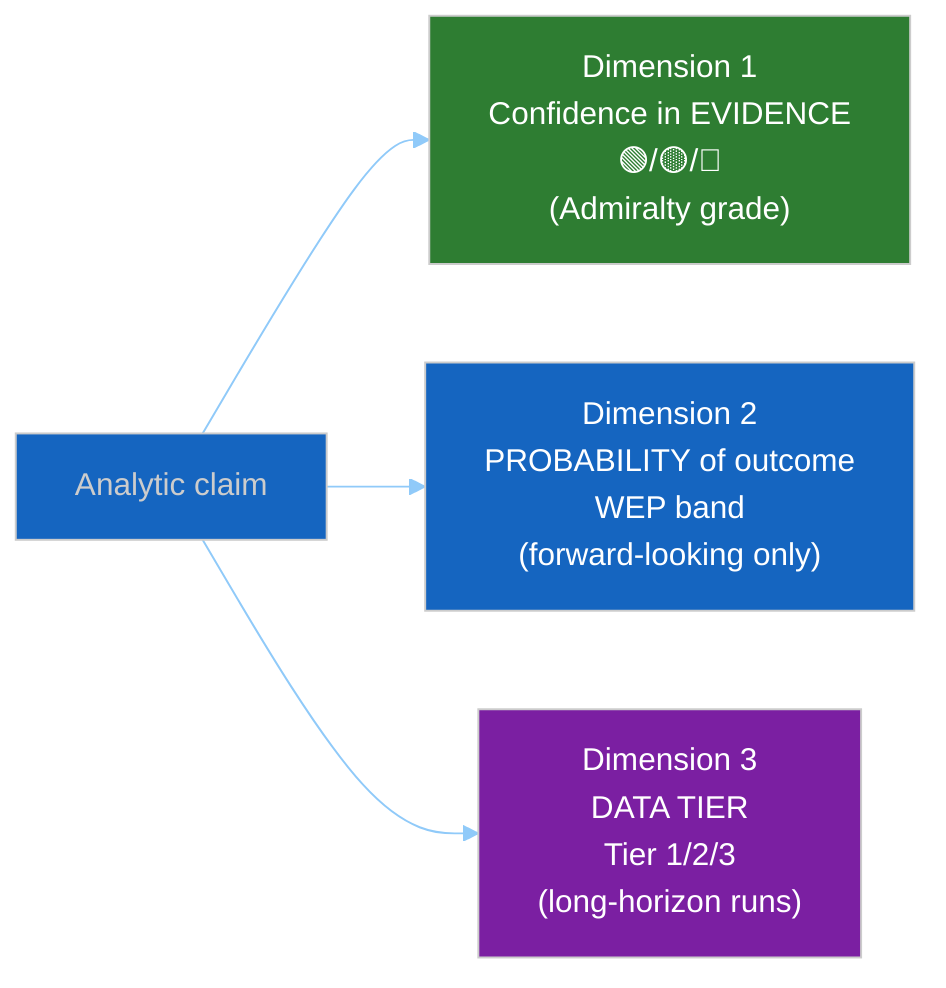

<!-- SPDX-FileCopyrightText: 2024-2026 Hack23 AB -->
<!-- SPDX-License-Identifier: Apache-2.0 -->

<p align="center">
  
</p>

<h1 align="center">🎯 Confidence Calibration Framework</h1>

<p align="center">
  <strong>📊 Canonical Unified Table: 🟢/🟡/🔴 Markers · WEP Bands · Admiralty Grades</strong><br>
  <em>🎯 One Table to Rule All Confidence Labels — Forward-Looking vs. Evidence-Grounded Claims</em>
</p>

<p align="center">
  <a href="#"></a>
  <a href="#"></a>
  <a href="#"></a>
  <a href="#"></a>
</p>

**📋 Document Owner:** CEO | **📄 Version:** 1.0 | **📅 Last Updated:** 2026-05-14 (UTC)
**🔄 Review Cycle:** Quarterly | **⏰ Next Review:** 2026-08-14
**🏢 Owner:** Hack23 AB (Org.nr 5595347807) | **🏷️ Classification:** Public

---

## 🎯 Purpose

This document canonicalises all confidence-labelling schemes used across the EU Parliament Monitor analysis library into a **single unified reference**. It resolves the drift between three schemes that have appeared independently in different runs:

| Observed scheme | Where found | Canonical mapping |
|----------------|-------------|------------------|
| 🟢/🟡/🔴 tier markers | All artifacts | **This document — § Tier markers** |
| WEP probability bands | Forward-looking claims | **This document — § WEP integration** |
| Admiralty A–F × 1–6 grades | Source citations | [`osint-tradecraft-standards.md §2`](osint-tradecraft-standards.md) |
| Tier-1/2/3 data tiers | Year-ahead / long-horizon runs | **This document — § Tier-1/2/3 alignment** |
| Election-cycle WEP bands + Admiralty pairs | Electoral artifacts | **This document — § Electoral domain** |

After reading this document, **all agents must use only the canonical forms** defined here. Earlier ad-hoc variants in historical artifacts are noted for backward compatibility only.

---

## 🛡️ ISMS Policy Alignment

| Policy | Relevance |
|---|---|
| [Hack23 AI_Policy](https://github.com/Hack23/ISMS-PUBLIC/blob/main/AI_Policy.md) §1 | Objectivity and explained uncertainties — confidence labels are the mechanism |
| [Information Security Policy](https://github.com/Hack23/ISMS-PUBLIC/blob/main/Information_Security_Policy.md) §6 | Evidence handling — confidence-in-evidence tracked separately from probability |
| [Secure Development Policy](https://github.com/Hack23/ISMS-PUBLIC/blob/main/Secure_Development_Policy.md) | Structured analytic discipline is the equivalent of SDLC quality gates |

---

## 1️⃣ The Three Confidence Dimensions

Every analytic claim has up to **three independent confidence dimensions**. They must be kept separate and never merged into a single score.



| Dimension | What it expresses | Applies to | Notation |
|-----------|------------------|-----------|---------|
| **Confidence in evidence** | How strongly the underlying sources support the claim | Every claim | 🟢/🟡/🔴 marker + Admiralty grade |
| **Probability of outcome** | How likely a forward-looking event is to occur | Forward-looking claims only | WEP band (Almost Certain → Almost No Chance) |
| **Data tier** | The freshness and completeness of the data available this run | Long-horizon, electoral, and degraded-mode runs | Tier 1/2/3 label |

> **Anti-pattern to avoid:** Writing "🟡 MEDIUM confidence that the vote will pass with 55–80% probability" conflates evidence confidence (🟡) with probability (WEP band). The correct form is: "**Likely** (55–80 %) [WEP band] that the vote passes [get_voting_records, A1]. Confidence in evidence: 🟢 HIGH."

---

## 2️⃣ Dimension 1 — Confidence in Evidence (🟢/🟡/🔴)

### 2.1 Canonical Definition

The 🟢/🟡/🔴 markers express **confidence in the underlying evidence** — whether the sources are reliable and the information credible enough to support the claim. They are derived directly from the Admiralty 6×6 matrix in [`osint-tradecraft-standards.md §2.3`](osint-tradecraft-standards.md).

| Marker | Label | Admiralty combinations | Meaning |
|--------|-------|----------------------|---------|
| 🟢 | **HIGH** | A1, A2, A3, B1, B2, C1 | Primary-source or tightly corroborated evidence; fit to support headline judgements |
| 🟡 | **MEDIUM** | A4, A6, B3, B4, B6, C2, C3, D1, D2, F1, F2 | Indicative but not conclusive; must be flanked by ≥1 other piece of evidence before supporting a headline judgement |
| 🔴 | **LOW** | A5, B5, C4, C5, C6, D3–D6, E1–E6, F3–F6 | Noted but never carries a top-level judgement on its own; appears only in caveats, limitations, or monitoring sections |

### 2.2 When to Use Each Marker

**🟢 HIGH** — use when:
- The claim cites a direct EP MCP record (procedure ID, adopted-text ID, RCV reference).
- Two independent A/B-grade sources corroborate the same fact.
- The claim is a formal institutional fact (seat count, treaty majority threshold, committee mandate).

**🟡 MEDIUM** — use when:
- Only one A-grade source is available without corroboration.
- The EP MCP feed returned degraded/partial data (see [`source-triangulation.md`](source-triangulation.md) Steps 2–3).
- The claim is structural inference from well-established EP patterns (Step 3 triangulation).
- Voter/opinion data is based on Eurobarometer proxy rather than current-cycle polling.

**🔴 LOW** — use when:
- The claim relies solely on KB integration / institutional-framework analysis (Step 4 triangulation).
- All primary EP MCP feeds failed and no cross-source triangulation is available.
- The claim is a tail-risk or wildcard scenario assessment without supporting roll-call data.
- Electoral projections more than 18 months from the next election.

### 2.3 Prohibited Inflation

The following upgrades are **explicitly prohibited**:

| Prohibited upgrade | Correct action |
|-------------------|----------------|
| Upgrading 🔴 to 🟡 because the analyst "feels confident" | Keep 🔴 and disclose the limitation |
| Omitting the marker because it would be 🔴 | Include 🔴 with explicit caveat |
| Using 🟢 for a claim derived from a single C-grade source | Use 🟡 C2 or 🔴 C3+ |
| Using 🟢 for IMF training-data fallback | Use 🟡 (training-data vintage is at best B2/B3) |

---

## 3️⃣ Dimension 2 — Probability of Outcome (WEP Bands)

### 3.1 Canonical WEP Bands

The WEP bands are defined in [`osint-tradecraft-standards.md §3`](osint-tradecraft-standards.md). The canonical form reproduced here for reference:

| Band | Phrase | Numeric range | When to use |
|:---:|--------|:------------:|-------------|
| **1** | Almost no chance / remote | 1–5 % | Tail risk; PfE–EPP joint report on Rule-of-Law |
| **2** | Very unlikely / highly improbable | 5–20 % | Grand-Coalition rupture before 2026 mid-term |
| **3** | Unlikely / improbable | 20–45 % | Unilateral Council blocking |
| **4** | Roughly even chance | 45–55 % | ECR whip decision on migration |
| **5** | Likely / probable | 55–80 % | EPP–Renew compromise survives first reading |
| **6** | Very likely / highly probable | 80–95 % | Budget discharge on first vote |
| **7** | Almost certain / nearly certain | 95–99 % | Interinstitutional agreement signature |

### 3.2 WEP and Evidence-Confidence Are Independent

The table below illustrates that a claim can have any combination of WEP band and evidence confidence:

| WEP band | Evidence confidence | Canonical form | Meaning |
|----------|---------------------|---------------|---------|
| Likely (55–80 %) | 🟢 HIGH | `[A1] Likely (55–80 %)` | Strong evidence; claim is probably true |
| Likely (55–80 %) | 🟡 MEDIUM | `[B3] Likely (55–80 %)` | Weak evidence but structural inference supports |
| Almost certain (95–99 %) | 🔴 LOW | `[F6] Almost certain (95–99 %)` | Institutional convention; no primary data this run |
| Very unlikely (5–20 %) | 🟢 HIGH | `[A1] Very unlikely (5–20 %)` | Strong evidence that outcome is unlikely |

### 3.3 Canonical Notation Form

Every forward-looking claim must follow this exact form:

> *"[WEP phrase] ([numeric %]) [Admiralty grade]. Confidence in evidence: [🟢/🟡/🔴] [level]."*

**Example:**
> *"A Grand-Coalition majority on the migration-pact amendments is **likely** (55–80 %) [get_voting_records + historical-baseline, A1]. Confidence in evidence: 🟢 HIGH."*

### 3.4 Time Horizon Requirement

Every WEP-banded claim names an explicit horizon (see [`osint-tradecraft-standards.md §3.4`](osint-tradecraft-standards.md)):

| Horizon | Window | Example |
|---------|--------|---------|
| **Tactical** | 0–7 days | "…before the May plenary (WEP: **likely**, A1, tactical)" |
| **Operational** | 7–90 days | "…within this session (WEP: **likely**, A2, operational)" |
| **Strategic** | 90 days – 18 months | "…within this term (WEP: **possible**, B3, strategic)" |
| **Structural** | 18+ months | "…across multiple terms (WEP: **unlikely**, C3, structural)" |

---

## 4️⃣ Dimension 3 — Data Tier (Long-Horizon Runs)

Long-horizon article types (`year-ahead`, `term-outlook`, `election-cycle`) use a **three-tier data classification** to convey how fresh and primary the underlying data is. The tier is an input to confidence selection, not a replacement for it.

### 4.1 Tier Definitions

| Tier | Label | Meaning | Maps to confidence |
|:----:|-------|---------|-------------------|
| **Tier 1** | Primary/current data | EP MCP data fetched this run (< 7 days old); IMF SDMX live response; Eurostat live query | Eligible for 🟢 HIGH (subject to Admiralty grade) |
| **Tier 2** | Recent secondary data | Data 7–90 days old; feed data with FRESHNESS_FALLBACK; IMF training-data vintage (recent) | Maximum 🟡 MEDIUM |
| **Tier 3** | Structural / historical data | Data > 90 days old; prior-term datasets; academic historical series; KB-only institutional facts | Maximum 🔴 LOW unless the claim is a formal institutional fact (e.g. seat counts, RoP majorities) |

### 4.2 Tier Label in Artifacts

Long-horizon artifacts add a `Data tier: [Tier N]` tag in the artifact header and in each major section where the tier changes. Example:

```markdown
## 3. Forecast: 2027–2029 Coalition Landscape

> **Data tier:** Tier 2 (Eurobarometer Q4 2025 + EP10 historical RCV patterns)
> **Max confidence:** 🟡 MEDIUM
```

### 4.3 Tier Reduction Factors

The `reference-quality-thresholds.json` schema already applies line-floor reduction factors for degraded modes. The tier system maps to these factors:

| Mode in manifest.json | Tier alignment | Floor reduction |
|----------------------|---------------|----------------|
| `full` | All Tier 1 | 1.0× |
| `title-only` | Tier 2 (partial) | 0.75× |
| `degraded-imf` | Tier 2 (economic) | 0.85× |
| `degraded-voting` | Tier 2 (coalition) | 0.85× |
| `minimal` | Tier 3 dominant | 0.65× |

---

## 5️⃣ Electoral Domain Alignment

Electoral artifacts (`election-cycle`, `seat-projection`, `voter-segmentation`) use a **combined WEP + Admiralty form** that pairs electoral probability with source grade. The canonical form:

> *"EPP seat share at EP2029: [WEP band] to hold [N–M seats] ([%] of total). Source: [Eurobarometer Q4 2025, B2] + [EP2024 election turnout by MS, A1]. Confidence: 🟡 MEDIUM."*

The following anti-patterns are specifically forbidden in electoral artifacts:

| Anti-pattern | Correction |
|-------------|------------|
| "Predicted 192 EPP seats (HIGH confidence)" without WEP + Admiralty | Add WEP band + source grade |
| "WEP: likely — EPP gains seats" without evidence basis | State evidence basis and Admiralty grade |
| Mixing 🔴 LOW confidence Tier-3 structural forecasts with 🟢 HIGH headline | Separate claims by tier; use 🟡 MEDIUM ceiling |

---

## 6️⃣ Worked Examples

### 6.1 — Evidence-based political judgement (standard form)

> **Claim:** EPP group cohesion on the Banking Union vote was strong.
> **Evidence:** `get_voting_records` returned RCV-2026-0412 showing 181/188 EPP MEPs voted in line with group position.
> **Admiralty:** A1 (direct plenary record, single EP source, uncontested).
> **Confidence in evidence:** 🟢 HIGH.
> **No WEP needed** — this is a retrospective fact, not a forward probability.

**Canonical form:** *"EPP group cohesion on Banking Union was 96.3 % (181/188 MEPs) [get_voting_records, RCV-2026-0412, A1]. Confidence: 🟢 HIGH."*

### 6.2 — Forward-looking claim on coalition behaviour

> **Claim:** The Grand Coalition is likely to hold together on the upcoming AI-Act vote.
> **Evidence:** `analyze_coalition_dynamics` + `historical-baseline` (EPP–S&D–Renew agreement rate 84 % over trailing 30 days, A2).
> **WEP:** Likely (55–80 %) — tactical horizon (next 14 days).
> **Confidence in evidence:** 🟢 HIGH.

**Canonical form:** *"The Grand Coalition on AI-Act is **likely** to hold (55–80 %, tactical) [analyze_coalition_dynamics + historical-baseline, A2]. Confidence in evidence: 🟢 HIGH."*

### 6.3 — Degraded-data claim (Step 3 triangulation)

> **Claim:** PfE group cohesion is structurally low due to national-party heterogeneity.
> **Evidence:** EP MCP roll-call feed unavailable; inference from Hooghe/Marks EU-attitudes literature (C2) + ECR/PfE historical voting patterns from prior-term data (B3).
> **Triangulation step:** 3 (structural inference).
> **Confidence in evidence:** 🟡 MEDIUM (Step 3 ceiling).

**Canonical form:** *"PfE group cohesion is structurally low [TRIANGULATION-STEP: 3 — structural inference from Hooghe/Marks (C2) + prior-term patterns (B3)]. Confidence: 🟡 MEDIUM."*

### 6.4 — Long-horizon electoral forecast

> **Claim:** EPP is likely to retain the largest group share at EP2029.
> **Evidence:** Eurobarometer Q4 2025 (B2) + EP10 seat distribution (A1) + structural incumbency advantage literature (C3).
> **Tier:** Tier 2 (secondary data).
> **WEP:** Likely (55–80 %) — structural horizon.
> **Confidence in evidence:** 🟡 MEDIUM (Tier 2 ceiling).

**Canonical form:** *"EPP is **likely** (55–80 %, structural) to retain the largest group at EP2029 [Eurobarometer Q4 2025 B2 + EP10 seat distribution A1]. Data tier: 2. Confidence: 🟡 MEDIUM."*

---

## 📋 Quick-Reference Checklist

- [ ] **Three dimensions separate:** Evidence confidence, probability (WEP), and data tier are never merged.
- [ ] **Canonical notation:** Every forward-looking claim uses `[WEP phrase] ([%]) [Admiralty grade]. Confidence: [🟢/🟡/🔴]`.
- [ ] **Time horizon present:** Every WEP claim includes tactical/operational/strategic/structural horizon.
- [ ] **No inflation:** 🟢 never used for Step-3/4 triangulation claims; IMF training-data is 🟡 maximum.
- [ ] **Electoral domain:** WEP + Admiralty pair used in all electoral artifact probability claims.
- [ ] **Tier label in long-horizon artifacts:** `Data tier: [N]` in every major section of year-ahead, term-outlook, election-cycle artifacts.

---

## 🔗 Related Documents

- [`osint-tradecraft-standards.md`](osint-tradecraft-standards.md) — Admiralty grading rules (§2), WEP band definitions (§3)
- [`source-triangulation.md`](source-triangulation.md) — 4-step fallback ladder that determines maximum confidence
- [`voter-segmentation-methodology.md`](voter-segmentation-methodology.md) — Confidence rules for electoral/voter-segmentation artifacts
- [`ai-driven-analysis-guide.md §Step 6`](ai-driven-analysis-guide.md) — where confidence calibration is applied in the protocol
- [`per-artifact-methodologies.md`](per-artifact-methodologies.md) — per-artifact confidence requirements

---

**Document Control:**
- **Path:** `analysis/methodologies/confidence-calibration.md`
- **Classification:** Public
- **Version:** 1.0 — Initial unified table resolving 🟢/🟡/🔴 + WEP + Admiralty + Tier-1/2/3 drift observed across 2026-05-14 run set reflections.
- **ISMS Reference:** Hack23/ISMS-PUBLIC AI Policy §1 (Objectivity and explained uncertainties)
