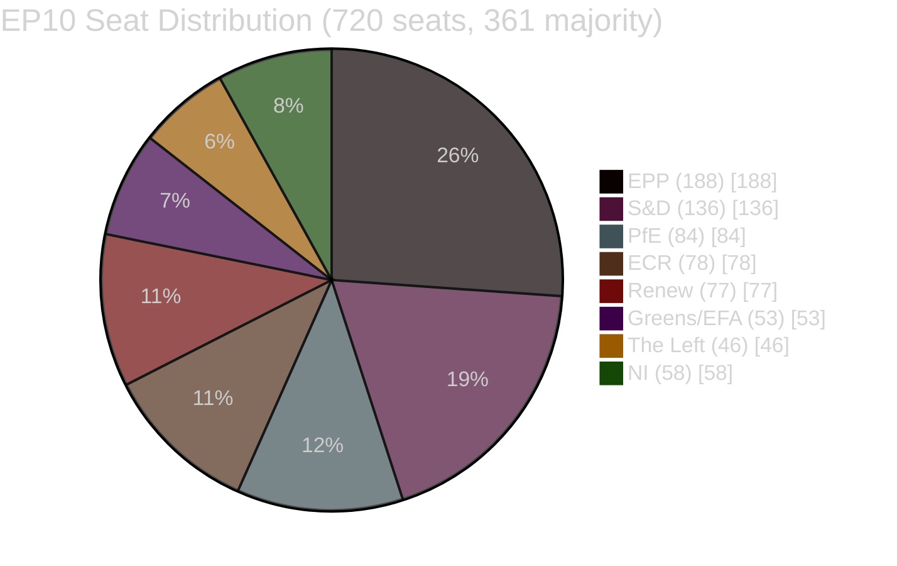
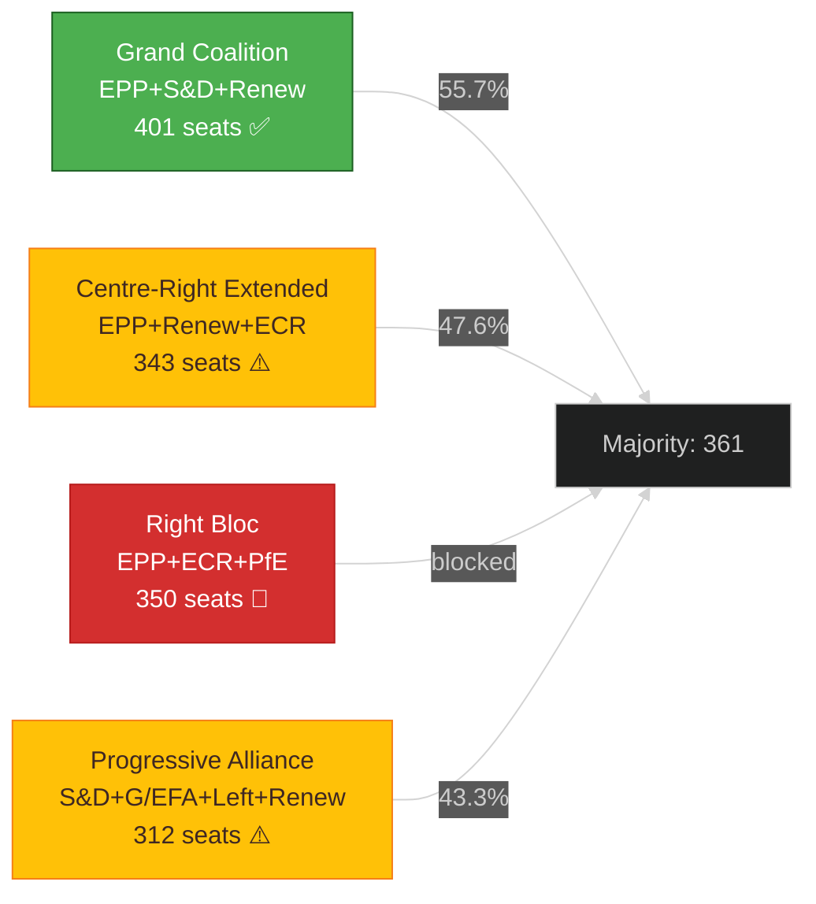
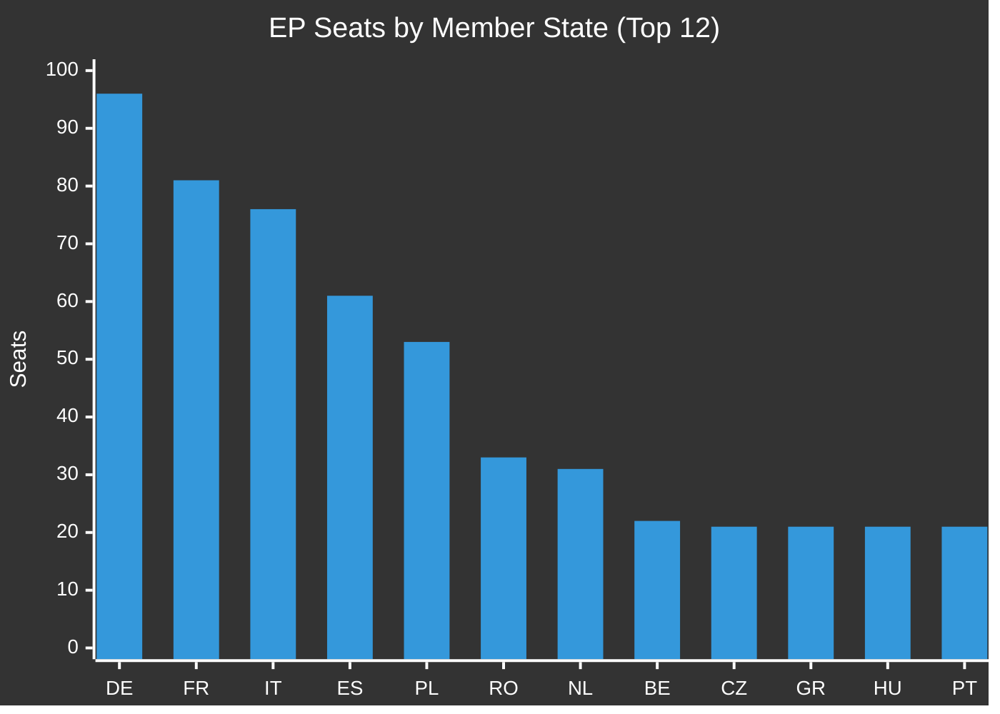
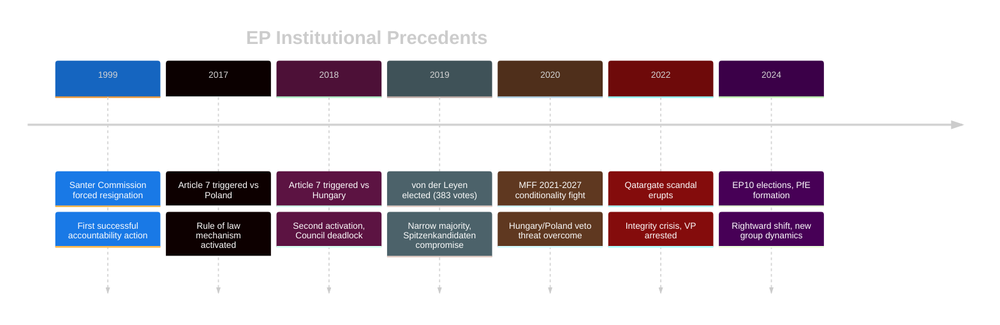
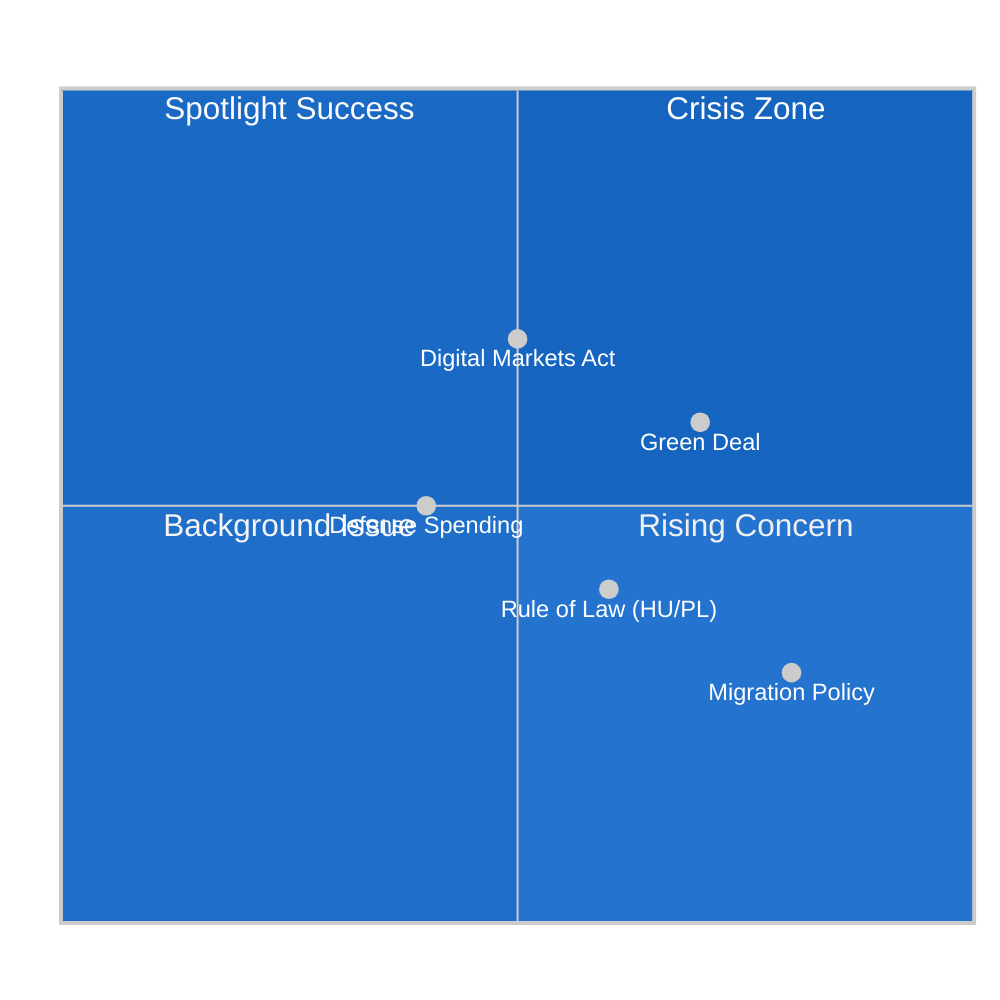
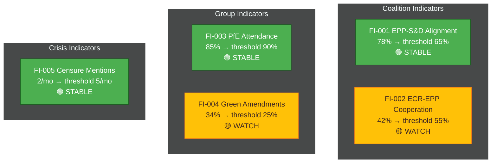

<!-- SPDX-FileCopyrightText: 2024-2026 Hack23 AB -->
<!-- SPDX-License-Identifier: Apache-2.0 -->

<p align="center">
  
</p>

<h1 align="center">🗳️ Electoral Domain Methodology</h1>

<p align="center">
  <strong>📊 Family D — European Parliament Electoral Analysis (2024 Retrospective · 2029 Forecast)</strong><br>
  <em>🎯 Voter Segmentation · Coalition Mathematics · Historical Parallels · Media Framing · Implementation Feasibility · Forward Indicators</em>
</p>

<p align="center">
  <a href="#"></a>
  <a href="#"></a>
  <a href="#"></a>
  <a href="#"></a>
</p>

**📋 Document Owner:** CEO | **📄 Version:** 1.0 | **📅 Last Updated:** 2026-04-21 (UTC)
**🔄 Review Cycle:** Quarterly | **⏰ Next Review:** 2026-07-21
**🏢 Owner:** Hack23 AB (Org.nr 5595347807) | **🏷️ Classification:** Public

---

## 🔄 Tradecraft Anchors

| Element | Value | Reference |
|---------|-------|-----------|
| **F3EAD Stage** | **ANALYZE** — electoral domain applies deep political analysis | Domain-specific lens for electoral and coalition dynamics |
| **PIRs Served** | Electoral-related PIRs: coalition formation, voting trends, seat projections, policy mandate signals | See [`political-style-guide.md` §PIR/EEI](political-style-guide.md#-priority-intelligence-requirements-pir--essential-elements-of-information-eei) |
| **Admiralty Floor** | Electoral data: EP official results = A1; Eurobarometer = A2; National polls = B2; Exit polls = C2 | See [`political-style-guide.md` §Admiralty](political-style-guide.md#-admiralty-source-reliability-code-nato-stanag-2022) |
| **WEP Requirement** | All electoral forecasts use WEP bands with explicit time horizons | See [`political-style-guide.md` §WEP + ODNI](political-style-guide.md#-words-of-estimative-probability-wep--odni-confidence-overlay) |
| **ICD 203 Gate** | Standard 3 (judgments vs assumptions), Standard 4 (alternative analysis), Standard 7 (explain changes) | See [`political-style-guide.md` §ICD 203](political-style-guide.md#-icd-203-analytic-tradecraft-standards-mapping) |
| **SAT(s)** | Morphological Analysis, Outside-In Thinking, Indicators & Warnings, Pre-Mortem Analysis | See [`political-style-guide.md` §SATs](political-style-guide.md#-structured-analytic-techniques-sats-catalog) |

---

## 🎯 Purpose

Family D provides **domain-specific analytical depth** for European Parliament electoral dynamics. While Family C offers generic strategic extensions, Family D applies the **electoral lens** — understanding how EP composition shapes policy outcomes and how policy outcomes shape future EP composition.

### EP10 Term Context (2024-2029)

The 10th European Parliament term (EP10) began following the June 2024 elections. Key parameters:

| Parameter | EP10 Value | EP9 Comparison |
|-----------|------------|----------------|
| **Total Seats** | 720 | 705 (+15) |
| **Majority Threshold** | 361 | 353 |
| **Member States** | 27 | 27 (post-Brexit) |
| **Election Date** | 6-9 June 2024 | 23-26 May 2019 |
| **Next Election** | June 2029 | — |

### EP10 Political Group Composition (as of 2026)



| Political Group | Seats | Share | Coalition Role |
|-----------------|-------|-------|----------------|
| **EPP** (European People's Party) | 188 | 26.1% | Dominant centre-right, Commission President party |
| **S&D** (Socialists & Democrats) | 136 | 18.9% | Grand coalition partner, social policy anchor |
| **PfE** (Patriots for Europe) | 84 | 11.7% | Right-wing sovereignists, corridor non grata |
| **ECR** (European Conservatives) | 78 | 10.8% | Right flank, selective EPP ally |
| **Renew** (Renew Europe) | 77 | 10.7% | Liberal centre, coalition kingmaker |
| **Greens/EFA** | 53 | 7.4% | Green transition champions, reduced from EP9 |
| **The Left** (GUE/NGL) | 46 | 6.4% | Left opposition, anti-austerity bloc |
| **NI** (Non-Inscrits) | 58 | 8.1% | Unaligned, includes AfD delegation |

---

## 📊 Part 1 — Coalition Mathematics (`coalition-mathematics.md`)

### Purpose

Model **majority-building arithmetic** for the current EP composition. Every significant vote requires 361+ seats — this artifact maps which coalitions can reach that threshold and what their policy implications are.

### EP MCP Tools

- `analyze_coalition_dynamics` — group cohesion and cross-party alliances
- `compare_political_groups` — voting discipline, legislative output
- `get_voting_records` — historical vote distributions
- `detect_voting_anomalies` — coalition stress signals

### Coalition Scenarios

#### Grand Coalition (EPP + S&D + Renew)

```
188 + 136 + 77 = 401 seats (55.7%)
```

| Factor | Assessment |
|--------|------------|
| **Reliability** | HIGH — default governing formula |
| **Policy breadth** | Wide compromise zone on centrist positions |
| **Stress points** | Social policy (S&D ↔ EPP), trade policy (Renew ↔ S&D) |
| **Historical precedent** | EP9 baseline, Spitzenkandidaten coordination |

#### Centre-Right Extended (EPP + Renew + ECR)

```
188 + 77 + 78 = 343 seats (47.6%) — BELOW MAJORITY
```

Requires selective Greens/EFA or S&D defections (18+ seats).

#### Right Bloc (EPP + ECR + PfE)

```
188 + 78 + 84 = 350 seats (48.6%) — BELOW MAJORITY
```

**Cordon sanitaire** against PfE makes this coalition politically toxic for EPP. Not viable for major legislation but may emerge on migration votes.

#### Progressive Alliance (S&D + Greens/EFA + The Left + Renew)

```
136 + 53 + 46 + 77 = 312 seats (43.3%) — BELOW MAJORITY
```

Requires EPP defections (49+ seats). Viable only on specific environmental votes.

### Required Mermaid — Coalition Feasibility



### Quality Gate

- [ ] All 8 political groups included in analysis
- [ ] Coalition arithmetic verified (seats sum correctly)
- [ ] Policy stress points identified per coalition
- [ ] Historical precedent cited for viable coalitions
- [ ] Cordon sanitaire constraints documented

---

## 🗳️ Part 2 — Voter Segmentation (`voter-segmentation.md`)

### Purpose

Analyze the **27-member-state electorate** that produces the EP composition. Essential for understanding mandate origins and forecasting EP11 (2029) dynamics.

### EP MCP Tools

- `analyze_country_delegation` — per-country MEP analysis
- `get_meps` — filtered by country and political group
- IMF MCP tools (primary economic — Wave-3) + World Bank MCP tools (non-economic demographic and social indicators)

### Segmentation Dimensions

#### Geographic — MS Regional Blocs

| Bloc | Member States | EP Seats | Dominant Groups |
|------|---------------|----------|-----------------|
| **Western Core** | DE, FR, NL, BE, LU, AT | 243 | EPP, S&D, Renew |
| **Southern** | IT, ES, PT, GR, MT, CY | 168 | S&D, EPP, ECR |
| **Nordic** | SE, DK, FI | 46 | S&D, Renew, Greens |
| **Central European** | PL, CZ, SK, HU, SI, HR | 111 | EPP, ECR, PfE |
| **Baltic** | EE, LV, LT | 23 | EPP, Renew, ECR |
| **Balkan/New** | RO, BG | 56 | EPP, S&D |
| **Island** | IE | 14 | EPP, Renew, The Left |

#### Demographic — Voter Cohorts

| Cohort | % of EU Electorate | Turnout 2024 | Policy Priorities |
|--------|-------------------|--------------|-------------------|
| 18-24 | 8% | 42% | Climate, digital rights, housing |
| 25-39 | 22% | 48% | Economy, housing, family policy |
| 40-54 | 24% | 55% | Healthcare, economy, security |
| 55-69 | 26% | 62% | Pensions, healthcare, immigration |
| 70+ | 20% | 58% | Pensions, security, tradition |

### Required Mermaid — MS Seat Distribution



### Quality Gate

- [ ] All 27 MS included
- [ ] Regional bloc analysis with seat counts
- [ ] Demographic cohort analysis with turnout data
- [ ] Policy priority mapping per segment
- [ ] 2024 vs 2019 shift analysis

---

## 📜 Part 3 — Historical Parallels (`historical-parallels.md`)

### Purpose

Apply **historical precedent** to current EP dynamics. Identify patterns from previous parliamentary terms, institutional crises, and political realignments.

### EP Historical Reference Points

| Event | Date | Relevance to EP10 |
|-------|------|-------------------|
| **Santer Commission Resignation** | 1999-03-16 | Commission accountability precedent — fraud scandal forced resignation |
| **Article 7 TEU Proceedings** | 2018 (HU), 2017 (PL) | Rule of law mechanisms — EP triggers, Council stalls |
| **Brexit Negotiations** | 2017-2020 | EP veto power demonstration, Withdrawal Agreement ratification |
| **MFF 2021-2027 Fight** | 2020 | Budget leverage, Hungary/Poland conditionality |
| **Ursula von der Leyen Election** | 2019-07-16 | Narrow majority (383/747 = 51.3%), Spitzenkandidaten compromise |
| **Qatargate Scandal** | 2022-12 | Integrity crisis, EP Vice-President arrest |
| **Green Deal Industrial Plan** | 2023 | Policy pivot under external pressure (IRA response) |

### Parallel Structure — Per Event

For each historical parallel:

1. **Event summary** — what happened (≤80 words)
2. **Institutional context** — which EP term, political composition
3. **Coalition dynamics** — who supported/opposed
4. **Outcome** — immediate and long-term consequences
5. **Current applicability** — specific parallel to EP10 situation
6. **Causal mechanism** — why this parallel is instructive

### Required Mermaid — Historical Timeline



### Quality Gate

- [ ] ≥6 historical precedents documented
- [ ] Each precedent has all 6 structure elements
- [ ] Causal mechanisms explained, not just narrative
- [ ] Current applicability explicitly stated
- [ ] Timeline Mermaid included

---

## 📰 Part 4 — Media Framing Analysis (`media-framing-analysis.md`)

### Purpose

Analyze how **media coverage** shapes and reflects EP political dynamics. Critical for understanding public perception, agenda-setting, and political pressure vectors.

### EP MCP Tools

- `get_speeches` — plenary debate content
- `get_parliamentary_questions` — scrutiny topics
- `get_adopted_texts` — resolution titles and recitals (framing signals)

### External Sources (Admiralty B2-C2)

| Source Category | Examples | Source Grade |
|-----------------|----------|--------------|
| **Brussels Bureau** | Politico EU, EUobserver, Euractiv | B2 |
| **Wire Services** | AFP, Reuters, AP Brussels | B2 |
| **National Quality Press** | FAZ, Le Monde, Corriere, El País | C2 |
| **Trade Press** | MLex, PaRR, Global Competition Review | B2 |

### Framing Dimensions

| Dimension | Question | Analysis Method |
|-----------|----------|-----------------|
| **Salience** | How prominent is the issue? | Article count, headline placement |
| **Attribution** | Who is blamed/credited? | Actor prominence, quote frequency |
| **Tone** | Positive/negative/neutral? | Sentiment analysis of coverage |
| **Frame Type** | Conflict? Human interest? Economic consequence? | Frame categorization |
| **Actor Voice** | Who speaks in coverage? | Quote attribution analysis |

### Required Mermaid — Framing Map



### Quality Gate

- [ ] ≥5 media sources categorized with Admiralty grades
- [ ] All 5 framing dimensions analyzed
- [ ] Framing map quadrantChart included
- [ ] Actor voice distribution quantified
- [ ] EU vs national media perspective comparison

---

## 🔧 Part 5 — Implementation Feasibility (`implementation-feasibility.md`)

### Purpose

Assess whether EP legislative outputs are **practically implementable** — considering member state capacity, institutional constraints, and political will.

### Implementation Dimensions

| Dimension | Assessment Criteria |
|-----------|-------------------|
| **Legal Base** | Treaty basis, subsidiarity, proportionality |
| **MS Capacity** | Administrative resources, transposition history |
| **Political Will** | Council configuration, national government priorities |
| **Resource Requirements** | Budget allocation, staff needs, IT systems |
| **Timeline Realism** | Transposition deadlines vs complexity |
| **Enforcement Mechanism** | Commission powers, ECJ jurisdiction |

### EP MCP Tools

- `track_legislation` — procedure status and timeline
- `monitor_legislative_pipeline` — bottleneck detection
- `get_external_documents` — Commission impact assessments
- `get_adopted_texts` — final legislative text

### Implementation Risk Matrix

| Risk Factor | LOW | MEDIUM | HIGH |
|-------------|-----|--------|------|
| **MS Opposition** | <5 MS | 5-10 MS | >10 MS |
| **Budget Gap** | <€100M | €100M-1B | >€1B |
| **Complexity** | <50 pages | 50-200 pages | >200 pages |
| **Timeline** | >24 months | 12-24 months | <12 months |
| **Precedent** | Similar laws implemented | Mixed record | Novel mechanism |

### Required Mermaid — Implementation Pipeline


### Quality Gate

- [ ] All 6 implementation dimensions assessed
- [ ] Risk matrix populated with evidence
- [ ] MS capacity analysis included (per major MS)
- [ ] Budget requirements quantified
- [ ] Enforcement mechanism documented

---

## 📈 Part 6 — Forward Indicators (`forward-indicators.md`)

### Purpose

Define **observable leading indicators** that will signal EP10 trajectory changes. Essential for early warning and scenario validation.

### Indicator Categories

| Category | Indicator Type | Monitoring Source |
|----------|----------------|-------------------|
| **Political** | Group cohesion votes, defection rates | `detect_voting_anomalies`, `analyze_voting_patterns` |
| **Institutional** | Commission votes, EP President statements | `get_adopted_texts`, `get_speeches` |
| **Electoral** | National polls, EP by-elections | Eurobarometer, national polling |
| **Policy** | Landmark vote outcomes, amendment success rates | `get_voting_records`, `get_adopted_texts` |
| **External** | Council positions, ECJ rulings, geopolitical events | `get_external_documents` |

### Indicator Structure

For each forward indicator:

| Field | Description |
|-------|-------------|
| **Indicator ID** | Unique identifier (e.g., FI-2026-001) |
| **Description** | What to observe |
| **Baseline** | Current value or state |
| **Threshold** | Value that triggers scenario reassessment |
| **Monitoring Frequency** | Daily / Weekly / Monthly |
| **Data Source** | Specific EP MCP tool or external source |
| **Linked Scenario** | Which scenario-forecast scenario this validates |

### Example Indicator Table

| ID | Indicator | Baseline | Threshold | Frequency | Source |
|----|-----------|----------|-----------|-----------|--------|
| FI-001 | EPP-S&D voting alignment | 78% | <65% | Weekly | `analyze_coalition_dynamics` |
| FI-002 | ECR-EPP cooperation rate | 42% | >55% | Weekly | `compare_political_groups` |
| FI-003 | PfE plenary attendance | 85% | >90% | Monthly | `track_mep_attendance` |
| FI-004 | Green Deal amendment success | 34% | <25% | Monthly | `get_voting_records` |
| FI-005 | Commission censure mentions | 2/month | >5/month | Monthly | `get_speeches` |

### Required Mermaid — Indicator Dashboard



### Quality Gate

- [ ] ≥10 forward indicators defined
- [ ] Each indicator has all 7 structure fields
- [ ] Indicators linked to specific scenarios
- [ ] Monitoring frequency realistic
- [ ] Threshold values evidence-based

---

## 🗓️ EP10 Electoral Calendar

### Key Dates to 2029

| Date | Event | Significance |
|------|-------|--------------|
| 2024-06-06 to 09 | EP10 Elections | Current term baseline |
| 2024-07-16 | EP10 Constituent Session | Political group formation |
| 2024-11-27 | von der Leyen II Commission confirmed | Executive formation |
| 2025-H1 | Mid-term assessment | First policy stock-take |
| 2027-H1 | MFF 2028-2034 negotiations begin | Budget leverage window |
| 2028-H2 | EP11 campaign begins | Pre-electoral positioning |
| 2029-06 (TBD) | EP11 Elections | Next electoral baseline |

### 2029 Forecast Baseline

Based on current trajectories (to be updated with polling data):

| Political Group | 2024 Actual | 2029 Forecast Range | Trend |
|-----------------|-------------|---------------------|-------|
| EPP | 188 | 175-195 | Stable |
| S&D | 136 | 125-145 | Stable/Decline |
| PfE | 84 | 80-100 | Growth potential |
| ECR | 78 | 70-85 | Stable |
| Renew | 77 | 65-80 | Decline risk |
| Greens/EFA | 53 | 50-65 | Recovery possible |
| The Left | 46 | 40-55 | Stable |
| NI | 58 | 50-70 | Volatile |

---

## ✅ Family D Completion Checklist

### `coalition-mathematics.md`

- [ ] All 8 political groups with correct seat counts
- [ ] ≥4 coalition scenarios modeled
- [ ] Arithmetic verified (361 majority threshold)
- [ ] Cordon sanitaire constraints documented
- [ ] Coalition feasibility Mermaid included

### `voter-segmentation.md`

- [ ] All 27 MS included in analysis
- [ ] Regional bloc analysis complete
- [ ] Demographic cohort analysis with turnout
- [ ] Policy priorities per segment
- [ ] MS seat distribution chart included

### `historical-parallels.md`

- [ ] ≥6 historical precedents documented
- [ ] Each has 6 structure elements
- [ ] Causal mechanisms explained
- [ ] Current applicability explicit
- [ ] Timeline Mermaid included

### `media-framing-analysis.md`

- [ ] ≥5 media sources with Admiralty grades
- [ ] All 5 framing dimensions analyzed
- [ ] Framing map quadrantChart included
- [ ] Actor voice distribution quantified

### `implementation-feasibility.md`

- [ ] All 6 dimensions assessed
- [ ] Risk matrix populated
- [ ] MS capacity analysis included
- [ ] Implementation pipeline Mermaid included

### `forward-indicators.md`

- [ ] ≥10 indicators defined
- [ ] Each has all 7 structure fields
- [ ] Indicators linked to scenarios
- [ ] Indicator dashboard Mermaid included

---

## 🔐 ISMS Alignment

| Control | How this methodology satisfies it |
|---------|----------------------------------|
| ISO 27001 A.5.7 (Threat intelligence) | Electoral analysis informs political threat landscape |
| NIST CSF ID.RA-3 (Threats identified) | Coalition dynamics identify political risk vectors |
| CIS 17.5 (Decision support) | Forward indicators support proactive decision-making |
| GDPR Art. 5(1)(e) | Electoral data limited to public sources, no profiling |
| NIS2 Art. 21 | Political risk analysis supports resilience planning |

---

## 📄 Document Control

**Owner:** CEO (Intelligence Program) · **Reviewer:** Chief Analyst · **Review Cycle:** Quarterly
**Next Review:** 2026-07-21 · **Related:** [strategic-extensions-methodology.md](./strategic-extensions-methodology.md), [ai-driven-analysis-guide.md](./ai-driven-analysis-guide.md), [political-classification-guide.md](./political-classification-guide.md)

---

*Generated following EU Parliament Monitor Electoral Domain Methodology v1.0 — Family D Electoral Analysis Layer.*
