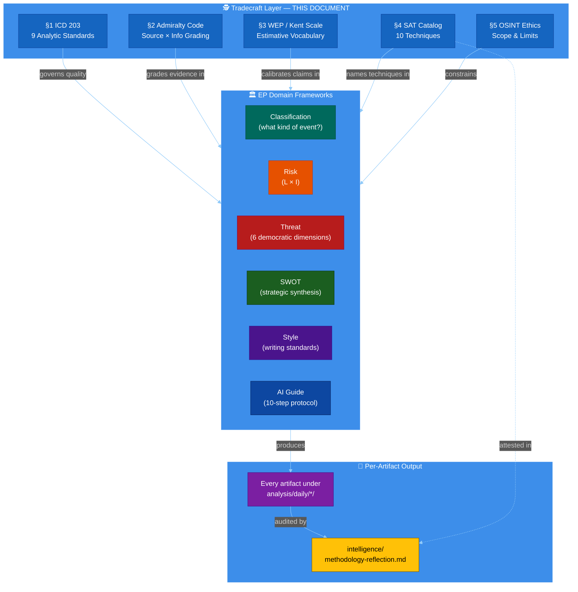

<!-- SPDX-FileCopyrightText: 2024-2026 Hack23 AB -->
<!-- SPDX-License-Identifier: Apache-2.0 -->

<p align="center">
  
</p>

<h1 align="center">🕵️ OSINT / INTOP Tradecraft Standards — European Parliament</h1>

<p align="center">
  <strong>📊 Canonical Professional Tradecraft Reference for Political Intelligence Analysis</strong><br>
  <em>🎯 ICD 203 · Admiralty Code · Kent / Words of Estimative Probability · Structured Analytic Techniques · OSINT Ethics</em>
</p>

<p align="center">
  <a href="#"></a>
  <a href="#"></a>
  <a href="#"></a>
  <a href="#"></a>
  <a href="#"></a>
</p>

**📋 Document Owner:** CEO | **📄 Version:** 1.1 | **📅 Last Updated:** 2026-04-25 (UTC)
**🔄 Review Cycle:** Quarterly | **⏰ Next Review:** 2026-07-31
**🏢 Owner:** Hack23 AB (Org.nr 5595347807) | **🏷️ Classification:** Public

---

## 🎯 Purpose

This document is the **single canonical source** for professional
intelligence-tradecraft standards applied across the EU Parliament Monitor
analysis library. It complements the six EP-domain frameworks
([classification](political-classification-guide.md) ·
[risk](political-risk-methodology.md) · [threat](political-threat-framework.md)
· [SWOT](political-swot-framework.md) · [style](political-style-guide.md) ·
[AI guide](ai-driven-analysis-guide.md)) with **cross-cutting analytic
discipline** used by professional open-source intelligence (OSINT) and
intelligence operations (INTOP) organisations.

Every analytical artifact produced under `analysis/daily/*/` — and every article
generated from those artifacts — is expected to conform to the four pillars
below:

1. **§1. ICD 203 Analytic Tradecraft Standards** — what "good analysis" looks
   like (9 ODNI standards).
2. **§2. Admiralty Code** — how to grade every source and every piece of
   information.
3. **§3. Words of Estimative Probability** — a calibrated vocabulary for
   probabilistic claims.
4. **§4. Structured Analytic Techniques (SAT) Catalog** — the named techniques
   that give the `methodology-reflection` artifact its evidence base.
5. **§5. OSINT Sourcing Ethics & Scope** — the boundaries of what this project
   will and will not do.

**Scope.** This document describes _how_ to analyse. Artifact shapes and
EP-specific subject-matter rules stay in the six domain frameworks and in
[`per-artifact-methodologies.md`](per-artifact-methodologies.md).

---

## 🛡️ ISMS Policy Alignment

| Policy                                                                                                        | Relevance                                                                                                                                      |
| ------------------------------------------------------------------------------------------------------------- | ---------------------------------------------------------------------------------------------------------------------------------------------- |
| [Hack23 AI_Policy](https://github.com/Hack23/ISMS-PUBLIC/blob/main/AI_Policy.md)                              | Governs LLM-driven analysis. §1 (objectivity, explained uncertainties) and §5 (no personal-life data on MEPs) operationalise its requirements. |
| [Information Security Policy](https://github.com/Hack23/ISMS-PUBLIC/blob/main/Information_Security_Policy.md) | §2 source-grading and §3 estimative language constitute the risk-calibrated evidence discipline the ISMS expects.                              |
| [Open Source Policy](https://github.com/Hack23/ISMS-PUBLIC/blob/main/Open_Source_Policy.md)                   | §5 public-domain-only rule enforces licence-compatible sourcing.                                                                               |
| [Secure Development Policy](https://github.com/Hack23/ISMS-PUBLIC/blob/main/Secure_Development_Policy.md)     | §4 SAT catalog is the analytic equivalent of the SDLC security gates.                                                                          |

---

## 📐 Relationship to Existing Frameworks



The tradecraft layer does not replace any existing framework — it describes the
cross-cutting analytic discipline that every framework and every artifact
applies.

---

## 1️⃣ ICD 203 — Analytic Tradecraft Standards

The [US Office of the Director of National Intelligence](https://www.odni.gov/)
publishes
[**Intelligence Community Directive 203 — Analytic Standards**](https://www.odni.gov/files/documents/ICD/ICD%20203%20Analytic%20Standards.pdf),
the most widely adopted professional benchmark for analytic quality. The
standards are framework-agnostic and equally applicable to
political-intelligence work.

### 1.1 The Nine Standards

| #      | Standard                                                                     | Meaning in the EU Parliament Monitor context                                                                                                                                                                                                      | Canonical evidence artifact                                                                                                                                    |
| ------ | ---------------------------------------------------------------------------- | ------------------------------------------------------------------------------------------------------------------------------------------------------------------------------------------------------------------------------------------------- | -------------------------------------------------------------------------------------------------------------------------------------------------------------- |
| **1**  | **Objective**                                                                | Analysis reflects evidence, not the analyst's preferences. Political-group affiliations are described in terms of positions taken, not moral judgements.                                                                                          | Every artifact; specifically `synthesis-summary` Executive Finding.                                                                                            |
| **2**  | **Independent of political considerations**                                  | The analysis is the same regardless of which coalition holds the majority. No deference to Parliament leadership, Commission, Council, or any Member State.                                                                                       | `coalition-dynamics`, `stakeholder-map`, `political-threat-landscape`.                                                                                         |
| **3**  | **Timely**                                                                   | Breaking-news artifacts publish within the 6-hour refresh cadence; weekly, monthly, and ahead-looking workflows respect their schedule.                                                                                                           | All workflows; enforced by the gh-aw schedule triggers.                                                                                                        |
| **4**  | **Based on all available sources of intelligence**                           | Every claim is cross-checked against the EP MCP feeds available at run-time; **IMF** (sole authoritative economic source — Wave-4) and World Bank (non-economic domains only — never for economic context) where applicable; feed failures are logged and a direct-endpoint fallback attempted.               | `mcp-reliability-audit`, `economic-context`, `historical-baseline`.                                                                                            |
| **5a** | **Tradecraft — describes quality and credibility of underlying sources**     | Every source citation carries an Admiralty grade (see §2). Feed failures and degraded modes are explicit.                                                                                                                                         | `mcp-reliability-audit`, `reference-analysis-quality`.                                                                                                         |
| **5b** | **Tradecraft — expresses and explains uncertainties**                        | Every probabilistic claim uses a WEP band (see §3) and carries a 🟢/🟡/🔴 confidence marker (see [`political-style-guide.md`](political-style-guide.md)).                                                                                         | Every artifact making probabilistic claims: `synthesis-summary`, `scenario-forecast`, `risk-matrix`, `wildcards-blackswans`, `threat-model`, `cross-run-diff`. |
| **5c** | **Tradecraft — distinguishes assumptions from judgements**                   | Structural assumptions (e.g. "EPP + S&D + Renew hold a majority") are named in the run's Key Assumptions section (see §4).                                                                                                                        | `methodology-reflection` §3 SAT catalog row for _Key Assumptions Check_; `session-baseline`.                                                                   |
| **5d** | **Tradecraft — incorporates analysis of alternatives**                       | At least one alternative hypothesis is tested in every significant analytic judgement via ACH (see §4) and at least one Red-Team position is surfaced.                                                                                            | `scenario-forecast`, `wildcards-blackswans`, `methodology-reflection` §3.                                                                                      |
| **5e** | **Tradecraft — demonstrates customer relevance**                             | Every artifact names the decision or monitor it informs. Forward-looking artifacts include named watchpoints with trigger thresholds.                                                                                                             | `synthesis-summary` §Forward monitors; `scenario-forecast` §Early-warning indicators.                                                                          |
| **5f** | **Tradecraft — uses clear and logical argumentation**                        | Every numbered section advances a single claim; no paragraph exceeds 150 words without structure; every Mermaid diagram is explained in adjacent prose.                                                                                           | Every artifact; enforced by the Pass 2 readback (see [`ai-driven-analysis-guide.md` §Step 9](ai-driven-analysis-guide.md)).                                    |
| **5g** | **Tradecraft — explains change or consistency**                              | Every run that follows a prior same-type run produces a `cross-run-diff` artifact documenting position deltas.                                                                                                                                    | `cross-run-diff`, `cross-session-intelligence`.                                                                                                                |
| **5h** | **Tradecraft — makes accurate judgements and assessments**                   | Judgements are calibrated to the evidence via §3 WEP bands; confidence asymmetries (e.g. high evidence, low confidence) are stated.                                                                                                               | `synthesis-summary` §Confidence ledger; every `*.analysis.md` per-file artifact.                                                                               |
| **5i** | **Tradecraft — incorporates effective visual information where appropriate** | Every artifact in `intelligence/`, `classification/`, `risk-scoring/`, `threat-assessment/` carries ≥1 Hack23-themed colour-coded Mermaid diagram (see [`per-artifact-methodologies.md`](per-artifact-methodologies.md) §Color semantic mapping). | Every artifact with a _Mandatory Mermaid_ rule.                                                                                                                |

### 1.2 Using ICD 203 in the Pass 2 Readback

During Pass 2 (see
[`ai-driven-analysis-guide.md` §Step 9](ai-driven-analysis-guide.md)), the agent
reads the entire run output and answers, section-by-section, "which ICD 203
standard does this section satisfy?". Any section that cannot be mapped to at
least one standard is rewritten.

The `methodology-reflection.md` artifact records the run's compliance against
all nine standards in its §12 table.

---

## 2️⃣ Admiralty Code — Source × Information Grading

The [NATO Admiralty Code (Admiralty System, STANAG 2511)](https://nsa.nato.int/)
is the standard OSINT / INTOP grading scheme for evidence. Every citation in an
analytic artifact carries **two letters**: source reliability and information
credibility.

### 2.1 Source Reliability (letter)

| Grade | Label                | Meaning in the EU Parliament Monitor context                                                                                                                                                                                            |
| :---: | -------------------- | --------------------------------------------------------------------------------------------------------------------------------------------------------------------------------------------------------------------------------------- |
| **A** | Completely reliable  | Official EP feed, EUR-Lex, Commission register, Eurostat, IMF (sole authoritative economic source — Wave-4), World Bank (non-economic only — never for economic context), ECB, and any document reachable through the European Parliament MCP Server with a direct procedure / document ID. |
| **B** | Usually reliable     | EP-accredited press pool, verified Member State government publications, major wire services (Reuters, AFP, AP) covering institutional facts.                                                                                           |
| **C** | Fairly reliable      | Policy-institute briefings (Bruegel, CEPS, ECFR, Carnegie Europe), national public-service broadcasters covering EU affairs.                                                                                                            |
| **D** | Not usually reliable | General-interest press without Brussels accreditation, commentary / opinion pieces from partisan outlets.                                                                                                                               |
| **E** | Unreliable           | Social-media actors, blog commentary without disclosed authorship, outlets with documented track record of factual errors on EU topics.                                                                                                 |
| **F** | Cannot be judged     | Anonymous source, machine-generated summary, or any source whose provenance cannot be determined.                                                                                                                                       |

### 2.2 Information Credibility (digit)

| Grade | Label                      | Meaning                                                                                        |
| :---: | -------------------------- | ---------------------------------------------------------------------------------------------- |
| **1** | Confirmed by other sources | Multiple **A**-graded sources agree and the primary record is reachable.                       |
| **2** | Probably true              | A single **A**-graded primary record exists, or multiple **B** sources agree.                  |
| **3** | Possibly true              | One **B**-graded source or multiple lower-grade sources agree; no primary contradiction found. |
| **4** | Doubtful                   | Information is plausible but uncorroborated.                                                   |
| **5** | Improbable                 | Information contradicts prior evidence without strong reason.                                  |
| **6** | Cannot be judged           | Credibility cannot be assessed (e.g. degraded MCP mode; data not available).                   |

### 2.3 The 6 × 6 Matrix and Confidence Mapping

The 36 combinations collapse into three bands that map directly to the library's
existing 🟢/🟡/🔴 confidence markers.

```
                                Information Credibility
                     1       2       3       4       5       6
            ┌─────────────────────────────────────────────────┐
          A │  🟢      🟢      🟢      🟡      🔴      🟡      │
          B │  🟢      🟢      🟡      🟡      🔴      🟡      │
          C │  🟢      🟡      🟡      🔴      🔴      🔴      │
          D │  🟡      🟡      🔴      🔴      🔴      🔴      │
          E │  🔴      🔴      🔴      🔴      🔴      🔴      │
          F │  🟡      🟡      🔴      🔴      🔴      🔴      │
            └─────────────────────────────────────────────────┘
                                       Source Reliability
```

- **🟢 HIGH confidence (A1–A3, B1–B2, C1)** — primary-source evidence or tightly
  corroborated secondary evidence; fit to support a headline judgement.
- **🟡 MEDIUM confidence (A4, B3–B4, B6, C2–C3, D1–D2, F1–F2)** — indicative but
  not conclusive; must be flanked by at least one other piece of evidence before
  supporting a headline judgement.
- **🔴 LOW confidence (everything else)** — noted but never carries a top-level
  judgement on its own; rarely cited outside an explicit "what we do not know"
  section.

### 2.4 Notation in Artifacts

Every evidence citation should carry its grade inline:

> _"EPP Group cohesion was 94.6 % on the Rule-of-Law own-initiative report
> [get_voting_records, A1]."_

For tables, a dedicated **Source grade** column is preferred (see
[`synthesis-summary`](../templates/synthesis-summary.md) Top-findings table).

### 2.5 When Grades Downgrade Analytic Claims

- Any claim supported only by grade-D or grade-E sources **must** be marked 🔴
  LOW confidence.
- Any claim supported only by grade-F sources **must** be excluded or framed as
  "unverified report" (never as a judgement).
- Degraded MCP mode (see `mcp-reliability-audit`) automatically downgrades grade
  for all affected citations; the `reference-analysis-quality` artifact captures
  the run's aggregate grade distribution.

### 2.6 Adopted-Texts Feed Freshness — Structured Warning Protocol

The EP Open Data Portal's `get_adopted_texts_feed` endpoint sometimes returns a
payload where all items are from a prior year (e.g. all TA-9-2024 / TA-10-2025
with no 2026 items). **Do not apply the heuristic "no current-year items ⇒
downgrade to C4"** — inspect the structured `dataQualityWarnings[]` field in the
response payload instead.

The `ep-mcp-client.ts` Stage-A wrapper populates two dedicated fields after
parsing `dataQualityWarnings`:

| Response field          | Value         | Meaning                                                                                                                                                                                        | Admiralty impact                                                                                                          |
| ----------------------- | ------------- | ---------------------------------------------------------------------------------------------------------------------------------------------------------------------------------------------- | ------------------------------------------------------------------------------------------------------------------------- |
| `freshness`             | `"augmented"` | Server detected a stale feed and pre-fetched `GET /adopted-texts?year={currentYear}` to supplement the items array. The augmented items are confirmable, EP-published, current-year documents. | **No downgrade** — source remains **A** (official EP record); credibility is **1–2** if items corroborate other evidence. |
| `dataFreshnessWarnings` | `string[]`    | Subset of `dataQualityWarnings` that starts with `FRESHNESS_FALLBACK`. Forward to `mcp-reliability-audit.md` §Warnings for transparency.                                                       | —                                                                                                                         |

When `dataFreshnessWarnings` is present and `freshness === "augmented"`, grade
citations as **A2** (single EP primary source, augmentation path confirmed by
the server) — the same grade used for direct `get_adopted_texts?year=…` queries.

**Escalation — `FRESHNESS_FALLBACK_FAILED`:** When `ep-mcp-client.ts` records
`get_adopted_texts_feed` as failed with an `ANALYSIS_ONLY` prefix, the feed was
stale _and_ the current-year fallback also returned no items. In this case:

- Mark the `get_adopted_texts_feed` evidence row in `mcp-reliability-audit.md`
  as **`❌ FAILED (ANALYSIS_ONLY)`**.
- Do **not** cite any adopted-texts evidence — the run has no confirmable
  current-year corpus.
- The Stage-C gate may still proceed if other primary data sources (speeches,
  questions, plenary sessions) provide sufficient evidence density.

---

## 3️⃣ Words of Estimative Probability (WEP / Kent Scale)

Professional intelligence analysis uses a **calibrated probabilistic
vocabulary** pioneered by
[Sherman Kent](https://www.cia.gov/resources/csi/studies-in-intelligence/) and
formalised in successive
[National Intelligence Council (NIC)](https://www.dni.gov/index.php/who-we-are/organizations/mission-integration/nic)
products. The EU Parliament Monitor adopts a seven-band scheme aligned with the
ODNI reference.

### 3.1 The Seven Bands

| Band  | Phrase                                  | Numeric range | Indicative usage                                                                                                  |
| :---: | --------------------------------------- | :-----------: | ----------------------------------------------------------------------------------------------------------------- |
| **1** | **Almost no chance** / _remote_         |    1 – 5 %    | "There is almost no chance the PfE group will co-sign an EPP report on Rule-of-Law this term."                    |
| **2** | **Very unlikely** / _highly improbable_ |   5 – 20 %    | "A Grand-Coalition rupture over CAP reform is very unlikely before the 2026 mid-term."                            |
| **3** | **Unlikely** / _improbable_             |   20 – 45 %   | "Unilateral Council blocking of the AI-Act implementing acts is unlikely, given the Spanish presidency's stance." |
| **4** | **Roughly even chance**                 |   45 – 55 %   | "There is a roughly even chance the ECR will whip for the migration-pact amendments."                             |
| **5** | **Likely** / _probable_                 |   55 – 80 %   | "The EPP–Renew patent-package compromise will likely survive first reading."                                      |
| **6** | **Very likely** / _highly probable_     |   80 – 95 %   | "Very likely the plenary will adopt the budget discharge on first vote."                                          |
| **7** | **Almost certain** / _nearly certain_   |   95 – 99 %   | "The interinstitutional agreement on own-resources is almost certain to be signed before year-end."               |

### 3.2 Banned Terms in Analytic Conclusions

The following words are **ambiguous** and must be replaced with one of the seven
bands whenever they carry probabilistic weight:

- _possibly_, _may_, _might_, _could_, _perhaps_, _conceivably_ — all
  uncalibrated.
- _significant chance_, _real risk_, _cannot be ruled out_ — hedging without
  bands.
- _imminent_ without a date — descriptive, not estimative.
- _many_, _most_, _some_, _several_ — when used of actor counts, replace with
  numerics.

These words remain acceptable in descriptive passages (e.g. "the Commission may
publish its communication in Q3"), but not in analytic conclusions.

### 3.3 Pairing With Admiralty Grades

Every WEP-banded claim carries an Admiralty suffix (see §2.4). Example canonical
form:

> _"A Grand-Coalition majority on the migration-pact amendments is **likely**
> (55–80 %) [get_voting_records + historical-baseline, A1]. Confidence: 🟢
> HIGH."_

The pairing forces the analyst to reconcile _what we claim_ (WEP band) with _why
we claim it_ (Admiralty grade) and makes every forecast falsifiable after the
event.

### 3.4 Time Horizon Discipline

Every estimative claim names an explicit horizon:

- **Tactical** — the next 0–7 days (same trilogue cycle, same plenary week).
- **Operational** — the next 7–90 days (within the current session, the next two
  plenaries).
- **Strategic** — the next 90 days – 18 months (within the current term, up to
  mid-term renewal).
- **Structural** — 18+ months (term-on-term, multi-term trends).

A claim without a horizon is rejected in Pass 2.

---

## 4️⃣ Canonical Structured Analytic Techniques (SAT) Catalog

The `methodology-reflection.md` artifact requires **≥10 SATs applied per run**
with artifact citations. This catalog defines those techniques so the
attestation is substantive rather than nominal. The canonical reference is Heuer
& Pherson, _Structured Analytic Techniques for Intelligence Analysis_ (3rd ed.,
CQ Press, 2020).

### 4.1 Core Techniques (required)

| #      | Technique                                         | Definition                                                                                             | When to apply                                                                                              | Required output                                                                                | Canonical artifact                                                                                 |
| ------ | ------------------------------------------------- | ------------------------------------------------------------------------------------------------------ | ---------------------------------------------------------------------------------------------------------- | ---------------------------------------------------------------------------------------------- | -------------------------------------------------------------------------------------------------- |
| **1**  | **Analysis of Competing Hypotheses (ACH)**        | Matrix comparing ≥3 hypotheses against all evidence; hypothesis with the fewest inconsistencies wins.  | Whenever the analysis has ≥2 plausible explanations (e.g. a vote outcome with multiple coalition drivers). | Matrix table: hypotheses × evidence cells, inconsistency count per hypothesis.                 | `intelligence/scenario-forecast.md`; `intelligence/coalition-dynamics.md`.                         |
| **2**  | **Key Assumptions Check (KAC)**                   | Explicit list of the structural assumptions underpinning the analysis, with a rebuttal for each.       | Every run; at least the top 5 assumptions.                                                                 | Table: assumption, basis, rebuttal, confidence if wrong.                                       | `intelligence/session-baseline.md` (if used); `methodology-reflection.md` §3.                      |
| **3**  | **Quality of Information Check**                  | Per-source Admiralty grade audit and a "what we do not know" section.                                  | Every run.                                                                                                 | Source-grade distribution table; gaps list.                                                    | `intelligence/mcp-reliability-audit.md`; `intelligence/reference-analysis-quality.md`.             |
| **4**  | **Indicators & Signposts**                        | Pre-specified observable events that would confirm or refute each scenario.                            | Every forecast artifact.                                                                                   | ≥3 indicators per scenario, each with date, source, trigger threshold.                         | `intelligence/scenario-forecast.md`; `synthesis-summary.md` §Forward monitors.                     |
| **5**  | **What-If Analysis**                              | Starts from a specified low-probability but high-impact event; works backwards to indicators.          | When the risk register contains ≥1 tail event.                                                             | Narrative scenario + reverse-causal chain.                                                     | `intelligence/wildcards-blackswans.md`.                                                            |
| **6**  | **High-Impact / Low-Probability Analysis**        | Structured risk-register entry for tail-risk events that conventional scenario analysis deprioritises. | At least one per breaking / weekly / monthly run.                                                          | Named event, trigger, impact vector, early-warning indicator, resilience test.                 | `intelligence/wildcards-blackswans.md`.                                                            |
| **7**  | **Red Team / Devil's Advocate**                   | Independent reading that actively argues against the main judgement.                                   | Every run with a headline judgement.                                                                       | Named alternative position, 3 strongest counter-points, minimum viable disconfirming evidence. | `methodology-reflection.md` §3; specifically called out in §5 Strengths / §6 Limitations sections. |
| **8**  | **Pre-Mortem**                                    | Before publication, the analyst asks: "imagine this conclusion is wrong in 90 days — why?"             | Every forecast artifact; optional for retrospective artifacts.                                             | List of the top 3 failure modes with observable markers.                                       | `intelligence/scenario-forecast.md` §Pre-Mortem.                                                   |
| **9**  | **Scenario Analysis**                             | Produces 3–5 plausible futures with probabilities summing to ~100 %.                                   | Every forward-looking artifact.                                                                            | Named scenarios, WEP-banded probability per scenario, indicators per scenario.                 | `intelligence/scenario-forecast.md`.                                                               |
| **10** | **Competing Hypotheses Matrix (lightweight ACH)** | Tabular version of ACH used in per-file artifacts where full ACH is not practical.                     | Per-file analyses with ≥1 contested interpretation.                                                        | 2-column table with C / I / N markings per evidence × hypothesis.                              | Per-file `.analysis.md`.                                                                           |

### 4.2 Supporting Techniques (apply as appropriate)

- **PESTLE** — political / economic / social / technological / legal /
  environmental decomposition. Canonical in `intelligence/pestle-analysis.md`.
- **Stakeholder Mapping** — position × power × interest grid. Canonical in
  `intelligence/stakeholder-map.md`.
- **Bayesian Update** — prior × likelihood → posterior for cross-run confidence
  updating. Canonical in `intelligence/cross-run-diff.md` and
  [`political-risk-methodology.md` §Bayesian Update](political-risk-methodology.md).
- **Force-Field Analysis** — drivers vs. restrainers of a given coalition
  outcome. Canonical in `classification/forces-analysis.md`.
- **Cone of Plausibility** — four-quadrant forecast laying out best / plausible
  / worst / wildcard cases. Canonical in `intelligence/scenario-forecast.md`.

### 4.3 Attestation Requirement

Each applied technique appears in the `methodology-reflection.md` §3 SAT table
with: technique name, canonical artifact where applied, one-sentence outcome
(what the technique revealed), and Pass (1 / 2 / 3). A technique listed without
a canonical artifact reference is rejected in Pass 2.

---

## 5️⃣ OSINT Sourcing Ethics & Scope

Political intelligence is a disciplined craft with hard ethical boundaries. The
following rules are **non-negotiable** and supersede any analytic consideration.

### 5.1 In Scope

- **Public institutional records** — every EP document, procedure, vote, speech,
  report, question, declaration of interest, and adopted text retrievable
  through the European Parliament MCP Server.
- **Official publications** — EUR-Lex, Council documents, Commission register,
  Eurostat, ECB, IMF (sole authoritative economic source — Wave-4), World Bank (non-economic), and
  equivalent government open-data portals of EU Member States.
- **Public statements by MEPs and political groups** — press releases, recorded
  plenary speeches, committee interventions, signed amendments and
  joint-resolution lists.
- **Reputable Brussels press** — EP-accredited press corps, verified wire
  services, policy-institute publications (Bruegel, CEPS, ECFR).
- **Academic literature** — peer-reviewed political-science scholarship on EP
  dynamics.

### 5.2 Out of Scope (never collected, never cited)

- **Personal-life data on MEPs or their staff** — family, health, private
  residences, personal relationships, private finances beyond published
  declarations of interest. This aligns with the
  [Hack23 AI_Policy](https://github.com/Hack23/ISMS-PUBLIC/blob/main/AI_Policy.md)
  prohibition on processing personal data outside stated purpose.
- **Doxing or aggregation targeting individuals** — even if each datum is
  individually public, aggregated profiles focused on private life are out of
  scope.
- **Paywalled or licence-restricted sources** — analysis relies on open-data
  sources. Subscription-only policy-tracker content is not re-published; if an
  analyst uses it, it is cited but not quoted at length, and the claim must
  independently pass §2 Admiralty grading.
- **Leaked material of unknown provenance** — any source that cannot be verified
  against a published primary record is grade F and excluded from headline
  judgements.
- **Covert collection** — social-engineering, scraping behind authentication
  walls, deceptive personas, or any technique that would require consent under
  GDPR.
- **Unverified social-media rumour** — social-media posts by verified
  institutional accounts are grade B3; all other social-media content is grade E
  or F and never carries a judgement.

### 5.3 GDPR and Proportionality Discipline

The analysis focuses on **public figures acting in their public capacity** and
on **institutional process**. Where an MEP name appears, it appears in
connection with a specific vote, speech, report, or amendment — never in
connection with private life. This is consistent with the public-figure limit
under GDPR Article 6(1)(f) legitimate-interest processing, as applied to
political accountability journalism.

### 5.4 Attribution and Reproducibility

- Every non-trivial claim cites the primary European Parliament MCP tool call,
  document ID, or URL that backs it.
- Every artifact lists the MCP tool calls attempted in the run (successful and
  failed), so a third party can reproduce the evidence collection.
- The `mcp-reliability-audit.md` artifact is the run's transparency ledger — it
  is not optional.

### 5.5 Licence and Republication

- All EU Parliament Monitor analysis is published under the repository's
  Apache-2.0 licence.
- Re-publication of third-party text is limited to short excerpts with clear
  attribution and only to the extent supported by the source's own licence (EU
  institutional content is generally reusable under the
  [Commission decision on reuse](https://eur-lex.europa.eu/eli/dec/2011/833/oj);
  commercial-press content is not re-published).
- SPDX headers on every markdown file under `analysis/` make the licence chain
  machine-verifiable.

---

## 6️⃣ Worked SAT examples — applying tradecraft to real EP scenarios

Theory is cheap; tradecraft is in the worked example. Below are five
applied SAT walkthroughs covering the most common EP analytic mistakes.

### 6.1 — Analysis of Competing Hypotheses (ACH) on a coalition vote

**Question**: Why did 47 EPP MEPs defect on the AI-Act enforcement vote?

**ACH matrix** (✓ = consistent with hypothesis, ✗ = inconsistent,
N = neutral):

| Evidence | H1: Industry pressure | H2: Whip failure | H3: Member-state instructions |
|---|:-:|:-:|:-:|
| 38 of 47 defectors come from 4 MS with strong AI startups | ✓ | N | ✓ |
| Defection clusters in newer MEPs (≤ 2 yrs in EP) | N | ✓ | N |
| EPP whip issued only 24h before vote | N | ✓ | N |
| Defectors include 6 EPP-WG vice-coordinators | ✗ | ✓ | N |
| Council position from same 4 MS aligned with defection | N | N | ✓ |

**Most-supported**: H2 (whip failure) is least disconfirmed. H3 cannot be
ruled out and warrants a forward indicator: monitor next coalition-test
vote with same Council positions.

**WEP**: "We assess with **moderate confidence** (🟡) that whip
discipline failed; member-state instruction effect is **possible** but
unconfirmed." (3-12 months horizon for follow-up.)

### 6.2 — Indicators & Signposts on coalition fracture

**Hypothesis**: The Grand Coalition (EPP+S&D+Renew, ~408 seats) is
fracturing on rule-of-law issues with Hungary.

**Indicator panel** (each with a tripwire threshold):

| Indicator | Tripwire | Detection method |
|---|---|---|
| EPP-S&D agreement rate on rule-of-law roll calls | < 70% over 4-week window | `analyze_coalition_dynamics` |
| Renew abstention rate on Article-7 motions | > 15% | `get_voting_records` topic filter |
| Public letters from EPP-affiliated heads of state criticising the EP position | ≥ 2 in 30 days | OSINT scrape |
| Renew + S&D joint motions WITHOUT EPP co-sign | ≥ 3 in 60 days | `get_procedures` filter |

**WEP today** (2026-04-25): "**Possible** that Grand Coalition fractures
on rule-of-law within 6 months (🟡 moderate confidence)." Indicators
below threshold; revisit weekly.

### 6.3 — Key Assumptions Check on enlargement timeline

**Assumption being tested**: "UKR will close all 35 negotiating chapters
by 2030."

**Test**:

| Assumption | Validity | Stress test |
|---|---|---|
| Russian war ends by 2027 | UNTESTED | Sensitivity: scenarios A,B,C |
| HUN does not block again | LOW | HUN already blocked Dec 2024 |
| 1 chapter / 2 months pace sustained | LOW | Historical EU-2007 base rate is 1 / 4-5 months |
| Acquis-implementation cost ≤ €30bn | UNTESTED | EU MFF reservations |

**Verdict**: Three of four foundation assumptions are LOW-validity. The
2030 timeline is a **policy aspiration**, not a base-case forecast.
Default WEP for any prose claiming "by 2030" is now ⛔ banned without
explicit "if all four assumptions hold" qualifier.

### 6.4 — Red-team check on a Commission proposal

**Original analysis**: "The Commission's 2026 Cyber Resilience Package
will pass with EPP+S&D support."

**Red-team challenges**:

1. **What if industry mobilises?** — 200+ trade associations co-sign a
   critical letter; S&D rapporteur softens scope. Plausibility 35%.
2. **What if a MS files a national-security carve-out?** — Article 4(2)
   TEU invocation; legal-base challenge to RED Standards. Plausibility 20%.
3. **What if a CJEU ruling changes the legal base mid-trilogue?** —
   Procedural restart costs 6-9 months. Plausibility 10%.

**Updated WEP**: "**Likely** to pass in the proposed form (🟢 high
confidence) but **possible** (🟡) that scope is softened during trilogue."

### 6.5 — Premortem on a forecast artifact

**Forecast statement**: "The Critical Raw Materials Act will be adopted
by Q4 2026."

**Premortem (assume the forecast is wrong; explain why)**:

1. Trilogue collapse over Council's "strategic supplier" definition.
2. Hungarian veto in Council on financing model.
3. Industry-led litigation delay.
4. CJEU referral on legal base.
5. Geopolitical shock (China-EU rare-earths embargo) freezes negotiations.

**Mitigation**: forecast is now stated with WEP "**likely** by Q4 2026 in
*either* the original or a softened scope (🟡 moderate confidence)" —
allowing for negotiating-process variability while retaining a base case.

## 7️⃣ Admiralty grading walkthroughs

The Admiralty system pairs **source reliability** (A-F) with **information
credibility** (1-6). Worked examples below.

### 7.1 — EP roll-call vote tally

- **Source**: `get_voting_records` MCP tool, EP Open Data Portal.
- **Reliability**: A (completely reliable, official primary source).
- **Credibility**: 1 (confirmed by other independent sources — published
  minutes match). 
- **Grade**: **A1**.

### 7.2 — Press-leak about coalition negotiations

- **Source**: Politico Europe, single named EU diplomat quoted.
- **Reliability**: B (usually reliable — Politico is a respected outlet
  but the diplomat's loyalty is unverified).
- **Credibility**: 3 (possibly true — single source, no independent
  confirmation).
- **Grade**: **B3**. Use only with explicit hedging; cross-check before
  citing in a Tier-1 article.

### 7.3 — Industry trade-association letter

- **Source**: trade-association website, signed by named industry CEOs.
- **Reliability**: C (fairly reliable — known advocacy bias).
- **Credibility**: 2 (probably true — verifiable signatures).
- **Grade**: **C2**. Acceptable for stakeholder mapping; flag bias
  explicitly.

### 7.4 — Anonymous Twitter/X claim

- **Source**: anonymous account.
- **Reliability**: F (cannot be judged).
- **Credibility**: 5 (improbable).
- **Grade**: **F5**. **Do NOT cite** in any analytic conclusion. May be
  recorded in `data-download-manifest.md` under "rejected sources"
  for transparency.

### 7.5 — IMF WEO release

- **Source**: IMF WEO 2026-04 publication.
- **Reliability**: A (official statistical publication).
- **Credibility**: 2 for actuals (probably true — final until next
  vintage); 3 for forecasts (possibly true — projection uncertainty).
- **Grade**: **A2** for backward-looking data; **A3** for projections.

### 7.6 — Wikipedia article

- **Reliability**: D (not usually reliable — community-edited, no audit).
- **Credibility**: variable.
- **Grade**: **D-anything**. **Use only as a navigational aid**, never
  as a citable source. Always trace to the underlying primary source
  cited in Wikipedia and grade THAT source.

## 8️⃣ Source deconfliction practice

When two sources disagree on a fact, the deconfliction protocol is:

1. **Identify the disagreement**: state both claims with their grades.
2. **Examine independence**: are sources truly independent or does one
   cite the other?
3. **Apply hierarchy**: A grade beats B grade beats C grade. If both A,
   prefer the source with structural neutrality (official statistic over
   policy paper).
4. **Triangulate**: pull a third independent source if possible.
5. **Document**: record the deconfliction in `methodology-reflection.md`
   under "Source disagreements resolved" with WEP confidence.

**Worked example**: IMF reports EU real GDP growth 2025 at 1.4%; Eurostat
reports 1.5% (both vintage Apr 2026).

- IMF A2 vs Eurostat A2 (both reliable primary).
- Independence: Eurostat is the IMF's underlying source for EU-27 data;
  IMF rounds to nearest 0.1 with different methodology for the EA
  aggregate.
- **Resolution**: cite Eurostat for EU-27 specifically; cite IMF for EA
  aggregates. Note the 0.1pp methodological gap in
  `methodology-reflection.md`.

## 9️⃣ Confidence-marker decision rule

The 🟢 / 🟡 / 🔴 confidence label maps to source × evidence × consistency:

| Source grade | Multiple sources? | Evidence consistency | Confidence |
|---|---|---|---|
| A1-A2 | yes | consistent | 🟢 high |
| A1-A2 | no | n/a | 🟡 moderate |
| A3-B2 | yes | consistent | 🟡 moderate |
| A3-B2 | no | n/a | 🔴 low |
| Any with significant disagreement | varies | inconsistent | 🔴 low |
| C-D grade | even with multiple | n/a | 🔴 low |

The rule is mechanical to keep marker assignment consistent across
agents and runs. Stage-C cross-checks confidence markers against the
source grades cited in the same paragraph.


Before a run's PR is created, verify each line:

- [ ] Every headline judgement uses a **WEP band** (§3.1) and names a **time
      horizon** (§3.4).
- [ ] Every evidence citation carries an **Admiralty grade** (§2.1–2.2) inline
      or in a source-grade column.
- [ ] Every probabilistic claim is paired with a 🟢 / 🟡 / 🔴 **confidence
      marker** consistent with §2.3.
- [ ] The `methodology-reflection.md` §3 SAT table names **≥10 techniques**
      drawn from §4 with artifact citations.
- [ ] No artifact contains banned terms (§3.2) in analytic conclusions;
      descriptive uses are OK.
- [ ] At least **one alternative hypothesis** (§4 technique 1 or 7) is surfaced
      for every headline judgement.
- [ ] **No personal-life data** on MEPs appears anywhere under `analysis/daily/`
      (§5.2).
- [ ] Every source is **grade A – F** in scope (§5.1–5.2); anything outside
      scope is removed.

---

## 🔗 Related Documents

- [`ai-driven-analysis-guide.md`](ai-driven-analysis-guide.md) — 10-step
  protocol; §Step 10 operationalises this document's checklist.
- [`per-artifact-methodologies.md`](per-artifact-methodologies.md) —
  construction rules per artifact.
- [`political-style-guide.md`](political-style-guide.md) — §Estimative Language
  & Source Grading cross-references this document.
- [`political-risk-methodology.md`](political-risk-methodology.md) — Likelihood
  × Impact; likelihoods use §3 bands.
- [`political-threat-framework.md`](political-threat-framework.md) — 6 threat
  dimensions; claims about intent / capability use §3 bands.
- [`synthesis-methodology.md`](synthesis-methodology.md) — synthesis layer; Key
  Judgments use this document's WEP bands + confidence labels.
- [`strategic-extensions-methodology.md`](strategic-extensions-methodology.md) —
  strategic depth layer; scenario-forecast / wildcards use WEP bands.
- [`../templates/methodology-reflection.md`](../templates/methodology-reflection.md)
  — the run's tradecraft attestation artifact.
- [`../templates/intelligence-assessment.md`](../templates/intelligence-assessment.md)
  — ICD 203 compliant template for `extended/intelligence-assessment.md`.
- [`../templates/executive-brief.md`](../templates/executive-brief.md) — BLUF +
  Key Judgments template for `extended/executive-brief.md`.
- [`../templates/devils-advocate-analysis.md`](../templates/devils-advocate-analysis.md)
  — ACH + Red Team template for `extended/devils-advocate-analysis.md`.
- [`../templates/forward-indicators.md`](../templates/forward-indicators.md) —
  Indicators & Signposts SAT template for `extended/forward-indicators.md`.
- [Hack23 AI_Policy](https://github.com/Hack23/ISMS-PUBLIC/blob/main/AI_Policy.md)
  — responsible-AI governance.

## 📚 External References

- Office of the Director of National Intelligence. **ICD 203 — Analytic
  Standards.** 2015 revision.
  <https://www.odni.gov/files/documents/ICD/ICD%20203%20Analytic%20Standards.pdf>
- Kent, Sherman. _Words of Estimative Probability_. CIA Studies in Intelligence,
  1964 (declassified 1993).
- Heuer, R. J. _Psychology of Intelligence Analysis_. CIA Center for the Study
  of Intelligence, 1999.
- Heuer, R. J. & Pherson, R. H. _Structured Analytic Techniques for Intelligence
  Analysis_ (3rd ed.). CQ Press, 2020.
- NATO. _Intelligence Handbook_ (AJP-2.1); _Admiralty System_ (STANAG 2511).
- UK Ministry of Defence. _Red Teaming Handbook_ (3rd ed.), 2021.

---

**Document Control:** `/analysis/methodologies/osint-tradecraft-standards.md` ·
v1.2 · Applies to every workflow and every artifact under `analysis/daily/*/`.
v1.1 (2026-04-23) — added cross-references to the new ported methodologies
(synthesis, strategic-extensions) and the extended `intelligence-assessment`,
`executive-brief`, `devils-advocate-analysis`, `forward-indicators` templates so
ICD 203 / Admiralty / WEP contracts are explicit for those artifacts. v1.2
(2026-04-25) — added §2.6 Adopted-Texts Feed Freshness structured warning
protocol: replaces the heuristic "no current-year items ⇒ C4 downgrade" with the
structured `FRESHNESS_FALLBACK` / `FRESHNESS_FALLBACK_FAILED` signals emitted by
`ep-mcp-client.ts`.
