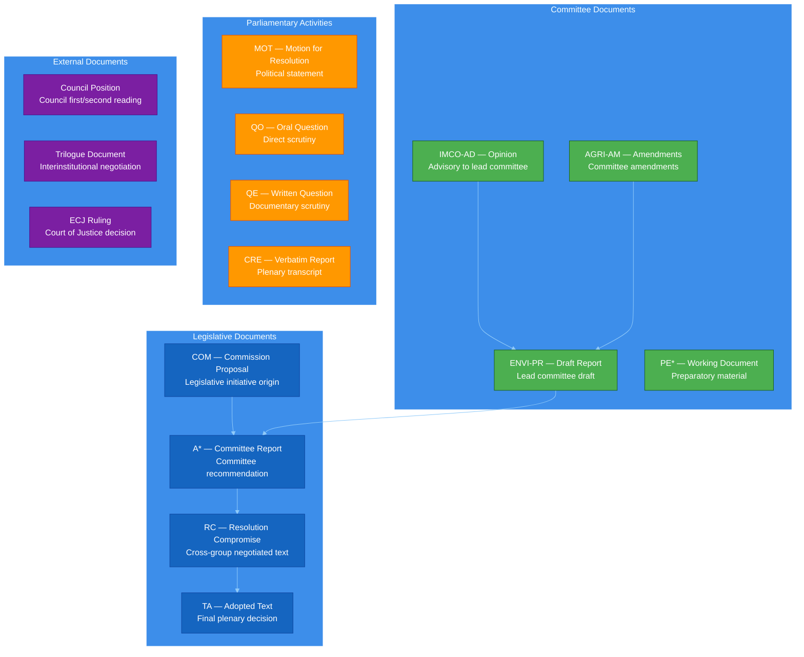

<!-- SPDX-FileCopyrightText: 2024-2026 Hack23 AB -->
<!-- SPDX-License-Identifier: Apache-2.0 -->

<p align="center">
  
</p>

<h1 align="center">📄 Per-Document Methodology (Atomic Evidence Layer)</h1>

<p align="center">
  <strong>📊 Family E — Deep Analysis of Individual European Parliament Documents</strong><br>
  <em>🎯 Document Interrogation · Evidence Grading · Clause-Level Analysis · Provenance Mapping</em>
</p>

<p align="center">
  <a href="#"></a>
  <a href="#"></a>
  <a href="#"></a>
  <a href="#"></a>
</p>

**📋 Document Owner:** CEO | **📄 Version:** 1.1 | **📅 Last Updated:** 2026-04-25 (UTC)
**🔄 Review Cycle:** Quarterly | **⏰ Next Review:** 2026-07-31
**🏢 Owner:** Hack23 AB (Org.nr 5595347807) | **🏷️ Classification:** Public

---

## 🔄 Tradecraft Anchors

| Element | Value | Reference |
|---------|-------|-----------|
| **F3EAD Stage** | **EXPLOIT** — extract actionable data from raw documents | Document-level analysis extracts structured facts from unstructured parliamentary text |
| **PIRs Served** | Each per-document file serves PIRs by extracting facts that answer specific intelligence requirements | See [`political-style-guide.md` §PIR/EEI](political-style-guide.md#-priority-intelligence-requirements-pir--essential-elements-of-information-eei) |
| **Admiralty Floor** | Source grade derives from document provenance: plenary = A1, committee = A2, press = B3 | See [`political-style-guide.md` §Admiralty](political-style-guide.md#-admiralty-source-reliability-code-nato-stanag-2022) |
| **WEP Requirement** | Forward-looking claims in per-document analysis use WEP bands | See [`political-style-guide.md` §WEP + ODNI](political-style-guide.md#-words-of-estimative-probability-wep--odni-confidence-overlay) |
| **ICD 203 Gate** | Standard 1 (clear source), Standard 5 (distinguish facts from assumptions) | See [`political-style-guide.md` §ICD 203](political-style-guide.md#-icd-203-analytic-tradecraft-standards-mapping) |
| **SAT(s)** | Content Analysis, Chronological Review, SWOT Framing, Stakeholder Identification | See [`political-style-guide.md` §SATs](political-style-guide.md#-structured-analytic-techniques-sats-catalog) |

---

## 🎯 Purpose

Family E delivers **atomic evidence** — the indivisible facts extracted from individual European Parliament documents. While Family A synthesizes across documents, Family E goes deep into **one document at a time**, producing:

1. **per-file-analysis/{doc-id}.md** — comprehensive clause-by-clause analysis of each document
2. **document-analysis-index.md** — summary index linking all per-document analyses

### When Family E is Produced

Family E analysis is triggered whenever the workflow retrieves **full document content** via:

- `get_adopted_texts` (adopted resolutions, legislative positions)
- `get_committee_documents` (committee reports, opinions)
- `get_plenary_documents` (motions, amendments)
- `get_procedures` (procedure dossier documents)
- `get_external_documents` (Commission proposals, Council positions)
- `search_documents` (keyword-matched document retrieval)

**Rule:** Metadata-only retrieval (titles, dates, reference numbers) does **not** qualify as evidence for analysis. Per-document analysis requires **full document content download**.

---

## 📊 Document Type Taxonomy (European Parliament)



---

## 🗂️ Document-Type Analysis Templates

### EP Document Types and Analysis Requirements

| Document Type | Code | MCP Tool | Required Analysis Sections | Min Lines |
|---------------|------|----------|---------------------------|-----------|
| Commission Proposal | COM(20XX)NNN | `get_external_documents` | Problem statement, legal base, impact assessment summary, stakeholder positions | 200 |
| Committee Report | A*-0NNN/20XX | `get_committee_documents` | Rapporteur recommendation, key amendments, vote distribution, committee splits | 180 |
| Adopted Text | P*_TA(20XX)NNNN | `get_adopted_texts` | Final position, material changes from committee, implementation timeline | 150 |
| Motion for Resolution | B*-0NNN/20XX | `get_plenary_documents` | Signatory analysis, political-group alignment, precedent context | 140 |
| Compromise Amendment | RC-B*-0NNN/20XX | `get_plenary_documents` | Cross-group negotiation trace, substantive trade-offs, abstention patterns | 160 |
| Written Question | QE-NNNNNN | `get_parliamentary_questions` | Question framing, Commission response, follow-up indicators | 100 |
| Oral Question | QO-NNNNNN | `get_parliamentary_questions` | Debate context, supplementary questions, Minister/Commissioner response | 120 |
| Committee Opinion | XX-AD-0NNN/20XX | `get_committee_documents` | Advisory scope, divergence from lead committee, voting pattern | 130 |
| Legislative Procedure | 20XX/NNNN(COD/NLE) | `get_procedures` | Stage progression, timeline analysis, blocking points | 180 |
| Roll-Call Vote | A*-NNNN/20XX-VOTE | `get_voting_records` | Vote distribution, political-group cohesion, notable defections | 150 |

---

## 📋 Per-Document Analysis Template Structure

Each `per-file-analysis/{doc-id}.md` file follows this canonical structure:

### 1. Document Header Block

```markdown
# Per-Document Analysis: {DOC-ID}

**Document Type:** {Commission Proposal / Committee Report / Adopted Text / ...}
**Reference:** {Full EP reference number}
**Date:** {Publication date, ISO format}
**Source Grade:** {Admiralty code, e.g., A1 — Primary EP plenary record}
**Procedure:** {Linked procedure ID, e.g., 2024/0001(COD)}

---
```

### 2. Executive Summary (≤100 words)

BLUF (Bottom Line Up Front) statement of the document's significance, following ICD 203 Standard 2 format.

### 3. Document Classification

| Dimension | Classification | Evidence |
|-----------|---------------|----------|
| Political Significance | P0 / P1 / P2 / P3 | {1-sentence justification} |
| Institutional Impact | HIGH / MEDIUM / LOW | {1-sentence justification} |
| Policy Area | {Primary Europarl classification} | {DG/Committee assignment} |
| Geographic Scope | EU-wide / Regional / MS-specific | {Named member states affected} |
| Temporal Horizon | Immediate / Short-term / Long-term | {Timeline markers from text} |

### 4. Clause-Level Analysis

For legislative and procedural documents, provide clause-by-clause analysis:

| Article/Clause | Summary | Political Implications | Stakeholder Impact |
|----------------|---------|----------------------|-------------------|
| Art. 1 | {Core provision summary} | {Who wins/loses} | {Affected actors} |
| Art. 2 |... |... |... |
| Recital N | {Narrative framing} | {Political intent signals} | {Policy context} |

### 5. Actor Mapping

| Actor | Stated Position | Evidence | Inferred Interest |
|-------|-----------------|----------|-------------------|
| {MEP / Group / MS / Institution} | Support / Oppose / Neutral | {Citation to text} | {Strategic motivation} |

### 6. Political Group Analysis

| Political Group | Official Position | Key MEP Voices | Coherence Score |
|-----------------|-------------------|----------------|-----------------|
| EPP | {Position} | {Named MEPs} | {HIGH/MED/LOW} |
| S&D |... |... |... |
| Renew |... |... |... |
| Greens/EFA |... |... |... |
| ECR |... |... |... |
| ID/PfE |... |... |... |
| The Left |... |... |... |
| NI |... |... |... |

### 7. Procedural Analysis


### 8. Cross-Reference Section

| Related Document | Relationship | Relevance |
|-----------------|--------------|-----------|
| {Reference} | {Amends / Supersedes / Responds to / References} | {Why relevant} |

### 9. Forward Indicators

| Indicator | Target Date | Monitoring Source |
|-----------|-------------|-------------------|
| {What to watch for} | {ISO date or date range} | {EP API endpoint / Committee schedule / Plenary calendar} |

### 10. Source Metadata

| Field | Value |
|-------|-------|
| EP API Endpoint | {Specific API call used} |
| Retrieval Timestamp | {ISO timestamp} |
| Content Hash | {SHA-256 of full text, for provenance} |
| Word Count | {Full document word count} |

---

## 🔍 Evidence Grading for Per-Document Analysis

### Admiralty Grades for EP Document Sources

| Grade | Source Type | Example |
|-------|-------------|---------|
| **A1** | Primary plenary record, official vote | Roll-call vote record from EP plenary |
| **A2** | Official committee document, published position | ENVI committee report (PE-document) |
| **B1** | EP press release, official spokesperson | EP News item, President's statement |
| **B2** | MEP official statement, parliamentary question | Written question + answer |
| **B3** | MS government position via Consilium | Council position document |
| **C2** | Established press with named sources | Politico/EUobserver with MEP quotes |
| **C3** | Established press with anonymous sources | Brussels bureau analysis piece |
| **D3** | Unverified social media, rumor | MEP tweet without corroboration |

### Content Quality Assessment

Each per-document analysis must pass these quality gates:

- [ ] Full document content retrieved (not metadata-only)
- [ ] BLUF summary ≤100 words, follows ICD 203 format
- [ ] Classification table complete (all 5 dimensions)
- [ ] Actor mapping identifies ≥4 distinct stakeholders
- [ ] Political group analysis covers all 8 categories
- [ ] Forward indicators identify ≥3 monitoring points
- [ ] Source metadata complete with retrieval timestamp

---

## 📊 Document Analysis Index Structure

The `document-analysis-index.md` file provides a navigable summary:

```markdown
# Document Analysis Index

**Run Date:** {ISO date}
**Total Documents Analyzed:** {N}
**Source APIs:** {get_adopted_texts, get_committee_documents, ...}

## Summary Statistics

| Document Type | Count | High-Significance | Medium | Low |
|---------------|-------|-------------------|--------|-----|
| Adopted Texts | N | N | N | N |
| Committee Reports | N | N | N | N |
| Motions | N | N | N | N |
| Questions | N | N | N | N |

## Document List

| Doc ID | Type | Significance | Key Finding | Link |
|--------|------|--------------|-------------|------|
| TA(2024)0123 | Adopted Text | P0 | {1-line summary} | [Analysis](per-file-analysis/TA-2024-0123.md) |
| ... | ... | ... | ... | ... |

## Cross-Reference Network

{Mermaid graph showing document relationships}
```

---

## 🔗 Integration with Other Methodology Families

### Upstream Data Sources (Stage A)

| EP MCP Tool | Document Types Retrieved | Per-Document Analysis Trigger |
|-------------|-------------------------|-------------------------------|
| `get_adopted_texts` | TA (adopted texts), legislative resolutions | Always — core legislative record |
| `get_committee_documents` | A* reports, opinions, working documents | When committee stage is scope |
| `get_plenary_documents` | Motions, amendments, agendas | When plenary activity is scope |
| `get_procedures` | Full procedure dossier | When tracking legislation |
| `get_parliamentary_questions` | QE (written), QO (oral) | When scrutiny activity is scope |
| `get_external_documents` | COM proposals, Council positions | When interinstitutional context needed |
| `get_voting_records` | Roll-call vote details | When vote analysis is scope |
| `get_speeches` | Plenary debate transcripts | When debate analysis is scope |

> **⚠️ EP API date-filter note (v1.2.14+, Defect #5) — upstream contract active:**
>
> This is an upstream contract that is **active on the pinned `v1.2.21` server**. Stage-B
> consumers may rely on the post-filter behavior described below.
>
> Background: The EP Open Data Portal `/meetings` endpoint silently ignores its `date-from` /
> `date-to` query parameters. From `european-parliament-mcp-server` v1.2.14 onward (and
> on the pinned v1.2.21 server), the MCP server applies a **server-side post-filter** on
> `dateFrom` / `dateTo` before serialising `get_plenary_sessions` responses.
>
> Consequences for Stage-B analysis on v1.2.14+ servers:
> - **`total` is the *filtered* count**, not the raw upstream count. Do not treat `total` as
>   representative of overall EP plenary activity when a date window is specified.
> - **Per-window session counts are reproducible.** The EP-side regression is masked by the
>   client-side filter, so repeated calls with the same `dateFrom`/`dateTo` will return
>   consistent counts.
> - **No duplicate local filter** exists in `ep-mcp-client.ts`. The upgraded upstream contract is
>   the single source of truth for date-bounded session retrieval.


### Downstream Consumption (Families A, C, D)

Per-document analyses feed into:

- **Family A:** `synthesis-summary.md` — aggregates per-document findings into executive narrative
- **Family C:** `devils-advocate-analysis.md` — sources ACH evidence from per-document fact extraction
- **Family C:** `comparative-international.md` — uses per-document EU-law mapping
- **Family D:** `coalition-mathematics.md` — derives vote counts from per-document roll-call analysis

---

## 🛠️ Per-Document Workflow

```mermaid
%%{init: {"theme":"dark","themeVariables":{"primaryColor":"#1565C0","primaryTextColor":"#ffffff"}}}%%
flowchart TD
    classDef input fill:#1565C0,stroke:#0D47A1,color:#FFFFFF
    classDef proc fill:#4CAF50,stroke:#1B5E20,color:#FFFFFF
    classDef gate fill:#FFC107,stroke:#F57F17,color:#3E2723
    classDef out fill:#7B1FA2,stroke:#4A148C,color:#FFFFFF

    A[Stage A — Data Retrieval<br/>EP MCP Tool calls]:::input
    B[Document Content Check<br/>Full text or metadata only?]:::gate
    C[Per-Document Analysis<br/>per-file-analysis/{doc-id}.md]:::proc
    D[Document Index Update<br/>document-analysis-index.md]:::proc
    E[Family A/C/D Consumption<br/>Evidence flows upstream]:::out
    X[Skip — Metadata Only<br/>Record in manifest, no analysis]:::gate

    A --> B
    B -->|Full text| C
    B -->|Metadata only| X
    C --> D
    D --> E
    X --> D
```

---

## ✅ Per-Document Completion Checklist

For each document analyzed:

- [ ] Full document content retrieved (verified via content hash)
- [ ] Document header block complete with Admiralty grade
- [ ] Executive summary ≤100 words, BLUF format
- [ ] Classification table has all 5 dimensions
- [ ] Clause-level analysis for legislative documents
- [ ] Actor mapping identifies ≥4 stakeholders
- [ ] Political group analysis covers all 8 groups
- [ ] Procedural Mermaid included for legislative docs
- [ ] Cross-reference section links related documents
- [ ] Forward indicators identify ≥3 monitoring points
- [ ] Source metadata complete with timestamp and hash

For the document analysis index:

- [ ] All per-document files linked
- [ ] Summary statistics table populated
- [ ] Cross-reference network Mermaid included
- [ ] Document list sorted by significance

---

## 📡 EP Open Data Portal Content-Availability Signal

### Indexing Lag vs. Reliability Defect

The EP Open Data Portal publishes adopted-text identifiers (e.g., `TA-10-2026-0104`) to the
`/adopted-texts/feed` endpoint **before the full document content body is available**.  The gap
between identifier publication and content availability is typically **5–15 days** (documented in
the [EP Developer Corner](https://data.europarl.europa.eu/en/developer-corner)).

The EP MCP Server (v1.2.13+) detects this sentinel and returns:

```
UPSTREAM_404: document indexed but content not yet available
```

**This is a content-availability lag, not a retrieval reliability defect.**  The audit grader
**must not** count these events as Defect #1 on every run.

### Retry-Scheduling Sidecar

`ep-mcp-client.ts` `getAdoptedTexts` intercepts this sentinel and persists it to
`data/pending-documents.json` with exponential back-off scheduling:

| Attempt | Back-off delay | Notes |
|---------|---------------|-------|
| 1st probe | 24 h | Initial observation |
| 2nd probe | 48 h | First retry |
| 3rd probe | 72 h | Cap reached |
| 4th+ probe | 72 h | Capped |
| > 14 days | — | Escalated to wildcards-blackswans |

### Indexing-Lag Distribution (Empirical)

Audits tracking the delay between `/adopted-texts/feed` publication and content availability:

| Observation Date | Affected IDs | Session | Lag Class |
|-----------------|-------------|---------|-----------|
| 2026-04-24 | TA-10-2026-0104, -0092, -0089, -0083, -0075, -0066, -0065, -0054, -0044, -0031, -0021; TA-10-2025-0345, -0336 | propositions-run (13/13) | PENDING |

As new runs resolve or escalate pending documents, append rows to the table above.  This
distribution informs:

- **EP portal SLA expectations** for Stage B deep-fetch planning
- **Back-off calibration** (if lag consistently < 24 h, reduce `INITIAL_BACKOFF_MS`)
- **Escalation threshold** (if lag consistently > 14 days for a batch, lower `MAX_AGE_MS`)

### Workflow Integration Pattern

```
Stage B run N:
  1. client.escalateStalePendingDocuments()  // expire > 14-day docs
  2. dueIds = await client.getDueAdoptedTextsForReprobe()
  3. for each docId in dueIds:
       result = await client.getAdoptedTexts({ docId })
       if (realContentReturned(result)):
           await client.resolveAdoptedText(docId)
       // else: getAdoptedTexts already updated the back-off schedule
  4. console.log(await client.getPendingDocumentsSummary())
```

### Audit Grader Guidance

When generating `mcp-reliability-audit.md`:
- Classify `CONTENT_PENDING` entries (from `getFailedTools`) separately from `NOT_FOUND`
- Report the count of pending documents and due-for-reprobe counts as **availability-lag metrics**
- Report escalated documents (status = `ESCALATED`) as **potential data-completeness issues**
  requiring wildcards-blackswans coverage — these are legitimate intelligence gaps
- Do **not** classify any `CONTENT_PENDING` event as a transport defect

---


| Control | How this methodology satisfies it |
|---------|----------------------------------|
| ISO 27001 A.5.10 (Information classification) | Document classification table applies sensitivity ratings |
| ISO 27001 A.8.3 (Access control) | Source metadata provides audit trail for information provenance |
| NIST CSF ID.AM-3 (Data flows mapped) | Document cross-references map information flow |
| NIST CSF PR.DS-6 (Integrity checking) | Content hash enables integrity verification |
| CIS 3.4 (Data classification) | Political significance scoring classifies data |
| GDPR Art. 30 (Records of processing) | Source metadata provides processing record |
| NIS2 Art. 21(2)(d) (Supply chain security) | External document sourcing documented |

---

## 📄 Document Control

**Owner:** CEO (Intelligence Program) · **Reviewer:** Chief Analyst · **Review Cycle:** Quarterly
**Next Review:** 2026-07-31 · **Related:** [ai-driven-analysis-guide.md](./ai-driven-analysis-guide.md), [structural-metadata-methodology.md](./structural-metadata-methodology.md), [artifact-catalog.md](./artifact-catalog.md)

---

*Generated following EU Parliament Monitor Per-Document Methodology v1.0 — Family E Atomic Evidence Layer.*
