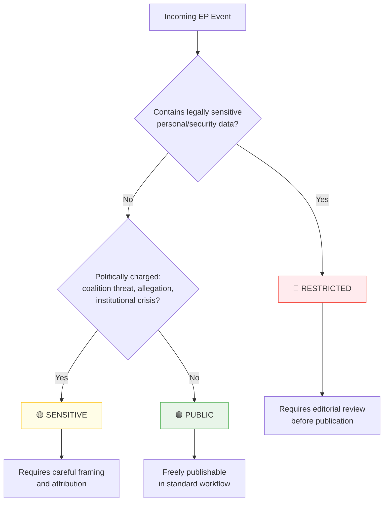

<p align="center">
  
</p>

<h1 align="center">🏷️ Political Classification Guide — European Parliament</h1>

<p align="center">
  <strong>📊 Systematic Classification of EU Parliamentary Events and Documents</strong><br>
  <em>🎯 Sensitivity · Domain Taxonomy · Urgency Matrix · Impact Assessment</em>
</p>

**📋 Document Owner:** CEO | **📄 Version:** 1.0 | **📅 Last Updated:** 2026-03-28 (UTC)
**🔄 Review Cycle:** Quarterly | **⏰ Next Review:** 2026-06-28
**🏢 Owner:** Hack23 AB (Org.nr 5595347807) | **🏷️ Classification:** Public

---

## 🎯 Purpose

This guide provides the authoritative classification methodology for European Parliament events processed by EU Parliament Monitor's agentic workflows. Classification is the **first analytical step** — all subsequent risk assessment, threat analysis, and significance scoring depend on accurate initial classification.

This methodology is inspired by [Hack23 ISMS CLASSIFICATION.md](https://github.com/Hack23/ISMS-PUBLIC/blob/main/CLASSIFICATION.md) and adapted from the [Riksdagsmonitor political classification guide](https://github.com/Hack23/riksdagsmonitor/blob/main/analysis/methodologies/political-classification-guide.md) for the EU Parliament context.

---

## 🔒 Sensitivity Levels



### 🟢 PUBLIC
Routine EP activity that is fully public record: standard committee reports, legislative resolutions passed with broad majorities, routine plenary debates, published commission proposals.

### 🟡 SENSITIVE
Events that are politically charged: coalition fractures within political groups, named MEP allegations, sensitive migration/security dimensions, significant disagreements between grand coalition partners (EPP/S&D), Article 7 proceedings, EU budget disputes.

### 🔴 RESTRICTED
Events with legal sensitivity: active fraud investigations (OLAF), personal data of private individuals, active court proceedings (CJEU), national security information affecting member states.

---

## 📋 Policy Domain Taxonomy

European Parliament domains aligned with EP committee structure:

| Code | Domain | EP Committee(s) |
|------|--------|-----------------|
| **ECON** | Economic & Monetary Affairs | ECON |
| **ITRE** | Industry, Research & Energy | ITRE |
| **INTA** | International Trade | INTA |
| **BUDG** | Budgets & Financial Framework | BUDG, CONT |
| **EMPL** | Employment & Social Affairs | EMPL |
| **ENVI** | Environment & Public Health | ENVI |
| **TRAN** | Transport & Tourism | TRAN |
| **REGI** | Regional Development | REGI |
| **AGRI** | Agriculture & Rural Development | AGRI |
| **PECH** | Fisheries | PECH |
| **CULT** | Culture & Education | CULT |
| **JURI** | Legal Affairs | JURI |
| **LIBE** | Civil Liberties & Justice | LIBE |
| **AFCO** | Constitutional Affairs | AFCO |
| **FEMM** | Gender Equality | FEMM |
| **AFET** | Foreign Affairs & Security | AFET, SEDE, DROI |
| **DEVE** | Development | DEVE |
| **PETI** | Petitions | PETI |

### Domain Assignment Rules

1. **Always assign a primary domain** — use the lead committee's domain code
2. **Secondary domains** are optional but recommended for cross-committee dossiers
3. **AFCO** takes precedence when Treaty or institutional changes are at stake
4. **AFET/SEDE** takes precedence for security/defence events
5. When in doubt, check which EP committee has the rapporteur

---

## ⏰ Urgency Matrix

| Urgency Level | EP Legislative Trigger | Real-World Trigger | Max Delay to Classify |
|--------------|----------------------|-------------------|----------------------|
| ⚪ **ROUTINE** | Written question filed; own-initiative report published | No immediate action required | 24–48 hours |
| 🔵 **ELEVATED** | Committee vote scheduled; trilogue round announced | Commission response expected within 2 weeks | 4–8 hours |
| 🟠 **URGENT** | Plenary vote within 48 hours; emergency debate called | Immediate institutional action required | 1–2 hours |
| 🔴 **CRITICAL** | Article 7 proceedings; institutional crisis; emergency session | Acute democracy/security event | Immediate |

---

## 📊 The 7 Classification Dimensions

| Dimension | What It Measures | Scale Levels |
|-----------|-----------------|-------------|
| **Public Interest Sensitivity** | Political explosiveness for citizens | explosive / sensitive / standard / routine |
| **Democratic Integrity Impact** | Threat to EU democratic processes | critical / significant / moderate / minor |
| **Policy Urgency** | Time-sensitivity for action | immediate / short-term / medium-term / long-term |
| **Economic Impact** | Fiscal/monetary consequence | transformative / major / moderate / minimal |
| **Governance Impact** | Effect on EU institutional operations | systemic / significant / procedural / routine |
| **Political Capital Impact** | Effect on political group/MEP standing | career-defining / significant / notable / negligible |
| **Legislative Impact** | Change to EU legal framework | treaty-level / directive / regulation / administrative |

### Scoring Weights

```
Public Interest Sensitivity  × 0.20
Democratic Integrity Impact  × 0.20
Policy Urgency               × 0.10
Economic Impact              × 0.15
Governance Impact            × 0.15
Political Capital Impact     × 0.10
Legislative Impact           × 0.10
────────────────────────────────────
                Total:        1.00
```

### Classification Score Thresholds

| Score Range | Classification | Editorial Action |
|------------|---------------|-----------------|
| ≥ 70 | **CRITICAL** | Immediate deep investigation; breaking news |
| ≥ 50 | **HIGH** | Priority coverage; include in daily analysis |
| ≥ 30 | **MEDIUM** | Standard coverage; monitor for escalation |
| < 30 | **LOW** | Archive; include in weekly digest if relevant |

---

## 🔍 MCP Data Sources for Classification

| EP Document Type | MCP Tool | Classification Baseline |
|-----------------|----------|----------------------|
| Adopted legislative text | `get_adopted_texts` | HIGH for directives/regulations |
| Committee report | `get_committee_documents` | MEDIUM (elevated if contested) |
| Plenary resolution | `get_plenary_documents` | HIGH if non-legislative resolution on crisis |
| Legislative procedure | `get_procedures` | Varies by stage and subject |
| MEP question | `get_parliamentary_questions` | ROUTINE (elevated for oral questions to Council) |
| Plenary speech | `get_speeches` | ROUTINE (elevated for political group leaders) |
| Voting record | `get_voting_records` | MEDIUM (elevated for roll-call on contested votes) |

---

## 🔗 Related Documents

- [templates/political-classification.md](../templates/political-classification.md) — Classification template
- [political-risk-methodology.md](political-risk-methodology.md) — Risk scoring (uses classification output)
- [political-threat-framework.md](political-threat-framework.md) — Threat analysis
- [../../docs/analysis-methodology/](../../docs/analysis-methodology/) — Higher-level methodology guides

---

**Document Control:**
- **Path:** `/analysis/methodologies/political-classification-guide.md`
- **ISMS Reference:** [CLASSIFICATION.md](https://github.com/Hack23/ISMS-PUBLIC/blob/main/CLASSIFICATION.md)
- **Adapted from:** [Riksdagsmonitor classification guide](https://github.com/Hack23/riksdagsmonitor/blob/main/analysis/methodologies/political-classification-guide.md)
- **Classification:** Public
