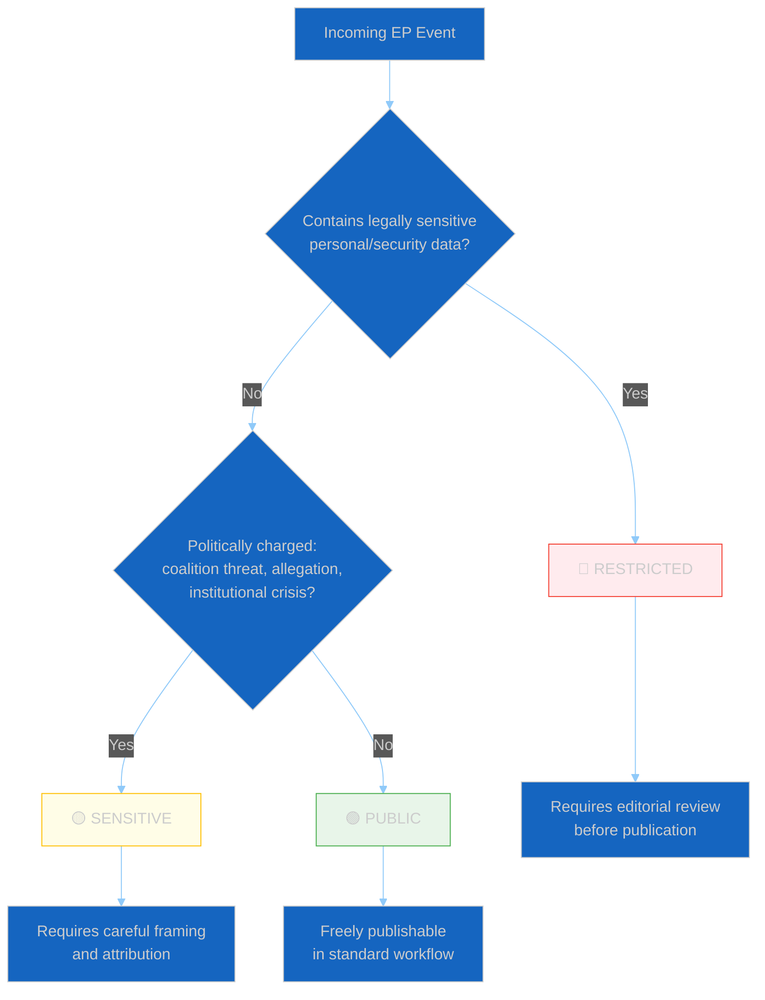
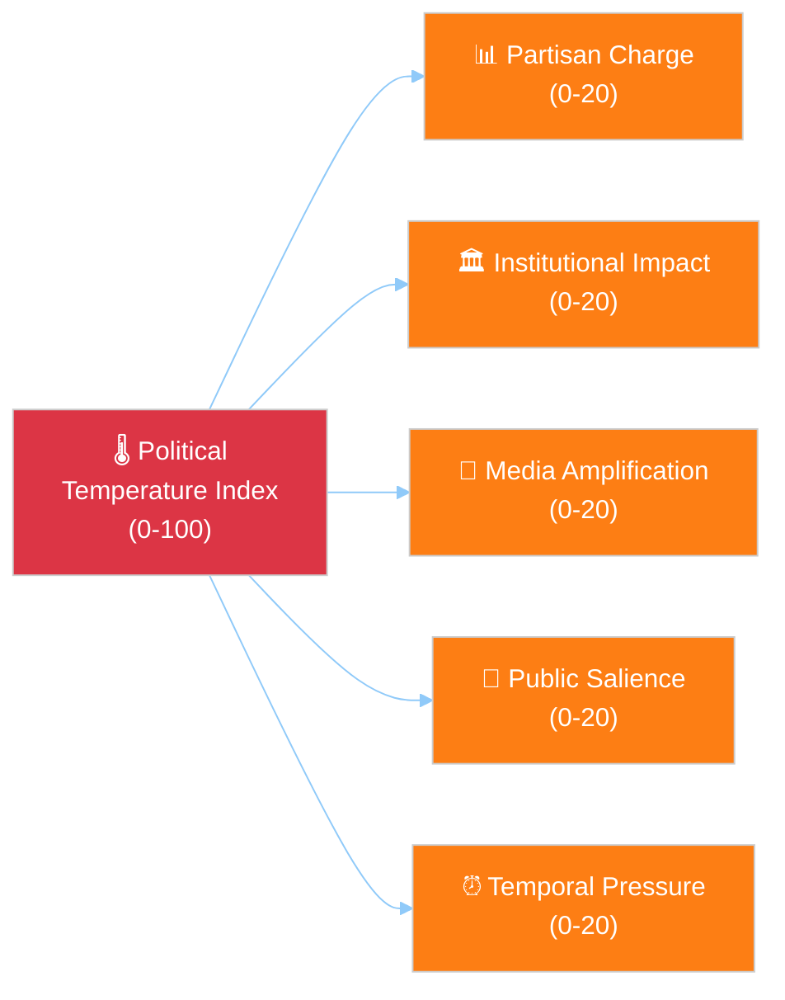

<p align="center">
  
</p>

<h1 align="center">🏷️ Political Classification Guide — European Parliament</h1>

<p align="center">
  <strong>📊 Systematic Classification of EU Parliamentary Events and Documents</strong><br>
  <em>🎯 Sensitivity · Domain Taxonomy · Urgency Matrix · Impact Assessment</em>
</p>

**📋 Document Owner:** CEO | **📄 Version:** 2.2 | **📅 Last Updated:** 2026-04-25 (UTC)
**🔄 Review Cycle:** Quarterly | **⏰ Next Review:** 2026-07-31
**🏢 Owner:** Hack23 AB (Org.nr 5595347807) | **🏷️ Classification:** Public

---

## 🎯 Purpose

This guide provides the authoritative classification methodology for European Parliament events processed by EU Parliament Monitor's agentic workflows. Classification is the **first analytical step** — all subsequent risk assessment, threat analysis, and significance scoring depend on accurate initial classification.

This methodology is inspired by [Hack23 ISMS CLASSIFICATION.md](https://github.com/Hack23/ISMS-PUBLIC/blob/main/CLASSIFICATION.md) and adapted from the [Riksdagsmonitor political classification guide](https://github.com/Hack23/riksdagsmonitor/blob/main/analysis/methodologies/political-classification-guide.md) for the EU Parliament context.

---

## 🔒 Sensitivity Levels


```mermaid
%%{init: {"theme":"dark","themeVariables":{"primaryColor":"#1565C0","primaryTextColor":"#ffffff","primaryBorderColor":"#0A3F7F","lineColor":"#90CAF9","secondaryColor":"#2E7D32","secondaryTextColor":"#ffffff","secondaryBorderColor":"#0F3F00","tertiaryColor":"#FF9800","tertiaryTextColor":"#000000","tertiaryBorderColor":"#7F4F00","mainBkg":"#1565C0","secondBkg":"#2E7D32","tertiaryBkg":"#FF9800","noteBkgColor":"#FFC107","noteTextColor":"#000000","noteBorderColor":"#7F6000","errorBkgColor":"#D32F2F","errorTextColor":"#ffffff","fontFamily":"Inter, Helvetica, Arial, sans-serif","pie1":"#1565C0","pie2":"#2E7D32","pie3":"#FF9800","pie4":"#D32F2F","pie5":"#FFC107","pie6":"#7B1FA2","pie7":"#9E9E9E","pie8":"#0288D1","pie9":"#388E3C","pie10":"#F57C00","pie11":"#C62828","pie12":"#FBC02D","pieTitleTextSize":"18px","pieSectionTextSize":"14px","pieLegendTextSize":"13px","pieStrokeColor":"#1e1e1e","pieOuterStrokeColor":"#1e1e1e","git0":"#1565C0","git1":"#2E7D32","git2":"#FF9800","git3":"#D32F2F","gitBranchLabel0":"#ffffff","gitBranchLabel1":"#ffffff","gitBranchLabel2":"#000000","gitBranchLabel3":"#ffffff","cScale0":"#1565C0","cScale1":"#2E7D32","cScale2":"#FF9800","cScale3":"#D32F2F","cScale4":"#FFC107","cScale5":"#7B1FA2","cScale6":"#9E9E9E","cScale7":"#0288D1","xyChart":{"backgroundColor":"#1e1e1e","plotColorPalette":"#1565C0,#2E7D32,#FF9800,#D32F2F,#FFC107,#7B1FA2,#9E9E9E"}}}}%%
graph TD
    A[Incoming EP Event] --> B{Contains legally sensitive<br/>personal/security data?}
    B -->|Yes| C[🔴 RESTRICTED]
    B -->|No| D{Politically charged:<br/>coalition threat, allegation,<br/>institutional crisis?}
    D -->|Yes| E[🟡 SENSITIVE]
    D -->|No| F[🟢 PUBLIC]

    C --> G[Requires editorial review<br/>before publication]
    E --> H[Requires careful framing<br/>and attribution]
    F --> I[Freely publishable<br/>in standard workflow]

    style C fill:#ffebee,stroke:#f44336
    style E fill:#fffde7,stroke:#ffc107
    style F fill:#e8f5e9,stroke:#4caf50
```

### 🟢 PUBLIC
Routine EP activity that is fully public record: standard committee reports, legislative resolutions passed with broad majorities, routine plenary debates, published commission proposals.

### 🟡 SENSITIVE
Events that are politically charged: coalition fractures within political groups, named MEP allegations, sensitive migration/security dimensions, significant disagreements between grand coalition partners (EPP/S&D), Article 7 proceedings, EU budget disputes.

### 🔴 RESTRICTED
Events with legal sensitivity: active fraud investigations (OLAF), personal data of private individuals, active court proceedings (CJEU), national security information affecting member states.

---

## 📋 Policy Domain Taxonomy

European Parliament domains aligned with EP committee structure:

| Code | Domain | EP Committee(s) |
|------|--------|-----------------|
| **ECON** | Economic & Monetary Affairs | ECON |
| **ITRE** | Industry, Research & Energy | ITRE |
| **INTA** | International Trade | INTA |
| **BUDG** | Budgets & Financial Framework | BUDG, CONT |
| **EMPL** | Employment & Social Affairs | EMPL |
| **ENVI** | Environment & Public Health | ENVI |
| **TRAN** | Transport & Tourism | TRAN |
| **REGI** | Regional Development | REGI |
| **AGRI** | Agriculture & Rural Development | AGRI |
| **PECH** | Fisheries | PECH |
| **CULT** | Culture & Education | CULT |
| **JURI** | Legal Affairs | JURI |
| **LIBE** | Civil Liberties & Justice | LIBE |
| **AFCO** | Constitutional Affairs | AFCO |
| **FEMM** | Gender Equality | FEMM |
| **AFET** | Foreign Affairs & Security | AFET, SEDE, DROI |
| **DEVE** | Development | DEVE |
| **PETI** | Petitions | PETI |

### Domain Assignment Rules

1. **Always assign a primary domain** — use the lead committee's domain code
2. **Secondary domains** are optional but recommended for cross-committee dossiers
3. **AFCO** takes precedence when Treaty or institutional changes are at stake
4. **AFET/SEDE** takes precedence for security/defence events
5. When in doubt, check which EP committee has the rapporteur

---

## ⏰ Urgency Matrix

| Urgency Level | EP Legislative Trigger | Real-World Trigger | Max Delay to Classify |
|--------------|----------------------|-------------------|----------------------|
| ⚪ **ROUTINE** | Written question filed; own-initiative report published | No immediate action required | 24–48 hours |
| 🔵 **ELEVATED** | Committee vote scheduled; trilogue round announced | Commission response expected within 2 weeks | 4–8 hours |
| 🟠 **URGENT** | Plenary vote within 48 hours; emergency debate called | Immediate institutional action required | 1–2 hours |
| 🔴 **CRITICAL** | Article 7 proceedings; institutional crisis; emergency session | Acute democracy/security event | Immediate |

---

## 📊 The 7 Classification Dimensions

| Dimension | What It Measures | Scale Levels |
|-----------|-----------------|-------------|
| **Public Interest Sensitivity** | Political explosiveness for citizens | explosive / sensitive / standard / routine |
| **Democratic Integrity Impact** | Threat to EU democratic processes | critical / significant / moderate / minor |
| **Policy Urgency** | Time-sensitivity for action | immediate / short-term / medium-term / long-term |
| **Economic Impact** | Fiscal/monetary consequence | transformative / major / moderate / minimal |
| **Governance Impact** | Effect on EU institutional operations | systemic / significant / procedural / routine |
| **Political Capital Impact** | Effect on political group/MEP standing | career-defining / significant / notable / negligible |
| **Legislative Impact** | Change to EU legal framework | treaty-level / directive / regulation / administrative |

### Scoring Weights

```
Public Interest Sensitivity  × 0.20
Democratic Integrity Impact  × 0.20
Policy Urgency               × 0.10
Economic Impact              × 0.15
Governance Impact            × 0.15
Political Capital Impact     × 0.10
Legislative Impact           × 0.10
────────────────────────────────────
                Total:        1.00
```

### Classification Score Thresholds

| Score Range | Classification | Editorial Action |
|------------|---------------|-----------------|
| ≥ 70 | **CRITICAL** | Immediate deep investigation; breaking news |
| ≥ 50 | **HIGH** | Priority coverage; include in daily analysis |
| ≥ 30 | **MEDIUM** | Standard coverage; monitor for escalation |
| < 30 | **LOW** | Archive; include in weekly digest if relevant |

---

## 🔍 MCP Data Sources for Classification

| EP Document Type | MCP Tool | Classification Baseline |
|-----------------|----------|----------------------|
| Adopted legislative text | `get_adopted_texts` | HIGH for directives/regulations |
| Committee report | `get_committee_documents` | MEDIUM (elevated if contested) |
| Plenary resolution | `get_plenary_documents` | HIGH if non-legislative resolution on crisis |
| Legislative procedure | `get_procedures` | Varies by stage and subject |
| MEP question | `get_parliamentary_questions` | ROUTINE (elevated for oral questions to Council) |
| Plenary speech | `get_speeches` | ROUTINE (elevated for political group leaders) |
| Voting record | `get_voting_records` | MEDIUM (elevated for roll-call on contested votes) |

---

## 🤖 AI Analysis Protocol for Classification

The AI agent **MUST** follow this protocol when classifying political documents:

1. **Read this guide** — understand sensitivity levels, domain taxonomy, urgency matrix
2. **Extract key fields** from the document (title, type, committee, political groups involved, date)
3. **Determine sensitivity** — PUBLIC (default), SENSITIVE (triggers apply), RESTRICTED (editorial review)
4. **Assign primary domain** + up to 2 secondary domains from the EP committee taxonomy
5. **Assess urgency** using the EP legislative calendar markers
6. **Score significance** per the 5-dimension rubric in `significance-scoring.md`

### Borderline Classification Guidance

| Scenario | Resolution |
|----------|-----------|
| SENSITIVE vs. RESTRICTED | If any single trigger exceeds threshold, classify as RESTRICTED. When in doubt, err toward higher classification. |
| ROUTINE vs. ELEVATED urgency | Check the EP plenary calendar — if within 2 weeks of a key vote, use ELEVATED. |
| Domain ambiguity | Assign the domain with strongest evidence as primary; use secondary for remaining relevance. AFCO and LIBE always take precedence when applicable. |
| Manual vs. automated divergence (>3 points) | Use the higher score and flag for editorial review. |

> **🚨 Anti-Pattern Warning:** Classification without explicit sensitivity level, domain code, and urgency is REJECTED. Every document must receive all three classifications with cited evidence.

---

## 🌡️ Advanced Dimension 1: Political Temperature Index

The Political Temperature Index (PTI) is a **composite score (0–100)** measuring how politically heated an EP event is — beyond simple sensitivity classification:


```mermaid
%%{init: {"theme":"dark","themeVariables":{"primaryColor":"#1565C0","primaryTextColor":"#ffffff","primaryBorderColor":"#0A3F7F","lineColor":"#90CAF9","secondaryColor":"#2E7D32","secondaryTextColor":"#ffffff","secondaryBorderColor":"#0F3F00","tertiaryColor":"#FF9800","tertiaryTextColor":"#000000","tertiaryBorderColor":"#7F4F00","mainBkg":"#1565C0","secondBkg":"#2E7D32","tertiaryBkg":"#FF9800","noteBkgColor":"#FFC107","noteTextColor":"#000000","noteBorderColor":"#7F6000","errorBkgColor":"#D32F2F","errorTextColor":"#ffffff","fontFamily":"Inter, Helvetica, Arial, sans-serif","pie1":"#1565C0","pie2":"#2E7D32","pie3":"#FF9800","pie4":"#D32F2F","pie5":"#FFC107","pie6":"#7B1FA2","pie7":"#9E9E9E","pie8":"#0288D1","pie9":"#388E3C","pie10":"#F57C00","pie11":"#C62828","pie12":"#FBC02D","pieTitleTextSize":"18px","pieSectionTextSize":"14px","pieLegendTextSize":"13px","pieStrokeColor":"#1e1e1e","pieOuterStrokeColor":"#1e1e1e","git0":"#1565C0","git1":"#2E7D32","git2":"#FF9800","git3":"#D32F2F","gitBranchLabel0":"#ffffff","gitBranchLabel1":"#ffffff","gitBranchLabel2":"#000000","gitBranchLabel3":"#ffffff","cScale0":"#1565C0","cScale1":"#2E7D32","cScale2":"#FF9800","cScale3":"#D32F2F","cScale4":"#FFC107","cScale5":"#7B1FA2","cScale6":"#9E9E9E","cScale7":"#0288D1","xyChart":{"backgroundColor":"#1e1e1e","plotColorPalette":"#1565C0,#2E7D32,#FF9800,#D32F2F,#FFC107,#7B1FA2,#9E9E9E"}}}}%%
graph LR
    PTI["🌡️ Political<br/>Temperature Index<br/>(0-100)"]
    PTI --> P1["📊 Partisan Charge<br/>(0-20)"]
    PTI --> P2["🏛️ Institutional Impact<br/>(0-20)"]
    PTI --> P3["📰 Media Amplification<br/>(0-20)"]
    PTI --> P4["👥 Public Salience<br/>(0-20)"]
    PTI --> P5["⏰ Temporal Pressure<br/>(0-20)"]

    style PTI fill:#dc3545,color:#fff
    style P1 fill:#fd7e14,color:#fff
    style P2 fill:#fd7e14,color:#fff
    style P3 fill:#fd7e14,color:#fff
    style P4 fill:#fd7e14,color:#fff
    style P5 fill:#fd7e14,color:#fff
```

| Temperature Component | Score Range | Assessment Criteria |
|----------------------|:----------:|---------------------|
| **Partisan Charge** | 0–20 | How divided are political groups? (0=consensus, 20=deep partisan division across EP groups) |
| **Institutional Impact** | 0–20 | Does this affect EU institutions? (0=routine, 20=inter-institutional crisis) |
| **Media Amplification** | 0–20 | Is media likely to amplify? (0=below radar, 20=front-page across member states) |
| **Public Salience** | 0–20 | Does the public care? (0=technical, 20=pocketbook/safety issue for EU citizens) |
| **Temporal Pressure** | 0–20 | How urgent is action? (0=no deadline, 20=imminent crisis or expiring legislative deadline) |

### Temperature Classification

| PTI Score | Temperature | Colour | Implication |
|:---------:|:----------:|:------:|------------|
| 0–20 | ❄️ Cold | 🔵 Blue | Routine EP activity; standard monitoring |
| 21–40 | 🌤️ Warm | 🟢 Green | Active interest; regular reporting |
| 41–60 | 🔥 Hot | 🟡 Yellow | Politically significant; priority analysis across 14 languages |
| 61–80 | 🔥🔥 Very Hot | 🟠 Orange | Crisis-adjacent; intensive monitoring and breaking news consideration |
| 81–100 | 🌋 Explosive | 🔴 Red | Constitutional/political crisis; immediate response and all-language deployment |

---

## 🎯 Advanced Dimension 2: Strategic Significance Assessment

Not all politically heated events have long-term significance, and some seemingly routine events have major strategic importance. Distinguish **news value** (short-term) from **strategic significance** (long-term):

| Dimension | News Value (Short-Term) | Strategic Significance (Long-Term) |
|-----------|------------------------|-----------------------------------|
| **Time horizon** | Today's headlines | Next 6–24 months |
| **Question** | "Will this make the news?" | "Will this change the EU political landscape?" |
| **Indicators** | Media interest, public reaction | Institutional change, precedent setting |
| **Example (high news, low strategic)** | MEP's controversial statement goes viral | Temporary embarrassment, no policy change |
| **Example (low news, high strategic)** | Technical trilogue agreement on pension portability | Quietly reshapes retirement policy for 450M EU citizens |

### Strategic Significance Score (1–5)

| Score | Level | Criteria |
|:-----:|-------|---------|
| 1 | **Ephemeral** | No lasting impact; forgotten within a week |
| 2 | **Routine** | Standard EP activity; minor adjustments |
| 3 | **Significant** | Affects a policy domain meaningfully for 6+ months |
| 4 | **Major** | Reshapes EP political dynamics; affects Grand Coalition/opposition positioning |
| 5 | **Transformative** | Changes EU governance, institutions, or democratic norms |

---

## 🧭 Advanced Dimension 3: Coalition Impact Vector

For every classified event, assess its impact on EP coalition dynamics using a **directional vector**:

| Vector | Description | Example |
|--------|------------|---------|
| **→ Stabilising** | Strengthens Grand Coalition cohesion or majority | EPP–S&D–Renew coalition secures comfortable majority on Green Deal legislation |
| **← Destabilising** | Weakens Grand Coalition cohesion or threatens majority | ECR breaks with EPP on rule of law vote, fragmenting centre-right bloc |
| **↕ Neutral** | No significant impact on coalition dynamics | Routine committee report on fisheries regulation |
| **↗ Opportunity** | Creates an opening for coalition to strengthen position | Popular digital rights initiative with cross-group support |
| **↘ Vulnerability** | Exposes coalition weakness that opposition may exploit | Budget dispute between EPP and S&D reveals structural disagreements |

---

## 🏖️ Recess-Period Event Classification Rules (New in v2.1)

During EP recess periods, the volume and nature of classifiable events changes significantly. These rules ensure consistent classification when normal parliamentary activity is paused.

### Recess-Period Urgency Adjustment

During confirmed recess periods, the urgency matrix is adjusted:

| Normal Urgency | Recess Adjustment | Rationale |
|:--------------:|:-----------------:|-----------|
| ⚪ ROUTINE | ⚪ ROUTINE (unchanged) | Routine events remain routine |
| 🔵 ELEVATED | ⚪ ROUTINE (downgrade) | No upcoming committee votes or plenary sessions to elevate urgency |
| 🟠 URGENT | 🔵 ELEVATED (downgrade) | Plenary is not in session; urgency reduced but flagged for post-recess action |
| 🔴 CRITICAL | 🔴 CRITICAL (unchanged) | Genuine crises (Article 7, institutional emergency) remain critical regardless of recess |

### Events That Still Occur During Recess

| Event Type | Classification Baseline | Recess-Specific Notes |
|-----------|:---------------------:|----------------------|
| Written parliamentary questions | ROUTINE | Filed but answers delayed; classify normally |
| Commission proposals published | Varies (use standard 7 dimensions) | Classify as normal; note "Parliament response expected post-recess" |
| Trilogue informal contacts | SENSITIVE | May continue during recess informally; classify if reported |
| External geopolitical events affecting EU | Varies | Classify using standard dimensions; note EP cannot respond until session resumes |
| MEP public statements | ROUTINE (unless coalition-relevant) | Individual statements have reduced impact during recess |
| Court of Justice rulings | Varies | Classify normally; legal effects are not paused by recess |

### Classification Anti-Patterns During Recess

| Anti-Pattern | Why Prohibited | Correct Alternative |
|-------------|---------------|-------------------|
| Classifying non-events as HIGH/CRITICAL | Inflates significance during quiet period | Apply standard 7-dimension scoring; recess events rarely score ≥ 50 |
| Ignoring events because "Parliament is in recess" | Events still have political significance even without immediate EP response | Classify normally; note temporal context |
| Using pre-recess urgency for post-recess planning | Urgency may change when Parliament reconvenes | Re-classify when session schedule is confirmed |

## 🛠️ Worked Classification Walkthroughs

The 7-dimension scoring rubric is best understood by walking through real
EP classification scenarios. Each walkthrough scores all seven dimensions
and arrives at a final classification band.

### Walkthrough 1 — AI Act Implementing Regulation, ENVI tabling

**Event**: Commission tables an implementing regulation for the AI Act
with significant EU-27-wide compliance obligations.

| Dimension | Score | Rationale |
|---|:-:|---|
| Institutional impact | 9 | EU-wide regulatory regime, all 27 MS bound |
| Coalition implications | 7 | EPP-S&D-Renew likely; Greens/EFA conditional; PfE/ESN opposed |
| Public-policy stakes | 9 | Cross-sectoral: health, finance, employment, consumer protection |
| Legal-procedural complexity | 7 | Comitology + delegated acts + national implementation |
| Time-sensitivity | 6 | 24-month implementation window; not immediate crisis |
| Stakeholder mobilisation | 8 | Industry, civil society, MS regulators, third countries |
| Geopolitical resonance | 8 | Brussels-effect on US, UK, JPN regulatory frameworks |

**Total**: 54 / 70 → **Tier-1 SIGNIFICANT** classification.
**Urgency**: 🟠 URGENT (tabling triggers 2-month response window).
**Sensitivity**: SENSITIVE — coalition arithmetic public, internal whip
positions are confidential.

### Walkthrough 2 — MEP press statement on enlargement

**Event**: Three EPP MEPs publish a joint open letter calling for
accelerated UKR accession track.

| Dimension | Score | Rationale |
|---|:-:|---|
| Institutional impact | 2 | No procedural standing; press only |
| Coalition implications | 4 | EPP-internal signal but limited reach |
| Public-policy stakes | 5 | Touches enlargement but no procedural follow-through |
| Legal-procedural complexity | 1 | None — a statement, not a motion |
| Time-sensitivity | 3 | Press cycle relevance only |
| Stakeholder mobilisation | 3 | Civil society uptake limited |
| Geopolitical resonance | 6 | Resonates with Russian / US framing |

**Total**: 24 / 70 → **Tier-3 ROUTINE** classification (likely Tier-4 if
no media uptake within 48h). **Urgency**: 🔵 ELEVATED.
**Sensitivity**: PUBLIC.

### Walkthrough 3 — Trilogue collapse on Critical Raw Materials Act

**Event**: Council position diverges from EP mandate; trilogue suspended.

| Dimension | Score | Rationale |
|---|:-:|---|
| Institutional impact | 8 | Negotiation breakdown affects Council-EP balance |
| Coalition implications | 6 | EP rapporteur (S&D) under coalition pressure |
| Public-policy stakes | 8 | Strategic-autonomy file, supply-chain stakes |
| Legal-procedural complexity | 8 | Conciliation procedure may be triggered |
| Time-sensitivity | 8 | Window before recess closes; presidency change ahead |
| Stakeholder mobilisation | 7 | Industry lobbying intense; trade unions engaged |
| Geopolitical resonance | 7 | China-EU rare-earths context |

**Total**: 52 / 70 → **Tier-1 SIGNIFICANT**. **Urgency**: 🔴 CRITICAL
trilogue collapse with shrinking calendar window. **Sensitivity**:
RESTRICTED (internal positions in conciliation are confidential).

### Walkthrough 4 — Routine ENVI committee adoption

**Event**: ENVI adopts amendments to a non-controversial revision of an
existing directive (e.g. minor technical update to fluorinated-gas rules).

| Dimension | Score | Rationale |
|---|:-:|---|
| Institutional impact | 3 | Procedural step, not the headline vote |
| Coalition implications | 2 | Cross-coalition consensus expected |
| Public-policy stakes | 3 | Technical update; limited downstream effects |
| Legal-procedural complexity | 4 | Multiple amendments but no controversy |
| Time-sensitivity | 2 | Standard schedule |
| Stakeholder mobilisation | 2 | Sectoral interest only |
| Geopolitical resonance | 1 | Negligible |

**Total**: 17 / 70 → **Tier-4 BACKGROUND**. **Urgency**: ⚪ ROUTINE.
**Sensitivity**: PUBLIC.

## 📐 Border-line cases — when scoring straddles tiers

Score totals near tier boundaries (47-50 between Tier-1 and Tier-2; 28-32
between Tier-2 and Tier-3) are common. Use the **tie-break rule**:

1. **If any dimension scores ≥ 8**, escalate one tier upward.
2. **If three or more dimensions score ≥ 7**, escalate one tier upward.
3. **If urgency is 🔴 CRITICAL**, classification is at minimum Tier-1
   regardless of total.
4. **If sensitivity is RESTRICTED**, classification is at minimum
   Tier-2 regardless of total.

These rules prevent under-classification of asymmetric events (one
dimension dominates) and align with the political-significance rubric in
[`political-style-guide.md §Significance Bands`](political-style-guide.md).

## 🛂 Cross-border events — special handling

Events originating outside EU institutions (third-country actions,
geopolitical shifts, court rulings, ECB decisions) must still be classified
when they impact EP work. The 7-dimension rubric applies, with these
adjustments:

| Event class | Dimension adjustments |
|---|---|
| Court of Justice ruling | "Legal-procedural complexity" anchored at +2 (binding effect); "Institutional impact" depends on which institution is bound |
| ECB monetary decision | "Public-policy stakes" anchored at +1 (every member state's economy); "Coalition implications" usually 0 (ECB independence) |
| Third-country act (e.g. US tariff) | "Geopolitical resonance" is the lead dimension; "Stakeholder mobilisation" varies with industry exposure |
| Member-state election | Weight to "Coalition implications" if it changes EP party arithmetic (Eurosceptic / pro-EU shift) |
| Treaty-change proposal | Always Tier-1 regardless of sub-scores; institutional-impact cap removed |

## ⚠️ Urgent procedure (Rule 163) — auto-classification triggers

EP Rule 163 ("urgent procedure") accelerates a file's calendar to a single
plenary. When urgent procedure is invoked, classification jumps to:

- **Urgency**: minimum 🟠 URGENT
- **Tier**: minimum Tier-2
- **Time-sensitivity dimension**: minimum 7

If the file is also Article-7 / treaty-change / sanctions-related, the
combined effect is Tier-1 / 🔴 CRITICAL automatically.

## 🧪 Anti-patterns — classification errors to avoid

| Anti-pattern | Why prohibited | Correct alternative |
|---|---|---|
| Scoring without naming the dimension | Stage-C cannot validate | Use the 7-dimension table; cite each cell |
| Classifying without procedure code | No anchor for re-classification | Cite procedure code or event ID |
| Inflating to Tier-1 for press-release events | Loses meaning of Tier-1 | Apply rubric strictly; press → Tier-3 |
| Using "MEDIUM" / "HIGH" without tier number | Imprecise | Use Tier-1 to Tier-4 nomenclature |
| Single-dimension classification | Ignores 6 other dimensions | All 7 dimensions must be scored |
| Classifying recess events using session rubric | Recess-adjustment rules ignored | Apply §Recess-Period Urgency Adjustment |
| Re-classifying mid-run | Breaks reproducibility | Lock classification at Pass-2; document drift in next run |
| "Cannot classify yet" excuses | Stage-C blocker | Classify with low confidence; document confidence label |
| Mixing significance and urgency | They are orthogonal | Score significance (1-70) AND urgency (4 bands) separately |
| Ignoring sensitivity dimension | RESTRICTED facts leak | Always tag PUBLIC / SENSITIVE / RESTRICTED |

---

## 🔗 Related Documents

- [templates/political-classification.md](../templates/political-classification.md) — Classification template
- [templates/per-file-political-intelligence.md](../templates/per-file-political-intelligence.md) — Per-file template with classification section
- [political-risk-methodology.md](political-risk-methodology.md) — Risk scoring (uses classification output)
- [political-threat-framework.md](political-threat-framework.md) — Multi-framework threat analysis
- [reference/isms-classification-adaptation.md](../reference/isms-classification-adaptation.md) — ISMS mapping
- [ai-driven-analysis-guide.md](ai-driven-analysis-guide.md) — Per-file analysis protocol

---

**Document Control:**
- **Path:** `/analysis/methodologies/political-classification-guide.md`
- **ISMS Reference:** [CLASSIFICATION.md](https://github.com/Hack23/ISMS-PUBLIC/blob/main/CLASSIFICATION.md)
- **Adapted from:** [Riksdagsmonitor classification guide](https://github.com/Hack23/riksdagsmonitor/blob/main/analysis/methodologies/political-classification-guide.md)
- **Classification:** Public
