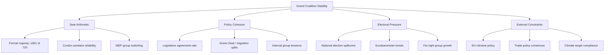

  

<h1 align="center">⚠️ Political Risk Assessment Methodology — European Parliament</h1>

  <strong>📊 Likelihood × Impact Scoring for EU Parliamentary Risk</strong> 
  <em>🎯 Coalition · Policy · Budget · Institutional · Geopolitical Risk Quantification</em>

**📋 Document Owner:** CEO | **📄 Version:** 1.0 | **📅 Last Updated:** 2026-03-28 (UTC)
**🔄 Review Cycle:** Quarterly | **⏰ Next Review:** 2026-06-28
**🏢 Owner:** Hack23 AB (Org.nr 5595347807) | **🏷️ Classification:** Public

---

## 🎯 Purpose

This methodology provides the authoritative framework for political risk assessment in EU Parliament Monitor's analytical workflows. It adapts the quantitative Likelihood × Impact approach from [Hack23 ISMS Risk_Assessment_Methodology.md](https://github.com/Hack23/ISMS-PUBLIC/blob/main/Risk_Assessment_Methodology.md) to the dynamics of the European Parliament.

---

## 📐 Core Methodology: Likelihood × Impact

All political risks are scored using a **5×5 matrix**. Risk Score = Likelihood × Impact.

### Likelihood Scale (1–5)

| Score | Label | Definition | EP Parliamentary Analogy |
|:-----:|-------|------------|------------------------|
| 1 | **Rare** | <5% probability | Grand coalition collapse with 400+ seat combined majority |
| 2 | **Unlikely** | 5–20% probability | Budget vote fails despite EPP-S&D agreement |
| 3 | **Possible** | 21–40% probability | ECR defects on single non-budget vote |
| 4 | **Likely** | 41–70% probability | Political group files resolution of censure when polls shift |
| 5 | **Almost Certain** | >70% probability | Commission proposes annual work programme in October |

### Impact Scale (1–5)

| Score | Label | Definition | EP Political Example |
|:-----:|-------|------------|---------------------|
| 1 | **Negligible** | Routine disruption | Minor committee delay |
| 2 | **Minor** | Moderate disruption | Single legislative report rejected; rapporteur reassigned |
| 3 | **Moderate** | Significant disruption | Major trilogue amendment forced by Parliament |
| 4 | **Major** | Severe disruption | Commissioner forced to withdraw; interinstitutional crisis |
| 5 | **Severe** | Institutional crisis | Motion of censure succeeds; Commission falls |

### Risk Matrix

| Score | Tier | Colour | Action |
|:-----:|------|--------|--------|
| 1–4 | **Low** | 🟢 | Monitor; mention in weekly digest |
| 5–9 | **Medium** | 🟡 | Active monitoring; flag in daily analysis |
| 10–14 | **High** | 🟠 | Priority assessment; include in news articles |
| 15–25 | **Critical** | 🔴 | Immediate analysis; breaking news consideration |

---

## 🏛️ Six EP Political Risk Categories

| Category | Failure Mode | Key Indicators |
|----------|-------------|---------------|
| **grand-coalition-stability** | EPP-S&D-Renew majority fracture | Voting cohesion scores, roll-call defections, group switching |
| **policy-implementation** | Legislative file stalls or fails | Trilogue breakdowns, committee rejections, Council blocking |
| **institutional-integrity** | EU democratic norm erosion | Article 7, Rule of Law Conditionality, EP-Council conflicts |
| **economic-governance** | EU fiscal framework stress | MFF disputes, NextGenEU, Stability Pact breaches |
| **social-cohesion** | Societal division across member states | East-West/North-South splits, migration, energy policy |
| **geopolitical-standing** | EU external position weakening | Trade disputes, sanctions disagreements, NATO-EU coordination |

---

## 📊 Risk Scoring

Political risks in this methodology are **only** scored using the 1–25 **Likelihood × Impact** matrix defined above.

All dashboards, templates, and analyses MUST use:
- The 1–5 Likelihood scale
- The 1–5 Impact scale
- The resulting 1–25 Risk Score with the Low/Medium/High/Critical bands in the Risk Matrix table

No alternative 0–100 scaling or separate threshold system is used in this methodology.

---

## 🤝 Grand Coalition Stability Risk

The grand coalition (EPP + S&D + Renew) holds ~400 of 720 seats. Its stability is the most politically distinctive risk type.

### Stability Factors

---

## 📊 Calibration Examples

| Scenario | Likelihood | Impact | Score | Tier | Rationale |
|----------|:----------:|:------:|:-----:|------|-----------|
| ECR conditionally supports von der Leyen initiative | 4 | 4 | 16 | 🔴 Critical | Frequent pattern; major governance impact |
| Renew exits grand coalition over migration | 2 | 5 | 10 | 🟠 High | Historically rare; would fracture majority |
| Minor committee report delayed | 1 | 1 | 1 | 🟢 Low | Routine; no political consequence |
| Plenary adopts resolution with expected margin | 4 | 1 | 4 | 🟢 Low | Likely but low-impact routine event |
| Motion of censure against Commission | 1 | 5 | 5 | 🟡 Medium | Very rare; catastrophic if passed |
| New Commission proposal on AI regulation | 4 | 3 | 12 | 🟠 High | Likely publication; major policy implications |
| Article 7 proceedings escalation | 2 | 5 | 10 | 🟠 High | Unlikely but severe institutional impact |

---

## 🔍 MCP Data Sources for Risk Assessment

| Risk Category | Primary MCP Tools | Query Strategy |
|--------------|-------------------|---------------|
| Grand coalition stability | `analyze_voting_patterns`, `analyze_coalition_dynamics` | Track EPP-S&D-Renew voting cohesion |
| Policy implementation | `get_procedures`, `track_legislation` | Monitor trilogue progress, committee votes |
| Institutional integrity | `detect_voting_anomalies`, `get_parliamentary_questions` | Track Article 7 references, rule of law |
| Economic governance | `get_adopted_texts`, World Bank data | MFF implementation, economic indicators |
| Social cohesion | `get_speeches`, `get_voting_records` | East-West vote splits, migration debates |
| Geopolitical standing | `get_plenary_documents`, `search_documents` | Foreign affairs resolutions, trade votes |

---

## 🔗 Related Documents

- [templates/risk-assessment.md](../templates/risk-assessment.md) — Risk assessment template
- [political-threat-framework.md](political-threat-framework.md) — Complementary threat analysis
- [political-classification-guide.md](political-classification-guide.md) — Classification (risk input)

---

**Document Control:**
- **Path:** `/analysis/methodologies/political-risk-methodology.md`
- **ISMS Reference:** [Risk_Assessment_Methodology.md](https://github.com/Hack23/ISMS-PUBLIC/blob/main/Risk_Assessment_Methodology.md)
- **Adapted from:** [Riksdagsmonitor risk methodology](https://github.com/Hack23/riksdagsmonitor/blob/main/analysis/methodologies/political-risk-methodology.md)
- **Classification:** Public
