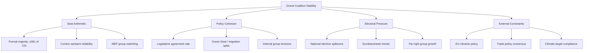
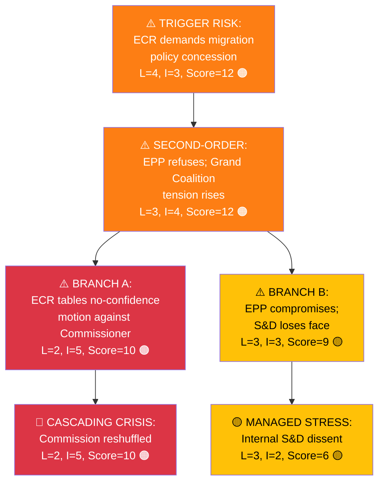
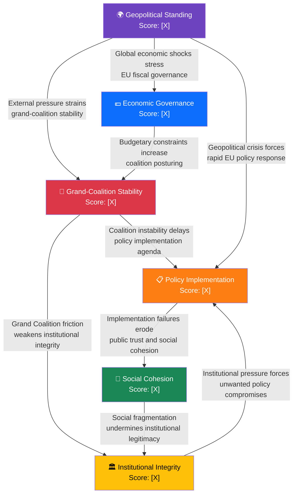
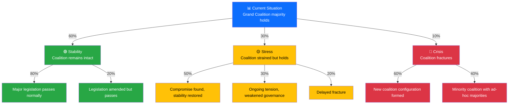

  

<h1 align="center">⚠️ Political Risk Assessment Methodology — European Parliament</h1>

  <strong>📊 Likelihood × Impact Scoring for EU Parliamentary Risk</strong> 
  <em>🎯 Coalition · Policy · Budget · Institutional · Geopolitical Risk Quantification</em>

**📋 Document Owner:** CEO | **📄 Version:** 1.0 | **📅 Last Updated:** 2026-03-28 (UTC)
**🔄 Review Cycle:** Quarterly | **⏰ Next Review:** 2026-06-28
**🏢 Owner:** Hack23 AB (Org.nr 5595347807) | **🏷️ Classification:** Public

---

## 🎯 Purpose

This methodology provides the authoritative framework for political risk assessment in EU Parliament Monitor's analytical workflows. It adapts the quantitative Likelihood × Impact approach from [Hack23 ISMS Risk_Assessment_Methodology.md](https://github.com/Hack23/ISMS-PUBLIC/blob/main/Risk_Assessment_Methodology.md) to the dynamics of the European Parliament.

---

## 📐 Core Methodology: Likelihood × Impact

All political risks are scored using a **5×5 matrix**. Risk Score = Likelihood × Impact.

### Likelihood Scale (1–5)

| Score | Label | Definition | EP Parliamentary Analogy |
|:-----:|-------|------------|------------------------|
| 1 | **Rare** | <5% probability | Grand coalition collapse with 400+ seat combined majority |
| 2 | **Unlikely** | 5–20% probability | Budget vote fails despite EPP-S&D agreement |
| 3 | **Possible** | 21–40% probability | ECR defects on single non-budget vote |
| 4 | **Likely** | 41–70% probability | Political group files resolution of censure when polls shift |
| 5 | **Almost Certain** | >70% probability | Commission proposes annual work programme in October |

### Impact Scale (1–5)

| Score | Label | Definition | EP Political Example |
|:-----:|-------|------------|---------------------|
| 1 | **Negligible** | Routine disruption | Minor committee delay |
| 2 | **Minor** | Moderate disruption | Single legislative report rejected; rapporteur reassigned |
| 3 | **Moderate** | Significant disruption | Major trilogue amendment forced by Parliament |
| 4 | **Major** | Severe disruption | Commissioner forced to withdraw; interinstitutional crisis |
| 5 | **Severe** | Institutional crisis | Motion of censure succeeds; Commission falls |

### Risk Matrix

| Score | Tier | Colour | Action |
|:-----:|------|--------|--------|
| 1–4 | **Low** | 🟢 | Monitor; mention in weekly digest |
| 5–9 | **Medium** | 🟡 | Active monitoring; flag in daily analysis |
| 10–14 | **High** | 🟠 | Priority assessment; include in news articles |
| 15–25 | **Critical** | 🔴 | Immediate analysis; breaking news consideration |

---

## 🏛️ Six EP Political Risk Categories

| Category | Failure Mode | Key Indicators |
|----------|-------------|---------------|
| **grand-coalition-stability** | EPP-S&D-Renew majority fracture | Voting cohesion scores, roll-call defections, group switching |
| **policy-implementation** | Legislative file stalls or fails | Trilogue breakdowns, committee rejections, Council blocking |
| **institutional-integrity** | EU democratic norm erosion | Article 7, Rule of Law Conditionality, EP-Council conflicts |
| **economic-governance** | EU fiscal framework stress | MFF disputes, NextGenEU, Stability Pact breaches |
| **social-cohesion** | Societal division across member states | East-West/North-South splits, migration, energy policy |
| **geopolitical-standing** | EU external position weakening | Trade disputes, sanctions disagreements, NATO-EU coordination |

---

## 📊 Risk Scoring

Political risks in this methodology are **only** scored using the 1–25 **Likelihood × Impact** matrix defined above.

All dashboards, templates, and analyses MUST use:
- The 1–5 Likelihood scale
- The 1–5 Impact scale
- The resulting 1–25 Risk Score with the Low/Medium/High/Critical bands in the Risk Matrix table

No alternative 0–100 scaling or separate threshold system is used in this methodology.

---

## 🤝 Grand Coalition Stability Risk

The grand coalition (EPP + S&D + Renew) holds ~400 of 720 seats. Its stability is the most politically distinctive risk type.

### Stability Factors

---

## 📊 Calibration Examples

| Scenario | Likelihood | Impact | Score | Tier | Rationale |
|----------|:----------:|:------:|:-----:|------|-----------|
| ECR conditionally supports von der Leyen initiative | 4 | 4 | 16 | 🔴 Critical | Frequent pattern; major governance impact |
| Renew exits grand coalition over migration | 2 | 5 | 10 | 🟠 High | Historically rare; would fracture majority |
| Minor committee report delayed | 1 | 1 | 1 | 🟢 Low | Routine; no political consequence |
| Plenary adopts resolution with expected margin | 4 | 1 | 4 | 🟢 Low | Likely but low-impact routine event |
| Motion of censure against Commission | 1 | 5 | 5 | 🟡 Medium | Very rare; catastrophic if passed |
| New Commission proposal on AI regulation | 4 | 3 | 12 | 🟠 High | Likely publication; major policy implications |
| Article 7 proceedings escalation | 2 | 5 | 10 | 🟠 High | Unlikely but severe institutional impact |

---

## 🔍 MCP Data Sources for Risk Assessment

| Risk Category | Primary MCP Tools | Query Strategy |
|--------------|-------------------|---------------|
| Grand coalition stability | `analyze_voting_patterns`, `analyze_coalition_dynamics` | Track EPP-S&D-Renew voting cohesion |
| Policy implementation | `get_procedures`, `track_legislation` | Monitor trilogue progress, committee votes |
| Institutional integrity | `detect_voting_anomalies`, `get_parliamentary_questions` | Track Article 7 references, rule of law |
| Economic governance | `get_adopted_texts`, World Bank data | MFF implementation, economic indicators |
| Social cohesion | `get_speeches`, `get_voting_records` | East-West vote splits, migration debates |
| Geopolitical standing | `get_plenary_documents`, `search_documents` | Foreign affairs resolutions, trade votes |

---

## 🤖 AI Analysis Protocol for Risk Assessment

The AI agent **MUST** follow this protocol when performing risk assessment:

1. **Read this methodology** — understand the 5×5 matrix, calibration examples, and EU-specific factors
2. **Query EP MCP tools** for evidence:
   - `analyze_coalition_dynamics` — current grand coalition cohesion
   - `get_voting_records` + `analyze_voting_patterns` — recent vote margins and group alignment
   - `track_legislation` — legislative pipeline bottlenecks
   - `get_parliamentary_questions` — oversight activity patterns
   - World Bank data — economic context for budget and electoral risk
3. **Score each risk dimension** using the 5×5 matrix with evidence citations
4. **Apply calibration** — compare against the calibration examples above
5. **Assign overall risk level** — weighted: Grand Coalition 0.30, Policy 0.25, Budget 0.20, Electoral 0.15, External 0.10
6. **Integrate with threat analysis** — risk scores ≥10 should trigger multi-framework threat assessment per [political-threat-framework.md](political-threat-framework.md)

### Risk-to-SWOT Integration

Risk assessment results feed directly into SWOT analysis:
- **Risk Score ≥ 15 (Critical)** → SWOT Threat entry (HIGH confidence, HIGH impact)
- **Risk Score 10–14 (High)** → SWOT Threat or Weakness entry (MEDIUM+ confidence)
- **Risk Score 5–9 (Medium)** → SWOT Weakness or Threat entry (flag for monitoring)
- **Risk Score 1–4 (Low)** → Informational only; no SWOT entry required

> **🚨 Anti-Pattern Warning:** Generic risk statements like "medium risk" without specific scores, evidence, or calibration examples are REJECTED. Every risk must have a Likelihood × Impact score with cited evidence.

---

## 🔗 Advanced Technique 1: Cascading Risk Analysis

Political risks rarely occur in isolation. A **cascading risk chain** models how one risk event triggers subsequent risks:

### Cascading Risk Construction Protocol

1. **Identify trigger risk** — the initial event that starts the chain
2. **Map first-order consequences** — what happens immediately if the trigger occurs?
3. **Map second-order consequences** — what happens as a result of the first-order effects?
4. **Identify branching points** — where does the chain split into alternative paths?
5. **Score each node** independently using the 5×5 matrix
6. **Assess cumulative chain risk** — compare alternative paths using the node Likelihood × Impact scores and qualitative judgement; do not multiply the 1–5 Likelihood scores as if they were precise probabilities
7. **Identify circuit breakers** — what intervention could stop the chain at each stage?

### Cascading Risk Table Template

| Chain Stage | Risk Event | Likelihood | Impact | Score | Circuit Breaker |
|:-----------:|-----------|:----------:|:------:|:-----:|----------------|
| Trigger | `[Initial event]` | `[1-5]` | `[1-5]` | `[L×I]` | `[What stops it here?]` |
| 1st Order | `[Immediate consequence]` | `[1-5]` | `[1-5]` | `[L×I]` | `[Intervention point]` |
| 2nd Order | `[Follow-on effect]` | `[1-5]` | `[1-5]` | `[L×I]` | `[Intervention point]` |
| Terminal | `[Final outcome]` | `[1-5]` | `[1-5]` | `[L×I]` | `[Recovery action]` |

---

## 📊 Advanced Technique 2: Bayesian Updating for Risk Scores

Political risk scores should be **updated** as new evidence arrives, not just recalculated from scratch. Bayesian updating provides a disciplined framework:

### Update Protocol

| Step | Action | Example |
|:----:|--------|---------|
| 1 | **Start with prior** — the current risk score based on existing evidence | "Grand Coalition collapse risk: L=2, I=5, Score=10 (prior)" |
| 2 | **New evidence arrives** — an MCP-observable event changes the picture | "ECR publicly demands migration concession (MCP: adopted text AT-2026-0123)" |
| 3 | **Assess evidence strength** — how much should this shift the score? | Strong evidence (official EP resolution) → adjust by +1 on likelihood |
| 4 | **Update score** — adjust likelihood and/or impact based on evidence | "Grand Coalition collapse risk: L=3, I=5, Score=15 (posterior)" |
| 5 | **Document the update** — record prior, evidence, and posterior | "Prior 10 → Evidence: ECR adopted text → Posterior 15 (+5)" |

### Evidence Strength Table

| Evidence Type | Likelihood Adjustment | Example |
|-------------|:---------------------:|---------|
| Official EP adopted text / roll-call vote result | ±1 to ±2 | Roll-call vote passes/fails |
| Named MEP or political group public statement | ±1 | EPP group leader demands concession |
| Verified media report with named sources | ±1 | Politico reports trilogue stalled |
| Single unnamed source | ±1 | "Sources say Commissioner may resign" |
| Statistical data (Eurostat, World Bank) | ±1 | GDP growth data, unemployment change |

---

## 🔗 Advanced Technique 3: Risk Interconnection Mapping

Political risks are **interconnected** — coalition risk affects legislative risk, which affects institutional credibility risk. Map these connections to understand system-level vulnerability:

### Interconnection Strength Assessment

| From → To | Connection Strength | Mechanism | Evidence |
|:---------:|:-------------------:|-----------|---------|
| Grand-Coalition → Policy | **Strong** | Legislative agenda requires coalition majority | `[vote records via get_voting_records]` |
| Grand-Coalition → Institutional | **Strong** | EU institutional functioning depends on EP coalition cooperation | `[committee composition via get_committee_info]` |
| Policy → Social Cohesion | **Medium** | Policy success/failure affects citizen trust | `[Eurobarometer data]` |
| Geopolitical → Policy | **Medium** | External pressures constrain legislative calendar | `[EU Council positions]` |
| Geopolitical → Economic | **Medium** | Global shocks stress EU fiscal governance | `[World Bank economic data]` |
| Economic → Grand-Coalition | **Medium** | Budgetary constraints increase coalition posturing | `[MFF debates, budget votes]` |
| Social Cohesion → Institutional | **Medium** | Social fragmentation undermines institutional legitimacy | `[EP participation data, speeches]` |

**System-Level Risk Assessment:** When ≥3 risk categories score ≥10 (High), the system is in a **fragile state** where any single trigger event could cascade across multiple risk dimensions simultaneously.

---

## 🌳 Advanced Technique 4: Scenario Tree Analysis

For complex risk situations with multiple branching points, construct a **scenario tree** showing probability-weighted outcomes:

### Scenario Tree Table

| Path | Probability | Outcome | Key Trigger | Watch Indicator |
|------|:----------:|---------|------------|----------------|
| Stability → Passes | 48% (60%×80%) | Normal governance continues | EPP–S&D confirm legislative agreement | Joint political group statement |
| Stability → Amended | 12% (60%×20%) | Minor adjustments, governance continues | Partial group objections | Committee amendment volume |
| Stress → Compromise | 15% (30%×50%) | Short-term disruption resolved | Public negotiation succeeds | Trilogue progress reports |
| Crisis → New coalition | 6% (10%×60%) | Coalition reconfigured, EU governance adapts | Grand Coalition collapse triggers realignment | No-confidence motion result |
| Crisis → Minority | 4% (10%×40%) | Ad-hoc legislative majorities | No stable coalition possible | EP vote fragmentation patterns |

---

## 🔗 Related Documents

- [templates/risk-assessment.md](../templates/risk-assessment.md) — Risk assessment template
- [templates/per-file-political-intelligence.md](../templates/per-file-political-intelligence.md) — Per-file template with risk section
- [political-threat-framework.md](political-threat-framework.md) — Complementary threat analysis (multi-framework)
- [political-classification-guide.md](political-classification-guide.md) — Classification (risk input)
- [reference/isms-risk-assessment-adaptation.md](../reference/isms-risk-assessment-adaptation.md) — ISMS mapping
- [ai-driven-analysis-guide.md](ai-driven-analysis-guide.md) — Per-file analysis protocol

---

**Document Control:**
- **Path:** `/analysis/methodologies/political-risk-methodology.md`
- **ISMS Reference:** [Risk_Assessment_Methodology.md](https://github.com/Hack23/ISMS-PUBLIC/blob/main/Risk_Assessment_Methodology.md)
- **Adapted from:** [Riksdagsmonitor risk methodology](https://github.com/Hack23/riksdagsmonitor/blob/main/analysis/methodologies/political-risk-methodology.md)
- **Classification:** Public
