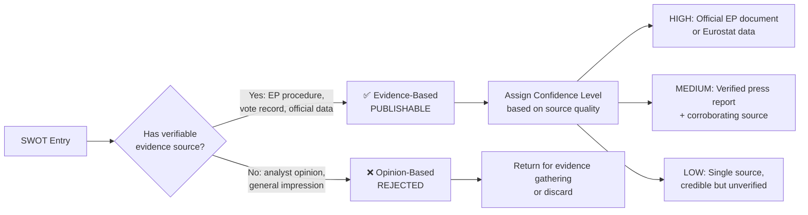
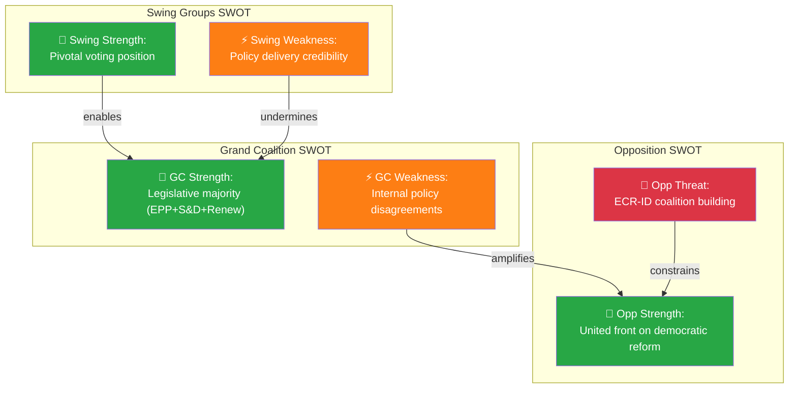
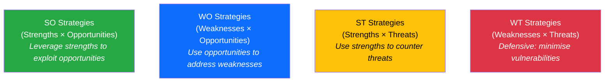
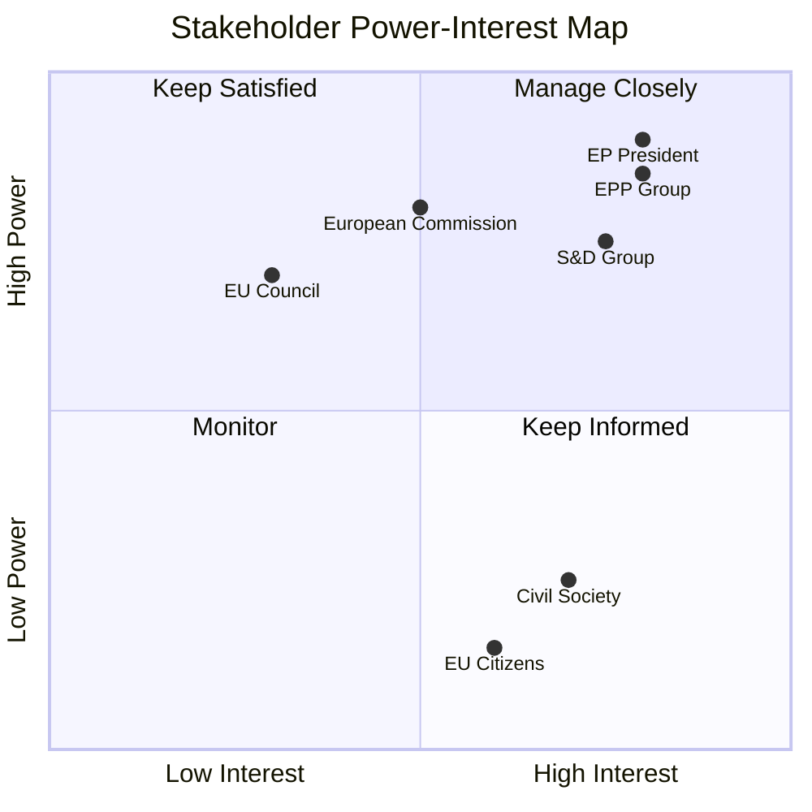

  

<h1 align="center">💼 Political SWOT Analysis Framework — European Parliament</h1>

  <strong>📊 Evidence-Based SWOT Methodology for EU Political Intelligence</strong> 
  <em>🎯 MCP Sources · Confidence Levels · Aggregation · Temporal Decay</em>

**📋 Document Owner:** CEO | **📄 Version:** 2.0 | **📅 Last Updated:** 2026-03-31 (UTC)
**🔄 Review Cycle:** Quarterly | **⏰ Next Review:** 2026-06-30
**🏢 Owner:** Hack23 AB (Org.nr 5595347807) | **🏷️ Classification:** Public

---

## 🎯 Purpose

This framework establishes the evidence-based SWOT analysis methodology for EU Parliament Monitor. Unlike traditional opinion-based SWOT, this methodology requires **verifiable evidence** for every entry — either an EP document reference, named primary source, or official data source.

This methodology is inspired by [CIA platform SWOT.md](https://github.com/Hack23/cia/blob/master/SWOT.md) and the [Riksdagsmonitor SWOT framework](https://github.com/Hack23/riksdagsmonitor/blob/main/analysis/methodologies/political-swot-framework.md), adapted for EU Parliament political intelligence.

---

## 📐 Evidence-Based vs. Opinion-Based SWOT

### Evidence Hierarchy (by confidence level)

| Confidence | Acceptable Sources | MCP Tool |
|:----------:|-------------------|----------|
| **HIGH** | Official EP adopted text, legislative resolution | `get_adopted_texts`, `get_procedures` |
| **HIGH** | Verified roll-call voting record | `get_voting_records`, `analyze_voting_patterns` |
| **HIGH** | Eurostat/World Bank official statistics | World Bank MCP tools |
| **MEDIUM** | Commission communication or proposal | `get_external_documents`, `search_documents` |
| **MEDIUM** | Named MEP speech in plenary record | `get_speeches` |
| **MEDIUM** | Verified major media outlet with named sources | External verification |
| **LOW** | Single unnamed source | — (flag for verification) |
| **REJECTED** | Analyst inference without evidence | — |

---

## 📊 MCP Data Sources for Each Quadrant

### ✅ Strengths — Optimal MCP Sources

Strengths are demonstrated by **legislative achievements** and **institutional cohesion**:

| Strength Type | MCP Tool | Query Strategy |
|--------------|----------|---------------|
| Legislative achievement | `get_adopted_texts` | Filter by type=legislative resolution, status=adopted |
| Grand coalition cohesion | `analyze_coalition_dynamics` | EPP+S&D+Renew voting alignment rate |
| Committee productivity | `analyze_committee_activity` | Output rate, report adoption rate |
| EP institutional authority | `get_procedures` | Successful co-decision files vs. Council |
| International engagement | `search_documents` | AFET/INTA resolutions with broad support |

### ⚠️ Weaknesses — Optimal MCP Sources

| Weakness Type | MCP Tool | Query Strategy |
|--------------|----------|---------------|
| Political group fragmentation | `detect_voting_anomalies` | Intra-group defection rates |
| Legislative pipeline stalls | `monitor_legislative_pipeline` | Stalled procedures, bottleneck index |
| Low MEP engagement | `track_mep_attendance` | Attendance rates below thresholds |
| EP-Council deadlocks | `track_legislation` | Procedures stuck in trilogue >12 months |
| Public trust deficit | Eurobarometer / World Bank data | Turnout trends, satisfaction metrics |

### 🚀 Opportunities — Optimal MCP Sources

| Opportunity Type | MCP Tool | Query Strategy |
|-----------------|----------|---------------|
| Pending landmark legislation | `get_procedures` | Key files approaching plenary vote |
| Cross-party consensus building | `analyze_coalition_dynamics` | High cohesion votes across 4+ groups |
| New Commission proposals | `get_external_documents` | Recent Commission proposals with EP support |
| Institutional reform windows | `search_documents` | AFCO reports on Treaty changes |
| Green Deal implementation | `get_adopted_texts` | Climate/environment legislation progress |

### 🔴 Threats — Optimal MCP Sources

| Threat Type | MCP Tool | Query Strategy |
|------------|----------|---------------|
| Far-right group growth | `compare_political_groups` | Seat share trends for PfE/ECR/ESN |
| Institutional legitimacy crisis | `get_parliamentary_questions` | Article 7 / rule of law references |
| Budget framework disputes | `get_adopted_texts` | MFF-related rejections or amendments |
| Geopolitical pressure | `get_plenary_documents` | CFSP/security resolutions with low consensus |
| Democratic backsliding in MS | `detect_voting_anomalies` | National delegation voting patterns |

---

## 🎯 Confidence Level Assignment

| Level | Criteria | Example |
|-------|---------|---------|
| **HIGH** | Multiple independent sources; primary EP document; current (within 90 days) | "Grand coalition secured 412/720 votes on Green Deal regulation (verified via roll-call 2026-03-15)" |
| **MEDIUM** | Single primary source confirmed; or primary source older than 90 days | "Eurobarometer shows 48% EP trust; single survey" |
| **LOW** | Credible but single unverified source; inference from related evidence | "Estimated PfE group dissent based on plenary debate tone — no formal vote yet" |

### Confidence Decay Rule

| Original Confidence | After 30 days | After 90 days | After 180 days |
|--------------------|:------------:|:-------------:|:--------------:|
| HIGH | HIGH | MEDIUM | LOW |
| MEDIUM | MEDIUM | LOW | EXPIRED |
| LOW | LOW | EXPIRED | EXPIRED |

**EXPIRED entries must be re-verified or removed before inclusion in new SWOT analyses.**

---

## 🔗 Aggregating Political Group SWOTs into Landscape SWOT

### Intersection Rules

- **Coalition Strength + Opposition Threat** = Priority watchpoint (contested terrain)
- **Coalition Weakness + Opposition Opportunity** = High-significance political risk
- **Shared Opportunity** = Major policy window; grand bargain possible
- **Shared Threat** = System-level risk; Treaty/institutional dimension

---

## 🤖 AI Analysis Protocol for SWOT

The AI agent **MUST** follow this protocol when generating SWOT analysis:

1. **Read this framework** — understand evidence hierarchy, confidence levels, decay rules
2. **Query EP MCP tools** — use the tool/query strategies from the tables above for each quadrant
3. **Fill SWOT template** — every entry needs: Statement + Evidence (EP doc reference) + Confidence + Impact
4. **Apply intersection analysis** — identify contested terrain, opposition opportunities, shared risks
5. **Validate quality gate** — ≥ 2 entries per quadrant, zero opinion-only entries, zero EXPIRED entries
6. **Integrate with Risk and Threat** — Risk scores ≥10 become SWOT Threat entries; threat actor findings inform SWOT Weakness entries

> **🚨 Anti-Pattern Warning:** SWOT entries without specific evidence citations (EP document IDs, MCP tool outputs, or named sources) are REJECTED. "The EU faces challenges" is not a valid Weakness entry — "EPP-S&D voting alignment dropped from 68% to 54% in Q1 2026 (EP MCP `compare_political_groups`)" is.

---

## 🔄 Advanced Technique 1: Cross-SWOT Interference Analysis

When the EU political landscape involves multiple actors (Grand Coalition, Opposition, kingmaker groups), their SWOT elements don't exist in isolation — they **interfere** with each other, creating amplification effects:

### Interference Matrix

| GC SWOT Element | Opposition SWOT Element | Interference Effect | Implication |
|:----------------:|:----------------:|:------------------:|------------|
| **GC Strength** + Opp Weakness | — | Reinforcing advantage | Grand Coalition position consolidates |
| **GC Weakness** + Opp Strength | — | Amplified vulnerability | Opposition likely to exploit through amendments |
| **GC Threat** + Opp Opportunity | — | Converging pressure | High-risk moment for legislative agenda |
| **GC Strength** + Swing Weakness | — | Fragile dependency | Majority depends on unreliable swing votes |

### Interference Detection Protocol

For each SWOT entry:
1. Ask: "Does this element AMPLIFY or COUNTERACT any element from another actor's SWOT?"
2. Map the interference (amplifies, enables, undermines, constrains)
3. Rate the interference strength (strong/moderate/weak)
4. Identify the **net political effect** — is the system moving toward stability or instability?

---

## 📊 Advanced Technique 2: TOWS Strategic Options Matrix

TOWS converts SWOT findings into **strategic options** — answering "So what?" for each SWOT combination:

| TOWS Cell | Political Context | Example |
|:---------:|------------------|---------|
| **SO** (Strength × Opportunity) | "Grand Coalition uses legislative majority (S1) to pass landmark Green Deal legislation (O1) before next EP elections" | Proactive agenda-setting |
| **WO** (Weakness × Opportunity) | "Coalition uses EU competitiveness mandate (O2) to force internal alignment on industrial policy (W1)" | External pressure as internal discipline |
| **ST** (Strength × Threat) | "Grand Coalition uses committee control (S2) to moderate ECR-ID proposals, neutralising populist threat (T1)" | Pre-emptive moderation |
| **WT** (Weakness × Threat) | "Internal disagreements (W1) + right-wing populist growth (T1) = highest-risk scenario requiring immediate coalition management" | Defensive damage control |

**Every SWOT analysis MUST include at least 2 TOWS strategic options** with evidence-backed reasoning.

---

## 🔮 Advanced Technique 3: Strategic Scenario Generation

Use SWOT combinations to construct **plausible political futures** (scenarios), each with a probability range and trigger conditions:

### Scenario Construction Protocol

1. **Identify 2–3 key uncertainties** from the SWOT analysis (e.g., "Will the Grand Coalition hold on Green Deal?" + "Will ECR-ID alliance formalize?")
2. **Construct 2×2 scenario matrix** from the two most impactful uncertainties
3. **Name each scenario** and describe its political characteristics
4. **Assign probability ranges** based on evidence
5. **Identify trigger indicators** that would signal movement toward each scenario

### Example Scenario Table

| Scenario | GC Status | ECR-ID Status | Probability | Key Trigger |
|----------|:---------:|:------------:|:-----------:|------------|
| 🟢 **Status Quo** | Holds | Informal | 40–55% | EPP–S&D publicly confirm legislative pact |
| 🟠 **Stress Test** | Holds | Formalizes | 15–25% | ECR–ID joint voting bloc on migration |
| 🟡 **Pressure** | Fractures | Informal | 10–20% | S&D breaks with EPP on rule of law |
| 🔴 **Realignment** | Fractures | Formalizes | 5–15% | Combined pressure triggers new coalition map |

---

## 📐 Advanced Technique 4: Power-Interest Mapping

Position key stakeholders by their **power** (ability to influence EP outcomes) and **interest** (stake in specific issues) to identify who matters most:

| Quadrant | Strategy | Stakeholders |
|----------|---------|-------------|
| **Manage Closely** (high power, high interest) | Full analysis; primary intelligence consumer | EP President, EPP, S&D, Renew, Commission President |
| **Keep Satisfied** (high power, low interest) | Monitor for engagement; alert on activation | EU Council, ECB, member state governments |
| **Keep Informed** (low power, high interest) | Regular reporting; citizen engagement | Media, civil society, industry associations, EU citizens |
| **Monitor** (low power, low interest) | Periodic check; no active engagement | Non-Inscrits Members of the European Parliament (NI MEPs), regional bodies, minor party delegations |

---

## 🔗 Related Documents

- [templates/swot-analysis.md](../templates/swot-analysis.md) — SWOT template
- [templates/per-file-political-intelligence.md](../templates/per-file-political-intelligence.md) — Per-file template with SWOT section
- [../../SWOT.md](../../SWOT.md) — Platform strategic SWOT (**formatting exemplar**)
- [political-risk-methodology.md](political-risk-methodology.md) — Complementary risk scoring
- [political-style-guide.md](political-style-guide.md) — Writing standards for SWOT entries
- [ai-driven-analysis-guide.md](ai-driven-analysis-guide.md) — Per-file analysis protocol

---

**Document Control:**
- **Path:** `/analysis/methodologies/political-swot-framework.md`
- **Adapted from:** [Riksdagsmonitor SWOT framework](https://github.com/Hack23/riksdagsmonitor/blob/main/analysis/methodologies/political-swot-framework.md)
- **Classification:** Public
