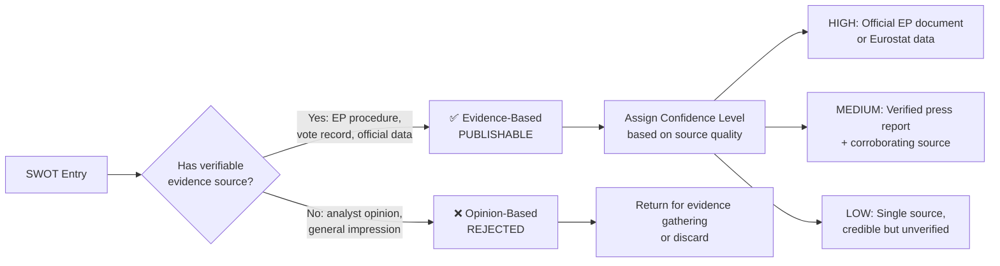
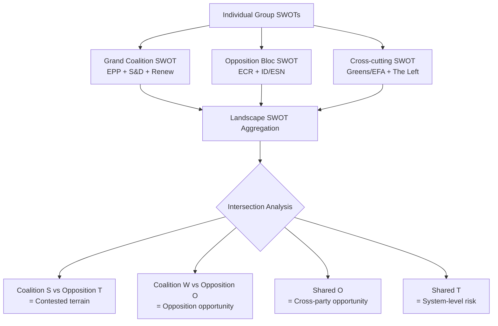

  

<h1 align="center">💼 Political SWOT Analysis Framework — European Parliament</h1>

  <strong>📊 Evidence-Based SWOT Methodology for EU Political Intelligence</strong> 
  <em>🎯 MCP Sources · Confidence Levels · Aggregation · Temporal Decay</em>

**📋 Document Owner:** CEO | **📄 Version:** 1.0 | **📅 Last Updated:** 2026-03-28 (UTC)
**🔄 Review Cycle:** Quarterly | **⏰ Next Review:** 2026-06-28
**🏢 Owner:** Hack23 AB (Org.nr 5595347807) | **🏷️ Classification:** Public

---

## 🎯 Purpose

This framework establishes the evidence-based SWOT analysis methodology for EU Parliament Monitor. Unlike traditional opinion-based SWOT, this methodology requires **verifiable evidence** for every entry — either an EP document reference, named primary source, or official data source.

This methodology is inspired by [CIA platform SWOT.md](https://github.com/Hack23/cia/blob/master/SWOT.md) and the [Riksdagsmonitor SWOT framework](https://github.com/Hack23/riksdagsmonitor/blob/main/analysis/methodologies/political-swot-framework.md), adapted for EU Parliament political intelligence.

---

## 📐 Evidence-Based vs. Opinion-Based SWOT

### Evidence Hierarchy (by confidence level)

| Confidence | Acceptable Sources | MCP Tool |
|:----------:|-------------------|----------|
| **HIGH** | Official EP adopted text, legislative resolution | `get_adopted_texts`, `get_procedures` |
| **HIGH** | Verified roll-call voting record | `get_voting_records`, `analyze_voting_patterns` |
| **HIGH** | Eurostat/World Bank official statistics | World Bank MCP tools |
| **MEDIUM** | Commission communication or proposal | `get_external_documents`, `search_documents` |
| **MEDIUM** | Named MEP speech in plenary record | `get_speeches` |
| **MEDIUM** | Verified major media outlet with named sources | External verification |
| **LOW** | Single unnamed source | — (flag for verification) |
| **REJECTED** | Analyst inference without evidence | — |

---

## 📊 MCP Data Sources for Each Quadrant

### ✅ Strengths — Optimal MCP Sources

Strengths are demonstrated by **legislative achievements** and **institutional cohesion**:

| Strength Type | MCP Tool | Query Strategy |
|--------------|----------|---------------|
| Legislative achievement | `get_adopted_texts` | Filter by type=legislative resolution, status=adopted |
| Grand coalition cohesion | `analyze_coalition_dynamics` | EPP+S&D+Renew voting alignment rate |
| Committee productivity | `analyze_committee_activity` | Output rate, report adoption rate |
| EP institutional authority | `get_procedures` | Successful co-decision files vs. Council |
| International engagement | `search_documents` | AFET/INTA resolutions with broad support |

### ⚠️ Weaknesses — Optimal MCP Sources

| Weakness Type | MCP Tool | Query Strategy |
|--------------|----------|---------------|
| Political group fragmentation | `detect_voting_anomalies` | Intra-group defection rates |
| Legislative pipeline stalls | `monitor_legislative_pipeline` | Stalled procedures, bottleneck index |
| Low MEP engagement | `track_mep_attendance` | Attendance rates below thresholds |
| EP-Council deadlocks | `track_legislation` | Procedures stuck in trilogue >12 months |
| Public trust deficit | Eurobarometer / World Bank data | Turnout trends, satisfaction metrics |

### 🚀 Opportunities — Optimal MCP Sources

| Opportunity Type | MCP Tool | Query Strategy |
|-----------------|----------|---------------|
| Pending landmark legislation | `get_procedures` | Key files approaching plenary vote |
| Cross-party consensus building | `analyze_coalition_dynamics` | High cohesion votes across 4+ groups |
| New Commission proposals | `get_external_documents` | Recent Commission proposals with EP support |
| Institutional reform windows | `search_documents` | AFCO reports on Treaty changes |
| Green Deal implementation | `get_adopted_texts` | Climate/environment legislation progress |

### 🔴 Threats — Optimal MCP Sources

| Threat Type | MCP Tool | Query Strategy |
|------------|----------|---------------|
| Far-right group growth | `compare_political_groups` | Seat share trends for ID/ECR/ESN |
| Institutional legitimacy crisis | `get_parliamentary_questions` | Article 7 / rule of law references |
| Budget framework disputes | `get_adopted_texts` | MFF-related rejections or amendments |
| Geopolitical pressure | `get_plenary_documents` | CFSP/security resolutions with low consensus |
| Democratic backsliding in MS | `detect_voting_anomalies` | National delegation voting patterns |

---

## 🎯 Confidence Level Assignment

| Level | Criteria | Example |
|-------|---------|---------|
| **HIGH** | Multiple independent sources; primary EP document; current (within 90 days) | "Grand coalition secured 412/720 votes on Green Deal regulation (verified via roll-call 2026-03-15)" |
| **MEDIUM** | Single primary source confirmed; or primary source older than 90 days | "Eurobarometer shows 48% EP trust; single survey" |
| **LOW** | Credible but single unverified source; inference from related evidence | "Estimated ID group dissent based on plenary debate tone — no formal vote yet" |

### Confidence Decay Rule

| Original Confidence | After 30 days | After 90 days | After 180 days |
|--------------------|:------------:|:-------------:|:--------------:|
| HIGH | HIGH | MEDIUM | LOW |
| MEDIUM | MEDIUM | LOW | EXPIRED |
| LOW | LOW | EXPIRED | EXPIRED |

**EXPIRED entries must be re-verified or removed before inclusion in new SWOT analyses.**

---

## 🔗 Aggregating Political Group SWOTs into Landscape SWOT

### Intersection Rules

- **Coalition Strength + Opposition Threat** = Priority watchpoint (contested terrain)
- **Coalition Weakness + Opposition Opportunity** = High-significance political risk
- **Shared Opportunity** = Major policy window; grand bargain possible
- **Shared Threat** = System-level risk; Treaty/institutional dimension

---

## 🔗 Related Documents

- [templates/swot-analysis.md](../templates/swot-analysis.md) — SWOT template
- [../../SWOT.md](../../SWOT.md) — Platform strategic SWOT
- [political-risk-methodology.md](political-risk-methodology.md) — Complementary risk scoring

---

**Document Control:**
- **Path:** `/analysis/methodologies/political-swot-framework.md`
- **Adapted from:** [Riksdagsmonitor SWOT framework](https://github.com/Hack23/riksdagsmonitor/blob/main/analysis/methodologies/political-swot-framework.md)
- **Classification:** Public
