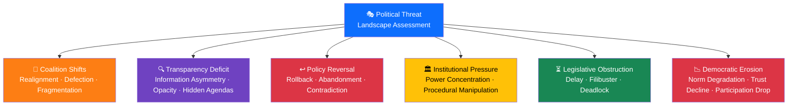
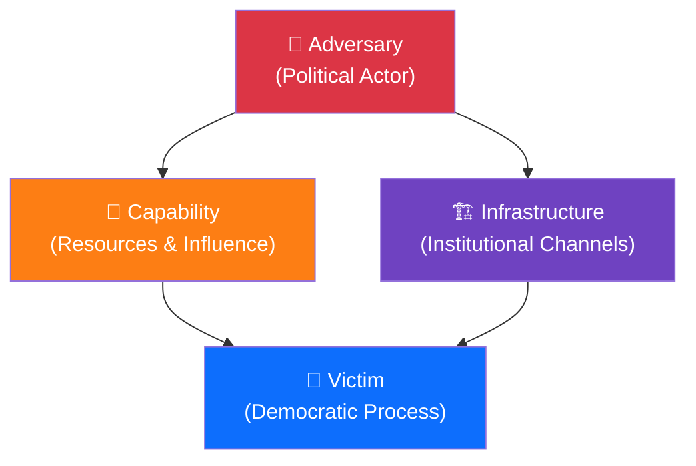
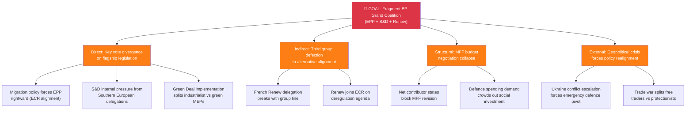
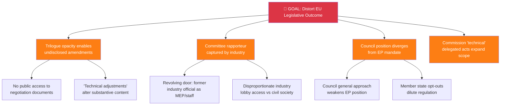
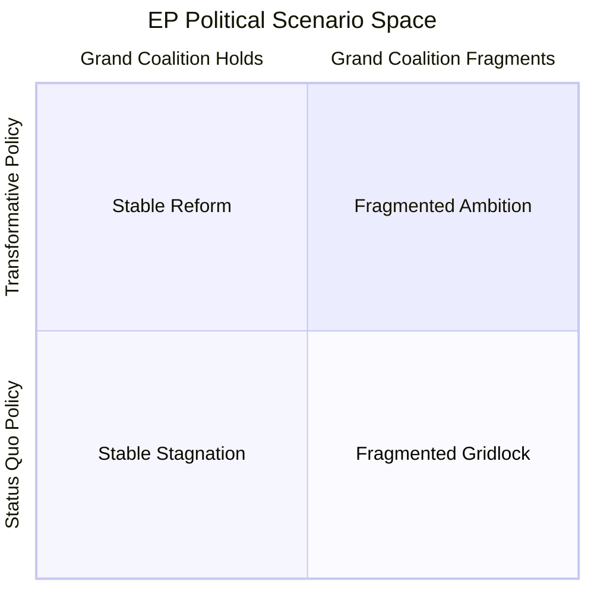
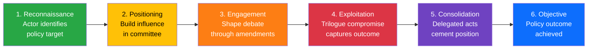
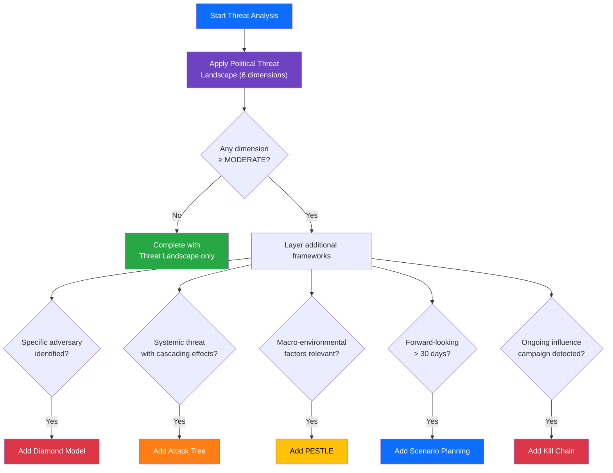

  

<h1 align="center">🎭 Political Threat Landscape Analysis Framework — European Parliament</h1>

  <strong>📊 Multi-Framework Political Threat Analysis for EU Democratic Processes</strong> 
  <em>🎯 Threat Landscape · Attack Trees · PESTLE · Diamond Model · Scenario Planning · Kill Chain</em>

**📋 Document Owner:** CEO | **📄 Version:** 3.0 | **📅 Last Updated:** 2026-03-30 (UTC)
**🔄 Review Cycle:** Quarterly | **⏰ Next Review:** 2026-06-30
**🏢 Owner:** Hack23 AB (Org.nr 5595347807) | **🏷️ Classification:** Public

---

## 🎯 Purpose

This framework provides a **comprehensive, multi-framework approach** to political threat analysis for EU democratic processes using **purpose-built political intelligence frameworks** — not repurposed software security models.

> **⚠️ IMPORTANT:** This methodology does NOT use STRIDE or any other software-centric threat model. STRIDE was designed for finding bugs in software architectures (Microsoft SDL, early 2000s). Applying it to political intelligence produces **shallow, categorical checklists** that miss the dynamic, relational, and temporal nature of political threats. Political intelligence requires frameworks built for **human adversarial behaviour**, **institutional dynamics**, and **systemic risk cascades**.

### Why Purpose-Built Political Frameworks

| Software Frameworks (NOT USED) | Why Inadequate for Political Intelligence |
|-------------------------------|------------------------------------------|
| STRIDE | Categories are software-specific (Spoofing, Tampering, etc.); forced political mappings produce superficial analysis |
| DREAD | Risk scoring designed for software bugs, not political actor motivation |
| PASTA | Process designed for application architectures, not institutional power dynamics |

| Political Intelligence Frameworks (USED) | Why Superior |
|------------------------------------------|-------------|
| **Political Threat Landscape** | Purpose-built 6-dimension model for parliamentary democratic threats |
| **Attack Trees** | Models goal-oriented adversarial behaviour with cascading pathways |
| **Diamond Model of Intrusion** | Captures adversary-capability-infrastructure-victim relationships |
| **PESTLE** | Systematic macro-environmental scanning across 6 dimensions |
| **Scenario Planning** | Forward-looking multi-outcome analysis acknowledging genuine uncertainty |
| **Political Kill Chain** | Sequential threat progression model for influence campaigns |

---

## 🏛️ Core Framework: Political Threat Landscape Analysis

The Political Threat Landscape is a **purpose-built 6-dimension model** for analysing threats to EU democratic processes. Each dimension represents a distinct vector through which democratic functioning can be undermined:

### Dimension 1: Coalition Shifts 🔄

**Definition:** Changes in political group alignment, coalition composition, or voting bloc formation that alter the legislative majority calculus.

| Threat Indicator | Evidence Source (EP MCP) | Severity Signal |
|-----------------|------------------------|-----------------|
| Cross-group voting divergence on flagship legislation | `analyze_voting_patterns`, `get_voting_records` | EPP-S&D alignment drops below 60% on key files |
| National delegation rebellion against group line | `analyze_country_delegation`, `detect_voting_anomalies` | ≥3 national delegations break group whip in single vote |
| New cross-spectrum alignment formation | `analyze_coalition_dynamics`, `compare_political_groups` | ECR-PfE voting alignment exceeds 75% on migration |
| Political group leadership challenge or split | `get_mep_details`, `get_speeches` | Public statements contradicting group president position |

**CMO Assessment (Capability × Motivation × Opportunity):**
- **Capability**: Large national delegations (DE, FR, IT, PL) have highest disruptive capacity
- **Motivation**: Pre-election positioning, national party pressure, ideological drift
- **Opportunity**: Contested legislative files, MFF negotiations, Article 7 proceedings

---

### Dimension 2: Transparency Deficit 🔍

**Definition:** Information asymmetries, procedural opacity, or deliberate concealment that prevents democratic accountability.

| Threat Indicator | Evidence Source (EP MCP) | Severity Signal |
|-----------------|------------------------|-----------------|
| Trilogue outcome divergence from committee mandate | `track_legislation`, `get_procedures` | Final text differs >30% from EP first reading position |
| Lobbying access disparity | `get_committee_info`, `get_events` | Industry expert hearings outnumber civil society 3:1 |
| MEP declaration gaps | `get_mep_declarations` | >20% of declarations incomplete or significantly delayed |
| Committee activity blackout | `analyze_committee_activity`, `get_committee_documents` | Key committee produces no public output for >4 weeks |

---

### Dimension 3: Policy Reversal ↩️

**Definition:** Legislative rollbacks, position contradictions, or policy abandonment that undermines legislative credibility.

| Threat Indicator | Evidence Source (EP MCP) | Severity Signal |
|-----------------|------------------------|-----------------|
| Roll-call vote contradicting prior position | `get_voting_records`, `analyze_voting_patterns` | Political group votes opposite to own report/opinion |
| Legislative procedure withdrawal or restart | `get_procedures`, `track_legislation` | Active procedure withdrawn after committee stage |
| Commission ignoring EP position in delegated acts | `get_external_documents`, `search_documents` | Delegated acts contradict legislative intent |
| Trilogue compromise reversal in plenary | `get_adopted_texts`, `get_voting_records` | Plenary rejects trilogue outcome (rare but severe) |

---

### Dimension 4: Institutional Pressure 🏛️

**Definition:** Power concentration, procedural manipulation, or institutional overreach that undermines the EP's role.

| Threat Indicator | Evidence Source (EP MCP) | Severity Signal |
|-----------------|------------------------|-----------------|
| Commission delegated act scope creep | `get_procedures`, `get_external_documents` | Delegated acts exceed original legislative mandate |
| Council bypassing co-decision | `get_adopted_texts`, `search_documents` | CFSP/defence decisions taken without EP consultation |
| Conference of Presidents agenda manipulation | `get_plenary_sessions`, `get_events` | Controversial votes buried in crowded agendas |
| Committee chair power concentration | `get_committee_info`, `analyze_committee_activity` | Single committee blocks cross-committee coordination |

---

### Dimension 5: Legislative Obstruction ⏳

**Definition:** Deliberate delay, procedural sabotage, or cross-institutional deadlock that prevents democratic outcomes.

| Threat Indicator | Evidence Source (EP MCP) | Severity Signal |
|-----------------|------------------------|-----------------|
| Legislative pipeline stalling | `monitor_legislative_pipeline` | >30% of active procedures stalled at same stage |
| Amendment flooding | `get_committee_documents`, `get_plenary_documents` | >500 amendments on single file to delay committee vote |
| Cross-institutional deadlock | `track_legislation`, `get_procedures` | EP-Council unable to reach common position after 3+ trilogues |
| Rapporteur assignment delays | `get_committee_info`, `search_documents` | Key file without rapporteur >3 months after committee assignment |

---

### Dimension 6: Democratic Erosion 📉

**Definition:** Gradual degradation of democratic norms, public trust, or participation that weakens institutional legitimacy.

| Threat Indicator | Evidence Source (EP MCP) | Severity Signal |
|-----------------|------------------------|-----------------|
| Plenary attendance decline | `track_mep_attendance`, `get_plenary_sessions` | Average attendance drops below 60% in key votes |
| Parliamentary question quality decline | `get_parliamentary_questions` | Written questions become formulaic/symbolic (not oversight) |
| Article 7 proceedings stagnation | `get_procedures`, `get_adopted_texts` | No progress on rule of law proceedings for >12 months |
| Public trust indicators declining | World Bank data, Eurobarometer (external) | Trust in EP below 40% in >10 member states |

---

## 📊 Threat Severity Assessment

| Severity | Score | EU Democratic Consequence | Response |
|----------|:-----:|--------------------------|----------|
| **SEVERE** | 5 | EU Treaty-level crisis; institutional legitimacy threatened | Immediate breaking analysis; all-language deployment |
| **HIGH** | 4 | Major legislative failure; significant democratic deficit | Priority analysis; include in daily intelligence |
| **MODERATE** | 3 | Policy process distorted; recoverable with institutional action | Active monitoring; flag in weekly intelligence |
| **LOW** | 2 | Minor procedural irregularity; normal institutional correction | Routine monitoring; mention in weekly digest |
| **MINIMAL** | 1 | Routine political manoeuvring; no democratic harm | Log for trend analysis only |

---

## 💎 Framework 2: Diamond Model — Adversary Analysis

The Diamond Model ([Caltagirone, Pendergast, Betz 2013](https://www.activeresponse.org/wp-content/uploads/2013/07/diamond.pdf)) maps the relationship between **adversary**, **capability**, **infrastructure**, and **victim** for each identified threat. Unlike categorical models, it captures the **relational dynamics** between threat actors and their targets:

| Diamond Element | Political Intelligence Mapping | Example |
|----------------|-------------------------------|---------|
| **Adversary** | Political actor with identified motivation | ECR group seeking to block Green Deal implementation |
| **Capability** | Resources, votes, procedural knowledge, media access | 78 MEP votes + 2 committee chair positions + media platform |
| **Infrastructure** | Institutional channels used to execute threat | Committee amendment process + plenary voting rules + national media |
| **Victim** | Democratic process or policy outcome under threat | Green Deal industrial emissions regulation (ordinary legislative procedure) |

### When to Use Diamond Model

- When a specific threat actor is identified with clear motivation
- To map the relationship between multiple actors targeting the same policy
- To identify infrastructure vulnerabilities that multiple adversaries exploit
- For deep analysis of high-severity (4-5) threats requiring actor-specific countermeasures

---

## 🌳 Framework 3: Attack Trees — Goal-Oriented Threat Decomposition

Attack trees model how strategic goals can be achieved through combinations of actions, revealing **systemic vulnerability pathways**:

### Attack Tree: Grand Coalition Destabilisation

### Attack Tree: Legislative Capture

---

## 🌍 Framework 4: PESTLE — Macro-Environmental Threat Scanning

| PESTLE Factor | EU Parliament Threat Dimension | Indicators | MCP Sources |
|:-------------:|-------------------------------|------------|-------------|
| **P** — Political | EP election cycle dynamics; national government changes | Distance to EP elections; Council presidency rotation | `get_plenary_sessions`, `get_events` |
| **E** — Economic | Eurozone instability; inflation; unemployment | ECB decisions; MFF budget pressures | World Bank data, `search_documents` (ECON) |
| **S** — Social | Migration pressures; demographic change; public trust | Migration statistics; social cohesion indicators | `get_parliamentary_questions` |
| **T** — Technological | AI regulation urgency; digital sovereignty; cyber threats | Tech legislation pipeline; cyber incident reports | `get_procedures`, `search_documents` (ITRE) |
| **L** — Legal | CJEU rulings; treaty change proposals; Article 7 | Treaty amendment debates; CJEU case law | `get_adopted_texts`, `get_procedures` |
| **E** — Environmental | Climate targets; energy transition; Green Deal pressure | Climate legislation pipeline; energy price volatility | `search_documents` (ENVI), `get_procedures` |

---

## 🎲 Framework 5: Scenario Planning — Forward-Looking Threat Assessment

Scenario planning produces structured alternative futures, acknowledging **genuine uncertainty**:

> ⚠️ AI Agent: Replace quadrant labels with analysis-specific scenarios based on actual EP MCP data.

### Scenario Development Protocol

1. **Identify driving forces** — Two most uncertain, most impactful variables from PESTLE scan
2. **Define axes** — Each variable becomes an axis (high/low)
3. **Name four scenarios** — Describe each quadrant's political reality with evidence
4. **Assign probabilities** — Estimate likelihood with confidence notation `[HIGH/MEDIUM/LOW]`
5. **Identify indicators** — What observable EP data would signal each scenario
6. **Assess impact** — Rate consequences of each scenario for democratic functioning

---

## 🔗 Framework 6: Political Kill Chain — Sequential Threat Progression

Models how threats progress through stages, enabling early detection and disruption:

| Stage | Detect Via | MCP Tools |
|-------|-----------|-----------|
| 1. Reconnaissance | Unusual parliamentary question patterns on specific policy area | `get_parliamentary_questions` |
| 2. Positioning | Committee membership changes; rapporteur appointment patterns | `get_committee_info`, `get_mep_details` |
| 3. Engagement | Amendment volume and direction in committee | `get_committee_documents`, `search_documents` |
| 4. Exploitation | Trilogue outcome diverges from EP position | `track_legislation`, `get_procedures` |
| 5. Consolidation | Delegated act scope expansion | `get_external_documents`, `search_documents` |
| 6. Objective | Policy implementation assessment | `get_adopted_texts`, `get_voting_records` |

---

## 🤖 AI Analysis Protocol for Threat Assessment

The AI agent **MUST** follow this protocol:

1. **Read this framework** — understand all six frameworks and their application criteria
2. **Apply the Political Threat Landscape as primary framework** — assess all six dimensions using EP MCP data
3. **Layer additional frameworks** based on findings:
   - **Diamond Model** for identified high-severity adversaries
   - **Attack Trees** for systemic/coalition threats (severity ≥3)
   - **PESTLE** for macro-environmental context (all monthly/quarterly briefs)
   - **Scenario Planning** for forward-looking assessments (horizon >30 days)
   - **Kill Chain** for ongoing influence campaigns
4. **Cross-reference EP MCP data** — every threat claim must cite specific MCP tool output
5. **Rate overall threat level** — weighted across all applicable frameworks
6. **Identify forward indicators** — what observable data would confirm/disconfirm threats

### Framework Selection Decision Tree

> **🚨 Anti-Pattern Warning:** Never generate threat analysis from scripts or templates alone. The AI agent must READ actual EP MCP data, IDENTIFY specific threats from the evidence, and PRODUCE original analysis with citations. Generic statements like "Coalition stability appears maintained" or "No significant signals detected" indicate the agent has not analysed the data — this is REJECTED.

---

## 🔗 Related Documents

- [templates/threat-analysis.md](../templates/threat-analysis.md) — Threat analysis template
- [templates/per-file-political-intelligence.md](../templates/per-file-political-intelligence.md) — Per-file template with threat section
- [political-risk-methodology.md](political-risk-methodology.md) — Complementary risk scoring
- [political-classification-guide.md](political-classification-guide.md) — Classification input
- [reference/isms-threat-modeling-adaptation.md](../reference/isms-threat-modeling-adaptation.md) — ISMS mapping
- [ai-driven-analysis-guide.md](ai-driven-analysis-guide.md) — Per-file analysis protocol

---

**Document Control:**
- **Path:** `/analysis/methodologies/political-threat-framework.md`
- **ISMS Reference:** [Threat_Modeling.md](https://github.com/Hack23/ISMS-PUBLIC/blob/main/Threat_Modeling.md)
- **Classification:** Public
- **Next Review:** 2026-06-30
