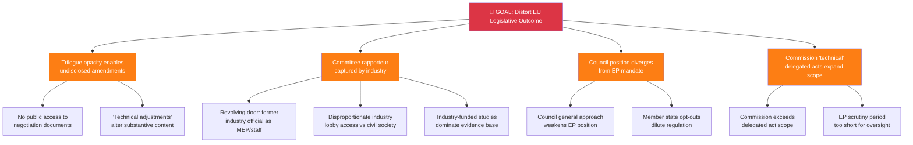
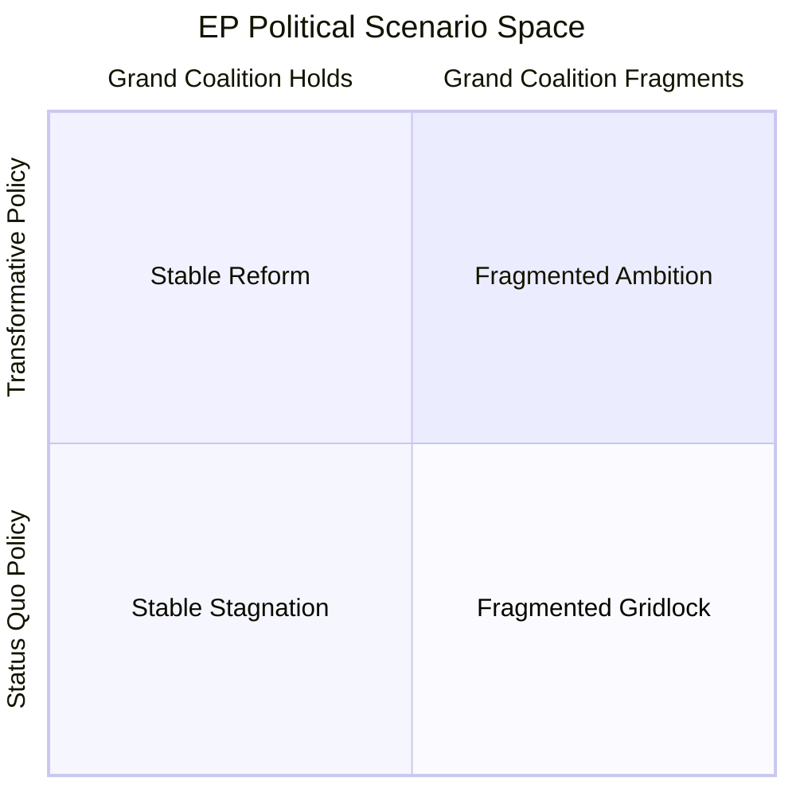
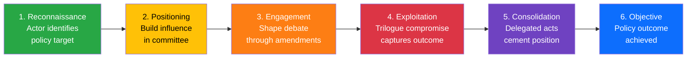
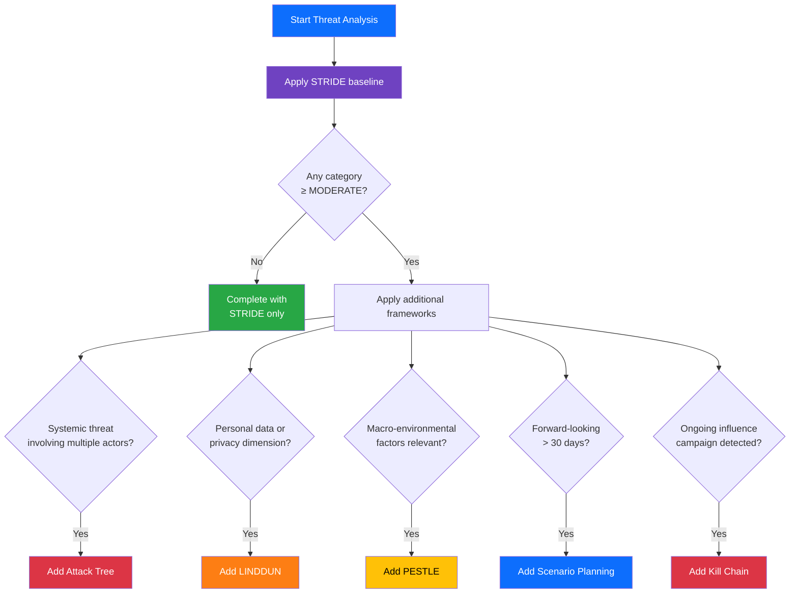

  

<h1 align="center">🎭 Political Threat Analysis Framework — European Parliament</h1>

  <strong>📊 Multi-Framework Political Threat Analysis for EU Democratic Processes</strong> 
  <em>🎯 STRIDE · Attack Trees · LINDDUN · PESTLE · Scenario Planning · Kill Chain</em>

**📋 Document Owner:** CEO | **📄 Version:** 2.0 | **📅 Last Updated:** 2026-03-30 (UTC)
**🔄 Review Cycle:** Quarterly | **⏰ Next Review:** 2026-06-30
**🏢 Owner:** Hack23 AB (Org.nr 5595347807) | **🏷️ Classification:** Public

---

## 🎯 Purpose

This framework provides a **comprehensive, multi-framework approach** to political threat analysis for EU democratic processes. STRIDE alone is insufficient for political intelligence because it was designed for software systems — it categorises threats by type but lacks the **goal-decomposition** of attack trees, the **privacy focus** of LINDDUN, the **macro-environmental scanning** of PESTLE, and the **forward-looking uncertainty modelling** of scenario planning. Political threats are multi-dimensional; a single framework cannot provide adequate coverage.

This methodology combines **six complementary frameworks** to ensure systematic threat coverage:

| Framework | Strength | Political Application |
|-----------|----------|----------------------|
| **STRIDE** | Systematic per-element categorisation | Baseline democratic process threat categories |
| **Attack Trees** | Goal-oriented decomposition of complex threats | Coalition destabilisation, legislative capture pathways |
| **LINDDUN** | Privacy and data protection focus | MEP data, lobbying transparency, GDPR compliance |
| **PESTLE** | Macro-environmental factor scanning | Political, Economic, Social, Technological, Legal, Environmental threats |
| **Scenario Planning** | Forward-looking multi-outcome analysis | Coalition fracture scenarios, legislative pathway analysis |
| **Kill Chain** | Sequential attack stage model | Disinformation campaigns, regulatory capture progression |

This methodology is adapted from [Hack23 ISMS Threat Modeling](https://github.com/Hack23/ISMS-PUBLIC/blob/main/Threat_Modeling.md). See [reference/isms-threat-modeling-adaptation.md](../reference/isms-threat-modeling-adaptation.md) for the ISMS mapping.

> **⚠️ Critical:** AI agents MUST use **at least two frameworks** for any threat analysis rated MODERATE or above. STRIDE alone produces shallow, incomplete threat assessments. Supplement with attack trees for systemic risks and PESTLE for macro factors.

---

## 🎭 STRIDE Categories for EU Democratic Threats

### S — Spoofing: False Narratives & Disinformation

Actors misrepresenting facts, identities, or political positions to manipulate EU public discourse or parliamentary outcomes.

| Threat Type | EU Parliament Context | MCP Detection Tools |
|------------|----------------------|-------------------|
| Foreign disinformation campaigns | State actors targeting EP elections or legislative debates | `get_parliamentary_questions`, `get_speeches` |
| Astroturfing MEP positions | Misrepresenting MEP voting records on social media | `get_voting_records`, `analyze_voting_patterns` |
| Manufactured consensus | Creating appearance of political group unity on contested votes | `detect_voting_anomalies` |
| Deepfake political statements | AI-generated false statements attributed to EP officials | External monitoring |

**Severity Indicators:**
- Scale: number of member states affected
- Timing: proximity to EP elections or key votes
- Attribution: identifiable state actor → higher severity

---

### T — Tampering: Policy Corruption Risks

Manipulation of legislative texts, parliamentary records, or policy processes to corrupt outcomes.

| Threat Type | EU Parliament Context | MCP Detection Tools |
|------------|----------------------|-------------------|
| Undisclosed lobbying | Lobbyists influencing amendments without transparency register compliance | `get_committee_documents`, `search_documents` |
| Opaque trilogue negotiations | Key legislative changes made in closed trilogue without plenary input | `track_legislation`, `get_procedures` |
| Regulatory capture | Industry groups dominating committee expert hearings | `get_committee_info`, `get_events` |
| Amendment flooding | Deliberate overload of amendments to obscure substantive changes | `get_plenary_documents` |

---

### R — Repudiation: Accountability Evasion

Actors denying statements, votes, or commitments to evade accountability.

| Threat Type | EU Parliament Context | MCP Detection Tools |
|------------|----------------------|-------------------|
| Voting record contradictions | MEPs contradicting their roll-call voting positions in national media | `get_voting_records`, `analyze_voting_patterns` |
| Political group position reversal | Groups claiming positions inconsistent with prior voting patterns | `compare_political_groups`, `detect_voting_anomalies` |
| Commission accountability gaps | Commissioners evading EP oversight questions | `get_parliamentary_questions` |
| National delegation splits | National parties claiming EP group positions they voted against | `analyze_country_delegation` |

**EP Mitigation:** Roll-call votes are fully public; the MCP server provides complete voting records for cross-referencing.

---

### I — Information Disclosure: Transparency Failures

Suppression, delay, or selective disclosure of politically significant information.

| Threat Type | EU Parliament Context | MCP Detection Tools |
|------------|----------------------|-------------------|
| Classified trilogue documents | Key legislative texts withheld from public scrutiny | `get_procedures`, `search_documents` |
| MEP financial interest concealment | Incomplete or delayed declarations of financial interests | `get_mep_declarations` |
| Commission document delays | Strategic delays in publishing impact assessments | `get_external_documents` |
| Selective plenary agenda manipulation | Burying controversial votes in crowded sessions | `get_plenary_sessions`, `get_meeting_activities` |

---

### D — Denial: Democratic Process Obstruction

Obstruction, delay, or blockage of normal democratic processes.

| Threat Type | EU Parliament Context | MCP Detection Tools |
|------------|----------------------|-------------------|
| Committee obstruction | Blocking committee reports through procedural delays | `get_committee_documents`, `analyze_committee_activity` |
| Plenary filibustering | Extended debate to prevent timely votes | `get_speeches`, `get_plenary_sessions` |
| Blocking minority abuse | Using EP rules to delay or prevent legislative progress | `monitor_legislative_pipeline` |
| Cross-institutional deadlock | EP-Council impasse blocking legislation | `track_legislation`, `get_procedures` |

---

### E — Elevation of Privilege: Power Concentration

Actors accumulating power beyond democratic mandate or circumventing institutional checks.

| Threat Type | EU Parliament Context | MCP Detection Tools |
|------------|----------------------|-------------------|
| Executive overreach | Commission legislating via delegated acts bypassing EP | `get_procedures`, `search_documents` |
| Conference of Presidents dominance | Bureau decisions circumventing full plenary authority | `get_events`, `get_plenary_session_documents` |
| Political group whip power | Groups suppressing internal dissent on conscience votes | `detect_voting_anomalies`, `analyze_voting_patterns` |
| Interinstitutional power shift | Council bypassing EP co-decision in CFSP/defence | `get_adopted_texts`, `get_external_documents` |

---

## 📊 Threat Severity Assessment

| Severity | Score | EU Democratic Consequence |
|----------|:-----:|--------------------------|
| **SEVERE** | 5 | EU Treaty-level crisis; institutional legitimacy threatened |
| **HIGH** | 4 | Major legislative failure; significant democratic deficit |
| **MODERATE** | 3 | Policy process distorted; recoverable with institutional action |
| **LOW** | 2 | Minor procedural irregularity; normal institutional correction |
| **MINIMAL** | 1 | Routine political manoeuvring; no democratic harm |

---

## 🎯 Threat Actor Categories

| Actor Type | Examples | Primary STRIDE Categories |
|-----------|---------|--------------------------|
| **State Actors** | Russia, China, influence operations | S (Spoofing), I (Disclosure) |
| **Political Groups** | EPP, S&D, ECR, PfE, ESN | R (Repudiation), D (Denial), E (Elevation) |
| **Individual MEPs** | Key rapporteurs, committee chairs | R (Repudiation), T (Tampering) |
| **EU Institutions** | Commission, Council, EEAS | T (Tampering), E (Elevation) |
| **Lobby Groups** | Industry federations, NGOs | T (Tampering), I (Disclosure) |
| **Media** | EU-focused press, national media | S (Spoofing), I (Disclosure) |

---

## 🔗 Related Documents

- [templates/threat-analysis.md](../templates/threat-analysis.md) — Threat analysis template
- [political-risk-methodology.md](political-risk-methodology.md) — Complementary risk scoring
- [political-classification-guide.md](political-classification-guide.md) — Classification input
- [reference/isms-threat-modeling-adaptation.md](../reference/isms-threat-modeling-adaptation.md) — ISMS mapping
- [ai-driven-analysis-guide.md](ai-driven-analysis-guide.md) — Per-file analysis protocol

---

## 🌳 Framework 2: Attack Trees — Goal-Oriented Threat Decomposition

Attack trees model how strategic goals can be achieved through combinations of actions. For political intelligence, they reveal **systemic vulnerability pathways** that STRIDE's per-element approach misses.

### Attack Tree: Grand Coalition Destabilisation

```mermaid
graph TD
    Root["🔴 GOAL: Fragment EP Grand Coalition<br/>(EPP + S&D + Renew)"]

    Root --> A["Direct: Key vote divergence<br/>on flagship legislation"]
    Root --> B["Indirect: Third group defection<br/>to alternative alignment"]
    Root --> C["Structural: MFF budget<br/>negotiation collapse"]
    Root --> D["External: Geopolitical crisis<br/>forces policy realignment"]

    A --> A1["Migration policy forces EPP<br/>rightward (ECR alignment)"]
    A --> A2["S&D internal pressure from<br/>Southern European delegations"]
    A --> A3["Green Deal implementation<br/>splits industrialist vs green MEPs"]

    B --> B1["French Renew delegation<br/>breaks with group line"]
    B --> B2["Renew joins ECR on<br/>deregulation agenda"]
    B --> B3["S&D-Greens-Left form<br/>progressive counter-bloc"]

    C --> C1["Net contributor states<br/>block MFF revision"]
    C --> C2["Cohesion fund dispute<br/>splits East-West"]
    C --> C3["Defence spending demand<br/>crowds out social investment"]

    D --> D1["Ukraine conflict escalation<br/>forces emergency defence pivot"]
    D --> D2["Trade war with US/China<br/>splits free traders vs protectionists"]

    style Root fill:#dc3545,color:#fff
    style A fill:#fd7e14,color:#fff
    style B fill:#fd7e14,color:#fff
    style C fill:#fd7e14,color:#fff
    style D fill:#fd7e14,color:#fff
```

### Attack Tree: Legislative Capture

### When to Use Attack Trees

- Threat severity rated MODERATE (3) or above
- Systemic threats involving multiple actors or institutions
- Coalition dynamics analysis requiring pathway decomposition
- Legislative risk assessment where multiple failure modes exist

---

## 🔒 Framework 3: LINDDUN — Privacy & Data Protection Threats

LINDDUN provides systematic coverage of privacy threats, critical for EU democratic processes operating under GDPR:

| LINDDUN | Privacy Threat | EU Political Application | MCP Detection |
|:-------:|---------------|-------------------------|---------------|
| **L** — Linkability | Linking data to identify patterns | Cross-referencing MEP declarations + voting patterns to infer undue influence | `get_mep_declarations`, `analyze_voting_patterns` |
| **I** — Identifiability | Identifying individuals from data | Petitioners' personal data in PETI committee documents | `get_parliamentary_questions` |
| **N** — Non-repudiation | Inability to deny actions | Roll-call votes as accountability tool (positive democratic use) | `get_voting_records` |
| **D** — Detectability | Detecting data existence | OLAF investigation targets inferred from EP question patterns | `get_parliamentary_questions` |
| **D** — Disclosure | Revealing sensitive info | MEP financial declarations revealing conflicts of interest | `get_mep_declarations` |
| **U** — Unawareness | Users unaware of processing | Citizens unaware petition data used for political analysis | — (platform audit) |
| **N** — Non-compliance | Failing to follow regulations | EP data processing not meeting GDPR obligations | — (compliance audit) |

### When to Use LINDDUN

- MEP declaration analysis (conflict of interest detection)
- Petition committee document analysis
- Lobbying transparency assessment
- Any analysis involving personal data of non-public figures

---

## 🌍 Framework 4: PESTLE — Macro-Environmental Threat Scanning

PESTLE identifies macro-environmental factors that shape the EU political threat landscape but are invisible to document-level analysis:

| PESTLE Factor | EU Parliament Threat Dimension | Indicators | MCP Sources |
|:-------------:|-------------------------------|------------|-------------|
| **P** — Political | EP election cycle dynamics; national government changes affecting Council | Distance to next EP elections; Council presidency rotation | `get_plenary_sessions`, `get_events` |
| **E** — Economic | Eurozone instability; inflation; unemployment affecting policy priorities | ECB decisions; Eurostat data; MFF budget pressures | World Bank data, `search_documents` (ECON committee) |
| **S** — Social | Migration pressures; demographic change; public trust in EU institutions | Eurobarometer data; migration statistics; social cohesion indicators | `get_parliamentary_questions` (trend analysis) |
| **T** — Technological | AI regulation urgency; digital sovereignty; cyber threats to EP | Technology-related legislation pipeline; cyber incident reports | `get_procedures`, `search_documents` (ITRE committee) |
| **L** — Legal | CJEU rulings affecting EP competences; treaty change proposals | Article 7 proceedings; treaty amendment debates; CJEU case law | `get_adopted_texts`, `get_procedures` |
| **E** — Environmental | Climate targets; energy transition; Green Deal implementation pressure | Climate legislation pipeline; energy price volatility | `search_documents` (ENVI committee), `get_procedures` |

### When to Use PESTLE

- Monthly strategic intelligence briefs
- Week-ahead forecasting (identify external pressures on EP agenda)
- Legislative risk assessment (external factors affecting passage probability)
- Coalition dynamics analysis (external pressures as coalition stress tests)

---

## 🎲 Framework 5: Scenario Planning — Forward-Looking Threat Assessment

Scenario planning produces structured alternative futures for political intelligence. Unlike deterministic risk scores, scenarios acknowledge **genuine uncertainty**:

### Scenario Matrix Template

> ⚠️ AI Agent: Replace quadrant labels with analysis-specific scenarios. Adjust axes to the relevant political tension.

### Scenario Development Protocol

1. **Identify driving forces** — Two most uncertain, most impactful variables
2. **Define axes** — Each variable becomes an axis (high/low)
3. **Name four scenarios** — Describe each quadrant's political reality
4. **Assign probabilities** — Estimate likelihood with confidence notation
5. **Identify indicators** — What observable EP data would signal each scenario
6. **Assess impact** — Rate consequences of each scenario for stakeholders

### When to Use Scenario Planning

- Forward-looking assessment horizon > 30 days
- Coalition dynamics with multiple plausible outcomes
- Legislative pathway analysis with uncertain trilogue outcomes
- Monthly and quarterly strategic intelligence briefs

---

## 🔗 Framework 6: Political Kill Chain — Sequential Threat Progression

Adapted from the cyber kill chain, the political kill chain models how threats progress through stages, enabling early detection and disruption:

| Stage | Detect Via | MCP Tools |
|-------|-----------|-----------|
| 1. Reconnaissance | Unusual parliamentary question patterns on specific policy area | `get_parliamentary_questions` |
| 2. Positioning | Committee membership changes; rapporteur appointment patterns | `get_committee_info`, `get_mep_details` |
| 3. Engagement | Amendment volume and direction in committee | `get_committee_documents`, `search_documents` |
| 4. Exploitation | Trilogue outcome diverges from EP position | `track_legislation`, `get_procedures` |
| 5. Consolidation | Delegated act scope expansion | `get_external_documents`, `search_documents` |
| 6. Objective | Policy implementation assessment | `get_adopted_texts`, `get_voting_records` |

---

## 🤖 AI Analysis Protocol for Threat Assessment

The AI agent **MUST** follow this protocol:

1. **Read this framework** — understand all six frameworks and their application criteria
2. **Apply STRIDE as baseline** — categorise threats into the six STRIDE categories
3. **Assess severity** — if any category is MODERATE (3) or above, apply additional frameworks:
   - **Attack trees** for systemic/coalition threats
   - **LINDDUN** for data/privacy dimensions
   - **PESTLE** for macro-environmental context
   - **Scenario planning** for forward-looking assessments (>30 day horizon)
   - **Kill chain** for ongoing influence campaigns
4. **Cross-reference MCP data** — every threat claim must cite EP MCP tool output
5. **Rate overall threat level** — weighted across all applicable frameworks
6. **Identify forward indicators** — what observable data would confirm/disconfirm threats

### Framework Selection Decision Tree

---

## 🔗 Related Documents

- [templates/threat-analysis.md](../templates/threat-analysis.md) — Threat analysis template
- [templates/per-file-political-intelligence.md](../templates/per-file-political-intelligence.md) — Per-file template with threat section
- [political-risk-methodology.md](political-risk-methodology.md) — Complementary risk scoring
- [political-classification-guide.md](political-classification-guide.md) — Classification input
- [reference/isms-threat-modeling-adaptation.md](../reference/isms-threat-modeling-adaptation.md) — ISMS mapping
- [ai-driven-analysis-guide.md](ai-driven-analysis-guide.md) — Per-file analysis protocol

---

**Document Control:**
- **Path:** `/analysis/methodologies/political-threat-framework.md`
- **ISMS Reference:** [Threat_Modeling.md](https://github.com/Hack23/ISMS-PUBLIC/blob/main/Threat_Modeling.md)
- **Adapted from:** [Riksdagsmonitor threat framework](https://github.com/Hack23/riksdagsmonitor/blob/main/analysis/methodologies/political-threat-framework.md)
- **Classification:** Public
