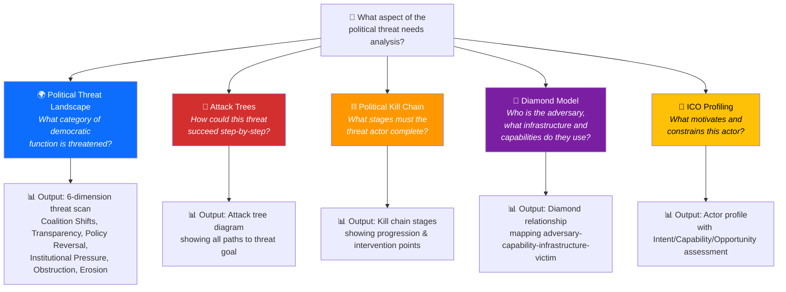
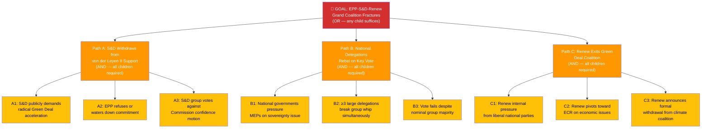
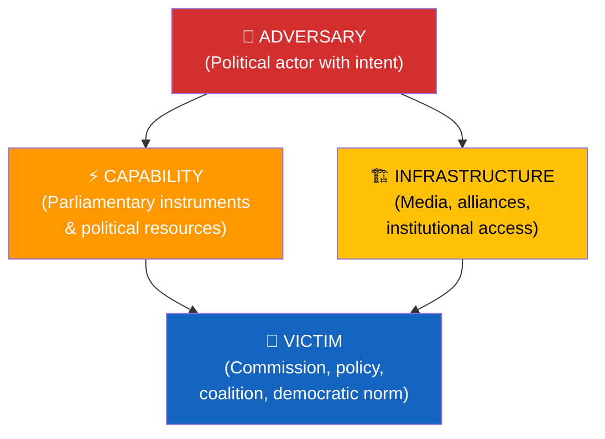
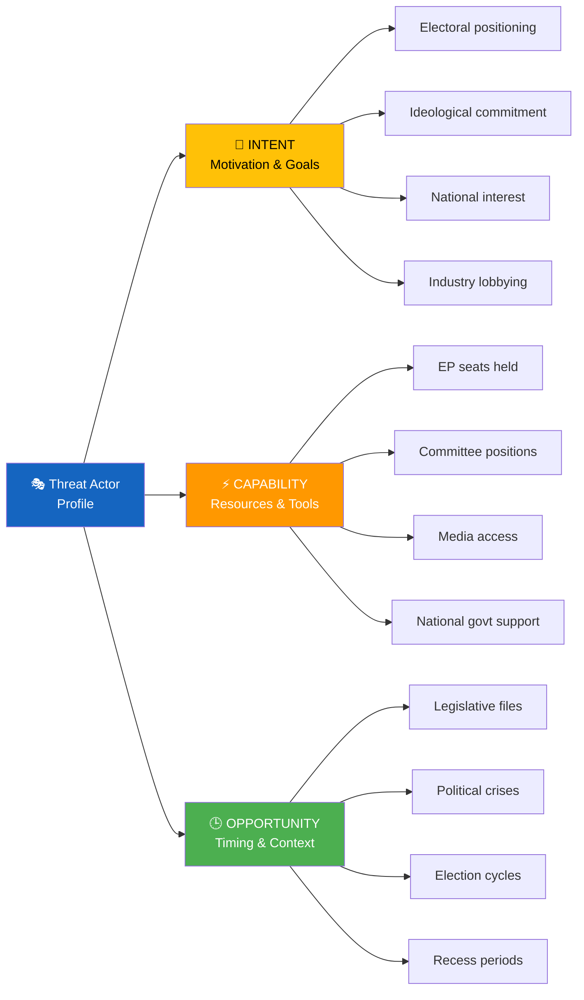
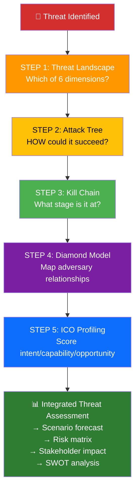
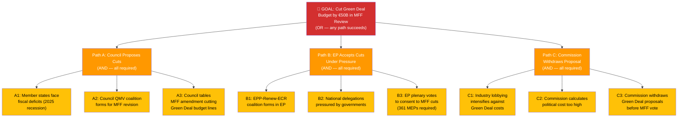

  

<h1 align="center">🎭 Political Threat Analysis Framework — European Parliament</h1>

  <strong>📊 Multi-Framework Methodology for EU Democratic Process Threat Analysis</strong> 
  <em>🎯 Political Threat Landscape (6D) · Attack Trees · Political Kill Chain · Diamond Model · ICO Threat Actor Profiling</em>

  
  
  
  

**📋 Document Owner:** CEO | **📄 Version:** 4.1 | **📅 Last Updated:** 2026-04-25 (UTC)  
**🔄 Review Cycle:** Quarterly | **⏰ Next Review:** 2026-07-31  
**🏢 Owner:** Hack23 AB (Org.nr 5595347807) | **🏷️ Classification:** Public

---

## 🔄 Tradecraft Anchors

| Element | Value | Reference |
|---------|-------|-----------|
| **F3EAD Stage** | **EXPLOIT → ANALYZE** | Threat analysis extracts adversarial intelligence; feeds scenario/intelligence/risk products |
| **PIRs Served** | EP Institutional Authority (PIR-1); Coalition Integrity (PIR-2); Rule of Law/Article 7 (PIR-3); Legislative Throughput (PIR-4); Trilogue Outcomes (PIR-5); MEP Accountability (PIR-6); Narrative Integrity (PIR-7) | See [`political-style-guide.md` §PIR/EEI Catalog](political-style-guide.md#-priority-intelligence-requirements-pir--essential-elements-of-information-eei) |
| **Admiralty Floor** | Threat claims require ≥[B2] evidence; actor attribution requires ≥[A1] or multiple [B2] sources; coalition fracture claims require ≥[A2] | See [`political-style-guide.md` §Admiralty Code](political-style-guide.md#-admiralty-source-reliability-code-nato-stanag-2022) |
| **WEP Requirement** | Attack-tree probability branches use WEP; Kill-chain phase progression uses WEP for likelihood of advancement; all threat severity assessments use WEP bands | See [`political-style-guide.md` §WEP + ODNI](political-style-guide.md#-words-of-estimative-probability-wep--odni-confidence-overlay) |
| **ICD 203 Gate** | Standard 2 (uncertainties — threat probability distributions), 4 (alternative analysis — competing threat hypotheses), 9 (visual information — attack trees, diamond models, kill chains) | See [`political-style-guide.md` §ICD 203](political-style-guide.md#-icd-203-analytic-tradecraft-standards-mapping) |
| **SAT(s)** | Red Team Analysis (adversary perspective), ACH (competing threat hypotheses), Indicators and Signposts (threat warning indicators), What If? Analysis (threat scenario branching) | See [`political-style-guide.md` §SATs](political-style-guide.md#-structured-analytic-techniques-sats-catalog) |

---

## 🎯 Purpose

This framework establishes the authoritative **5-framework integrated methodology** for political threat analysis in EU Parliament Monitor. It combines the **EU-specific 6-dimension Political Threat Landscape** (macro-level scanning) with **four complementary threat modeling approaches** — each illuminating different aspects of political threats that the others miss.

> **Why Five Frameworks?** Political intelligence requires understanding:
> 
> 1. **WHAT categories of threats exist** (Political Threat Landscape — EU-specific 6 dimensions)
> 2. **HOW threats succeed** (Attack Trees — goal decomposition into sequential steps)
> 3. **WHERE threats are in their lifecycle** (Political Kill Chain — 7-stage progression model)
> 4. **WHO is involved and what they use** (Diamond Model — adversary-capability-infrastructure-victim relationships)
> 5. **WHY actors threaten and what constrains them** (ICO Profiling — Intent × Capability × Opportunity)
> 
> Combining frameworks compensates for each framework's individual blind spots and produces **actionable intelligence** rather than superficial categorisation.

---

## ⚠️ Why NOT STRIDE?

### Explicit STRIDE Rejection Rationale

**STRIDE is NOT used in this methodology.** STRIDE (Spoofing, Tampering, Repudiation, Information Disclosure, Denial of Service, Elevation of Privilege) was designed in the early 2000s by Microsoft for **software security threat modeling** — specifically, finding bugs in application architectures during the SDL (Security Development Lifecycle).

| STRIDE Limitation | Why It Fails for Political Intelligence | What We Use Instead |
|-------------------|----------------------------------------|---------------------|
| **Software-centric categories** | Spoofing, Tampering, etc. are attack *types* on software systems, not political dynamics | **Political Threat Landscape** (6 dimensions mapping to democratic functions threatened) |
| **Static classification** | STRIDE produces checklists ("Is there a spoofing threat? Yes/No"); political threats are dynamic, relational, and temporal | **Attack Trees + Kill Chain** (sequential threat progression with intervention points) |
| **No actor motivation model** | STRIDE doesn't ask WHY an adversary acts or what constrains them | **ICO Profiling** (Intent × Capability × Opportunity analysis) |
| **No relationship modeling** | STRIDE doesn't capture adversary-capability-infrastructure-victim dependencies | **Diamond Model** (relational mapping of threat actors and resources) |
| **Forced mappings** | Applying STRIDE to politics requires contorting political concepts into software categories (e.g., "committee stalling = Denial of Service") — producing shallow, superficial analysis | **Purpose-built frameworks** designed for parliamentary democratic processes |

**Historical Note:** Early versions of this methodology (v1.0–v2.5) included a `political-stride-assessment` artifact that attempted to reinterpret STRIDE letters for political contexts. **User feedback and analytical experience demonstrated this approach produced weaker intelligence products than native political frameworks.** STRIDE has been removed effective 2026-04-23 and replaced with the integrated 5-framework methodology below.

---

## 🗺️ Framework Selection Guide

```mermaid
flowchart TD
    Q["🤔 What aspect of the<br/>political threat needs analysis?"]
    Q --> L["🌍 Political Threat Landscape<br/><em>What category of democratic<br/>function is threatened?</em>"]
    Q --> A["🌳 Attack Trees<br/><em>How could this threat<br/>succeed step-by-step?</em>"]
    Q --> B["⛓️ Political Kill Chain<br/><em>What stages must the<br/>threat actor complete?</em>"]
    Q --> C["💎 Diamond Model<br/><em>Who is the adversary,<br/>what infrastructure and<br/>capabilities do they use?</em>"]
    Q --> E["👤 ICO Profiling<br/><em>What motivates and<br/>constrains this actor?</em>"]

    L --> F1["📊 Output: 6-dimension threat scan<br/>Coalition Shifts, Transparency, Policy Reversal,<br/>Institutional Pressure, Obstruction, Erosion"]
    A --> F["📊 Output: Attack tree diagram<br/>showing all paths to threat goal"]
    B --> G["📊 Output: Kill chain stages<br/>showing progression & intervention points"]
    C --> H["📊 Output: Diamond relationship<br/>mapping adversary-capability-infrastructure-victim"]
    E --> J["📊 Output: Actor profile<br/>with Intent/Capability/Opportunity assessment"]

    style L fill:#0d6efd,color:#fff
    style A fill:#D32F2F,color:#FFFFFF
    style B fill:#FF9800,color:#FFFFFF
    style C fill:#7B1FA2,color:#FFFFFF
    style E fill:#FFC107,color:#000000
```

| Framework | Best For | Depth | Political Intelligence Value |
|-----------|---------|:-----:|------------------------------|
| **🌍 Political Threat Landscape (6D)** | Systematic coverage of all democratic function threat categories | ★★★★★ | EU-specific macro-level scanning; ensures no threat vector is missed |
| **🌳 Attack Trees** | Decomposing HOW a threat succeeds | ★★★★★ | Shows all paths to a political goal; identifies cheapest/easiest attack paths |
| **⛓️ Political Kill Chain** | Modelling threat PROGRESSION | ★★★★☆ | Reveals intervention points; early warning indicators at each stage |
| **💎 Diamond Model** | Understanding ADVERSARY relationships | ★★★★☆ | Maps who, how, what infrastructure, and who's affected |
| **👤 ICO Profiling** | Assessing WHO and WHY | ★★★★★ | Intent-capability-opportunity analysis; predicts likely actions |

**Mandatory minimum:** Every threat analysis MUST use **Political Threat Landscape (6D) + Attack Trees**. The Landscape ensures systematic coverage; Attack Trees answer the question most critical for political intelligence: "Through what specific sequence of steps could this threat succeed?" — enabling both early warning and strategic intervention.

---

## 🌍 Framework 0: Political Threat Landscape (EU-Specific 6-Dimension Model)

The Political Threat Landscape is a **purpose-built 6-dimension model** for analysing threats to EU democratic processes. Each dimension represents a distinct vector through which democratic functioning can be undermined. **This is the mandatory primary framework** — all other frameworks (Attack Trees, Kill Chain, Diamond, ICO) provide depth on threats identified here.

```mermaid
%%{init: {"theme":"dark","themeVariables":{"primaryColor":"#1565C0","primaryTextColor":"#ffffff","primaryBorderColor":"#0A3F7F","lineColor":"#90CAF9","secondaryColor":"#2E7D32","secondaryTextColor":"#ffffff","secondaryBorderColor":"#0F3F00","tertiaryColor":"#FF9800","tertiaryTextColor":"#000000","tertiaryBorderColor":"#7F4F00","mainBkg":"#1565C0","secondBkg":"#2E7D32","tertiaryBkg":"#FF9800","noteBkgColor":"#FFC107","noteTextColor":"#000000","noteBorderColor":"#7F6000","errorBkgColor":"#D32F2F","errorTextColor":"#ffffff","fontFamily":"Inter, Helvetica, Arial, sans-serif"}}}%%
graph TD
    TL["🎭 Political Threat<br/>Landscape Assessment"]

    TL --> CS["🔄 Coalition Shifts<br/>Realignment · Defection · Fragmentation"]
    TL --> TR["🔍 Transparency Deficit<br/>Information Asymmetry · Opacity · Hidden Agendas"]
    TL --> PR["↩️ Policy Reversal<br/>Rollback · Abandonment · Contradiction"]
    TL --> IP["🏛️ Institutional Pressure<br/>Power Concentration · Procedural Manipulation"]
    TL --> LO["⏳ Legislative Obstruction<br/>Delay · Filibuster · Deadlock"]
    TL --> DE["📉 Democratic Erosion<br/>Norm Degradation · Trust Decline · Participation Drop"]

    style TL fill:#0d6efd,color:#fff
    style CS fill:#fd7e14,color:#fff
    style TR fill:#6f42c1,color:#fff
    style PR fill:#dc3545,color:#fff
    style IP fill:#ffc107,color:#000
    style LO fill:#198754,color:#fff
    style DE fill:#dc3545,color:#fff
```

### Dimension 1: Coalition Shifts 🔄

**Definition:** Changes in political group alignment, coalition composition, or voting bloc formation that alter the legislative majority calculus in the 720-seat European Parliament.

| Threat Indicator | Evidence Source (EP MCP) | Severity Signal |
|-----------------|------------------------|-----------------|
| Cross-group voting divergence on flagship legislation | `analyze_voting_patterns`, `get_voting_records` | EPP-S&D alignment drops below 60% on key files |
| National delegation rebellion against group line | `analyze_country_delegation`, `detect_voting_anomalies` | ≥3 national delegations break group whip in single vote |
| New cross-spectrum alignment formation | `analyze_coalition_dynamics`, `compare_political_groups` | ECR-PfE voting alignment exceeds 75% on migration/sovereignty issues |
| Political group leadership challenge or split | `get_mep_details`, `get_speeches` | Public speeches contradicting group president position |
| Grand coalition fracture indicators | `compare_political_groups`, `analyze_voting_patterns` | EPP-S&D-Renew voting cohesion <50% on MFF/budget |

**ICO Assessment (Intent × Capability × Opportunity):**
- **Intent**: National party pressure pre-2029 EP elections; ideological drift on Green Deal/migration/defence
- **Capability**: Large national delegations (DE, FR, IT, PL, ES) have highest disruptive capacity (10-96 MEPs each)
- **Opportunity**: Contested legislative files, MFF mid-term review, Article 7 TEU proceedings, von der Leyen Commission II mid-term

**MCP Tools for Detection:**
- `analyze_coalition_dynamics(groupIds, minimumCohesion, dateFrom, dateTo)` — detects coalition fracture signals
- `detect_voting_anomalies(groupId, sensitivityThreshold, dateFrom, dateTo)` — identifies party defections
- `analyze_country_delegation(country, dateFrom, dateTo)` — reveals national cohesion vs. group cohesion tensions
- `compare_political_groups(groupIds, dimensions, dateFrom, dateTo)` — maps inter-group alignment shifts

---

### Dimension 2: Transparency Deficit 🔍

**Definition:** Information asymmetries, procedural opacity, or deliberate concealment that prevents democratic accountability in EP legislative processes.

| Threat Indicator | Evidence Source (EP MCP) | Severity Signal |
|-----------------|------------------------|-----------------|
| Trilogue outcome divergence from committee mandate | `track_legislation`, `get_procedures` | Final text differs >30% from EP first reading position |
| Lobbying access disparity | `get_committee_info`, `get_events` | Industry expert hearings outnumber civil society 3:1 |
| MEP declaration gaps | `get_mep_declarations` | >20% of declarations incomplete or significantly delayed |
| Committee activity blackout | `analyze_committee_activity`, `get_committee_documents` | Key committee produces no public output for >4 weeks |
| Roll-call vote suppression | `get_voting_records`, `get_plenary_sessions` | <40% of plenary votes recorded as roll-call (vs. 60-70% norm) |

**ICO Assessment:**
- **Intent**: Reduce public scrutiny; shield MEPs from accountability; protect industry interests
- **Capability**: Council/Commission trilogue opacity; committee rapporteur discretion; plenary majority can reject roll-call requests
- **Opportunity**: Complex technical files (AI Act, Data Act); fast-track procedures; recess periods with low media attention

**MCP Tools for Detection:**
- `get_mep_declarations(year, limit, offset)` — monitors declaration filing patterns
- `track_legislation(procedureId)` — reveals trilogue vs. committee position deltas
- `get_committee_documents(limit, offset)` — detects output blackouts
- `get_parliamentary_questions(author, topic, status, limit, offset)` — tracks question-answer transparency

---

### Dimension 3: Policy Reversal ↩️

**Definition:** Abandonment, rollback, or substantive contradiction of previously adopted EP positions or legislative commitments.

| Threat Indicator | Evidence Source (EP MCP) | Severity Signal |
|-----------------|------------------------|-----------------|
| Plenary resolution contradiction within same term | `get_adopted_texts`, `search_documents` | Resolution adopted contradicting resolution from <2 years prior |
| Committee opinion reversal | `get_committee_documents`, `get_procedures` | Committee adopts position opposite to its previous opinion on same topic |
| MFF/budget priority abandonment | `get_adopted_texts`, `get_procedures` | Flagship budget line reduced >50% vs. previous MFF |
| Green Deal / Fit for 55 rollback signals | `get_voting_records`, `get_adopted_texts` | Amendments weakening climate targets adopted |
| Article 7 TEU enforcement abandonment | `get_procedures`, `get_plenary_sessions` | Article 7 hearing cancelled or indefinitely postponed |

**ICO Assessment:**
- **Intent**: Electoral positioning for 2029 EP elections; industry lobbying success; geopolitical pressure (e.g., US trade threats)
- **Capability**: Plenary majority can adopt contradictory positions; rapporteur can propose reversals; Commission can withdraw proposals
- **Opportunity**: Economic shocks (energy crisis, recession); external events (war, pandemic); political group leadership changes

**MCP Tools for Detection:**
- `get_adopted_texts(year, limit, offset)` — tracks resolution/position evolution
- `search_documents(keyword, documentType, dateFrom, dateTo)` — identifies contradictory positions
- `get_procedures(processId, limit, offset)` — monitors legislative procedure reversals
- `get_voting_records(sessionId, topic, dateFrom, dateTo)` — reveals voting pattern shifts on same topics

---

### Dimension 4: Institutional Pressure 🏛️

**Definition:** Power concentration, procedural manipulation, or external institutional coercion that distorts EP democratic functioning.

| Threat Indicator | Evidence Source (EP MCP) | Severity Signal |
|-----------------|------------------------|-----------------|
| Council override of EP position in trilogue | `track_legislation`, `get_procedures` | Council position prevails on >70% of contested amendments |
| Commission withdrawal of EP-amended proposal | `get_procedures`, `get_external_documents` | Commission withdraws proposal after EP substantive amendments |
| Conference of Presidents procedural manipulation | `get_plenary_sessions`, `get_events` | Agenda items removed or postponed without transparent justification |
| Committee chair/rapporteur appointment disputes | `get_committee_info`, `analyze_committee_activity` | D'Hondt allocation violated or contested appointments |
| External government pressure on national delegations | `analyze_country_delegation`, `get_speeches` | National government public statements pressuring MEPs to vote specific way |

**ICO Assessment:**
- **Intent**: Council/Commission assert institutional prerogatives; national governments bypass EP; political groups consolidate power
- **Capability**: Council legislative co-decision power; Commission right of initiative; Conference of Presidents agenda control
- **Opportunity**: Interinstitutional agreement negotiations; crisis decision-making; legislative fast-track procedures

**MCP Tools for Detection:**
- `track_legislation(procedureId)` — reveals trilogue power dynamics
- `get_committee_info(id, abbreviation, showCurrent)` — monitors committee composition manipulation
- `get_procedures(processId, limit, offset)` — detects procedural irregularities
- `monitor_legislative_pipeline(committee, status, dateFrom, dateTo)` — identifies bottlenecks and stalled procedures

---

### Dimension 5: Legislative Obstruction ⏳

**Definition:** Deliberate delay, procedural deadlock, or systemic blockage that prevents or significantly slows legislative decision-making.

| Threat Indicator | Evidence Source (EP MCP) | Severity Signal |
|-----------------|------------------------|-----------------|
| Amendment flood in plenary | `get_procedures`, `get_plenary_session_document_items` | >1000 amendments tabled to single file |
| Committee stage prolongation | `analyze_committee_activity`, `get_procedures` | Committee deliberation >18 months for ordinary procedure file |
| Trilogue stalemate | `track_legislation`, `monitor_legislative_pipeline` | No trilogue progress for >6 months on active file |
| Quorum challenges | `get_plenary_sessions`, `track_mep_attendance` | Repeated quorum challenges delaying votes |
| Filibuster-equivalent tactics | `get_speeches`, `get_plenary_sessions` | Abnormal speaking time (>3x normal) on single agenda item |

**ICO Assessment:**
- **Intent**: Block unwanted legislation; extract concessions via delay; run out the clock before EP term end
- **Capability**: Individual MEPs can table unlimited amendments; political groups can request extended debate; committees control timelines
- **Opportunity**: Controversial files (migration, rule of law); EP term's final year; pre-election positioning

**MCP Tools for Detection:**
- `monitor_legislative_pipeline(committee, status, dateFrom, dateTo, limit)` — detects stalled procedures
- `analyze_legislative_effectiveness(subjectType, subjectId, dateFrom, dateTo)` — measures throughput degradation
- `get_plenary_session_document_items(limit, offset)` — counts amendments
- `track_mep_attendance(mepId, country, groupId, dateFrom, dateTo)` — identifies attendance pattern manipulation

---

### Dimension 6: Democratic Erosion 📉

**Definition:** Systematic degradation of democratic norms, institutional trust, or citizen engagement with EP processes.

| Threat Indicator | Evidence Source (EP MCP) | Severity Signal |
|-----------------|------------------------|-----------------|
| Turnout decline in EP elections | External (Eurostat, national election authorities) | EP election turnout drops >5 percentage points vs. previous election |
| MEP attendance decline | `track_mep_attendance`, `get_plenary_sessions` | Average plenary attendance <70% (historical norm ~80%) |
| Parliamentary question decline | `get_parliamentary_questions`, `analyze_committee_activity` | Written questions filed down >20% year-over-year |
| Committee public engagement drop | `get_events`, `get_committee_info` | Public hearings down >30% vs. previous term |
| Trust in EP decline | External (Eurobarometer) | EP trust metric falls below 40% (crisis threshold) |
| Disinformation campaign targeting EP | External (EUvsDisinfo, DFRLab) | Sustained coordinated disinformation campaign >30 days |

**ICO Assessment:**
- **Intent**: Undermine EU democratic legitimacy; reduce EP political authority; depress pro-EU turnout in 2029
- **Capability**: Foreign state actors (disinformation infrastructure); domestic Eurosceptic parties; media ecosystem fragmentation
- **Opportunity**: Economic crises; migration pressures; war/security threats; post-Brexit UK example; populist surge

**MCP Tools for Detection:**
- `track_mep_attendance(mepId, country, groupId, dateFrom, dateTo, limit)` — monitors engagement decline
- `get_parliamentary_questions(author, topic, status, dateFrom, dateTo)` — tracks question volume trends
- `get_events(eventId, limit, offset)` — monitors public event frequency
- `analyze_committee_activity(committeeId, dateFrom, dateTo)` — assesses committee vitality

**External Data Integration:**
- Eurobarometer surveys (citizen trust metrics)
- Eurostat (EP election turnout)
- EUvsDisinfo / DFRLab (disinformation tracking)
- National election authorities (EP election participation data)

---

## 🌳 Framework 1: Political Attack Trees

Attack trees are the **mandatory secondary framework** (after Threat Landscape) because they answer the critical question: "How could this political goal be achieved?" They decompose threats into actionable step-by-step pathways.

### Attack Tree Structure (EU Example: Grand Coalition Fracture)

```mermaid
graph TD
    ROOT["🎯 GOAL: EPP-S&D-Renew<br/>Grand Coalition Fractures<br/>(OR — any child suffices)"]
    ROOT --> A["Path A: S&D Withdraws from<br/>von der Leyen II Support<br/>(AND — all children required)"]
    ROOT --> B["Path B: National Delegations<br/>Rebel on Key Vote<br/>(AND — all children required)"]
    ROOT --> C["Path C: Renew Exits Green<br/>Deal Coalition<br/>(AND — all children required)"]

    A --> A1["A1: S&D publicly demands<br/>radical Green Deal acceleration"]
    A --> A2["A2: EPP refuses or<br/>waters down commitment"]
    A --> A3["A3: S&D group votes against<br/>Commission confidence motion"]

    B --> B1["B1: National governments pressure<br/>MEPs on sovereignty issue"]
    B --> B2["B2: ≥3 large delegations<br/>break group whip simultaneously"]
    B --> B3["B3: Vote fails despite<br/>nominal group majority"]

    C --> C1["C1: Renew internal pressure<br/>from liberal national parties"]
    C --> C2["C2: Renew pivots toward<br/>ECR on economic issues"]
    C --> C3["C3: Renew announces formal<br/>withdrawal from climate coalition"]

    style ROOT fill:#D32F2F,color:#FFFFFF
    style A fill:#FF9800,color:#FFFFFF
    style B fill:#FF9800,color:#FFFFFF
    style C fill:#FF9800,color:#FFFFFF
    style A1 fill:#FFC107,color:#000000
    style A2 fill:#FFC107,color:#000000
    style A3 fill:#FFC107,color:#000000
    style B1 fill:#FFC107,color:#000000
    style B2 fill:#FFC107,color:#000000
    style B3 fill:#FFC107,color:#000000
    style C1 fill:#FFC107,color:#000000
    style C2 fill:#FFC107,color:#000000
    style C3 fill:#FFC107,color:#000000
```

### Attack Tree Construction Protocol

1. **Define the goal** (root node): What political outcome is the threat aiming for?
2. **Decompose with OR/AND gates:**
   - **OR**: Any child path can achieve the goal independently
   - **AND**: All child conditions must be met simultaneously
3. **Assign leaf node attributes:**

| Attribute | Description | EU Example |
|-----------|-------------|-----------|
| **Feasibility** | How easily can this step occur? (1–5, 5=trivial) | S&D public demand: 4 (frequent pre-election pattern) |
| **Detectability** | How early can we detect this step? (1–5, 5=obvious) | Plenary vote: 5 (public roll-call record) |
| **Cost to actor** | Political cost of this action (1–5, 5=free) | Renew exit from coalition: 2 (high electoral risk) |
| **Evidence** | MCP data supporting assessment | `get_voting_records` vote_id, `get_speeches` speech_id |

4. **Identify cheapest attack path**: The path with highest feasibility, highest detectability, and lowest cost is the most likely threat vector
5. **Map early warning indicators**: For each leaf node, what MCP-detectable signal precedes it?

**Early Warning Indicators (mapped to MCP tools):**

| Leaf Node | Early Warning Signal | MCP Detection Tool |
|-----------|---------------------|--------------------|
| A1: S&D demands | Speeches by S&D group president/coordinators | `get_speeches(dateFrom, dateTo, limit)` |
| A2: EPP refuses | EPP group meeting outcomes, press statements | `get_events(eventId, limit)`, external press monitoring |
| A3: S&D votes against | Test votes on related issues, whip warnings | `get_voting_records`, `analyze_voting_patterns` |
| B1: National pressure | National government public statements, bilateral meetings | External press + `get_events` |
| B2: Delegation rebellion | National delegation voting divergence | `analyze_country_delegation`, `detect_voting_anomalies` |
| B3: Vote fails | Vote outcome on first reading/committee stage | `get_voting_records`, `get_procedures` |

### When to Use Attack Trees

- **Always** for Coalition Shifts threats (Dimension 1 of Threat Landscape)
- **Always** for MFF/budget threats during mid-term review negotiations
- For any threat where you need to explain **HOW** something could happen, not just WHAT could happen
- When analysing opposition group strategy and possible escalation paths
- For Legislative Obstruction threats (Dimension 5) — map paths to procedural deadlock

---

## ⛓️ Framework 2: Political Kill Chain (EU Parliament Adaptation)

Adapted from Lockheed Martin's Cyber Kill Chain, the Political Kill Chain models the **7 stages** an adversary must complete to achieve a political objective in the EP context. Each stage represents an intervention opportunity.

### Political Kill Chain Stages (EU Parliament)

```mermaid
flowchart LR
    R["1️⃣ Reconnaissance<br/>Issue identification<br/>& intelligence gathering"]
    W["2️⃣ Weaponization<br/>Framing narratives<br/>& coalition building"]
    D["3️⃣ Delivery<br/>Parliamentary instruments<br/>(questions, motions, amendments)"]
    X["4️⃣ Exploitation<br/>Media amplification<br/>& public pressure"]
    I["5️⃣ Installation<br/>Formal proceedings<br/>(committee votes, plenary debates)"]
    C["6️⃣ Command & Control<br/>Coordinated political<br/>action across groups"]
    A["7️⃣ Actions on Objective<br/>Policy change, Commission fall,<br/>Article 7, early elections"]

    R --> W --> D --> X --> I --> C --> A

    style R fill:#4CAF50,color:#FFFFFF
    style W fill:#FFC107,color:#000000
    style D fill:#FF9800,color:#FFFFFF
    style X fill:#FF9800,color:#FFFFFF
    style I fill:#D32F2F,color:#FFFFFF
    style C fill:#D32F2F,color:#FFFFFF
    style A fill:#7B1FA2,color:#FFFFFF
```

### Kill Chain Stage Details (EP-Specific)

| Stage | Political Manifestation | EP MCP Detection Tools | Early Warning Indicators |
|:-----:|------------------------|------------------------|--------------------------|
| **1. Reconnaissance** | Opposition groups identify Commission/Council vulnerability (policy gap, scandal, economic crisis, regulatory failure) | `search_documents`, `get_parliamentary_questions` | Uptick in written questions on specific topic; clustered document searches |
| **2. Weaponization** | Narrative framing, coalition-building for counter-position, rapporteur assignment strategy | `get_speeches`, `search_documents` (clustered motions for resolutions), `get_committee_info` | Multiple opposition groups adopting same language; coordinated speeches; rapporteur assignment disputes |
| **3. Delivery** | Formal parliamentary instruments filed (written questions, motions for resolutions, amendments, oral questions, petitions) | `get_parliamentary_questions`, `search_documents`, `get_procedures` | Coordinated filing on same day/week; amendment floods (>500 amendments on single file) |
| **4. Exploitation** | Media coverage, public opinion shift, pressure intensifies; hearings weaponized | `get_events`, `get_speeches`, external media monitoring | Media narrative shift; Eurobarometer polling changes; public hearing drama |
| **5. Installation** | Formal proceedings (committee vote, plenary debate scheduled, roll-call vote requested) | `get_plenary_sessions`, `get_voting_records`, `get_committee_documents` | Calendar items scheduled; rapporteur report published; plenary agenda includes item |
| **6. Command & Control** | Cross-group coordination for decisive action (EPP-ECR-PfE alignment; left-green bloc coordination) | `get_voting_records`, `analyze_coalition_dynamics`, `compare_political_groups` | Opposition bloc voting pattern emerges; test votes show coordination |
| **7. Actions on Objective** | Policy reversal, Commission censure motion, Article 7 TEU activation, MFF veto, early EP elections (post-2029) | `get_voting_records`, `get_adopted_texts`, `get_procedures` | Constitutional procedures triggered; censure motion tabled; Article 7 hearing scheduled |

### Kill Chain Disruption Analysis

For each threat, identify where the chain can be **disrupted** (defence) or where it has **already progressed** (assessment):

| Chain Stage | Example Disruption (Pro-EU actors) | Example Progression Indicator |
|:-----------:|:----------------------------------|------------------------------|
| 1. Reconnaissance | Proactive Commission policy correction before opposition identifies gap; pre-emptive MEP communication | `get_parliamentary_questions` shows topic clustering |
| 2. Weaponization | Counter-narrative from EPP-S&D-Renew; alternative rapporteur framing | `get_speeches` shows coordinated opposition language |
| 3. Delivery | Procedural challenges to amendments; committee majority rejects opposition amendments | `get_procedures` shows 1000+ amendments tabled |
| 4. Exploitation | Rapid response media strategy; Eurobarometer-targeted communication | `get_events` shows public hearing scheduled; external media mentions spike |
| 5. Installation | Whip enforcement in pro-Commission groups; plenary speech rebuttals | `get_plenary_sessions` shows debate scheduled; `get_voting_records` shows test vote |
| 6. Command & Control | Coalition whip discipline; national delegation pressure from pro-EU governments | `analyze_coalition_dynamics` shows ECR-PfE alignment emerging |
| 7. Actions on Objective | Secure simple/absolute majority for Commission; block Article 7 censure | `get_voting_records` shows censure motion defeated or adopted |

### EU-Specific Kill Chain Applications

**Use Case 1: Commission Censure Threat**
- Reconnaissance: Opposition monitors Commission failures (e.g., rule of law enforcement gaps, economic policy failures)
- Weaponization: ECR-PfE-The Left frame "Commission has lost confidence of the people" narrative
- Delivery: Censure motion tabled (requires 1/10 of MEPs = 72 MEPs to table)
- Exploitation: Media coverage of censure motion amplifies opposition critique
- Installation: Plenary debate scheduled; roll-call vote requested
- Command & Control: Opposition whips ensure 2/3 majority (480 MEPs) + majority of component members (361 MEPs) — BOTH required
- Actions on Objective: Censure passes → entire Commission must resign (Article 234 TFEU)

**Use Case 2: MFF Mid-Term Review Reversal**
- Reconnaissance: Member states identify budget lines they want cut/redirected
- Weaponization: National governments pressure national delegations; industry lobbying intensifies
- Delivery: Council proposes MFF revision; EP committees issue opinions
- Exploitation: National media frames MFF as "wasteful EU spending"
- Installation: EP plenary vote on consent to MFF revision
- Command & Control: EPP-Renew-ECR coordinate to reject Green Deal budget increases
- Actions on Objective: EP rejects MFF revision OR accepts cuts to Green Deal → Policy Reversal (Dimension 3)

---

## 💎 Framework 3: Diamond Model (EP Political Adaptation)

The Diamond Model maps the **relationships** between adversary, capability, infrastructure, and victim — revealing the structural dynamics of political threats.

```mermaid
graph TD
    ADV["👤 ADVERSARY<br/>(Political actor with intent)"]
    CAP["⚡ CAPABILITY<br/>(Parliamentary instruments<br/>& political resources)"]
    INF["🏗️ INFRASTRUCTURE<br/>(Media, alliances,<br/>institutional access)"]
    VIC["🎯 VICTIM<br/>(Commission, policy,<br/>coalition, democratic norm)"]

    ADV --> CAP
    ADV --> INF
    CAP --> VIC
    INF --> VIC

    style ADV fill:#D32F2F,color:#FFFFFF
    style CAP fill:#FF9800,color:#FFFFFF
    style INF fill:#FFC107,color:#000000
    style VIC fill:#1565C0,color:#FFFFFF
```

### Diamond Model Analysis Table (EP Template)

| Diamond Element | Description | EP Example | Evidence |
|----------------|-------------|------------|----------|
| **Adversary** | Who is the threat actor? Name + political group + role | PfE group MEPs (Marine Le Pen's RN delegation + FPÖ + PVV) | `get_meps(group="PfE", active=true)` |
| **Capability** | What parliamentary/political tools do they wield? | 84 seats (11.7% of EP); committee minority positions; amendment tabling rights; media access in FR/AT/NL | `compare_political_groups(groupIds=["PfE"], dimensions=["voting_discipline", "activity_level"])` |
| **Infrastructure** | What alliances, media channels, institutional access do they use? | Coordination with ECR (78 seats); national media ecosystems (TF1, ORF, RTL); social media networks; national government support (IT, HU, SK) | `analyze_coalition_dynamics(groupIds=["PfE", "ECR"])`, external media monitoring |
| **Victim** | Who/what is targeted? Commission, policy, coalition stability, democratic norm? | Green Deal legislative package; von der Leyen Commission II; EPP-S&D-Renew pro-EU coalition; rule of law enforcement mechanisms | `track_legislation(procedureId)`, `get_voting_records` |

### Meta-Features (Context)

| Meta-Feature | EP Example Assessment |
|-------------|----------------------|
| **Timestamp** | 2024-07-18 (von der Leyen II Commission investiture vote) — PfE votes against |
| **Phase** | Kill chain stage 3-4 (Delivery → Exploitation) — PfE tabling amendments, exploiting media |
| **Direction** | **Targeted** — deliberate campaign against specific Green Deal files (e.g., EUDR deforestation regulation, CBAM carbon border adjustment) |
| **Methodology** | **Hybrid** — parliamentary (amendments, votes) + extra-parliamentary (national media campaigns, social media influencers) |
| **Resources** | **Medium** — PfE spending political capital on Green Deal opposition; risks alienating moderate voters; but gains national party base support |

### Diamond Model EU Applications

**Use Case 1: ECR-PfE Anti-Green Deal Coalition**

| Element | Assessment |
|---------|-----------|
| **Adversary** | ECR (78 MEPs: PiS, Fratelli d'Italia, Vox, Sweden Democrats) + PfE (84 MEPs: RN, FPÖ, Lega, PVV, Vlaams Belang) = 162 MEPs (22.5% of EP) |
| **Capability** | Can block qualified majority if combined with 1-2 member states in Council; can delay via amendment floods; can shift Overton window via media |
| **Infrastructure** | National government support (IT: Meloni; HU: Orbán; SK: Fico); Eurosceptic media (Breitbart, Voice of Europe); social media networks |
| **Victim** | Fit for 55 package, CBAM, EUDR, Nature Restoration Law, Corporate Sustainability Due Diligence Directive |

**Evidence Chain:**
1. `compare_political_groups(groupIds=["ECR", "PfE"], dimensions=["voting_discipline"])` → 78% voting alignment on Green Deal files
2. `get_voting_records(topic="Fit for 55", dateFrom="2024-01-01")` → ECR+PfE vote together against 87% of Green Deal amendments
3. `detect_voting_anomalies(groupId="EPP", sensitivityThreshold=0.3)` → EPP defections toward ECR position on EUDR (rural constituencies)
4. External media monitoring → coordinated ECR-PfE media campaign "Green Deal kills jobs" narrative

**Use Case 2: Commission Transparency Deficit (Trilogue Opacity)**

| Element | Assessment |
|---------|-----------|
| **Adversary** | **Council of the EU** (member state governments in trilogue negotiations) + **European Commission** (trilogue participant) |
| **Capability** | Trilogue negotiations conducted behind closed doors; no public minutes; Council can refuse EP position; Commission can withdraw proposal |
| **Infrastructure** | Interinstitutional agreements (IIAs) allow trilogue opacity; legal services opinions shield documents; national government press offices control narrative |
| **Victim** | **European Parliament democratic accountability**; **EU citizens' right to know**; **EP first reading positions** |

**Evidence Chain:**
1. `track_legislation(procedureId="2021/0106(COD)")` → AI Act trilogue final text differs 40% from EP first reading
2. `get_procedures(processId="2021/0106(COD)")` → 18-month trilogue duration with no public interim reports
3. `get_parliamentary_questions(topic="trilogue transparency", status="PENDING")` → 47 unanswered written questions on trilogue documents
4. `get_committee_documents(limit=100)` → LIBE committee rapporteur report on AI Act: "Council refused to share negotiating mandate"

---

## 👤 Framework 4: Threat Actor Profiling (ICO Model)

**ICO = Intent × Capability × Opportunity**

Threat Actor Profiling assesses **WHO** threatens EU democratic processes and **WHY** (intent), **WHAT THEY CAN DO** (capability), and **WHEN/WHERE THEY CAN ACT** (opportunity). This framework predicts likely threat actor behavior.

### ICO Assessment Matrix

```mermaid
graph LR
    ICO["🎭 Threat Actor<br/>Profile"]
    ICO --> I["🎯 INTENT<br/>Motivation & Goals"]
    ICO --> C["⚡ CAPABILITY<br/>Resources & Tools"]
    ICO --> O["🕒 OPPORTUNITY<br/>Timing & Context"]

    I --> I1["Electoral positioning"]
    I --> I2["Ideological commitment"]
    I --> I3["National interest"]
    I --> I4["Industry lobbying"]

    C --> C1["EP seats held"]
    C --> C2["Committee positions"]
    C --> C3["Media access"]
    C --> C4["National govt support"]

    O --> O1["Legislative files"]
    O --> O2["Political crises"]
    O --> O3["Election cycles"]
    O --> O4["Recess periods"]

    style ICO fill:#1565C0,color:#fff
    style I fill:#FFC107,color:#000
    style C fill:#FF9800,color:#fff
    style O fill:#4CAF50,color:#fff
```

### ICO Scoring System

Each dimension scored 1-5; **overall threat level = I × C × O** (max 125).

| Score | Intent | Capability | Opportunity |
|:-----:|--------|-----------|------------|
| **5** | Existential threat to actor if goal not achieved | Overwhelming resources (>360 MEPs, Council QMV, media dominance) | Perfect storm (crisis + elections + recess) |
| **4** | Core ideological/electoral priority | Strong resources (100-360 MEPs, committee majorities, national govt support) | Highly favorable (crisis OR elections OR low scrutiny) |
| **3** | Important but not critical | Moderate resources (50-100 MEPs, committee positions, some media access) | Favorable (contested file, divided opposition) |
| **2** | Secondary priority | Limited resources (10-50 MEPs, backbench status, niche media) | Neutral (normal legislative process) |
| **1** | Opportunistic/minor | Minimal resources (<10 MEPs, no institutional leverage) | Unfavorable (unified opposition, high scrutiny) |

### Threat Actor Profile Template

**Actor:** `[Political group / national delegation / external actor]`

| ICO Element | Score (1-5) | Assessment | Evidence (EP MCP) |
|-------------|:-----------:|-----------|-------------------|
| **INTENT** | `[score]` | `[Why does this actor threaten? What motivates them?]` | `[Speeches, manifestos, voting record]` |
| **CAPABILITY** | `[score]` | `[What resources/tools do they have? Seats, positions, media?]` | `[get_meps, get_committee_info, compare_political_groups]` |
| **OPPORTUNITY** | `[score]` | `[When/where can they act? What context enables them?]` | `[get_procedures, get_plenary_sessions, external events]` |
| **ICO Total** | `[I×C×O]` | `[Overall threat level: 1-25=Low, 26-75=Medium, 76-125=High]` | `[Synthesis]` |

**Threat Likelihood (WEP):** `[Almost certain / Probable / Even chance / Unlikely / Remote]`  
**Time Horizon:** `[Immediate (0-3 months) / Near-term (3-12 months) / Long-term (1-5 years)]`  
**Recommended Response:** `[Monitoring / Active mitigation / Strategic engagement / No action]`

### EP Threat Actor Examples

**Example 1: PfE Group — Green Deal Rollback**

| ICO Element | Score | Assessment | Evidence |
|-------------|:-----:|-----------|----------|
| **INTENT** | 5 | Existential electoral priority for RN, FPÖ, Lega, PVV national parties — Green Deal framed as threat to national sovereignty, industry, farmers | `get_speeches(dateFrom="2024-07-01")` shows 89 PfE speeches attacking Green Deal; PfE group manifestos |
| **CAPABILITY** | 3 | 84 MEPs (11.7%); minority positions in ENVI, ITRE, AGRI committees; strong media access in FR/AT/NL/IT; can obstruct via amendments but not block | `get_meps(group="PfE")`, `get_committee_info(abbreviation="ENVI")` |
| **OPPORTUNITY** | 4 | 2024-2026 Green Deal implementation phase; farmer protests; energy price volatility; 2027 French presidential election approaching | `get_procedures(limit=100)` shows 23 Green Deal files in trilogue; external farmer protest data |
| **ICO Total** | **60** | **MEDIUM-HIGH threat** | — |

**WEP Likelihood:** **Probable** (60-70% chance PfE successfully weakens at least 1-2 Green Deal files via ECR alliance)  
**Time Horizon:** Near-term (2025-2026 trilogue negotiations)  
**Recommended Response:** Active mitigation — EPP-S&D-Renew-Greens coalition discipline enforcement; rapid response to PfE media campaigns; evidence-based counternarrative on Green Deal economic benefits

---

**Example 2: German EPP Delegation — CBAM Industry Lobbying**

| ICO Element | Score | Assessment | Evidence |
|-------------|:-----:|-----------|----------|
| **INTENT** | 3 | Important but not existential — German industry lobbying to weaken CBAM (carbon border adjustment) to protect steel/cement/chemical exports | `get_parliamentary_questions(author="EPP-DE-*")` shows 12 questions on CBAM competitiveness impact; industry meeting records |
| **CAPABILITY** | 4 | 29 MEPs (largest national EPP delegation); ITRE, ENVI committee positions; direct CDU/CSU government connections; BDI (German industry federation) lobbying infrastructure | `analyze_country_delegation(country="DE")`, `get_committee_info(abbreviation="ITRE")` |
| **OPPORTUNITY** | 3 | 2025 CBAM implementation review; German federal elections 2025; industrial competitiveness concerns amid recession | `track_legislation(procedureId="2021/0214(COD)")` |
| **ICO Total** | **36** | **MEDIUM threat** | — |

**WEP Likelihood:** **Even chance** (40-60% chance German EPP delegation successfully weakens CBAM during implementation review)  
**Time Horizon:** Near-term (2025 implementation review)  
**Recommended Response:** Monitoring + strategic engagement — engage German Green MEPs, SPD MEPs as counterpressure; evidence on CBAM effectiveness; highlight EPP commitment to climate leadership

---

## 📊 Integrated Framework Application Protocol

**When analyzing an EP threat, follow this sequence:**

```mermaid
flowchart TD
    START["🎯 Threat Identified"]
    START --> STEP1["STEP 1: Threat Landscape<br/>Which of 6 dimensions?"]
    STEP1 --> STEP2["STEP 2: Attack Tree<br/>HOW could it succeed?"]
    STEP2 --> STEP3["STEP 3: Kill Chain<br/>What stage is it at?"]
    STEP3 --> STEP4["STEP 4: Diamond Model<br/>Map adversary relationships"]
    STEP4 --> STEP5["STEP 5: ICO Profiling<br/>Score intent/capability/opportunity"]
    STEP5 --> OUTPUT["📊 Integrated Threat Assessment<br/>→ Scenario forecast<br/>→ Risk matrix<br/>→ Stakeholder impact<br/>→ SWOT analysis"]

    style START fill:#D32F2F,color:#fff
    style STEP1 fill:#FF9800,color:#fff
    style STEP2 fill:#FFC107,color:#000
    style STEP3 fill:#4CAF50,color:#fff
    style STEP4 fill:#7B1FA2,color:#fff
    style STEP5 fill:#0d6efd,color:#fff
    style OUTPUT fill:#2E7D32,color:#fff
```

### Worked Example: Coalition Shifts Threat — EPP-S&D Divergence on Migration (2025)

**STEP 1: Threat Landscape Dimension**
- **Dimension 1: Coalition Shifts** 🔄
- Indicator: EPP-S&D voting alignment on migration files drops from 72% (2024) to 54% (Q1 2025)
- MCP Evidence: `analyze_voting_patterns(mepId="EPP-*", dateFrom="2025-01-01", dateTo="2025-03-31")` + `analyze_coalition_dynamics(groupIds=["EPP", "S&D"], dateFrom="2025-01-01")`

**STEP 2: Attack Tree — How Coalition Fracture Could Succeed**

Root Goal: EPP-S&D coalition fractures on migration policy  
OR Gates:
- Path A: EPP pivots toward ECR on migration (AND: EPP leadership decision + ECR willingness + S&D walks away)
- Path B: S&D pivots toward Greens/Left on migration (AND: S&D internal pressure + Greens/Left accept + EPP walks away)
- Path C: External crisis forces choice (AND: Migration crisis + member state pressure + electorates polarize)

Cheapest path: **Path C (external crisis)** — Feasibility 4/5, Detectability 3/5, Cost 2/5 (actors can claim force majeure)

**STEP 3: Kill Chain Stage**
- Current stage: **Stage 2 (Weaponization)** — EPP and S&D are publicly framing competing narratives on migration
- Evidence: `get_speeches(dateFrom="2025-01-01")` shows EPP president Manfred Weber: "Europe must control its borders"; S&D president Iratxe García: "Solidarity and compassion must guide our response"
- Next stage: **Stage 3 (Delivery)** — expect competing migration package amendments from EPP vs. S&D in Q2 2025
- Early warning: Monitor `get_procedures` for Pact on Migration and Asylum implementation files; watch for EPP-ECR joint amendments

**STEP 4: Diamond Model**

| Element | Assessment |
|---------|-----------|
| **Adversary** | EPP right wing (Forza Italia, ÖVP, Ciudadanos) + ECR (PiS, Fratelli d'Italia, Vox) — seeking to harden migration stance |
| **Capability** | EPP 188 MEPs + ECR 78 MEPs = 266 MEPs (36.9% of EP); can block S&D-Greens-Left majority on procedural votes; control LIBE committee balance |
| **Infrastructure** | National government support (IT: Meloni; PL: Tusk ambivalent; ES: PP opposition); center-right media ecosystem; Frontex operational control |
| **Victim** | EU asylum/migration acquis; Pact on Migration and Asylum 2024 compromise; S&D political group cohesion; refugee protection standards |

**STEP 5: ICO Profiling**

| Element | EPP Right Wing Score | S&D Left Wing Score |
|---------|:-------------------:|:------------------:|
| **INTENT** | 4 (electoral survival in 2029 EP elections; national party pressure from member states with anti-migration governments) | 3 (ideological commitment to refugee protection; electoral pressure from progressive base) |
| **CAPABILITY** | 4 (188 EPP + 78 ECR potential = 266 MEPs; LIBE positions; national govt support) | 3 (136 S&D + 53 Greens + 46 Left = 235 MEPs; minority in LIBE; limited national govt support) |
| **OPPORTUNITY** | 4 (2025 migration flows predicted to rise; Schengen suspension pressures; approaching 2027-2029 national elections) | 2 (no immediate crisis favoring progressive stance; weakened by national election losses) |
| **ICO Total** | **64 (EPP right)** | **18 (S&D left)** |

**Threat Assessment:** EPP right wing has MEDIUM-HIGH threat capacity to fracture coalition; S&D left wing has LOW capacity to resist.

**WEP Likelihood:** **Probable** (60-70% chance) that EPP-S&D coalition fractures on at least 1 major migration file in 2025-2026  
**Time Horizon:** Near-term (Q2-Q4 2025 Pact implementation votes)

**Integrated Intelligence Outputs:**
1. **Scenario Forecast** (`intelligence/scenario-forecast.md`): Scenario A (EPP-ECR migration alliance; probability 40%); Scenario B (EPP-S&D hold; probability 35%); Scenario C (Grand coalition collapses entirely; probability 25%)
2. **Risk Matrix** (`risk-scoring/risk-matrix.md`): Coalition fracture risk = HIGH likelihood × HIGH impact = CRITICAL
3. **Stakeholder Impact** (`classification/stakeholder-impact.md`): Refugees (NEGATIVE-SEVERE); S&D group (NEGATIVE-HIGH); EPP moderates (MIXED); ECR (POSITIVE-MEDIUM)
4. **SWOT Analysis** (`risk-scoring/quantitative-swot.md`): S&D Strength (ideological clarity), Weakness (electoral pressure), Opportunity (humanitarian narrative), Threat (EPP-ECR realignment)

---

## 🔗 Related Methodologies

| Methodology | Relationship to Threat Framework | When to Use |
|-------------|--------------------------------|-------------|
| [**Political Risk Methodology**](political-risk-methodology.md) | Threat Framework identifies threats; Risk Methodology scores them (Likelihood × Impact) | After threat identification — convert to risk register |
| [**Political SWOT Framework**](political-swot-framework.md) | Threat Framework feeds SWOT Threats quadrant; SWOT provides strategic response options | After threat assessment — develop mitigation strategies |
| [**PESTLE Analysis**](per-artifact-methodologies.md#pestle-analysis) | PESTLE scans macro-environment; Threat Framework analyzes institutional threats within that environment | Parallel — PESTLE for context, Threat Framework for EP-specific threats |
| [**Scenario Planning**](per-artifact-methodologies.md#scenario-forecast) | Attack Trees + Kill Chains feed scenario branching logic; ICO scores inform scenario probabilities | After threat modeling — develop forward-looking scenarios |
| [**Stakeholder Analysis**](per-artifact-methodologies.md#stakeholder-map) | Diamond Model's adversary/victim elements populate stakeholder map; ICO intent reveals stakeholder motivations | Parallel — threats target stakeholders |

---

## 📚 MCP Tool Reference (EP-Specific)

### Core Threat Detection Tools

| MCP Tool | Threat Landscape Dimension | Kill Chain Stage | Use Case |
|----------|---------------------------|------------------|----------|
| `analyze_coalition_dynamics` | Coalition Shifts (D1) | Stage 6 (Command & Control) | Detect cross-group voting alignment changes |
| `detect_voting_anomalies` | Coalition Shifts (D1) | Stage 5 (Installation) | Identify party defections and group discipline breakdowns |
| `track_legislation` | Transparency Deficit (D2), Policy Reversal (D3) | Stages 3-7 (Delivery → Objective) | Monitor trilogue opacity and legislative outcome divergence |
| `monitor_legislative_pipeline` | Legislative Obstruction (D5) | Stages 5-6 (Installation, C&C) | Identify procedural bottlenecks and stalled files |
| `analyze_country_delegation` | Coalition Shifts (D1), Institutional Pressure (D4) | Stage 2 (Weaponization) | Track national delegation vs. group cohesion tensions |
| `get_parliamentary_questions` | Transparency Deficit (D2), Democratic Erosion (D6) | Stage 1 (Reconnaissance) | Monitor question volumes, topic clustering, answer delays |
| `get_mep_declarations` | Transparency Deficit (D2) | N/A (structural transparency) | Audit declaration filing compliance |
| `track_mep_attendance` | Democratic Erosion (D6) | N/A (engagement metric) | Monitor plenary attendance decline |
| `analyze_committee_activity` | Legislative Obstruction (D5), Democratic Erosion (D6) | Stages 4-5 (Exploitation, Installation) | Assess committee productivity and public engagement |
| `get_voting_records` | All dimensions | Stages 5-7 (Installation → Objective) | Core evidence for all threat assessments |

### Advanced Analytical Tools

| MCP Tool | Primary Use | Framework Integration |
|----------|------------|----------------------|
| `assess_mep_influence` | Identify high-leverage threat actors | ICO Profiling (Capability dimension) |
| `analyze_voting_patterns` | Detect behavioral shifts signaling threats | Attack Trees (leaf node evidence), Kill Chain (Stage 1) |
| `compare_political_groups` | Map group alignment/divergence | Diamond Model (Infrastructure), Threat Landscape (D1) |
| `analyze_legislative_effectiveness` | Measure obstruction impact | Threat Landscape (D5 — Legislative Obstruction) |
| `correlate_intelligence` | Cross-validate threat indicators | Integrated framework application (Step 5) |
| `generate_political_landscape` | Situational awareness for threat context | Threat Landscape (all dimensions) |

---

## ✅ Quality Standards

**Every threat analysis artifact (`threat-assessment/political-threat-landscape.md`, `threat-assessment/actor-threat-profiles.md`, etc.) MUST:**

1. **Apply at least 2 frameworks** — Threat Landscape (mandatory) + Attack Trees OR Kill Chain OR Diamond OR ICO
2. **Use WEP bands** on all threat severity/likelihood assessments (per `osint-tradecraft-standards.md`)
3. **Apply Admiralty grading** on all external sources (≥[B2] for threat claims; ≥[A1] for actor attribution)
4. **Include Mermaid diagrams** — Attack trees (graph TD), Kill chains (flowchart LR), Diamond models (graph TD), Threat Landscape (graph TD)
5. **Cite EP MCP evidence** — every threat indicator must reference specific MCP tool call + result
6. **Document competing hypotheses** — per ICD 203 Standard 4 (alternative explanations for threat indicators)
7. **Map early warning indicators** — for each threat, specify MCP-detectable signals of escalation
8. **Meet depth floor** — ≥30 lines per file (breaking articles); ≥400 lines with evidence for reference-quality runs

**Anti-Patterns (PROHIBITED):**
- ❌ Using STRIDE or DREAD frameworks (software-centric, not political)
- ❌ Threat claims without EP MCP evidence citations
- ❌ Attack trees without feasibility/detectability/cost scoring
- ❌ ICO profiles without numerical scores (1-5 per dimension)
- ❌ Kill chain analysis without stage-specific MCP detection tools
- ❌ Presenting threats as certainties without WEP probability bands

---

## 📖 Appendix A: EP PIR Mapping to Threat Dimensions

| PIR | EP Priority Intelligence Requirement | Threat Landscape Dimension | Frameworks Used |
|:---:|-------------------------------------|---------------------------|-----------------|
| **PIR-1** | EP Institutional Authority —Is the EP's co-legislative power being eroded by Council/Commission? | Institutional Pressure (D4) | Diamond Model (Council/Commission as adversary) |
| **PIR-2** | Coalition Integrity — Is the EPP-S&D-Renew grand coalition stable? | Coalition Shifts (D1) | Attack Trees (coalition fracture paths), ICO (group intent/capability) |
| **PIR-3** | Rule of Law / Article 7 — Are Article 7 TEU procedures being effectively enforced against member states? | Policy Reversal (D3), Institutional Pressure (D4) | Kill Chain (Article 7 enforcement progression) |
| **PIR-4** | Legislative Throughput — Is the EP meeting its ordinary legislative procedure timelines? | Legislative Obstruction (D5) | Kill Chain (obstruction stages), `monitor_legislative_pipeline` |
| **PIR-5** | Trilogue Outcomes — Are trilogue negotiations respecting EP first reading positions? | Transparency Deficit (D2), Institutional Pressure (D4) | Diamond Model (Council/Commission trilogue leverage) |
| **PIR-6** | MEP Accountability — Are MEPs fulfilling attendance, declaration, and constituent engagement duties? | Democratic Erosion (D6) | `track_mep_attendance`, `get_mep_declarations`, `get_parliamentary_questions` |
| **PIR-7** | Narrative Integrity — Is EU democratic discourse being undermined by disinformation or procedural opacity? | Transparency Deficit (D2), Democratic Erosion (D6) | Kill Chain (disinformation campaigns), external EUvsDisinfo data |

---

## 📖 Appendix B: Worked Attack Tree Examples

### Example 1: MFF Mid-Term Review Reversal (Green Deal Budget Cuts)

```mermaid
graph TD
    ROOT["🎯 GOAL: Cut Green Deal<br/>Budget by €50B in MFF Review<br/>(OR — any path succeeds)"]
    ROOT --> A["Path A: Council Proposes Cuts<br/>(AND — all required)"]
    ROOT --> B["Path B: EP Accepts Cuts<br/>Under Pressure<br/>(AND — all required)"]
    ROOT --> C["Path C: Commission<br/>Withdraws Proposal<br/>(AND — all required)"]

    A --> A1["A1: Member states face<br/>fiscal deficits (2025 recession)"]
    A --> A2["A2: Council QMV coalition<br/>forms for MFF revision"]
    A --> A3["A3: Council tables<br/>MFF amendment cutting<br/>Green Deal budget lines"]

    B --> B1["B1: EPP-Renew-ECR<br/>coalition forms in EP"]
    B --> B2["B2: National delegations<br/>pressured by governments"]
    B --> B3["B3: EP plenary votes<br/>to consent to MFF cuts<br/>(361 MEPs required)"]

    C --> C1["C1: Industry lobbying<br/>intensifies against<br/>Green Deal costs"]
    C --> C2["C2: Commission calculates<br/>political cost too high"]
    C --> C3["C3: Commission withdraws<br/>Green Deal proposals<br/>before MFF vote"]

    style ROOT fill:#D32F2F,color:#FFFFFF
    style A fill:#FF9800,color:#FFFFFF
    style B fill:#FF9800,color:#FFFFFF
    style C fill:#FF9800,color:#FFFFFF
    style A1 fill:#FFC107,color:#000000
    style A2 fill:#FFC107,color:#000000
    style A3 fill:#FFC107,color:#000000
    style B1 fill:#FFC107,color:#000000
    style B2 fill:#FFC107,color:#000000
    style B3 fill:#FFC107,color:#000000
    style C1 fill:#FFC107,color:#000000
    style C2 fill:#FFC107,color:#000000
    style C3 fill:#FFC107,color:#000000
```

**Leaf Node Attributes:**

| Leaf Node | Feasibility (1-5) | Detectability (1-5) | Cost to Actor (1-5) | Evidence (MCP) |
|-----------|:-----------------:|:-------------------:|:-------------------:|----------------|
| A1: Fiscal deficits | 4 (likely given 2025 economic outlook) | 5 (public Eurostat data) | 5 (no political cost — external event) | External: Eurostat deficit forecasts |
| A2: Council QMV | 3 (requires 15/27 member states + 65% population) | 4 (Council voting records public) | 3 (national govts risk Green Deal reversal backlash) | External: Council meeting outcomes |
| A3: Council tables MFF amendment | 4 (normal MFF review process) | 5 (public Council documents) | 3 (framed as "fiscal responsibility") | `get_external_documents(docId="Council-MFF-2025-*")` |
| B1: EPP-Renew-ECR coalition | 3 (188+81+78=347 MEPs, close to 361 threshold) | 4 (voting record public) | 2 (EPP risks green credentials) | `analyze_coalition_dynamics(groupIds=["EPP","Renew","ECR"])` |
| B2: National delegation pressure | 4 (frequent pattern) | 3 (inferred from speeches/voting divergence) | 4 (govts can claim fiscal necessity) | `analyze_country_delegation`, `get_speeches` |
| B3: EP plenary consent vote | 2 (requires absolute majority, faces S&D-Greens-Left opposition) | 5 (roll-call vote public) | 1 (high electoral cost for pro-Green MEPs) | `get_voting_records` |
| C1: Industry lobbying | 5 (already occurring) | 3 (meeting transparency gaps) | 5 (industry has fiscal incentive) | `get_events` (ITRE/ENVI hearings), external lobby register |
| C2: Commission calculates cost | 2 (von der Leyen committed to Green Deal) | 2 (internal calculation, not public) | 1 (Commission collapse risk if withdraws flagship policy) | Inference from `get_speeches` (Commission statements) |
| C3: Commission withdraws | 1 (very unlikely) | 5 (public announcement required) | 1 (political suicide for von der Leyen II) | `get_procedures` (withdrawal notice) |

**Cheapest Attack Path:** **Path A (Council proposes cuts)** — Sum of feasibility: 4+3+4=11; Sum of cost: 5+3+3=11 (lowest cost)  
**Most Likely Path:** **Path A** (Council-driven) — Feasibility 3.67/5, Detectability 4.67/5, Cost 3.67/5  
**Least Likely Path:** **Path C (Commission withdraws)** — Feasibility 2.67/5, Cost 2.33/5 (too politically expensive for Commission)

**Early Warning Indicators (MCP-Detectable):**

| Leaf Node | Early Warning Signal | MCP Detection Method | Trigger Threshold |
|-----------|---------------------|--------------------|------------------|
| A1: Fiscal deficits | Eurostat deficit forecasts exceed 3% GDP for ≥5 member states | External data feed | 5 member states >3% deficit |
| A2: Council QMV | Coreper II meetings on MFF increase in frequency | External: Council calendar monitoring | ≥3 Coreper meetings per month on MFF |
| B1: EPP-Renew-ECR coalition | Test votes show EPP-ECR alignment on budget/fiscal issues | `analyze_voting_patterns`, `compare_political_groups` | EPP-ECR alignment >65% on budget votes |
| B2: National delegation pressure | National government press statements criticizing Green Deal costs; bilateral govt-MEP meetings | External media + `get_events` | ≥3 national govts public statements per week |
| C1: Industry lobbying | ITRE/ENVI committee hearings dominated by industry witnesses | `get_events` (committee hearings), attendee analysis | Industry:CSO ratio >3:1 in hearings |

**WEP Threat Likelihood:** **Path A (Council-driven cuts): PROBABLE (60-70%)** — External fiscal pressure + Council QMV coalition feasible  
**Path B (EP accepts under pressure): EVEN CHANCE (40-60%)** — Requires fragile EPP-Renew-ECR coalition  
**Path C (Commission withdraws): REMOTE (<10%)** — Political cost too high for von der Leyen II

**Recommended Monitoring Actions:**
1. Track Eurostat deficit forecasts (monthly)
2. Monitor Council Coreper II calendar for MFF agenda items (weekly)
3. Run `analyze_coalition_dynamics(groupIds=["EPP","Renew","ECR"], dateFrom="2025-01-01")` weekly
4. Track `get_events(limit=100)` for ITRE/ENVI hearing witness composition (monthly)
5. Monitor external media for national government Green Deal criticism (daily)

---

**Document Change Log:**

| Version | Date | Changes | Author |
|:-------:|------|---------|--------|
| 4.0 | 2026-04-23 | **MAJOR UPDATE:** Complete framework rewrite. (1) REMOVED: `political-stride-assessment` artifact and all STRIDE references. (2) INTEGRATED: Riksdagsmonitor v3.3 multi-framework approach (Attack Trees, Kill Chain, Diamond, ICO Profiling) with EU Parliament adaptations. (3) PRESERVED: EU-specific 6-dimension Political Threat Landscape. (4) ADDED: Explicit STRIDE rejection rationale, EP PIR mapping, worked attack tree examples, MCP tool reference tables. (5) UPDATED: All Swedish Riksdag examples (SD, L, KU, misstroendeförklaring, 349 seats) → EP equivalents (EPP/S&D/Renew/ECR/PfE, Article 7, Commission censure, 720 seats, trilogue). (6) ENHANCED: Tradecraft Anchors (F3EAD, PIRs, Admiralty, WEP, ICD 203, SATs), quality standards, anti-patterns. | CEO |
| 3.1 | 2026-04-06 | Baseline EU Parliament version (with STRIDE and Threat Landscape hybrid) | CEO |

---

<!--
SPDX-FileCopyrightText: 2024-2026 Hack23 AB
SPDX-License-Identifier: Apache-2.0
-->

