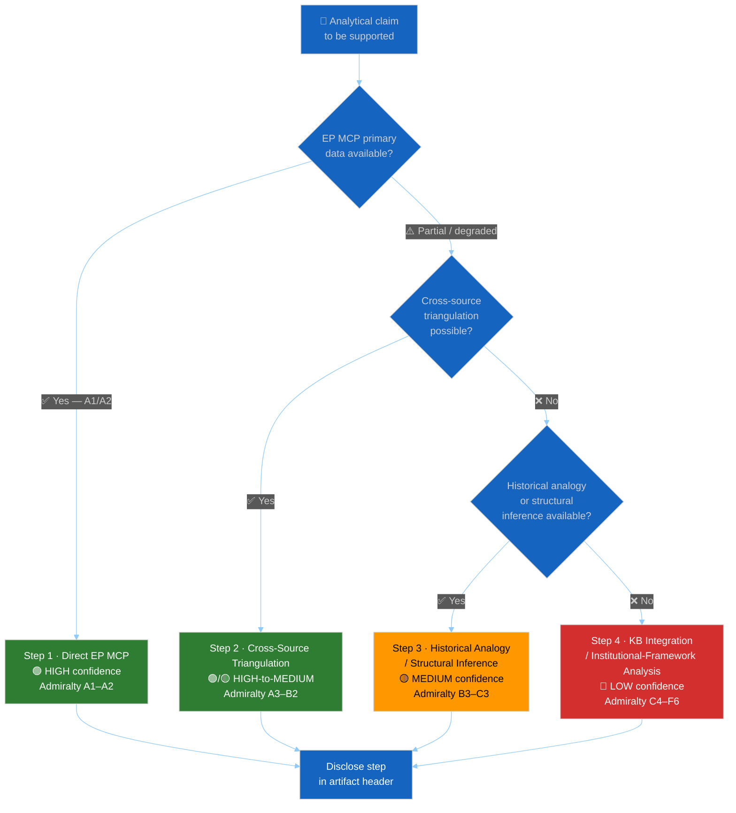

<!-- SPDX-FileCopyrightText: 2024-2026 Hack23 AB -->
<!-- SPDX-License-Identifier: Apache-2.0 -->

<p align="center">
  
</p>

<h1 align="center">🔍 Source Triangulation Methodology</h1>

<p align="center">
  <strong>📊 Formalised 4-Step Fallback Ladder with Confidence-Label Rules</strong><br>
  <em>🎯 Primary Sources · Cross-Source Checks · Structural Inference · KB Integration · Confidence Labelling</em>
</p>

<p align="center">
  <a href="#"></a>
  <a href="#"></a>
  <a href="#"></a>
  <a href="#"></a>
</p>

**📋 Document Owner:** CEO | **📄 Version:** 1.0 | **📅 Last Updated:** 2026-05-14 (UTC)
**🔄 Review Cycle:** Quarterly | **⏰ Next Review:** 2026-08-14
**🏢 Owner:** Hack23 AB (Org.nr 5595347807) | **🏷️ Classification:** Public

---

## 🎯 Purpose

This document codifies the **4-step source-triangulation fallback ladder** that every analytic artifact follows when primary European Parliament MCP data is unavailable, incomplete, or degraded. It defines:

1. When each fallback step activates.
2. How to label confidence at each step using Admiralty grades and 🟢/🟡/🔴 markers.
3. What disclosure to include in the artifact and in `mcp-reliability-audit.md`.

This methodology is **non-optional**: every artifact that reaches Step 2 or beyond must include an explicit `[TRIANGULATION-STEP: N]` marker on every affected claim, naming the fallback method used and its Admiralty grade.

> **Relationship to other documents:** This file documents the *what* and *when* of fallbacks. Admiralty grading rules live in [`osint-tradecraft-standards.md §2`](osint-tradecraft-standards.md). Confidence-marker semantics live in [`confidence-calibration.md`](confidence-calibration.md). IMF-specific fallback rules live in [`imf/cross-source-triangulation.md`](../imf/cross-source-triangulation.md).

---

## 🛡️ ISMS Policy Alignment

| Policy | Relevance |
|---|---|
| [Hack23 AI_Policy](https://github.com/Hack23/ISMS-PUBLIC/blob/main/AI_Policy.md) §3 | Evidence and provenance — every claim must carry a source grade regardless of fallback step |
| [Information Security Policy](https://github.com/Hack23/ISMS-PUBLIC/blob/main/Information_Security_Policy.md) §6 | Evidence handling — degraded-mode evidence must be disclosed, not silently upgraded |
| [Secure Development Policy](https://github.com/Hack23/ISMS-PUBLIC/blob/main/Secure_Development_Policy.md) | Analytic fallbacks are equivalent to SDLC graceful-degradation paths: they must be documented and tested |

---

## 📐 Ladder Overview



---

## 1️⃣ Step 1 — Direct EP MCP Data (Preferred)

**Activates when:** The European Parliament MCP Server returns a complete, current-year, directly-queryable response for the artifact's required data fields.

**Admiralty grade:** A1 (primary EP record, confirmed by multiple tool calls) or A2 (single EP primary record, uncontested).

**Confidence marker:** 🟢 HIGH.

**Disclosure in artifact:** None required beyond the standard `mcp-reliability-audit.md` endpoint ledger entry.

### Qualifying EP MCP Tools for Step 1

| Tool | Source type | Grade |
|------|------------|-------|
| `get_adopted_texts`, `get_procedures` (with document ID) | Direct EP primary record | A1 |
| `get_voting_records` (with plenary session ID) | Direct EP plenary record | A1 |
| `get_mep_details`, `get_committee_info` | Direct EP institutional record | A1 |
| `analyze_coalition_dynamics`, `assess_mep_influence` | EP-derived aggregate | A2 |
| `get_adopted_texts_feed` with `freshness === "augmented"` | EP augmented feed | A2 |

### When Step 1 is Incomplete

Step 1 is considered **incomplete** when:
- The MCP tool returns 4xx/5xx/timeout with no fallback.
- The tool returns 0 results and the `mcp-reliability-audit.md` cannot confirm this is a genuine null-result.
- `dataQualityWarnings` contains `FRESHNESS_FALLBACK_FAILED`.
- The data age is > 21 days for a breaking/weekly run.

Proceed to Step 2 when any of the above apply.

---

## 2️⃣ Step 2 — Cross-Source Triangulation

**Activates when:** Step 1 is incomplete and at least one of the following authoritative secondary sources can corroborate or supplement the claim.

**Admiralty grade:** A3 (multiple B-graded sources + partial A-grade corroboration) or B2 (single well-established secondary source).

**Confidence marker:** 🟢 HIGH if two independent A/B-grade sources agree; 🟡 MEDIUM if only one secondary source available.

**Mandatory disclosure in artifact:**
```
[TRIANGULATION-STEP: 2 — Cross-source triangulation]
Primary MCP data: [describe what was unavailable/degraded]
Secondary source(s) used: [EUR-Lex / Eurostat / ECB / IMF / official MS publication / ...]
Admiralty grade of claim: [A3 / B2 / ...]
Confidence: [🟢 HIGH / 🟡 MEDIUM]
```

### Approved Step-2 Cross-Sources

| Source | Scope | Trust tier | Admiralty grade |
|--------|-------|-----------|----------------|
| **EUR-Lex** | Legislative texts, procedure status | Official EU publication | A3 |
| **Eurostat** | Statistical indicators, demographic data | Official EU statistics | A2 |
| **ECB SDW** | Monetary, inflation (HICP), banking data | Official EU/EA monetary | A2 |
| **IMF SDMX REST** | Economic context (GDP, fiscal, trade) | Global primary (sole authority for economic claims) | A1 for economic claims |
| **World Bank** | Non-economic context (health, education, demographics) | International primary | A2 |
| **Official national-government publications** | Member-state positions, national statistics | Official MS publication | A3 |
| **EP press releases, plenary records (web)** | Committee decisions, group positions | Official EP secondary | B2 |
| **EU Council web portal** | Council positions, presidency texts | Official Council secondary | B2 |

### IMF Cross-Source Discipline

When the EP MCP economic context is unavailable, **IMF remains the sole authoritative economic source**. Follow the IMF fallback ladder documented in [`imf/cross-source-triangulation.md`](../imf/cross-source-triangulation.md):

1. Try IMF SDMX REST → `imf-fetch-data` tool.
2. If unavailable, use IMF WEO April [current year] figures from training data — **must be labelled** as `data-vintage="IMF WEO April YYYY (training-data fallback)"`.
3. Never substitute non-IMF economic projections for IMF WEO even when Step 2 fails — proceed to Step 3 for economic claims only if IMF training-data figures are also unusable.

---

## 3️⃣ Step 3 — Historical Analogy / Structural Inference

**Activates when:** Step 2 is unavailable or returns no usable data, and the analyst can derive the claim from:
- Documented EP historical precedents (prior terms, analogous votes, precedent coalition configurations).
- Structural inference from known institutional rules (Rules of Procedure, Treaty articles, committee mandates).
- Established political-science literature on EP dynamics.

**Admiralty grade:** B3 (pattern consistent with historical evidence, no primary contradiction) or C3 (academic / policy-institute source, not directly confirmed by EP data).

**Confidence marker:** 🟡 MEDIUM. Never 🟢 unless the structural inference is a formal rule (e.g. "absolute majority = 361 seats" is C1, not B3).

**Mandatory disclosure in artifact:**
```
[TRIANGULATION-STEP: 3 — Historical analogy / structural inference]
Primary/secondary MCP data: [describe what was unavailable]
Inference basis: [historical precedent / Rules of Procedure / political-science literature]
Source(s): [procedure ID / RoP article / academic citation]
Admiralty grade of claim: [B3 / C3 / ...]
Confidence: 🟡 MEDIUM
```

### Valid Step-3 Bases

| Basis | Example | Admiralty |
|-------|---------|-----------|
| EP10 seat distribution (fixed institutional fact) | "EPP holds 188 of 720 seats" | A1 (official EP record) |
| EP Rules of Procedure (formal rule) | "Absolute majority = 361" | A1 |
| Prior-term RCV pattern (same issue type) | "EP10 follows EP9 pattern on CAP reform" | B3 |
| CJEU jurisprudence (established) | "Treaty Article 7 requires 4/5 majority" | A1 |
| Academic political-science consensus | "Hooghe/Marks trilateral EP coalition model" | C2 |
| Policy-institute analysis (Bruegel, CEPS, ECFR) | "ECFR: ECR likely to obstruct Rule-of-Law" | C3 |

### What Step 3 Cannot Support

- Vote-count predictions for specific, unnamed votes not yet taken.
- MEP-level position claims not backed by any prior public vote or public statement.
- Economic projections beyond the IMF training-data vintage.

---

## 4️⃣ Step 4 — KB Integration / Institutional-Framework Analysis

**Activates when:** Steps 1–3 are all unavailable or insufficient, and the analyst must rely exclusively on:
- General knowledge-base understanding of EU institutional mechanics.
- Established institutional-framework patterns (e.g. "the Commission typically publishes…", "the Council presidency rotates…").
- Widely-known EP procedural conventions that do not require current data.

**Admiralty grade:** C4 (structural claim, limited corroboration) or F6 (institutional convention, no primary source this run).

**Confidence marker:** 🔴 LOW. Mandatory in all Step-4 claims.

**Mandatory disclosure in artifact:**
```
[TRIANGULATION-STEP: 4 — KB integration / institutional-framework analysis]
All upstream steps: [describe why Steps 1–3 were unavailable]
Basis: [general EU institutional mechanics / KB understanding]
Admiralty grade: [C4 / F6]
Confidence: 🔴 LOW
CAUTION: This claim is based on institutional-framework inference only.
It must NOT be cited in headline judgements or executive-brief conclusions.
```

### Step-4 Scope Limits

Step-4 claims are **admissible only** in:
- "What we do not know" caveat sections.
- Background framing paragraphs with explicit LOW-confidence labelling.
- Monitoring plans ("watch for X to confirm or refute this claim").

Step-4 claims are **inadmissible** in:
- Executive finding / BLUF paragraphs.
- Top-5 findings tables in `synthesis-summary.md`.
- Any section in `scenario-forecast.md` labelled as the "Base" or "Most-likely" scenario.
- `economic-context.md` quantitative claims.

---

## 🔖 Per-Artifact Triangulation Trigger Table

The table below records the **minimum step** reached before a claim may be included in each artifact, and the maximum confidence label allowed.

| Artifact | Max confidence without Step 1 | Step-4 claims allowed? | Notes |
|----------|------------------------------|----------------------|-------|
| `intelligence/synthesis-summary.md` | 🟡 MEDIUM (Step 2) | ❌ Never | Top-5 findings require Step 1 or 2 |
| `intelligence/scenario-forecast.md` | 🟡 MEDIUM (Step 2/3) | ❌ Scenarios only | Background only for Step 3/4 |
| `intelligence/economic-context.md` | 🟡 MEDIUM (Step 2 IMF) | ❌ Never | IMF fallback ladder mandatory |
| `intelligence/coalition-dynamics.md` | 🟡 MEDIUM (Step 3) | ❌ Never | Group composition from Step 1; cohesion from Step 3 |
| `intelligence/threat-model.md` | 🟡 MEDIUM (Step 3) | ⚠️ Background | Label LOW; no headline threat from Step 4 |
| `intelligence/stakeholder-map.md` | 🟡 MEDIUM (Step 2/3) | ⚠️ Background | Never cite Step 4 for power/alignment scores |
| `intelligence/pestle-analysis.md` | 🟡 MEDIUM (Step 3) | ⚠️ Background | Economic dimension requires Step 1/2 |
| `risk-scoring/risk-matrix.md` | 🟡 MEDIUM (Step 2/3) | ❌ Never | Risk likelihood/impact requires ≥Step 2 |
| `extended/voter-segmentation.md` | 🟡 MEDIUM (Step 3) | ⚠️ Background | Eurobarometer first; see [`voter-segmentation-methodology.md`](voter-segmentation-methodology.md) |
| `executive-brief.md` | 🟡 MEDIUM (Step 2) | ❌ Never | Decision-brief quality floor |

---

## 🔗 Disclosure Chain

Every artifact that uses Step 2, 3, or 4 must:

1. Include inline `[TRIANGULATION-STEP: N]` markers on each affected claim.
2. Log every fallback endpoint attempt in `intelligence/mcp-reliability-audit.md` with the step number reached and the resulting Admiralty grade.
3. Record the aggregate step distribution in `intelligence/methodology-reflection.md` §Data sources and provenance table, using a new "Max triangulation step reached" column.

---

## 📋 Quick-Reference Checklist

Run this checklist before submitting any artifact to Stage C:

- [ ] **Step 1 exhausted first**: Every MCP tool relevant to this claim was attempted.
- [ ] **Step markers present**: Every Step-2/3/4 claim carries a `[TRIANGULATION-STEP: N]` marker.
- [ ] **Admiralty grades correct**: Grades match the step table above, not inflated.
- [ ] **Confidence markers correct**: 🟢 only for Step 1; 🟡 for Step 2/3; 🔴 for Step 4.
- [ ] **Step-4 placement**: Step-4 claims appear only in "what we do not know" / background / monitoring sections.
- [ ] **mcp-reliability-audit.md updated**: Step reached and grade recorded for every degraded endpoint.
- [ ] **methodology-reflection.md updated**: "Max triangulation step reached" logged.

---

## 🔗 Related Documents

- [`confidence-calibration.md`](confidence-calibration.md) — unified 🟢/🟡/🔴 + WEP + Admiralty mapping
- [`osint-tradecraft-standards.md §2`](osint-tradecraft-standards.md) — Admiralty grading rules
- [`voter-segmentation-methodology.md`](voter-segmentation-methodology.md) — Eurobarometer fallback rules for voter-segmentation artifacts
- [`imf/cross-source-triangulation.md`](../imf/cross-source-triangulation.md) — IMF-specific triangulation matrix
- [`ai-driven-analysis-guide.md §Step 6`](ai-driven-analysis-guide.md) — where triangulation is applied in the 10-step protocol
- [`per-artifact-methodologies.md`](per-artifact-methodologies.md) — per-artifact required SAT list

---

**Document Control:**
- **Path:** `analysis/methodologies/source-triangulation.md`
- **Classification:** Public
- **Version:** 1.0 — Initial codification of the 4-step fallback ladder derived from methodology-reflection.md patterns observed in 2026-05-14 run set.
- **ISMS Reference:** Hack23/ISMS-PUBLIC AI Policy §3 (Evidence and provenance)
