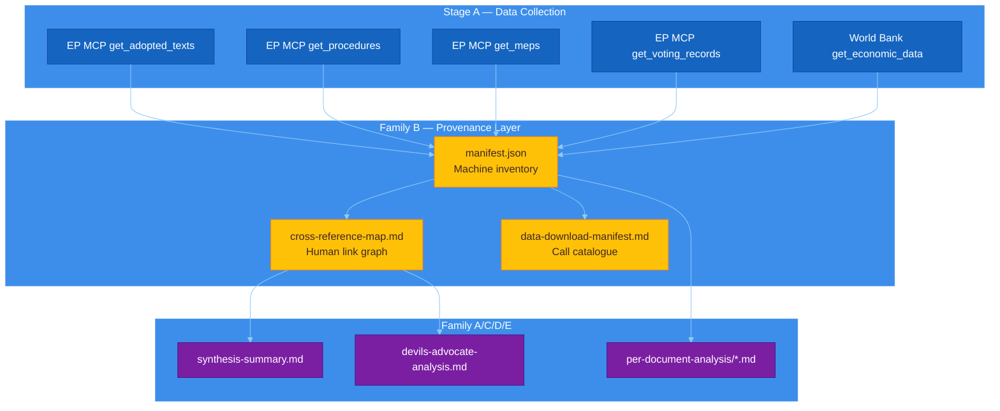
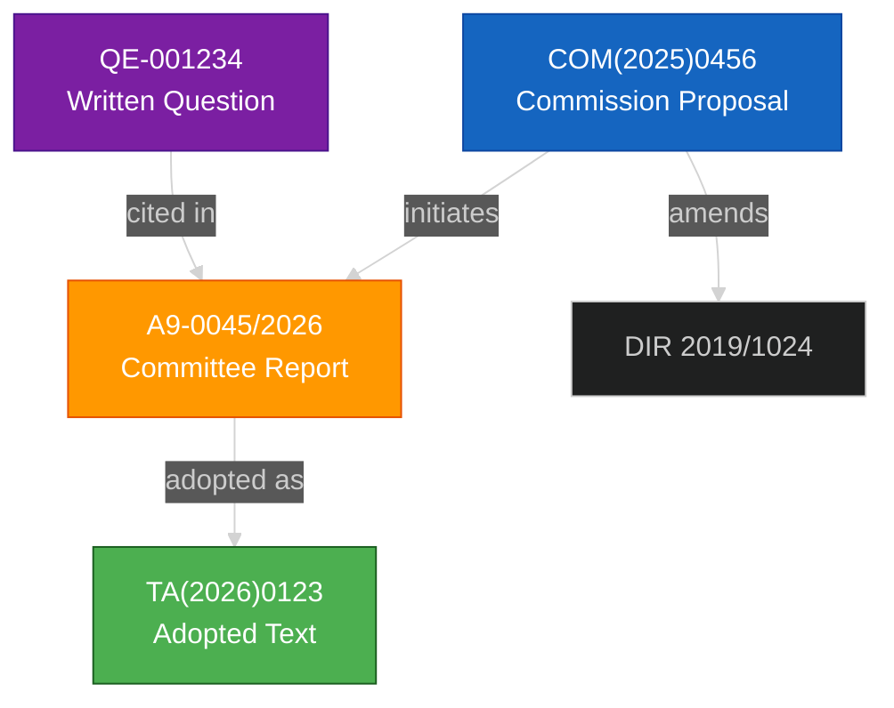

<!-- SPDX-FileCopyrightText: 2024-2026 Hack23 AB -->
<!-- SPDX-License-Identifier: Apache-2.0 -->

<p align="center">
  
</p>

<h1 align="center">📁 Structural Metadata Methodology (Provenance & Linkage)</h1>

<p align="center">
  <strong>📊 Family B — Data Provenance, Cross-Reference Mapping, and Manifest Generation</strong><br>
  <em>🎯 manifest.json · cross-reference-map.md · data-download-manifest.md · Citation Integrity</em>
</p>

<p align="center">
  <a href="#"></a>
  <a href="#"></a>
  <a href="#"></a>
  <a href="#"></a>
</p>

**📋 Document Owner:** CEO | **📄 Version:** 1.0 | **📅 Last Updated:** 2026-04-21 (UTC)
**🔄 Review Cycle:** Quarterly | **⏰ Next Review:** 2026-07-21
**🏢 Owner:** Hack23 AB (Org.nr 5595347807) | **🏷️ Classification:** Public

---

## 🔄 Tradecraft Anchors

| Element | Value | Reference |
|---------|-------|-----------|
| **F3EAD Stage** | **EXPLOIT** — extract and structure metadata from raw data sources | Provenance mapping occurs during data exploitation phase |
| **PIRs Served** | Enables audit trail for all PIR answers — every fact traceable to source | See [`political-style-guide.md` §PIR/EEI](political-style-guide.md#-priority-intelligence-requirements-pir--essential-elements-of-information-eei) |
| **Admiralty Floor** | Manifest records source grade for each data item; cross-reference inherits source grades | See [`political-style-guide.md` §Admiralty](political-style-guide.md#-admiralty-source-reliability-code-nato-stanag-2022) |
| **WEP Requirement** | Not applicable — Family B is metadata, not estimative | N/A |
| **ICD 203 Gate** | Standard 1 (sourcing), Standard 6 (traceable reasoning) | See [`political-style-guide.md` §ICD 203](political-style-guide.md#-icd-203-analytic-tradecraft-standards-mapping) |
| **SAT(s)** | Network Analysis, Chronological Review, Link Analysis | See [`political-style-guide.md` §SATs](political-style-guide.md#-structured-analytic-techniques-sats-catalog) |

---

## 🎯 Purpose

Family B provides the **provenance infrastructure** that makes every analytical claim auditable. It produces three output types:

| Output | Purpose | Consumption |
|--------|---------|-------------|
| **`manifest.json`** | Machine-readable inventory of every data item in the run | Validation scripts, downstream workflows, audit logs |
| **`cross-reference-map.md`** | Human-readable link graph showing document-to-document relationships | Analysts tracing claim provenance, ACH evidence sourcing |
| **`data-download-manifest.md`** | Catalogue of all EP MCP tool calls, parameters, and retrieved datasets | Reproducibility, debugging, GDPR Article 30 compliance |

### Why Provenance Matters

1. **Auditability** — Every claim in Family A/C/D artifacts traces back to a manifest entry
2. **Reproducibility** — Anyone can re-run the same MCP calls and verify data
3. **Integrity** — SHA-256 hashes detect data tampering or drift
4. **GDPR Compliance** — Article 30 requires records of processing activities

---

## 📊 Family B Output Architecture



---

## 📋 Part 1 — `manifest.json` Schema

### Top-Level Structure

```json
{
  "$schema": "https://euparliamentmonitor.com/schemas/manifest-v2.json",
  "version": "2.0",
  "runId": "breaking-2026-04-21-run01",
  "articleType": "breaking",
  "generatedAt": "2026-04-21T14:32:17Z",
  "workflow": "news-breaking-analysis.md",
  "history": [],
  "data": { ... },
  "artifacts": { ... },
  "statistics": { ... }
}
```

### `data` Section — Source Inventory

```json
"data": {
  "epMcp": {
    "adoptedTexts": [
      {
        "docId": "TA(2026)0123",
        "title": "Resolution on Digital Services Act implementation",
        "retrievedAt": "2026-04-21T14:00:05Z",
        "endpoint": "get_adopted_texts",
        "params": { "year": 2026, "limit": 50 },
        "contentHash": "sha256:abc123...",
        "sourceGrade": "A1",
        "wordCount": 4520
      }
    ],
    "procedures": [ ... ],
    "meps": [ ... ],
    "votingRecords": [ ... ],
    "committees": [ ... ],
    "questions": [ ... ]
  },
  "worldBank": {
    "economicIndicators": [
      {
        "indicator": "GDP_GROWTH",
        "countries": ["DE", "FR", "IT", "ES", "PL"],
        "years": 10,
        "retrievedAt": "2026-04-21T14:01:12Z",
        "endpoint": "get_economic_data"
      }
    ]
  },
  "externalSources": [
    {
      "url": "https://data.consilium.europa.eu/...",
      "retrievedAt": "2026-04-21T14:02:30Z",
      "contentHash": "sha256:def456...",
      "sourceGrade": "B2"
    }
  ]
}
```

### `artifacts` Section — Output Inventory

```json
"artifacts": {
  "intelligence": [
    {
      "filename": "synthesis-summary.md",
      "lineCount": 245,
      "minLines": 205,
      "status": "pass",
      "generatedAt": "2026-04-21T15:45:22Z"
    },
    { ... }
  ],
  "classification": [ ... ],
  "risk-scoring": [ ... ],
  "threat-assessment": [ ... ],
  "documents": [ ... ]
}
```

### `statistics` Section — Quality Metrics

```json
"statistics": {
  "totalDataItems": 156,
  "totalArtifacts": 34,
  "artifactsPassing": 34,
  "artifactsFailing": 0,
  "sourceDistribution": {
    "A1": 45,
    "A2": 32,
    "B1": 28,
    "B2": 31,
    "B3": 15,
    "C2": 5
  },
  "politicalGroupCoverage": {
    "EPP": { "mentions": 34, "depthScore": 1.2 },
    "S&D": { "mentions": 28, "depthScore": 1.0 },
    "Renew": { "mentions": 22, "depthScore": 0.95 },
    "Greens/EFA": { "mentions": 18, "depthScore": 0.88 },
    "ECR": { "mentions": 20, "depthScore": 0.92 },
    "PfE": { "mentions": 16, "depthScore": 0.85 },
    "The Left": { "mentions": 14, "depthScore": 0.82 },
    "NI": { "mentions": 8, "depthScore": 0.70 }
  }
}
```

### `history` Section — Run Continuity

```json
"history": [
  {
    "runId": "breaking-2026-04-21-run01",
    "timestamp": "2026-04-21T15:50:00Z",
    "artifactsUpgraded": ["pestle-analysis.md"],
    "artifactsNew": ["executive-brief.md"],
    "artifactsUnchanged": 32
  }
]
```

---

## 🗺️ Part 2 — `cross-reference-map.md` Structure

### Purpose

Human-readable document that maps **which artifacts cite which data sources** and **which documents reference each other**. Enables analysts to trace any claim back to its origin.

### Required Sections

#### 2.1 Artifact → Source Matrix

```markdown
## Artifact → Source Matrix

| Artifact | Primary Sources | Secondary Sources | Source Count |
|----------|-----------------|-------------------|--------------|
| synthesis-summary.md | TA(2026)0123, TA(2026)0124 | QE-001234, A9-0045/2026 | 8 |
| stakeholder-map.md | get_meps(country=DE), get_voting_records | MEP press statements | 12 |
| scenario-forecast.md | get_procedures, get_adopted_texts | World Bank GDP data | 6 |
```

#### 2.2 Document → Document Links

```markdown
## Document → Document Links

| Document A | Relationship | Document B | Evidence |
|------------|--------------|------------|----------|
| COM(2025)0456 | Amends | DIR 2019/1024 | Art. 12 explicit reference |
| TA(2026)0123 | Adopts | A9-0045/2026 | Committee report |
| A9-0045/2026 | References | QE-001234 | Recital 15 citation |
```

#### 2.3 Link Network Mermaid



#### 2.4 Citation Integrity Check

```markdown
## Citation Integrity

| Artifact | Total Claims | Claims Sourced | Unsourced Claims | Integrity % |
|----------|--------------|----------------|------------------|-------------|
| synthesis-summary.md | 24 | 24 | 0 | 100% |
| stakeholder-map.md | 18 | 17 | 1 | 94% |
| devils-advocate-analysis.md | 32 | 32 | 0 | 100% |
```

---

## 📥 Part 3 — `data-download-manifest.md` Structure

### Purpose

Comprehensive log of **every EP MCP tool call** made during the workflow run. Enables reproducibility and GDPR Article 30 compliance.

### Required Sections

#### 3.1 Tool Call Log

```markdown
## EP MCP Tool Calls

| # | Tool | Parameters | Timestamp | Items Retrieved | Duration |
|---|------|------------|-----------|-----------------|----------|
| 1 | `get_adopted_texts` | year=2026, limit=50 | 2026-04-21T14:00:05Z | 47 | 1.2s |
| 2 | `get_procedures` | limit=100, offset=0 | 2026-04-21T14:00:08Z | 100 | 2.1s |
| 3 | `get_meps` | country=DE, active=true | 2026-04-21T14:00:15Z | 96 | 0.8s |
| 4 | `get_voting_records` | dateFrom=2026-04-01 | 2026-04-21T14:00:20Z | 23 | 1.5s |
| 5 | `analyze_coalition_dynamics` | — | 2026-04-21T14:00:25Z | 1 | 3.2s |
```

#### 3.2 Data Volume Summary

```markdown
## Data Volume Summary

| Data Type | Items | Total Size | Avg Size/Item |
|-----------|-------|------------|---------------|
| Adopted Texts | 47 | 2.3 MB | 49 KB |
| Procedures | 100 | 1.8 MB | 18 KB |
| MEP Records | 96 | 0.4 MB | 4 KB |
| Voting Records | 23 | 0.9 MB | 39 KB |
| **Total** | **266** | **5.4 MB** | **20 KB** |
```

#### 3.3 API Response Codes

```markdown
## API Response Codes

| Tool | HTTP 200 | HTTP 4xx | HTTP 5xx | Retries |
|------|----------|----------|----------|---------|
| get_adopted_texts | 1 | 0 | 0 | 0 |
| get_procedures | 1 | 0 | 0 | 0 |
| get_meps | 3 | 0 | 1 | 1 |
| get_voting_records | 1 | 0 | 0 | 0 |
```

#### 3.4 Content Hash Inventory

```markdown
## Content Hash Inventory

| Item ID | SHA-256 (first 16 chars) | Verification |
|---------|--------------------------|--------------|
| TA(2026)0123 | abc123def456... | ✅ Match |
| TA(2026)0124 | 789xyz012abc... | ✅ Match |
| A9-0045/2026 | fedcba987654... | ✅ Match |
```

---

## 🔗 Integration Points

### Manifest Consumption by Validation Scripts

The `src/utils/validate-analysis-completeness.ts` script reads `manifest.json` to:

1. Verify all required artifacts exist
2. Check line counts against `reference-quality-thresholds.json`
3. Validate source grade distribution
4. Generate pass/fail report

### Cross-Reference Consumption by Family C

The `devils-advocate-analysis.md` workflow reads `cross-reference-map.md` to:

1. Source ACH evidence from verified citations
2. Identify document clusters for hypothesis testing
3. Map claim provenance for red-team challenges

### Data Manifest Consumption by Auditors

The `data-download-manifest.md` provides:

1. GDPR Article 30 compliance documentation
2. Debugging information for failed workflows
3. Reproducibility instructions for verification

---

## ✅ Family B Completion Checklist

### `manifest.json`

- [ ] Version 2.0 schema compliant
- [ ] All `data.epMcp` sections populated
- [ ] All `artifacts` have lineCount and status
- [ ] `statistics.sourceDistribution` sums correctly
- [ ] `statistics.politicalGroupCoverage` includes all 8 groups
- [ ] `history` array includes current run entry

### `cross-reference-map.md`

- [ ] Artifact → Source matrix complete
- [ ] Document → Document links section present
- [ ] Link network Mermaid included
- [ ] Citation integrity ≥95% for all artifacts
- [ ] Unsourced claims flagged and explained

### `data-download-manifest.md`

- [ ] All EP MCP tool calls logged with timestamps
- [ ] Data volume summary populated
- [ ] API response codes section present
- [ ] Content hash inventory complete
- [ ] No HTTP 5xx errors unresolved

---

## 🔐 ISMS Alignment

| Control | How this methodology satisfies it |
|---------|----------------------------------|
| ISO 27001 A.5.10 (Information classification) | Manifest records source grades per ICD 203 |
| ISO 27001 A.8.3 (Access control) | Audit trail for all data access via manifest |
| NIST CSF ID.AM-3 (Data flows mapped) | Cross-reference map visualizes data flow |
| NIST CSF PR.DS-6 (Integrity checking) | SHA-256 hashes enable integrity verification |
| CIS 8.1 (Audit log management) | Data download manifest provides audit log |
| GDPR Art. 30 (Records of processing) | Data manifest satisfies processing record requirement |
| NIS2 Art. 21 (Risk management) | Provenance enables risk tracing |

---

## 📄 Document Control

**Owner:** CEO (Intelligence Program) · **Reviewer:** Chief Analyst + CISO · **Review Cycle:** Quarterly
**Next Review:** 2026-07-21 · **Related:** [ai-driven-analysis-guide.md](./ai-driven-analysis-guide.md), [per-document-methodology.md](./per-document-methodology.md), [artifact-catalog.md](./artifact-catalog.md)

---

*Generated following EU Parliament Monitor Structural Metadata Methodology v1.0 — Family B Provenance & Linkage Layer.*
