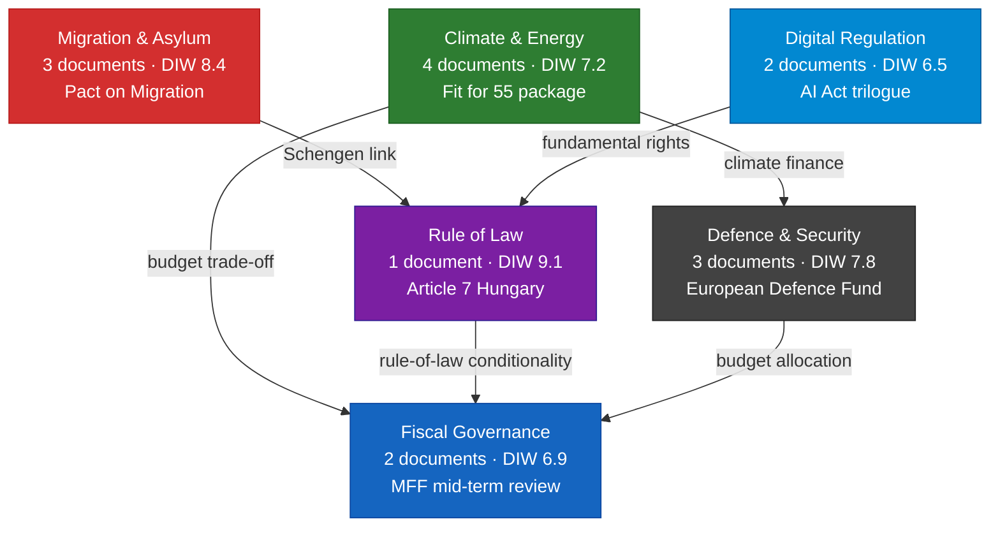
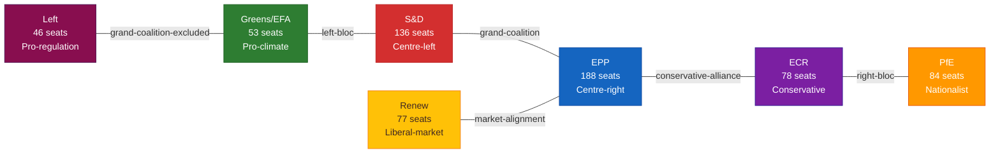
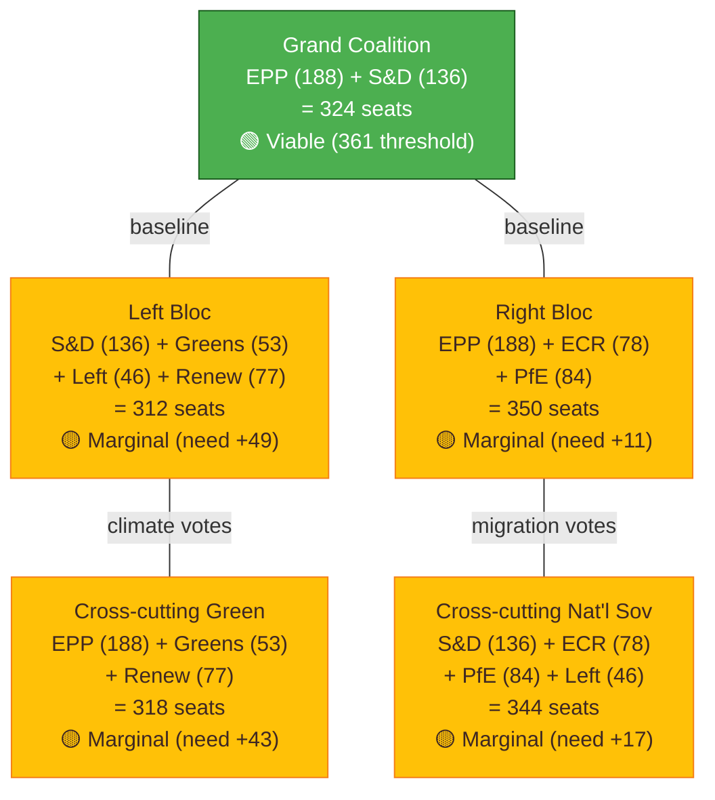
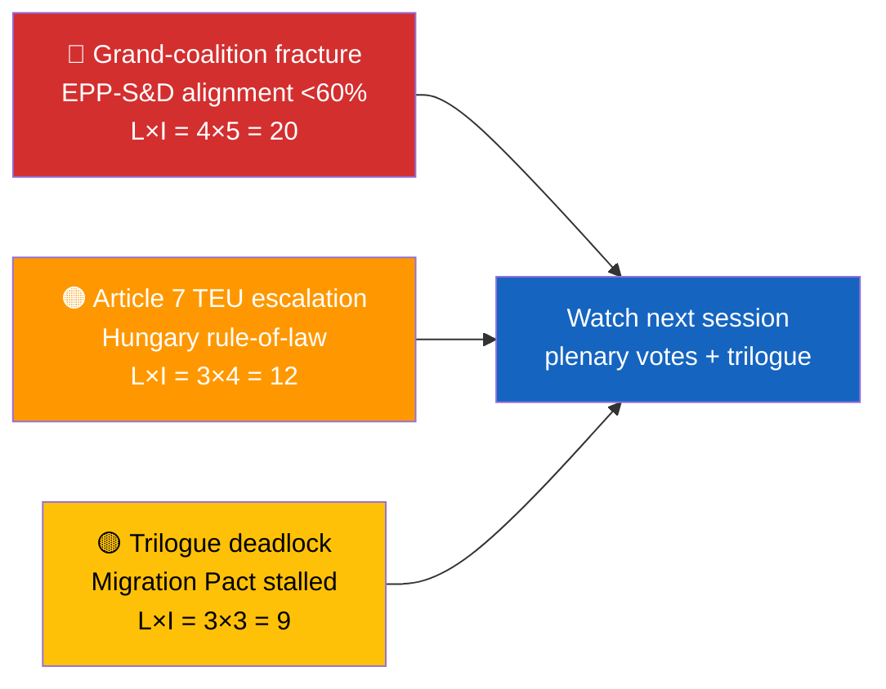

<p align="center">
  
</p>

<h1 align="center">📘 Synthesis & Scoring Methodology — European Parliament</h1>

<p align="center">
  <strong>📊 Stage B.7 — Core Synthesis Layer for EP Political Intelligence</strong><br>
  <em>🎯 Significance Scoring · Synthesis Summary · Stakeholder Perspectives · Coalition Analysis · Executive Briefing</em>
</p>

<p align="center">
  <a href="#"></a>
  <a href="#"></a>
  <a href="#"></a>
  <a href="#"></a>
</p>

**📋 Document Owner:** CEO | **📄 Version:** 1.1 | **📅 Last Updated:** 2026-04-25 (UTC)
**🔄 Review Cycle:** Quarterly | **⏰ Next Review:** 2026-07-31
**🏢 Owner:** Hack23 AB (Org.nr 5595347807) | **🏷️ Classification:** Public

---

## 🔄 Tradecraft Anchors

| Element | Value | Reference |
|---------|-------|-----------|
| **F3EAD Stage** | **ANALYZE → DISSEMINATE** | Synthesis phase converts EP raw evidence into decision-grade intelligence |
| **PIRs Served** | EP Institutional Authority (PIR-1); Coalition Integrity (PIR-2); Legislative Throughput (PIR-4); Trilogue Outcomes (PIR-5); MEP Accountability (PIR-6); Narrative Integrity (PIR-7) — all PIRs inform synthesis | See [`political-style-guide.md` §PIR/EEI Catalog](political-style-guide.md#-priority-intelligence-requirements-pir--essential-elements-of-information-eei) |
| **Admiralty Floor** | Evidence must reach **[B2]** or higher for inclusion in executive brief; MEP attribution claims require **[A1]** | See [`political-style-guide.md` §Admiralty Code](political-style-guide.md#-admiralty-source-reliability-code-nato-stanag-2022) |
| **WEP Requirement** | All forward-looking claims use WEP probability language; voting-pattern predictions use WEP bands with confidence overlay | See [`political-style-guide.md` §WEP + ODNI](political-style-guide.md#-words-of-estimative-probability-wep--odni-confidence-overlay) |
| **ICD 203 Gate** | Standard 5 (customer relevance — actionable for editors/monitors), 6 (logical argumentation), 8 (accurate judgments with confidence labels) | See [`political-style-guide.md` §ICD 203](political-style-guide.md#-icd-203-analytic-tradecraft-standards-mapping) |
| **SAT(s)** | Key Assumptions Check (synthesis-summary), Brainstorming (stakeholder-perspectives), ACH (scenario branches), Quality of Information Check (evidence grading) | See [`political-style-guide.md` §SATs](political-style-guide.md#-structured-analytic-techniques-sats-catalog) |

---

## 🎯 Purpose

This methodology governs **Stage B.7 — Core Synthesis** in the EU Parliament Monitor intelligence production cycle. The synthesis layer transforms raw per-document evidence (Family E / per-file-political-intelligence), structural metadata (data-download-manifest / cross-reference-map), and EP MCP data into **decision-ready intelligence products** answering four questions:

1. **What happened this session/week/day?** (synthesis-summary.md)
2. **Which developments matter most?** (significance-scoring.md)
3. **Who is affected and how?** (stakeholder-perspectives.md + coalition-dynamics.md)
4. **What should a decision-maker do in ≤90 seconds of reading?** (executive-brief.md)

Every output in this layer is produced for **every** analysis workflow — breaking news, week-in-review, month-in-review, plenary analysis, committee reports. No exceptions.

### Scope: 14-Language European Transparency Platform

Every synthesis product must serve citizens across the EU's **14 EUPM platform languages** (EN, FR, DE, ES, IT, PL, RO, NL, EL, HU, PT, CS, SV, BG). While the primary analytic output is produced in English, editorial teams adapt synthesis findings for multi-language publication. Key terminology (e.g., *spitzenkandidaten*, *trilogue*, *Article 7 TEU*, *ordinary legislative procedure*) is glossed on first use to ensure accessibility.

```mermaid
flowchart LR
    classDef evidence fill:#E3F2FD,stroke:#1565C0,color:#0D47A1
    classDef scoring fill:#FFF8E1,stroke:#FFC107,color:#3E2723
    classDef synthesis fill:#E8F5E9,stroke:#4CAF50,color:#1B5E20
    classDef brief fill:#F3E5F5,stroke:#7B1FA2,color:#311B92
    classDef stakeholder fill:#FFF3E0,stroke:#FF9800,color:#BF360C

    E[Per-document<br/>intelligence (Family E)]:::evidence
    M[EP MCP data<br/>get_meps, get_voting_records,<br/>get_adopted_texts, etc.]:::evidence
    B[Manifest + xref map<br/>(provenance layer)]:::evidence
    
    S1[significance-scoring.md<br/>📊 rank + DIW]:::scoring
    S2[synthesis-summary.md<br/>📋 narrative synthesis]:::synthesis
    S3[stakeholder-perspectives.md<br/>🎭 political-group views]:::stakeholder
    S4[coalition-dynamics.md<br/>💥 grand-coalition analysis]:::stakeholder
    S5[executive-brief.md<br/>⚡ ≤90s decision brief]:::brief

    E --> S1
    M --> S1
    B --> S1
    S1 --> S2
    S1 --> S3
    S3 --> S4
    S2 --> S5
    S4 --> S5
```

---

## 📐 Evidence & Confidence Standards

All outputs in this layer inherit the platform-wide rules from [`osint-tradecraft-standards.md`](osint-tradecraft-standards.md):

| Rule | Applied To | EP-Specific Adaptation |
|------|-----------|------------------------|
| Every claim cites a document reference number, named MEP with political group, vote count, plenary session ID, or primary-source URL | All five outputs | EP document refs: COM(2024) 123, A9-0123/2024, B9-0456/2024, RC-B9-0789/2024; MEP format: "Name SURNAME (Group/Country)" |
| 5-level confidence scale — 🟦 VERY HIGH / 🟩 HIGH / 🟧 MEDIUM / 🟥 LOW / ⬛ VERY LOW | Required per scored row | Voting-record data from `get_voting_records` achieves 🟦 VERY HIGH; leaked committee drafts max at 🟥 LOW |
| Color-coded Mermaid using canonical Hack23 palette | ≥1 per output | EPP blue (#1565C0), S&D red (#D32F2F), Renew yellow (#FFC107), Greens/EFA green (#2E7D32), ECR purple (#7B1FA2), PfE orange (#FF9800), Left maroon (#880E4F) |
| EU policy terms glossed on first use | Synthesis + executive brief | *spitzenkandidaten* (lead candidates), *trilogue* (EP-Council-Commission negotiation), *Article 7 TEU* (rule-of-law suspension procedure), *ordinary legislative procedure* (codecision) |
| Political-group neutrality — equal analytical depth for EPP, S&D, Renew, Greens/EFA, ECR, PfE, Left, and non-attached MEPs when evidence supports coverage | All outputs | No group receives default priority; depth follows evidence density and democratic impact |

### EP Document Identifier Format

EU Parliament Monitor uses **standardized EP document identifiers** throughout synthesis products:

| Document Type | Format Example | Description |
|--------------|----------------|-------------|
| **Commission proposals** | COM(2024) 123 final | Legislative proposals from European Commission |
| **EP Reports** | A9-0123/2024 | Committee reports from EP standing committees |
| **EP Motions for resolution** | B9-0456/2024 | Political group or MEP resolutions |
| **Joint motions** | RC-B9-0789/2024 | Joint resolutions across multiple groups |
| **Amendments** | AM 123-456 | Amendment numbers in committee/plenary |
| **Written questions** | E-000123/2024 | MEP questions to Commission/Council |
| **Oral questions** | O-000045/2024 | MEP oral questions for debate |

---

## 🔢 Part 1 — Significance Scoring (`significance-scoring.md`)

### Purpose
Rank every document/development processed in the workflow so downstream products (synthesis, executive brief, news articles) can focus attention where it matters. Significance scoring is the **single source of truth** for priority across all Family A, C, and D intelligence products.

### Input
- All per-file-political-intelligence analyses produced during the workflow
- EP MCP data: `get_adopted_texts`, `get_voting_records`, `get_procedures`, `search_documents`
- Cross-reference-map.md (to detect bundle / coordinated activity multipliers)
- Previous session's significance-scoring.md (for trend comparison)

### Output — Required Structure

1. **Scoring matrix table** — one row per development, columns:
   - `Rank` · `Document/Event ID` · `Title (short)` · `Type` · `Democratic-Impact Weight (DIW)` · `Tier` · `Confidence` · `Top rationale (≤25 words)`
2. **Tier distribution summary** — count of P0 / P1 / P2 / P3 developments
3. **DIW color-coded distribution** — horizontal bar Mermaid using canonical EP political-group palette
4. **Drivers of top-ranked items** — bulleted rationale for every P0 + P1 entry with document-ref citations
5. **Trend comparison** — delta vs. previous session/week with notable shifts highlighted

### DIW Formula — EP-Adapted Canonical

Democratic-Impact Weight (DIW) is scored 0.0 – 10.0 along **six dimensions**, each 0.0 – 1.0 normalised, summed, then multiplied by 10 ÷ 6 for the final 0–10 scale:

| Dimension | Weight | Example High-Score Indicator (EP Context) |
|-----------|:------:|-------------------------------------------|
| 🏛️ **Institutional reach** | 1.0 | Treaty amendment (TEU/TFEU), election law change (Electoral Act reform), EP Rules of Procedure amendment, Article 7 TEU trigger |
| ⚖️ **Rights & freedoms impact** | 1.0 | Charter of Fundamental Rights Article invocation, GDPR derogation, freedom-of-movement restriction, rule-of-law conditionality |
| 💰 **Fiscal magnitude** | 1.0 | ≥1% of EU budget (€1.86B in 2024), ≥10M direct beneficiaries across member states, MFF (Multi-annual Financial Framework) revision |
| 🗳️ **Electoral salience** | 1.0 | Pre-election window (≤6 months to EP election) + top-10 Eurobarometer priority issue, spitzenkandidaten positioning, national-delegation campaign issue |
| 🔀 **Coalition pressure** | 1.0 | Forces deviation from EPP-S&D grand coalition baseline, triggers PfE/ECR pivot, splits national delegations (e.g., Fidesz vs. mainstream EPP) |
| 📡 **Media resonance** | 1.0 | Coordinated political-group response, Commission President statement, Council emergency meeting, trending #EP hashtag, front-page coverage in ≥3 major EU outlets |

### Tier Mapping

| Tier | DIW Range | Trigger | Downstream Template Set |
|:----:|:---------:|---------|-------------------------|
| **P0 (Critical)** | ≥ 8.0 | Constitutional/treaty-level, Article 7, major trilogue breakdown, election interference | All Family C + D templates; dedicated deep-analysis |
| **P1 (High)** | 6.0 – 7.9 | Significant legislation (climate, migration, defence), grand-coalition test, national-delegation fracture | Scenario-forecast, devils-advocate, stakeholder-impact, threat-model |
| **P2 (Medium)** | 4.0 – 5.9 | Routine legislative procedure, committee report adoption, standard resolutions | Synthesised in summary; listed in index |
| **P3 (Low)** | < 4.0 | Procedural motions, technical amendments, administrative decisions | Listed in manifest, not narrated unless part of cluster |

### Quality Gate
- [ ] Every development has a DIW in [0.0, 10.0] with transparent calculation per dimension
- [ ] DIW cross-checks against per-file-political-intelligence significance — ≤1.5 variance or reconciled with rationale
- [ ] Tier counts reconcile with data-download-manifest total document count
- [ ] Top five rationales each cite ≥2 document refs and ≥1 named MEP with political group
- [ ] No tier inflation: baseline EP routine legislative activity scores 3.5–5.0; only exceptional events exceed 7.0

### Example DIW Calculation — Worked EP Scenario

**Document:** B9-0123/2024 — Joint motion on Article 7 TEU procedure against Poland (rule-of-law concerns)

| Dimension | Score | Rationale |
|-----------|:-----:|-----------|
| Institutional reach | 1.0 | Article 7 TEU is the EU's nuclear option — treaty-level enforcement |
| Rights & freedoms | 0.9 | Judicial independence (Charter Article 47) at stake |
| Fiscal magnitude | 0.4 | Potential €10B cohesion fund suspension (indirect) |
| Electoral salience | 0.8 | Pre-election positioning on rule of law; Eurobarometer #3 priority |
| Coalition pressure | 1.0 | Splits EPP (Polish delegation vs. mainstream); tests grand coalition |
| Media resonance | 1.0 | Front-page across EU; Commission/Council emergency statements |
| **Total** | **5.1 / 6.0** | **DIW = (5.1 ÷ 6) × 10 = 8.5** → **P0 (Critical)** |

---

## 📋 Part 2 — Synthesis Summary (`synthesis-summary.md`)

### Purpose
Produce the **canonical narrative** of the session/week/cycle. Every other Family A product derives its headline from this file. The synthesis-summary is the single file a decision-maker reads if they have only **5 minutes** before a briefing or editorial decision.

### Input
- significance-scoring.md (drives ordering and selection)
- All per-file-political-intelligence analyses (drives substantive detail)
- cross-reference-map.md (drives "bundle" and "pattern" callouts)
- EP MCP: `get_plenary_sessions`, `get_voting_records`, `analyze_coalition_dynamics`, `compare_political_groups`
- Previous 5 sessions' synthesis-summary files (for trend narration and shift detection)

### Output — Required Structure

1. **Executive summary** — 3–4 paragraphs, inverted-pyramid style:
   - **Paragraph 1 (BLUF):** Single most significant finding with document ref, MEP/group attribution, vote count if applicable, confidence label
   - **Paragraph 2:** Second-tier finding with evidence chain
   - **Paragraph 3:** Contextual placement (trend vs. prior sessions, coalition implications)
   - **Paragraph 4 (optional):** Forward indicator — what to watch in next 7/30/90 days
2. **Strategic finding cards** — 5–9 cards, one per major theme; each card contains:
   - **Finding** (≤60 words, headline statement)
   - **Evidence** (≥3 document refs or vote counts with Admiralty grades)
   - **Confidence label** (🟦/🟩/🟧/🟥/⬛ with ODNI justification)
   - **Dissenting view** (alternative interpretation or counter-hypothesis, ≤40 words)
   - **Forward indicator** (concrete observable event with ISO date or session reference)
3. **Pattern table** — coordinated filings (joint motions), cross-group consensus (unanimous votes), grand-coalition tests, national-delegation splits
4. **Thematic network Mermaid** — color-coded nodes by theme (using EP political-group palette), edges weighted by cross-reference strength from cross-reference-map
5. **Coalition dynamics snapshot** — EPP+S&D grand coalition cohesion score, left-of-centre bloc (S&D+Greens/EFA+Left), right-of-centre bloc (EPP+ECR+PfE), cross-cutting alliances
6. **Links** to: executive-brief.md, stakeholder-perspectives.md, coalition-dynamics.md, scenario-forecast.md (always produced), per-file-political-intelligence index
7. **Methodology footer** — EP MCP tools used, data cutoff time (CET), confidence-in-evidence distribution, SATs applied (≥3 named)

### Required Mermaid — Thematic Network



### Quality Gate
- [ ] Top-ranked P0/P1 items from significance-scoring appear in first 5 strategic finding cards
- [ ] Every card cites ≥3 primary sources (document refs or vote records) with Admiralty grades
- [ ] Confidence labels distributed realistically (not every card "🟩 HIGH" — expect 🟧 MODERATE for forward-looking claims)
- [ ] EU policy terms glossed on first use with parenthetical English equivalents
- [ ] Thematic Mermaid includes all themes mentioned in strategic finding cards
- [ ] Coalition dynamics snapshot uses **current EP10 seat counts** (post-2024 election): EPP 188, S&D 136, Renew 77, Greens/EFA 53, ECR 78, PfE 84, Left 46, NI 58 (total 720 seats; majority threshold: 361)
- [ ] No partisan framing — equal analytical depth across political groups; dissenting views included for every major finding

### Political-Group Seat Distribution Reference (EP10, 2024–2029)

Use these **verified seat counts** in all coalition-dynamics analysis:

| Group | Seats | % | Bloc Lean | National Strength |
|-------|:-----:|:-:|-----------|-------------------|
| **EPP** (European People's Party) | 188 | 26.1% | Centre-right | DE (30), PL (21), ES (22), FR (6), RO (11) |
| **S&D** (Progressive Alliance of Socialists & Democrats) | 136 | 18.9% | Centre-left | DE (16), ES (21), IT (21), RO (9), PL (6) |
| **Renew** (Renew Europe) | 77 | 10.7% | Liberal | FR (23), NL (8), BE (7), RO (8), CZ (7) |
| **Greens/EFA** (Greens/European Free Alliance) | 53 | 7.4% | Left-green | DE (12), FR (13), NL (3), BE (3), SE (4) |
| **ECR** (European Conservatives & Reformists) | 78 | 10.8% | Right-conservative | PL (20), IT (24), CZ (10), SE (4), BE (3) |
| **PfE** (Patriots for Europe) | 84 | 11.7% | Right-nationalist | FR (30), IT (8), HU (11), NL (6), AT (6), CZ (7) |
| **Left** (The Left) | 46 | 6.4% | Left | FR (9), DE (5), ES (6), GR (6), PT (5), NL (1) |
| **NI** (Non-Inscrits / Non-attached) | 58 | 8.1% | Mixed | DE (16), HU (1), SK (2), BG (6), Others |
| **TOTAL** | **720** | 100% | — | 27 member states |

---

## 🎭 Part 3 — Stakeholder Perspectives (`stakeholder-perspectives.md`)

### Purpose
Document **how every political group with material stake** interprets the session's findings — from their documented position (votes, resolutions, speeches), not the analyst's projection. This artifact ensures political neutrality by giving equal structured space to all eight EP political groups.

### Input
- significance-scoring.md (drives which items to cover)
- EP MCP: `get_speeches`, `search_documents`, `get_parliamentary_questions`, `get_meps` (filtered by political group)
- Per-file-political-intelligence analyses (carry group spokesperson statements)
- `analyze_voting_patterns` output per political group for covered session
- Eurobarometer polling (where identity of affected electorate matters)

### Output — Required Structure

1. **Actor × Issue matrix** — rows: political groups (EPP, S&D, Renew, Greens/EFA, ECR, PfE, Left, NI + Commission + Council + key external actors like national governments); columns: top 7 issues from significance-scoring
   - Each cell: position statement (≤30 words), vote pattern if applicable, confidence in attribution
2. **Per-group narrative cards** — one card per political group:
   - **Group name** with seat count and lead MEP names
   - **Core position** on session's #1 ranked item (≤80 words, citing speeches or resolutions)
   - **Coalition posture** — alignment with grand coalition, left bloc, right bloc, or ad-hoc cross-cutting alliance
   - **Notable dissent** — internal group splits or national-delegation fractures (if observable)
   - **Forward stance** — stated intent for next session/trilogue (≤40 words with document ref)
3. **Position-spectrum Mermaid** — horizontal axis from left to right; nodes sized by seat count; color-coded by group; edges show coalition alignment on session's top issue
4. **National-delegation callouts** — where a member-state delegation breaks from its group's majority position (e.g., Polish EPP vs. mainstream EPP on rule-of-law)
5. **Commission/Council positions** — Executive stance on legislative proposals, Council negotiating position in trilogue
6. **External-actor signals** — significant national-government interventions (e.g., German coalition statement, French President remarks) that shape EP dynamics
7. **Confidence assessment** — per-group attribution confidence with Admiralty grading of source speeches/votes

### Required Mermaid — Position Spectrum



### Quality Gate
- [ ] Every political group (8 groups + NI) has at least one narrative card
- [ ] Actor × Issue matrix complete for top 7 issues — no empty cells (use "no stated position" if group silent)
- [ ] Every position statement cites ≥1 primary source: speech (anförande equivalent), resolution, vote record, written question
- [ ] National-delegation callouts cite specific MEP names with countries
- [ ] Position-spectrum Mermaid uses verified EP10 seat counts (EPP 188, S&D 136, etc.)
- [ ] Commission/Council positions cited from official statements or press releases (not speculation)
- [ ] Confidence labels reflect source quality: speeches = 🟩 HIGH; leaked draft positions = 🟥 LOW

---

## 💥 Part 4 — Coalition Dynamics (`coalition-dynamics.md`)

### Purpose
Analyze **grand-coalition arithmetic, bloc formation, and pivotal-actor power** in the European Parliament. Unlike national parliaments with binary government/opposition, the EP operates through **shifting coalitions** per policy area. This artifact quantifies coalition viability, voting-pattern alignment, and political-group leverage.

### Input
- significance-scoring.md (identifies votes requiring coalition analysis)
- EP MCP: `analyze_coalition_dynamics`, `compare_political_groups`, `detect_voting_anomalies`, `get_voting_records`
- stakeholder-perspectives.md (group positions feed coalition-formation hypotheses)
- `correlate_intelligence` output (cross-tool OSINT correlation for elevated-attention coalition signals)

### Output — Required Structure

1. **Grand-coalition baseline** — EPP+S&D voting alignment score (0–100%) for session; trend vs. prior sessions; threshold watch (below 60% signals fracture risk)
2. **Bloc-formation table** — for each major policy area (climate, migration, fiscal, rule-of-law, defence, digital):
   - **Left-of-centre** (S&D+Greens/EFA+Left+Renew): seat count, cohesion %, viability vs. 361-seat majority
   - **Right-of-centre** (EPP+ECR+PfE): seat count, cohesion %, viability vs. 361-seat majority
   - **Grand coalition** (EPP+S&D): seat count, cohesion %, viability (always ≥361 arithmetically, but cohesion determines reliability)
   - **Ad-hoc cross-cutting** (e.g., EPP+Greens/EFA on climate; S&D+ECR on national sovereignty): observed instances with vote refs
3. **Pivotal-actor analysis** — using **Banzhaf power index** for each group across observed coalitions:
   - Which group(s) are pivotal (i.e., their defection flips the outcome) most frequently
   - Renew's "kingmaker" role in 50–50 EPP-S&D splits
   - National-delegation swing power (e.g., Polish EPP delegation on rule-of-law votes)
4. **Coalition-fracture signals** — outputs from `detect_voting_anomalies`:
   - Any political group with ≥20% internal dissent on a P0/P1 vote
   - National delegations splitting >40% from group line
   - Unexpected cross-bloc alliances (severity: HIGH/MEDIUM/LOW with trend)
5. **Scenario branching** — for next session's anticipated P0 votes:
   - **Scenario A (Grand coalition holds):** EPP+S&D ≥70% alignment → policy passes
   - **Scenario B (Left bloc forms):** S&D+Greens/EFA+Left+partial Renew ≥361 seats → alternative policy
   - **Scenario C (Right bloc forms):** EPP+ECR+PfE ≥361 seats → conservative policy
   - **Scenario D (Stalemate):** No coalition reaches 361 → trilogue deadlock or procedural delay
6. **Coalition-viability Mermaid** — color-coded by bloc; nodes sized by seat count; edges by observed voting alignment
7. **Confidence assessment** — voting-record data achieves 🟦 VERY HIGH; coalition-cohesion predictions based on historical patterns achieve 🟧 MODERATE

### Required Mermaid — Coalition Viability Network



### Quality Gate
- [ ] Grand-coalition alignment score calculated from ≥3 plenary votes in the session
- [ ] Every bloc scenario cites specific vote records (document refs + roll-call IDs)
- [ ] Pivotal-actor Banzhaf index computed from actual vote data, not assumed
- [ ] Coalition-fracture signals cross-referenced with `detect_voting_anomalies` output (severity labels match)
- [ ] Scenario probabilities sum to 100%; each scenario has ≥1 concrete triggering vote
- [ ] Seat arithmetic verified against EP10 distribution (EPP 188, S&D 136, etc.)
- [ ] No speculation on "secret deals" or informal agreements without documentary evidence (speeches, resolutions, press statements)

---

## ⚡ Part 5 — Executive Brief (`executive-brief.md`)

### Purpose
Produce the **≤90-second decision-grade briefing** for editors, duty officers, and senior monitors. This is the **BLUF (Bottom Line Up Front)** intelligence product that answers: "Should we publish this story? What's the lead? What's at stake?"

### Input
- synthesis-summary.md (provides canonical narrative)
- significance-scoring.md (provides priority ranking)
- coalition-dynamics.md (provides political arithmetic)
- stakeholder-perspectives.md (provides actor positions)
- risk-assessment.md (provides threat/risk scores)

### Output — Required Structure

1. **Brief metadata block**:
   - Brief ID (e.g., `EB-2024-05-15-breaking-001`)
   - Generated timestamp (UTC)
   - Scope (session/week/month)
   - Documents covered (count)
   - Overall confidence (🟦/🟩/🟧/🟥/⬛)
   - Publication recommendation (PUBLISH / ANALYSIS-ONLY / MONITOR / SKIP)
   - PIR relevance (primary PIRs addressed)
2. **BLUF (Bottom Line Up Front)** — 2–4 sentences:
   - Lead with #1 DIW-ranked finding
   - Name principal MEP/group with country where relevant
   - State concrete action taken or vote outcome
   - Quantify impact (seats, budget, affected population, member states)
   - End with confidence label and top source
3. **3 Decisions This Brief Supports** — table format:
   - **Decision** (what needs deciding)
   - **Who decides** (role: editor-in-chief, duty monitor, analysis lead, etc.)
   - **Deadline** (timestamp or session reference)
   - **Evidence** (document ref or vote count supporting the decision)
4. **60-Second Read** — 8-bullet distillation using color-coded emoji markers:
   - 🔴 **Top development** — who, what, where, when; cite document ref
   - 🟠 **Second development** — named actor, quantified effect
   - 🟢 **Positive development** or win for democratic accountability
   - 🟡 **Point of tension** or ambiguity
   - 🔵 **Data point** — Eurostat/ECB/IMF (primary economic) or World Bank (non-economic) figure with year
   - 🟣 **Cross-reference** — link to another document or cluster
   - 🩷 **Emerging threat** — political-threat-landscape dimension
   - ⚪ **Carry-forward** — only if relevant from prior session
5. **Top Documents Table (DIW-ranked)** — top 5 items:
   - Rank · Document ref · Title (short) · DIW · Confidence · Status (adopted/pending/rejected)
6. **Risk & Threat Snapshot** — Mermaid flowchart or table:
   - Top 3 risks from risk-matrix.md with Likelihood × Impact scores
   - Trigger events and session/date references
   - Source artifact and Admiralty grade
7. **Top Forward Trigger** — single most important event to watch next:
   - Event description with session/date
   - What its outcome would change (specific hypothesis or finding)
   - Fallback indicator if primary event delayed
8. **Links** — paths to synthesis-summary, significance-scoring, risk-assessment, coalition-dynamics, data-download-manifest, per-file-political-intelligence index

### Required Mermaid — Risk & Threat Snapshot



### Quality Gate
- [ ] BLUF ≤4 sentences; no jargon; names principal actor with political group/country
- [ ] 60-second read bullets complete (8 bullets) with emoji markers
- [ ] Top 5 documents match significance-scoring.md rank order
- [ ] Risk snapshot cites risk-matrix.md with matching risk IDs
- [ ] Top forward trigger includes concrete observable event with ISO date or session reference
- [ ] Publication recommendation justified by DIW distribution (P0 → PUBLISH; all P3 → SKIP)
- [ ] Links section complete — no broken internal references
- [ ] Overall confidence label reflects lowest-confidence critical finding (conservative aggregation)

---

## ✅ Synthesis-Layer Completion Checklist

Before advancing to Family C (Strategic Extensions), verify:

- [ ] `significance-scoring.md` — DIW table complete, tier distribution computed, top rationales cite ≥2 sources each
- [ ] `synthesis-summary.md` — executive summary (3–4 paragraphs), strategic finding cards (5–9), thematic Mermaid, coalition snapshot
- [ ] `stakeholder-perspectives.md` — actor × issue matrix complete (8 groups + NI + Commission + Council), per-group narrative cards, position-spectrum Mermaid
- [ ] `coalition-dynamics.md` — grand-coalition alignment score, bloc-formation table, pivotal-actor Banzhaf index, coalition-viability Mermaid
- [ ] `executive-brief.md` — BLUF (≤4 sentences), 3 decisions table, 60-second read (8 bullets), top-5 documents, risk snapshot Mermaid, forward trigger
- [ ] Every file cites ≥3 primary EP sources (document refs, vote records, speeches) with Admiralty grades
- [ ] Every file includes ≥1 color-coded Mermaid diagram using Hack23 canonical palette + EP political-group colors
- [ ] Confidence labels distributed realistically (expect 🟧 MODERATE for forward-looking claims; 🟦 VERY HIGH for vote-record facts)
- [ ] Political-group neutrality maintained — no group receives default favorable/unfavorable framing
- [ ] All EP policy terms glossed on first use (spitzenkandidaten, trilogue, Article 7 TEU, etc.)
- [ ] Coalition arithmetic uses verified EP10 seat counts (EPP 188, S&D 136, Renew 77, etc.)

---

## 🔗 Template Bindings

| Template | Methodology Section | Depth Floor (lines) |
|----------|---------------------|:-----------------:|
| `analysis/templates/significance-scoring.md` | Part 1 | 105 (breaking) |
| `analysis/templates/synthesis-summary.md` | Part 2 | 205 (breaking) |
| `analysis/templates/stakeholder-perspectives.md` | Part 3 | 200 (breaking) |
| `analysis/templates/coalition-dynamics.md` | Part 4 | 135 (breaking) |
| `analysis/templates/executive-brief.md` | Part 5 | 100 (breaking) |

See [`artifact-catalog.md`](./artifact-catalog.md) for full template-to-methodology mapping.

---

## 📐 Cross-References to Other Methodologies

- **Upstream provenance:** [structural-metadata-methodology.md](./structural-metadata-methodology.md) (data-download-manifest, cross-reference-map)
- **Downstream extensions:** [strategic-extensions-methodology.md](./strategic-extensions-methodology.md) (scenario-forecast, devils-advocate, intelligence-assessment)
- **Per-document foundation:** [per-document-methodology.md](./per-document-methodology.md) (per-file-political-intelligence)
- **Frameworks:** [political-classification-guide.md](./political-classification-guide.md) · [political-swot-framework.md](./political-swot-framework.md) · [political-risk-methodology.md](./political-risk-methodology.md) · [political-threat-framework.md](./political-threat-framework.md)
- **Style:** [political-style-guide.md](./political-style-guide.md) (PIRs, Admiralty Code, WEP, ICD 203, SATs)
- **Master protocol:** [ai-driven-analysis-guide.md](./ai-driven-analysis-guide.md) (10-step workflow, 2-pass iterative improvement)
- **Tradecraft standards:** [osint-tradecraft-standards.md](./osint-tradecraft-standards.md) (source grading, WEP discipline, SAT catalog, ICD 203 mapping)

---

## 🔐 ISMS Alignment

| Control | How This Methodology Satisfies It | Verification |
|---------|----------------------------------|--------------|
| ISO 27001 A.5.10 (Appropriate use of information) | Only public EP data via MCP; no leaked documents; no personal-life profiling | Manifests cite public EP Open Data Portal endpoints |
| ISO 27001 A.5.12 (Classification) | DIW tier assignment = classification per document; P0/P1/P2/P3 drives access/distribution | Every significance-scoring.md file includes tier distribution |
| ISO 27001 A.5.14 (Information transfer) | Synthesis products cite source artifacts with full provenance chain | Every finding card cites ≥3 primary sources with Admiralty grades |
| ISO 27001 A.5.34 (Privacy / PII) | MEPs analyzed only in public parliamentary role; Eurobarometer aggregates only; no voter-file profiling | Stakeholder-perspectives.md limited to group/delegation positions |
| NIST CSF ID.AM-5 (Resources prioritized by classification) | P0/P1 trigger full Family C/D templates; P2/P3 synthesis-only | Artifact-catalog.md maps tier → template set |
| NIST CSF PR.IP-9 (Response/recovery plans) | Cross-references support dependency mapping for incident response | Cross-reference-map.md links documents/actors/themes |
| CIS 3.2 (Inventory of data) | Each synthesis file = one inventory record with provenance | Data-download-manifest.md + analysis-index.md |
| GDPR Art. 5(1)(a)(b)(c) | Purpose limitation (democratic transparency), data minimization (public data only), accuracy (EP MCP verified) | Methodology footer in every file declares data sources and limits |
| NIS2 Art. 21 (Cybersecurity risk management) | No citizen surveillance; no non-public data collection; only official EP sources | OSINT scope enforcement per osint-tradecraft-standards.md §5.2 |

---

## 📄 Document Control

**Owner:** CEO (Intelligence Program) · **Reviewer:** CISO + Chief Political Analyst · **Review Cycle:** Quarterly
**Next Review:** 2026-07-31 · **Related:** [ai-driven-analysis-guide.md](./ai-driven-analysis-guide.md), [strategic-extensions-methodology.md](./strategic-extensions-methodology.md), [structural-metadata-methodology.md](./structural-metadata-methodology.md), [per-document-methodology.md](./per-document-methodology.md), [artifact-catalog.md](./artifact-catalog.md)

---

*Generated following EU Parliament Monitor Synthesis & Scoring Methodology v1.0 — Stage B.7 Core Synthesis Layer.*
